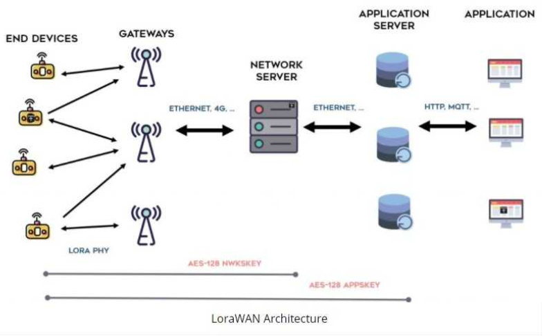
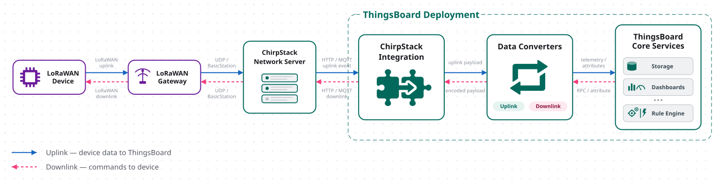
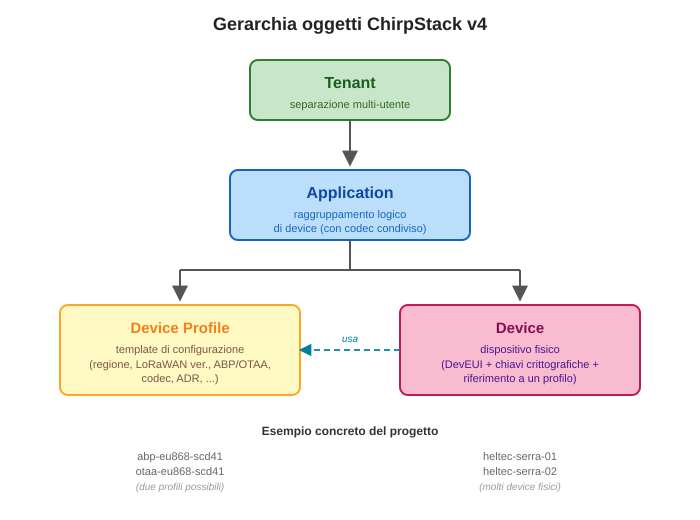

# Dispensa: configurare ChirpStack per stazioni ambientali LoRaWAN

Guida pratica alla configurazione di **ChirpStack v4** come LoRaWAN Network Server + Application Server, per il progetto della stazione ambientale Heltec V4 + SCD41 + L76K. Copre entrambe le modalità di attivazione (ABP e OTAA), il codec JavaScript per la traduzione payload, il flusso MQTT, e i gotcha più comuni.

Complementa la [dispensa firmware](dispensa-firmware-lorawan-lowpower.md): quella descrive cosa fa il device, questa descrive cosa deve fare il Network Server per parlare col device.

## Indice

1. [Cos'è ChirpStack e come si integra](#cos-è-chirpstack-e-come-si-integra)
2. [Setup del gateway con ChirpStack Gateway OS](#setup-del-gateway-con-chirpstack-gateway-os)
3. [La gerarchia degli oggetti ChirpStack v4](#la-gerarchia-degli-oggetti-chirpstack-v4)
4. [I concetti crittografici di LoRaWAN](#i-concetti-crittografici-di-lorawan)
5. [Setup di un device in modalità ABP](#setup-di-un-device-in-modalità-abp)
6. [Setup di un device in modalità OTAA](#setup-di-un-device-in-modalità-otaa)
7. [Confronto operativo: ABP vs OTAA](#confronto-operativo-abp-vs-otaa)
8. [Il codec JavaScript per uplink e downlink](#il-codec-javascript-per-uplink-e-downlink)
9. [Il flusso MQTT lato ChirpStack](#il-flusso-mqtt-lato-chirpstack)
10. [Il bridge MQTT per estendere l'infrastruttura](#il-bridge-mqtt-per-estendere-linfrastruttura)
11. [La coda downlink: come funziona](#la-coda-downlink-come-funziona)
12. [Gotcha comuni e come evitarli](#gotcha-comuni-e-come-evitarli)
13. [Diagnostica: LoRaWAN frames, events, log](#diagnostica-lorawan-frames-events-log)
14. [Riferimenti](#riferimenti)

---

## Cos'è ChirpStack e come si integra

**ChirpStack** è un'implementazione open source dello stack LoRaWAN. Non è un singolo servizio ma un insieme di componenti che coprono i ruoli definiti dalla specifica LoRaWAN:

- **Network Server (NS)**: si occupa del protocollo LoRaWAN vero e proprio — validazione dei pacchetti, gestione dei MAC command, adaptive data rate, deduplicazione dei pacchetti che arrivano da più gateway, gestione delle sessioni.
- **Application Server (AS)**: gestisce l'aspetto applicativo — decodifica il payload attraverso il codec, integra con MQTT/HTTP verso il mondo esterno, mantiene lo stato dei device.
- **Gateway Bridge**: fa da traduttore tra il protocollo dei gateway (Semtech UDP Packet Forwarder o BasicStation) e il formato interno di ChirpStack.
- **UI web**: interfaccia di amministrazione per configurare tenant, application, device profile, device.

<p align="center">
  
</p>

Nella configurazione più semplice — che è quella di questo progetto — tutti e quattro i componenti girano sullo **stesso Raspberry Pi** che fa anche da gateway (grazie al concentratore SX130x). L'immagine **ChirpStack Gateway OS Full** include:

- Il concentratore radio (packet forwarder)
- Gateway Bridge
- Network Server
- Application Server
- UI web
- Mosquitto MQTT broker (per la comunicazione tra i vari componenti)

<p align="center">
  
</p>

*Figura 1: architettura ChirpStack tipica. Il device parla via radio col gateway; il gateway forwarda i pacchetti UDP al Gateway Bridge; questo li normalizza e li passa al Network Server via MQTT; il NS valida, decifra, deduplica e li passa all'Application Server; l'AS applica il codec e pubblica gli eventi applicativi su MQTT (o via HTTP), a cui possono sottoscriversi dashboard, script, database.*

Il pattern MQTT interno tra i componenti è fondamentale da capire perché è **lo stesso** meccanismo che poi si usa per accedere ai dati applicativi dall'esterno. Un uplink del device arriva sul topic `application/<uuid>/device/<eui>/event/up` e da lì può essere consumato da qualsiasi client MQTT.

---

## Setup del gateway con ChirpStack Gateway OS

Il metodo consigliato per il gateway di questo progetto è **flashare l'immagine ChirpStack Gateway OS Full** sulla scheda SD del Raspberry Pi (nel nostro caso RPi 4 con concentratore Waveshare SX1302 o simile).

Il processo si riduce a:

1. Scarica l'immagine da `https://www.chirpstack.io/docs/chirpstack-gateway-os/` — versione "Full" per avere tutti i componenti pre-installati
2. Flasha l'immagine sulla scheda SD con Raspberry Pi Imager o Balena Etcher
3. Inserisci la SD nel RPi, alimenta, aspetta 2-3 minuti per il primo boot
4. Collega via SSH (`ssh root@<ip-rpi>`, password di default nella documentazione)
5. Accedi alla UI web via browser: `http://<ip-rpi>:8080`, credenziali di default `admin/admin`

Il **concentratore radio** viene rilevato automaticamente se è connesso via SPI/USB al momento del boot. Per verificare:

```bash
sudo systemctl status chirpstack-concentratord
```

Se lo status è `active (running)`, il concentratore è operativo.

**Non serve installare Mosquitto separatamente**: l'immagine Full lo include e lo configura già in modo che tutti i componenti ChirpStack ci si connettano. La porta MQTT locale è `1883`.

---

## La gerarchia degli oggetti ChirpStack v4

ChirpStack v4 organizza le entità in una **gerarchia a quattro livelli**:

```
Tenant
  └── Application
        └── Device Profile
        └── Device (fa riferimento a un Device Profile e appartiene a un'Application)
```

**Tenant**: separazione logica multi-utente. In un'installazione ChirpStack multi-cliente, ogni cliente ha il suo tenant e non vede i tenant altrui. Per un uso singolo, ce n'è uno solo di default chiamato `ChirpStack` o simile.

**Application**: raggruppamento logico di device che condividono lo stesso codec e lo stesso flusso applicativo. Nel nostro progetto abbiamo un'application "sensori-ambientali" a cui appartengono tutti i device che usano lo schema payload 0x42.

**Device Profile**: template di configurazione tecnica LoRaWAN. Definisce:
- Regione radio (EU868 nel nostro caso)
- Versione LoRaWAN (1.0.x per il Conduit, 1.1 possibile ma raro)
- Modalità di attivazione (ABP o OTAA)
- ADR attivo/disattivato
- Codec JavaScript (opzionale)
- Configurazioni avanzate (RX1 delay, RX2 datarate, ecc.)

Più device che condividono la stessa configurazione tecnica usano lo **stesso** Device Profile.

**Device**: rappresenta il singolo dispositivo fisico. Ha:
- Un **DevEUI** univoco (identificatore assegnato dal produttore o derivato dal MAC)
- Un riferimento al Device Profile che usa
- Chiavi crittografiche (che variano a seconda che sia ABP o OTAA)
- Uno stato di sessione LoRaWAN (attivo/inattivo, FCntUp corrente, ecc.)

<p align="center">
  
</p>

*Figura 2: la gerarchia Tenant → Application → Device Profile / Device in ChirpStack v4. Il Device Profile è un template condiviso da più device.*

### Un dettaglio importante sugli identificatori

In ChirpStack v4, **tutti gli identificatori** di Tenant, Application, Device Profile sono **UUID** (stringhe tipo `1c2774a7-fe34-46ef-a7bf-18dbd11061fb`) non ID numerici. In v3 erano ID interi (`1`, `2`, ecc.).

Questa differenza è cruciale quando si costruiscono topic MQTT: il topic canonico per gli uplink è `application/<UUID>/device/<DevEUI>/event/up`, non `application/1/device/...`. Se copi un topic da un tutorial vecchio (ChirpStack v3) e provi a usarlo su v4, non funzionerà.

Per trovare l'UUID di una application, vai sulla UI: **Tenants → il tuo tenant → Applications → clicca sull'application**. L'UUID è nell'URL del browser:

```
http://<ip>:8080/#/tenants/<tenant-uuid>/applications/1c2774a7-fe34-46ef-a7bf-18dbd11061fb
                                                     └──────────────┬──────────────────┘
                                                              questo è l'UUID
```

---

## I concetti crittografici di LoRaWAN

Prima di configurare i device, serve chiarire i tre gruppi di chiavi che compaiono nella UI ChirpStack. Se non si sa cosa sono e a cosa servono, si finisce a incollare valori a caso.

### DevEUI — l'identificatore del device

**8 byte** (64 bit), formato `AA:BB:CC:DD:EE:FF:11:22` o `aabbccddeeff1122` senza separatori. È l'analogo del MAC address per il device LoRaWAN — un identificativo unico globalmente.

Nel nostro firmware il DevEUI **viene derivato dal MAC address del chip ESP32-S3** tramite pattern IEEE MAC48-to-EUI64 (inserisce `FF:FE` in mezzo al MAC a 48 bit). Vantaggio: mai due device Heltec hanno lo stesso DevEUI, e non serve pianificarli manualmente.

Il DevEUI è sempre richiesto sia in ABP sia in OTAA.

### DevAddr — l'indirizzo di rete

**4 byte** (32 bit), formato `260B262C`. È l'indirizzo che identifica il device all'interno di una specifica rete LoRaWAN. Analogo dell'IP address rispetto al MAC.

- In **ABP**, il DevAddr è **statico**, assegnato manualmente da chi configura il device (scelto o preso da un pool assegnato dal NetID)
- In **OTAA**, il DevAddr è **dinamico**: viene assegnato dal Network Server al momento del join, cambia potenzialmente ad ogni nuovo join

### Le tre chiavi di sessione (session keys)

- **NwkSKey** (Network Session Key, 16 byte) — garantisce l'integrità dei pacchetti e l'autenticazione con il NS. Non è mai vista dall'Application Server.
- **AppSKey** (Application Session Key, 16 byte) — cifra il payload applicativo end-to-end tra device e AS. Il NS non la conosce, quindi non può leggere il payload utente.
- **fNwkSIntKey / sNwkSIntKey** — chiavi aggiuntive in LoRaWAN 1.1. In LoRaWAN 1.0.x (quello che usiamo, e quello che il Conduit supporta di default) sono sostituite da un'unica NwkSKey.

In **ABP**, le tre chiavi (NwkSKey + AppSKey) sono statiche, generate manualmente e caricate sia sul device sia sul NS.

In **OTAA**, le chiavi di sessione **non esistono all'inizio**: vengono derivate dinamicamente durante il join da una chiave master (AppKey) più due nonces scambiati durante il JoinRequest/JoinAccept.

### La chiave master OTAA (AppKey)

**16 byte**, usata solo in OTAA. È l'unica chiave lunga che il device conosce e ricorda tra reboot. Durante il join, insieme al DevNonce (generato dal device) e all'AppNonce (generato dal NS), permette di derivare le chiavi di sessione NwkSKey e AppSKey.

**Fondamentale**: l'AppKey deve essere **identica** sul device e sul Network Server, altrimenti il join fallisce (MIC mismatch).

### AppEUI/JoinEUI — identificatore dell'applicazione

**8 byte**, usato solo in OTAA. Identifica l'"applicazione" nel senso LoRaWAN del termine (che è concettualmente diverso dalla "Application" di ChirpStack). Per progetti privati si usa spesso **tutti zeri** (`0000000000000000`). Alcuni NS richiedono un valore non-zero e ChirpStack accetta anche `0`.

### FCntUp e FCntDown — protezione anti-replay

Contatori numerici (uint32) incrementati ad ogni pacchetto:

- **FCntUp**: incrementato dal device ad ogni uplink
- **FCntDown**: incrementato dal NS ad ogni downlink

Il NS memorizza il FCnt corrente per ogni device e **rifiuta pacchetti con FCnt minore o uguale** all'ultimo visto. Questo è una protezione contro attacchi di replay in cui un attaccante intercetta un pacchetto e lo ritrasmette.

Il gestione del FCnt è quello che **rende ABP problematico**: se il device fa reset e riparte da FCnt=0, il NS lo rifiuta finché il device non risuperato l'ultimo valore visto. Con OTAA il problema non si pone perché ogni join azzera tutto in modo consensuale.

---

## Setup di un device in modalità ABP

**ABP** (Activation By Personalization) è il metodo più semplice concettualmente: si generano manualmente DevAddr, NwkSKey, AppSKey e si caricano sia sul device sia sul NS. Non c'è nessuno scambio radio per attivare la sessione — è già attiva.

### Passo 1: crea un Device Profile ABP

Vai su **Tenants → il tuo tenant → Device profiles → Add device profile**.

Compila:

- **Name**: `abp-eu868-scd41` (o un nome descrittivo)
- **Region**: `EU868`
- **MAC version**: `LoRaWAN 1.0.4` (o `1.0.3` se non hai 1.0.4)
- **Regional parameters revision**: `RP002-1.0.3` (l'ultimo disponibile per la MAC version scelta)
- **ADR algorithm**: `Default ADR algorithm (LoRa only)` — non impatta in ABP (vedi sotto)
- **Flush queue on activate**: attivo (buona pratica)
- **Expected uplink interval (secs)**: `120` — usa il valore che ti serve, serve al NS per rilevare device offline

Nella tab **Join (OTAA / ABP)**:
- **Device supports OTAA**: **NO** ← questo è il switch che indica ABP

Nella tab **Class-B** e **Class-C**: lascia tutto come default (non usiamo classi B/C).

Salva.

### Passo 2: crea l'Application (se non esiste già)

Vai su **Tenants → il tuo tenant → Applications → Add application**.

- **Name**: `sensori-ambientali`
- **Description**: opzionale

Salva. Vedrai comparire l'application nell'elenco. Clicca su di essa per aprirla — l'UUID è nell'URL.

### Passo 3: crea il device

Dentro l'application, vai su **Devices → Add device**.

Compila:

- **Name**: `heltec-serra-01` (identificativo umano)
- **Description**: opzionale
- **Device EUI**: `f85b1bfffebed444` (lowercase, senza separatori) — deve corrispondere a quello che il device stampa a boot
- **Device profile**: seleziona quello ABP creato al passo 1
- **Skip frame-counter check**: **disattivo** (spiegazione in "Gotcha")
- **Is disabled**: no

Salva. Il device è ora registrato ma **non ha ancora una sessione attiva** — mancano le chiavi.

### Passo 4: attiva la sessione ABP

Nel device appena creato, vai sulla tab **Activation**.

Compila:

- **Device address (DevAddr)**: `260b262c` (o quello che vuoi tu, 8 hex lowercase)
- **Network session key (NwkSKey)**: 32 caratteri hex, esempio:
  ```
  c77fb78c377adb11803f5bd31d5b4fc2
  ```
- **Application session key (AppSKey)**: 32 caratteri hex, esempio:
  ```
  7a95963ab4adc6e7ea2519114bd4adf3
  ```
- **Uplink frame counter**: `0`
- **Downlink frame counter**: `0`

Clicca **Activate device**.

**Attenzione**: DevAddr, NwkSKey e AppSKey devono corrispondere **esattamente** a quelli configurati nel firmware:

```cpp
uint32_t devAddr = 0x260B262C;
uint8_t nwkSKey[16] = { 0xC7, 0x7F, 0xB7, 0x8C, ... };
uint8_t appSKey[16] = { 0x7A, 0x95, 0x96, 0x3A, ... };
```

Ogni byte del firmware corrisponde a due caratteri hex nella UI ChirpStack. Case-insensitive, ma per convenzione si usa lowercase.

### Passo 5: verifica funzionamento

Al primo TX del device (entro il TX interval configurato, tipicamente 60 secondi), dovresti vedere:

- Sulla tab **LoRaWAN frames** del device: comparire un frame `UnconfirmedDataUp` con il payload esadecimale
- Sulla tab **Events**: comparire un evento `up` con il payload decodificato (se hai configurato il codec) o solo i byte grezzi

Se il device non compare mai in LoRaWAN frames, controlla:

- Che il DevEUI nel firmware corrisponda a quello registrato
- Che le chiavi siano identiche byte per byte
- Che il gateway sia online e riceva pacchetti (tab **Gateways → il tuo gateway → LoRaWAN frames**)

---

## Setup di un device in modalità OTAA

**OTAA** (Over-The-Air Activation) è più robusto ma richiede due passi in più: creare il Device Profile con OTAA attivo, e caricare la sola AppKey al posto delle tre chiavi ABP. Il device si attiva da solo al primo boot via radio.

### Passo 1: crea un Device Profile OTAA

Simile al passo 1 di ABP, ma nella tab **Join (OTAA / ABP)**:

- **Device supports OTAA**: **SI** ← questo è il switch

Puoi anche duplicare il Device Profile ABP esistente e cambiare solo questo flag. La UI ChirpStack ha un pulsante "Duplicate" utile per questo.

Un dettaglio importante: **ADR è molto più efficace in OTAA**. Se vuoi attivare l'ottimizzazione automatica del data rate, questo è il momento. Nella tab principale del Device Profile:

- **ADR algorithm**: lascia `Default ADR algorithm (LoRa only)`

L'ADR sarà attivo per tutti i device che usano questo profilo, se il device stesso setta il bit `ADRCtrl` nel MAC header (nel firmware: `node.setADR(true)`).

### Passo 2: crea il device (OTAA)

Come per ABP:

- **Name**: `heltec-serra-01`
- **Device EUI**: `f85b1bfffebed444`
- **Device profile**: seleziona quello OTAA appena creato

Salva.

### Passo 3: carica l'AppKey

Nel device appena creato, vai sulla tab **OTAA keys**.

- **Application key (AppKey)**: 32 caratteri hex, esempio:
  ```
  00112233445566778899aabbccddeeff
  ```

Clicca **Set device-keys**.

**Attenzione**: la AppKey deve corrispondere **esattamente** a quella nel firmware:

```cpp
uint8_t appKey[16] = {
    0x00, 0x11, 0x22, 0x33, 0x44, 0x55, 0x66, 0x77,
    0x88, 0x99, 0xAA, 0xBB, 0xCC, 0xDD, 0xEE, 0xFF
};
```

Non c'è nessun campo per DevAddr, NwkSKey, AppSKey: verranno generati dal NS durante il join.

### Passo 4: verifica il join

Al primo boot del device (con `#define USE_OTAA 1` e AppKey corretta), il firmware fa una **JoinRequest**. Sulla tab **LoRaWAN frames** vedi:

1. Un frame `JoinRequest` dal device
2. Un frame `JoinAccept` dal NS
3. Successivi frame `UnconfirmedDataUp` con i dati applicativi

Sulla tab **Activation** vedi ora popolate DevAddr, NwkSKey, AppSKey — sono state generate dinamicamente dal NS.

Se il join fallisce (nel log del device: `Join fallito rc=-1116` o simile), le cause tipiche:

- AppKey non corrisponde (mismatch device/ChirpStack)
- Il gateway non riesce a trasmettere il JoinAccept (problema RF, coverage insufficiente)
- DevNonce già usato (bug di persistenza — vedi la sezione "Gotcha")

### Passo 5: la persistenza dei nonces

In OTAA, il firmware **deve persistere i nonces** (DevNonce e JoinNonce) tra un reboot e l'altro, altrimenti al secondo power-off potrebbe generare un DevNonce già visto e il NS rifiuta il join.

Il firmware del progetto lo fa già automaticamente in NVS, purché `#define ENABLE_NVS_PERSISTENCE 1`.

**Verifica**: dopo il primo join riuscito, guarda il log del device. Deve stampare:

```
Join OTAA riuscito!
Nonces OTAA salvati in NVS
```

Al secondo boot (o dopo un power cycle), deve stampare:

```
Nonces ripristinati da NVS
Sessione OTAA ripristinata da NVS, join saltato
```

Se dice `Avvio join OTAA...` ogni volta invece di saltare il join, la persistenza dei nonces non funziona.

---

## Confronto operativo: ABP vs OTAA

| Aspetto | ABP | OTAA |
|---------|-----|------|
| **Complessità setup** | Bassa (solo caricare chiavi) | Media (Device Profile, AppKey, join) |
| **Comunicazione radio per attivare** | Non serve | Serve (JoinRequest/JoinAccept) |
| **DevAddr** | Statico, scelto manualmente | Dinamico, assegnato dal NS |
| **Chiavi di sessione** | Statiche, precondivise | Derivate dinamicamente ad ogni join |
| **Gestione FCnt** | Problematica dopo reset | Semplice (join azzera tutto) |
| **Sicurezza** | Chiavi per sempre. Un compromise è irreversibile senza rimuovere il device | Le chiavi di sessione cambiano ad ogni join |
| **Provisioning di flotte** | Ogni device ha 3 chiavi diverse | Tutti condividono AppKey, differiscono solo DevEUI |
| **Adatto a device sempre alimentati** | Sì | Sì |
| **Adatto a device a batteria con power cycle frequenti** | Problematico | Ottimale |
| **Downlink applicativi** | Funzionano se FCnt è coerente | Funzionano sempre |
| **ADR (Adaptive Data Rate)** | Sconsigliato (desync al reboot) | Funziona nativamente |

### Un caveat importante per RadioLib in ABP

RadioLib 7.x (la libreria che usiamo) è progettata primariamente per OTAA. In ABP, la persistenza del FCnt tramite `setBufferSession()`/`getBufferSession()` **è documentata ma non sempre affidabile**. Il device può ripartire da FCnt=0 anche con la persistenza attiva, causando:

- Uplink accettati grazie a "Skip frame-counter check" (ma tutti con FCnt=0 sospetto)
- **Downlink non funzionanti** — la coda ChirpStack resta in stato "Pending: no" perché il NS non riesce a sincronizzare FCntDown

**Conseguenza pratica**: se ti servono downlink applicativi affidabili (comandi remoti, configurazione da remoto), **usa OTAA**. Se ti bastano solo uplink e non ti serve inviare nulla al device, ABP va bene.

### Come commutare tra ABP e OTAA su un device esistente

**Non è possibile** cambiare la modalità di attivazione di un device già registrato. Occorre:

1. Eliminare il device dalla UI ChirpStack
2. Ricrearlo assegnando il Device Profile della modalità desiderata
3. Configurare le chiavi corrispondenti (session keys per ABP, AppKey per OTAA)
4. Nel firmware, cambiare `#define USE_OTAA` e riflashare

Il DevEUI resta lo stesso (deriva dal MAC del chip). Le nuove chiavi devono corrispondere tra firmware e ChirpStack.

---

## Il codec JavaScript per uplink e downlink

Il device trasmette **byte binari** (compatti, efficienti dal punto di vista dell'airtime). Ma dashboard, script e applicazioni consumatrici preferiscono lavorare con **JSON** strutturato. Il codec JavaScript configurato in ChirpStack fa questa traduzione **bidirezionale**:

- **decodeUplink**: byte del device → oggetto JSON leggibile
- **encodeDownlink**: oggetto JSON dal chiamante → byte da inviare al device

### Dove va installato il codec

Il codec si configura a livello di **Device Profile**, non di device: tutti i device che condividono il profilo usano lo stesso codec.

Vai su **Tenants → il tuo tenant → Device profiles → il profilo del device → tab Codec**.

- **Payload codec**: seleziona `JavaScript functions`
- Nel textarea che appare, incolla il contenuto di `codecs/chirpstack_codec.js` (il file del progetto)

Clicca **Submit** per salvare.

### Cosa contiene il codec del progetto

Il codec del progetto implementa entrambe le funzioni:

**decodeUplink** riconosce lo schema 0x42 (32 byte) e lo trasforma in un oggetto JSON con campi tipo `co2_ppm`, `temp_c`, `hum_pct`, `battery_mv`, `latitude`, `longitude`. Contiene anche il fallback per il vecchio schema 0x41 (25 byte).

**encodeDownlink** riceve un oggetto JSON tipo `{cmd: "reboot"}` o `{cmd: "set_tx_interval", value: 3}` e lo traduce in byte binari. Distingue:
- Comandi ordinari (FPort 10): reboot, identify, force_tx_now, clear_nvs
- Comandi di configurazione (FPort 20): set_tx_interval, set_lorawan_sf, set_tx_power, set_gps_timeout, set_batt_thresholds, set_adr_enabled

Se ricevi un JSON con `cmd` sconosciuto o valori fuori range, il codec ritorna un errore che ChirpStack registra nei log.

### Testare il codec

ChirpStack UI permette di testare il codec **senza dover attendere un uplink reale**. Nel tab Codec del Device Profile, in fondo alla pagina c'è un pannello "Test":

- Per **decodeUplink**: incolla dei byte esadecimali fittizi (es. `42010700595d000000000000e501d8092d12...`) e clicca "Test" — vedi cosa produce il codec.
- Per **encodeDownlink**: incolla un JSON tipo `{"cmd":"reboot"}` e clicca "Test" — vedi i byte prodotti.

Utile per verificare che il codec funzioni prima di associarlo ai device reali.

---

## Il flusso MQTT lato ChirpStack

ChirpStack pubblica tutti gli eventi applicativi su MQTT tramite il **broker Mosquitto** integrato. Un client MQTT esterno può sottoscriversi ai topic per ricevere gli uplink, o pubblicare downlink da inviare al device.

### Topic principali

I topic seguono uno schema gerarchico:

```
application/<UUID>/device/<DevEUI>/event/<tipo>
application/<UUID>/device/<DevEUI>/command/<tipo>
```

I `<tipo>` più importanti:

| Topic | Direzione | Contenuto |
|-------|-----------|-----------|
| `application/+/device/+/event/up` | pub da NS | Uplink dal device (con payload decodificato dal codec) |
| `application/+/device/+/event/join` | pub da NS | Notifica di join OTAA riuscito |
| `application/+/device/+/event/status` | pub da NS | Aggiornamenti di stato (battery level, margin) |
| `application/+/device/+/event/ack` | pub da NS | ACK di un downlink confirmed ricevuto |
| `application/+/device/+/event/txack` | pub da NS | Il downlink è stato trasmesso dal gateway |
| `application/+/device/+/event/log` | pub da NS | Log di errori o eventi degni di nota |
| `application/+/device/+/command/down` | sub da NS | Downlink da inviare al device |

Il `+` è il wildcard MQTT che sostituisce un solo livello. Nella pratica lo si usa quando ci si sottoscrive per intercettare uplink da qualsiasi application e qualsiasi device.

### Formato del payload uplink

Un uplink ricevuto sul topic `application/<UUID>/device/<EUI>/event/up` è un JSON che assomiglia a questo:

```json
{
  "deviceInfo": {
    "tenantName": "ChirpStack",
    "applicationName": "sensori-ambientali",
    "deviceName": "heltec-serra-01",
    "devEui": "f85b1bfffebed444"
  },
  "devAddr": "260b262c",
  "adr": false,
  "dr": 3,
  "fCnt": 42,
  "fPort": 1,
  "data": "QgEHAF...",       // payload originale in base64
  "object": {                 // decodificato dal codec
    "schema_id": 66,
    "co2_ppm": 485,
    "temp_c": 20.36,
    "hum_pct": 47.5,
    "battery_mv": 4096,
    "latitude": 37.512345,
    "longitude": 15.089876
  },
  "rxInfo": [{
    "gatewayId": "b827ebfffe...",
    "rssi": -72,
    "snr": 10.25
  }],
  "txInfo": {
    "frequency": 868100000,
    "modulation": { "lora": { "bandwidth": 125000, "spreadingFactor": 9 } }
  }
}
```

Il campo `object` è quello popolato dal codec — è quello che tipicamente le dashboard consumano.

### Formato del payload downlink

Per inviare un downlink, pubblichi su `application/<UUID>/device/<EUI>/command/down` un JSON tipo:

```json
{
  "confirmed": false,
  "fPort": 10,
  "object": {
    "cmd": "identify"
  }
}
```

ChirpStack riceve, chiama `encodeDownlink()` del codec passandogli `object` e `fPort`, e mette il risultato in coda per il device. Al prossimo uplink, il downlink viene consegnato nella finestra RX.

In alternativa a `object`, puoi passare direttamente i byte in `data` (base64):

```json
{
  "confirmed": false,
  "fPort": 10,
  "data": "Ag=="
}
```

`Ag==` in base64 è `[0x02]`, che il device interpreterà come IDENTIFY. Questa forma bypassa il codec — utile se il codec non riconosce il comando o se vuoi testare byte specifici.

### Un dettaglio critico sui topic

**Il DevEUI nel topic deve essere in lowercase**. ChirpStack non è case-insensitive: `application/1/device/F85B1BFFFEBED444/...` **non funziona** e viene silenziosamente ignorato. Usa sempre `f85b1bfffebed444`.

**L'application ID deve essere l'UUID**, non un numero. Chiave gotcha per chi viene da ChirpStack v3.

---

## Il bridge MQTT per estendere l'infrastruttura

In un deployment reale, il broker MQTT di ChirpStack è **locale al gateway** (sul RPi). Per rendere gli eventi accessibili da un'infrastruttura più ampia — dashboard su un altro server, applicazioni cloud, aggregatori multi-sito — serve un **bridge MQTT**.

Il bridge Mosquitto forwarda selettivamente topic tra due broker: quello locale del RPi e uno centrale.

### Configurazione bridge tipica

Sul file `/etc/mosquitto/mosquitto.conf` del RPi, si aggiunge una sezione:

```
connection bridge-esterno
address broker.centrale.example.com:1883

# UPLINK: esporta gli eventi di ChirpStack verso il broker esterno
topic application/# out 0
topic gateway/# out 0

# DOWNLINK: importa i comandi dal broker esterno verso ChirpStack
topic application/+/device/+/command/down in 0

# Autenticazione (se richiesta)
# remote_username <user>
# remote_password <password>
```

Punti da capire:

- **`out`** = dal broker locale (RPi) verso il broker remoto (centrale)
- **`in`** = dal broker remoto verso il locale
- Il `#` è wildcard multi-livello, il `+` è wildcard single-livello

Dopo la modifica, `sudo /etc/init.d/mosquitto restart` per applicare.

### Verifica funzionamento del bridge

**Terminale 1 — sul RPi**:
```bash
mosquitto_sub -h localhost -v -t "application/+/device/+/command/down"
```

**Terminale 2 — dal broker centrale**:
```bash
mosquitto_pub -h broker.centrale.example.com \
  -t "application/<UUID>/device/f85b1bfffebed444/command/down" \
  -m '{"fPort":10,"object":{"cmd":"identify"}}'
```

Se sul Terminale 1 vedi comparire il messaggio, il bridge sta importando correttamente. Il downlink dovrebbe apparire nella tab **Queue** del device su ChirpStack UI.

### Perché il bridge è essenziale per i downlink remoti

Senza bridge, per inviare un downlink devi:
- Avere accesso SSH al RPi
- Pubblicare dal RPi stesso con `mosquitto_pub -h localhost`

Con il bridge, puoi pubblicare da qualsiasi macchina che vede il broker centrale. Un'infrastruttura seria ha bridge da ogni gateway RPi verso un broker centrale accessibile a dashboard, orchestrators, script.

---

## La coda downlink: come funziona

ChirpStack mantiene una **coda di downlink per ogni device**. I downlink accodati vengono consegnati al device nella finestra RX del **prossimo uplink** (LoRaWAN classe A).

### Accodare un downlink dalla UI

Nel device, tab **Queue**:

- **FPort**: numero da 1 a 223 (nel nostro progetto: 10 per azioni, 20 per config)
- **Data**: byte in esadecimale (es. `02` per IDENTIFY) — bypassa il codec
- **Confirmed downlink**: se attivo, richiede ACK dal device
- **Object**: JSON che verrà passato al codec — usa questo se hai il codec configurato

Clicca **Enqueue**. Il downlink appare in coda con stato **Pending: no** (in attesa) fino al prossimo uplink.

### Stati del downlink in coda

Quando osservi la Queue di un device:

- **Pending: no** — accodato, in attesa del prossimo uplink per essere spedito
- **Pending: yes** — ChirpStack sta cercando di spedirlo (il device dovrebbe averlo ricevuto in questo ciclo)
- **Scomparso dalla coda** — spedito (o scaduto/cancellato)

Se un downlink resta con **Pending: no** anche dopo molti uplink del device, c'è un problema: tipicamente uno stato di sessione LoRaWAN "sospetto" (FCnt non coerente).

### Priorità: MAC command vs downlink applicativo

ChirpStack può avere MAC command interni da mandare al device (es. `DevStatusReq` per interrogare la batteria, `LinkADRReq` per l'ADR, `LinkCheckAns`) **oltre** ai downlink applicativi in coda.

Se il totale supera lo spazio disponibile nel frame downlink (limitato dal DR), i MAC command hanno **priorità** sui downlink applicativi. In quel caso il tuo downlink applicativo resta in coda per il ciclo successivo.

Sintomo dal lato device: `TX ok + downlink in RX1` seguito da `[DOWNLINK] ricevuto ma payload vuoto (solo MAC commands)`. Significa: sì è arrivato un downlink, ma era solo MAC command, il tuo comando applicativo (per esempio IDENTIFY) verrà consegnato al prossimo uplink.

### Enqueue programmatico via MQTT

Per automatizzare l'invio di comandi da script o applicazioni, si pubblica su MQTT invece di usare la UI:

```bash
mosquitto_pub -h <ip-broker> \
  -t "application/<UUID>/device/<DevEUI>/command/down" \
  -m '{"fPort":10,"object":{"cmd":"identify"}}'
```

L'effetto è identico all'enqueue dalla UI. Il downlink appare nella Queue e viene consegnato al prossimo uplink.

### Enqueue via API REST

ChirpStack espone anche un'API gRPC/REST completa. Per applicazioni che integrano ChirpStack a livello di business logic, l'API REST è più espressiva del MQTT (permette di leggere stato, storico, statistiche). Documentazione ufficiale: `https://www.chirpstack.io/docs/chirpstack/api/`.

---

## Gotcha comuni e come evitarli

Bug e configurazioni sbagliate che ho incontrato durante lo sviluppo di questo progetto. Se qualcosa non funziona come dovrebbe, verifica prima queste voci.

### 1. DevEUI in maiuscolo nei topic MQTT

**Sintomo**: pubblichi un downlink su `application/<UUID>/device/F85B1BFFFEBED444/command/down` e non arriva mai al device. Nessun errore visibile.

**Causa**: ChirpStack richiede DevEUI in **lowercase** nei topic. `F85B1B...` non fa match con nessun device.

**Fix**: usa sempre lowercase. Il boot log del device stampa il DevEUI in maiuscolo separato da trattini (`F8-5B-1B-FF-FE-BE-D4-44`), quindi va convertito.

### 2. Application ID numerico invece che UUID

**Sintomo**: gli esempi che copi da tutorial vecchi usano `application/1/...` ma non funzionano.

**Causa**: ChirpStack v3 usava ID numerici. Da v4 in poi si usano UUID.

**Fix**: trova l'UUID nell'URL della UI: `http://<ip>:8080/#/tenants/.../applications/1c2774a7-fe34-46ef-a7bf-18dbd11061fb`. Usa quello nei topic.

### 3. Chiavi non corrispondenti tra firmware e ChirpStack

**Sintomo**: in OTAA il join fallisce con `MIC mismatch` o `Invalid MIC`. In ABP gli uplink non vengono decifrati (payload garbled o rifiutato).

**Causa**: AppKey (OTAA) o NwkSKey/AppSKey (ABP) diverse tra firmware e ChirpStack.

**Fix**: verifica byte per byte. Ricorda:
- Firmware: `uint8_t appKey[16] = {0x00, 0x11, ..., 0xFF};` — 16 byte separati da virgola
- ChirpStack UI: `00112233445566778899aabbccddeeff` — 32 caratteri hex contigui

### 4. FCnt duplicato in ABP dopo reset del device

**Sintomo**: in ABP, dopo un reflash o power-off, gli uplink vengono rifiutati con "invalid frame counter" (uplink no ma non compaiono negli eventi).

**Causa**: il device è ripartito da FCntUp=0 mentre ChirpStack aveva memorizzato l'ultimo FCntUp visto (es. 500).

**Fix temporaneo**: attiva **Skip frame-counter check** nella configurazione del device (Configuration tab → checkbox). Debole per la sicurezza ma serve per sviluppo.

**Fix corretto**: usa OTAA, oppure implementa persistenza affidabile del FCntUp nel firmware (in RadioLib 7.x + ABP è problematica).

### 5. Downlink in coda ma non spediti (Pending: no cronico)

**Sintomo**: hai enqueue-ato un downlink dalla UI. Al successivo uplink del device, guardando la Queue vedi il downlink ancora lì con `Pending: no`. Il device intanto riceve solo MAC command.

**Causa più probabile**: sessione LoRaWAN "sospetta" per FCnt duplicati. ChirpStack accetta gli uplink grazie a Skip FCnt check ma non riesce a sincronizzare FCntDown per la coda.

**Fix**: passa a OTAA (vedi gotcha #4). In OTAA il join azzera lo stato in modo consensuale e i downlink funzionano affidabilmente.

### 6. Codec ignorato o oggetto vuoto

**Sintomo**: guardi l'evento uplink su MQTT e vedi solo `"data": "..."` in base64 ma manca `"object"`.

**Cause possibili**:
- Codec non configurato sul Device Profile
- Codec configurato ma con errore JavaScript (guarda tab **Events** filtrando per "log")
- Codec configurato ma non riconosce lo schema_id (per esempio schema 0x42 e codec configurato per 0x41)

**Fix**: verifica il Device Profile del device, tab Codec. Testa il codec con il pannello "Test" inserendo byte esemplari. Guarda i log ChirpStack: `sudo journalctl -u chirpstack -f`.

### 7. Il bridge non forwarda i downlink

**Sintomo**: pubblichi il downlink sul broker centrale, non arriva al broker del RPi.

**Cause possibili**:
- Bridge configurato solo con `topic ... out`, senza `topic ... in`
- Autenticazione mancante (`remote_username` / `remote_password` non impostati)
- Firewall che blocca la porta 1883 in entrata sul broker centrale

**Fix**: verifica config `/etc/mosquitto/mosquitto.conf`, dopo il riavvio controlla `sudo tail /var/log/syslog | grep mosquitto`. Se vedi "Bridge unable to connect", controlla rete e credenziali.

### 8. Il device profile non ha "MAC version" compatibile

**Sintomo**: uplink accettati, ma comportamenti strani (chiavi non decifrate, formati diversi da attesi).

**Causa**: il firmware usa LoRaWAN 1.0.x ma il Device Profile è configurato per LoRaWAN 1.1 (o viceversa). Le chiavi sono diverse (1.0.x ha solo NwkSKey, 1.1 ha 3 chiavi network).

**Fix**: nel Device Profile, imposta **MAC version** = `LoRaWAN 1.0.4` (o `1.0.3`), corrispondente a quello che RadioLib usa in modalità classica.

### 9. Il gateway è offline sulla UI ma il device trasmette

**Sintomo**: nella tab **Gateways** vedi il tuo gateway con stato offline (icona rossa) anche se il concentratore è acceso.

**Cause possibili**:
- Servizio `chirpstack-gateway-bridge` fermo (`sudo systemctl status chirpstack-gateway-bridge`)
- Configurazione MQTT del gateway bridge disallineata rispetto a Mosquitto
- Concentratore non rilevato (`sudo systemctl status chirpstack-concentratord`)

**Fix**: `sudo systemctl restart chirpstack-concentratord chirpstack-gateway-bridge`. Poi guarda i log: `sudo journalctl -u chirpstack-gateway-bridge -f`.

---

## Diagnostica: LoRaWAN frames, events, log

ChirpStack fornisce tre livelli di visibilità sul comportamento dei device, ognuno utile per diagnosticare problemi diversi.

### LoRaWAN frames (livello protocollo)

**Percorso UI**: Devices → il tuo device → **LoRaWAN frames**

Mostra i pacchetti LoRaWAN raw, uno per riga:

```
2026-08-12 23:45:12   UnconfirmedDataUp    fCnt=42  FPort=1  DevAddr=260b262c
2026-08-12 23:45:13   UnconfirmedDataDown  fCnt=15  FPort=10 DevAddr=260b262c
```

Cliccando su una riga si espande e mostra tutti i campi (MHDR, FCtrl, MAC commands presenti, MIC, ecc.).

**Utile quando**:
- Vuoi verificare che il device stia effettivamente trasmettendo (frame Up presenti)
- Vuoi vedere il payload esadecimale prima della decodifica del codec
- Sospetti problemi di FCnt (vedi la colonna FCnt che dovrebbe crescere monotonamente)
- Vuoi verificare che un downlink sia stato spedito (frame Down con FPort ≠ 0 e FRMPayload popolato)
- Vuoi vedere i MAC command scambiati (LinkADRReq, DevStatusReq, ecc.)

### Events (livello applicativo)

**Percorso UI**: Devices → il tuo device → **Events**

Mostra gli eventi già processati dal codec, cliccabili per vedere il JSON completo:

- **up**: uplink con `object` decodificato
- **join**: notifica di join OTAA
- **status**: aggiornamento di stato del device
- **ack**: ACK di un downlink confirmed
- **log**: errori del codec o del NS

**Utile quando**:
- Vuoi verificare che il codec decodifichi correttamente (guarda il campo `object`)
- Vuoi vedere gli errori del codec (eventi di tipo `log`)
- Vuoi controllare quando un downlink è stato effettivamente confermato dal device

### Log ChirpStack (livello sistema)

**Sul RPi**:
```bash
sudo journalctl -u chirpstack -f
```

Mostra i log di sistema del servizio ChirpStack, in tempo reale (con `-f` = follow). Utile per vedere errori bassi livello: connessioni MQTT, gestione delle sessioni, errori di autenticazione dei device.

Log dei singoli servizi:
```bash
sudo journalctl -u chirpstack-gateway-bridge -f     # livello gateway
sudo journalctl -u mosquitto -f                     # broker MQTT
sudo journalctl -u chirpstack-concentratord -f      # concentratore radio
```

### Monitor MQTT diretto

Per vedere in tempo reale tutti gli eventi che ChirpStack pubblica su MQTT, senza passare per la UI:

```bash
mosquitto_sub -h localhost -v -t "application/#"
```

Con `-v` (verbose) vedi anche il topic completo, non solo il payload. Utile per capire esattamente come ChirpStack pubblica gli eventi e per costruire client MQTT che si sottoscrivono.

Filtrare per tipo di evento:

```bash
# Solo uplink
mosquitto_sub -h localhost -v -t "application/+/device/+/event/up"

# Solo eventi di un device specifico
mosquitto_sub -h localhost -v -t "application/+/device/f85b1bfffebed444/#"

# Solo downlink accodati (per debug del bridge)
mosquitto_sub -h localhost -v -t "application/+/device/+/command/down"
```

### Un flusso di debug tipico

Quando qualcosa non funziona, questa è la sequenza di verifica più efficace:

1. **Il gateway riceve pacchetti?** Vai su Gateways → il tuo gateway → LoRaWAN frames. Se non vedi niente, il problema è tra device e gateway (RF, coverage, frequenza).

2. **I frame arrivano al device sulla UI?** Vai su Devices → il tuo device → LoRaWAN frames. Se il gateway riceve ma il device no, il problema è probabilmente chiavi crittografiche o DevAddr sbagliato (il NS scarta pacchetti che non decifrano).

3. **Il codec decodifica correttamente?** Vai su Events. Se `object` è popolato, il codec funziona. Se manca, il codec non è configurato o ha errori.

4. **Il downlink arriva al device?** Enqueue un downlink dalla UI, poi guarda LoRaWAN frames. Se compare un frame Down con FPort e FRMPayload popolati, il NS lo ha spedito — il problema (se il device non lo esegue) è nel firmware. Se il frame Down ha FPort=0 (solo MAC command) o non compare, il NS non ha spedito — problema di coda (vedi gotcha #5).

---

## Riferimenti

**Documentazione ufficiale**:
- ChirpStack docs: `https://www.chirpstack.io/docs/`
- ChirpStack Gateway OS: `https://www.chirpstack.io/docs/chirpstack-gateway-os/`
- API reference: `https://www.chirpstack.io/docs/chirpstack/api/`
- LoRaWAN specifications: `https://lora-alliance.org/resource_hub/lorawan-specification/`

**File del progetto**:
- Firmware Heltec V4: [`FWs/heltec_v4_scd41_gps_lorawan.ino`](FWs/heltec_v4_scd41_gps_lorawan.ino)
- Codec JavaScript: [`codecs/chirpstack_codec.js`](codecs/chirpstack_codec.js)
- Script di test downlink: [`tests/test_downlinks.sh`](tests/test_downlinks.sh)
- Dispensa firmware: [`dispensa-firmware-lorawan-lowpower.md`](dispensa-firmware-lorawan-lowpower.md)

---

## Fonti immagini

Le immagini sono nella cartella `img/` accanto al file `.md`. Screenshot della UI ChirpStack v4 sono da fare al momento perché la UI evolve tra versioni.

Suggerimenti per gli screenshot da produrre:
- **`img/chirpstack_architecture.png`** — diagramma dell'architettura (Device → Gateway → GB → NS → AS → MQTT/HTTP). Fonte suggerita: cerca "ChirpStack architecture diagram" su Google Immagini
- **`img/chirpstack_hierarchy.png`** — diagramma della gerarchia Tenant/Application/Device Profile/Device. Da fare a mano o con draw.io, oppure cerca "ChirpStack v4 tenant application hierarchy"

Se in futuro vuoi aggiungere screenshot della UI:
- **`img/chirpstack_ui_abp_activation.png`** — tab Activation di un device ABP compilata
- **`img/chirpstack_ui_otaa_keys.png`** — tab OTAA keys di un device OTAA compilata
- **`img/chirpstack_ui_device_profile_codec.png`** — tab Codec di un Device Profile con codec JavaScript
- **`img/chirpstack_ui_queue.png`** — tab Queue di un device con downlink accodato
- **`img/chirpstack_ui_lorawan_frames.png`** — tab LoRaWAN frames con uplink e downlink
