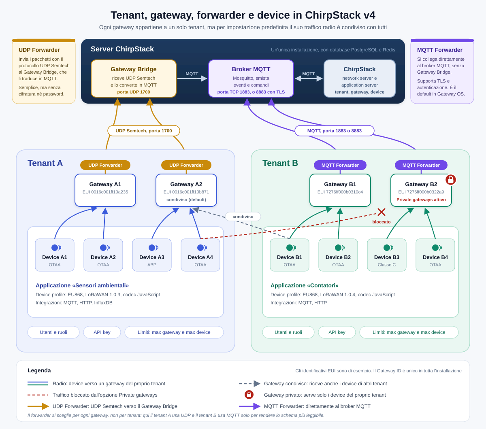

# Dispensa ChirpStack v4: tenant, gateway, forwarder e device

Questa dispensa riassume i concetti fondamentali di ChirpStack v4 per chi deve installare, configurare e gestire una rete LoRaWAN privata. Dove la v3 si comporta in modo diverso, viene segnalato.

---

## 1. Architettura in breve

Il percorso di un messaggio LoRaWAN è questo:

```
Device ──radio──▶ Gateway ──forwarder──▶ [Gateway Bridge / MQTT broker] ──▶ ChirpStack ──▶ Integrazioni
```

I componenti principali sono:

| Componente | Dove gira | Ruolo |
|---|---|---|
| **Device** (end node) | Sul campo | Sensore o attuatore LoRaWAN che trasmette via radio |
| **Gateway** | Sul campo | Riceve i pacchetti radio e li inoltra via IP |
| **Concentratord** | Sul gateway | Pilota il chip radio (SX1301/SX1302/SX1303) ed espone i pacchetti via ZeroMQ |
| **Forwarder** | Sul gateway | Inoltra i pacchetti al server (UDP, Basic Station o MQTT) |
| **Gateway Bridge** | Sul server o sul gateway | Converte UDP Semtech o Basic Station in messaggi MQTT |
| **MQTT broker** (Mosquitto) | Sul server | Bus di messaggi tra gateway e ChirpStack, e verso le applicazioni |
| **ChirpStack** | Sul server | Network server + application server (in v4 sono un unico servizio) |
| **PostgreSQL** | Sul server | Database di tenant, utenti, gateway, device, profili |
| **Redis** | Sul server | Stato delle sessioni, deduplicazione, code, metriche |

In ChirpStack v3 network server e application server erano due servizi separati. In v4 sono stati unificati.

---

## 2. Tenant

### Cos'è

Il **tenant** è l'unità di separazione logica dentro un'installazione ChirpStack. Ogni tenant ha i propri utenti, gateway, applicazioni, device profile e device. In v3 il concetto equivalente si chiamava **organizzazione**.

Un tenant tipico corrisponde a un cliente, un reparto o un progetto.

### Utenti e ruoli

Gli utenti sono globali, ma i permessi si assegnano per tenant. Lo stesso utente può appartenere a più tenant con ruoli diversi.

| Ruolo | Cosa può fare |
|---|---|
| **Amministratore di sistema** | Tutto, su tutti i tenant. Crea tenant e ne modifica i limiti |
| **Tenant admin** | Gestisce tutto dentro il proprio tenant, utenti compresi |
| **Device admin** | Gestisce applicazioni, device profile e device |
| **Gateway admin** | Gestisce i gateway del tenant |
| **Utente semplice** | Sola lettura |

### Impostazioni del tenant (solo amministratore di sistema)

| Impostazione | Effetto |
|---|---|
| **Can have gateways** | Se disattivata, il tenant non può registrare gateway propri e usa quelli degli altri |
| **Max. gateway count** | Numero massimo di gateway registrabili (0 = illimitato) |
| **Max. device count** | Numero massimo di device registrabili (0 = illimitato) |
| **Private gateways (uplink)** | I gateway del tenant inoltrano solo gli uplink dei device dello stesso tenant |
| **Private gateways (downlink)** | I gateway del tenant non vengono usati per i downlink verso device di altri tenant |

### API key

Esistono API key di tenant (valide solo per quel tenant) e API key di amministrazione (valide per tutta l'installazione). Si usano per le chiamate gRPC/REST da applicazioni esterne. La chiave viene mostrata **una sola volta** alla creazione: va salvata subito.

### Condivisione dei gateway tra tenant

Per impostazione predefinita, un gateway registrato in un tenant serve **tutti** i device dell'installazione, di qualunque tenant. Il gateway è visibile e gestibile solo dal tenant proprietario, ma il suo traffico radio è condiviso. Per renderlo esclusivo si attivano le opzioni *Private gateways*. La sezione 12 descrive tutte le combinazioni e contiene una figura riassuntiva.

---

## 3. Gateway

### Identificazione

Ogni gateway è identificato da un **Gateway ID**, un EUI a 64 bit (16 caratteri esadecimali, per esempio `0016c001ff10a235`). Di solito è stampato sull'etichetta o visibile nell'interfaccia del gateway.

Il Gateway ID è **unico in tutta l'installazione**: lo stesso gateway non può essere registrato in due tenant dello stesso server. Può invece essere registrato su due server ChirpStack diversi, perché ognuno ha il proprio database (vedi il paragrafo 4.5).

### Registrazione

In **Tenant → Gateways → Add gateway** si inseriscono:

- **Name** e **Description**
- **Gateway ID** (deve coincidere esattamente con quello configurato sul gateway)
- **Stats interval**: ogni quanti secondi il gateway invia le statistiche (di solito 30). ChirpStack lo usa per decidere se il gateway è online
- **Location**: posizione su mappa, utile anche per la geolocalizzazione
- **Tags**: coppie chiave/valore libere, che vengono riportate negli eventi e nelle integrazioni

ChirpStack **non rileva automaticamente** i gateway: la registrazione è sempre manuale.

### Stato e monitoraggio

Nella pagina del gateway si vedono:

- **Last seen**: ultimo contatto ricevuto
- **Stato online/offline**: calcolato in base allo stats interval
- **Metriche**: pacchetti ricevuti e trasmessi, distribuzione per frequenza e spreading factor
- **LoRaWAN frames**: i frame in tempo reale, utile per il debug

### Certificati TLS

Se sul server è configurata una CA per i gateway, dalla scheda **TLS certificate** si genera un certificato client per il gateway. Serve per l'autenticazione MQTT o Basic Station con TLS reciproco.

### Configurazione della regione

La regione (EU868, US915 e così via) si configura sul server nei file `region_*.toml`. Ogni regione ha un **topic prefix** MQTT (per esempio `eu868`) e un piano di canali. Gateway e server devono usare lo stesso piano di frequenze, altrimenti i pacchetti non vengono ricevuti o i downlink falliscono.

---

## 4. Forwarder

Il forwarder è il software che, sul gateway, prende i pacchetti ricevuti dalla radio e li manda al server. Ce ne sono di diversi tipi, e la scelta determina il percorso dei dati.

### 4.1 Confronto

| Forwarder | Protocollo | Porta tipica | Serve il Gateway Bridge sul server? | Note |
|---|---|---|---|---|
| **Semtech UDP packet forwarder** | UDP Semtech | 1700 | Sì (backend UDP) | Il più diffuso e il più semplice. Nessuna cifratura né autenticazione |
| **LoRa Basics Station** | WebSocket | 3001 | Sì (backend Basic Station) | Supporta TLS e autenticazione. Diffuso sui gateway commerciali recenti |
| **ChirpStack MQTT Forwarder** | MQTT | 1883 / 8883 | No | Si collega direttamente al broker MQTT. È il predefinito in ChirpStack Gateway OS |
| **ChirpStack UDP Forwarder** | UDP Semtech | 1700 | Sì (backend UDP) | Presente in Gateway OS. Può inviare a **più server** contemporaneamente |

### 4.2 Gateway Bridge

Il **ChirpStack Gateway Bridge** converte i protocolli UDP e Basic Station in messaggi MQTT. Può girare sul server (caso più comune) oppure direttamente sul gateway.

Se il gateway usa il ChirpStack MQTT Forwarder, il Gateway Bridge non serve.

### 4.3 Topic MQTT dei gateway

Con prefisso di regione `eu868`:

| Topic | Direzione | Contenuto |
|---|---|---|
| `eu868/gateway/<gateway_id>/event/up` | Gateway → server | Uplink ricevuti |
| `eu868/gateway/<gateway_id>/event/stats` | Gateway → server | Statistiche periodiche |
| `eu868/gateway/<gateway_id>/event/ack` | Gateway → server | Conferma di un downlink |
| `eu868/gateway/<gateway_id>/command/down` | Server → gateway | Downlink da trasmettere |
| `eu868/gateway/<gateway_id>/state/conn` | Gateway → server | Stato della connessione (online/offline) |

Per vedere tutti i gateway attivi, anche quelli non registrati:

```
mosquitto_sub -h localhost -t 'eu868/gateway/+/event/#' -v
```

### 4.4 ChirpStack Gateway OS

Nell'interfaccia web di Gateway OS (basata su OpenWrt/LuCI) si trovano, nel menu ChirpStack:

- **Concentratord**: configurazione del chip radio, del modello di gateway e del piano di canali
- **MQTT Forwarder**: indirizzo del broker, credenziali, TLS e prefisso di regione
- **UDP Forwarder**: disattivato di default. Si abilita con la casella *Enabled* e si configurano le destinazioni nella scheda *Servers*

I forwarder si possono usare anche insieme, per esempio MQTT verso un server e UDP verso un altro.

### 4.5 Un gateway verso più server

Un gateway fisico può inviare dati a due server ChirpStack diversi in tre modi (i dettagli, con esempi di configurazione, sono nella sezione 12):

1. **ChirpStack Packet Multiplexer**: riceve il traffico UDP dal gateway e lo duplica verso più server
2. **Più forwarder sul gateway**: per esempio MQTT Forwarder verso il server A e UDP Forwarder verso il server B, oppure due istanze di MQTT Forwarder
3. **Bridge tra broker MQTT**: i topic del gateway vengono replicati sul broker dell'altro server

Da tenere presente:

- **Downlink**: la radio in trasmissione è una sola. Se due server chiedono un downlink nello stesso istante, uno dei due fallisce
- **Stesso piano di frequenze** su entrambi i server
- **Ogni device va registrato su un solo server**. L'altro server scarta gli uplink dei device che non conosce
- Conviene usare **NetID o prefissi DevAddr diversi** sui due server

---

## 5. Applicazioni

L'**applicazione** è un contenitore di device all'interno di un tenant. Serve a raggruppare dispositivi con lo stesso scopo e a configurare le **integrazioni**, cioè dove vanno a finire i dati.

### Integrazioni disponibili

Le principali sono MQTT (sempre attiva), HTTP (webhook), InfluxDB, ThingsBoard, AWS SNS, Azure Service Bus, GCP Pub/Sub, Loki e altre.

### Topic MQTT delle applicazioni

| Topic | Contenuto |
|---|---|
| `application/<application_id>/device/<dev_eui>/event/up` | Uplink decodificato |
| `application/<application_id>/device/<dev_eui>/event/join` | Join completato |
| `application/<application_id>/device/<dev_eui>/event/ack` | Conferma di un downlink confermato |
| `application/<application_id>/device/<dev_eui>/event/status` | Stato batteria e margine del segnale |
| `application/<application_id>/device/<dev_eui>/event/log` | Errori ed eventi di debug |
| `application/<application_id>/device/<dev_eui>/command/down` | Invio di un downlink al device |

L'`application_id` in v4 è un UUID, visibile nella pagina dell'applicazione.

---

## 6. Device profile

Il **device profile** descrive le caratteristiche comuni a un tipo di dispositivo. Appartiene a un tenant e viene condiviso da tutti i device dello stesso modello.

| Campo | Significato |
|---|---|
| **Region** | Deve coincidere con una regione configurata sul server |
| **MAC version** | Versione LoRaWAN del device (1.0.2, 1.0.3, 1.1 e così via). Va presa dalla scheda tecnica |
| **Regional parameters revision** | Revisione dei parametri regionali (A, B, RP002-1.0.x) |
| **ADR algorithm** | Algoritmo di adattamento della velocità dati |
| **Expected uplink interval** | Serve a ChirpStack per segnalare device inattivi |
| **Supports OTAA** | Se attivo il device fa il join. Se disattivo è ABP |
| **Class B / Class C** | Classi con finestre di ricezione aggiuntive (la classe A è sempre supportata) |
| **Codec** | Funzione JavaScript che decodifica il payload (`decodeUplink`) e codifica i downlink (`encodeDownlink`) |
| **Measurements** | Definisce quali campi decodificati mostrare come grafici |

L'amministratore di sistema può anche creare **device profile template**, cioè modelli già pronti che i tenant possono importare.

Se la MAC version o la revisione dei parametri regionali non corrispondono a quelle reali del device, i join possono fallire o il device può comportarsi in modo anomalo con ADR e canali.

---

## 7. Device

### Identificativi e chiavi

| Campo | Descrizione |
|---|---|
| **DevEUI** | Identificativo univoco del device (64 bit). Dato dal produttore |
| **JoinEUI** (ex AppEUI) | Identificativo del join server (64 bit). Spesso tutto zero con ChirpStack |
| **AppKey** | Chiave radice per il join OTAA (LoRaWAN 1.0.x) |
| **NwkKey** | Chiave radice aggiuntiva in LoRaWAN 1.1 |
| **DevAddr** | Indirizzo di rete a 32 bit, assegnato al join (OTAA) o fisso (ABP) |
| **NwkSKey / AppSKey** | Chiavi di sessione, generate al join (OTAA) o fisse (ABP) |

In LoRaWAN 1.0.x, ChirpStack chiama l'AppKey "Application key" nella scheda **OTAA keys**. In alcune versioni dell'interfaccia il campo si chiama "Network key" anche per i device 1.0.x: se il join non funziona, questo è uno dei primi punti da controllare.

### OTAA e ABP

| | OTAA | ABP |
|---|---|---|
| Come si attiva | Il device invia una Join Request, il server risponde con una Join Accept | Il device ha già DevAddr e chiavi di sessione |
| Chiavi di sessione | Generate a ogni join | Fisse, inserite a mano |
| Sicurezza | Migliore | Minore |
| Uso consigliato | Sempre, quando possibile | Solo se il device non supporta OTAA |

### Registrazione

In **Tenant → Applications → [applicazione] → Add device** si inseriscono nome, DevEUI, JoinEUI e device profile. Poi si impostano le chiavi nella scheda **OTAA keys** oppure l'attivazione nella scheda **Activation** (ABP).

Altri campi utili sono i **tags** (metadati riportati negli eventi) e le **variables** (valori usabili dal codec e dalle integrazioni).

### Frame counter

ChirpStack verifica che il contatore dei frame (FCnt) cresca a ogni uplink, come protezione contro i replay. Se un device ABP si riavvia e riparte da zero, i suoi uplink vengono scartati.

L'opzione **Disable frame-counter validation** nel device disattiva il controllo. È utile per test o device ABP che perdono il contatore, ma riduce la sicurezza.

### Schede utili per il debug

- **Events**: uplink, join, ack ed errori, con il payload decodificato
- **LoRaWAN frames**: i frame grezzi, compresi quelli rifiutati
- **Queue**: i downlink in attesa di trasmissione
- **Metrics**: RSSI, SNR, uplink per giorno

### Downlink

Si accodano dalla scheda **Queue**, via API o tramite MQTT. In classe A il downlink parte solo dopo il successivo uplink del device. In classe C parte quasi subito. Un downlink **confirmed** richiede che il device invii una conferma.

### Multicast

I **multicast group** permettono di inviare lo stesso downlink a più device (classe B o C). Si creano nell'applicazione e servono soprattutto per aggiornamenti firmware via radio (FUOTA).

---

## 8. Flusso completo di un join OTAA

1. Il device trasmette una **Join Request** con DevEUI, JoinEUI e un nonce
2. Uno o più gateway la ricevono e la inoltrano al server tramite il forwarder
3. ChirpStack **deduplica** le copie ricevute da gateway diversi
4. Cerca il device per DevEUI, verifica il messaggio con l'AppKey e controlla che il nonce non sia già stato usato
5. Genera DevAddr e chiavi di sessione, poi manda una **Join Accept** attraverso il gateway con il segnale migliore
6. Il gateway la trasmette nella finestra di ricezione RX1 o RX2
7. Il device calcola le stesse chiavi di sessione e inizia a inviare uplink

Se il punto 5 avviene ma il device non completa il join, di solito il problema è radio (downlink non ricevuto, piano di frequenze sbagliato, gateway troppo vicino al device) oppure di tempistica (latenza di rete troppo alta tra gateway e server).

---

## 9. Checklist di troubleshooting

**Il gateway risulta offline o non compare**

- Il Gateway ID sul server coincide con quello configurato sul gateway?
- Il forwarder è attivo e punta all'indirizzo e alla porta giusti?
- Il firewall del server lascia passare la porta (UDP 1700, TCP 1883/8883 o 3001)?
- Il prefisso di regione MQTT coincide tra gateway e server?
- Nei log del server compare il gateway come non registrato?

**Il device non fa il join**

- DevEUI, JoinEUI e AppKey sono corretti, senza caratteri scambiati o invertiti?
- La MAC version nel device profile è quella giusta?
- La regione del device profile coincide con quella del gateway?
- Nella scheda **LoRaWAN frames** del gateway arriva la Join Request?
- Nella scheda **Events** del device compare un errore (per esempio nonce già usato o MIC non valido)?
- Il device è troppo vicino al gateway? Sotto il metro di distanza la saturazione può impedire la ricezione

**Gli uplink arrivano ma i dati non sono decodificati**

- Il codec è impostato nel device profile?
- La funzione `decodeUplink` restituisce un oggetto con la proprietà `data`?
- Nella scheda **Events** compare un evento `log` con errori del codec?

**Gli uplink vengono scartati dopo un riavvio del device**

- Il device è ABP e ha azzerato il frame counter? Valuta l'opzione di disattivazione della validazione, oppure passa a OTAA

---

## 10. Comandi utili (server Debian/Ubuntu)

Questi comandi valgono per un server Linux con systemd, per esempio Debian o Ubuntu con ChirpStack installato da pacchetti. Per ChirpStack Gateway OS e OpenWrt vedi la sezione 11.

Log di ChirpStack:

```
journalctl -u chirpstack -f
```

Log del Gateway Bridge:

```
journalctl -u chirpstack-gateway-bridge -f
```

Log con Docker:

```
docker logs -f <nome_container>
```

Tutti gli eventi dei gateway:

```
mosquitto_sub -h localhost -t 'eu868/gateway/+/event/#' -v
```

Tutti gli eventi delle applicazioni:

```
mosquitto_sub -h localhost -t 'application/#' -v
```

Traffico UDP in arrivo sulla porta 1700:

```
tcpdump -i any udp port 1700
```

File di configurazione principali (installazione da pacchetti):

| File | Contenuto |
|---|---|
| `/etc/chirpstack/chirpstack.toml` | Configurazione generale, database, regioni abilitate |
| `/etc/chirpstack/region_eu868.toml` | Piano di canali e parametri della regione |
| `/etc/chirpstack-gateway-bridge/chirpstack-gateway-bridge.toml` | Backend UDP/Basic Station e connessione MQTT |
| `/etc/chirpstack-mqtt-forwarder/chirpstack-mqtt-forwarder.toml` | MQTT Forwarder (sul gateway) |

---

## 11. ChirpStack Gateway OS (OpenWrt e LuCI)

ChirpStack Gateway OS è basato su **OpenWrt**. Si gestisce dall'interfaccia web **LuCI** oppure via SSH con la shell `ash`. Rispetto a un server Debian/Ubuntu cambiano parecchie cose: non c'è systemd, quindi `journalctl` e `systemctl` non esistono, e la configurazione è gestita da **UCI**.

Esistono due varianti di Gateway OS: una base, con solo i componenti del gateway (Concentratord e forwarder), e una completa, che contiene anche il server ChirpStack, il broker MQTT, PostgreSQL o SQLite e Redis. Con la variante completa il gateway è un network server autonomo.

### 11.1 Dove si trovano le cose in LuCI

| Voce di menu | Cosa si configura |
|---|---|
| **ChirpStack → Concentratord** | Modello di gateway, chip radio, regione e piano di canali. Mostra anche il Gateway ID |
| **ChirpStack → MQTT Forwarder** | Broker MQTT di destinazione, credenziali, TLS, prefisso di regione |
| **ChirpStack → UDP Forwarder** | Invio in UDP Semtech verso uno o più server. Disattivato di default |
| **ChirpStack → ChirpStack** (variante completa) | Link all'interfaccia web del server ChirpStack locale, di solito sulla porta 8080 |
| **Stato → Log di sistema** | Log di tutti i servizi, ChirpStack compreso |
| **Stato → Panoramica** | Stato generale, rete, memoria, uptime |
| **Sistema → Avvio** | Avvio, arresto, riavvio e abilitazione dei servizi |
| **Rete → Interfacce** | Configurazione IP delle interfacce (LAN, WAN, LTE) |
| **Rete → Wireless** | Wi-Fi del gateway, se presente |
| **Rete → Firewall** | Regole del firewall, per esempio per aprire le porte 1700 o 8080 |
| **Sistema → Backup / Flash firmware** | Backup della configurazione e aggiornamento del sistema |

Dopo ogni modifica in LuCI bisogna cliccare **Salva e applica**. Solo **Salva** memorizza le modifiche senza renderle attive.

### 11.2 Log

In LuCI si leggono in **Stato → Log di sistema**. Via SSH si usa `logread`:

| Comando | Effetto |
|---|---|
| `logread` | Mostra tutti i log registrati |
| `logread -f` | Segue i nuovi log in tempo reale (come `journalctl -f`) |
| `logread -e chirpstack` | Mostra solo le righe che contengono "chirpstack" |
| `logread -f -e chirpstack` | Segue in tempo reale solo i log di ChirpStack |
| `logread -f -e concentratord` | Segue i log del Concentratord (radio) |
| `logread -f -e forwarder` | Segue i log dei forwarder MQTT e UDP |

I log di OpenWrt sono conservati in RAM e hanno dimensione limitata: dopo un riavvio si perdono, e con molto traffico i messaggi vecchi vengono sovrascritti.

### 11.3 Servizi

In LuCI si gestiscono da **Sistema → Avvio**. Via SSH si usano gli script in `/etc/init.d/`:

```
/etc/init.d/chirpstack restart
/etc/init.d/chirpstack stop
/etc/init.d/chirpstack start
/etc/init.d/chirpstack status
/etc/init.d/chirpstack enable     # avvio automatico al boot
/etc/init.d/chirpstack disable    # niente avvio automatico
```

Per vedere tutti i servizi ChirpStack presenti sul gateway:

```
ls /etc/init.d/ | grep chirpstack
```

### 11.4 Configurazione con UCI

LuCI salva le impostazioni in file UCI dentro `/etc/config/`. Per vedere quali riguardano ChirpStack:

```
ls /etc/config/ | grep chirpstack
```

I comandi UCI principali:

| Comando | Effetto |
|---|---|
| `uci show chirpstack-concentratord` | Mostra tutta la configurazione di un componente |
| `uci get <file>.<sezione>.<opzione>` | Legge un singolo valore |
| `uci set <file>.<sezione>.<opzione>=<valore>` | Modifica un valore (non ancora salvato) |
| `uci commit <file>` | Salva le modifiche |
| `uci changes` | Mostra le modifiche non ancora salvate |
| `uci revert <file>` | Annulla le modifiche non salvate |

Dopo `uci commit` va riavviato il servizio corrispondente, perché la modifica diventi attiva. Conviene preferire LuCI o UCI alla modifica diretta dei file `.toml` generati: al riavvio del servizio Gateway OS li rigenera a partire dalla configurazione UCI, e le modifiche fatte a mano andrebbero perse.

### 11.5 Comandi di diagnostica

| Comando | Effetto |
|---|---|
| `ifconfig` oppure `ip addr` | Indirizzi IP delle interfacce |
| `ping <indirizzo>` | Verifica la raggiungibilità del server |
| `netstat -tunlp` | Porte aperte e servizi in ascolto |
| `ps \| grep chirpstack` | Processi ChirpStack in esecuzione |
| `free` | Memoria libera |
| `df -h` | Spazio disco libero |
| `mosquitto_sub -h localhost -t '#' -v` | Tutti i messaggi MQTT sul broker locale (variante completa) |
| `reboot` | Riavvia il gateway |

Non tutti i comandi di un Linux completo sono presenti: OpenWrt usa **BusyBox**, che include versioni ridotte degli strumenti più comuni. Strumenti come `tcpdump` si possono installare con il gestore di pacchetti:

```
opkg update
opkg install tcpdump
```

Il gateway deve avere accesso a Internet per scaricare i pacchetti.

### 11.6 Differenze rapide con un server Debian/Ubuntu

| Operazione | Debian/Ubuntu | Gateway OS (OpenWrt) |
|---|---|---|
| Leggere i log | `journalctl -u chirpstack -f` | `logread -f -e chirpstack` |
| Riavviare un servizio | `systemctl restart chirpstack` | `/etc/init.d/chirpstack restart` |
| Abilitare all'avvio | `systemctl enable chirpstack` | `/etc/init.d/chirpstack enable` |
| Configurazione | File `.toml` in `/etc/chirpstack*/` | UCI in `/etc/config/`, oppure LuCI |
| Installare pacchetti | `apt install` | `opkg install` |
| Shell | `bash` | `ash` (BusyBox) |

---

## 12. Collegare e condividere i gateway

<p align="center">
  
</p>

*La figura è nel file `chirpstack_tenant_gateway_device.svg`, che va tenuto nella stessa cartella della dispensa.*

Nella figura i collegamenti tra gateway e server sono colorati in base al forwarder. In giallo l'**UDP Forwarder**, che invia i pacchetti al Gateway Bridge (porta UDP 1700), il quale li converte in MQTT. In viola l'**MQTT Forwarder**, che si collega direttamente al broker MQTT (porta 1883, o 8883 con TLS). Il forwarder si sceglie per ogni gateway: nello schema il tenant A usa UDP e il tenant B MQTT solo per chiarezza.

"Condividere un gateway" può voler dire due cose molto diverse, e le tecniche cambiano di conseguenza:

| Scenario | Dove sono i tenant | Cosa serve |
|---|---|---|
| **A. Condivisione tra tenant dello stesso server** | Stessa installazione ChirpStack | Niente di particolare: è il comportamento predefinito |
| **B. Condivisione tra server diversi** | Due installazioni ChirpStack separate | Il gateway deve inviare i dati a entrambi i server, con MQTT, UDP o una combinazione dei due |

### 12.1 Scenario A: tenant diversi sullo stesso server

Il gateway si registra **una sola volta**, nel tenant che lo possiede, e si collega **una sola volta** al server. Il tipo di forwarder non ha importanza: MQTT Forwarder, UDP Forwarder o Basic Station funzionano allo stesso modo, perché la condivisione avviene dentro ChirpStack, dopo che i pacchetti sono arrivati.

Quando un uplink arriva, ChirpStack cerca il device a cui appartiene tra **tutti** i tenant, indipendentemente da quale tenant possiede il gateway. Poi, per il downlink, sceglie il gateway con il segnale migliore tra quelli che hanno ricevuto il pacchetto.

**Condizioni perché la condivisione funzioni**

- Il gateway è registrato in un tenant e risulta online
- Il gateway e i device usano la stessa regione e lo stesso piano di canali
- Nel tenant proprietario del gateway le opzioni *Private gateways* sono disattivate (è il default)
- I device degli altri tenant sono nel raggio radio del gateway

**Effetto delle opzioni Private gateways**

Si impostano nella configurazione del tenant proprietario del gateway, e solo l'amministratore di sistema può modificarle.

| Private uplink | Private downlink | Risultato per i device degli altri tenant |
|---|---|---|
| Off | Off | Il gateway riceve i loro uplink e trasmette i loro downlink. Condivisione completa (default) |
| On | Off | Il gateway ignora i loro uplink. Può ancora trasmettere loro downlink, se ChirpStack lo sceglie |
| Off | On | Il gateway riceve i loro uplink, ma i downlink devono passare da un altro gateway |
| On | On | Il gateway serve solo il proprio tenant. Gateway completamente privato |

Il caso "uplink condiviso, downlink privato" è utile quando un tenant vuole offrire copertura in ricezione senza consumare il duty cycle del proprio gateway per gli altri.

### 12.2 Scenario B: server ChirpStack diversi

Qui ogni server ha il proprio database, quindi il gateway va **registrato su entrambi**, con lo stesso Gateway ID. Il problema è far arrivare gli stessi pacchetti a due destinazioni. Le tecniche possibili sono quattro.

#### Tecnica 1: UDP Forwarder con più server

È la soluzione più semplice con ChirpStack Gateway OS.

```
                         ┌─▶ Server A: Gateway Bridge (UDP 1700) ─▶ MQTT ─▶ ChirpStack A
Gateway ─ UDP Forwarder ─┤
                         └─▶ Server B: Gateway Bridge (UDP 1700) ─▶ MQTT ─▶ ChirpStack B
```

**Configurazione sul gateway (LuCI)**

1. **ChirpStack → UDP Forwarder → Global configuration**: spunta *Enabled*
2. Scheda **Servers**: aggiungi una riga per ogni server, con indirizzo e porta (di solito `server-a.example.com:1700` e `server-b.example.com:1700`)
3. Se non serve più, disattiva l'MQTT Forwarder, per evitare che il gateway invii gli stessi dati due volte al server A
4. **Salva e applica**

**Condizioni sul lato server**

- Su ogni server deve girare il **ChirpStack Gateway Bridge** con il backend UDP (Semtech) in ascolto sulla porta 1700
- Il Gateway Bridge deve pubblicare sul broker MQTT con lo stesso prefisso di regione configurato in ChirpStack (per esempio `eu868`)
- La **porta UDP 1700** deve essere raggiungibile: firewall aperto e, se il server è dietro NAT, port forwarding configurato
- Il gateway deve essere registrato con lo stesso Gateway ID su entrambi i server

**Come funzionano i downlink in UDP**

Il gateway invia periodicamente un messaggio di keepalive (PULL_DATA) a ogni server. Questo tiene aperto il percorso attraverso eventuali NAT e dice al server dove mandare i downlink. Ogni server può quindi inviare i propri downlink in modo indipendente.

**Pro e contro**

- Pro: semplice da configurare, supportato da quasi tutti i gateway, un solo forwarder per più server
- Contro: nessuna cifratura né autenticazione, i pacchetti UDP possono andare persi, richiede una porta aperta sul server

#### Tecnica 2: Packet Multiplexer

Serve quando il gateway usa un **Semtech packet forwarder** classico, che supporta un solo server, oppure quando non si vuole toccare la configurazione del gateway.

```
Gateway ─ UDP ─▶ Packet Multiplexer ─┬─▶ Server A (UDP 1700)
                                     └─▶ Server B (UDP 1700)
```

Il **ChirpStack Packet Multiplexer** riceve il traffico UDP e lo duplica verso più server. Può girare su uno dei due server o su una macchina intermedia. Il gateway viene puntato al multiplexer come se fosse un normale server.

Nella configurazione del multiplexer si elencano le destinazioni e, per ciascuna, i Gateway ID ammessi. Per ogni destinazione si può anche indicare se accettare i downlink oppure solo inoltrare gli uplink: così uno dei due server può ricevere i dati senza poter trasmettere, eliminando il rischio di collisioni in trasmissione. Le opzioni precise dipendono dalla versione del multiplexer, quindi conviene verificarle nel suo file di configurazione di esempio.

Condizioni e limiti sono gli stessi della tecnica 1, perché il protocollo è sempre UDP Semtech.

#### Tecnica 3: MQTT Forwarder con bridge tra broker

Il **ChirpStack MQTT Forwarder** si collega a **un solo broker**. Per raggiungere due server si fa in modo che il broker del server A replichi i topic del gateway verso il broker del server B, con la funzione *bridge* di Mosquitto.

```
Gateway ─ MQTT Forwarder ─▶ Broker A ─▶ ChirpStack A
                               │
                          bridge MQTT
                               │
                               ▼
                            Broker B ─▶ ChirpStack B
```

**Configurazione del bridge sul broker A**

In un file dentro `/etc/mosquitto/conf.d/`, per esempio `bridge-server-b.conf`:

```
connection bridge-server-b
address server-b.example.com:1883
remote_username utente_bridge
remote_password password_bridge

# Eventi e stato dei gateway: dal broker A al broker B
topic eu868/gateway/+/event/# out 0
topic eu868/gateway/+/state/# out 0

# Comandi (downlink) per i gateway: dal broker B al broker A
topic eu868/gateway/+/command/# in 0
```

`out` significa "dal broker locale al broker remoto", `in` il contrario. Per limitare il bridge a un solo gateway si sostituisce `+` con il suo Gateway ID. Per usare TLS si passa alla porta 8883 e si aggiungono le opzioni `bridge_cafile` ed eventualmente `bridge_certfile` e `bridge_keyfile`.

Se il server B non deve poter trasmettere tramite questo gateway, basta omettere la riga dei comandi `in`: il server B riceve gli uplink ma i suoi downlink non arrivano mai al gateway.

**Condizioni**

- Entrambi i server devono usare lo **stesso prefisso di regione** nei topic (per esempio `eu868`), oppure il bridge deve rimappare i topic
- Il broker B deve accettare la connessione del bridge (credenziali, ACL, porta aperta)
- Il gateway deve essere registrato con lo stesso Gateway ID su entrambi i server
- Il broker A deve essere sempre acceso: se si ferma, anche il server B perde il gateway

**Pro e contro**

- Pro: TCP affidabile, supporto a TLS e autenticazione, la connessione del gateway è in uscita (nessuna porta da aprire verso il gateway), nessuna modifica al gateway
- Contro: il server B dipende dal broker del server A, la configurazione è più delicata e richiede accesso amministrativo al broker A

#### Tecnica 4: MQTT Forwarder e UDP Forwarder insieme

Sul gateway con Gateway OS si possono tenere attivi entrambi i forwarder, ognuno verso un server diverso.

```
         ┌─ MQTT Forwarder ─▶ Broker A ─▶ ChirpStack A
Gateway ─┤
         └─ UDP Forwarder  ─▶ Gateway Bridge B (UDP 1700) ─▶ ChirpStack B
```

È la soluzione tipica quando il server principale è il proprio (via MQTT, sicuro) e il secondo è un server esterno che accetta solo UDP. Il Concentratord distribuisce i pacchetti ricevuti a entrambi i forwarder.

Condizioni: MQTT Forwarder configurato verso il broker A, UDP Forwarder con il solo server B nella scheda *Servers*, gateway registrato su entrambi i server.

### 12.3 Confronto tra le tecniche

| | UDP Forwarder multi-server | Packet Multiplexer | Bridge MQTT | MQTT + UDP insieme |
|---|---|---|---|---|
| Modifiche al gateway | Sì | Solo l'indirizzo del server | No | Sì |
| Componenti aggiuntivi | Gateway Bridge su ogni server | Multiplexer + Gateway Bridge | Configurazione del broker | Gateway Bridge sul server UDP |
| Cifratura | No | No | Sì (TLS) | Solo sul ramo MQTT |
| Porte da aprire sui server | UDP 1700 | UDP 1700 | TCP 1883 o 8883 sul broker B | TCP 1883/8883 e UDP 1700 |
| Controllo dei downlink per server | Limitato | Sì, per destinazione | Sì, con la riga `in` | Limitato |
| Dipendenza tra i server | Nessuna | Dal multiplexer | Il server B dipende dal broker A | Nessuna |
| Adatto per | Gateway OS, configurazioni semplici | Gateway con packet forwarder Semtech | Server entrambi sotto il proprio controllo | Server proprio + server esterno |

### 12.4 Condizioni comuni a tutte le tecniche

Queste regole valgono sempre quando un gateway serve due server diversi.

**Regione e canali identici.** Il gateway ha un solo piano di frequenze. Entrambi i server devono usare la stessa regione e gli stessi canali, altrimenti uno dei due non riceve correttamente o invia downlink su frequenze sbagliate.

**Stesso Gateway ID ovunque.** Il gateway deve essere registrato con lo stesso ID su tutti i server che lo usano.

**Ogni device su un solo server.** Se lo stesso device fosse registrato su entrambi, riceverebbe due Join Accept e due serie di downlink, con risultati imprevedibili. Gli uplink dei device sconosciuti vengono semplicemente scartati dal server che non li conosce.

**NetID o prefissi DevAddr distinti.** Configurando prefissi DevAddr diversi sui due server, ciascuno riconosce subito i propri device e scarta gli altri senza lavoro inutile.

**Una sola radio in trasmissione.** Il gateway trasmette un pacchetto alla volta. Se entrambi i server chiedono un downlink nello stesso istante, uno dei due fallisce e il gateway lo segnala con un errore di collisione (visibile negli eventi `ack`). Con traffico basso capita raramente, ma per applicazioni che dipendono dai downlink conviene lasciare la trasmissione a un solo server.

**Duty cycle condiviso.** In Europa (EU868) il gateway deve rispettare i limiti di tempo di trasmissione, per esempio 1% o 10% a seconda della sotto-banda. Ogni server calcola il duty cycle solo per i propri downlink e non sa nulla di quelli dell'altro, quindi la somma può superare il limite. È un altro motivo per concentrare i downlink su un solo server.

**Latenza verso i server.** La Join Accept e i downlink in classe A devono arrivare al gateway in tempo per la finestra di ricezione del device (circa 1 secondo per RX1, 5 secondi per il join). Un server remoto con latenza elevata può perdere queste finestre.

### 12.5 Quale tecnica scegliere

| Situazione | Tecnica consigliata |
|---|---|
| Più clienti sullo stesso server | Nessuna: tenant diversi, condivisione predefinita. Eventualmente *Private gateways* |
| Gateway con Gateway OS, due server, configurazione rapida | UDP Forwarder con più server |
| Gateway con packet forwarder Semtech classico | Packet Multiplexer |
| Due server entrambi sotto il proprio controllo, serve sicurezza | Bridge MQTT tra i broker |
| Server proprio più una rete esterna che accetta solo UDP | MQTT Forwarder verso il proprio server, UDP Forwarder verso quello esterno |
| Il secondo server deve solo leggere i dati | Qualsiasi tecnica, ma con i downlink disabilitati verso il secondo server |
