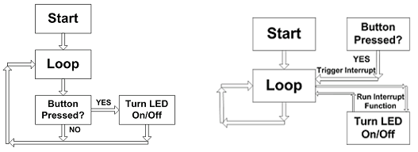

>[Torna all'indice](indexinterrupts.md)
## **INTERRUPT IN ARDUINO**

E’ una delle **due tecniche** (l'altra è il polling) con cui può essere realizzato il **dialogo** tra CPU e periferiche. Nella gestione mediante Interrupt è la **periferica** stessa a **richiedere** un servizio mediante un apposito **segnale**. Il segnale viaggia sul **BUS controlli** nella direzione che va dalla periferica alla CPU. Quando una periferica necessita della CPU, ad esempio perché ha appena prodotto un dato o ricevuto un segnale dall’esterno, invia alla CPU un segnale con cui richiede il suo intervento. 

Il **vantaggio** di questa modalità di dialogo con le periferiche è che il processore non deve interrogare **periodicamente** le periferiche (polling). La gestione delle periferiche è **ASINCRONA** al programma nel senso che il programmatore non deve prevedere quando ci sarà una richiesta di servizio ne è tenuto ad interrogare periodicamente le periferiche per sapere se ne hanno bisogno. E’ una tecnica adatta quando si devono gestire **operazioni asincrone** che magari capitano raramente o in maniera imprevedibile, quali **allarmi** o **comandi** di attivazione provenienti dall’utente.

Il **segnale**, inviato dalla periferica, viene indicato con il termine **interruzione** (interrupt), perché, di norma, la sua ricezione interrompe l’esecuzione del programma da parte della CPU, che, da quel momento in poi,  comincia ad occuparsi della periferica che lo ha inviato.

La **ricezione** di una richiesta di interruzione genera una **sequenza di eventi** nella CPU che comportano:
1.	completamento dell’istruzione corrente
2.	salvataggio del contesto;
3.	attivazione, se possibile, di una routine di servizio per l’interruzione;
4.	recupero del contesto e continuazione del programma originario.

Una **ISR** è la routine di servizio (funzione) che la CPU esegue per gestire la comunicazione con la periferica. 
Il **salvataggio del contesto** è essenziale in quanto permette alla CPU di tornare allo stato precedente l’interruzione, una volta che questa è stata servita. L’interruzione è analoga ad una chiamata di funzione ed utilizza le stesse modalità di utilizzo dello stack e delle istruzioni assembly CALL e RET (adesso detta IRET) già viste a suo tempo per le funzioni. 

- Le **funzioni tradizionali** sono dette **sincrone** e si attivano a seguito di una invocazione inserita in una parte ben precisa del codice della quale si può prevedere la tempistica della sua esecuzione. 
- Le funzioni di risposta ad un interrupt sono dette **ISR** (Interrupt Service Routines) e sono chiamate di funzioni **asincrone** in quanto la loro attivazione avviene a seguito dell’arrivo di un segnale elettrico proveniente da un HW esterno del quale non è possibile prevedere l’istante in cui capiterà.

Polling e interrupt **a confronto** nell’esecuzione di un programma nel ciclo loop di un microcontrollore:




### **PROBLEMI DELL'INTERRUPT**

Tnendo presente i concetti di: **Interrupt** (=Interruzioni) e **Polling** (=interrogare ciclicamente) **Round Robin** = interrogare con ordine possiamo chiederci quali siano i **problemi della gestione di un interrupt**. Sono tre: 
1.	**Riconoscimento** della periferica interrompente. 
2.	gestione di **richieste simultanee**. Si risolve impostando una priorità per ogni linea.
3.	gestione delle **interruzioni annidate**, cioè delle interruzioni delle interruzioni, ovvero delle interruzioni che interrompono una ISR.

Per ogni problema degli interrupt sono possibili **due tipi** di soluzione, una **HW** e una **SW**. Le soluzioni possibili in letteratura sono **polled interrupt**, **interrupt vettorizzato** e **PIC**.

### **POLLED INTERRUPT**

Il **polled interrupt** permette di risolvere tutti e tre i problemi di cui sopra in maniera software.

1. Il riconoscimento della periferica interrompente viene fatto eseguendo il polling delle periferiche eseguito, però, una sola volta. 
2. La gestione delle richieste simultanee si risolve interrogando secondo un ordine di priorità stabilito dal programmatore: viene servito per primo chi viene per primo, per ultimo chi viene per ultimo in base all’ordine stabilito.
3. L'ultimo problema è gestire le interruzioni di interruzioni; la routine di servizio, infatti, può essere interrotta. Come è gestita la interruzione di un'altra interruzione? Con le istruzioni STI (Setting interrupt) e CLI (Clear Interrupt). Se le interruzioni sono abilitate e arriva un'altra interruzione, si interrompe a propria volta. Se questa modalità però non mi piace, la posso disabilitare. Metto CLI all’inizio della ISR, che così non può essere interrotto, metto poi STI alla fine della ISR in modo da riattivare le interruzioni per le ISR che verranno chiamate successivamente.

### **ISR IN ARDUINO**

Cosa tenere a mente quando si scrive una ISR():
-	Tenerla breve
-	Non usare al suo interno l’istruzione delay()
-	millis() e micros() tuttal’più forniscono il tempo di esecuzione della ISR ma non possono incrementarsi al suo interno
-	Non effettuare scritture sulla seriale
-	Qualificare le variabili condivise tra ISR() e codice principale come volatile
-	Le variabili condivise con il codice principale devono essere, all’interno di questo, protette da accessi concorrenti rinchiudendole dentro “sezioni critiche”
-	Non cercare di attivare o disattivare interrupt al suo interno quando non necessario

All’interno di una ISR di default gli **interrupt sono disabilitati** per cui, tutte le funzioni che ne fanno uso, invocate in una ISR, non funzionerebbero correttamente. Millis() e micros() aggiornano il loro tic con un interrupt che non può quindi essere raccolto in una ISR. 

**Millis() e micros()** possono però al limite essere usate per ottenere una **istantanea del tempo** in cui viene eseguita una ISR, ma anche questo uso potrebbe **non essere consigliabile**: se millis() non è aggiornata con l’interrupt di un timer in tempo utile, allora perde il conteggio di un tic. In generale, il problema non è grave se la ISR viene eseguita velocemente. 

Millis() per funzionare correttamente deve ricevere **un interrupt entro 500 μs**, ma ciò non dovrebbe essere un problema visto che una buona ISR non dovrebbe durare più di qualche microsecondo (5 μs per essere ritenuta ben fatta).

Esempio di un interrupt che rileva la transizione di stato di un pulsante e accende un led:

```C++
const byte LED = 13;
const byte BUTTON = 2;

// Interrupt Service Routine (ISR)
void switchPressed ()
{
  if (digitalRead(BUTTON) == HIGH)
    digitalWrite (LED, HIGH);
  else
    digitalWrite(LED, LOW);
}  // end of switchPressed

void setup ()
{
  pinMode(LED, OUTPUT);  	  // so we can update the LED
  digitalWrite(BUTTON, HIGH);  // internal pull-up resistor
  // attach interrupt handler
  attachInterrupt(digitalPinToInterrupt(BUTTON), switchPressed, CHANGE);  
  
}  // end of setup

void loop ()
{
  // loop doing nothing 
} 
``` 


La struttura del codice ricalca lo schema di principio (modello a destra) tipico di una invocazione ISR che avviene tutta all’esterno del loop e in maniera indipendente da questo (che può anche non fare nulla). 
Il modello a sinistra è invece il tipo schema di gestione della periferica mediante polling puro, cioè la gestione delle periferiche avviene tutta all’interno del loop col programma principale, a margine del task principale.
Le due righe di codice seguenti sortiscono lo stesso effetto, cioè realizzare l’associazione tra una ISR definita dall’utente e un certo evento di interrupt su una certa porta:
```C++
attachInterrupt (0, switchPressed, CHANGE);    // that is, for pin D2
attachInterrupt (digitalPinToInterrupt (2), switchPressed, CHANGE); 
```
ma la seconda è più portabile su varie versioni di Arduino (i pin interrupt non necessariamente coincidono con i pin delle porte digitali).
Di seguito è riportata una lista completa degli interruppt di un Arduino:
```C++
 1  Reset 
 2  External Interrupt Request 0  (pin D2)          (INT0_vect)
 3  External Interrupt Request 1  (pin D3)          (INT1_vect)
 4  Pin Change Interrupt Request 0 (pins D8 to D13) (PCINT0_vect)
 5  Pin Change Interrupt Request 1 (pins A0 to A5)  (PCINT1_vect)
 6  Pin Change Interrupt Request 2 (pins D0 to D7)  (PCINT2_vect)
 7  Watchdog Time-out Interrupt                     (WDT_vect)
 8  Timer/Counter2 Compare Match A                  (TIMER2_COMPA_vect)
 9  Timer/Counter2 Compare Match B                  (TIMER2_COMPB_vect)
10  Timer/Counter2 Overflow                         (TIMER2_OVF_vect)
11  Timer/Counter1 Capture Event                    (TIMER1_CAPT_vect)
12  Timer/Counter1 Compare Match A                  (TIMER1_COMPA_vect)
13  Timer/Counter1 Compare Match B                  (TIMER1_COMPB_vect)
14  Timer/Counter1 Overflow                         (TIMER1_OVF_vect)
15  Timer/Counter0 Compare Match A                  (TIMER0_COMPA_vect)
16  Timer/Counter0 Compare Match B                  (TIMER0_COMPB_vect)
17  Timer/Counter0 Overflow                         (TIMER0_OVF_vect)
18  SPI Serial Transfer Complete                    (SPI_STC_vect)
19  USART Rx Complete                               (USART_RX_vect)
20  USART, Data Register Empty                      (USART_UDRE_vect)
21  USART, Tx Complete                              (USART_TX_vect)
22  ADC Conversion Complete                         (ADC_vect)
23  EEPROM Ready                                    (EE_READY_vect)
24  Analog Comparator                               (ANALOG_COMP_vect)
25  2-wire Serial Interface  (I2C)                  (TWI_vect)
26  Store Program Memory Ready                  (SPM_READY_vect)
```
Quelli riportati tra parentesi sono i nomi delle ISR che, internamente al sistema, vengono richiamate all’attivazione di un interrupt.
L'ordine di priorità è la sequenza in cui il processore controlla gli eventi di interrupt. Più in alto è in elenco, maggiore è la priorità. Quindi, ad esempio, una richiesta di interrupt esterno 0 (pin D2) verrebbe servita prima della richiesta di interrupt esterno 1 (pin D3).

Le ragioni principali che potrebbero spingere ad usare un interrupt sono:
-	To rilevare cambiamenti di valori nelle porte (eg. rotary encoders, button presses)
-	Watchdog timer (egse non accade nulla dopo 8 seconds, interrompimi)
-	Timer interrupts – usati per realizzare timer 
-	Trasferimenti di dati via BUS SPI
- Trasferimenti di dati via BUS I2C
-	Trasferimenti di dati via BUS USART
-	conversions ADC (da analogico a digitale)
- rilevare lo stato pronto alla lettura della EEPROM 
-	rilevare lo stato pronto della Flash memory 

>[Torna all'indice](indexinterrupts.md)
