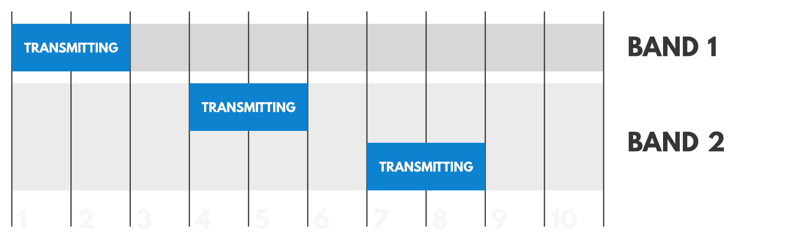
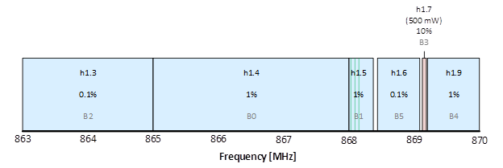
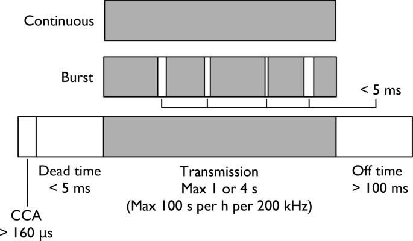
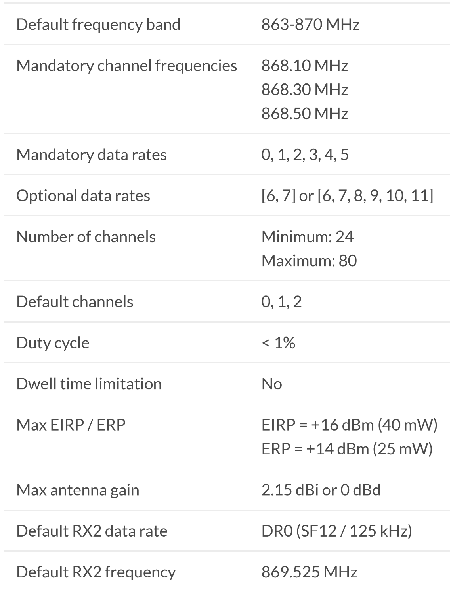
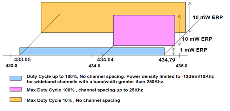
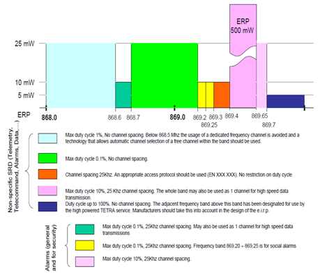
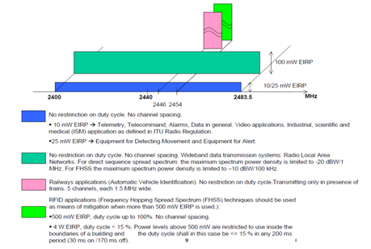

>[Torna a reti di sensori](sensornetworkshort.md#interfaccia-radio)

## **Banda ISM**

Le bande libere sono le frequenze di uso libero, non tutelate, che non richiedono concessioni per il loro impiego. Sono spesso indicate come ISM (Industrial, Scientific and Medical)[Nota 1].

In realtà ISM è un sottogruppo di tutte le frequenze disponibili.posside 
L’uso di tali bande è regolamentato in modo da consentirne l’impiego condiviso ed evitare che un utente o un servizio possa monopolizzare la risorsa.

In tabella un elenco parziale con le principali limitazioni:


L'ente regolatore, in Italia il Ministero dello Sviluppo Economico (MISE), fissa alcuni criteri per stabilire il diritto di accesso quali la distinzione nell’uso privato e non o la destinazione di frequenze ad uso contemporaneo a differenti servizi aventi differenti finalità. L’uso delle bande libere è destinato ad apparati denominati SRD (Short Range Devices). Curiosamente la banda 862-876 MHz (sub-GHz) molto utilizzata da dispositivi SRD, è gestita dal Ministero della Difesa e non dal MISE.  

I **parametri** e le **limitazioni** che vedremo sono dei criteri di accesso al mezzo radio volti a ridurre **mutui disturbi** fra i vari servizi dei vari utenti e la **monopolizzazione** di un canale da parte di un singolo utente.

I **criteri** riguardano anche alcuni dettagli fisici e tecnici:
- Il **Duty Cycle** fa riferimento al rapporto fra il tempo di trasmissione e il tempo di ricezione più il tempo di ricezione. Ad esempio un duty cycle dell'1% impone che a fronte della trasmissione di un pacchetto dati di un secondo, l’apparato non possa trasmettere per 99 secondi. Questo parametro, di fatto, limita a trasmissioni brevi, non frequenti ed esclude gli streaming audio e video. La durata predefinita del periodo di osservazione è di 1 ora, se non diversamente specificato per la banda di frequenza specifica. Attualmente tutte le bande di frequenza utilizzano il periodo di osservazione predefinito di 1 ora. I Duty Cycle variano dallo 0,1% (3,6 s all'ora), passando per 1% (36 s all'ora),  fino al 10% (360 s all'ora). Il  **tempo giornaliero** di occupazione del canale corrispondente al duty cycle massimo consentito per quel canale può essere riassunto:
    ```C++
          0.1%	86 seconds
          1%	864 seconds
          10%	8640 seconds
    ```
     - **Trasmissione parallela su più canali**. In questo caso, la stessa sorgente trasmette su due canali in due sottobande diverse con una occupazione di due unità su 10 (cioè 20 su 100) per ciascun ciascun canale. Il duty cycle totale della sorgente, in questo caso, è del 60%. Dopo che il dispositivo ha trasmesso su un canale, non trasmetterà nuovamente su quel canale finché non sarà raggiunto il tempo minimo di disattivazione TX, che è un tempo maggiore di 100 ms.       
      
     
     - **Duty cycle aggregato**. È utile avere molti canali nella maschera dei canali, in modo che le trasmissioni abbiano meno probabilità di subire ritardi. I requisiti europei stabiliscono inoltre che su uno spettro di 200 kHz possono verificarsi solo 100 secondi di trasmissione nell'arco di un'ora. Questo metodo semplifica e ottimizza i calcoli dell'utilizzo dello spettro nell'arco di un'ora. Lo standard afferma che più canali hai, più tempo di trasmissione hai in un periodo di un'ora. Si può calcolare il duty cycle effettivo in base al numero di canali disponibili abilitati come segue:
```Duty cycle effettivo = (numero di canali * 36)/3600```. Ad esempio, se si abilitassero due canali si avrebbe un duty cycle effettivo del 2%.

    - **Calcolatori online**. Un esempio di calcolatore online di duty cycle per la **tecnologia LoraWAN** è: https://avbentem.github.io/airtime-calculator/ttn/eu868
  
* **Canali e bande**. I **canali** sono intervalli di frequenza adoperati per allocare nel dominio della frequenza la trasmissione di una certa sorgente. Un canale è caratterizzato da una frequenza centrale e da una sua ampiezza (rappresentabile anche come escursione dalla frequenza centrale. Le **bande** sono intervalli di frequenza all'interno delle quali sono allocabili un certo numero di canali.
Organizzare i canali in **bande** può servire per isolare **gruppi di canali** che possono essere adoperati per gli **stessi servizi**. Organizzare i canali in **sottobande** può servire per isolare **gruppi di canali** a cui applicare le **stesse regole**. Ad esempio, le sottobande LoraWAN in Europa sono :  

  
  
   ```C++
    - K. (863 MHz - 865 MHz): 0.1%, 25 mW ERP       (uplink)
    - L. (865 MHz - 868 MHz): 1%, 25 mW ERP         (uplink)
    - M. (868 MHz - 868.6 MHz): 1%, 25 mW ERP       (uplink)
    - N. (868.7 MHz - 869.2 MHz): 0.1%, 25 mW ERP   (uplink)
    - P. (869.4 MHz - 869.65 MHz): 10%, 500 mW ERP  (downlink)
    - Q. (869.7 MHz - 870 MHz): 1%, 25 mW ERP       (uplink)

    - Uplink:
            -  1. 868.1 - SF7BW125 to SF12BW125
            -  2. 868.3 - SF7BW125 to SF12BW125 and SF7BW250
            -  3. 868.5 - SF7BW125 to SF12BW125
            -  4. 867.1 - SF7BW125 to SF12BW125
            -  5. 867.3 - SF7BW125 to SF12BW125
            -  6. 867.5 - SF7BW125 to SF12BW125
            -  7. 867.7 - SF7BW125 to SF12BW125
            -  8. 867.9 - SF7BW125 to SF12BW125
            -  9. 868.8 - FSK
    -  Downlink:
            -  Uplink channels 1-9 (RX1)
            -  869.525 - SF9BW125 (RX2)

    -  dBm to mW:  
            - +16 dBm = 40 mW
            - +14 dBm = 25 mW
            - +27 dBm = 500 mW
    ```
   
    - **Trasmissioni parallele**. Di queste, 5 (numerate da B0 a B5) sono utilizzabili dai nodi di terminali e permettono, mediante tecnica FDM che parallelizzi il flusso di un unica sorgente su 5 canali contemporaneamente, un  duty cycle complessivo del 3.2%. Il **gateway** LoRaWAN utilizza un'architettura a basso costo e basso consumo energetico che consente il posizionamento di una **coppia di radio** con larghezza  di banda di **1 MHz** ovunque nella banda ISM dell'UE. Gli **otto canali** di ricezione LoRa sono posizionati all'interno di queste due bande da 1 MHz. Quindi una applicazione su un dispositivo, avrà la  possibilità di poter spalmare il duty cycle su **due sole sottofasce**. Nella maggior parte delle reti queste vantaggiosamente si concentreranno sulle allocazioni di uplink dell'1%.  Ciò significa che ci si può ragionevolmente aspettare il **2% di duty cycle** aggregato disponibile per una **stessa sorgente**.
  
- **Modalità di accesso** al canale radio. Due **schemi di riferimento** sono **LBT** e **AFA**. Ascolto del canale prima di parlare (LBT) e Agilità di frequenza adattiva (AFA). 
LBT (listen befor Talk) è una modalità di accesso nella quale un dispositivo che deve trasmettere non occupa subito il canale ma, prima di parlare, deve ascoltare se il mezzo è già in uso attivando una funzione di CCA (Clear Channel Assessment). Se il canale è in uso, per evitare una sicura collisione, allora la successiva trasmissione deve essere spostata o nel tempo o nella frequenza:
    - o il dispositivo attende un intervallo di backoff casuale prima di ritentare il CCA sullo stesso canale
    - o il dispositivo esegue immediatamente un nuovo CCA ma, stavolta, su un altro canale. Quest'ultima tecnica si chiama AFA.
    - Quando i 2 aspetti vengono implementati, il duty cycle viene portato a 100 s di tempo di trasmissione cumulativo all'ora per ogni possibile intervallo di 200 kHz, che corrisponde a un rapporto del ciclo di lavoro del 2,7%.
    - 
      
    

    - **Duty cycle aggregato con LBT**. È utile avere molti canali nella maschera dei canali, in modo che le trasmissioni abbiano meno probabilità di subire ritardi. I requisiti europei stabiliscono inoltre che, usando LBT, su uno spettro di 200 kHz possono verificarsi solo 100 secondi di trasmissione nell'arco di un'ora. Questo metodo semplifica e ottimizza i calcoli dell'utilizzo dello spettro nell'arco di un'ora. Lo standard afferma che più canali hai, più tempo di trasmissione hai in un periodo di un'ora. Si può calcolare il duty cycle effettivo in base al numero di canali disponibili abilitati come segue:
```Duty cycle effettivo = (numero di canali * 100)/3600```. Ad esempio, se si abilitassero due canali si avrebbe un duty cycle effettivo del 5,6%.

    - **vincoli su CCA e backoff**. Il controllo CCA deve avere una durata minima di 160 μs. Dopo questo controllo il dispositivo deve attendere un tempo morto massimo di 5 ms prima di poter iniziare la trasmissione. La trasmissione stessa ha una durata massima di 1 s o 4 s a seconda del tipo di trasmissione. Si definiscono poi essere una singola trasmissione entrambe le situazioni seguenti: una sequenza continua di bit, oppure un burst di sequenze diverse purchè separate da intervalli inferiori a 5 ms. Dopo una trasmissione, una sorgente deve attendere, prima di trasmettere nuovamente sullo stesso canale, un minimo di 100 ms senza CCA. È comunque ancora consentito utilizzare tale intervallo per il successivo controllo CCA o per trasmettere su altri canali, in questo modo il duty cycle effettivo potrebbe pure essere maggiore del 5.6% in condizioni di traffico non elevato.

- **Potenza disponibile massima**. La potenza in Watt. In genere dell’ordine dei millesimi di watt (mW) è spesso espressa in dBm.
In taluni casi, in relazione alla larghezza di banda, si fa riferimento alla densità di potenza, ovvero alla potenza, in milliwatt per MHz o per KHz. E’ il caso degli apparati WLAN E HiperLAN.
- **EIRP** e **ERP**. La potenza è generalmente riferita al **segnale irradiato** sotto forma di misura ERP o di misura EIRP. L’antenna è un componente passivo, ma possiede pur sempre una sorta di guadagno. Il guadagno quantifica la capacità dell’antenna di concentrare l’energia irradiata (o ricevuta) in una determinata direzione.
     - Un'antenna si dice **isotropa** quando emette la stessa potenza in tutte le direzioni in quanto non possiede direzioni di emissione privilegiate in cui emette più energia rispetto ad altre. Ciò equivale a dire che, in una sfera avente per centro l'antenna, la densità di potenza è la stessa in ogni punto sulla sua superficie. Ma si tratta solo di una approssimazione ideale. Le antenne reali, a parità di distanza, distribuiscono la loro energia in maniera non uniforme al variare della direzione di un punto nello spazio.
     - Le antenne cosidette **direttive** sono progettate proprio per introdurre di proposito un guadagno ulteriore sulla potenza fornita dal trasmettitore detto **guadagno di antenna** che è dovuto proprio alla capacità di concentrare la potenza irradiata in una **direzione privilegiata**. In realtà questa direzione è solo quella dove si concentra la **densità massima** di energia che rimane comunque ancora significativa (almeno la metà) in un cono nello spazio avente una apertura caratteristica detto **apertura a 3dB**. Infatti, 3dB è proprio la differenza di intensità del fascio tra la direzione privilegiata di massima emissione e i bordi del cono in cui la potenza misurata vale la metà di quella massima. Chiaramente, il guadagno elevato, raggiunto in un cono di apertura più o meno stretta, può avvenire solo al prezzo di una analoga perdita in tutte le altre direzioni. Si concentra in una direzione ciò che si perde in tutte le altre. La direzione di **minima intensità** (toricamente nulla) è sempre, paradossalmente, la base dove si alimenta l'antenna.
     - **Principio di reciprocità**. Collega il comportamento di un'antenna ricevente a quello che la stessa possiede quando è usata come trasmittente.  Stabilisce che le proprietà (ampiezza di banda, direttività, ecc.) di un'antenna ricevente sono le stesse che avrebbe la stessa antenna usata come trasmittente.
     - **Antenne direttive vs omnidirezionali**. Per ottenere il massimo guadagno di antenna complessivo di un **collegamento** è necessario **collimare** le antenne trasmittente e ricevente nella direzione di massimo guadagno. Si tenga conto che maggiore è la direttività delle antenne e più precisa e stabile nel tempo dovrà essere mantenuta questa collimazione (aspetto perlomeno critico praticamente), ciò va bene per collegamenti fissi **punto punto** come i **ponti radio**. Se invece, uno terminale è **mobile** o se il collegamento è **punto-multipunto** con un cluster di dispositivi sparpagliati in una certa area dello spazio, allora è più pratico utilizzare antenne con bassa direttività se non addirittura antenne ominidirezionali, cioè isotrope, almeno nel lato a uno del collegamento (gateway). Vedremo dopo che, nella banda ISM, per limitare le interferenze ad altri dispositivi posti in prossimità dell'antenna, si lasciano pressochè omnidirezionali anche le antenne del lato a molti (dispositivi terminali).
     - La potenza **EIRP** di una antenna direttiva è invece la potenza con cui dovrebbe essere alimentata un'antenna isotropica per irradiare la stessa potenza che viene emessa dall'antenna direttiva nella sua direzione di massimo irraggiamento.  La potenza **EIRP** è la somma della **potenza erogata** dal trasmettittore più il **guadagno di antenna** (al netto delle perdite sul cavo sempre presenti). 
     - Un'altra grandezza considerata nella pratica è la potenza **ERP**, analoga alla precedente ma riferita alla potenza emessa da un **dipolo orientato** normalmente alla direzione di massima intensità dell'antenna direttiva (di solito è considerata un'antenna verticale con propagazione orizzontale, parallela al piano terrestre). Stavolta si valuta il guadagno dell'antenna sotto test rispetto al guadagno di un dipolo standard a mezza lunghezza d'onda. In questo caso il valore ERP dBd è leggermente più basso rispetto al valore di un'antenna istropa EIRP dBi (dBi = dBd + 2,15dB) in quanto il dipolo guadagna 2,15dB in più rispetto al radiale isotropico, anche se soltanto lungo la direzione di massima irradiazione. Un limite comune stabilito dalle **regolamentazione** è di fissare l'ERP proprio esattamente uguale alla massima potenza disponibile ammessa sul morsetto di antenna, ciò implica che l'antenna **non debba guadagnare** per nulla rispetto ad un dipolo a mezz'onda o, equivalentemente, che guadagni soltanto **2.15 dB** rispetto ad una antenna isotropa alimentata con la stessa potenza disponibile.
     - **Link budget**. Tra trasmettitore e gateway potrebbe essere valutato il cosidetto link budget, overossia la somma dei guadagni e delle attenuazioni lungo il percorso fino al ricevitore. L'obiettivo è valutare il rispetto del **vincolo finale** sul ricevitore, cioè che la potenza ricevuta sia maggiore della **sensibilità minima** del ricevitore più un certo **margine di sicurezza** per tenere conto del **fading** ambientale (multipath oppure attenuazione atmosferica) che è una quantità che varia, più o meno rapidamente, col **tempo**. Per dettagli sul calcolo vedere https://www.vincenzov.net/tutorial/elettronica-di-base/Trasmissioni/link.htm. Rimane assodato che si tratta soltanto di un **calcolo di massima** che fornisce indicazioni sulla fattibilità teorica di un collegamento che, se positiva, richiede attente e ripetute **verifiche sul campo** nelle condizioni di esercizio previste per l'impianto.
    
         - **Sensitività e Spreading Factor**. Nelle modulazioni a **spettro espanso** la sensitività del ricevitore varia a seconda del fattore di spreading del segnale a banda stretta originale (125 KHz). In linea generale, SF più alti migliorano la sensibilità del ricevitore. Un esempio di questa variazione per i ricevitori LoraWAN della Semtech è riportata nella seguente tabella:
       ```C++
        - SF7	-123 dBm
        - SF8	-126 dBm
        - SF9	-129 dBm
        - SF10	-132 dBm
        - SF11	-134.5 dBm
        - SF12	-137 dBm
       ```
- **Dimensione massima del messaggio**.
    Le regole ISM non mettono esplicitamente limiti alla lunghezza del messaggio anche se talvolta ne impongono una durata massima (solo in caso di LBT in Europa) detta **dwell time**. Fattori tecnici, stabiliti dal protocollo in uso sul canale, limitano la dimensione del messaggio ad una **dimensione massima**. Nel caso della modulazione LoraWAN, la **velocità dei dati** dipende da  **fattore di spreading**, la **larghezza di banda** e la **velocità di codifica**. 

```C++
La tabella presenta le configurazioni e le velocità in bit per ciascuna velocità dati (DR0 - DR15).
Data rate	Configuration	    Bit rate (bit/s)  Maximum MAC payload size M (bytes)  Maximum application payload size N (bytes)
0	    LoRa: SF12 / 125 kHz	    250                59	                                    51            
1	    LoRa: SF11 / 125 kHz	    440                59	                                    51   
2	    LoRa: SF10 / 125 kHz	    980                59	                                    51
3	    LoRa: SF9 / 125 kHz	            1760               123	                                    115	                                             
4	    LoRa: SF8 / 125 kHz	            3125               230	                                    222
5	    LoRa: SF7 / 125 kHz	            5470               230	                                    222
6	    LoRa: SF7 / 250 kHz	            11000              230	                                    222
7	    FSK: 50 kbps	            50000              230	                                    222
8	    LR-FHSS CR1/3: 137 kHz BW	    162                58	                                    50
9	    LR-FHSS CR2/3: 137 kHz BW	    325                123	                                    115
10	    LR-FHSS CR1/3: 336 kHz BW	    162                58	                                    50
11	    LR-FHSS CR2/3: 336 kHz BW	    325                123	                                    115
12..14	RFU	-
15	*Defined in [TS001]	-                              Not defined	                            Not defined
``` 
       
### **Tecnologia LoraWAN: schema riassuntivo**




### **Allocazione bande ISM**
Schemi riassuntivi che ilustrano la situazione normativa per le varie bande ISM:





Sitografia:
- https://docdb.cept.org/download/3700
- https://www.etsi.org/deliver/etsi_en/300200_300299/30022002/03.02.01_60/en_30022002v030201p.pdf
- https://blog.semtech.com/certifying-an-end-device-for-lorawan-european-sub-bands
- https://www.thethingsnetwork.org/docs/lorawan/regional-limitations-of-rf-use/
- https://www.thethingsnetwork.org/docs/lorawan/regional-parameters/eu868/
- https://www.thethingsnetwork.org/docs/lorawan/duty-cycle/
- https://docs.heltec.org/general/lorawan_frequency_plans.html
- https://lora-developers.semtech.com/documentation/tech-papers-and-guides/lora-and-lorawan/
- https://jwcn-eurasipjournals.springeropen.com/articles/10.1186/s13638-019-1502-5
- http://mwl.diet.uniroma1.it/IACEm/02_proprieta_antenne.pdf
- https://blog.semtech.com/lorawan-protocol-expands-network-capacity-with-new-long-range-frequency-hopping-spread-spectrum-technology
- https://lora-developers.semtech.com/documentation/tech-papers-and-guides/lora-and-lorawan/
- https://lora.readthedocs.io/en/latest/
- https://lora-alliance.org/wp-content/uploads/2020/11/lorawan_regional_parameters_v1.0.3reva_0.pdf
- https://dl.acm.org/doi/10.1145/3546869
- https://static1.squarespace.com/static/54cecce7e4b054df1848b5f9/t/57489e6e07eaa0105215dc6c/1464376943218/Reversing-Lora-Knight.pdf
- https://wirelesspi.com/understanding-lora-phy-long-range-physical-layer/
- https://thesis.unipd.it/retrieve/d813d8b9-9d45-4158-acbc-eada172983c8/Chinta_Venkata_Rajesh.pdf
  
>[Torna a reti di sensori](sensornetworkshort.md#interfaccia-radio)


