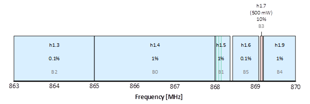
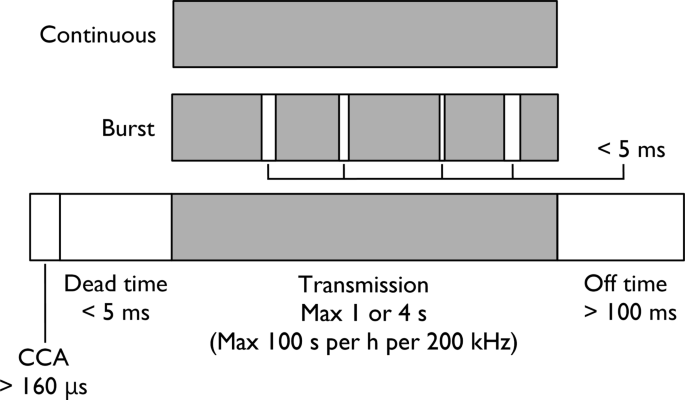
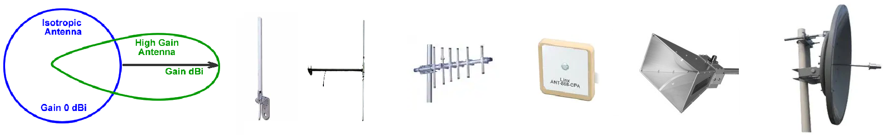
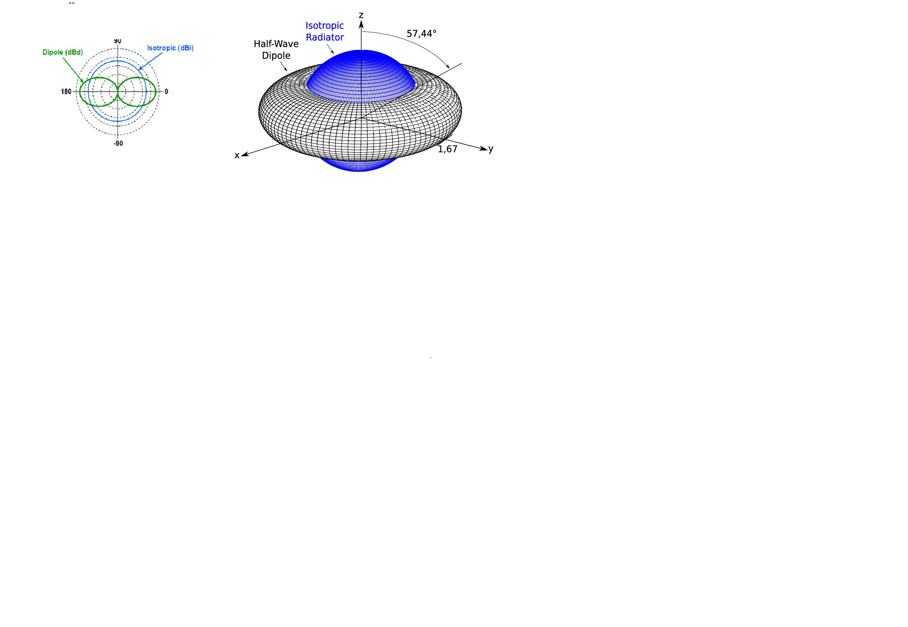
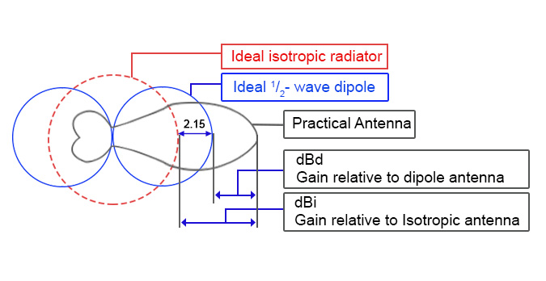
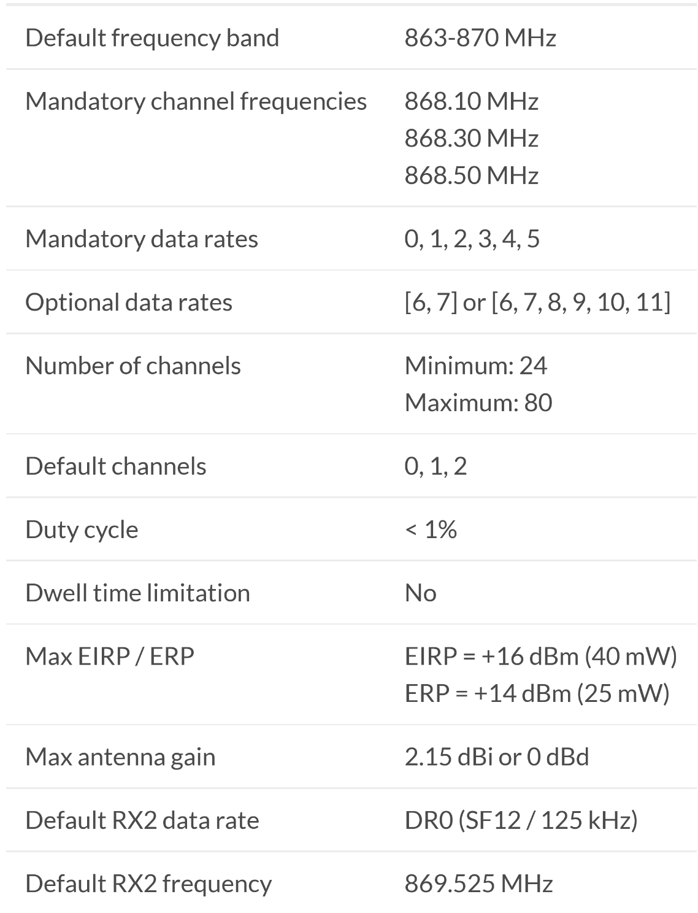
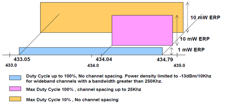
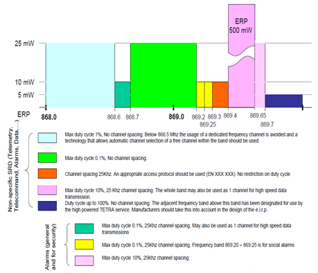
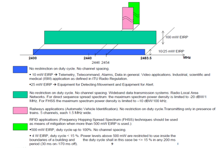

> [Torna a reti di sensori](sensornetworkshort.md#interfaccia-radio)>[Torna a reti Lorawan](lorawanclasses.md)

## Banda ISM

Le bande libere sono frequenze di uso libero, non tutelate, che non richiedono concessioni per il loro impiego. Sono spesso indicate come ISM (*Industrial, Scientific and Medical*) [Nota 1].

In realtà ISM è un sottogruppo di tutte le frequenze disponibili. L'uso di tali bande è regolamentato in modo da consentirne l'impiego condiviso ed evitare che un utente o un servizio possa monopolizzare la risorsa.

In tabella un elenco parziale con le principali limitazioni:


L'ente regolatore — in Italia il MIMIT (ex MISE, Ministero delle Imprese e del Made in Italy) — fissa i criteri per stabilire il diritto di accesso: distinzione fra uso privato e non, destinazione di frequenze a servizi con finalità diverse, ecc. L'uso delle bande libere è destinato ad apparati denominati **SRD** (*Short Range Devices*). La banda sub-GHz 862-876 MHz, molto utilizzata da dispositivi SRD, ricade nel Piano Nazionale di Ripartizione delle Frequenze ed è soggetta ad autorizzazione generale; storicamente parte di questo range è stata coordinata con il Ministero della Difesa.

I **parametri** e le **limitazioni** che vedremo sono criteri di accesso al mezzo radio volti a ridurre i **disturbi mutui** fra i vari servizi e la **monopolizzazione** di un canale da parte di un singolo utente. I criteri riguardano anche alcuni dettagli fisici e tecnici.

---

## Duty cycle

Il duty cycle indica il rapporto fra il tempo di **trasmissione** e il tempo **totale** (trasmissione + silenzio) in una finestra di osservazione. È equivalente a un **periodo di attesa obbligatorio** fra una trasmissione e la successiva. Ad esempio, un duty cycle dell'1% impone che a fronte della trasmissione di un pacchetto della durata di un secondo, l'apparato non possa trasmettere per i successivi 99 secondi.

Questo parametro limita la radio a trasmissioni brevi e poco frequenti, escludendo per esempio gli streaming audio e video. La **durata predefinita del periodo di osservazione è di un'ora**, salvo diverse specifiche per la banda di frequenza considerata. Attualmente tutte le bande sub-GHz europee usano il periodo di osservazione di un'ora.

I duty cycle previsti da ETSI variano dallo **0,1%** (3,6 s all'ora), all'**1%** (36 s all'ora), fino al **10%** (360 s all'ora). Il tempo cumulativo di occupazione del canale può essere riassunto:

```text
0,1%   → 3,6 s/ora       (86 s al giorno)
1%     → 36 s/ora        (864 s al giorno)
10%    → 360 s/ora       (8.640 s al giorno)
```

### Calcolatori online

Un esempio di calcolatore online di duty cycle / time-on-air per LoRaWAN è:
<https://avbentem.github.io/airtime-calculator/ttn/eu868>

---

## Canali e bande

I **canali** sono intervalli di frequenza adoperati per allocare nel dominio della frequenza la trasmissione di una sorgente. Un canale è caratterizzato da una frequenza centrale e da un'ampiezza (rappresentabile anche come escursione dalla frequenza centrale).

Le **bande** sono intervalli di frequenza all'interno dei quali sono allocabili un certo numero di canali. Organizzare i canali in bande serve a isolare gruppi di canali destinati agli **stessi servizi**. Organizzare i canali in **sottobande** serve a isolare gruppi di canali a cui applicare le **stesse regole** (duty cycle, potenza, modalità di accesso).

Le sottobande LoRaWAN in Europa secondo ETSI EN 300 220 sono:



```text
K  (863,0 – 865,0 MHz)   → 0,1%   25 mW ERP
L  (865,0 – 868,0 MHz)   → 1%     25 mW ERP
M  (868,0 – 868,6 MHz)   → 1%     25 mW ERP
N  (868,7 – 869,2 MHz)   → 0,1%   25 mW ERP
P  (869,4 – 869,65 MHz)  → 10%    500 mW ERP
Q  (869,7 – 870,0 MHz)   → 1%     5 mW ERP
```

> **Nota.** L'uso "uplink vs downlink" delle sotto-bande non è una prescrizione regolatoria ETSI, ma una **convenzione adottata da LoRaWAN**: gli uplink ricadono tipicamente in L (canali 867,1–867,9) e M (canali 868,1/3/5), il downlink RX2 in P (869,525 MHz) per beneficiare del duty cycle al 10% e dei 500 mW di potenza.

**Canali LoRaWAN EU868:**

```text
Uplink:
  1. 868,1 MHz   SF7BW125 ÷ SF12BW125          (sotto-banda M)
  2. 868,3 MHz   SF7BW125 ÷ SF12BW125, SF7BW250 (sotto-banda M)
  3. 868,5 MHz   SF7BW125 ÷ SF12BW125          (sotto-banda M)
  4. 867,1 MHz   SF7BW125 ÷ SF12BW125          (sotto-banda L)
  5. 867,3 MHz   SF7BW125 ÷ SF12BW125          (sotto-banda L)
  6. 867,5 MHz   SF7BW125 ÷ SF12BW125          (sotto-banda L)
  7. 867,7 MHz   SF7BW125 ÷ SF12BW125          (sotto-banda L)
  8. 867,9 MHz   SF7BW125 ÷ SF12BW125          (sotto-banda L)
  9. 868,8 MHz   FSK                            (sotto-banda M)

Downlink:
  RX1: stessa frequenza dell'uplink (canali 1-9)
  RX2: 869,525 MHz   SF12BW125 (DR0)             (sotto-banda P)

Conversioni dBm ↔ mW:
  +14 dBm = 25 mW
  +16 dBm = 40 mW
  +27 dBm = 500 mW
```

---

## Duty cycle in LoRaWAN

Il duty cycle non è una regola del protocollo LoRaWAN, è una regola **regolatoria europea** (ETSI EN 300 220) che vincola chiunque trasmetta nella banda 863-870 MHz, sia esso un device o un gateway.

Vale quindi sia per gli **uplink** trasmessi dai device, sia per i **downlink** trasmessi dal gateway. Il limite **dipende dalla sotto-banda** su cui si trasmette, non dalla direzione.

| Sotto-banda | Frequenze | Duty cycle | ERP max | Uso tipico in LoRaWAN |
|---|---|---|---|---|
| K | 863,0 – 865,0 MHz | 0,1% | 25 mW | poco usato |
| L | 865,0 – 868,0 MHz | 1% | 25 mW | uplink (canali 867,1–867,9) |
| **M** | **868,0 – 868,6 MHz** | **1%** | **25 mW** | **uplink** (canali 868,1/3/5) |
| N | 868,7 – 869,2 MHz | 0,1% | 25 mW | poco usato |
| **P** | **869,4 – 869,65 MHz** | **10%** | **500 mW** | **downlink RX2** (869,525) |
| Q | 869,7 – 870,0 MHz | 1% | 5 mW | poco usato |

### Finestre di ricezione del downlink Class A

Un end-device Class A apre due finestre di ricezione dopo ogni uplink:

- **RX1**: 1 secondo dopo l'uplink, **sulla stessa frequenza** dell'uplink, con uno SF derivato. Se il gateway risponde in RX1 → trasmette per esempio su 868,1 MHz (sotto-banda M), quindi con duty cycle **1%**, come gli uplink. In RX1 lo SF del downlink è determinato dallo SF dell'uplink secondo la tabella "RX1 DR offset" definita per regione. In EU868 con offset = 0 (default) la regola è:
  
  > **SF del downlink RX1 = SF dell'uplink**

- **RX2**: 2 secondi dopo l'uplink, **frequenza fissa 869,525 MHz**, SF di default **SF12BW125 (DR0)**. Se il gateway risponde in RX2 → trasmette in sotto-banda P, quindi con duty cycle **10%**, dieci volte più budget. In RX2 lo SF è un valore fisso scelto dal Network Server e comunicato al device. Il default LoRaWAN (SF12, DR0) è pensato per massimizzare la sensibilità del downlink di emergenza (LinkADRReq di setup, configurazioni OTA). Si può cambiare ma non è consigliabile se si vuole garantire alta probabilità di consegna di messaggi critici ai dispositivi remoti.

---

## Parallelizzazione in uplink in LoRaWAN EU868

In LoRaWAN si parla di "parallelizzazione" in tre sensi diversi che è importante distinguere, perché operano su scale diverse e con conseguenze diverse sul duty cycle.

### 1. Parallelismo del singolo dispositivo: non esiste

Un end-device ha **un solo modem radio** (SX1276 o SX1262) con una sola catena RF e un solo PLL. Può trasmettere su **una frequenza alla volta**. Quando "salta" tra canali (*channel hopping*), lo fa in sequenza, non in parallelo: una TX su 868,1, poi un'altra su 867,3, poi su 868,5, e così via.

Non è una restrizione regolatoria europea, è un vincolo hardware uguale in tutto il mondo.

### 2. Parallelismo del gateway: ricezione concorrente

Il gateway, al contrario del device, usa un chip *concentrator* (SX1301 / SX1302 / SX1303) con **8 demodulatori paralleli**. Può quindi **ricevere fino a 8 uplink simultanei** su frequenze e Spreading Factor diversi senza collisioni a livello fisico. [Ddettagli su parallelizzazione canali gateway LoRa](approfondimenti/lorawan_accesso_multiplo.md)

Conseguenze pratiche:

- Se 8 device trasmettono nello stesso istante su 8 frequenze diverse, il gateway li riceve tutti.
- Se due device trasmettono nello stesso istante sulla stessa frequenza e stesso SF, c'è collisione e (probabilmente) il gateway perde entrambi (vedi [Ortogonalità LoRa](approfondimenti/ortogonalita-lora.md) e [Dettaglio tecnologie di accesso al mezzo radio](accessoradio.md#lora)).
- Lo SF aggiunge un livello extra di "isolamento": due segnali sulla stessa frequenza con SF diversi sono in larga misura indipendenti grazie alla quasi-ortogonalità del *chirp spread spectrum*. Il gateway li può separare.

A livello di **sistema**, LoRaWAN EU868 è progettato per gestire molti uplink concorrenti, e la parallelizzazione lato infrastruttura è una caratteristica fondante.

### 3. Parallelizzazione "nel tempo": distribuire le TX su più canali e sotto-bande

Questa è la forma di parallelismo che riguarda davvero il device, ed è il motivo per cui si parla di "duty cycle aggregato".

**Il principio.** Il device non trasmette davvero in parallelo (vedi punto 1), ma **distribuendo le TX consecutive su canali diversi**, e soprattutto su **sotto-bande diverse**, ottiene una capacità di trasmissione aggregata superiore a quella che avrebbe restando su una sola frequenza.

**Perché funziona.** ETSI impone il duty cycle **per sotto-banda di frequenza**, non per dispositivo. Quindi se il device usa canali in:

- sotto-banda **L** (865–868 MHz) → 1% di budget dedicato = 36 s/ora
- sotto-banda **M** (868–868,6 MHz) → 1% di budget dedicato = 36 s/ora

I due budget sono **indipendenti**. Il device può consumare entrambi, arrivando a **72 secondi di TX per ora**, ovvero un duty cycle "del dispositivo" (descrittivo) del 2%, pur restando perfettamente entro l'1% **per sotto-banda** che è la regola normativa.

| Configurazione | Canali | Sotto-bande coinvolte | TX time/ora aggregato |
|---|---|---|---|
| Solo 3 canali standard | 868,1 / 868,3 / 868,5 | solo M | 36 s |
| 8 canali standard estesi | 867,1/3/5/7/9 + 868,1/3/5 | L + M | **72 s** |
| 3 canali nella stessa sotto-banda | tutti in M | solo M | 36 s (nessun guadagno) |

**Nota importante.** Aprire più canali **nella stessa sotto-banda** non aumenta il budget aggregato. I 3 canali obbligatori 868,1 / 868,3 / 868,5 sono tutti in sotto-banda M: usarli tutti e tre non triplica il budget, lo distribuisce sui tre canali.

### 4. Quello che NON è ammesso

Tre cose che a volte si pensano possibili in Europa ma non lo sono:

- **Trasmissioni simultanee dallo stesso device**: richiederebbe due modem RF, hardware non standard.
- **Channel bonding** stile WiFi (due canali da 125 kHz fusi in uno da 250 kHz per raddoppiare il throughput). In LoRaWAN non esiste: ogni canale è un'entità separata. L'unica eccezione è DR6 a 250 kHz, ma è una larghezza di banda diversa, non un'aggregazione.
- **Trasmettere senza duty cycle "perché tanto cambio canale"**. Il duty cycle si misura sulla sotto-banda; cambiare canale all'interno della stessa sotto-banda non aiuta. Cambiare sotto-banda sì, ma si resta comunque vincolati all'1% di ciascuna.

### 5. Implicazioni pratiche

- **Configurare il device per usare tutti gli 8 canali EU868** (e non solo i 3 obbligatori) è di fatto un *raddoppio* del budget di TX. Librerie come `ulora` lo fanno di default con `country="EU"`.
- **Il gateway deve essere configurato per ascoltare gli stessi canali** del device, altrimenti i pacchetti sui canali "estranei" cadono nel vuoto.
- **Il duty cycle dell'1% è la regola legale**, ma il vincolo pratico per applicazioni dense è il **tempo radio del gateway**: un singolo gateway che riceve molti device in zona può saturare la sua capacità in ricezione (8 demodulatori) o in trasmissione (una sola TX simultanea per i downlink).
- **Per applicazioni che richiedono molti uplink veloci**, l'unica strada legittima è ridurre il *time-on-air* per messaggio (SF basso, payload piccolo, coding rate 4/5) e distribuire bene sui canali, non cercare scorciatoie regolatorie.

---

## Modalità avanzate di accesso: LBT e AFA

> **Nota.** Questo regime alternativo è previsto da ETSI ma **in LoRaWAN EU868 non viene utilizzato in pratica**: le LoRa Alliance Regional Parameters per EU868 prescrivono esplicitamente il regime a duty cycle, e di conseguenza gli stack diffusi (LMIC, ulora, LoRaMac-node, MultiTech mPower) non implementano LBT per questa regione. I motivi principali sono tre: (1) i moduli LoRa a basso costo non sono pensati per restare in ricezione prima di ogni TX, peggiorando il consumo di batteria; (2) la certificazione ETSI in modalità LBT è più complessa e costosa di quella in duty cycle; (3) la quasi-ortogonalità degli SF e gli 8 canali distinti rendono già le collisioni rare, quindi il "guadagno" di LBT non giustifica la complessità aggiuntiva. LBT/AFA è invece **obbligatorio** in altre regioni (profili regionali AS923 per Giappone e parte dell'Asia, KR920 per la Corea del Sud), dove esistono profili LoRaWAN dedicati. La sezione che segue resta utile come **completezza teorica e di riferimento normativo**.

ETSI EN 300 220 consente, in alternativa al regime a duty cycle, due **schemi di riferimento** più sofisticati: ascolto prima di trasmettere (LBT) e agilità di frequenza adattiva (AFA).

**LBT (*Listen Before Talk*)** è una modalità in cui un dispositivo, prima di trasmettere, deve ascoltare se il mezzo è già in uso attraverso una funzione di **CCA** (*Clear Channel Assessment*).

- Se il canale è **libero**, e sono passati almeno 100 ms dall'ultima trasmissione, il device può trasmettere immediatamente.
- Se il canale è **occupato**, per evitare collisioni la trasmissione deve essere spostata:
    - **nel tempo**: il dispositivo attende che il canale diventi libero **e** che siano passati almeno 100 ms dall'ultima trasmissione, sommando un *backoff* casuale, prima di ritentare il CCA sullo stesso canale;
    - **nella frequenza** (**AFA**): il dispositivo esegue immediatamente un nuovo CCA su un altro canale.

Quando uno di questi meccanismi viene implementato correttamente, il limite normativo viene portato a **100 secondi di trasmissione cumulativa per ora su ogni intervallo di spettro di 200 kHz**, che corrisponde a un duty cycle effettivo del **circa 2,78%** (100/3600).



### Duty cycle aggregato con LBT

L'uso di LBT con molti canali nella maschera dei canali riduce la probabilità che le trasmissioni subiscano ritardi. Più canali si adoperano per trasmettere, più tempo di trasmissione aggregato si può occupare nell'arco di un'ora. Il duty cycle effettivo in regime LBT si può calcolare in base al numero di canali abilitati come:

```text
Duty cycle effettivo LBT = (numero di canali × 100) / 3600
```

Per esempio, abilitando **due canali** in regime LBT si ottiene un **duty cycle effettivo del 5,6%**.

> **Attenzione.** Questa formula vale **solo in regime LBT**. Nel regime classico a duty cycle (quello usato da LoRaWAN EU868 standard) il vincolo è 1% **per sotto-banda**, non per canale, e la formula non si applica.

### Vincoli tecnici su CCA e backoff

- Il controllo CCA deve avere una durata minima di **160 μs**.
- Dopo questo controllo, se il canale è libero, il dispositivo deve attendere un tempo di attesa fisso di **5 ms** prima di iniziare una nuova trasmissione (nel CSMA/CA si chiama DIFS).

### Definizione di trasmissione singola

Una trasmissione ha **durata massima** di 1 s o 4 s a seconda del tipo. Si definisce **trasmissione singola** una delle due seguenti situazioni:

- una sequenza continua di bit, senza interruzioni;
- una serie di sequenze distinte, purché separate da intervalli inferiori a 5 ms.

### Finestra di opportunità

In alcune implementazioni, se un dispositivo rileva che il canale è libero immediatamente dopo un breve periodo di ascolto (inferiore allo standard), potrebbe essere consentito trasmettere immediatamente senza attendere l'intero periodo minimo. Questo può avvenire **solo se le regolamentazioni locali lo permettono**. Alcune eccezioni:

- **Reti private**: in una rete LoRaWAN privata configurata per un campus aziendale, i gestori possono configurare tempi di attesa minima più brevi, ottimizzando latenza ed efficienza per applicazioni specifiche.
- **Applicazioni di emergenza**: un dispositivo di allarme antincendio può avere priorità di trasmissione che gli consente di ignorare il tempo di attesa minimo e trasmettere immediatamente al rilevamento.

---

## Potenza disponibile massima

La potenza, in genere espressa in **mW** (millesimi di watt) o in **dBm**, è il parametro che indica quanto un trasmettitore può "spingere" in uscita. In taluni casi, in relazione alla larghezza di banda, si fa riferimento alla **densità di potenza** (mW/MHz o mW/kHz). È il caso degli apparati WLAN e HiperLAN.

### EIRP ed ERP

La potenza è generalmente riferita al **segnale irradiato** sotto forma di misura ERP o EIRP. L'antenna è un componente passivo, ma possiede pur sempre una sorta di guadagno: il guadagno quantifica la capacità dell'antenna di concentrare l'energia irradiata (o ricevuta) in una determinata direzione.

#### Antenne isotrope

Un'antenna si dice **isotropa** quando emette la stessa potenza in tutte le direzioni: non possiede direzioni di emissione privilegiate. In una sfera centrata sull'antenna, la densità di potenza è la stessa in ogni punto della superficie. È un'approssimazione ideale: le antenne reali, a parità di distanza, distribuiscono l'energia in maniera non uniforme al variare della direzione.



#### Antenne direttive

Le antenne **direttive** sono progettate per introdurre di proposito un guadagno ulteriore sulla potenza fornita dal trasmettitore, detto **guadagno d'antenna**, dovuto alla capacità di concentrare la potenza irradiata in una **direzione privilegiata**. Questa direzione è quella in cui si concentra la densità massima di energia, che rimane significativa (almeno la metà) in un cono detto **apertura a 3 dB**: 3 dB è la differenza di intensità del fascio tra la direzione di massima emissione e i bordi del cono in cui la potenza misurata vale la metà di quella massima.

Il guadagno elevato in un cono di apertura più o meno stretta avviene al prezzo di una perdita in tutte le altre direzioni: si concentra in una direzione ciò che si perde in tutte le altre. La direzione di minima intensità è paradossalmente quella alla base dove si alimenta l'antenna.

#### Principio di reciprocità

Collega il comportamento di un'antenna ricevente a quello che la stessa possiede quando è usata come trasmittente. Le proprietà di un'antenna ricevente (ampiezza di banda, direttività, ecc.) sono le stesse che avrebbe la stessa antenna usata come trasmittente.



### Antenne direttive vs omnidirezionali

Per ottenere il massimo guadagno complessivo di un collegamento è necessario **collimare** le antenne trasmittente e ricevente nella direzione di massimo guadagno. Maggiore è la direttività delle antenne, più precisa e stabile nel tempo deve essere mantenuta la collimazione (aspetto praticamente critico). Funziona per collegamenti fissi **punto-punto** come i ponti radio.

Se invece uno dei terminali è **mobile** o il collegamento è **punto-multipunto** con un cluster di dispositivi sparpagliati nello spazio, è più pratico usare antenne con bassa direttività o **omnidirezionali** almeno su un lato (il gateway). Nella banda ISM, per limitare le interferenze ad altri dispositivi vicini, si lasciano pressoché omnidirezionali anche le antenne lato dispositivi terminali.



### EIRP, ERP e relazione dBd ↔ dBi

- **EIRP** (*Effective Isotropic Radiated Power*) di un'antenna direttiva è la potenza con cui dovrebbe essere alimentata un'antenna **isotropa** per irradiare la stessa potenza che viene emessa dall'antenna direttiva nella sua direzione di massimo irraggiamento. EIRP è la somma della potenza erogata dal trasmettitore più il guadagno d'antenna (al netto delle perdite sul cavo).
- **ERP** (*Effective Radiated Power*) è analoga, ma riferita alla potenza emessa da un **dipolo a mezz'onda** orientato normalmente alla direzione di massima intensità dell'antenna direttiva (di solito un'antenna verticale con propagazione parallela al piano terrestre). In questo caso si valuta il guadagno dell'antenna rispetto al guadagno di un dipolo standard.

La relazione tra le due unità di misura è fissa:

> **dBi = dBd + 2,15 dB**

cioè un'antenna isotropa "guadagna" 2,15 dB in meno rispetto a un dipolo a mezz'onda nella sua direzione di massima irradiazione. Equivalentemente, **ERP < EIRP di 2,15 dB** per la stessa antenna.

Un limite comune delle regolamentazioni è fissare l'**ERP** uguale alla massima potenza disponibile sul morsetto d'antenna: ciò implica che l'antenna **non debba guadagnare** rispetto a un dipolo a mezz'onda, ovvero che guadagni al massimo **2,15 dB** rispetto a un'antenna isotropa.

### Link budget

Tra trasmettitore e ricevitore si può valutare il cosiddetto **link budget**: la somma dei guadagni e delle attenuazioni lungo il percorso. L'obiettivo è verificare il vincolo finale sul ricevitore: che la potenza ricevuta sia maggiore della **sensibilità minima** del ricevitore più un **margine di sicurezza** per tenere conto del *fading* ambientale (multipath, attenuazione atmosferica), che varia nel tempo. Dettagli del calcolo: <https://www.vincenzov.net/tutorial/elettronica-di-base/Trasmissioni/link.htm>

Si tratta di un calcolo "di massima" che fornisce indicazioni sulla fattibilità teorica di un collegamento; se positiva, richiede comunque attente e ripetute **verifiche sul campo** nelle condizioni di esercizio previste.

### Sensitività e Spreading Factor

Nelle modulazioni a **spettro espanso**, la sensitività del ricevitore varia a seconda del fattore di spreading rispetto al segnale a banda stretta originale (125 kHz). In linea generale, SF più alti **migliorano** la sensibilità del ricevitore. Esempio per i ricevitori LoRa Semtech:

```text
SF7   →  -123 dBm
SF8   →  -126 dBm
SF9   →  -129 dBm
SF10  →  -132 dBm
SF11  →  -134,5 dBm
SF12  →  -137 dBm
```

---

## Dimensione massima del messaggio

Le regole ISM non pongono esplicitamente limiti alla lunghezza del messaggio, anche se talvolta ne impongono una **durata massima** (in particolare con LBT in Europa), detta **dwell time**. Fattori tecnici, stabiliti dal protocollo in uso sul canale, limitano la dimensione del messaggio.

Nel caso di LoRaWAN, la **velocità dei dati** dipende da fattore di spreading, larghezza di banda e velocità di codifica. La tabella seguente presenta configurazioni e velocità per ciascun data rate (DR0–DR15) in EU868:

| Data rate | Configurazione | Bit rate (bit/s) | MAC payload max (B) | App payload max (B) |
|---|---|---|---|---|
| 0  | LoRa: SF12 / 125 kHz | 250 | 59 | 51 |
| 1  | LoRa: SF11 / 125 kHz | 440 | 59 | 51 |
| 2  | LoRa: SF10 / 125 kHz | 980 | 59 | 51 |
| 3  | LoRa: SF9 / 125 kHz | 1.760 | 123 | 115 |
| 4  | LoRa: SF8 / 125 kHz | 3.125 | 230 | 222 |
| 5  | LoRa: SF7 / 125 kHz | 5.470 | 230 | 222 |
| 6  | LoRa: SF7 / 250 kHz | 11.000 | 230 | 222 |
| 7  | FSK: 50 kbps | 50.000 | 230 | 222 |
| 8  | LR-FHSS CR1/3: 137 kHz BW | 162 | 58 | 50 |
| 9  | LR-FHSS CR2/3: 137 kHz BW | 325 | 123 | 115 |
| 10 | LR-FHSS CR1/3: 336 kHz BW | 162 | 58 | 50 |
| 11 | LR-FHSS CR2/3: 336 kHz BW | 325 | 123 | 115 |
| 12-14 | RFU (reserved) | — | — | — |
| 15 | definito in [TS001] | — | non definito | non definito |

> **Nota sui bit rate.** I valori riportati per SF7÷SF12 sono quelli canonici della tabella LoRa Alliance EU868 e rappresentano il *bit rate utile* arrotondato. I valori esatti dipendono dal coding rate (4/5÷4/8) e includono l'header LoRa.

---

### Tecnologia LoRaWAN: schema riassuntivo



### Allocazione bande ISM

Schemi riassuntivi che illustrano la situazione normativa per le varie bande ISM:





---

## Sitografia

- <https://docdb.cept.org/download/3700>
- <https://www.etsi.org/deliver/etsi_en/300200_300299/30022002/03.02.01_60/en_30022002v030201p.pdf>
- <https://blog.semtech.com/certifying-an-end-device-for-lorawan-european-sub-bands>
- <https://www.thethingsnetwork.org/docs/lorawan/regional-limitations-of-rf-use/>
- <https://www.thethingsnetwork.org/docs/lorawan/regional-parameters/eu868/>
- <https://www.thethingsnetwork.org/docs/lorawan/duty-cycle/>
- <https://docs.heltec.org/general/lorawan_frequency_plans.html>
- <https://lora-developers.semtech.com/documentation/tech-papers-and-guides/lora-and-lorawan/>
- <https://jwcn-eurasipjournals.springeropen.com/articles/10.1186/s13638-019-1502-5>
- <http://mwl.diet.uniroma1.it/IACEm/02_proprieta_antenne.pdf>
- <https://blog.semtech.com/lorawan-protocol-expands-network-capacity-with-new-long-range-frequency-hopping-spread-spectrum-technology>
- <https://lora.readthedocs.io/en/latest/>
- <https://lora-alliance.org/wp-content/uploads/2020/11/lorawan_regional_parameters_v1.0.3reva_0.pdf>
- <https://dl.acm.org/doi/10.1145/3546869>
- <https://static1.squarespace.com/static/54cecce7e4b054df1848b5f9/t/57489e6e07eaa0105215dc6c/1464376943218/Reversing-Lora-Knight.pdf>
- <https://wirelesspi.com/understanding-lora-phy-long-range-physical-layer/>
- <https://thesis.unipd.it/retrieve/d813d8b9-9d45-4158-acbc-eada172983c8/Chinta_Venkata_Rajesh.pdf>
- <https://www.vincenzov.net/tutorial/elettronica-di-base/Trasmissioni/antenne.htm>
- <https://www.radartutorial.eu/06.antennas/an18.it.html>
- <https://edmelectronics.editorialedelfino.it/come-leggere-un-diagramma-di-irradiazione/>
- <https://teletopix.org/what-is-polarization-gain-and-power-rating-in-antenna/>
- <https://www.everythingrf.com/community/what-is-the-difference-between-dbi-and-dbd>

> [Torna a reti di sensori](sensornetworkshort.md#interfaccia-radio)
