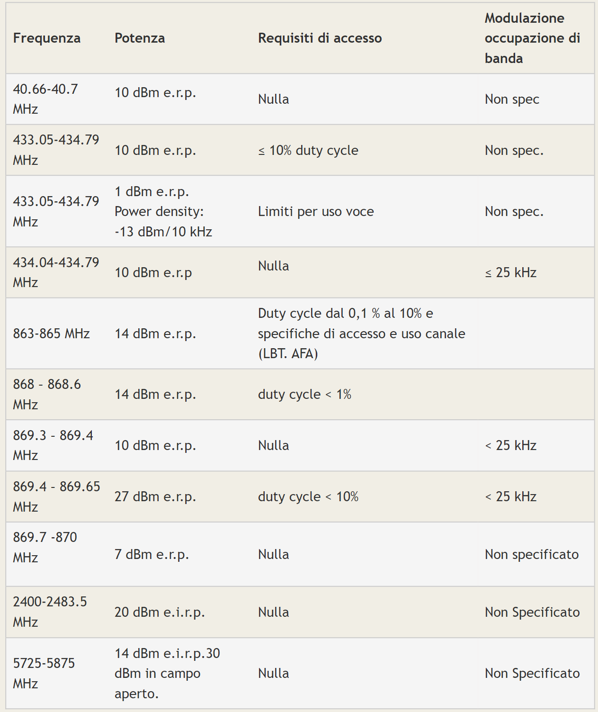

>[Torna a reti di sensori](sensornetworkshort.md#interfaccia-radio)

Le bande libere sono le frequenze di uso libero, non tutelate, che non richiedono concessioni per il loro impiego. Sono spesso indicate come ISM (Industrial, Scientific and Medical)[Nota 1].

In realtà ISM è un sottogruppo di tutte le frequenze disponibili.
L’uso di tali bande è regolamentato in modo da consentirne l’impiego condiviso ed evitare che un utente o un servizio possa monopolizzare la risorsa.

In tabella un elenco parziale con le principali limitazioni:

>[Torna a reti di sensori](sensornetworkshort.md#interfaccia-radio)
