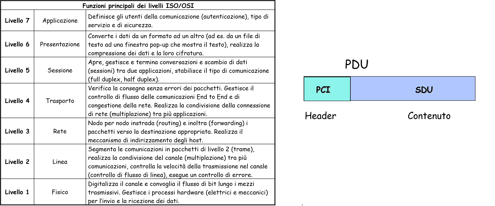
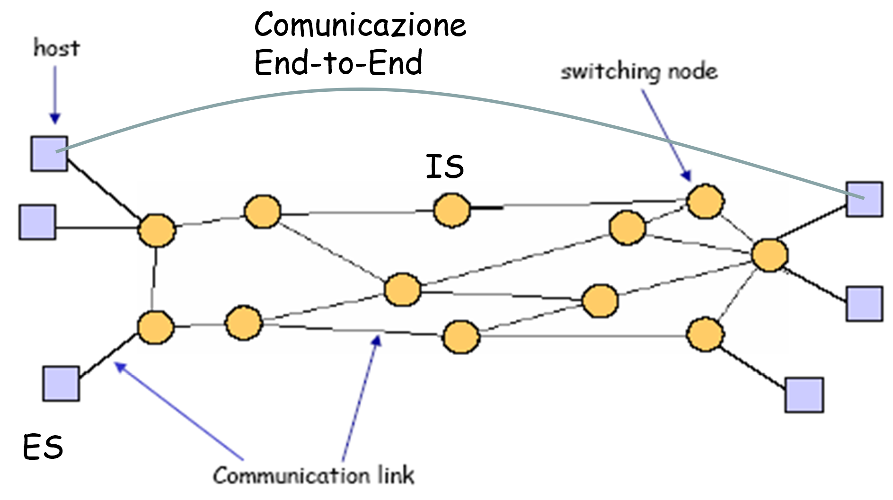
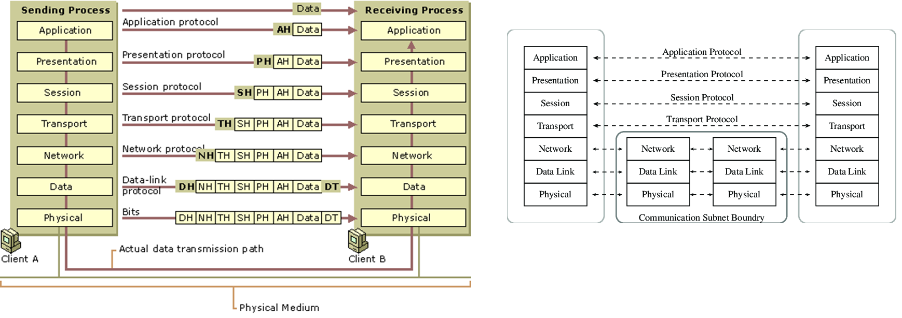

>[Torna a reti di sensori](sensornetworkshort.md#reti-di-sensori-e-attuatori)

## **Stack ISO/OSI**

### **Interoperabilità**

L'**ISO/OSI** ha catalogato e organizzato in una **architettura a 7 strati** tutti i **protocolli** concepiti nel tempo organizzandoli in base alle **categorie di problemi** di rete che essi risolvono. L'architettura è normalmente rappresentata sotto forma di **stack** (pila) e, per ogni elemento dello stack, identifica una **categoria di protocolli** che deve risolvere **un determinato insieme di problemi** della comunicazione in rete. L'architettura è **modulare** nel senso che uno strato può essere sostituito senza che quelli sopra di lui se ne accorgano permettendo una grande **flessibilità**. Questa flessibilità può essere utilizzata per **adattare** un protocollo di livello superiore a **vari mezzi fisici** o per ottenere su un certo mezzo fisico una determinata **qualità del servizio**. **Obiettivo finale** è garantire l'**interoperabilità universale tra i dispositivi** da collegare a prescindere dalle possibili differenze che possono intercorrere rispetto a marca, modello e tecnologie adoperate. 

### **Architettura a strati**

Un **vincolo dell'architettura** è che uno strato può dialogare solo con quelli adiacenti, o sopra o sotto di lui.

### **Canali virtuali**

I **canali virtuali** sono dei **canali logici** che vengono creati grazie alla tecnica dell'**imbustamento multiplo**. I **canali logici** hanno delle funzioni in più, di cui **non** godono i **canali fisici** sottostanti, che permettono di risovere quei problemi che si incontrano per realizzare una comunicazione **universale** tra dispositivi **eterogenei**.

Ogni **canale logico** serve a collegare tra loro le **due entità**, moduli SW con un certo **ruolo** (analoghi a certi impiegati tra i tanti di una grande azienda), che sono deputate a risolvere solamente **certi problemi**, tutti e soli quelli che rienrano all'interno delle **mansioni** che competono loro. 

La **risoluzione dei problemi** di rete è sempre **distribuita**, nel senso che non può avvenire senza lo **scambio di messaggi di servizio** che servono a coordinare il lavoro tra le **entità pari**, cioè quelle dello **stesso livello**. I messaggi di servizio (detti **messaggi di controllo**) sono quelli legati al ruolo e alle mansioni dei due interlocutori del livello corrente e trascurano gli **altri** messaggi di servizio relativi ad **altre mansioni** che, essendo sotto la responsabilità di **altri ruoli** di **livelli differenti**, vengono, dalle entità del livello attuale, completamente **ignorate**.

Vale il principio di **astrazione**, che vuol dire che, man mano che **si sale**, ogni **livello** ha una visione del problema iniziale via via più **semplice e generale** che si occupa sempre meno dei **dettagli fisici** e, viceversa, sempre di più di problematiche concettuali legate alla **natura** del messaggio, del suo **significato** più che del **modo** con cui esso **viene scambiato**. La **soluzione astratta** di un problema ha il **vantaggio** di poter essere utilizzata uguale anche all'interno di **contesti differenti** dove i **dettagli** per la sua applicazione vengono declinati in **maniera diversa**. In genere, la soluzione astratta viene **adattata**, quella di dettaglio viene **sostituita**.

I **canali logici**, però, pur agendo in **contemporanea**, non sono affatto una replica di **7 messsaggi diversi** che giungono a destinazione percorrendo **7 canali fisici paralleli**. Il canale fisico è sempre **uno solo** e il messaggio fisicamente è sempre la **stessa sequenza** di bit ai capi delle due interfacce omologhe di **livello 1** (fisico). Quello che accade è che, intorno allo stesso messaggio di partenza, le informazioni di **controllo** necessarie per svolgere le funzioni di rete vengono **aggiunte e tolte** gradatamente passando da un livello all'altro:
- In **trasmissione** vengono **aggiunte** ad ogni livello scendendo lungo la pila.
- In **ricezione** vengono **rimosse** salendo di un livello alla  volta lungo la pila.   

Quello che cambia da un livello all'altro è la visione che le varie entità hanno del messaggio che, scendendo di livello, diventa via via più dettagliata
#### **Imbustamento multiplo**

Nelle **reti a pacchetto**, in fase di **trasmissione**, si usa una tecnica, detta **imbustamento multiplo**, con la quale si **incapsulano** i messaggi di un livello, le **PDU** (Protol Data Unit),  nel campo dati, detto **SDU** (Service Data Unit), del livello **immediatamente inferiore**. Questa operazione parte dal livello applicativo ed è **ripetuta** in tutti i livelli, escluso il fisico. Il **carico utile** o **payload** è il **messaggio** che la rete ha avuto in consegna, da parte dell'utente, per essere **spostato** fino alla destinazione. Ogni livello **aggiunge** al messaggio utente informazioni di controllo propriamente sue nel campo **header**. Il **livello fisico**, a seguito di tutti gli annidamenti, ha il **messaggio più lungo** perché è composto dal messaggio utente a dalla **somma di tutti gli header** aggiunti nei singoli livelli, detta, in gergo tecnico, **overhead**. 

All'**imbustamento multiplo** in **trasmissione** corrisponde lo **sbustamento multiplo in ricezione**, un'operazione analoga ma **inversa**, dove tutti i messaggi ricevuti a **livello fisico** incapsulati uno dentro l'altro, vengono, salendo da un livello all'altro, **sbustati** eliminando l'intestazione del livello immediatamente inferiore. Arrivati al **livello applicativo**, come risultato, si ottiene il **messaggio utente**. Quindi, l'**ordine** di **inserimento** delle **intestazioni** in trasmissione è esattamente l'inverso dell'ordine di **rimozione** delle stesse in ricezione, secondo una tipica **politica LIFO**.

**L'imbustamento multiplo** permette la creazione dei cosiddetti **canali virtuali** cioè dei collegamenti **apparenti** e **diretti** tra **strati corrispondenti** di dispositivi **remoti**. Un nodo può essere **logicamente** suddiviso in una serie di strati detti **"entità"**, ciascuna ha uno specifico **ruolo** nella comunicazione, caratterizzato da specifici **compiti** e **funzioni** (oltre quello della mera **consegna del payload** all'entità pari all'altro capo del canale virtuale) che hanno la particolarità di dover essere svolti in **maniera distribuita** nei vari nodi, attraverso lo scambio di opportuni **messaggi di controllo**. Ogni entità lascia, quindi, una traccia nel messaggio finale, dato che in esso è sempre possibile isolare sia il dato trasmesso da quella entità (**payload**) che le informazioni di controllo necessarie per realizzare le funzioni di quell'entità (**header**). 

Un **protocollo** del **livello generico N**:
- nel **processo di imbustamento**, vede come ultimo header, solo gli **header del suo livello** perchè gli header dei **livelli sottostanti** non sono ancora stati inseriti.
- Nel **processo di sbustamento** accade invece che un livello N vede solo l'**ultimo header affiorante**, cioè il proprio, perchè quelli dei **livelli sottostanti** sono stati **rimossi** al momento del loro sbustamento.

In ogni caso, anche un livello vedesse gli **header di livelli diversi** dal proprio, non saprebbe cosa farsene perchè rappresentano **informazioni di servizio** di un **protocollo diverso** dal proprio (con obiettivi diversi) che non saprebbe interpretare.

Il meccanismo dell'imbustamento/sbustamento fa si che, al momento in cui un pacchetto raggiunge un certo **livello N**, questo esibisca come **header più esterno** sempre un **N-PCI**, l'unico header che il protocollo di **livello N** è in grado di **interpretare**. Inoltre, il livello N sa che tutto quello che viene dopo un N-PCI è la **N-SDU (payload)** del proprio livello e va **consegnata** al livello superiore (o a quello inferiore) senza modifiche.

#### **Astrazione funzionale**

Ogni funzione di un livello **"astrae"**, cioè riassume in un'unica funzione di alto livello **generica**, molte funzioni dei livelli sottostanti legate a dettagli HW specifici. Per cui, la particolarità di questi collegamenti è quella di realizzare una **virtualizzazione della rete** e dei suoi dispositivi che, man mano che si sale dal livello fisico a quello applicativo, si fa sempre più spinta, **nascondendo** i dettagli implementativi degli strati inferiori e rendendo **ininfluenti** le loro **differenze** ai livelli sopra di essi. 

La **trasparenza** dei livelli aggiunge proprietà di **flessibilità** all'architettura perchè è possibile **sostituire** uno o più livelli inferiori senza la necessità di modificare tutti quelli superiori, promuovendo così il **riuso** dei livelli più astratti. 

Nel caso di una rete IP il **livello TCP** di trasporto già non **"vede"** più le differenze tecnologiche tra reti realizzate con un HUB WiFi piuttosto che con uno switch o piuttosto con più router in cascata, essendo stati questi dispositivi tutti **"astratti"**, cioè riassunti in un **unico collegamento** di tipo **TCP** tra **due host terminali** che rimane comunque valido anche modificando le tecnologie dei livelli più bassi.

| Livello | Nome                  | Astrazione fornita al livello superiore                                                                                                  | Funzioni svolte (riassunto incompleto)                        |
|---------|-----------------------|-------------------------------------------------------------------------------------------------------------------------|-----------------------------|
| 7       | Applicazione          | Fornisce all'applicazione un canale dedicato a 2 host e a 2 processi, a basso BER, FIFO e immune dalla perdita di pacchetti per congestione della rete e sovraccarico del ricevente e immune dalla perdita di pacchetti per mancato accordo sulle fasi della trasmissione e con un formato comune del payload                                                                                                                 | Non deve fare nulla, se non fornire l'indirizzo del destinatario |
| 6       | Presentazione         | Fornisce al livello 7 un canale dedicato a 2 host e a 2 processi, a basso BER, FIFO e immune dalla perdita di pacchetti per congestione della rete e sovraccarico del ricevente e immune dalla perdita di pacchetti per mancato accordo sulle fasi della trasmissione e con un formato comune del payload                                                                                                                 | Realizza una negoziazione dei formati del payload tra quelli disponibili ad entrambi gli interlocutori| 
| 5       | Sessione              | Fornisce al livello 6 un canale dedicato a 2 host e a 2 processi, a basso BER, FIFO e immune dalla perdita di pacchetti per congestione della rete e sovraccarico del ricevente e immune dalla perdita di pacchetti per mancato accordo sulle fasi della trasmissione | La trasmissione viene suddivisa in fasi su cui esiste un accordo su quanto durino e come si raggiungano |                                                                                                            |
| 4       | Trasporto             | Fornisce al livello 5 un canale dedicato a 2 host e a 2 processi, a basso BER, FIFO e immune dalla perdita di pacchetti per congestione della rete e per sovraccarico del ricevente | Esegue, tramite multiplazione,  la condivisione del canale IP tra più segmenti provenienti da processi diversi, abbassa ulteriormente la BER, limita la velocità del mittente a beneficio del ricevitore e della rete intera, esegue il riordino dei segmenti fuori ordine|                                                                                                          |
| 3       | Rete                  | Fornisce al livello 4 un canale dedicato a 2 host fisicamente lontani (remoti), a basso BER e steso tra i due endpoint scegliendo autonomamente il percorso dei pacchetti |      Realizza la localizzazione fisica del destinatario, il calcolo del percorso per raggiungerlo attraverso i nodi della rete e l'effettivo inoltro dei pacchetti IP da una porta di ingresso ad una di uscita di ciascun nodo lungo il percorso scelto.|                                                                         |
| 2       | Collegamento dati     | Fornisce al livello 3 un canale dedicato a 2 dispositivi fisicamente vicini e con bassa BER e immune dal sovraccarico del ricevente  | Realizza, tramite multiplazione dinamica TDM, una condivisione del canale tra più nodi e una rilevazione e correzione di errore tramite CRC e una limitazione di velocità del trasmittente |
| 1       | Fisico                | Fornisce al livello 2 un canale di bit tra due nodi fisicamente vicini                                | Esegue una codifica/decodifica dei bit nei segnali fisici (elettrici, radio o ottici) adatti ad un certo mezzo fisico|

Astrazioni interessanti sono quelle, di tipo **topologico**, che traducono una rete con molti **link fisici** in un unico **link logico** che li riassume tutti (astrazione). Questa cosa avviene tipicamente a:
- **livello 4**, dove una **intera rete IP**, composta da **link tra router** collegati, in genere, a maglia, viene astratta in un **link tra host** diretto (**Link End-to-End** virtuale come servizio di livello 4).
- In tutti gli **altri livelli** della pila OSI, canali punto-punto vengono astratti in altri canali **punto-punto** posti:
    - tra due **router vicini** (adiacenti) nei primi due livelli
    - tra i dispositivi **End to End** (host) nei livelli 5, 6 e 7.
  
Una **eccezione** notevole fanno le **LAN**, dove una **intera rete** LAN, composta di **link tra SW** collegati, in genere, ad albero, viene considerata come un link di livello 2 **diretto tra due router**. Ciò accade per una anomalia delle LAN in cui vi sono due **livelli di routing** complementari, di cui solo quello esterno **tra router** è, in realtà, **considerato** dall'architettura ISO/OSI:
- uno **esterno alla LAN** che si occupa della consegna dei pacchetti **tra i router di confine** delle LAN sorgenti e destinazione. Realizza un **inoltro** di **pacchetti IP** tra **router**.
- uno **interno alla LAN** che si occupa della consegna dei pacchetti tra l'**host sorgente** e il **router di confine** delle LAN **sorgente** e della consegna tra il **router di confine** della LAN di **destinazione** e l'**host** di destinazione. Realizza un **inoltro** di **trame MAC** tra **SW**. 

#### **Canale reale**

Il **canale reale** è il **mezzo trasmissivo** che unisce il **livello fisico** dei due interlocutori. Si sviluppa in **orizzontale** lungo il mezzo trasmissivo ma anche in **verticale** lungo le interfacce tra i vari strati, **a scendere** in trasmissione, **a salire** in ricezione.
I messaggi dei vari livelli, **incapsulati** uno dentro l'altro, vengono trasmessi in un **blocco unico** lungo il **canale reale**. Ma per comodità, all'**interno dei dispositivi**, ogni **messaggio applicativo**  può essere visto **destrutturato** in una serie di messaggi **separati** lungo i 7 **canali virtuali** dei singoli livelli.  Il **messaggio parziale**, trasmesso e ricevuto lungo un livello, è inviato con il **formato** e con le **regole** di trasmissione (**protocollo**) propri di quel livello. 

**In sostanza**, i messaggi che sono stati **generati** e **trasmessi separatamente** dai 7 livelli lungo i 7 **canali virtuali**, diventano un **unico messaggio matrioska** di 7 messaggi, **annidati** uno dentro l'altro, una volta che sono trasmessi lungo il **canale reale**. 

### **Nodi ES ed IS**

**Riassumendo**, i **canali virtuali non esistono fisicamente** ma sono **ugualmente reali** perchè, dal punto di vista dei **messaggi scambiati**, le **entità** pari (peer entity), cioè gli interlocutori corrispondenti nei vari livelli, si comportano come se essi ci fossero davvero e attraverso questi **effettivamente dialogassero**. Sono una **visione semplificata** con cui, ad un **livello superiore**, si possono **osservare** le funzioni svolte e i messaggi scambiati dai livelli inferiori. Semplificata, ma comunque reale.

**I canali virtuali** si dividono in:
- link **end to end**, chiamati così perché collegano livelli che sono presenti **soltanto** negli **host** cioè i **dispositivi terminali**, quelli su cui si **interfaccia l'utente**. I nodi **vicini** in questo collegamento virtuale soni i nodi **fisicamente più distanti**, in quanto la pila OSI realizza, a livello di servizio, un collegamento **virtuale dedicato e diretto** proprio tra nodi terminali.
- Più in basso (sui **primi 3** livelli), stanno i **link IS-IS** (collegamento tra  Intemediate systems), chiamati così perché collegano tra loro i **dispositivi di rete**, cioè quelli che creano la rete. Anche gli host posseggono questi livelli e pertanto sono, a tutti gli effetti, dispositivi di rete anch'essi (anche se privi di alcune funzioni importanti). I nodi **vicini** in questo collegamento virtuale soni i nodi della rete **fisicamente più prossimi**, in quanto la pila OSI realizza, a livello di servizio, un collegamento **virtuale dedicato e diretto** tra nodi vicini.

In figura la lettera H sta per **header** cioè intestazione (ad es. AH=Application header).

### **Architettura di riferimento**

Lo **stack di protocolli OSI** è un **modello architetturale** di riferimento. Per **ogni strato** sono stati studiati nel tempo un gran numero di protocolli, ciascuno con i propri **pregi e difetti**. Un'**architettura reale**, quella che poi verrà standardizzata ed implementata in un dispositivo commerciale, per ogni strato della propria pila, sceglierà, tra i tanti disponibili in letteratura tecnica, un certo **tipo di protocollo** del quale realizzerà e standardizzerà la propria **particolare versione**. 

Attualmente, per **accedere ad Internet** e all'interno della maggior parte delle **reti locali LAN**, si adopera la cosiddetta suite **TCP/IP**. In ogni caso, molte **reti di sensori**, per funzionare localmente al loro ambiente di lavoro, **non sempre usano** la suite TCP/IP. Inoltre, anche le reti di sensori che l'adoperano, ai livelli inferiori come **i livelli data link e il livello fisico**, spesso utilizzano protocolli **diversi** da quelli che sono stati standardizzati per le LAN. 

[Dettaglio multiplazioni statiche](multiplazioni.md)

[Dettaglio TDM statico su mezzi punto-punto](tdmstatico.md) 

[Dettaglio tecnologie di accesso al mezzo radio](accessoradio.md)

[Dettaglio TDM statistico su mezzi punto-punto](tdmstatistico.md) 

>[Torna a reti di sensori](sensornetworkshort.md#reti-di-sensori-e-attuatori)

