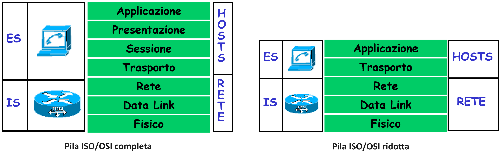
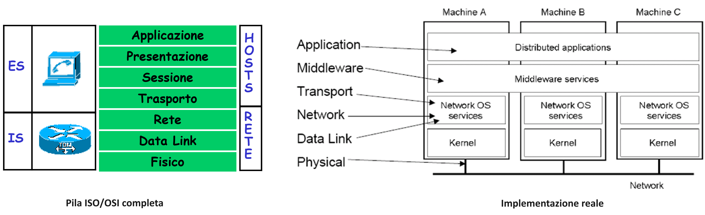
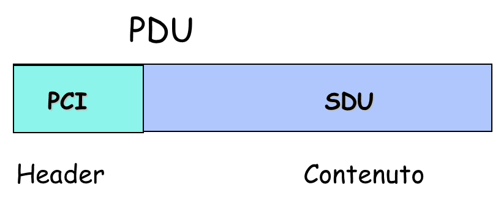
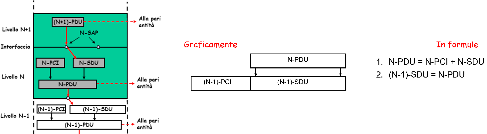
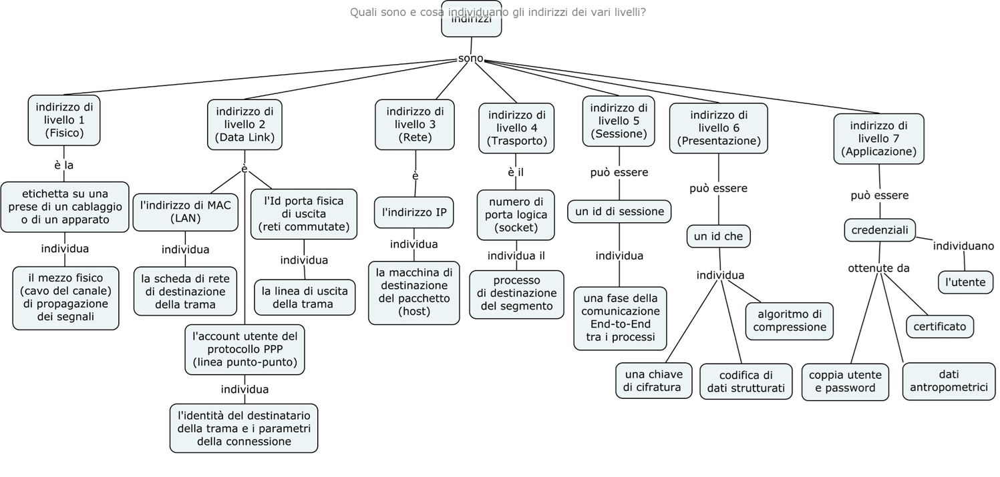

>[Torna a reti di sensori](sensornetworkshort.md#reti-di-sensori-e-attuatori)

# **Stack ISO/OSI**

## **Interoperabilità**

L'**ISO/OSI** ha catalogato e organizzato in una **architettura a 7 strati** tutte le funzioni di rete in base alle **categorie di problemi** di cui esse si occupano. Le funzioni, normalmente distribuite tra più nodi, si basano su **scambi di messaggi** e quindi sono gestite da **protocolli di comunicazione**. 

L'**architettura** è normalmente rappresentata sotto forma di **stack** (pila) e, per ogni elemento dello stack, identifica una **categoria di protocolli** che deve risolvere **un determinato insieme di problemi** della comunicazione in rete. 

Esiste anche un'architettura a **5 strati** che **non prevede** le funzioni di **sessione** e **presentazione**. Se delle funzioni di comunicazione non sono incluse nell’architettura però non vuol dire che queste siano inutili ma, semplicemente, che non è da questa architettura che esse sono svolte. La figura suggerisce che le funzioni degli **strati mancanti** siano **delegate** in toto all'**applicazione**.

L'architettura è **modulare** nel senso che uno strato può essere sostituito senza che quelli sopra di lui se ne accorgano permettendo una grande **flessibilità**. Questa flessibilità può essere utilizzata per **adattare** un protocollo di livello superiore a **vari mezzi fisici** o per ottenere su un certo mezzo fisico una determinata **qualità del servizio**. 

**Obiettivo finale** è garantire l'**interoperabilità universale tra i dispositivi** da collegare, a prescindere dalle possibili differenze che possono intercorrere rispetto a marca, modello e tecnologie adoperate. 

In questo senso, l'architettura ISO/OSI è concepita per un obiettivo ambizioso, realizzare una rete di tipo **geografico**, una tipica **WAN** (Wide Area Network) che sia operativa a livello globale, cioè tale da permettere di individuare una macchina o un servizio in rete a **livello mondiale**.

### **La rete di reti Internet**

La realizzazione tecnologica di questo obiettivo non è stata inizialmente ottenuta con un'**unica rete WAN** ma, in alternativa di compromesso, con una **federazione** di reti **WAN** e **LAN** eterogenee, la **Internet** propriamente detta, che ha poi riscosso immediato successo commerciale all'indomani dell'invenzione del **WWW** (World Wide Web) a partire dai primi anni 90' del secolo scorso. 

Lo **stack TCP/IP**, una particolare e fortunata implementazione dei livelli 4 e 3 della pila OSI che stanno alla base della rete Internet, ha consentito di tenere insieme, più che un'**unica WAN**, una **inter-network** di **reti eterogenee** regionali. Per fare ciò, ha utilizzato a livello 2 quei servizi di inoltro End To End che tipicamento stanno al livello 3 della pila ISO/OSI. 

In sostanza, una **rete proprietaria**, con propri schemi di indirizzamento (spesso non IP o con IP privati), viene utilizzata per creare un **link logico**, una sorta di **cavo dorsale virtuale**, tra router IP di una **Internet mondiale** che utilizza indirizzi **IP pubblici**. Una **Internet IP** è quindi una rete di **router IP** collegati tra loro da **link punto punto** che possono essere **fisici** oppure **virtuali**. Ogni **link virtuale** è spesso materialmente realizzato utilizzando i servizi applicativi di **livello 7** di una **rete regionale** con tecnologia arbitraria (MPLS, ATM, Ethernet).

Oggi il quadro è via via mutato. IP è diventata la tecnologia dominante e **Internet** è più simile ad insieme di **sottoreti omogeneee annidate** l'una dentro l'altra secondo una dimensione che scala da continentale a nazionale, e da nazionale a regionale. Le **reti regionali**, le MAN (Metropolitan Area Network), sono comunque ancora realizzate con tecnologie abbastanza varie e adoperano un **inoltro** (smistamento) dei pacchetti che non sempre è basato solamente su IP.

-  Per dettagli sull'architettura a strati vedi [architettura a strati](archstrati.md)

- Per delle domande riassuntive vedi [domande osi](domandeosi.md)

## **Modello ISO/OSI**

E’ composto da 7 livelli ordinati secondo una pila (stack) di protocolli dove gli **elementi attivi** di ogni livello, cioè quelli che svolgono le funzioni, sono le **entità**.

Entità appartenenti allo stesso livello, su sistemi diversi, sono dette **entità pari** (peer entities) e la comunicazione fra due peer ad un certo livello avviene: 
- per mezzo di un insieme di regole e convenzioni chiamate **protocollo del livello**
- tramite unità informative (pacchetti) dette **Protocol Data Unit** (PDU) 

La pila di protocolli è un “contenitore” di funzioni di rete che sta all’interno di un nodo di rete (IS o ES). In **ogni nodo**, esiste una pila di protocolli per ogni **scheda di rete** (interfaccia esterna) da esso posseduta.

| Livello | Nome                  |       Funzioni svolte                        |      Esempi di protocollo        |
|---------|-----------------------|-----------------------------|-----------------------------|
| 7       | Applicazione          |  Applicazione **Client/Server** che virtualizza una risorsa **remota** e **condivisa** facendola apparire come **locale** e **dedicata**, definisce il **tipo di utenti** e il **tipo di sicurezza** con cui dialogano| HTTP, DNS, DHCP, FTP, SFTP, scp, rsync, rclone |
| 6       | Presentazione         |  Traduce **documenti**, **flussi di dati**, **record**, **caratteri** da un formato all'altro (ad es. XML piuttosto che JSON oppure mp3 al posto di mp4), realizza la **compressione** dei dati e la loro **cifratura**, realizza la **serializzazione** degli oggetti (ad esempio struct)| MIME, XDR, HTML, XML, SSL, TLS, zip |
| 5       | Sessione              |   Apre, gestisce e termina conversazioni e scambio di dati (sessioni) tra due applicazioni stabilendone le **fasi**, gestisce il **tipo di comunicazione** (half duplex, full duplex) | SMB, NetBIOS  |                                                                                                   |
| 4       | Trasporto             | **Segmentazione** di ciascun pacchetto in più segmenti, **multiplazione** di più connessioni di livello 4 (uniscono processi remoti) in una stessa connessione di livello 3 (unisce due host remoti), **controllo di errore** End to End (con ritrasmissione), **controllo di flusso** End to End, **riordino** dei pacchetti fuori sequenza, **controllo di congestione** |   TCP, UDP      |                                                                                                  |
| 3       | Rete                  | **Indirizzamento**, cioè individuazione del luogo fisico in cui si trova l'host destinatario, esegue la **scelta** del percorso migliore per raggiungerlo (**routing**), esecuzione dell'**inoltro fisico** dei pacchetti, da una porta di ingresso a quella di uscita che sta nel percorso scelto, (**forwarding**) per ogni router incontrato lungo il percorso.  |   IP    |                                                                  |
| 2       | Collegamento dati     | **Segmenta** i messaggi lunghi aggiungendo loro l'indirizzo del mittente, esegue la **multiplazione** di più connessioni di livello 3 (uniscono coppie di host remoti) sulla stessa connsessione di livello 2 (unisce due nodi adiacenti), esegue il **controllo di errore** (senza ritrasmissione), esegue il **controllo di flusso** (velocità del mittente) | TDM statistico |
| 1       | Fisico                | Esegue la **codifica/decodifica** dei bit, cioè traduce i bit in segnali elettrici in **trasmissione** mentre traduce i segnali elettrici in bit **in ricezione**. Definisce gli **standard** meccanici ed elettrici dei canali.| Link punto-punto, Ethernet, WiFI, BLE, Zigbee, LoRa|

Si noti il ruolo della **segmentazione** ai livelli 2 e 4 che, frammentando lunghi stream di dati in unità informative più piccole, permette la **multiplazione** del canale, cioè la condivisione dello stesso tra pacchetti di **sorgenti diverse** che, a livello superiore, posseggono **indirizzi diversi**:
- a **livello 2**, il canale L2 diretto tra due **IS adiacenti** può essere condiviso da pacchetti L3 aventi indirizzi differenti. Permette sostanzialmente la **condivisione** dei **link** tra i vari router tra **host differenti** (individuati da un indirizzo IP pubblico).
- a **livello 4**, il canale virtuale L3 diretto tra due **ES** può essere condiviso dai segmenti L4 aventi indirizzi differenti. Permette sostanzialmente la **condivisione** dei **link virtuali End to End** tra i vari host tra **processi differenti** (individuati da un numero di porta).

## **Middleware**

Se delle funzioni di comunicazione non sono incluse nell’architettura però non vuol dire che queste siano inutili ma, semplicemente, che non è da questa architettura che esse sono svolte

Sarà responsabilità di «qualcun altro» svolgerle e tipicamente, sessione e presentazione in un nodo sono in alternativa realizzate dalla:
- Applicazione, oppure da un
- Middleware, cioè librerie di funzioni di terze parti

Le funzioni di **trasporto** (L4) e di **rete** (L3) sono svolte dal **SO** e sono accessibili dai programmi tramite delle API standard (primitive socket)

Le funzioni di **linea** (L2) sono svolte dai **driver** delle schede di rete

## **PDU**

L’informazione da trasferire è organizzata in **unità dati** (PDU o Protocol Data Unit) che comprendono due **componenti**:
- informazione di utente (**SDU** o Service Data Unit) 
- informazione di controllo (**PCI** o Protocol Control Information) dette anche **header** (intestazione)‏

Le **intestazioni** (header) dele PDU sono informazioni di controllo usate dalle **entità** pari per **portare avanti** (gestire) il **proprio protocollo**

Le  **PDU** in genere sono di **due tipi**:
- **Dati**: contengono il carico utile da trasferire tra Tx e Rx (payload).
    - Sono quei bit che il livello N deve spostare per conto del livello superiore N+1.
    - L’obiettivo di un protocollo di livello N è proprio inviare le sue SDU lungo il canale con una prefissata qualità di servizio.
    - Le SDU sono la «stiva» all’interno della quale accogliere le PDU provenienti dal livello superiore. 
    - Vengono chiamate anche payload (carico utile)
- **Controllo**: contengono informazioni utili per la supervisione del canale (indirizzo mitt., indirizzo dest., numeri di sequenze, contatori)
    - Sono tutte quelle informazioni di controllo necessarie a **portare avanti** la comunicazione di livello N.
    - Sono tipicamente **indirizzo** di **sorgente** e di **destinazione** più altre informazioni necessarie per **realizzare le funzioni** di quel livello (contatori numeri di sequenza, checsum, ecc.)

La **risoluzione dei problemi** di rete è sempre **distribuita**, nel senso che non può avvenire senza lo **scambio di messaggi di servizio** che servono a coordinare il lavoro tra le **entità pari**, cioè quelle dello **stesso livello**. I messaggi di servizio (detti **messaggi di controllo**) sono quelli legati al **ruolo** e alle **mansioni** dei due interlocutori del livello corrente e trascurano gli **altri** messaggi di servizio relativi ad **altre mansioni** che, essendo sotto la responsabilità di **altri ruoli** appartenenti ad **altri livelli**, vengono, dalle entità del livello attuale, completamente **ignorate**.

## **Canali virtuali**

### **Definizione**

I **canali virtuali** sono dei **canali logici** che **emulano** un **collegamento diretto** tra entità pari dello **stesso livello**, in cui le **PDU** di un certo livello **sembra** che siano scambiate proprio con le regole di **protocollo** che per quel livello sono state definite. I **canali virtuali** vengono **creati** grazie alla tecnica dell'**imbustamento multiplo** e rappresentano il **punto di vista** che un **generico livello** ha dell'unico canale effettivamente esistente, cioè il canale reale di livello 1 (fisico). 

### **Tre tipi di astrazione**

Il **punto di vista** di una entità di un certo livello è pur sempre una interpretazione **parziale**, perchè non si basa su quello che una comunicazione realmente è nella sua **complessità** ed estensione (a livello fisico e lungo i vari nodi), ma per come, ad un **certo livello**, essa appare, semplicemente osservando il modo (protocollo) con cui si **comporta** lo scambio dei **dati** all'interno di quel **livello**. Infatti, in un generico **livello N**, vengono realizzate almeno tre **tipi di virtualizzazione**:
1. **Funzionale**. Alcune **proprietà** e alcune **funzioni** del livello corrente vengono date **per scontate**, come se questo fosse naturalmente in grado di fornirle, non percependo affatto che sono il frutto della **collaborazione** con  tutti gli **altri livelli** sottostanti.
2. **Topologica**. Al livello corrente lo **schema** della rete potrebbe apparire **semplificato**, fino ad essere stato **riassunto** in un **unico link**. In particolare, ciò che al **livello N** generico potrebbe apparire come un **collegamento virtuale diretto** tra due host, potrebbe essere, ai livelli sottostanti, fisicamente **spezzato** in più collegamenti tra **nodi intermedi** di **transito**.
3. **Strutturale**. Il collegamento tra **due strati omologhi**, cioè le **entità** di due nodi adiacenti, potrebbe apparire **diretto** lungo un canale orizzontale **dedicato** solo a loro. La comunicazione, invece, è sempre più articolata e comprende la comunicazione tra **uno strato e l'altro** fino al **livello fisico**.

### **Proprietà di un canale virtuale**

Al **livello N**, al fine di realizzare i **servizi** per il livello superiore **N+1**:
- La **comunicazione** tra **entità pari** apparentemente si svolge come se avvenisse lungo un **canale diretto** che le unisce in **orizzontale** detto **canale virtuale** di **livello N** perchè avviene: 
    - **scambiandosi** PDU di livello N **(N-PDU**)
    - in base ad un **protocollo** di **livello N** 
- Ciascun canale virtuale aggiunge **nuovi servizi** al canale virtuale sottostante. I **servizi** di un livello N, possono essere richiamati da moduli SW mediante delle **API** (Application Programming Interface) di programmazione standardizzate che, in quanto tali, vengono dette **primitive di servizio** di livello N. tutte le implementazioni di un protocollo di quel livello devono impegnarsi a realizzarle con quella segnatura (insieme di nome + parametri).

### **Tipi di canale virtuale**

**Riassumendo**, i **canali virtuali non esistono fisicamente** ma sono **ugualmente reali** perchè, dal punto di vista dei **messaggi scambiati**, le **entità** pari (peer entity), cioè gli interlocutori corrispondenti nei vari livelli, si comportano come se essi ci fossero davvero e attraverso questi **effettivamente dialogassero**. Sono una **visione semplificata** con cui, ad un **livello superiore**, si possono **osservare** le funzioni svolte e i messaggi scambiati dai livelli inferiori. Semplificata, ma comunque reale.

**I canali virtuali** si dividono in:
- link **end to end**, chiamati così perché collegano livelli che sono presenti **soltanto** negli **host** cioè i **dispositivi terminali**, quelli su cui si **interfaccia l'utente**. I nodi **vicini** in questo collegamento virtuale sono i nodi **fisicamente più distanti**, in quanto la pila OSI realizza, a livello di servizio, un collegamento **virtuale **dedicato** e diretto** proprio tra nodi terminali.
- Più in basso (sui **primi 3** livelli), stanno i **link IS-IS** (collegamento tra  Intemediate systems), chiamati così perché collegano tra loro i **dispositivi di rete**, cioè quelli che creano la rete. Anche gli host posseggono questi livelli e pertanto sono, a tutti gli effetti, dispositivi di rete anch'essi (anche se privi di alcune funzioni importanti). I nodi **vicini** in questo collegamento virtuale soni i nodi della rete **fisicamente più prossimi**, in quanto la pila OSI realizza, a livello di servizio, un collegamento **virtuale **dedicato** e diretto** tra nodi vicini.

In figura la lettera H sta per **header** cioè intestazione (ad es. AH=Application header).

## **Imbustamento multiplo**

È la **tecnica** utilizzata per realizzare più **canali virtuali** su l’unico canale fisico (**canale reale**) che collega due macchine (**hosts**)

Nelle **reti a pacchetto**, in fase di **trasmissione**, si usa una tecnica, detta **imbustamento multiplo**, con la quale si **incapsulano** i messaggi di un livello, le **PDU** (Protol Data Unit), nel campo dati, detto **SDU** (Service Data Unit), del livello **immediatamente inferiore**. Questa operazione parte dal livello applicativo ed è **ripetuta** in tutti i livelli, escluso il fisico. 

L'**imbustamento multiplo** è realizzato in trasmissione, lungo il **canale reale** che scende in verticale attraverso un **SAP**:
- I messaggi inviati sul **canale virtuale** di **livello N** sono detti **N-PDU** (Protocol Data Unit) 
- I **SAP** sono le **porte** delle **interfacce** attraverso le quali si realizza il **canale reale** di livello N
- Le **N-PDU** inviate sul canale reale da un protocollo di livello N, diventano, attraversata la N-SAP, **(N-1)-SDU** (imbustamento multiplo), cioè il **payload** del protocollo del **livello inferiore**. Il livello inferiore non è in grado di interpretare le PCI del livello superiore e pertanto le tratta alla stregua di normali dati (SDU) da trasferire secondo le regole del proprio protocollo.
- Ogni livello **aggiunge** alle **SDU**, alcune informazioni di controllo, dette **header** (intestazione) o anche (**PCI**: Protocol Control Information) 
- Gli **header** sono **diversi** per ogni livello e contengono informazioni di servizio che consentono al protocollo di quel livello di funzionare 

### **Overhead**

Poichè ogni livello **aggiunge** sempre alle SDU un proprio campo **header**, accade che il **livello fisico**, a seguito di tutti gli annidamenti, produce il **messaggio più lungo** perché è composto dal messaggio utente a dalla **somma di tutti gli header** aggiunti nei singoli livelli. Questa somma è detta, in gergo tecnico, **overhead**. Il rapporto tra overhead e lunghezza del campo dati originale rappresenta una stima dell'**efficienza** del protocollo nello spedire i messaggi che, in generale è **tanto maggiore**:
- quanto l'**overhead è minore**
- quanto il **mesaggio dati** di partenza è **più grande**

### **Sbustamento multiplo**

All'**imbustamento multiplo** in **trasmissione** corrisponde lo **sbustamento multiplo in ricezione**, un'operazione analoga ma **inversa**, dove tutti i messaggi ricevuti a **livello fisico** incapsulati uno dentro l'altro, vengono, salendo da un livello all'altro, **sbustati** eliminando l'intestazione del livello immediatamente inferiore. 

Arrivati al **livello applicativo**, come risultato, si ottiene il **messaggio utente**. Quindi, l'**ordine** di **inserimento** delle **intestazioni** in trasmissione è esattamente l'inverso dell'ordine di **rimozione** delle stesse in ricezione, secondo una tipica **politica LIFO**.

### **In sintesi**

**L'imbustamento multiplo** permette la creazione dei cosiddetti **canali virtuali**, cioè dei collegamenti **apparenti** e **diretti** tra **strati corrispondenti** di dispositivi **remoti**. 

Un nodo può essere **logicamente** suddiviso in una serie di strati detti **"entità"**, ciascuna ha un suo proprio **ruolo** nella comunicazione, caratterizzato da specifici **compiti** e **funzioni** che hanno l'obiettivo della **consegna del payload** con una certa **QoS** (Quality Of Service). Queste **funzioni** hanno la particolarità di dover essere svolte in **maniera distribuita** nei vari nodi, mediante lo **scambio** di opportuni **messaggi di controllo**. Ogni entità lascia, quindi, una **traccia** nel messaggio finale, dato che in esso è sempre possibile isolare sia il messaggio utente trasmesso (**payload**) che le **informazioni di controllo** necessarie per realizzare le funzioni di quell'entità (**header**). 

Il meccanismo dell'imbustamento/sbustamento fa si che, al momento in cui un pacchetto raggiunge un certo **livello N**, questo esibisca come **header più esterno** sempre un **N-PCI**, l'unico header che il protocollo di **livello N** è in grado di **interpretare**. Inoltre, il livello N sa che tutto quello che viene dopo un N-PCI è la **N-SDU (payload)** del proprio livello e va **consegnata** al livello superiore (o a quello inferiore) senza modifiche.

## **Canale reale**

Il **canale reale** è il **mezzo trasmissivo** che unisce il **livello fisico** dei due interlocutori. Si sviluppa:
1. in **verticale** lungo le interfacce tra i vari strati **a scendere**, in **trasmissione**
2. in **orizzontale** lungo il **mezzo trasmissivo**, codificato sotto forma di segnali
3. in verticale **a salire**, in **ricezione**.
  

I messaggi dei vari livelli, **incapsulati** uno dentro l'altro, vengono trasmessi in un **blocco unico** lungo il **canale reale**:
- Fino a che non viene raggiunto il livello 1 (canale fisico), nessun dato è realmente trasferito direttamente dal livello N del Tx al livello N del Rx. L’unico canale reale è quello fisico!
- le **entità pari** in realtà comunicano in **verticale**, trasferendo i dati **attraverso i SAP**, cioè le **porte** sulle interfacce di separazione tra un livello e l'altro, prima a scendere in trasmissione e poi a salire in ricezione. L'unica comunicazione **orizzontale** è lungo il **canale fisico** realizzato dal **mezzo trasmissivo** (fibra ottica, conduttore metallico, mezzo radio).

### **In sintesi**
- la comunicazione **reale** tra le **entità pari** dei livelli è **indiretta** e avviene:
    - In senso **verticale** attraverso le interfacce della pila di protocolli
    - In senso **orizzontale**lungo il canale fisico al livello 1
- La comunicazione **virtuale** tra le **entità pari** dei livelli è **diretta** e avviene:
    - in senso orrizzontale tra entità adiacenti dello stesso livello.
    - lungo un **canale virtuale** per ciascun livello.
    - utilizzando un **protocollo** e una **PDU** dedicati per ciascun livello.

Per comodità, all'**interno dei dispositivi**, ogni **messaggio applicativo**  può essere visto **destrutturato** in una serie di messaggi **separati** lungo i 7 **canali virtuali** dei singoli livelli.  Il **messaggio parziale**, trasmesso e ricevuto lungo un livello, è inviato con il **formato** e con le **regole** di trasmissione (**protocollo**) propri di quel livello. 
 
**In sostanza**, i messaggi che sono stati **generati** e **trasmessi separatamente** dai 7 livelli lungo i 7 **canali virtuali**, diventano un **unico messaggio matrioska** di 7 messaggi, **annidati** uno dentro l'altro, una volta che sono trasmessi lungo il **canale reale**. 

## **Astrazione**

Vale il principio di **astrazione**, che vuol dire che, man mano che **si sale**, ogni **livello** ha una visione del problema iniziale via via più **semplice e generale** che si occupa sempre meno dei **dettagli fisici** e, viceversa, sempre di più di problematiche concettuali legate alla **natura** dei messaggi, del loro **significato** più che del **modo** con cui essi vengono **scambiati**. La **soluzione astratta** di un problema ha il decisivo **vantaggio** di poter essere utilizzata uguale anche all'interno di **contesti differenti**, lì dove i **dettagli** per la sua applicazione vengono declinati in **maniera diversa**. 

In genere, grossomodo accade che la soluzione astratta viene **adattata**, mentre quella di dettaglio viene **sostituita**.

Ogni funzione di un livello **"astrae"**, cioè riassume in un'unica funzione di alto livello **generica**, molte funzioni dei livelli sottostanti legate a dettagli HW specifici. Per cui, la particolarità di questi collegamenti è quella di realizzare una **virtualizzazione della rete** e dei suoi dispositivi che, man mano che si sale dal livello fisico a quello applicativo, si fa sempre più spinta, **nascondendo** i dettagli implementativi degli strati inferiori e rendendo **ininfluenti** le loro **differenze** per i livelli sopra di essi. 

### **Astrazione dei canali virtuali OSI**

Un **processo** è **individuabile univocamente** all'interno di una stessa macchina host tramite un **numero di porta**, riusabile uguale solo su interfacce diverse o su macchine diverse. Un **processo** è **individuabile univocamente** nel mondo tramite la **coppia** (indirizzo **IP pubblico**, numero di **porta**) detta talvolta **socket**. Esistono pure IP privati **riusabili localmente** in una rete LAN, ma non permettono di individuare un host in una rete WAN di estensione globale.

La **ricostruzione sottostante** mira a rappresentare una rete OSI come una **infrastruttura** volta a realizzare un **canale** (apparentemente) **dedicato** ad una particolare coppia di **processi remoti**, tra i tanti che girano in due **host remoti**, a loro volta scelti tra i tanti collegati ad **Internet**.

| Livello | Nome                  | Astrazione fornita al livello superiore       | Funzioni svolte (riassunto incompleto)                        |
|---------|-----------------------|-------------------------------------------------------------------------------------------------------------------------|-----------------------------|
| 7       | Applicazione          | Fornisce all'applicazione un canale **dedicato** (prenotato) a 2 **host** remoti e a 2 **processi**,  steso tra due **porte**, a basso BER, FIFO e immune dalla perdita di pacchetti per congestione della rete e sovraccarico del ricevente e immune dalla perdita di pacchetti per mancato accordo sulle fasi della trasmissione e con un formato comune del payload                                                                                                                 | Non deve fare nulla, se non fornire l'indirizzo del destinatario |
| 6       | Presentazione         | Fornisce al livello 7 un canale **dedicato** (prenotato) a 2 **host** remoti e a 2 **processi**, steso tra due **porte**,  a basso BER, FIFO e immune dalla perdita di pacchetti per congestione della rete e sovraccarico del ricevente e immune dalla perdita di pacchetti per mancato accordo sulle fasi della trasmissione e con un formato comune del payload                                                                                                                 | Realizza una negoziazione dei formati del payload tra quelli disponibili ad entrambi gli interlocutori| 
| 5       | Sessione              | Fornisce al livello 6 un canale **dedicato** (prenotato) a 2 **host** remoti e a 2 **processi** e steso tra due **porte**, a basso BER, FIFO e immune dalla perdita di pacchetti per congestione della rete e sovraccarico del ricevente e immune dalla perdita di pacchetti per mancato accordo sulle fasi della trasmissione | La trasmissione viene suddivisa in fasi su cui esiste un accordo su quanto durino e come si raggiungano |                                                                                                            |
| 4       | Trasporto             | Fornisce al livello 5 un canale **dedicato** (prenotato) a 2 **host** remoti e a 2 **processi**, steso tra due **porte**, a basso BER, FIFO e immune dalla perdita di pacchetti per congestione della rete e per sovraccarico del ricevente | Esegue, tramite multiplazione TDM,  la condivisione del canale IP tra più segmenti provenienti da processi diversi, abbassa ulteriormente la BER, limita la velocità del mittente a beneficio del ricevitore e della rete intera, esegue il riordino dei segmenti fuori ordine|                                                                                                          |
| 3       | Rete                  | Fornisce al livello 4 un canale **dedicato** (prenotato) a 2 **host** fisicamente lontani (remoti), a basso BER, immune dal sovraccarico del ricevente e **steso** tra i due **host** remoti scegliendo autonomamente i link che fanno parte del percorso|      Realizza la localizzazione fisica del destinatario, il calcolo del percorso per raggiungerlo attraverso i nodi della rete e l'effettivo inoltro dei pacchetti IP da una porta di ingresso ad una di uscita di ciascun nodo lungo il percorso scelto.|                                                                         |
| 2       | Collegamento dati     | Fornisce al livello 3 un canale **dedicato** (prenotato) a 2 **host** fisicamente lontani (remoti) e **steso** tra 2 **IS vicini**, e con bassa BER e immune dal sovraccarico del ricevente  | Realizza, tramite multiplazione dinamica TDM, una condivisione del canale tra più host e una rilevazione e correzione di errore tramite CRC e una limitazione di velocità del trasmittente |
| 1       | Fisico                | Fornisce al livello 2 un canale di bit **dedicato** tra due **nodi IS** fisicamente vicini                                | Esegue una codifica/decodifica dei bit nei segnali fisici (elettrici, radio o ottici) adatti ad un certo mezzo fisico|

### **Astrazioni topologiche**

Astrazioni interessanti sono quelle, di tipo **topologico**, che traducono una rete con molti **link fisici** in un unico **link logico** che li riassume tutti (astrazione). Questa cosa avviene tipicamente a:
- **livello 4**, dove una **intera rete IP**, composta da **link tra router** collegati, in genere, a maglia, viene astratta in un **link tra host** diretto (**Link End-to-End** virtuale come servizio di livello 4).
- In tutti gli **altri livelli** della pila OSI, canali punto-punto vengono astratti in altri canali **punto-punto** posti:
    - tra due **router vicini** (adiacenti) nei primi due livelli
    - tra i dispositivi **End to End** (host) nei livelli 5, 6 e 7.
  
Una **eccezione** notevole fanno le **LAN**, dove una **intera rete** LAN, composta di **link tra SW** collegati, in genere, ad albero, viene considerata come un link di livello 2 **diretto tra due router**. Ciò accade per una anomalia delle LAN in cui vi sono due **livelli di routing** complementari, di cui solo quello esterno **tra router** è, in realtà, **considerato** dall'architettura ISO/OSI:
- uno **esterno alla LAN** che si occupa della consegna dei pacchetti **tra i router di confine** delle LAN sorgenti e destinazione. Realizza un **inoltro** di **pacchetti IP** tra **router**.
- uno **interno alla LAN** che si occupa della consegna dei pacchetti tra l'**host sorgente** e il **router di confine** delle LAN **sorgente** e della consegna tra il **router di confine** della LAN di **destinazione** e l'**host** di destinazione. Realizza un **inoltro** di **trame MAC** tra **SW**.
  
### **Astrazione di una rete a circuito**

Una rete a **commutazione di circuito** è realizzata soltanto con **multiplatori TDM statici** ed è assimilabile a una **cascata di slot** prenotati su **diverse tratte** (link) ed allocati ad una **sola comunicazione**.  

Dalla **tabella precedente**, si può osservare facilmente come alla fine, il **servizio offerto** dal livello applicativo della pila ISO/OSI, oltre a garantire l'**interoperabilità universale** tra i dispositivi, oltre ad implementare un **sistema aperto**, ha la possibilità di poter realizzare, a **livello logico** (cioè percepito), anche una **qualità del servizio** analoga a quella (a **prenotazione** statica) offerta da una **rete commutata** (rete a commutazione di circuito).  

La **percezione** di trovarsi in una rete a commutazione di circuito è solo **approssimata** ed è tanto più realistica quanto più grande è il numero dei nodi allocati e quanto maggiore è la banda installata sui canali, in modo che la **variabilità dei ritardi** (jitter) sulle **code** dei multiplatori statistici si mantenga **minima**. 

I **vantaggi**, incomparabilmente **maggiori**, che una rete a commutazione di pacchetto offre rispetto ad una a circuito (con multiplatori TDM statici) sono:  la **scalabilità** (ottenuta facilmente aggiungendo **nuovi nodi** e **nuovi link**) e l'**efficienza** (ottenuta grazie alla multiplazione statistica). 

Per contro, i canali realizzati con **multiplazione statica** mantengono ancora un'**affidabilità** e precisione temporale nella consegna (**jitter**) tutt'ora inegualiate dalle reti a pacchetto. Nonostante ciò, la **multiplazione statica** è oramai preferibile solo in applicazioni **di nicchia** in cui il **traffico prenotato** è sempre **costante** e mai **sprecato**. Ciò accade, ad esempio, nel mondo IoT quando è necessaria l'interrogazione periodica (**polling**) dei sensori, come quella effettuata, ad esempio, all'interno della zona CFP delle **supertrame** wireless.

## **Implementazione dei protocolli**

La responsabilità della implementazione dei protocolli OSI è ripartità tra vari moduli SW e da un livello HW:

| Livello |Protocolli                |      Chi li implementa   | Dove girano | Chi collegano  |
|---------|-----------------------|-----------------------------|-----------------------------|-----------------------------| 
| 7       | Applicazione          |  Applicazione| Host | Processi |
| 6       | Presentazione         |  Middleware|  Host  | Processi |
| 5       | Sessione              |  Middleware|   Host     |   Processi  |                                                                                           
| 4       | Trasporto             | Sistema operativo|   Host     |   Processi   |                                                                                              
| 3       | Rete                  |Sistema operativo|    Router, host      |  Host  |                                                           
| 2       | Collegamento dati     | Driver di scheda di rete| Switch, bridge, router, host| NIC |
| 1       | Fisico                |HW della scheda di rete| Hub, switch, bridge, router, host | Prese  |

Quando **non esiste** un **middleware installato** sul sistema che realizza i protocolli di **sessione e presentazione**, allora queste funzioni, anche se nella maniera più parziale possibile, **vengono svolte** direttamente **dall'applicazione**.

## **Indirizzi e PDU**

Ogni livello ha la sua PDU col proprio nome e un header con la sua coppia di indirizzi sorgente/destinazione che servono ad identificare univocamente una entità di quel livello all'interno dello stesso:

| Livello |Protocolli                |      Nome PDU     |    Indirizzo |
|---------|-----------------------|-----------------------------|--------------------------------|
| 7       | Applicazione          |  Pacchetto applicativo |      Credenziali utente, certificato di sicurezza     |
| 6       | Presentazione         |  Pacchetto applicativo |      URL web         |
| 5       | Sessione              | Pacchetto applicativo |      Id di sessione       |                                                                                        
| 4       | Trasporto             | Segmento |       Numero di porta TCP o UDP        |                                                                                                
| 3       | Rete                  | Pacchetto |   Indirizzo IP           |                                                          
| 2       | Collegamento dati     | Trama |     Indirizzo MAC, numero di porta di inoltro, credenziali L2 (PPP o EAP)       |
| 1       | Fisico                | Bit |       Etichetta della presa        |

Valgono le seguenti **proprietà**:
- Gli indirizzi IP e URL sono **mappati 1:1** uno sull'altro. L'utente conosce solo l'URL che poi viene tradotto nel corrispondente IP dal servizio DNS (di livello applicativo).
- un **indirizzo IP** identifica univocamente **un host** globalmente nel mondo (Internet).
- un **num. di porta L4** identifica univocamente **un processo** localmente su una macchina.
- un **indirizzo IP + num. di porta L4** (socket) identifica univocamente **un processo** globalmente nel mondo (Internet).
- una **credenziale utente** o un **certificato** di sicurezza identificano univocamente **un utente** all'interno di un **dominio** (organizzazione).

## **OSI come architettura di riferimento**

Lo **stack di protocolli OSI** è un **modello architetturale** di riferimento. Per **ogni strato** sono stati studiati nel tempo un gran numero di protocolli, ciascuno con i propri **pregi e difetti**. Un'**architettura reale**, quella che poi verrà standardizzata ed implementata in un dispositivo commerciale, per ogni strato della propria pila, sceglierà, tra i tanti disponibili in letteratura tecnica, un certo **tipo di protocollo** del quale realizzerà e standardizzerà la propria **particolare versione**. 

Attualmente, per **accedere ad Internet** e all'interno della maggior parte delle **reti locali LAN**, si adopera la cosiddetta suite **TCP/IP**. In ogni caso, molte **reti di sensori**, per funzionare localmente al loro ambiente di lavoro, **non sempre usano** la suite TCP/IP. Inoltre, anche le reti di sensori che l'adoperano, ai livelli inferiori come **i livelli data link e il livello fisico**, spesso utilizzano protocolli **diversi** da quelli che sono stati standardizzati per le LAN. 

Per delle domande riassuntive vedi [domande osi](domandeosi.md)

[Dettaglio ES/IS](isvses.md)

[Dettaglio protocolli](protocolli.md)

[Dettaglio multiplazioni statiche](multiplazioni.md)

[Dettaglio TDM statico su mezzi punto-punto](tdmstatico.md) 

[Dettaglio tecnologie di accesso al mezzo radio](accessoradio.md)

[Dettaglio TDM statistico su mezzi punto-punto](tdmstatistico.md) 

Sitografia:
- https://www.edutecnica.it/informatica/osi/osi.htm
- https://insights.profitap.com/osi-7-layers-explained-the-easy-way
- https://it.wikipedia.org/wiki/Internet

>[Torna a reti di sensori](sensornetworkshort.md#reti-di-sensori-e-attuatori)

