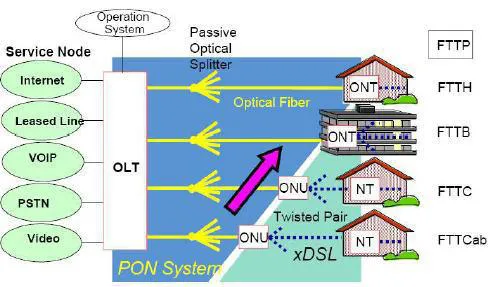
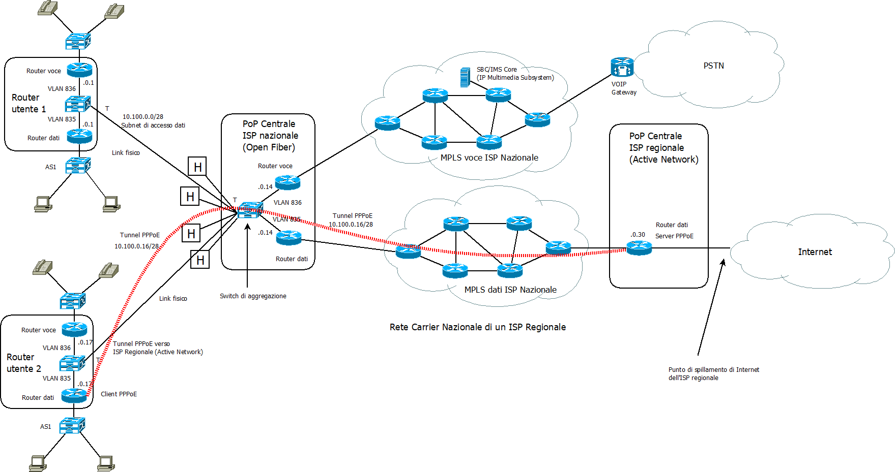

### **Tipi di collegamento verso un ISP**

Spesso accade che gli ISP regionali affittino l'infrastruttura di rete dei un ISP nazionale al quale possono collegare i loro router in una o più centrali. I link **interni alla rete**, cioè quelli tra i router dell'ISP regionale potrebbero essere **logici** e sono ottenuti attraverso varie tecniche didatticamente assimilabili ad un **tunnelling** (tunnel GRE, tunnel PPPoE, VPN Trusted, VPN Untrusted MPLS).

Il **link esterni** alla rete ISP regionale, cioè quelli verso il router/firewall utente che **non** sono di **transito** verso altri router dello ISP, potrebbero essere:
- **fisici** se il router/modem si collega direttamente alla rete dell'ISP regionale con un link fisico. In questo caso il router di confine della LAN si collega direttamente al router dell'ISP regionale.
- **logici** se il router/modem si collega direttamente alla rete dell'ISP regionale con un link logico normalmente realizzato con:
    - un **tunnnel L3** (tunnel PPPoE, VPN Untrusted MPLS, VPN Trusted, ecc) sul collegamento fisico. Il tunnel permette un collegamento **diretto virtuale** tra il router installato nella sede del cliente e il router dell'ISP regionale posto in centrale, ottenuto tramite una cascata di collegamenti fisici lungo i router dell'ISP nazionale.
    - un **tunnnel L2**, ottenuto generalmente mediante la tecnica delle VLAN, che collega gli switch in centrale con il modem dal cliente in cui vengono realizzati **due bridge**:
        - quello della **vlan 835** con una o più porte fisiche verso un router dedicato per i dati
        - quello della **vlan 836** con una o più porte fisiche, diverse dalle precedenti, verso un router dedicato per il voip (ad es. centralino FreePBX).

### **Architettura fisica della rete di accesso ad un ISP**

I **router dedicati**, per tipologie di traffico diverse, sono allocati su **porte di accesso** delle due VLAN ad entrambi i capi della connessione (quella locale utente e quella in centrale). Le connessioni in **fibra** avvengono tra due componenti passive:
- L'**ONT** (Optical Network Terminal) è il dispositivo (borchia ottica) che riceve il segnale ottico dalla fibra ottica e lo converte in un segnale elettrico utilizzabile dai dispositivi dell'utente finale.
- **OLT** (Optical Line Terminal) è il dispositivo di terminazione che collega la rete di accesso ottico alla rete di core del provider. Si occupa di aggregare il traffico proveniente da molte ONT e trasmetterlo verso la rete centrale dell'ISP.

Le **VLAN** sono usate per realizzare la **multiplazione TDM** (a divisione di tempo)  dei due flussi di traffico dati e voce su un'**unica connessione fisica** in fibra. Le VLAN sono configurate sui dispositivi di rete come l'OLT (Optical Line Terminal) e l'ONT, permettendo di mantenere separati i flussi di dati e voce e di applicare politiche di QoS (Quality of Service) specifiche.

In **sostanza**, grazie alla **bassa attenuazione per km** delle fibre ottiche, è possibile realizzare un lungo **canale passivo** che parte dall'**ONT utente** (dislocato nella sua sede fisica) fino ad arrivare all'**OLT in centrale**, su cui transitano trame MAC colorate (di **livello L2** della pila ISO/OSI). A valle dell'OLT, si trovano i **link** verso il **router di confine dello ISP** che **generano** le **subnet di aggregazione** su cui si attestano i **dispositivi attivi utente** (host o router/firewall perimetrale).

In **centrale**, il traffico viene splittato in traffico dati e traffico voce in base alle vlan:
- **Traffico dati**: Il **BNG** (Broadband Network Gateway) autentica gli utenti e instrada il traffico dati verso Internet. In sintesi: OLT -> Aggregation Switch -> BNG -> Internet.
- **Traffico voip**: Il traffico VoIP viene gestito da un **SBC (Session Border Controller)** che controlla la segnalazione SIP al confine di rete, applica policy di sicurezza e QoS, e gestisce il NAT traversal. Solo per le chiamate destinate alla rete telefonica commutata residua (PSTN) interviene un VoIP Gateway, incaricato della transcodifica e dell'interlavoro con la segnalazione SS7/TDM. In **sintesi**: ONT → OLT → Aggregation Switch → SBC → Core IP/SIP → Internet/PSTN.

### **Ibridazioni**

Sono possibili ibridazioni tra le tecniche precedenti, per cui usuale vedere un tunnel PPPoE all'interno della LAN di centrale realizzata dalla VLAN 835.

Normalmente il modem è in realtà anche uno switch in cui l'unica connessione fisica, terminata in centrale presso un OLT, viene **demultiplata** in due connessioni logiche L2 che sono terminate sul dispositivo utente su due **porte Ethernet** separate, una per VLAN 835 e l'altra per la VLAN 836. All'interno di ciascuna viene realizzato il link L3 (basato su IP) verso il **router in centrale**, con due **varianti**:
- Se questo **coincide** col **link fisico** fino in centrale allora il link L3 è terminato sul **primo router** che in centrale sta a valle dell'OLT.
- se **non coincide** col **link fisico**, vuol dire che questo è stato sostituito da una connessione L2, detta **link carrier**, formata dalla **trame MAC** della rete nazionale. La rete viene percorsa attraversando **molti router**, fino ad arrivare nella centrale del gestore della **connessione payload**, dove questa viene **sbustata** da quella carrier e **terminata** su un **router**. Dello **sbustamento** in centrale si occupa un **server PPPoE**, mentre dell'**inbustamento** nella sede utente si occupa un **client PPPoE** installato sul **modem/router** fornito dal **gestore** della connessione payload.

Per dettagli sulla creazione e impostazione di un tunnel PPPoE vedi [Configurazione di una tunnel PPPoE CISCO](pppoe.md)
