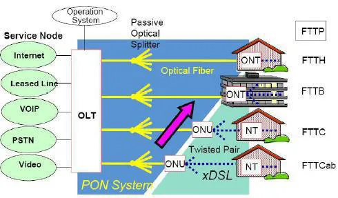
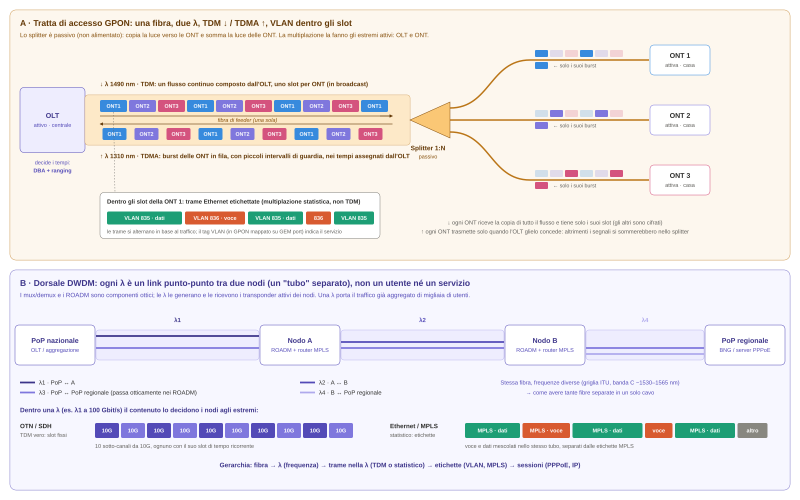
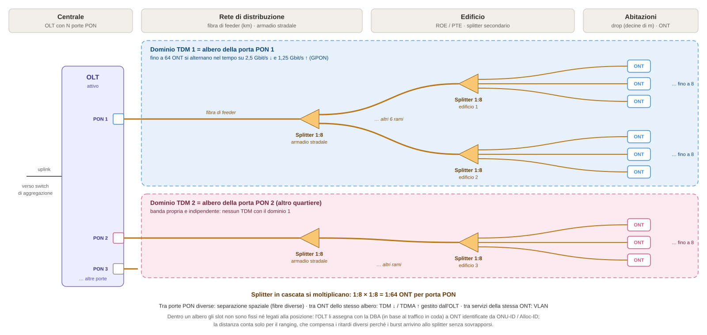
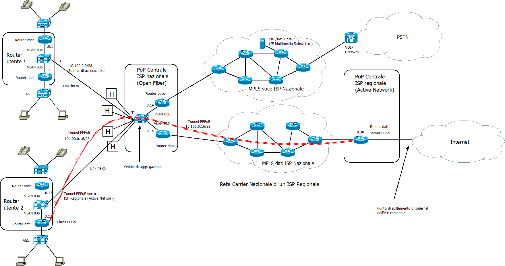
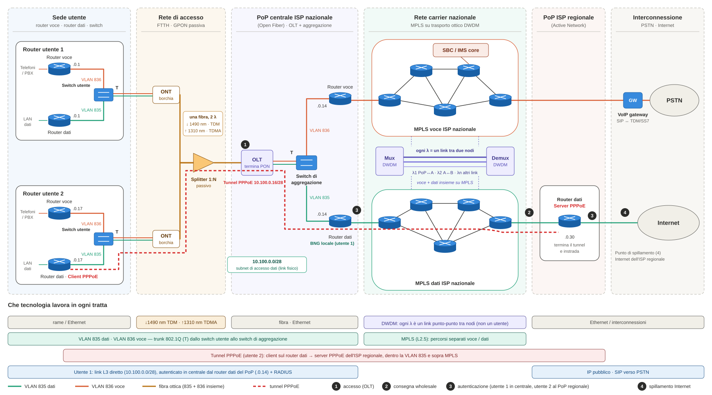

### **Tipi di collegamento verso un ISP**

Spesso accade che gli ISP regionali affittino l'infrastruttura di rete di un ISP nazionale, al quale possono collegare i loro router in una o più centrali. I link **interni alla rete**, cioè quelli tra i router dell'ISP regionale, potrebbero essere **logici** e sono ottenuti attraverso varie tecniche didatticamente assimilabili a un **tunnelling** (tunnel GRE, tunnel PPPoE, VPN Trusted, VPN Untrusted MPLS).

I **link esterni** alla rete ISP regionale, cioè quelli verso il router/firewall utente che **non** sono di **transito** verso altri router dell'ISP, potrebbero essere:

- **fisici** se il router/modem si collega direttamente alla rete dell'ISP regionale con un link fisico. In questo caso il router di confine della LAN si collega direttamente al router dell'ISP regionale.
- **logici** se il router/modem si collega alla rete dell'ISP regionale con un link logico, normalmente realizzato con:
  * un **tunnel L3** (tunnel PPPoE, VPN Untrusted MPLS, VPN Trusted, ecc.) sul collegamento fisico. Il tunnel permette un collegamento **diretto virtuale** tra il router installato nella sede del cliente e il router dell'ISP regionale posto in centrale, ottenuto tramite una cascata di collegamenti fisici lungo i router dell'ISP nazionale.
  * un **tunnel L2**, ottenuto generalmente mediante la tecnica delle VLAN, che collega gli switch in centrale con il modem del cliente, in cui vengono realizzati **due bridge**:
    + quello della **VLAN 835** con una o più porte fisiche verso un router dedicato per i dati
    + quello della **VLAN 836** con una o più porte fisiche, diverse dalle precedenti, verso un router dedicato per il VoIP (ad es. centralino FreePBX).

In Italia la coppia **VLAN 835 (dati) / VLAN 836 (voce)** è di fatto una convenzione nazionale, nata sulla rete Telecom Italia (oggi FiberCop) e adottata da molti operatori che lavorano in wholesale su FiberCop e Open Fiber. Non è però una regola universale: ogni operatore pubblica i propri parametri (ID delle VLAN, PPPoE o IPoE, dati SIP) per obbligo della delibera AGCOM 348/18/CONS sul **modem libero**.

### **Architettura fisica della rete di accesso a un ISP**

I **router dedicati**, per tipologie di traffico diverse, sono allocati su **porte di accesso** delle due VLAN a entrambi i capi della connessione (quella locale utente e quella in centrale). Le connessioni in **fibra** avvengono tra due apparati **attivi**, collegati da una rete di distribuzione **passiva**:

- L'**ONT** (Optical Network Terminal) è il dispositivo (borchia ottica) che riceve il segnale ottico dalla fibra e lo converte in un segnale elettrico utilizzabile dai dispositivi dell'utente finale.
- L'**OLT** (Optical Line Terminal) è il dispositivo di terminazione che collega la rete di accesso ottico alla rete di core del provider. Aggrega il traffico proveniente da molte ONT e lo trasmette verso la rete centrale dell'ISP.
- Lo **splitter ottico** 1:N, posto tra le due, è **passivo**: non è alimentato e non contiene elettronica. Divide la luce dell'OLT verso N fibre e somma la luce delle N ONT su un'unica fibra verso l'OLT.

In **sostanza**, grazie alla **bassa attenuazione per km** delle fibre ottiche, è possibile realizzare un lungo **canale passivo** che parte dall'**ONT utente** (dislocato nella sua sede fisica) fino ad arrivare all'**OLT in centrale**, su cui transitano trame MAC colorate (di **livello L2** della pila ISO/OSI). A valle dell'OLT si trovano i **link** verso il **router di confine dell'ISP**, che **generano** le **subnet di aggregazione** su cui si attestano i **dispositivi attivi utente** (host o router/firewall perimetrale).

### **Multiplazione nella rete di accesso: chi divide che cosa**

"Rete passiva" **non** significa "rete senza multiplazione": significa che il dispositivo in mezzo (lo splitter) non ha bisogno di energia, perché il lavoro di coordinamento lo fanno gli **estremi attivi**, cioè OLT e ONT. Sulla stessa fibra lavorano tre tecniche diverse, ognuna delle quali separa una cosa diversa:

1. **WDM (a divisione di lunghezza d'onda) semplice: separa le direzioni.** La fibra porta il **downstream** sulla λ di **1490 nm** e l'**upstream** sulla λ di **1310 nm** (un'eventuale terza λ a 1550 nm è usata per il video overlay). Le λ sono poche e molto distanziate: **non** è DWDM, serve solo a ottenere il full-duplex su una fibra sola. Ciascuna λ è di fatto un **trunk** condiviso da tutte le ONT.
2. **TDM / TDMA (a divisione di tempo): separa gli utenti, cioè le ONT.**
   - **Downstream – TDM.** L'OLT compone un unico flusso continuo, diviso in intervalli di tempo destinati alle diverse ONT. Lo splitter lo **copia** identico verso tutte le ONT (broadcast): ciascuna tiene solo i propri slot e scarta gli altri, che sono comunque cifrati (AES).
   - **Upstream – TDMA.** Lo splitter **somma** la luce di tutte le ONT: se due ONT trasmettessero insieme, i segnali si sovrapporrebbero (collisione). Per evitarlo l'OLT fa da "vigile": con la **DBA** (Dynamic Bandwidth Allocation) assegna a ogni ONT quando e per quanto trasmettere, e con il **ranging** misura la distanza di ogni ONT per compensarne il ritardo. I **burst** delle ONT arrivano così allo splitter già in fila, separati da piccoli intervalli di guardia. È il "multiple access" di TDMA: più trasmettitori condividono un mezzo passivo alternandosi nel tempo, su ordine di uno di loro.
3. **VLAN: separano i servizi dello stesso utente.** Le trame delle VLAN 835 e 836 viaggiano **dentro gli slot** della propria ONT. In GPON sono mappate su canali logici interni (**GEM port**), associati a classi di servizio upstream (**T-CONT**) diverse, così da poter dare priorità alla voce. Le VLAN non dividono la fibra nel tempo: **etichettano** le trame, che si alternano in base al traffico effettivo. Si tratta quindi di una **multiplazione statistica** (o logica), non di un TDM a slot fissi, che permette di mantenere separati i flussi di dati e voce e di applicare politiche di **QoS** specifiche. Le VLAN sono configurate sui dispositivi di rete come l'OLT, l'ONT e gli switch.

> L'analogia è il vecchio Ethernet su cavo coassiale: il mezzo è passivo e comune a tutti, e la regola su chi parla quando la fanno le stazioni. In GPON, però, la regola non è a contesa (come il CSMA/CD) ma **centralizzata** nell'OLT.

Fa eccezione lo standard **NG-PON2 (TWDM-PON)**, che usa più λ anche nella rete di accesso, ciascuna con il proprio TDM/TDMA; in Italia oggi si usano soprattutto **GPON** e **XGS-PON**, che funzionano come descritto sopra.

#### **Come è ripartito il TDM sul territorio: l'albero PON**

Il TDM non è unico per tutta la centrale: vale **per gruppi di ONT**, e il gruppo è definito dalla geografia della fibra. Ogni gruppo è un **albero PON**, cioè l'insieme delle ONT collegate agli stessi splitter, alla stessa fibra di feeder e quindi alla **stessa porta PON** dell'OLT. **Ogni albero è un dominio TDM a sé.**

Nell'architettura tipica italiana un albero si sviluppa così:

- **Centrale**: l'OLT dispone di decine di porte PON; da ciascuna parte una **fibra di feeder**, lunga anche diversi km (fino a circa 20 km).
- **Armadio stradale** (punto di flessibilità primario): spesso ospita un primo splitter, ad esempio **1:8**, che serve un quartiere o un gruppo di vie.
- **Edificio** (ROE, ripartitore ottico di edificio, oppure PTE in strada): un secondo splitter, ad esempio **1:8**, distribuisce la fibra agli appartamenti.
- **Abitazione**: la borchia ottica (PTO) e l'ONT, raggiunte da un breve tratto di fibra (drop).

Gli splitter in cascata si moltiplicano: **1:8 × 1:8 = 1:64**. Un albero copre quindi in genere un isolato o alcuni edifici, con tipicamente **32 o 64 ONT** (al massimo 128), che condividono la banda della porta: circa **2,5 Gbit/s in discesa e 1,25 Gbit/s in salita** in GPON, **10/10 Gbit/s** in XGS-PON.

La ripartizione avviene quindi su tre livelli:

- **tra porte PON diverse** la separazione è **spaziale**: due quartieri serviti da porte diverse usano fibre diverse e hanno ciascuno la propria banda, senza alcun TDM tra loro. L'OLT aggrega poi tutte le porte verso lo switch di centrale;
- **tra ONT dello stesso albero** la separazione è **temporale** (TDM in discesa, TDMA in salita), gestita dall'OLT;
- **tra servizi della stessa ONT** la separazione è **logica**, tramite le VLAN.

Dentro un albero gli slot **non sono fissi né legati alla posizione**: la ONT del primo piano non ha uno slot "suo". L'OLT identifica ogni ONT con un identificativo logico (**ONU-ID**, **Alloc-ID**) e con la **DBA** assegna gli slot dinamicamente, in base al traffico in coda e alla classe di servizio. La geografia conta solo per il **ranging**, che compensa la diversa distanza delle ONT dall'OLT, in modo che i burst arrivino allo splitter senza sovrapporsi.

### **Multiplazione nella dorsale: il ruolo del DWDM**

A monte dell'OLT, i collegamenti tra il PoP di centrale e i nodi della rete carrier nazionale viaggiano su sistemi **DWDM** (Dense Wavelength Division Multiplexing). Su una sola fibra vengono trasmesse decine di lunghezze d'onda (tipicamente da 40 a 96, nella **banda C** intorno a 1530–1565 nm, su una griglia ITU-T con canali spaziati di 50 o 100 GHz).

Una λ DWDM **non identifica un utente né un servizio**: identifica un **collegamento punto-punto tra due nodi** (da transponder a transponder), ad esempio tra lo switch di aggregazione del PoP e un router MPLS, o tra due router MPLS. Ogni λ si comporta come una **fibra virtuale dedicata**, con capacità fissa (oggi tipicamente 10, 100 o 400 Gbit/s), e trasporta il traffico **già aggregato** di migliaia di utenti. Nei nodi intermedi i **ROADM** (Reconfigurable Optical Add-Drop Multiplexer) possono far proseguire una λ, estrarla o inserirla senza convertirla in segnale elettrico: così si costruisce la topologia fisica su cui poggia la rete MPLS. Anche i mux/demux DWDM sono spesso componenti ottici passivi (filtri, reticoli): le λ le generano e le ricevono i transponder attivi agli estremi.

Il contenuto di una λ lo decidono gli apparati agli estremi e può essere:

- **TDM vero (OTN, in passato SDH)**: il trunk è diviso in sotto-canali a slot fissi (ad esempio una λ da 100G che porta 10 canali da 10G);
- **statistico (Ethernet/MPLS)**: il trunk è un unico "tubo", e voce e dati si mescolano, distinti dalle etichette MPLS e dalle VLAN.

Una λ corrisponde a un singolo cliente solo nei servizi **wholesale o business** di "lunghezza d'onda dedicata", in cui un operatore o una grande azienda affitta un intero canale tra due sedi.

### **Riepilogo: la gerarchia della multiplazione**

| Livello | Cosa separa | Tecnica |
|---|---|---|
| Fibra | — | mezzo fisico |
| λ (WDM / DWDM) | le direzioni (GPON) o i link tra nodi (dorsale) | divisione di lunghezza d'onda (frequenza) |
| Trame nella λ | gli utenti (GPON) o i sotto-canali (OTN) | TDM / TDMA |
| Etichette | i servizi e i percorsi | VLAN 835/836, MPLS (multiplazione statistica) |
| Sessioni | il singolo cliente verso l'ISP | PPPoE, IP |

Le λ sono il primo livello di divisione, il più grossolano: creano "tubi" separati sulla stessa fibra. Che cosa vi passa dentro, e come viene ulteriormente diviso, lo decidono i livelli superiori.

### **Separazione del traffico in centrale**

In **centrale**, il traffico viene separato in traffico dati e traffico voce in base alle VLAN:

- **Traffico dati**: il **BNG** (Broadband Network Gateway) autentica gli utenti e instrada il traffico dati verso Internet. In sintesi: ONT → OLT → Aggregation Switch → BNG → Internet.
- **Traffico VoIP**: il traffico VoIP viene gestito da un **SBC (Session Border Controller)** che controlla la segnalazione SIP al confine di rete, applica policy di sicurezza e QoS e gestisce il NAT traversal. Solo per le chiamate destinate alla rete telefonica commutata residua (PSTN) interviene un **VoIP Gateway**, incaricato della transcodifica e dell'interlavoro con la segnalazione SS7/TDM. In **sintesi**: ONT → OLT → Aggregation Switch → SBC → Core IP/SIP → Internet/PSTN.

### **Ibridazioni**

Sono possibili ibridazioni tra le tecniche precedenti, per cui è usuale vedere un tunnel PPPoE all'interno della LAN di centrale realizzata dalla VLAN 835.

Normalmente il modem è in realtà anche uno switch, in cui l'unica connessione fisica, terminata in centrale presso un OLT, viene **demultiplata** in due connessioni logiche L2 che sono terminate sul dispositivo utente su due **porte Ethernet** separate, una per la VLAN 835 e l'altra per la VLAN 836. All'interno di ciascuna viene realizzato il link L3 (basato su IP) verso il **router in centrale**, con due **varianti**:

- se questo **coincide** con il **link fisico** fino in centrale, allora il link L3 è terminato sul **primo router** che in centrale sta a valle dell'OLT (utente 1 nella figura, subnet 10.100.0.0/28);
- se **non coincide** con il **link fisico**, vuol dire che questo è stato sostituito da una connessione L2, detta **link carrier**, formata dalle **trame MAC** della rete nazionale. La rete viene percorsa attraversando **molti router**, fino ad arrivare nella centrale del gestore della **connessione payload**, dove questa viene **sbustata** da quella carrier e **terminata** su un **router** (utente 2 nella figura, subnet 10.100.0.16/28). Dello **sbustamento** in centrale si occupa un **server PPPoE**, mentre dell'**imbustamento** nella sede utente si occupa un **client PPPoE** installato sul **modem/router** fornito dal **gestore** della connessione payload.

La figura seguente riassume l'intero percorso, dividendo ogni tecnologia nella tratta in cui lavora: sede utente, rete di accesso GPON, PoP dell'ISP nazionale, rete carrier nazionale (MPLS su trasporto DWDM), PoP dell'ISP regionale e interconnessione verso PSTN e Internet.

Per dettagli sulla creazione e impostazione di un tunnel PPPoE vedi [Configurazione di un tunnel PPPoE CISCO](pppoe.md)
