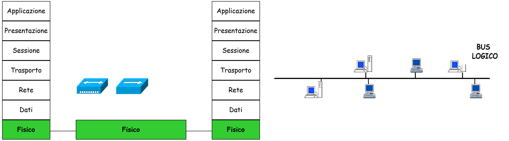
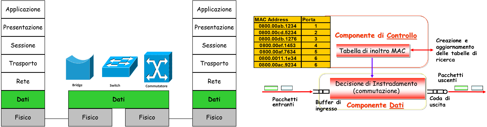
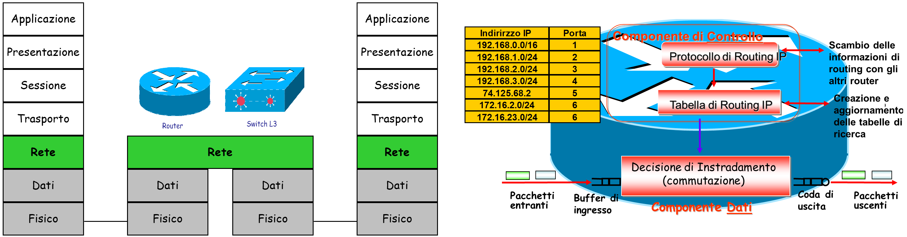
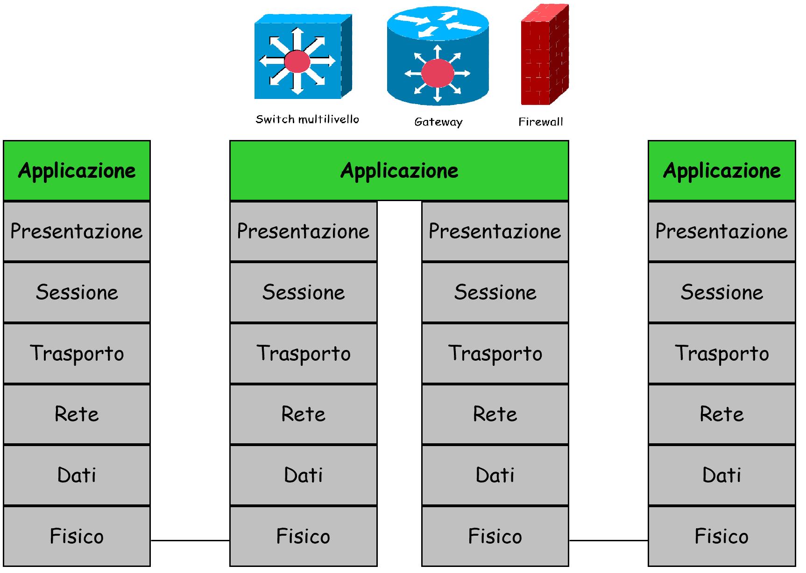
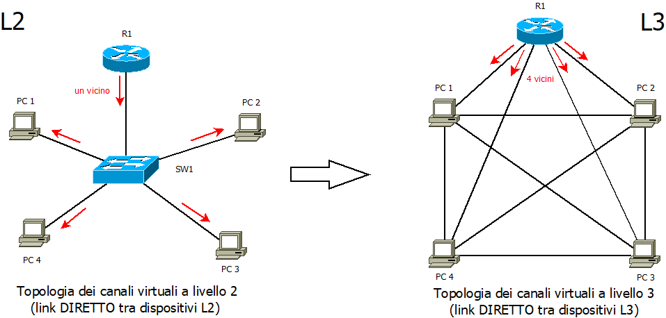

>[Torna a reti di sensori](sensornetworkshort.md#reti-di-sensori-e-attuatori)

## **End Systems ES**

Gli **utenti** della rete sono le entità mittenti o destinatarie dei dati, possono essere utenti umani o agenti software cioè programmi in esecuzione (detti processi)
Gli utenti della rete stanno su **macchine** (hosts) dette **End Systems o ES** (sistemi finali o terminali) perché sono queste le macchine che stanno **ai capi** di una **comunicazione**.
Gli End System possiedono la proprietà fondamentale di essere **individuabili univocamente** all’interno della rete tramite un **indirizzo**.

Gli End Systems possono essere:
- **Computers**
- Periferiche intelligenti (telecamere, stampanti di rete, sensori, ecc) : 
    - dotate della logica necessaria a svolgere i protocolli di comunicazione 
    - dotate di indirizzo.

## **Intermediate Systems IS**

Sono i **dispositivi interni** della rete e sono in genere **nodi di commutazione**
I **nodi di commutazione** sono dispositivi di **smistamento** dove l’informazione entra da una **porta di ingress** ed esce da una **porta di uscita**.
Le **porte** di uscita e di ingresso **tra un nodo e l’altro** sono collegate da **mezzi trasmissivi** detti **collegamenti o link**
La **cascata di nodi e link** tra un ES **sorgente** e il corrispondente ES di **destinazione** viene detto **percorso del messaggio o path**.
L’operazione di **smistamento** da una porta di ingresso ad una di uscita viene detto **inoltro o forwarding**.
Il processo di **scelta del percorso migliore** tra ES sorgente e ES di destinazione viene detto **instradamento o routing**.

La **comunicazione diretta ES-ES** è un collegamento **logico (o virtuale)** che appare **dedicato** ai due ES coinvolti nel dialogo.
Il collegamento logico tra ES si scompone in **più collegamenti fisici** tenuti insieme da nodi IS
I **collegamenti tra nodi IS** sono **risorse comuni** a molte comunicazioni.

I nodi di IS di commutazione (switch o router) partecipano attivamente nel realizzare la **privacy** dell'utente perchè, nell'ultimo smistamento, quello verso un ES, inoltrano i dati solo a quel nodo ES a cui sono destinati, questo perchè il link tra un nodo e il suo IS è sempre **dedicato** (punto-punto). La stessa cosa non accade quando il collegamento tra un nodo IS e un ES avviene con **mezzi broadcast** come i **BUS** dove un unico filo collega molti ES.

### **Nodi di smistamento**

I sistemi intermedi sono dei nodi che in genere hanno funzione di smistamento dei pacchetti (PDU) che eseguono in base agli indirizzi (header) di un solo livello che è il loro livello di lavoro.

I sistemi che lavorano ad un livello N sono un argine invalicabile per le PDU dei livelli inferiori, queste non possono direttamente attraversarli. 

le SDU dei livelli inferiori vengono sbustate all’ingresso del nodo fino a estrarre la N-PDU che viene esaminata, smistata e reimbustata all’uscita del nodo su nuove PDU di livello inferiore. 

Il nodo legge l’indirizzo di livello N e in base a questo sceglie l’indirizzo di livello inferiore a cui inoltrare la N-1 - PDU

### **Dispositivi di inoltro di Livello 1**

  

Non avendo un livello inferiore si limitano ad inoltrare bit da un ingresso a una o più uscite. Sono adoperati in reti geografiche commutate (WAN)  e nelle reti locali (LAN). Possono essere:
- **Repeater**. Tutti i mezzi trasmissivi introducono una attenuazione e un degrado complessivo del segnale (elettrico o luminoso) proporzionale alla **distanza** da questo percorsa. Un ripetitore riceve un segnale debole (o deteriorato) e lo ritrasmette **amplificato** (o rigenerato), in modo tale da raggiungere lunghe distanze con una qualità sufficiente a renderlo **intelleggibile**. E' usato talvolta in ambito wireless. 
- **Hub**. Un HUB, come concentratore di host,  è a tutti gli effetti un REPEATER a più porte che realizza, secondo una topologia fisica interna a stella, un collegamento logico a bus. Le schede di rete dei vari host collegati vedono l’hub come un unico mezzo trasmissivo **comune** a tutti e pertanto vi accedono usando il protocollo di condivisione del mezzo **CSMA/CD**. Gli **hub a filo** ormai sono obsoleti e introvabili commercialmente mentre sono molto comuni nelle reti wireless sotto forma di **Access Point WiFi (AP)** che interagiscono con i client WiFi mediante il protocollo **CSMA/CA**.

Rimane comune l'uso dei BUS a filo in ambito industriale e domotico, governati con protocolli a contesa o determnistici costituiti da un unico filo passante per tutti i dispositivi. Ma in questo caso non si tratta concettualmente di hub. Un hub è un dispositivo che a tutti gli effetti partecipa alla creazione di una LAN, insieme agli Switch e ai Bridge.

Gli hub soffrono del problema delle collisioni per cui si dice che un hub costituisce un unico “dominio di collisione” perche’ qualsiasi coppia di stazioni che provi a trasmettere contemporaneamente genera una collisione. Due o più hub connessi insieme sullo stesso canale creano un unico dominio di collisione: il traffico intenso tra due host congestiona sempre quello di tutti gli altri. 

La migliore soluzione per evitare le collisioni è di patizionare gli Hub in segmenti isolati (per le collisioni). A tale scopo è possibile dividere i segmenti broadcast con BRIDGE oppure con SWITCH o con ROUTER. Infatti i dispositivi L2 e L3 bloccano i bit di livello 1 all’ingresso delle loro porte, pertanto:
- non propagano tra una Hub e l’altro le trame corrotte risultanti da una collisione.
- un tentativo di trasmissione su un hub non viene visto dagli altri hub e non può interferire con le loro trasmissioni. Questo processo è chiamato “SEGMENTAZIONE”. 

### **Dispositivi di inoltro di Livello 2**

I dispositivi di **livello 2** sono un **barriera** per la propagazione del flusso di bit provenienti dai dispositivi di livello 1 che viene memorizzato ed osservato per isolare, di volta in volta, le **trame** in arrivo. Ogni trama viene, a questo punto, **smistata** su una **porta di uscita** in base al suo **indirizzo di destinazione** in modo da scegliere sempre una porta che conduce ad un link che stia nel **percorso** (path) verso la destinazione. 

In sostanza, si fa una **selezione** delle **trame** per decidere **dove** inviarle.

  

I **bridge** sono degli **IS** costruiti per lavorare in modalità **store and forward**, cioè tutti **frame ethernet** vengono :
- completamente **memorizzati** (store) per controllare la loro integrità e leggere l’**indirizzo MAC** di destinazione.
- Elaborati per determinare in base all’indirizzo di MAC la **porta** su cui inoltrarlo (commutazione). L'elaborazione consiste nella **ricerca** (lookup)  del **MAC di destinazione** in una **tabella di inoltro** che contiene un elenco di righe con la corrispondenza [indirizzo MAC - porta di uscita]. 
- **inoltrati** (forward) in uscita sulla  porta scelta. La **multiplazione SDM** di più trame su diverse porte di ingresso che, nello stesso istante, devono andare sulla **stessa porta** di uscita, si trasforma nella **multiplazione statistica TDM**, delle stesse trame, sulla **coda** posta davanti al canale di quella porta.

Scopo dei **buffer** (coda):
- Memorizzazione completa per permettere il controllo di integrità e la **lettura dell’indirizzo di destinazione**.
- Accodamento trame per **adattare** temporanee differenze di velocità dei pacchetti tra porte di arrivo e di uscita.
- Risoluzione di una eventuale **contesa** della linea sulla porta di uscita da parte delle trame provenienti da più porte di ingresso (multiplazione statistica).

### **Dispositivi di inoltro di Livello 3**

I dispositivi di **livello 2** sono un **barriera** per la propagazione delle trame provenienti dai dispositivi di livello 2 che vengono, di volta in volta, **aperte** per recuperare il loro payload, cioè per **sbustare** i pacchetti di livello 3. Ogni pacchetto viene, a questo punto, **smistato** su una **porta di uscita** in base al suo **indirizzo di destinazione IP** in modo da scegliere sempre una porta che conduce ad un link che stia nel **percorso** (path) verso la destinazione. 

In sostanza, si fa uno sbustamento e una una **selezione** dei **pacchetti** per decidere **dove** inviarli. Una volta **scelta la porta** nelle direzione giusta, i pacchetti vengono **reimbustati** in una nuova trama MAC da inviare sul link in uscita.

  

Anche i **router** sono degli **IS** costruiti per lavorare in modalità **store and forward**, cioè tutti **i pacchetti** vengono :
- completamente **memorizzati** (store) per controllare la loro integrità e leggere l’**indirizzo IP** di destinazione.
- Elaborati per determinare in base all’indirizzo di IP la **porta** su cui inoltrarlo (commutazione). L'elaborazione consiste nella **ricerca** (lookup)  dell'**IP di destinazione** in una **tabella di routing** che contiene un elenco di righe con la corrispondenza [indirizzo IP - porta di uscita]. 
- **inoltrati** (forward) in uscita sulla  porta scelta. La **multiplazione SDM** di più trame su diverse porte di ingresso che, nello stesso istante, devono andare sulla **stessa porta** di uscita, si trasforma nella **multiplazione statistica TDM**, delle stesse trame, sulla **coda** posta davanti al canale di quella porta.

Scopo dei **buffer** (coda):
- Memorizzazione completa per permettere il controllo di integrità e la **lettura dell’indirizzo di destinazione**.
- Accodamento trame per **adattare** temporanee differenze di velocità dei pacchetti tra porte di arrivo e di uscita.
- Risoluzione di una eventuale **contesa** della linea sulla porta di uscita da parte delle trame provenienti da più porte di ingresso (multiplazione statistica).

### **Dispositivi di inoltro di Livello 7**

#### **Gateway**

I dispositivi di **livello 7** propriamente detti sono i **gateway** che sono un **barriera** per la propagazione dei pacchetti provenienti dai dispositivi di livello inferiore al 7 che vengono, di volta in volta, **aperti** per recuperare il loro payload, cioè per **sbustare** i pacchetti di tutti  i livelli, fino ad arrivare al 7.

Lo scopo è evidentemente quello di inviarlo in una **nuova rete** che adesso possiede, per ogni livello della pila OSI, protocolli completamente **diversi**. La **traduzione dell'indirizzo L3** della rete di arrivo nell'indirizzo L3 della rete di destinazione è una operazione non particolarmente semplice per cui questo tipo di operazione si fa raramente. Più comune è adoperare indirizzi di livello 7 come gli Id del dispositivo (o i topic MQTT) per individuare le sorgenti e **indirizzi di gruppo** L7, come i topic MQTT, per individuare i destinatari. La corrispondenza tra gli indirizzi delle due reti così non è più sotto la responabilità del gateway ma è gestita da un server a parte.

Oppure usare meccanismi di imbustamento **fuori ordine** come il **tunnelling** quando la destinazione finale risiede in una rete dello **stesso tipo** di quella della **sorgente** dei pacchetti, anche se si attraversa **una rete** di **tipo diverso**.

 

### **Commutazione L2 e ISO/OSI**

La **commutazione L2** in ISO/OSI semplicemente **NON** esiste. Si tratta di una funzione **non previst**a nello stack e presente solo all’interno delle LAN.

 

La **topologia L2** si basa su una **rete fisica a stella** in cui uno switch centrale **smista** i pacchetti L3 tra i PC. Ciascun PC, lavorando ad L7, non vede il collegamento  a stella con tutti gli altri PC mediato dallo switch, ma vede N link DIRETTI tra lui e tutti gli altri PC. Ma anche il router R1, lavorando ad L3, non vede il collegamento a stella con tutti gli altri PC mediato dallo switch, ma vede N link DIRETTI tra lui e tutti gli altri PC. Ciascuno degli N link però è soltanto logico (virtuale), non è fisico:
- Lo **switch smista** le trame L2 in maniera così veloce da far «percepire» al le connessioni tra se e tutti i PC come dirette e simultanee. Un vicino (lo switch) ad L2, diventa N vicini (i PC) ad L3.
- Di fatto, si realizza, grazie ad un **TDM sufficientemente veloce** dello switch in L2, un **SDM virtuale** che, apparentemente, realizza in L3 una **rete magliata** di PC collegati ad un router.

## **LAN**

**Switch**, **Bridge**, **Hub**, **Bus Ethernet**, e qualunque loro **combinazione topologica** (stella, albero o maglia), realizzano una **infrastruttura di rete** che ha la **prerogativa** di potere essere considerata come un'**unica LAN**. 

Una **LAN** (Local Area Network) è l'infrastruttura di rete interna ad edifici di natura residenziale, commerciale ed amministrativa per realizzare l'interconnessione tra PC e servizi interni e tra PC e Internet per la fruizione di quelli esterni. Una LAN ha le seguenti **proprietà basilari**:
- realizza **a L3** un **collegamento diretto** tra tutti gli Host ad essa collegati fisicamente, cioè a L3 essa appare una **maglia completa** di **collegamenti virtuali**, a prescindere dalla **topologia fisica** formata dai dispositivi che la compongono.
- ha i suoi confini su ogni link fisico che essa realizza su un **router**. I router sono dei limiti invalicabili all'inoltro diretto dei messaggi IP tra gli host e vengono detti, per l'appunto, **router di confine**. 
- all'interno della LAN le trame MAC vengono smistate attraverso i dispositivi L2 ed L1 senza essere modificate. I pacchetti IP vengono inoltrati direttamente ai loro destinatari senza necessità che siano sbustati.
- gli invii di pacchetti al di fuori della LAN, cioè quelli al di la di un **router di confine**, possono avvenire solamente con lo sbustamento dei pacchetti IP dalla loro trama di sorgente e il loro successivo reimbustamento su nuove trame all'uscita dal router.
- si collega ad Internet proprio mediante un **router di confine** che realizza anch'esso **ad L3** dei **collegamenti virtuali diretti** tra lui e **tutti gli Host** della LAN.

Il **router di confine o gateway** diventa un elemento fondamentale della LAN perchè:
- può sempre **inoltrare** dei pacchetti che, provenienti dall'**esterno** (ad esempio, Internet), siano **destinati** ad un generico **host** della LAN.
- un host della LAN, che sia sorgente di pacchetti IP destinati ad un host esterno (ad esempio, Internet), può sempre **inoltrare** i propri pacchetti al **router di confine** per farli inoltrare agli altri router sul percorso verso la destinazione.

Proprio per il fatto di essere il dispositivo **deputato** a consentire alla LAN l'accesso **da e verso** il mondo esterno ha indotto a qualificare il **primo router** incontrato ai suoi confini come **router di confine** o **default gateway** della LAN.

>[Torna a reti di sensori](sensornetworkshort.md#reti-di-sensori-e-attuatori)
