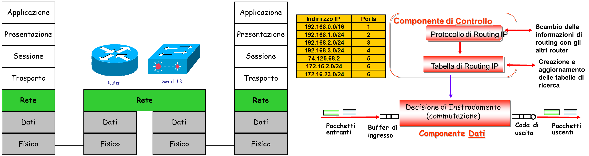

fil collegamento di>[Torna a reti di sensori](sensornetworkshort.md#reti-di-sensori-e-attuatori)

## **End Systems ES**

Gli **utenti** della rete sono le entità mittenti o destinatarie dei dati, possono essere utenti umani o agenti software cioè programmi in esecuzione (detti processi)
Gli utenti della rete stanno su **macchine** (hosts) dette **End Systems o ES** (sistemi finali o terminali) perché sono queste le macchine che stanno **ai capi** di una **comunicazione**.
Gli End System possiedono la proprietà fondamentale di essere **individuabili univocamente** all’interno della rete tramite un **indirizzo**.

Gli End Systems possono essere:
- **Computers**
- Periferiche intelligenti (telecamere, stampanti di rete, sensori, ecc) : 
    - dotate della logica necessaria a svolgere i protocolli di comunicazione 
    - dotate di indirizzo.

## **Intermediate Systems IS**

Sono i **dispositivi interni** della rete e sono in genere **nodi di commutazione**
I **nodi di commutazione** sono dispositivi di **smistamento** dove l’informazione entra da una **porta di ingress** ed esce da una **porta di uscita**.
Le **porte** di uscita e di ingresso **tra un nodo e l’altro** sono collegate da **mezzi trasmissivi** detti **collegamenti o link**
La **cascata di nodi e link** tra un ES **sorgente** e il corrispondente ES di **destinazione** viene detto **percorso del messaggio o path**.
L’operazione di **smistamento** da una porta di ingresso ad una di uscita viene detto **inoltro o forwarding**.
Il processo di **scelta del percorso migliore** tra ES sorgente e ES di destinazione viene detto **instradamento o routing**.

La **comunicazione diretta ES-ES** è un collegamento **logico (o virtuale)** che appare **dedicato** ai due ES coinvolti nel dialogo.
Il collegamento logico tra ES si scompone in **più collegamenti fisici** tenuti insieme da nodi IS
I **collegamenti tra nodi IS** sono **risorse comuni** a molte comunicazioni.

I nodi di IS di commutazione (switch o router) partecipano attivamente nel realizzare la **privacy** dell'utente perchè, nell'ultimo smistamento, quello verso un ES, inoltrano i dati solo a quel nodo ES a cui sono destinati, questo perchè il link tra un nodo e il suo IS è sempre **dedicato** (punto-punto). La stessa cosa non accade quando il collegamento tra un nodo IS e un ES avviene con **mezzi broadcast** come i **BUS** dove un unico filo collega molti ES.

### **Nodi di smistamento**

I **sistemi intermedi IS** sono dei nodi che in genere hanno funzione di **smistamento** dei pacchetti (PDU) che eseguono in base all'indirizzo di **destinazione** contenuto nell'**header** di ogni pacchetto.

I sistemi che lavorano ad un **livello N** sono un argine invalicabile per le PDU dei **livelli inferiori**, queste **non** possono direttamente **attraversarli**. Le **SDU** dei livelli inferiori devono essere **sbustate** all’**ingresso** del nodo fino a estrarre la **N-PDU** da **inoltrare** che viene esaminata, **smistata** senza modifiche e **reimbustata** all’**uscita** del nodo su una **nuova PDU** di **livello inferiore**. 

### **Dispositivi di inoltro di Livello 1**

  

I dispositivi di livello 1, si limitano a **copiare bit** da una porta di **ingresso**, inoltrando una loro **replica** su tutte le porte di uscita, eccetto quella di origine. 

Sono adoperati in reti geografiche commutate (WAN)  e nelle reti locali (LAN). Possono essere:
- **Repeater**. Hanno una sola porta di ingresso ed una sola porta di uscita. Tutti i mezzi trasmissivi introducono una attenuazione e un degrado complessivo del segnale (elettrico o luminoso) proporzionale alla **distanza** da questo percorsa. Un ripetitore riceve un segnale debole (o deteriorato) e lo ritrasmette **amplificato** (o rigenerato), in modo tale da raggiungere lunghe distanze con una qualità sufficiente a renderlo **intelleggibile**. E' usato talvolta in ambito wireless. 
- **Hub**. Un HUB, come concentratore di host,  è a tutti gli effetti un REPEATER a più porte che realizza, secondo una **topologia fisica** interna **a stella**, un **collegamento logico a bus**. Le schede di rete dei vari host collegati vedono l’hub come un unico mezzo trasmissivo **comune** a tutti e pertanto vi accedono usando il protocollo di condivisione del mezzo **CSMA/CD**. Gli **hub a filo** ormai sono obsoleti e introvabili commercialmente mentre sono molto comuni nelle reti wireless sotto forma di **Access Point WiFi (AP)** che interagiscono con i client WiFi mediante il protocollo **CSMA/CA**. Il **protocollo di arbitraggio** non viene realizzato dall'hub, dato che questo sostanzialmente è un **dispositivo passivo** (mezzo trasmissivo), ma viene implementato dalle **schede di rete** degli host dette **NIC (Network Interface Card)**.

Rimane comune l'uso dei BUS a filo in ambito industriale e domotico, governati con protocolli a contesa o deterministici costituiti da un **unico filo** passante per **tutti** i dispositivi. Ma in questo caso, pur essendo concettualmente ancora un BUS, non si tratta fisicamente di hub. 

Un **hub** è un dispositivo che a tutti gli effetti partecipa alla creazione di una **LAN**, insieme agli **Switch** e ai **Bridge**.

Gli **hub** soffrono del **problema delle collisioni** per cui si dice che un hub costituisce un unico **“dominio di collisione”** perche’ qualsiasi coppia di stazioni che provi a trasmettere contemporaneamente genera una collisione. **Due o più hub** connessi insieme sullo stesso canale creano **un unico** dominio di collisione: il traffico intenso tra due host **congestiona** sempre quello **di tutti** gli altri. 

La migliore **soluzione** per evitare le collisioni è di **partizionare** gli Hub in **segmenti isolati** (per le collisioni). A tale scopo è possibile dividere i **segmenti broadcast** con **BRIDGE** oppure con **SWITCH** o con **ROUTER**. Infatti i dispositivi L2 e L3 **bloccano** i bit di **livello 1** all’ingresso delle loro porte, pertanto:
- **non propagano** tra una Hub e l’altro le trame corrotte risultanti da una collisione.
- un tentativo di trasmissione su un hub **non viene visto** dagli altri hub e non può interferire con le loro trasmissioni. Questo **processo d partizionamento** è chiamato **“SEGMENTAZIONE”**. 

### **Dispositivi di inoltro di Livello 2**

I dispositivi di **livello 2** sono un **barriera** per le singole PDU di livello 1, cioè i bit, che, invece di essere subito inoltrati, vengono accomodati su una **coda di ingresso** fino a che non viene completato il caricamento di un intera PDU di livello 2, cioè una **trama**. 

Inoltre, sono dispositivi che non propagano eventuali **collisioni** generate nei link **multpunto** (BUS) sulle loro porte. Ciò accade perchè uno switch è anche un **limite invalicabile** per la propagazione delle **trame danneggiate** provenienti dai dispositivi di livello 1. Infatti, le **trame corrotte** possono essere **rilevate** già nella **coda di ingresso** dalla funzione di **controllo di errore** del protocollo di **linea** (basato sula verifica del **checksum FCS**), così da essere **scartate** prima ancora di effettuare il loro inoltro verso una porta di uscita. 

Ogni trama **riconosciuta** come integra viene, invece, **smistata** su una **porta di uscita** in base al proprio **indirizzo di destinazione MAC**, in modo da scegliere sempre una porta verso un link che stia nel percorso (path) verso la destinazione.

Una volta varcata la porta nelle direzione giusta, le trame vengono inviate un bit alla volta sul link di uscita prescelto.

Tradizionalmente, i **link** sulle **porte** di qualunque dispositivo di **livello 2** (bridge o switch) **non** sono semplici collegamenti punto-punto ma **BUS** su cui è attivo il protocollo **CSMA/CD**, che realizzano dei **dominii di collisione** separati l'uno dall'altro.

  

I **bridge** sono degli **IS** costruiti per lavorare in modalità **store and forward**, cioè tutte le **frame ethernet** vengono :
- completamente **memorizzate** (store) in una coda di ingresso per controllare la loro integrità e leggere l’**indirizzo MAC** di destinazione.
- Elaborate per determinare in base all’indirizzo di MAC la **porta** su cui inoltrarle (commutazione) attraverso la **ricerca** (lookup)  del **MAC di destinazione** in una **tabella di inoltro** che contiene un **elenco di corrispondenze** [indirizzo MAC - porta di uscita]. 
- **inoltrati** (forward) in uscita sulla  porta prescelta. 

Si può notare come una **multiplazione SDM** di più trame MAC su porte di ingresso **differenti** si trasformi nella **multiplazione statistica TDM** delle stesse trame sulla **coda** di un canale di uscita, quando queste devono andare sulla **stessa porta**.

**In pratica**, i **bridge** hanno **poche porte** e sono oggigiorno **per lo più** utilizzati per connettere, a livello 2 e in modo software, **reti** di tipo differente (wireless con cablata, bluetoot con Ethenet, ecc..)

  

Scopo dei **buffer** (coda):
- In **ingresso**. Memorizzazione completa per permettere il controllo di integrità e la **lettura dell’indirizzo MAC di destinazione**.
- In **uscita**. Accodamento trame per **adattare** temporanee differenze di velocità dei pacchetti tra porte di arrivo e di uscita.
- In **uscita**. Risoluzione di una eventuale **contesa** in uscita della linea da parte delle **trame MAC** provenienti da più porte di ingresso (multiplazione statistica).

I **link** sulle **porte** di uno **SW**, pur essendo anch'essi dei **BUS**, raramente collegano **molti host** con uno stesso filo, piuttosto sono, similmente a degli hub, degli **aggregatori** di collegamenti **punto-punto** verso **singoli host**. 

Oltre a essere colegamenti **punto-punto**, i link verso gli host sono normalmente anche **full duplex**, motivo per cui su di essi risulta evitata pure la residua **probabilità di collisione** tra i messaggi inviati da SW e Host nel caso in cui entrambi parlino nello stesso istante (evento impossibile dato che trasmettono su canali **simplex** separati per le due direzioni).

Mentre i bridge hanno **poche porte** che collegano a livello 2 alcune **reti di host**, gli **SW** hanno **molte porte** che **aggregano** una moltitudine di singoli **host** (specialmente nel caso di Access Switch). La loro funzione principale è proprio quella di permettere il collegamento reciproco e diretto di **coppie di host**, realizzando la cosidetta **microsegmentazione** dei **dominii di collisione** esistenti sulle loro **porte**.

Gli Switch sono dispositivi di commutazione che lavorano in **HW**, e quindi, mediamente a velocità molto più alte di quelle di un **Bridge**. Gli SW di **migliore qualità** raggiungono una velocità di **smistamento** delle trame molto elevata. Questo processo **potrebbe** essere così veloce da apparire **parallelo e contemporaneo** per qualunque **coppia** di host che, collegata allo switch, desideri utilizzarlo per comunicare alla **velocità massima** consentita dalle sue porte. 

### **Dispositivi di inoltro di Livello 3**

I dispositivi di **livello 3** sono un **barriera** invalicabile per la propagazione delle **trame** provenienti dai dispositivi di livello 2 perchè i **router** riconoscono e smistano solamente **PDU di livello 3**. Pertanto, le trame di livello 2, devono essere **sbustate**, cioè **aperte**, per recuperare il payload in esse contenuto che, consistente nei pacchetti IP di livello 3, può invece passare attraverso il router così come è, **senza modifica alcuna**. 

Ogni pacchetto IP, una volta sbustato, viene **smistato** su una **porta di uscita** in base al proprio **indirizzo IP di destinazione**, in modo da scegliere sempre una porta verso un **link** che stia nel **percorso** (path) verso la destinazione. 

Una volta **varcata la porta** nelle direzione giusta, i pacchetti vengono **reimbustati** in una **nuova trama** MAC da inviare sul link in uscita prescelto.

  

Anche i **router** sono degli **IS** costruiti per lavorare in modalità **store and forward**, cioè tutti **i pacchetti** vengono :
- completamente **memorizzati** (store) in una coda di ingresso per controllare la loro integrità e leggere l’**indirizzo IP** di destinazione.
- Elaborati per determinare in base all’indirizzo di MAC la **porta** su cui inoltrarli (commutazione) attraverso la **ricerca** (lookup)  dell'**IP di destinazione** in una **tabella di routing** che contiene un **elenco di corrispondenze** [indirizzo IP - porta di uscita]. 
- **inoltrati** (forward) in uscita sulla  porta prescelta. 

Si può notare come una **multiplazione SDM** di più pacchetti IP su porte di ingresso **differenti** si trasformi nella **multiplazione statistica TDM** degli stessi pacchetti sulla **coda** di un canale di uscita, quando questi devono andare sulla **stessa porta**.

Scopo dei **buffer** (coda):
- In **ingresso**. Memorizzazione completa per permettere il controllo di integrità e la **lettura dell’indirizzo IP di destinazione**.
- In **uscita**. Accodamento trame per **adattare** temporanee differenze di velocità dei pacchetti tra porte di arrivo e di uscita.
- In **uscita**. Risoluzione di una eventuale **contesa** in uscita della linea da parte dei **pacchetti IP** provenienti da più porte di ingresso (multiplazione statistica).

### **Dispositivi di inoltro di Livello 7**

#### **Gateway**

I dispositivi di **livello 7** propriamente detti sono i **gateway** che sono un **barriera** per la propagazione dei pacchetti provenienti dai dispositivi di livello inferiore al 7 che vengono, di volta in volta, **aperti** per recuperare il loro payload, cioè per **sbustare** i pacchetti di tutti  i livelli, fino ad arrivare al 7.

Lo scopo è evidentemente quello di inviarlo in una **nuova rete** che adesso possiede, per ogni livello della pila OSI, protocolli completamente **diversi**. La **traduzione dell'indirizzo L3** della rete di arrivo nell'indirizzo L3 della rete di destinazione è una operazione non particolarmente semplice per cui questo tipo di operazione si fa raramente. Più comune è adoperare indirizzi di livello 7 come gli Id del dispositivo (o i topic MQTT) per individuare le sorgenti e **indirizzi di gruppo** L7, come i topic MQTT, per individuare i destinatari. La corrispondenza tra gli indirizzi delle due reti così non è più sotto la responabilità del gateway ma è gestita da un server a parte.

Oppure usare meccanismi di imbustamento **fuori ordine** come il **tunnelling** quando la destinazione finale risiede in una rete dello **stesso tipo** di quella della **sorgente** dei pacchetti, anche se si attraversa **una rete** di **tipo diverso**.

 

### **Commutazione L2 e ISO/OSI**

La **commutazione L2** in ISO/OSI semplicemente **NON** esiste. Si tratta di una funzione **non previst**a nello stack e presente solo all’interno delle LAN.

 

La **topologia L2** si basa su una **rete fisica a stella** in cui uno switch centrale **smista** i pacchetti L3 tra i PC. Ciascun PC, lavorando ad L7, non vede il collegamento  a stella con tutti gli altri PC mediato dallo switch, ma vede N link DIRETTI tra lui e tutti gli altri PC. Ma anche il router R1, lavorando ad L3, non vede il collegamento a stella con tutti gli altri PC mediato dallo switch, ma vede N link DIRETTI tra lui e tutti gli altri PC. Ciascuno degli N link però è soltanto logico (virtuale), non è fisico:
- Lo **switch smista** le trame L2 in maniera così veloce da far «percepire» al le connessioni tra se e tutti i PC come dirette e simultanee. Un vicino (lo switch) ad L2, diventa N vicini (i PC) ad L3.
- Di fatto, si realizza, grazie ad un **TDM sufficientemente veloce** dello switch in L2, un **SDM virtuale** che, apparentemente, realizza in L3 una **rete magliata** di PC collegati ad un router.

Quanto visto per gli Switch (e quindi i bridge) vale anche per gli **Hub (sia wireless che cablati)**, per cui un collegamento a Bus qualsiasi con un mezzo broadcast (filo o onde radio) ha la proprietà di essere visto dai router come un **collegamento virtuale diretto** tra essi e **ciascun Host** collegato al **mezzo a Bus**. La stessa proprietà, su un mezzo a Bus, ce l'hanno i **collegamenti reciproci** tra gli host.  

## **LAN**

**Switch**, **Bridge**, **Hub**, **Bus Ethernet**, e qualunque loro **combinazione topologica** (stella, albero o maglia), realizzano una **infrastruttura di rete** che ha la **prerogativa** di potere essere considerata come un'**unica LAN**. 

Una **LAN** (Local Area Network) è l'infrastruttura di rete interna ad edifici di natura residenziale, commerciale ed amministrativa per realizzare l'interconnessione tra PC e servizi interni e tra PC e Internet per la fruizione di quelli esterni. Una LAN ha le seguenti **proprietà basilari**:
- realizza **a L3** un **collegamento diretto** tra tutti gli Host ad essa collegati fisicamente, cioè a L3 essa appare una **maglia completa** di **collegamenti virtuali**, a prescindere dalla **topologia fisica** formata dai dispositivi che la compongono.
- ha i suoi confini su ogni **link fisico** che essa realizza su un **router**. I router sono dei **limiti invalicabili** all'**inoltro diretto** dei messaggi **IP** tra gli host.
- all'interno della LAN le trame MAC vengono smistate attraverso i dispositivi L2 ed L1 senza essere modificate. I pacchetti IP vengono inoltrati direttamente ai loro destinatari senza necessità che siano sbustati.
- gli invii di pacchetti al di fuori della LAN, cioè quelli al di la di un **router**, possono avvenire solamente con lo sbustamento dei pacchetti IP dalla loro trama di sorgente e il loro successivo reimbustamento su **nuove trame** all'uscita dal router.
- si collega ad Internet proprio mediante un **router di confine** che realizza anch'esso (**ad L3**) dei **collegamenti virtuali diretti** tra lui e **tutti gli Host** della LAN.

Il **router di confine o gateway** diventa un elemento fondamentale della LAN perchè:
- può sempre **inoltrare** dei pacchetti che, provenienti dall'**esterno** (ad esempio, Internet), siano **destinati** ad un generico **host** della LAN.
- un **host** della LAN che invii pacchetti IP in direzione di un **host esterno** (ad esempio, Internet), può sempre **inoltrare** i propri pacchetti al **router di confine** della LAN, da dove verranno rilanciati da un router all'altro fino alla **destinazione**, che risiederà, presumibilmente, in un'altra **LAN**.

Normalmente, solo **un router**, tra tutti quelli collegati sul bordo di una LAN, è **designato** per **smistare** i pacchetti in **ingresso** o in **uscita** sulla stessa LAN. Il **router designato** diventa il **primo router** che un pacchetto uscente dalla LAN incontrerà nel suo **percorso** verso la **destinazione** ed assume, per ciascun **host** della LAN, il ruolo di **next hop**, detto anche **router di confine**, o anche **default gateway** della LAN.

## **SUBNET**

Una **subnet** è un **raggruppamento** logico di indirizzi IP che corrisponde ad alcune caratteristiche che vedremo in seguito. Quello che è interessante sapere adesso è che possono essere **molti** indirizzi in un range che va da poche unità a parecchi milioni, a seconda del dimensionamento scelto.

Nella tabella di routing di un router la prima colonna è composta da indirizzi di **subnet**. Un **indirizzo di subnet** rappresenta un **indirizzo di gruppo** che **racchiude** un certo numero di indirizzi di host che possono essere effettivamente assegnati o meno ad un host, ma che comunque sono afferenti a quell'indirizzo di gruppo (un po' come un elenco di numeri di telefono suddivisi tra quelli già assegnati e quelli ancora da assegnare ad un terminale). Una **subnet** presente nella tabella di routing è in genere **allocata** in una certa **posizione** dello spazio (settore della rete) ed è **raggiungibile** attraverso una certa **porta di uscita**, passando attraverso il link ad essa collegato.

Quindi una subnet è un **contenitore** di indirizzi IP esso stesso con un **proprio** indirizzo IP, ma quale dispositivo **separa** una subnet da un'altra? 

La risposta è il **router**. Il router è il dispositivo che permette di distribuire le subnet nello spazio **separandole** l'una dall'altra.  Ma c'è di più. Il router è anche il dispositivo che **alloca nello spazio** le subnet, in quanto **ogni link** sulle sue porte individua una **subnet unica** che deve essere resa **distinguibile** da tutte le altre assegnandole un **indirizzo** IP **univoco**. 

In sostanza, i link dei router **generano** le subnet, e ciascuna subnet  è **allocata** in una specifica **posizione** dello spazio, proprio quella **dove** si trova la **porta** di un link. In questo  senso, una **subnet** è anche una **porzione dello spazio fisico**, la stessa in cui si trova il **router** che, a partire da un link su una sua **porta**, ha generato quella subnet.

Ma **sul link** sulla **porta** di un **router** posso collegare diverse **tipologie** di dispositivi:
- se collego un **host** il link è ancora una subnet, cioè un gruppo di indirizzi IP diversi, ma il collegamento **punto-punto** ne sfrutta uno solo, quello allocato all'host.
- se collego un **router** accade una cosa simile al caso precedente perchè si realizza un collegamento **punto-punto** che sfrutta uno solo indirizzo IP, quello allocato al router.
- se collego un **singolo switch** (o un hub), invece, posso assegnare agli host tanti indirizzi quante sono le porte dello switch, normalmente appena 24 o 48.
- se collego una **rete di switch**, cioè **una LAN**, posso cumulare il numero di porte complessivo di tutti gli switch per raggruppare un numero elevato di host **associabili** alla maggiorparte degli indirizzi della subnet **generata** da un **link**. Questa è tipicamente la situazione più comune. Normalmente ad subnet corrisponde una LAN e, viceversa, una LAN **corrisponde** ad una subnet, in un **mappaggio uno ad uno**.

[Dettaglio protocolli](protocolli.md)

[Dettaglio ISO/OSI](isoosi.md)

Sitografia:
- https://www.edutecnica.it/informatica/osi/osi.htm
- https://www.sciencedirect.com/topics/computer-science/transparent-bridge
- https://www.cbtnuggets.com/blog/technology/networking/what-is-network-bridge
  
>[Torna a reti di sensori](sensornetworkshort.md#reti-di-sensori-e-attuatori)
