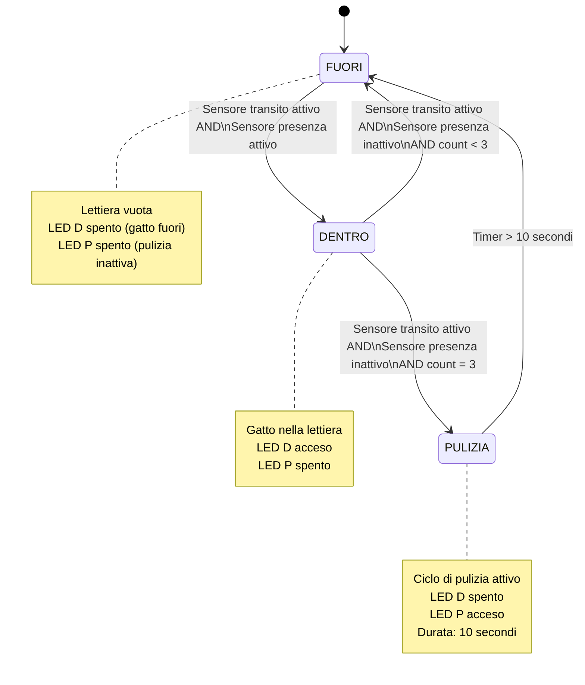

>[Torna all'indice generale](indexstatifiniti.md)

# **LETTIERA AUTOPULENTE**

Scrivere un programma che realizzi una lettiera per gatti autopulente. Tre volte al giorno la lettiera si pulisce automaticamente attivando una centrifuga. 

La centrifuga viene avviata solamente quando si ha la certezza che il gatto è uscito dalla lettiera mediante la valutazione di un sensore di transito (pulsante con memoria) e di un sensore di presenza (deviatore a slitta senza memoria). 

Indicare la presenza del gatto con un led verde acceso. La pulizia della lettiera con un led rosso acceso. La pulizia si attiva automaticamente ogni tre volte che il gatto esce dalla lettiera.

NB: E' con pochi stati e con sensore di transito, per cui si può fare benissimo anche senza macchina a stati. In ogni caso, si noti che i contatori sono considerati ingressi.

Per dettagli sulle macchine a stati finiti (o FSM) vedi [FSM](indexstatifiniti.md) e [Linee guida FSM](statifinitisviluppo.md)

## **Tabella di Transizione della Lettiera Autopulente**

| Stato attuale | Input | Stato prossimo | Azione | Output |
|---------------|-------|----------------|--------|--------|
| FUORI | Sensore transito (pulsante1) attivo AND Sensore presenza (pulsante2) attivo | DENTRO | - | LED D acceso (gatto dentro) |
| FUORI | Sensore transito attivo AND Sensore presenza inattivo | FUORI | - | - |
| DENTRO | Sensore transito attivo AND Sensore presenza inattivo AND count < 3 | FUORI | Incremento count | LED D spento |
| DENTRO | Sensore transito attivo AND Sensore presenza inattivo AND count = 3 | PULIZIA | Reset count a 0, avvio timer t1 | LED D spento, LED P acceso (pulizia) |
| DENTRO | Sensore transito attivo AND Sensore presenza attivo | DENTRO | - | - |
| DENTRO | Sensore transito inattivo | DENTRO | - | - |
| PULIZIA | Timer t1 > 10000 ms | FUORI | Stop timer | LED P spento |

## Descrizione degli Stati

1. **FUORI**: Stato iniziale, lettiera vuota senza gatto.
   - LED D (gatto dentro) spento
   - LED P (pulizia) spento

2. **DENTRO**: Gatto presente nella lettiera.
   - LED D (gatto dentro) acceso
   - LED P (pulizia) spento

3. **PULIZIA**: Ciclo di pulizia automatica attivo.
   - LED D (gatto dentro) spento
   - LED P (pulizia) acceso
   - Timer attivo per 10 secondi

## Ingressi (Input)

- **Sensore transito (pulsante1)**: Pulsante con memoria che rileva il transito del gatto (ingresso/uscita).
- **Sensore presenza (pulsante2)**: Deviatore a slitta senza memoria che rileva la presenza del gatto nella lettiera.
- **Timer t1**: Timer interno che misura la durata del ciclo di pulizia.

## Variabili di stato

- **count**: Contatore degli utilizzi della lettiera (soggiorni). Quando raggiunge il valore 3, viene attivato il ciclo di pulizia.

## Note sul funzionamento

Il sistema distingue tra il transito del gatto (rilevato dal pulsante1) e la sua effettiva presenza nella lettiera (rilevata dal pulsante2). La pulizia automatica viene attivata solo quando:
1. Il gatto è transitato (pulsante1 attivato e rilasciato)
2. Il gatto è uscito dalla lettiera (pulsante2 inattivo)
3. Il contatore degli utilizzi ha raggiunto il valore 3

La pulizia viene effettuata per 10 secondi, dopo i quali il sistema torna allo stato FUORI, pronto per un nuovo utilizzo.

## **Diagramma degli stati**



## **Codice Arduino con FSM "prima gli stati dopo gli ingressi"**

```C++
/*
Scrivere un programma che realizzi una lettiera per gatti autopulente. Tre volte al giorno la lettiera si pulisce automaticamente attivando una 
centrifuga. La centrifuga viene avviata solamente quando si ha la certezza che il gatto è uscito dalla lettiera mediante la valutazione 
di un sensore di transito (pulsante con memoria) e di un sensore di presenza (deviatore a slitta senza memoria). Indicare la presenza 
del gatto con un led verde acceso. La pulizia della lettiera con un led rosso acceso. La pulizia si attiva automaticamente ogni 
tre volte che il gatto esce dalla lettiera.
*/
 
//##### urutils.h #####
void waitUntilInputLow(int btn, unsigned t)
{
   do{
	 delay(t);
   }while(digitalRead(btn)!=LOW);
}

struct DiffTimer
{
	unsigned long elapsed, last;
	bool timerstate=false;
	byte state = 0;
	byte count = 0;
	void reset(){
		elapsed = 0;
		last = millis();
	}
	void toggle(){
		if(timerstate){
    	    stop();
		}else{
			start();
		}	
	}
	void stop(){
		if(timerstate){
			timerstate = false;
    	    elapsed += millis() - last;
		}	
	}
	void start(){
		if(!timerstate){
			timerstate = true;
			last = millis();
		}
	}
	unsigned long get(){
		if(timerstate){
			return millis() - last + elapsed;
		}
		return elapsed;
	}
	void set(unsigned long e){
		reset();
		elapsed = e;
	}
};
//##### urutils.h #####

/*Alla pressione del pulsante si attiva o disattiva un led
mentre un altro led blinka (TASK CONCORRENTI)
*/
int led_D=13; // indicatore di gatto dentro
int led_P=12; // indicatore di pulizia
int pulsante1=2; // sensore di transito (in ingresso o in uscita)
int pulsante2=3; // sensore di permanenza (dentro o fuori)
uint8_t count = 0; // contatore dei soggiorni
uint8_t state;
DiffTimer t1;

enum Stati{
  DENTRO,
  FUORI,
  PULIZIA
};

void blink(int led) {
  digitalWrite(led, !digitalRead(led));
}

void setup(){
  pinMode(pulsante1, INPUT);
  pinMode(pulsante2, INPUT);
  pinMode(led_P, OUTPUT); // indicatore di erogazione
  pinMode(led_D, OUTPUT); // indicatore di accensione/spegnimento
  Serial.begin(115200);
  state = FUORI; // inizialmente l'acqua è fredda
}

void loop() {
  switch (state) {
    case FUORI:
    	Serial.println("FUORI");
		if(digitalRead(pulsante1) == HIGH){
			waitUntilInputLow(pulsante1, 50);
			Serial.println("Gatto in transito in ingresso");
			// Gatto in transito in ingresso
			if(digitalRead(pulsante2) == HIGH){
				// Gatto dentro
				digitalWrite(led_D, HIGH);
				state = DENTRO;
			}
		}
    break;
    case DENTRO:
		Serial.println("DENTRO");
		if(digitalRead(pulsante1) == HIGH){
			waitUntilInputLow(pulsante1, 50);
			Serial.println("Gatto in transito in uscita");
			// Gatto in transito in uscita
			if(digitalRead(pulsante2) == LOW){
				// Gatto fuori
				digitalWrite(led_D, LOW);
				count++;  // aggiorno contatore dei soggiorni
				if(count >= 3){
					count = 0; // resetto contatore dei transiti
					digitalWrite(led_P, HIGH);
					state = PULIZIA;
					t1.start();
					t1.reset();
				}else{
					state = FUORI;
				}	
			}
		}
    break;
    case PULIZIA:
		Serial.println("PULIZIA");
		if(t1.get() > 10000){
			t1.stop();
			digitalWrite(led_P, LOW);
			state = FUORI;
		}
    break;
  }
  delay(10);
}
```
- Simulazione con Arduino su Tinkercad mediante FSM: https://www.tinkercad.com/things/kL0VNCCbB3B-lettiera-gatti

## **Codice Arduino con FSM "prima gli ingressi e dopo gli stati"**

```C++
/*
Scrivere un programma che realizzi una lettiera per gatti autopulente. Tre volte al giorno la lettiera si pulisce automaticamente attivando una 
centrifuga. La centrifuga viene avviata solamente quando si ha la certezza che il gatto è uscito dalla lettiera mediante la valutazione 
di un sensore di transito (pulsante con memoria) e di un sensore di presenza (deviatore a slitta senza memoria). Indicare la presenza 
del gatto con un led verde acceso. La pulizia della lettiera con un led rosso acceso. La pulizia si attiva automaticamente ogni 
tre volte che il gatto esce dalla lettiera.
*/
 
//##### urutils.h #####
void waitUntilInputLow(int btn, unsigned t)
{
   do{
	 delay(t);
   }while(digitalRead(btn)!=LOW);
}

struct DiffTimer
{
	unsigned long elapsed, last;
	bool timerstate=false;
	byte state = 0;
	byte count = 0;
	void reset(){
		elapsed = 0;
		last = millis();
	}
	void toggle(){
		if(timerstate){
    	    stop();
		}else{
			start();
		}	
	}
	void stop(){
		if(timerstate){
			timerstate = false;
    	    elapsed += millis() - last;
		}	
	}
	void start(){
		if(!timerstate){
			timerstate = true;
			last = millis();
		}
	}
	unsigned long get(){
		if(timerstate){
			return millis() - last + elapsed;
		}
		return elapsed;
	}
	void set(unsigned long e){
		reset();
		elapsed = e;
	}
};
//##### urutils.h #####

/*Alla pressione del pulsante si attiva o disattiva un led
mentre un altro led blinka (TASK CONCORRENTI)
*/
int led_D=13; // indicatore di gatto dentro
int led_P=12; // indicatore di pulizia
int pulsante1=2; // sensore di transito (in ingresso o in uscita)
int pulsante2=3; // sensore di permanenza (dentro o fuori)
uint8_t count = 0; // contatore dei soggiorni
uint8_t dentro, lastDentro;
DiffTimer t1;


void blink(int led) {
  digitalWrite(led, !digitalRead(led));
}

void setup(){
  pinMode(pulsante1, INPUT);
  pinMode(pulsante2, INPUT);
  pinMode(led_P, OUTPUT); // indicatore di erogazione
  pinMode(led_D, OUTPUT); // indicatore di accensione/spegnimento
  Serial.begin(115200);
}

void loop() {
	if(digitalRead(pulsante1) == HIGH){
		waitUntilInputLow(pulsante1, 50);
		Serial.println("Gatto in transito");
		// Gatto in transito
		if(digitalRead(pulsante2) == HIGH){
		// Gatto dentro
			digitalWrite(led_D, HIGH);
			dentro = true;
			Serial.println("Gatto dentro");
		}else{
			dentro = false;
			Serial.println("Gatto fuori");
			// Gatto fuori
			digitalWrite(led_D, LOW);
		}
		// il conteggio deve conteggiare solo gli effettivi stazionamenti
		//  e non le finte entrate o le finte uscite
		if(lastDentro != dentro && dentro == false){
			count++;  // aggiorno contatore dei soggiorni
			Serial.print("count: ");Serial.println(count);
			if(count >= 3){
				Serial.println("PULIZIA");
				count = 0; // resetto contatore dei transiti
				digitalWrite(led_P, HIGH);
				t1.start();
				t1.reset();
			}
		}
		// aggiorno lo stato precedente
		lastDentro = dentro; 
	}

	if(t1.get() > 10000){
		t1.stop();
		digitalWrite(led_P, LOW);
	}
	delay(10);
}
```


- Simulazione con Arduino su Tinkercad: https://www.tinkercad.com/things/3F2C6FC6ozg-lettiera-gatti-no-fsm

## **Ulteriori varianti del codice Arduino "prima gli ingressi e dopo gli stati"**

- Simulazione con Arduino su Tinkercad variante senza FSM e senza delay: https://www.tinkercad.com/things/cYQtH4sy94O-lettiera-gatti-no-fsm-no-delay
- Simulazione con Arduino su Tinkercad variante senza FSM e senza delay ma con fronte di discesa rapido: https://www.tinkercad.com/things/7s1lQs9BxUi-lettiera-gatti-no-fsm-no-delay-e-disccesa-rapida
- Simulazione con Arduino su Tinkercad di una variante del precedente: https://www.tinkercad.com/things/49tCYEOMBP3-lettiera-gatti-no-fsm-no-delay-e-discesa-rapida-2
  
>[Torna all'indice generale](indexstatifiniti.md)
