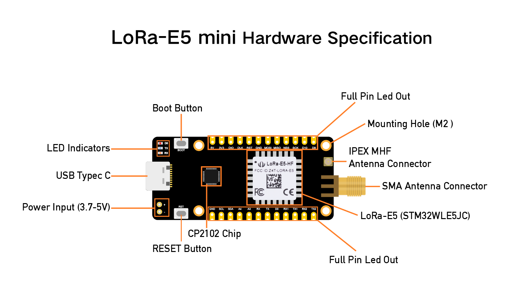
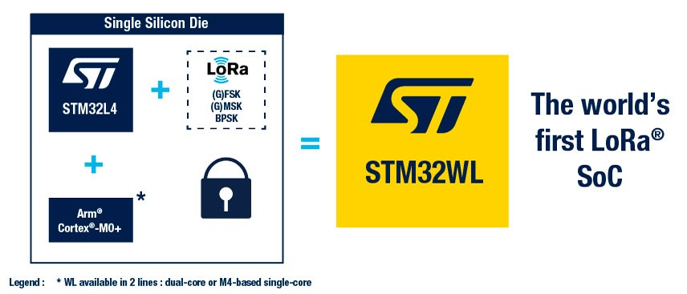
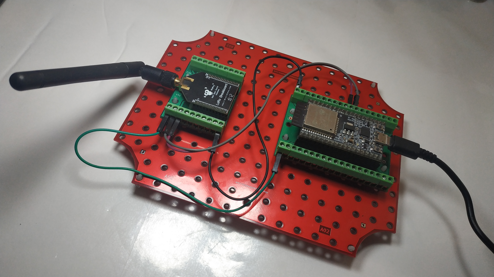

>[Torna all'indice generale](index.md)
## **Gateways per reti di sensori con modem LoRaWan HW con il modulo Lora E5 mini** !!! NON ANCORA FINITO !!!
BUS cablato:
1. [Dallas](lorawanswdallas.md)
2. [I2C](gatewayi2clorasw.md)
3. [SPI](gatewayspi.md)
4. [Modbus](gatewaymodbus.md)

Stella cablato (punto-punto):
1. [Analogico](loraswgatewayanalogico.md)
2. [Digitale](loraswgatewaydigitale.md)

Radio punto-punto:
1. [Analogico](gatewayradioa.md)
2. [Digitale](gatewayradiod.md)


Per una discussione sintetica di tutti i tipi di BUS semplici dal punto di vista generale si rimanda a [Cablati semplici](cablatisemplici.md ).

### **La scheda LoRa E5 Mini**




E' un **modem** che implementa **in HW** tutto lo **stack LoraWan** ed è configurabile via seriale mediante i comandi AT.

Il modulo LoRa E5 Mini fornisce: scheda con terminali + transceiver Semtech SX1276X + MCU STM32L4 + interfaccia seriale.  

E' utilizzabile:
- come **modem HW** accessibile via UART tramite ccomandi AT gestibili anche tramite una libreria per Arduino. Sia i comandi AT che la libreria permettono l'accesso ai GPIO di cui è dotata tramite un'intestazione aggiuntiva ai messaggi. Il vantaggio di questa configurazione è che il codice della MCU risulta non appesatito dall'implementazione dell'intero stack protocollare LoRaWan e quindi con più risorse disponibili da dedicare alla logica dell'applicazione.
- come **MCU** su cui caricare il FW con lo **stack** LoRaWan **completo** (**LMIC**) oppure un FW con uno **stack** di comunicazione **minimale** per la modalità **P2P** tra **coppie** di dispositivi. Il vantaggio di questa configurazione è che un nodo **non ha** bisogno di **MCU aggiuntive** per gestire la **logica** dell'applicazione con conseguente risparmio di dimensioni e consumi.

### **Schema cablaggio**

Collegamento di una scheda modem RAK811 con una scheda MCU **ESP32**.



La lunghezza del filo dipende dalla frequenza:
- 868 MHz: 86,3 mm 
- 915 MHz: 81,9 mm
- 433 MHz: 173,1 mm

### **Bande di frequenza e potenza**
```
				Lower EU	Upper EU	US (FCC)
Intervallo di frequenze		865 – 868 MHz	915 – 921 MHz	902 – 928 MHz
Potenza irradiata		2 watt		4 watt		4 watt
Canale di banda			200 kHz		400 kHz		400 kHz
```
### **Classi di servizio**

**Classe A**

La **trasmissione** del nodo in uplink è **asincrona** cioè i messaggi, dal nodo al gateway, possono essere inviati in qualsiasi momento. 

Dopo la trasmissione il nodo apre **due finestre di ricezione**. Il Network server **può rispondere** tramite un gateway con un messaggio in Downlink in una delle due finestre. Solitamente **la prima** finestra è aperta sullo stesso canale utilizzato nella trasmissione in Uplink, mentre **la seconda** finestra viene aperta su un canale differente, accordato in precedenza con il Network Server, per migliorare la resistenza alle interferenze.

**Classe B**

**Periodicamente**, ogni 128 secondi, un **nodo** riceve dal **gateway** un beacon per la **sincronizzazione** (tra nodo e gateway) e per la **schedulazione** delle ricezioni. Un **pacchetto beacon** contiene uno specifico tempo di riferimento in cui far aprire ai nodi della rete una **finestra di ricezione extra**, chiamata **ping slot**. In pratica è una multiplazione TDMA con cui, ad ogni beacon, il network server riserva uno slot temporale ai vari nodi afferenti ad un certo gateway. La posizione dello slot, nella trama tra un beacon e l'altro, viene ricalcolata ad ogni nuovo beacon per evitare errori di ricezione **sistematici**. 

La ricezione è affetta da una **latenza** piuttosto variabile e potenzialmente elevata. In compenso, il **consumo** è ancora puttosto ridotto perchè, ad ogni trama, la finestra di ricezione è una sola e molto breve.

La **trasmissione** in uplink, analogamente alla classe A, è ancora asincrona.

**Classe C**

La **finestra** di ricezione, quando il nodo non trasmette, è **sempre aperta** per cui la trasmissione in downlink da parte del network server può avvenire, in maniera completamente **asincrona**, in qualsiasi momento. La finestra di ricezione è **chiusa** soltanto durante la trasmissione. In questa modalità la **latenza** è minima ma il **consumo** è massimo per cui si tratta di un modo di funzionamento adatto a dispositivi perennemente connessi ad una fonte di **alimentazione persistente** (rete elettrica, panneli solari).

**ALOHA**

In tutte le classi l'**accesso multiplo** al canale in **uplink** è un TDM a contesa random di tipo **ALOHA**.


### **Modi di autenticazione**

**Attivazione via etere (OTAA)**

L'**attivazione over-the-air (OTAA)** è il modo preferito e più sicuro per connettersi con The Things Network. I dispositivi eseguono una procedura di unione con la rete (join), durante la quale viene assegnato un **DevAddr** dinamico e le **chiavi** di sicurezza vengono **negoziate** con il dispositivo.

**Attivazione tramite personalizzazione (ABP)**

In alcuni casi potrebbe essere necessario codificare il **DevAddr** e le **chiavi di sicurezza** hardcoded nel dispositivo. Ciò significa attivare un dispositivo **tramite personalizzazione (ABP)**. Questa strategia potrebbe sembrare più semplice, perché si salta la procedura di adesione, ma presenta alcuni svantaggi legati alla sicurezza.

**ABP vs OTAA**

In generale, non ci sono inconvenienti nell'utilizzo dell'OTAA rispetto all'utilizzo dell'ABP, ma ci sono alcuni requisiti che devono essere soddisfatti quando si utilizza l'OTAA.La specifica LoRaWAN avverte in modo specifico contro il ricongiungimento sistematico in caso di guasto della rete. Un dispositivo dovrebbe conservare il risultato di un'attivazione in una memoria permanente se si prevede che il dispositivo venga spento e riacceso durante la sua vita:
- un dispositivo ABP utilizza una memoria non volatile per mantenere i contatori di frame tra i riavvii. 
- Un approccio migliore sarebbe passare all'utilizzo di OTAA e memorizzare la sessione OTAA anziché i contatori di frame.

L'unica cosa da tenere a mente è che un join OTAA richiede che il dispositivo finale si trovi all'interno della copertura della rete su cui è registrato. La ragione di ciò è che la procedura di join OTAA richiede che il dispositivo finale sia in grado di ricevere il messaggio di downlink Join Accept dal server di rete.

Un approccio migliore consiste nell'eseguire un join OTAA in una fabbrica o in un'officina in cui è possibile garantire la copertura di rete e i downlink funzionanti. Non ci sono svantaggi in questo approccio finché il dispositivo segue le migliori pratiche LoRaWAN (https://www.thethingsindustries.com/docs/devices/best-practices/).

### **Buone pratiche**

**Connessioni confermate**

È possibile che non si riceva subito un ACK per ogni uplink o downlink di tipo confermato. Una buona regola empirica è attendere almeno tre ACK mancati per presumere la perdita del collegamento.

In caso di perdita del collegamento, procedere come segue:
- Imposta la potenza TX al massimo consentito/supportato e riprova
- Diminuisci gradualmente la velocità dei dati e riprova
- Ripristina i canali predefiniti e riprova
- Invia richieste di adesione periodiche con backoff

**Cicli di alimentazione**

I dispositivi dovrebbero salvare i parametri di rete tra i cicli di alimentazione regolari. Ciò include parametri di sessione come DevAddr, chiavi di sessione, FCnt e nonces. Ciò consente al dispositivo di unirsi facilmente, poiché chiavi e contatori rimangono sincronizzati.

### **Architettura di riferimento per IoT**

L'**architettura tipica del SW** a bordo di un dispositivo IoT è riassumibile:


Il **middleware** in genere è composto da **librerie di terze parti** da **compilare** all'interno di un **IDE** (ad es. Arduino) o all'interno di un **SDK** cioè un pacchetto di sviluppo per applicazioni che fornisce vari strumenti per compilazione, debug e documentazione (ad es. AWS IoT, Azure IoT, ESP-IDF). Oppure esistono **framework** specifici per IoT Open Source come RIOT che, una volta compilati su una macchina Linux, forniscono veri e propri **SO per IoT** con esattamente ciò che serve per la **comunicazione** di un certo dispositivo.

### **Librerie del progetto**

In questo caso gran parte delle funzioni del middleware, quelle relative alla comunicazione via stack LoRaWan, è implementato all'interno del chip del modem. Il middleware nel sistema a microprocessore (MCU) stavolta svolge ben poche funzioni di comunicazione. 

Dal **punto di vista SW** seve **4 librerie** da scaricare dentro la solita cartella **libraries**:
- **Arduino-RAK811-Library**. Si scarica da https://github.com/RAKWireless/WisNode-Arduino-Library come WisNode-Arduino-Library-master.zip, poi si  scompatta in una cartella sul desktop da cui si copia la cartella **Arduino-RAK811-Librarye** che va messa nela libraries dell'IDE di Arduino.

La libreria dovrebbero supportare solamente le classi di servizio A e B (C esclusa).

**Gestione della ricezione**


### **Gateway LoraWan con OTAA join**

```C++
#include <Arduino.h>
#include <SoftwareSerial.h>
#include "DHT.h"
 
#define DHTPIN 0 // what pin we're connected to
#define LED_BUILTIN  1

//https://wiki.seeedstudio.com/Grove_LoRa_E5_New_Version/#download-library
 
// Uncomment whatever type you're using!
#define DHTTYPE DHT11 // DHT 11
// #define DHTTYPE DHT22   // DHT 22  (AM2302)
//#define DHTTYPE DHT21   // DHT 21 (AM2301)
 
DHT dht(DHTPIN, DHTTYPE);
 
static char recv_buf[512];
static bool is_exist = false;
static bool is_join = false;
static int led = 0;
 
static int at_send_check_response(char *p_ack, int timeout_ms, char *p_cmd, ...)
{
    int ch;
    int num = 0;
    int index = 0;
    int startMillis = 0;
    va_list args;
    memset(recv_buf, 0, sizeof(recv_buf));
    va_start(args, p_cmd);
    Serial1.printf(p_cmd, args);
    Serial.printf(p_cmd, args);
    va_end(args);
    delay(200);
    startMillis = millis();
 
    if (p_ack == NULL)
    {
        return 0;
    }
 
    do
    {
        while (Serial1.available() > 0)
        {
            ch = Serial1.read();
            recv_buf[index++] = ch;
            Serial.print((char)ch);
            delay(2);
        }
 
        if (strstr(recv_buf, p_ack) != NULL)
        {
            return 1;
        }
 
    } while (millis() - startMillis < timeout_ms);
    return 0;
}
 
static void recv_prase(char *p_msg)
{
    if (p_msg == NULL)
    {
        return;
    }
    char *p_start = NULL;
    int data = 0;
    int rssi = 0;
    int snr = 0;
 
    p_start = strstr(p_msg, "RX");
    if (p_start && (1 == sscanf(p_start, "RX: \"%d\"\r\n", &data)))
    {
        Serial.println(data);
        Serial.print("led :");
        led = !!data;
        Serial.println(led);
        if (led)
        {
            digitalWrite(LED_BUILTIN, LOW);
        }
        else
        {
            digitalWrite(LED_BUILTIN, HIGH);
        }
    }
 
    p_start = strstr(p_msg, "RSSI");
    if (p_start && (1 == sscanf(p_start, "RSSI %d,", &rssi)))
    {
        Serial.print("                ");
        Serial.print("rssi:");
        Serial.println(rssi);
    }
    p_start = strstr(p_msg, "SNR");
    if (p_start && (1 == sscanf(p_start, "SNR %d", &snr)))
    {
        Serial.print("                ");
        Serial.print("snr :");
        Serial.println(snr);
    }
}
 
void setup(void)
{
    Serial.begin(115200);
    pinMode(LED_BUILTIN, OUTPUT);
    digitalWrite(LED_BUILTIN, HIGH);
 
    Serial1.begin(9600);
    Serial.print("E5 LORAWAN TEST\r\n");
 
    if (at_send_check_response("+AT: OK", 100, "AT\r\n"))
    {
        is_exist = true;
        at_send_check_response("+ID: AppEui", 1000, "AT+ID\r\n");
        at_send_check_response("+MODE: LWOTAA", 1000, "AT+MODE=LWOTAA\r\n");
        at_send_check_response("+DR: EU868", 1000, "AT+DR=EU868\r\n");
        at_send_check_response("+CH: NUM", 1000, "AT+CH=NUM,0-2\r\n");
        at_send_check_response("+KEY: APPKEY", 1000, "AT+KEY=APPKEY,\"2B7E151628AED2A6ABF7158809CF4F3C\"\r\n");
        at_send_check_response("+CLASS: C", 1000, "AT+CLASS=A\r\n");
        at_send_check_response("+PORT: 8", 1000, "AT+PORT=8\r\n");
        delay(200);
        Serial.print("LoRaWAN");
        is_join = true;
    }
    else
    {
        is_exist = false;
        Serial.print("No E5 module found.\r\n");
        Serial.print("unfound E5 !");
    }
 
    dht.begin();

    Serial.print("temp:");

    Serial.print("humi:");

    Serial.print("led :");
    Serial.println(led);
}
 
void loop(void)
{
    float temp = 0;
    float humi = 0;
 
    temp = dht.readTemperature();
    humi = dht.readHumidity();
 
    Serial.print("Humidity: ");
    Serial.print(humi);
    Serial.print(" %\t");
    Serial.print("Temperature: ");
    Serial.print(temp);
    Serial.println(" *C");
 
    if (is_exist)
    {
        int ret = 0;
        if (is_join)
        {
 
            ret = at_send_check_response("+JOIN: Network joined", 12000, "AT+JOIN\r\n");
            if (ret)
            {
                is_join = false;
            }
            else
            {
                at_send_check_response("+ID: AppEui", 1000, "AT+ID\r\n");
                Serial.print("JOIN failed!\r\n\r\n");
                delay(5000);
            }
        }
        else
        {
            char cmd[128];
            sprintf(cmd, "AT+CMSGHEX=\"%04X%04X\"\r\n", (int)temp, (int)humi);
            ret = at_send_check_response("Done", 5000, cmd);
            if (ret)
            {
                recv_prase(recv_buf);
            }
            else
            {
                Serial.print("Send failed!\r\n\r\n");
            }
            delay(5000);
        }
    }
    else
    {
        delay(1000);
    }
}
```

### **Gateway LoraWan con OTAA join e deepSleep**

La **memoria RTC** (Real Time Clock) è un'area della SRAM del processore che rimane alimentata e accessibile alle funzioni RTC del microcontrollore ESP32 e del coprocessore ULP anche quando è attivato lo standby. Nell'esempio sottostante la memoria RTC viene utilizzata per memorizzare un flag di avvenuta conessione. I parametri della connessione (chiave di sessione) vengono recuperati dal modem se questo era stato precedentemente associata (join) al gateway LoRaWan con successo.

```C++

```

### **Sitografia:**

- https://www.semiconductorstore.com/pdf/Migrating-Sensor-Design-LoRaWAN-WhitePaper_FINAL.pdf
- https://www.ictpower.it/tecnologia/lora-nozioni-di-base-e-approfondimenti.htm
- https://github.com/RAKWireless/WisNode-Arduino-Library
- https://github.com/RAKWireless/WisNode-Arduino-Library
- https://github.com/stm32duino
- https://www.arduinolibraries.info/architectures/stm32
- https://docs.rakwireless.com/Product-Categories/WisDuo/RAK811-Module/Datasheet/#certification
- https://githubmemory.com/repo/stm32duino/Arduino_Core_STM32/issues/1395
- https://forum.rakwireless.com/t/rak4200-and-rak811-breakout-board/2676/11
- https://downloads.rakwireless.com/LoRa/RAK811-BreakoutBoard/
- https://github.com/RAKWireless/RAK811_LoRaWAN_Arduino


>[Torna all'indice generale](index.md)


