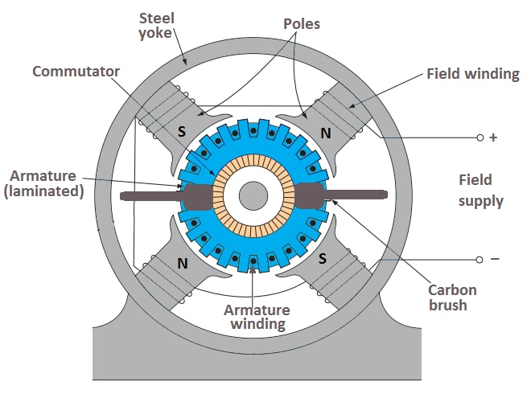
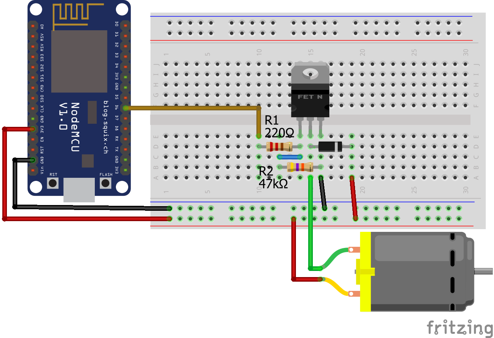

>[Torna a gateway digitale](lorahwgatewaydigitale.md)

## **Gateway per scheda relè digitale**

### **Schema di principio del collegamento a stella**

Notare i **collegamenti punto-punto** tra tutti i dispositivi e il microcontrollore tramite linee esclusive.


### **Il motore in corrente continua (DC)**

Ogni motore DC è costituito da due componenti chiave importanti per la funzionalità:
- Lo **statore** è la parte stazionaria del motore che fornisce un campo magnetico rotante per l'armatura.
- L'**armatura** è la parte del motore a corrente continua che ruota e in cui sono collegati componenti esterni, come una ruota.

I **magneti** nello statore (poli) e una **bobina** di fili (avvolgimento di campo), attraversati da una corrente, generano un **campo elettromagnetico**. Gli avvolgimenti del filo isolato all'esterno dell'armatura (avvolgimento dell'indotto) sono avvolti attorno all'armatura per concentrare il campo magnetico dello statore.



Gli avvolgimenti dell'indotto sono collegati a un **commutatore**, fondamentalmente un **interruttore elettrico rotante**, che applica corrente elettrica agli avvolgimenti. La corrente elettrica eccita ciascuna bobina dell'indotto e crea un campo magnetico rotante costante. L'interruttore, a contatti striscianti, serve a fornire corrente alla bobina che è in grado di trainare il rotore, togliendo corrente alle bobine che non sono più nella posizione giusta per spigerlo.

Se le bobine dell'indotto vengono accese e spente in sequenza, il campo magnetico rotante interagisce con il campo magnetico dello statore e crea una coppia, che fa ruotare l'armatura. Pertanto, il motore DC **converte** l'**energia elettrica** in **energia meccanica**.

E' da rimarcare che normalmente non è una buona idea **collegare direttamente** la bobina di un relè ad una porta digitale del microcontrollore perchè questa potrebbe non fornire tutta la **corrente necessaria** per **eccitare competamente** il motore perchè questo non sarebbe in grado di erogare tutta la corrente necessaria. 

Utilizzeremo un transistor MOS come interruttore per controllare un piccolo motore a basso consumo. Controlleremo il MOS con ESP32. Potremmo usare qualsiasi altro microcontrollore. 

Bisogna fare attenzione a distinguere tra **carichi resistivi** e **carichi induttivi**. Una lampadina è un tipico carico resistivo, mentre un motore è un tipico carico induttivo. 

I **carichi induttivi** sono costituiti internamente da bobine più o meno grandi. I carichi induttivi soffrono del problema delle **sovratensioni** e delle **sovracorrenti** all'**accensione** e allo **spegnimento**. 

Una **sovracorrente** è una corrente che può essere **parecchie volte superiore** alla **massima corrente nominale** del **carico** (anche 10-15 volte), ha però la caratteristica di essere presente per un periodo **transitorio molto breve**. La sua presenza è un **fattore di stress** per i tramsistor che ne accorcia la vita operativa. Per cui è opportuno progettare il circuito per renderlo in grado di erogare una intensa corrente di spunto parecchie volte maggiore di quella nominale.


### **Come scegliere il MOSFET giusto per controllare il motore DC?**

Per il nostro circuito scegliamo il MOSFET IRLZ44. Ma come facevo a sapere che posso usare questo MOSFET? La decisione si basa sul microcontrollore e sulle specifiche elettriche del motore CC. I seguenti passaggi mostrano il processo, come trovare il transistor giusto per il tuo circuito:
- La tensione di soglia del gate (V_GS) è inferiore alla tensione di funzionamento del microcontrollore. L'IRLZ44 ha una tensione di soglia gate-source compresa tra 1 V e 2 V. Il nostro Arduino con tensione operativa di 5 V e ESP32 ed ESP8266 con una tensione operativa di 3,3 V hanno una tensione superiore alla tensione di soglia gate-source dell'IRLZ44.
- La tensione di rottura drain-source (breakdown voltage) non viene superata. Poiché utilizziamo il microcontrollore come fonte di alimentazione del motore CC, la nostra tensione drain-source non supererà i 5V. La tensione di rottura drain-source dell'IRLZ44 è molto più alta con 55V.
- La corrente di drain continua non viene superata. Il motore CC che usiamo in questo esempio assorbe in media 100 mA e il valore massimo assoluto per la corrente di drain continua dell'IRLZ44 è 35 A. Pertanto, il MOSFET IRLZ44 è una buona scelta per il nostro circuito. 

### **Perché abbiamo bisogno di un diodo in parallelo al motore DC?**

Abbiamo appreso nella prima parte di questo articolo che il motore DC ha bobine all'interno che creano un campo magnetico. Quando un motore DC è spento, la corrente nello statore è 0A e il rotore gira a vuoto a causa del momento d'inerzia. Questa rotazione provoca un'autoinduzione nelle bobine del motore e quindi picchi di tensione. 

Il diodo, chiamato anche **diodo flyback**, che abbiamo collegato in parallelo al motore CC fornisce un percorso sicuro per la corrente induttiva in modo che la tensione drain-source non aumenti e danneggi potenzialmente il circuito.

### **Perché abbiamo bisogno di un resistore tra il gate del transistor e la massa?**

Se il pin I/O digitale del microcontrollore Arduino, ESP8266 o ESP32 è impostato su LOW, ma la tensione di alimentazione del motore CC all'emettitore è ancora attiva, è possibile che il transistor sia passato in modo errato. Questo può accadere anche all'inizio del programma, dove il pin digitale del microcontrollore non è ancora definito come output. Con il resistore R2 impostiamo uno stato predefinito in questo caso portiamo a massa il gate.

La dimensione di questo resistore R2 tra gate e terra crea un partitore di tensione con il resistore R1. L'uscita del partitore di tensione è la tensione di gate del MOSFET. L'obiettivo è che la tensione di gate non sia troppo ridotta dal resistore R2. In caso contrario, potrebbe accadere che la tensione di soglia non venga superata per commutare il MOSFET.

### **Perché abbiamo bisogno di un resistore in serie al gate del transistor?**

Il resistore R1 è lì per limitare la corrente per il microcontrollore perché il gate del MOSFET è un piccolo condensatore che inizia a caricarsi se viene applicata una tensione al gate. L'assorbimento di corrente iniziale potrebbe essere troppo alto per il pin I/O digitale del microcontrollore, come mostrato nella figura seguente.

Quando la corrente supera la corrente massima del microcontrollore, che abbiamo visto nella tabella del capitolo precedente, il microcontrollore potrebbe danneggiarsi. Pertanto, utilizziamo il resistore R1 per proteggere il pin digitale e appiattire la curva di carica del gate MOSFET. Se volessimo un'alta frequenza di commutazione superiore a 100 kHz, possiamo usare un resistore R1 di 220.

### **Schema cablaggio**

**Avvertenza:** prima di realizzare questo schema elettrico, assicurarsi di non aver collegato ESP32 e lampada con alimentazione ad alta tensione. Stai utilizzando l'ALTA tensione in questo progetto, prendi tutte le precauzioni prima di creare questo layout. 

**Prima di toccare** il circuito per **inserire o disinserire collegamenti** assicurarsi con **certezza assoluta** di aver **scollegato la tensione di rete a 230V**. **Ripetere** questo controllo **con scrupolo** ogni volta che si **maneggia il circuito**.




### **Librerie del progetto**

Dal **punto di vista SW** non servono librerie particolari tranne quelle per la pubblicazione dei valori tramite LoRaWan. 

### **Gateway GPIO-LORaWan con modem HW per il comando di una scheda relè**

Il codice seguente, alla ricezione del messaggio sotto forma di un singolo byte (uint8_t) scrive il bit basso o alto sulla **porta di controllo** del relè ivi collegato. **Subito dopo** la scrittura del comando viene effettuata una **lettura dello stato** della stessa porta (la cmdport) e viene inviato il suo valore al server applicativo lungo un **canale di feedback** in uplink. 

**Periodicamente**, grazie ad una **schedulazione** all'interno del loop(), il microcontrollore **invia spontaneamente** lo **stato della porta** del relè con una cadenza memorizzata su interval e impostata a **60 secondi**.

```C++
/*
 * Author: JP Meijers
 * Date: 2016-10-20
 *
 * Transmit a one byte packet via TTN. This happens as fast as possible, while still keeping to
 * the 1% duty cycle rules enforced by the RN2483's built in LoRaWAN stack. Even though this is
 * allowed by the radio regulations of the 868MHz band, the fair use policy of TTN may prohibit this.
 *
 * CHECK THE RULES BEFORE USING THIS PROGRAM!
 *
 * CHANGE ADDRESS!
 * Change the device address, network (session) key, and app (session) key to the values
 * that are registered via the TTN dashboard.
 * The appropriate line is "myLora.initABP(XXX);" or "myLora.initOTAA(XXX);"
 * When using ABP, it is advised to enable "relax frame count".
 *
 * Connect the RN2xx3 as follows:
 * RN2xx3 -- ESP8266
 * Uart TX -- GPIO4
 * Uart RX -- GPIO5
 * Reset -- GPIO15
 * Vcc -- 3.3V
 * Gnd -- Gnd
 *
 */
#include <rn2xx3.h>
#include <SoftwareSerial.h>
#include <DHT.h>

#define RESET 15
//sensors defines

SoftwareSerial mySerial(4, 5); // RX, TX !! labels on relay board is swapped !!

//create an instance of the rn2xx3 library,
//giving the software UART as stream to use,
//and using LoRa WAN
rn2xx3 myLora(mySerial);

int8_t cmdport = 22;
int8_t ax;

void inline sensorsInit() {

}

void inline readSensorsAndTx() {
// Split both words (16 bits) into 2 bytes of 8
	byte payload[1];

	Serial.print("Requesting data...");
	ax = digitalRead(cmdport);
	Serial.println("DONE");

	payload[0] = ax;
	
	Serial.println(F("Packet queued"));
  
	//myLora.tx("!"); //send String, blocking function
	myLora.txBytes(payload, sizeof(payload)); // blocking function
}

// the setup routine runs once when you press reset:
void setup() {
  // LED pin is GPIO2 which is the ESP8266's built in LED
  pinMode(2, OUTPUT);
  led_on();

  // Open serial communications and wait for port to open:
  Serial.begin(57600);
  mySerial.begin(57600);
  
  sensorsInit();
  
  delay(1000); //wait for the arduino ide's serial console to open

  Serial.println("Startup");

  initialize_radio();

  //transmit a startup message
  myLora.tx("TTN Mapper on ESP8266 node");

  led_off();

  delay(2000);
}

void initialize_radio()
{
  //reset RN2xx3
  pinMode(RESET, OUTPUT);
  digitalWrite(RESET, LOW);
  delay(100);
  digitalWrite(RESET, HIGH);

  delay(100); //wait for the RN2xx3's startup message
  mySerial.flush();

  //check communication with radio
  String hweui = myLora.hweui();
  while(hweui.length() != 16)
  {
    Serial.println("Communication with RN2xx3 unsuccessful. Power cycle the board.");
    Serial.println(hweui);
    delay(10000);
    hweui = myLora.hweui();
  }

  //print out the HWEUI so that we can register it via ttnctl
  Serial.println("When using OTAA, register this DevEUI: ");
  Serial.println(hweui);
  Serial.println("RN2xx3 firmware version:");
  Serial.println(myLora.sysver());

  //configure your keys and join the network
  Serial.println("Trying to join TTN");
  bool join_result = false;

  //ABP: initABP(String addr, String AppSKey, String NwkSKey);
  join_result = myLora.initABP("02017201", "8D7FFEF938589D95AAD928C2E2E7E48F", "AE17E567AECC8787F749A62F5541D522");

  //OTAA: initOTAA(String AppEUI, String AppKey);
  //join_result = myLora.initOTAA("70B3D57ED00001A6", "A23C96EE13804963F8C2BD6285448198");

  while(!join_result)
  {
    Serial.println("Unable to join. Are your keys correct, and do you have TTN coverage?");
    delay(60000); //delay a minute before retry
    join_result = myLora.init();
  }
  Serial.println("Successfully joined TTN");

}

// the loop routine runs over and over again forever:
void loop()
{
    led_on();

    Serial.print("TXing");
    myLora.txCnf("!"); //one byte, blocking function

    switch(myLora.txCnf("!")) //one byte, blocking function
    {
      case TX_FAIL:
      {
        Serial.println("TX unsuccessful or not acknowledged");
        break;
      }
      case TX_SUCCESS:
      {
        Serial.println("TX successful and acknowledged");
        break;
      }
      case TX_WITH_RX:
      {
        String received = myLora.getRx();
        received = myLora.base16decode(received);
        Serial.print("Received downlink: " + received);
	digitalWrite(cmdport, received.toInt());
	readSensorsAndTx();
        break;
      }
      default:
      {
        Serial.println("Unknown response from TX function");
      }
    }

    led_off();
    delay(10000);
}

void led_on()
{
  digitalWrite(2, 1);
}

void led_off()
{
  digitalWrite(2, 0);
}
```


**Sitografia:**

- https://microcontrollerslab.com/esp32-web-server-control-relay-220-volt-lamp/
- https://www.monicoimpianti.net/rele-passo-passo/
- https://diyi0t.com/control-dc-motor-without-ic-motor-driver/

>[Torna a gateway digitale](lorahwgatewaydigitale.md)
