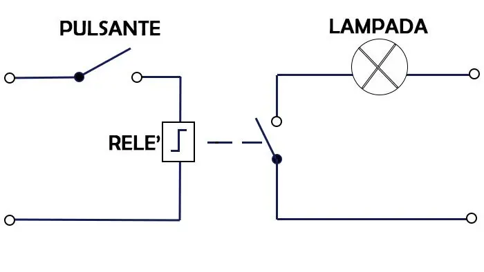
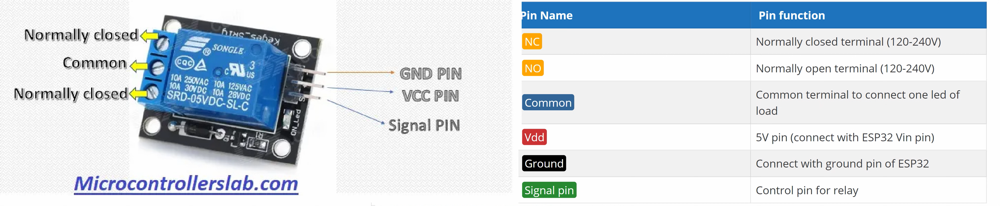
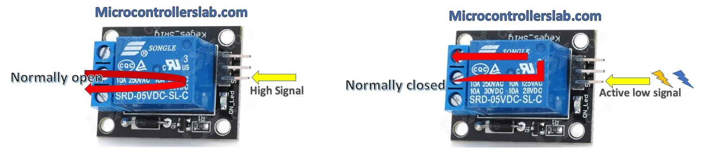
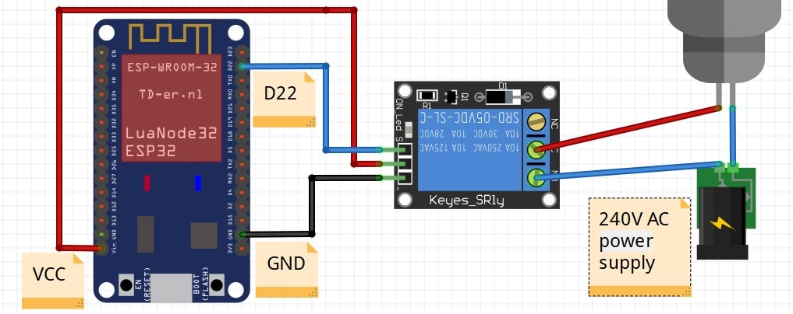

>[Torna a gateway digitale](lorahwgatewaydigitale.md)

## **Gateway per scheda relè digitale**

### **Schema di principio del collegamento a stella**

Notare i **collegamenti punto-punto** tra tutti i dispositivi e il microcontrollore tramite linee esclusive.


### **La scheda relè**

Il relè è un dispositivo elettromeccanico utilizzato come interruttore e frapposto tra dispositivi ad alta corrente e dispositivi a bassa corrente. Le sue parti principali sono bobina e contatti. Generalmente applichiamo tensioni CC (5-12V) alla bobina e colleghiamo il carico (230V) attraverso i contatti normalmente aperti o chiusi. Quando forniamo tensione continua alla bobina, questa inizia a caricare, lungo il suo asse (traferro) un campo magnetico. Quando la bobina è completamente eccitata, il contatto passa dalla posizione normalmente aperta alla posizione normalmente chiusa sotto lìazione della forza esercitata dal mampo magnetico sul metallo del contatto.



Le lampadine o i motori di solito funzionano con alimentazione a 230 volt in caso di alimentazione in CA (corrente alternata). Non possiamo interfacciare questi carichi AC direttamente con la scheda di sviluppo ESP32. Dobbiamo usare un relè tra ESP32 e la lampada. 

Utilizzeremo un relè come interruttore per controllare lampade da 120-230 volt. Controlleremo il relè con ESP32. Potremmo usare qualsiasi modulo relè. Tuttavia, utilizzeremo il modulo relè SRD-05VDC-SL-C 5V. Funziona e può essere utilizzato per controllare carichi in uscita da 120-240 volt e una corrente massima di 10 A.

Bisogna fare attenzione a distinguere tra **carichi resistivi** e **carichi induttivi**. Una lampadina è un tipico carico resistivo, mentre un motore è un tipico carico induttivo. 

I **carichi induttivi** sono costituiti internamente da bobine più o meno grandi. I carichi induttivi soffrono del problema delle **sovratensioni** e delle **sovracorrenti** all'**accensione** e allo **spegnimento**. 

Una **sovracorrente** è una corrente che può essere **parecchie volte superiore** alla **massima corrente nominale** del **carico** (anche 10-15 volte), ha però la caratteristica di essere presente per un periodo **transitorio molto breve**. La sua presenza è un **fattore di stress** per i relè che ne accorcia la vita operativa. Esistono relè **appositamente progettati** per l'azionamento dei **carichi induttivi** ma hanno normalmente dimensioni e costo maggiore di quelli per carichi resistivi.

E' da rimarcare che normalmente non è una buona idea **collegare direttamente** la bobina di un relè ad una porta digitale del microcontrollore perchè questa potrebbe non fornire tutta la **corrente necessaria** per **eccitare competamente** il relè. Normalmente tra, microcontrollore e relè vi sono dei **circuiti di pilotaggio** che forniscono la corrente necessaria realizzati con **transistor BJT o MOS**. Una **scheda relè** normalmente ha a bordo, oltre al relè, pure i circuiti di pilotaggio necessari.



Una **scheda relè** consiste di **6 pin**:
- Tre pin vengono utilizzati per il collegamento con il **lato ad alta tensione**, ad esempio carichi elettrici e alimentazione a 220 volt 
- altri tre pin vengono utilizzati per il **lato a bassa tensione**, vale a dire: vcc, massa e pin del segnale di controllo.



Ci sono due **pin di contatto** che sono **normalmente aperti** e **normalmente chiusi**. Si usa sempre un **pin comune** insieme ad un pin normalmente aperto o un pin normalmente chiuso alternativamente per collegare il carico. A seconda di NC o NO, si utilizza un segnale attivo alto o attivo basso per controllare il relè:
- **Normalmente aperto (NA)**. Si utilizza un pin normalmente aperto, il relè si attiverà quando il segnale alto è presente sul **pin di controllo** mentre il segnale basso sullo stesso pin spegnerà il relè come mostrato in figura.
- **Normalmente chiuso (NC)**.  Si utilizza un pin normalmente chiuso, il segnale basso sul **pin di controllo** attiva il relè mentre il segnale alto sul pin di controllo disattiva il relè.

Alcuni moduli relè hanno transistor che funzionano con logica invertita. Logica invertita significa che il segnale basso attivo attiverà il relè mentre il segnale alto attivo spegnerà il relè. È necessario controllare la funzionalità del modulo relè prima di utilizzarlo. SRD-05VDC-SL-C, il modulo relè a 5V utilizzato nel progetto, non funziona su logica invertita.

### **Schema cablaggio**

**Avvertenza:** prima di realizzare questo schema elettrico, assicurarsi di non aver collegato ESP32 e lampada con alimentazione ad alta tensione. Stai utilizzando l'ALTA tensione in questo progetto, prendi tutte le precauzioni prima di creare questo layout. 

**Prima di toccare** il circuito per **inserire o disinserire collegamenti** assicurarsi con **certezza assoluta** di aver **scollegato la tensione di rete a 230V**. **Ripetere** questo controllo **con scrupolo** ogni volta che si **maneggia il circuito**.



### **Librerie del progetto**

Dal **punto di vista SW** non servono librerie particolari tranne quelle per la pubblicazione dei valori tramite MQTT. 

### **Gateway GPIO-LORaWan con modem HW per il comando di una scheda relè**

Il codice seguente, alla ricezione del messaggio sotto forma di un singolo byte (uint8_t) scrive il bit basso o alto sulla **porta di controllo** del relè ivi collegato. **Subito dopo** la scrittura del comando viene effettuata una **lettura dello stato** della stessa porta (la cmdport) e viene inviato il suo valore al server applicativo lungo un **canale di feedback** in uplink. 

**Periodicamente**, grazie ad una **schedulazione** all'interno del loop(), il microcontrollore **invia spontaneamente** lo **stato della porta** del relè con una cadenza memorizzata su interval e impostata a **60 secondi**.

```C++
/*
 * Author: JP Meijers
 * Date: 2016-10-20
 *
 * Transmit a one byte packet via TTN. This happens as fast as possible, while still keeping to
 * the 1% duty cycle rules enforced by the RN2483's built in LoRaWAN stack. Even though this is
 * allowed by the radio regulations of the 868MHz band, the fair use policy of TTN may prohibit this.
 *
 * CHECK THE RULES BEFORE USING THIS PROGRAM!
 *
 * CHANGE ADDRESS!
 * Change the device address, network (session) key, and app (session) key to the values
 * that are registered via the TTN dashboard.
 * The appropriate line is "myLora.initABP(XXX);" or "myLora.initOTAA(XXX);"
 * When using ABP, it is advised to enable "relax frame count".
 *
 * Connect the RN2xx3 as follows:
 * RN2xx3 -- ESP8266
 * Uart TX -- GPIO4
 * Uart RX -- GPIO5
 * Reset -- GPIO15
 * Vcc -- 3.3V
 * Gnd -- Gnd
 *
 */
#include <rn2xx3.h>
#include <SoftwareSerial.h>
#include <DHT.h>

#define RESET 15
//sensors defines

SoftwareSerial mySerial(4, 5); // RX, TX !! labels on relay board is swapped !!

//create an instance of the rn2xx3 library,
//giving the software UART as stream to use,
//and using LoRa WAN
rn2xx3 myLora(mySerial);

int8_t cmdport = 22;
int8_t ax;

void inline sensorsInit() {

}

void inline readSensorsAndTx() {
// Split both words (16 bits) into 2 bytes of 8
	byte payload[1];

	Serial.print("Requesting data...");
	ax = digitalRead(cmdport);
	Serial.println("DONE");

	payload[0] = ax;
	
	Serial.println(F("Packet queued"));
  
	//myLora.tx("!"); //send String, blocking function
	myLora.txBytes(payload, sizeof(payload)); // blocking function
}

// the setup routine runs once when you press reset:
void setup() {
  // LED pin is GPIO2 which is the ESP8266's built in LED
  pinMode(2, OUTPUT);
  led_on();

  // Open serial communications and wait for port to open:
  Serial.begin(57600);
  mySerial.begin(57600);
  
  sensorsInit();
  
  delay(1000); //wait for the arduino ide's serial console to open

  Serial.println("Startup");

  initialize_radio();

  //transmit a startup message
  myLora.tx("TTN Mapper on ESP8266 node");

  led_off();

  delay(2000);
}

void initialize_radio()
{
  //reset RN2xx3
  pinMode(RESET, OUTPUT);
  digitalWrite(RESET, LOW);
  delay(100);
  digitalWrite(RESET, HIGH);

  delay(100); //wait for the RN2xx3's startup message
  mySerial.flush();

  //check communication with radio
  String hweui = myLora.hweui();
  while(hweui.length() != 16)
  {
    Serial.println("Communication with RN2xx3 unsuccessful. Power cycle the board.");
    Serial.println(hweui);
    delay(10000);
    hweui = myLora.hweui();
  }

  //print out the HWEUI so that we can register it via ttnctl
  Serial.println("When using OTAA, register this DevEUI: ");
  Serial.println(hweui);
  Serial.println("RN2xx3 firmware version:");
  Serial.println(myLora.sysver());

  //configure your keys and join the network
  Serial.println("Trying to join TTN");
  bool join_result = false;

  //ABP: initABP(String addr, String AppSKey, String NwkSKey);
  join_result = myLora.initABP("02017201", "8D7FFEF938589D95AAD928C2E2E7E48F", "AE17E567AECC8787F749A62F5541D522");

  //OTAA: initOTAA(String AppEUI, String AppKey);
  //join_result = myLora.initOTAA("70B3D57ED00001A6", "A23C96EE13804963F8C2BD6285448198");

  while(!join_result)
  {
    Serial.println("Unable to join. Are your keys correct, and do you have TTN coverage?");
    delay(60000); //delay a minute before retry
    join_result = myLora.init();
  }
  Serial.println("Successfully joined TTN");

}

// the loop routine runs over and over again forever:
void loop()
{
    led_on();

    Serial.print("TXing");
    myLora.txCnf("!"); //one byte, blocking function

    switch(myLora.txCnf("!")) //one byte, blocking function
    {
      case TX_FAIL:
      {
        Serial.println("TX unsuccessful or not acknowledged");
        break;
      }
      case TX_SUCCESS:
      {
        Serial.println("TX successful and acknowledged");
        break;
      }
      case TX_WITH_RX:
      {
        String received = myLora.getRx();
        received = myLora.base16decode(received);
        Serial.print("Received downlink: " + received);
	digitalWrite(cmdport, received.toInt());
	readSensorsAndTx();
        break;
      }
      default:
      {
        Serial.println("Unknown response from TX function");
      }
    }

    led_off();
    delay(10000);
}

void led_on()
{
  digitalWrite(2, 1);
}

void led_off()
{
  digitalWrite(2, 0);
}
```

**Sitografia:**

- https://microcontrollerslab.com/esp32-web-server-control-relay-220-volt-lamp/
- https://www.monicoimpianti.net/rele-passo-passo/

>[Torna a gateway digitale](lorahwgatewaydigitale.md)
