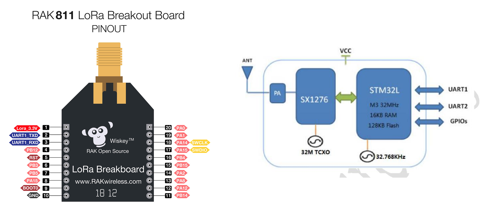
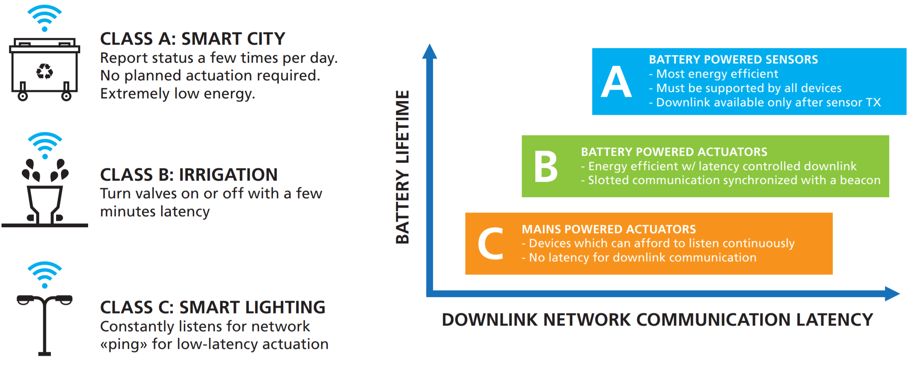

>[Torna all'indice generale](index.md)
## **Gateways per reti di sensori con modem LoRaWan HW con il modulo RAK811**
BUS cablato:
1. [Dallas](lorawanswdallas.md)
2. [I2C](gatewayi2clorasw.md)
3. [SPI](gatewayspi.md)
4. [Modbus](gatewaymodbus.md)

Stella cablato (punto-punto):
1. [Analogico](loraswgatewayanalogico.md)
2. [Digitale](loraswgatewaydigitale.md)

Radio punto-punto:
1. [Analogico](gatewayradioa.md)
2. [Digitale](gatewayradiod.md)


Per una discussione sintetica di tutti i tipi di BUS semplici dal punto di vista generale si rimanda a [Cablati semplici](cablatisemplici.md ).

### **La scheda LoRa RAK811**


E' un modem Lora che implementa esclusivamente il **livello fisico** dello stack LoraWan spesso indicato semplicemente come **LoRa**. Sopra di esso può essere utilizzato lo **stack applicativo LoRawan** oppure un qualsiasi altro stack (ad es. **6LowPan e REPL**). 

In ogni caso, le funzioni di **rete** ed **applicative** al di sopra del livello fisico, con il **chip RMF95/W**M vanno implementate in SW mediante apposite **librerie**. Se si vuole un **modem** che implementi **in HW** tutto lo **stack LoraWan** si guardi il modulo **Microchip RN2483**.

### **Schema cablaggio**



La lunghezza del filo dipende dalla frequenza:
- 868 MHz: 86,3 mm 
- 915 MHz: 81,9 mm
- 433 MHz: 173,1 mm

Per il nostro modulo dobbiamo utilizzare un filo da 86,3 mm saldato direttamente al pin ANA del ricetrasmettitore. Si noti che l'utilizzo di un'antenna adeguata estenderà il raggio di comunicazione.

### **Classi di servizio**

**Classe A**

La **trasmissione** del nodo in uplink è **asincrona** cioè i messaggi, dal nodo al gateway, possono essere inviati in qualsiasi momento. 

Dopo la trasmissione il nodo apre **due finestre di ricezione**. Il Network server **può rispondere** tramite un gateway con un messaggio in Downlink in una delle due finestre. Solitamente **la prima** finestra è aperta sullo stesso canale utilizzato nella trasmissione in Uplink, mentre **la seconda** finestra viene aperta su un canale differente, accordato in precedenza con il Network Server, per migliorare la resistenza alle interferenze.

**Classe B**

**Periodicamente**, ogni 128 secondi, un **nodo** riceve dal **gateway** un beacon per la **sincronizzazione** (tra nodo e gateway) e per la **schedulazione** delle ricezioni. Un **pacchetto beacon** contiene uno specifico tempo di riferimento in cui far aprire ai nodi della rete una **finestra di ricezione extra**, chiamata **ping slot**. In pratica è una multiplazione TDMA con cui, ad ogni beacon, il network server riserva uno slot temporale ai vari nodi afferenti ad un certo gateway. La posizione dello slot, nella trama tra un beacon e l'altro, viene ricalcolata ad ogni nuovo beacon per evitare errori di ricezione **sistematici**. 

La ricezione è affetta da una **latenza** piuttosto variabile e potenzialmente elevata. In compenso, il **consumo** è ancora puttosto ridotto perchè, ad ogni trama, la finestra di ricezione è una sola e molto breve.

La **trasmissione** in uplink, analogamente alla classe A, è ancora asincrona.

**Classe C**

La **finestra** di ricezione, quando il nodo non trasmette, è **sempre aperta** per cui la trasmissione in downlink da parte del network server può avvenire, in maniera completamente **asincrona**, in qualsiasi momento. La finestra di ricezione è **chiusa** soltanto durante la trasmissione. In questa modalità la **latenza** è minima ma il **consumo** è massimo per cui si tratta di un modo di funzionamento adatto a dispositivi perennemente connessi ad una fonte di **alimentazione persistente** (rete elettrica, panneli solari).

**ALOHA**

In tutte le classi l'**accesso multiplo** al canale in **uplink** è un TDM a contesa random di tipo **ALOHA**.



### **Modi di autenticazione**

**Attivazione via etere (OTAA)**

L'**attivazione over-the-air (OTAA)** è il modo preferito e più sicuro per connettersi con The Things Network. I dispositivi eseguono una procedura di unione con la rete (join), durante la quale viene assegnato un **DevAddr** dinamico e le **chiavi** di sicurezza vengono **negoziate** con il dispositivo.

**Attivazione tramite personalizzazione (ABP)**

In alcuni casi potrebbe essere necessario codificare il **DevAddr** e le **chiavi di sicurezza** hardcoded nel dispositivo. Ciò significa attivare un dispositivo **tramite personalizzazione (ABP)**. Questa strategia potrebbe sembrare più semplice, perché si salta la procedura di adesione, ma presenta alcuni svantaggi legati alla sicurezza.

**ABP vs OTAA**

In generale, non ci sono inconvenienti nell'utilizzo dell'OTAA rispetto all'utilizzo dell'ABP, ma ci sono alcuni requisiti che devono essere soddisfatti quando si utilizza l'OTAA.La specifica LoRaWAN avverte in modo specifico contro il ricongiungimento sistematico in caso di guasto della rete. Un dispositivo dovrebbe conservare il risultato di un'attivazione in una memoria permanente se si prevede che il dispositivo venga spento e riacceso durante la sua vita:
- un dispositivo ABP utilizza una memoria non volatile per mantenere i contatori di frame tra i riavvii. 
- Un approccio migliore sarebbe passare all'utilizzo di OTAA e memorizzare la sessione OTAA anziché i contatori di frame.

L'unica cosa da tenere a mente è che un join OTAA richiede che il dispositivo finale si trovi all'interno della copertura della rete su cui è registrato. La ragione di ciò è che la procedura di join OTAA richiede che il dispositivo finale sia in grado di ricevere il messaggio di downlink Join Accept dal server di rete.

Un approccio migliore consiste nell'eseguire un join OTAA in una fabbrica o in un'officina in cui è possibile garantire la copertura di rete e i downlink funzionanti. Non ci sono svantaggi in questo approccio finché il dispositivo segue le migliori pratiche LoRaWAN (https://www.thethingsindustries.com/docs/devices/best-practices/).

### **Buone pratiche**

**Connessioni confermate**

È possibile che non si riceva subito un ACK per ogni uplink o downlink di tipo confermato. Una buona regola empirica è attendere almeno tre ACK mancati per presumere la perdita del collegamento.

In caso di perdita del collegamento, procedere come segue:
- Imposta la potenza TX al massimo consentito/supportato e riprova
- Diminuisci gradualmente la velocità dei dati e riprova
- Ripristina i canali predefiniti e riprova
- Invia richieste di adesione periodiche con backoff

**Cicli di alimentazione**

I dispositivi dovrebbero salvare i parametri di rete tra i cicli di alimentazione regolari. Ciò include parametri di sessione come DevAddr, chiavi di sessione, FCnt e nonces. Ciò consente al dispositivo di unirsi facilmente, poiché chiavi e contatori rimangono sincronizzati.

### **Architettura di riferimento per IoT**

L'**architettura tipica del SW** a bordo di un dispositivo IoT è riassumibile:


Il **middleware** in genere è composto da **librerie di terze parti** da **compilare** all'interno di un **IDE** (ad es. Arduino) o all'interno di un **SDK** cioè un pacchetto di sviluppo per applicazioni che fornisce vari strumenti per compilazione, debug e documentazione (ad es. AWS IoT, Azure IoT, ESP-IDF). Oppure esistono **framework** specifici per IoT Open Source come RIOT che, una volta compilati su una macchina Linux, forniscono veri e propri **SO per IoT** con esattamente ciò che serve per la **comunicazione** di un certo dispositivo.

### **Librerie del progetto**

In questo caso gran parte delle funzioni del middleware, quelle relative alla comunicazione via stack LoRaWan, è implementato all'interno del sistema a microprocessore (MCU). Nello specifico, le funzioni di livello applicativo, che in ambito IoT, sono tutte quelle comprese tra il livello 2 e il livello 7 ISO/OSI sono compito della MCU mentre il livello fisico è realizzato in HW dal chip del modem.

Dal **punto di vista SW** seve **4 librerie** da scaricare dentro la solita cartella **libraries**:
- **Arduino-RAK811-Library**. Si scarica da https://github.com/RAKWireless/WisNode-Arduino-Library come WisNode-Arduino-Library-master.zip, poi si  scompatta in una cartella sul desktop da cui si copia la cartella **Arduino-RAK811-Librarye** che va messa nela libraries dell'IDE di Arduino.

La libreria dovrebbero supportare solamente le classi di servizio A e B (C esclusa).

**Gestione della ricezione**

Per ricevere LMIC si unisce alla rete tramite un **join** e **ascolta ripetutamente** i dati in **downlink**. Questo è ottenuto abilitando la **modalità ping**. La chiamata a **LMIC_setPingable()** imposta la modalità ping localmente e avvia la **scansione dei beacon**. Una volta che il primo beacon è stato trovato, è necessario inviare in uplink un frame di configurazione (in questo caso un frame vuoto tramite LMIC_sendAlive()) per trasportare le **opzioni MAC** e per notificare al server la **modalità ping** e il suo **intervallo**. Ogni volta che il server invia, in uno degli slot di ricezione, un dato in downlink, l'evento **EV_RXCOMPLETE** viene attivato e i dati ricevuti possono essere valutati nel campo **frame** del **struttura LMIC**. Il codice di esempio registra i dati ricevuti sulla console e, nel caso speciale quando viene ricevuto esattamente un byte, pilota il LED in base al valore ricevuto.


Quando viene ricevuto EV_TXCOMPLETE o EV_RXCOMPLETE, il codice di elaborazione dell'evento dovrebbe controllare se ci sono dati in ricezione (downlink) ed eventualmente passarli all'applicazione. Per fare ciò, si usa un codice come il seguente:

### **Gateway LoraWan con OTAA join**

Si trova, assieme ad altri esempi, nella cartella al link https://github.com/oktavianabd/arduino-lmic/tree/master/examples

Al termine di una trasmissione, indicato dall'evento ```EV_TXCOMPLETE```viene pianficata una nuova trasmissione tramite```os_setTimedCallback(&sendjob, os_getTime()+sec2osticks(TX_INTERVAL), do_send)``` dopo un tempo ```TX_INTERVAL```.

La funzione ```os_runloop_once()``` riserva un quanto di tempo allo scheduler dei job della connessione LoRaWan. Una trasmissione LoraWan però potrebbe non essere completata in un solo quanto per cui potrebbero essere necessari parecchi loop() per completarla. Quest'ultima considerazione chiarisce che è importante non inserire delay() o istruzioni molto lente dopo una chiamata a ```os_runloop_once()``` perchè una lunga interruzione del processo di trasmissione potrebbe portare ad una perdita di dati.

Tuttavia, durante la trasmissione di un messaggio, è fondamentale assicurarsi che ```os_runloop_once()``` venga chiamato frequentemente prima delle scadenze rigide. L'API ```os_queryTimeCriticalJobs()``` può essere utilizzata per verificare se sono previste scadenze a breve. Prima di eseguire un job che richiede n millisecondi, si può chiamare ```os_queryTimeCriticalJobs(ms2osticks(n))``` e saltare il job se l'API indica che LMIC richiede attenzione.

```C++

```

### **Gateway LoraWan con OTAA join e deepSleep**


```C++

```

### **Sitografia:**

- https://www.semiconductorstore.com/pdf/Migrating-Sensor-Design-LoRaWAN-WhitePaper_FINAL.pdf
- https://www.ictpower.it/tecnologia/lora-nozioni-di-base-e-approfondimenti.htm
- https://github.com/RAKWireless/WisNode-Arduino-Library
- https://github.com/RAKWireless/WisNode-Arduino-Library
- https://github.com/stm32duino
- https://www.arduinolibraries.info/architectures/stm32


>[Torna all'indice generale](index.md)


