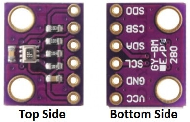

>[Torna a gateway LoraWan con modem HW](gatewayi2clorahw.md)

## **Gateway per BME280**

### **Sensore di temperatura, umidità e pressione BME280**



### **Esempio di cablaggio**


### **Librerie del progetto**

Dal **punto di vista SW** seve **4 librerie** da scaricare dentro la solita cartella **libraries**:
- **adafruit bme280**. Si scarica da https://github.com/adafruit/Adafruit_BME280_Library come Adafruit_BME280_Library-master.zip da scompattare e rinominare semplicemente come **Adafruit_BME280_Library**
- **Adafruit Unified Sensor**. Si scarica da https://github.com/adafruit/Adafruit_Sensor come Adafruit_Sensor-master.zip da scompattare e rinominare semplicemente come **Adafruit_Sensor**

### **Gateway I2C-BME280 con modem RAK811**

```C++
/*
 * Author: JP Meijers
 * Date: 2016-10-20
 *
 * Transmit a one byte packet via TTN. This happens as fast as possible, while still keeping to
 * the 1% duty cycle rules enforced by the RN2483's built in LoRaWAN stack. Even though this is
 * allowed by the radio regulations of the 868MHz band, the fair use policy of TTN may prohibit this.
 *
 * CHECK THE RULES BEFORE USING THIS PROGRAM!
 *
 * CHANGE ADDRESS!
 * Change the device address, network (session) key, and app (session) key to the values
 * that are registered via the TTN dashboard.
 * The appropriate line is "myLora.initABP(XXX);" or "myLora.initOTAA(XXX);"
 * When using ABP, it is advised to enable "relax frame count".
 *
 * Connect the RN2xx3 as follows:
 * RN2xx3 -- ESP8266
 * Uart TX -- GPIO4
 * Uart RX -- GPIO5
 * Reset -- GPIO15
 * Vcc -- 3.3V
 * Gnd -- Gnd
 *
 */
#include <rn2xx3.h>
#include <SoftwareSerial.h>
#include <Adafruit_BME280.h>

#define RESET 15
//sensors defines
SoftwareSerial mySerial(4, 5); // RX, TX !! labels on relay board is swapped !!
//create an instance of the rn2xx3 library,
//giving the software UART as stream to use,
//and using LoRa WAN
rn2xx3 myLora(mySerial);
// Setup the one wire connection on pin 10
Adafruit_BME280 bme280;

void inline sensorsInit() {
	bme280.begin();
}

void inline readSensorsAndTx() {
	// Split both words (16 bits) into 2 bytes of 8
	byte payload[6];
	// Get temperature event and print its value.
	
	uint16_t temperature = bme280.readTemperature();
	if (temperature) {
		payload[0] = highByte(temperature);
		payload[1] = lowByte(temperature);
	} else {
		Serial.println("Error reading temperature!");
	}

	// Get pressure event and print its value.
	uint16_t pressure = bme280.readPressure() / 100.0F;
	if (pressure) {
		payload[2] = highByte(pressure);
		payload[3] = lowByte(pressure);
	} else {
		Serial.println("Error reading pressure!");
	}

	// Get humidity and print its value.
	uint16_t humidity = bme280.readHumidity();
	if (humidity) {
		payload[4] = highByte(humidity);
		payload[5] = lowByte(humidity);
	} else {
		Serial.println("Error reading humidity!");
	}
	Serial.print("Temperature: ");
	Serial.println(temperature);

	//myLora.tx("!"); //send String, blocking function
	myLora.txBytes(payload, sizeof(payload)); // blocking function
}

// the setup routine runs once when you press reset:
void setup() {
  // LED pin is GPIO2 which is the ESP8266's built in LED
  pinMode(2, OUTPUT);
  led_on();

  // Open serial communications and wait for port to open:
  Serial.begin(57600);
  mySerial.begin(57600);
  
  sensorsInit();
  
  delay(1000); //wait for the arduino ide's serial console to open

  Serial.println("Startup");

  initialize_radio();

  //transmit a startup message
  myLora.tx("TTN Mapper on ESP8266 node");

  led_off();

  delay(2000);
}

void initialize_radio()
{
  //reset RN2xx3
  pinMode(RESET, OUTPUT);
  digitalWrite(RESET, LOW);
  delay(100);
  digitalWrite(RESET, HIGH);

  delay(100); //wait for the RN2xx3's startup message
  mySerial.flush();

  //check communication with radio
  String hweui = myLora.hweui();
  while(hweui.length() != 16)
  {
    Serial.println("Communication with RN2xx3 unsuccessful. Power cycle the board.");
    Serial.println(hweui);
    delay(10000);
    hweui = myLora.hweui();
  }

  //print out the HWEUI so that we can register it via ttnctl
  Serial.println("When using OTAA, register this DevEUI: ");
  Serial.println(hweui);
  Serial.println("RN2xx3 firmware version:");
  Serial.println(myLora.sysver());

  //configure your keys and join the network
  Serial.println("Trying to join TTN");
  bool join_result = false;

  //ABP: initABP(String addr, String AppSKey, String NwkSKey);
  join_result = myLora.initABP("02017201", "8D7FFEF938589D95AAD928C2E2E7E48F", "AE17E567AECC8787F749A62F5541D522");

  //OTAA: initOTAA(String AppEUI, String AppKey);
  //join_result = myLora.initOTAA("70B3D57ED00001A6", "A23C96EE13804963F8C2BD6285448198");

  while(!join_result)
  {
    Serial.println("Unable to join. Are your keys correct, and do you have TTN coverage?");
    delay(60000); //delay a minute before retry
    join_result = myLora.init();
  }
  Serial.println("Successfully joined TTN");

}

// the loop routine runs over and over again forever:
void loop() {
    led_on();
    
    readSensorsAndTx();
	
    led_off();
    delay(200);
}

void led_on()
{
  digitalWrite(2, 1);
}

void led_off()
{
  digitalWrite(2, 0);
}

```
**Sitografia:**
- https://randomnerdtutorials.com/esp32-mqtt-publish-bme280-arduino/
- https://learn.adafruit.com/i2c-addresses


>[Torna a gateway LoraWan con modem HW](gatewayi2clorahw.md)
