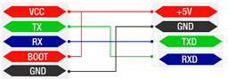

>[Torna all'indice generale](index.md)
## **Gateways per reti di sensori con modem LoRaWan SW con il modulo RAK811**
BUS cablato:
1. [Dallas](lorawanswdallas.md)
2. [I2C](gatewayi2clorasw.md)
3. [SPI](gatewayspi.md)
4. [Modbus](gatewaymodbus.md)

Stella cablato (punto-punto):
1. [Analogico](loraswgatewayanalogico.md)
2. [Digitale](loraswgatewaydigitale.md)

Radio punto-punto:
1. [Analogico](gatewayradioa.md)
2. [Digitale](gatewayradiod.md)


Per una discussione sintetica di tutti i tipi di BUS semplici dal punto di vista generale si rimanda a [Cablati semplici](cablatisemplici.md ).

### **La scheda LoRa RAK811**


E' un **modem** che implementa **in HW** tutto lo **stack LoraWan** ed è configurabile via seriale mediante i comandi AT.

Il modulo di breakout LPWAN RAK811 fornisce: scheda con terminali + transceiver Semtech SX1276 + MCU STM32L151.  

E' utilizzabile:
- come **modem HW** accessibile via UART tramite ccomandi AT gestibili anche tramite una libreria per Arduino. Sia i comandi AT che la libreria permettono l'accesso ai GPIO di cui è dotata tramite un'intestazione aggiuntiva ai messaggi. Il vantaggio di questa configurazione è che il codice della MCU risulta non appesatito dall'implementazione dell'intero stack protocollare LoRaWan e quindi con più risorse disponibili da dedicare alla logica dell'applicazione.
- come **MCU** su cui caricare il FW con lo **stack** LoRaWan **completo** (**LMIC**) oppure un FW con uno **stack** di comunicazione **minimale** per la modalità **P2P** tra **coppie** di dispositivi. Il vantaggio di questa configurazione è che un nodo **non ha** bisogno di **MCU aggiuntive** per gestire la **logica** dell'applicazione con conseguente risparmio di dimensioni e consumi.

In questa scheda vedremo la versione **standalone** in cui si programma la MCU per inserire sia lo stack LoRaWAn LMIC che la logica dell'applicazione che governa l'accesso alle porte.

### **Schema cablaggio**


All'interno del codice del programma vanno impostati i pin del transceiver. In RAK811 sono interni al chip e non devono mai cambiare:

```C++
// Pin mapping
const lmic_pinmap lmic_pins = {
    .nss = 26,
    .rxtx = 32,
    .rst = 21,
    .dio = {27, 28, 29},
};
```

In realtà il cablaggio serve a collegare sensori e alimentazione. Transceiver e MCU sono entrambi contenuti in un unico chip. Il problema principale adesso è collegare la UART alla presa USB di un PC per consentire il caricamento del FW compilato dall'IDE Arduino.




### **Classi di servizio**

**Classe A**

La **trasmissione** del nodo in uplink è **asincrona** cioè i messaggi, dal nodo al gateway, possono essere inviati in qualsiasi momento. 

Dopo la trasmissione il nodo apre **due finestre di ricezione**. Il Network server **può rispondere** tramite un gateway con un messaggio in Downlink in una delle due finestre. Solitamente **la prima** finestra è aperta sullo stesso canale utilizzato nella trasmissione in Uplink, mentre **la seconda** finestra viene aperta su un canale differente, accordato in precedenza con il Network Server, per migliorare la resistenza alle interferenze.

**Classe B**

**Periodicamente**, ogni 128 secondi, un **nodo** riceve dal **gateway** un beacon per la **sincronizzazione** (tra nodo e gateway) e per la **schedulazione** delle ricezioni. Un **pacchetto beacon** contiene uno specifico tempo di riferimento in cui far aprire ai nodi della rete una **finestra di ricezione extra**, chiamata **ping slot**. In pratica è una multiplazione TDMA con cui, ad ogni beacon, il network server riserva uno slot temporale ai vari nodi afferenti ad un certo gateway. La posizione dello slot, nella trama tra un beacon e l'altro, viene ricalcolata ad ogni nuovo beacon per evitare errori di ricezione **sistematici**. 

La ricezione è affetta da una **latenza** piuttosto variabile e potenzialmente elevata. In compenso, il **consumo** è ancora puttosto ridotto perchè, ad ogni trama, la finestra di ricezione è una sola e molto breve.

La **trasmissione** in uplink, analogamente alla classe A, è ancora asincrona.

**Classe C**

La **finestra** di ricezione, quando il nodo non trasmette, è **sempre aperta** per cui la trasmissione in downlink da parte del network server può avvenire, in maniera completamente **asincrona**, in qualsiasi momento. La finestra di ricezione è **chiusa** soltanto durante la trasmissione. In questa modalità la **latenza** è minima ma il **consumo** è massimo per cui si tratta di un modo di funzionamento adatto a dispositivi perennemente connessi ad una fonte di **alimentazione persistente** (rete elettrica, panneli solari).

**ALOHA**

In tutte le classi l'**accesso multiplo** al canale in **uplink** è un TDM a contesa random di tipo **ALOHA**.


### **Modi di autenticazione**

**Attivazione via etere (OTAA)**

L'**attivazione over-the-air (OTAA)** è il modo preferito e più sicuro per connettersi con The Things Network. I dispositivi eseguono una procedura di unione con la rete (join), durante la quale viene assegnato un **DevAddr** dinamico e le **chiavi** di sicurezza vengono **negoziate** con il dispositivo.

**Attivazione tramite personalizzazione (ABP)**

In alcuni casi potrebbe essere necessario codificare il **DevAddr** e le **chiavi di sicurezza** hardcoded nel dispositivo. Ciò significa attivare un dispositivo **tramite personalizzazione (ABP)**. Questa strategia potrebbe sembrare più semplice, perché si salta la procedura di adesione, ma presenta alcuni svantaggi legati alla sicurezza.

**ABP vs OTAA**

In generale, non ci sono inconvenienti nell'utilizzo dell'OTAA rispetto all'utilizzo dell'ABP, ma ci sono alcuni requisiti che devono essere soddisfatti quando si utilizza l'OTAA.La specifica LoRaWAN avverte in modo specifico contro il ricongiungimento sistematico in caso di guasto della rete. Un dispositivo dovrebbe conservare il risultato di un'attivazione in una memoria permanente se si prevede che il dispositivo venga spento e riacceso durante la sua vita:
- un dispositivo ABP utilizza una memoria non volatile per mantenere i contatori di frame tra i riavvii. 
- Un approccio migliore sarebbe passare all'utilizzo di OTAA e memorizzare la sessione OTAA anziché i contatori di frame.

L'unica cosa da tenere a mente è che un join OTAA richiede che il dispositivo finale si trovi all'interno della copertura della rete su cui è registrato. La ragione di ciò è che la procedura di join OTAA richiede che il dispositivo finale sia in grado di ricevere il messaggio di downlink Join Accept dal server di rete.

Un approccio migliore consiste nell'eseguire un join OTAA in una fabbrica o in un'officina in cui è possibile garantire la copertura di rete e i downlink funzionanti. Non ci sono svantaggi in questo approccio finché il dispositivo segue le migliori pratiche LoRaWAN (https://www.thethingsindustries.com/docs/devices/best-practices/).

### **Buone pratiche**

**Connessioni confermate**

È possibile che non si riceva subito un ACK per ogni uplink o downlink di tipo confermato. Una buona regola empirica è attendere almeno tre ACK mancati per presumere la perdita del collegamento.

In caso di perdita del collegamento, procedere come segue:
- Imposta la potenza TX al massimo consentito/supportato e riprova
- Diminuisci gradualmente la velocità dei dati e riprova
- Ripristina i canali predefiniti e riprova
- Invia richieste di adesione periodiche con backoff

**Cicli di alimentazione**

I dispositivi dovrebbero salvare i parametri di rete tra i cicli di alimentazione regolari. Ciò include parametri di sessione come DevAddr, chiavi di sessione, FCnt e nonces. Ciò consente al dispositivo di unirsi facilmente, poiché chiavi e contatori rimangono sincronizzati.

### **Architettura di riferimento per IoT**

L'**architettura tipica del SW** a bordo di un dispositivo IoT è riassumibile:


Il **middleware** in genere è composto da **librerie di terze parti** da **compilare** all'interno di un **IDE** (ad es. Arduino) o all'interno di un **SDK** cioè un pacchetto di sviluppo per applicazioni che fornisce vari strumenti per compilazione, debug e documentazione (ad es. AWS IoT, Azure IoT, ESP-IDF). Oppure esistono **framework** specifici per IoT Open Source come RIOT che, una volta compilati su una macchina Linux, forniscono veri e propri **SO per IoT** con esattamente ciò che serve per la **comunicazione** di un certo dispositivo.

### **Librerie del progetto**

In questo caso gran parte delle funzioni del middleware, quelle relative alla comunicazione via stack LoRaWan, è implementato all'interno del sistema a microprocessore (MCU). Nello specifico, le funzioni di livello applicativo, che in ambito IoT, sono tutte quelle comprese tra il livello 2 e il livello 7 ISO/OSI sono compito della MCU mentre il livello fisico è realizzato in HW dal chip del modem.

L'installazione di SDK, loader e librerie in Arduino si può fare seguendo, nell'ordine, le seguenti fasi:
1. RAK811 è basato su STM32L151. Pertanto va installato SDK **Arduino Core per Arduino_Core_STM32**.
https://github.com/stm32duino/Arduino_Core_STM32. Per far ciò bisogna aggiungre alla fine della lista su url aggiuntive per il gestore schede: "https://github.com/stm32duino/BoardManagerFiles/raw/master/STM32/package_stm_index.json"


2. Andare su **strumenti/gestione** librerie e installare la libreria **STM32 Core**:


3. Selezionare la scheda **Lora Board**:


3. Andare su **strumenti/Board part number** librerie e selezionare il BSP (Arduino Board Support) **RAK811 Lora Tracker** 

5. Scaricare e installare STM32CubeIDE. Per poter utilizzare un STM32 con l'ambiente Arduino, si deve installare lo strumento STM32CubeIDE, che è disponibile al link https://www.st.com/en/development-tools/stm32cubeide.html.
6. In Strumenti > Metodo di caricamento: scegliere **STM32CubeProgrammer (SWD)**


**Jobs di un'applicazione**

In questo modello tutto il codice dell'applicazione viene eseguito nei cosiddetti job che vengono eseguiti sul thread principale dallo **schedulatore** dei task run-time **os_runloop()**. Questi lavori di applicazione sono codificati come normali funzioni C e possono essere gestiti a run-time utilizzando apposite funzioni.

Per la **gestione dei jobs** è necessario un **descrittore** del job **osjob_t** che identifica il job e
memorizza le informazioni di **contesto**. I lavori **non** devono essere di **lunga durata** per garantire un funzionamento **senza interruzioni**. Dovrebbero solo **aggiornare lo stato** e **pianificare le azioni**, che attiveranno nuovi **job** o **callback** di eventi.

**Tempi del sistema operativo**

**LMIC** utilizza valori del tipo **```ostime_t```** per rappresentare il tempo in **tick**. Il **rate** di questi tick è predefinito
a 32768 tick al secondo, ma può essere configurato in fase di compilazione su qualsiasi valore compreso tra 10000 tick al secondo e 64516 tic al secondo.

**Loop di eventi principale**

Tutto ciò che un'applicazione deve fare è inizializzare l'ambiente di runtime utilizzando **os_init()** o
**os_init_ex()** e quindi chiama periodicamente la funzione di pianificazione dei lavori (schedulatore) **os_runloop_once()**. Per avviare le azioni del protocollo e generare eventi, è necessario impostare un lavoro iniziale. Pertanto, un job di avvio (startup job) è schedulato (pianificato) utilizzando la funzione **os_setCallback()**.

La libreria dovrebbero supportare solamente le classi di servizio A e B (C esclusa).

```C++
osjob_t initjob;
void setup () {
 // initialize run-time env
 os_init();
 // setup initial job
 os_setCallback(&initjob, initfunc);
}
void loop () {
 // execute scheduled jobs and events
 os_runloop_once();
}
```
Il codice di avvio mostrato nella funzione **```initfunc()```** di seguito inizializza il MAC ed esegue il Join alla
rete LoraWan:
```C++
// initial job
static void initfunc (osjob_t* j) {
 // reset MAC state
 LMIC_reset();
 // start joining
 LMIC_startJoining();
 // init done - onEvent() callback will be invoked...
}
```
La funzione **```initfunc()```** non è bloccante ma ritorna immediatamente e lo stato della connessione verrà notificato quando verrà chiamata la funzione di callback **```onEvent()```**. La notifica avviene tramite gli eventi: ```EV_JOINING**```, ```EV_JOINED``` o ```EV_JOIN_FAILED```.


**Callback onEvent()**

Questa funzione di callback può reagire a determinati eventi e attivare nuove azioni in base all'**evento** e allo **stato** della connessione. Tipicamente, un'applicazione non elabora tutti gli eventi ma solo quelli a cui è interessata e pianifica (schedula) ulteriori azioni del protocollo utilizzando le API di LMIC. 

Gli eventi possibili sono:
- EV_JOINING
Il nodo ha iniziato a unirsi alla rete.
- EV_JOINED
Il nodo si è unito con successo alla rete ed è ora pronto per gli scambi di dati.
- EV_JOIN_FAILED
Il nodo non è stato in grado di unirsi alla rete (dopo aver riprovato).
- EV_REJOIN_FAILED
Il nodo non si è unito a una nuova rete ma è ancora connesso alla vecchia rete.
- EV_TXCOMPLETE
I dati preparati tramite LMIC_setTxData() sono stati inviati e la finestra di ricezione per
il downlink è completa. Se era stata richiesta una conferma, allora questa è stata
ricevuta. Durante la gestione di questo evento, il codice dovrebbe anche verificare la ricezione dei dati. 
- EV_RXCOMPLETE Solo classe B: è stato ricevuto un downlink in uno slot ping. Il codice dovrebbe controllare i dati di ricezione. 
- EV_SCAN_TIMEOUT Dopo una chiamata a LMIC_enableTracking() non è stato ricevuto alcun beacon entro l'intervallo di beacon.
Il monitoraggio deve essere riavviato.
- EV_BEACON_FOUND Dopo una chiamata a LMIC_enableTracking() il primo beacon è stato ricevuto all'interno dell'intervallo di beacon .
- EV_BEACON_TRACKED Il prossimo segnale è stato ricevuto all'ora prevista.
- EV_BEACON_MISSED Nessun segnale è stato ricevuto all'ora prevista.
- EV_LOST_TSYNC Il segnale è stato perso ripetutamente e la sincronizzazione dell'ora è andata persa. Il onitoraggio o ping deve essere riavviato.
- EV_RESET Ripristino della sessione a causa del rollover dei contatori di sequenza. La rete verrà riconnessa automaticamente a acquisire nuova sessione.
- EV_LINK_DEAD Nessuna conferma è stata ricevuta dal server di rete per un lungo periodo di tempo.
Le trasmissioni sono ancora possibili ma la loro ricezione è incerta.
- EV_LINK_ALIVE Il collegamento era morto, ma ora è di nuovo vivo.
- EV_LINK_DEAD Nessuna conferma è stata ricevuta dal server di rete per un lungo periodo di tempo.
Le trasmissioni sono ancora possibili, ma la loro ricezione è incerta.
- EV_TXSTART Questo evento viene segnalato appena prima di dire al driver radio di iniziare la trasmissione.
- EV_SCAN_FOUND Questo evento è riservato per uso futuro e non viene mai segnalato.

**Gestione della ricezione**

Per ricevere LMIC si unisce alla rete tramite un **join** e **ascolta ripetutamente** i dati in **downlink**. Questo è ottenuto abilitando la **modalità ping**. La chiamata a **LMIC_setPingable()** imposta la modalità ping localmente e avvia la **scansione dei beacon**. Una volta che il primo beacon è stato trovato, è necessario inviare in uplink un frame di configurazione (in questo caso un frame vuoto tramite LMIC_sendAlive()) per trasportare le **opzioni MAC** e per notificare al server la **modalità ping** e il suo **intervallo**. Ogni volta che il server invia, in uno degli slot di ricezione, un dato in downlink, l'evento **EV_RXCOMPLETE** viene attivato e i dati ricevuti possono essere valutati nel campo **frame** del **struttura LMIC**. Il codice di esempio registra i dati ricevuti sulla console e, nel caso speciale quando viene ricevuto esattamente un byte, pilota il LED in base al valore ricevuto.


Quando viene ricevuto EV_TXCOMPLETE o EV_RXCOMPLETE, il codice di elaborazione dell'evento dovrebbe controllare se ci sono dati in ricezione (downlink) ed eventualmente passarli all'applicazione. Per fare ciò, si usa un codice come il seguente:

```C++
void do_recv(uint8_t  bPort, uint8_t *msg, uint8_t len){
	
}

void onEvent (ev_t ev) {
    switch(ev) {
      // network joined, session established
      case EV_JOINED:
          // enable pinging mode, start scanning...
          // (set local ping interval configuration to 2^1 == 2 sec)
          LMIC_setPingable(1);
          Serial.println("SCANNING...\r\n");
          break;

      // beacon found by scanning
      case EV_BEACON_FOUND:
          // send empty frame up to notify server of ping mode and interval!
          LMIC_sendAlive();
          break;

      // data frame received in ping slot
      case EV_RXCOMPLETE:
          // Any data to be received?
	  if (LMIC.dataLen != 0 || LMIC.dataBeg != 0) {
		 // Data was received. Extract port number if any.
		 u1_t bPort = 0;
		 if (LMIC.txrxFlags & TXRX_PORT)
			bPort = LMIC.frame[LMIC.dataBeg – 1];
		 // Call user-supplied function with port #, pMessage, nMessage;
		 // nMessage might be zero.
		 do_recv(bPort, LMIC.frame + LMIC.dataBeg, LMIC.dataLen);
	  }
      break;    
    }
}
```

### **File di configurazione**

In questo porting LMIC, a differenza di  altri simili,  non va modificato il file src/lmic/config.h per configurare il FW. La configurazione è spostata sul file project_config/lmic_project_config.h. 

Il file imposta:
- selezionare la versione di LoRaWAN 
- Selezione della configurazione della regione LoRaWAN
- Selezione del ricetrasmettitore radio 
- Controllo dell'uso degli interrupt
- Disabilitare PING
- Disabilitare i Beacon
- Abilitazione del supporto orario di rete
- altre variabili più raramente usate

All'interno del codice del programma vanno impostati i pin del transceiver. In RAK811 sono interni al chip e non devono mai cambiare:

```C++
// Pin mapping
const lmic_pinmap lmic_pins = {
    .nss = 26,
    .rxtx = 32,
    .rst = 21,
    .dio = {27, 28, 29},
};
```

### **Gateway LoraWan con OTAA join**

```C++
/*******************************************************************************
 * Copyright (c) 2015 Thomas Telkamp and Matthijs Kooijman
 * Copyright (c) 2018 Terry Moore, MCCI
 *
 * Permission is hereby granted, free of charge, to anyone
 * obtaining a copy of this document and accompanying files,
 * to do whatever they want with them without any restriction,
 * including, but not limited to, copying, modification and redistribution.
 * NO WARRANTY OF ANY KIND IS PROVIDED.
 *
 * This example sends a valid LoRaWAN packet with payload "Hello,
 * world!", using frequency and encryption settings matching those of
 * the The Things Network.
 *
 * This uses OTAA (Over-the-air activation), where where a DevEUI and
 * application key is configured, which are used in an over-the-air
 * activation procedure where a DevAddr and session keys are
 * assigned/generated for use with all further communication.
 *
 * Note: LoRaWAN per sub-band duty-cycle limitation is enforced (1% in
 * g1, 0.1% in g2), but not the TTN fair usage policy (which is probably
 * violated by this sketch when left running for longer)!

 * To use this sketch, first register your application and device with
 * the things network, to set or generate an AppEUI, DevEUI and AppKey.
 * Multiple devices can use the same AppEUI, but each device has its own
 * DevEUI and AppKey.
 *
 * Do not forget to define the radio type correctly in
 * arduino-lmic/project_config/lmic_project_config.h or from your BOARDS.txt.
 *
 *******************************************************************************/

#include <lmic.h>
#include <hal/hal.h>
#include <SPI.h>

// include the DHT22 Sensor Library
#include "DHT.h"
// DHT digital pin and sensor type
#define DHTPIN 10
#define DHTTYPE DHT22
//
// For normal use, we require that you edit the sketch to replace FILLMEIN
// with values assigned by the TTN console. However, for regression tests,
// we want to be able to compile these scripts. The regression tests define
// COMPILE_REGRESSION_TEST, and in that case we define FILLMEIN to a non-
// working but innocuous value.
//

#ifdef COMPILE_REGRESSION_TEST
#define FILLMEIN 0
#else
#warning "You must replace the values marked FILLMEIN with real values from the TTN control panel!"
#define FILLMEIN (#dont edit this, edit the lines that use FILLMEIN)
#endif

// This EUI must be in little-endian format, so least-significant-byte
// first. When copying an EUI from ttnctl output, this means to reverse
// the bytes. For TTN issued EUIs the last bytes should be 0xD5, 0xB3,
// 0x70.
static const u1_t PROGMEM APPEUI[8]={ FILLMEIN };
void os_getArtEui (u1_t* buf) { memcpy_P(buf, APPEUI, 8);}

// This should also be in little endian format, see above.
static const u1_t PROGMEM DEVEUI[8]={ FILLMEIN };
void os_getDevEui (u1_t* buf) { memcpy_P(buf, DEVEUI, 8);}

// This key should be in big endian format (or, since it is not really a
// number but a block of memory, endianness does not really apply). In
// practice, a key taken from ttnctl can be copied as-is.
static const u1_t PROGMEM APPKEY[16] = { FILLMEIN };
void os_getDevKey (u1_t* buf) {  memcpy_P(buf, APPKEY, 16);}

// payload to send to TTN gateway
static uint8_t payload[5];
static osjob_t sendjob;
bool flag_TXCOMPLETE = false;

// Schedule TX every this many seconds (might become longer due to duty
// cycle limitations).
const unsigned TX_INTERVAL = 60;

// Pin mapping
const lmic_pinmap lmic_pins = {
    .nss = 26,
    .rxtx = 32,
    .rst = 21,
    .dio = {27, 28, 29},
};

// init. DHT
DHT dht(DHTPIN, DHTTYPE);

void printHex2(unsigned v) {
    v &= 0xff;
    if (v < 16)
        Serial.print('0');
    Serial.print(v, HEX);
}

void onEvent (ev_t ev) {
    Serial.print(os_getTime());
    Serial.print(": ");
    switch(ev) {
        case EV_JOINED:
            Serial.println(F("EV_JOINED"));
            {
              u4_t netid = 0;
              devaddr_t devaddr = 0;
              u1_t nwkKey[16];
              u1_t artKey[16];
              LMIC_getSessionKeys(&netid, &devaddr, nwkKey, artKey);
              Serial.print("netid: ");
              Serial.println(netid, DEC);
              Serial.print("devaddr: ");
              Serial.println(devaddr, HEX);
              Serial.print("AppSKey: ");
              for (size_t i=0; i<sizeof(artKey); ++i) {
                if (i != 0)
                  Serial.print("-");
                printHex2(artKey[i]);
              }
              Serial.println("");
              Serial.print("NwkSKey: ");
              for (size_t i=0; i<sizeof(nwkKey); ++i) {
                      if (i != 0)
                              Serial.print("-");
                      printHex2(nwkKey[i]);
              }
              Serial.println();
            }
            // Disable link check validation (automatically enabled
            // during join, but because slow data rates change max TX
	        // size, we don't use it in this example.
            LMIC_setLinkCheckMode(0);
            break;
        case EV_TXCOMPLETE:
            Serial.println(F("EV_TXCOMPLETE (includes waiting for RX windows)"));
            if (LMIC.txrxFlags & TXRX_ACK)
              Serial.println(F("Received ack"));
            if (LMIC.dataLen) {
              Serial.print(F("Received "));
              Serial.print(LMIC.dataLen);
              Serial.println(F(" bytes of payload"));
            }
            // Schedule next transmission
            os_setTimedCallback(&sendjob, os_getTime()+sec2osticks(TX_INTERVAL), do_send);
	        flag_TXCOMPLETE = true;
            break;
	case EV_LINK_DEAD:
            initLoRaWAN();
	    break;
        default:
            Serial.print(F("Unknown event: "));
            Serial.println((unsigned) ev);
            break;
    }
}

void do_send(osjob_t* j){
    // Check if there is not a current TX/RX job running
    if (LMIC.opmode & OP_TXRXPEND) {
        Serial.println(F("OP_TXRXPEND, not sending"));
    } else {
        // Prepare upstream data transmission at the next possible time.
        // read the temperature from the DHT22
        float temperature = dht.readTemperature();
        Serial.print("Temperature: "); Serial.print(temperature);
        Serial.println(" *C");
        // adjust for the f2sflt16 range (-1 to 1)
        temperature = temperature / 100;
        // float -> int
        // note: this uses the sflt16 datum (https://github.com/mcci-catena/arduino-lmic#sflt16)
        uint16_t payloadTemp = LMIC_f2sflt16(temperature);
        // int -> bytes
        byte tempLow = lowByte(payloadTemp);
        byte tempHigh = highByte(payloadTemp);
        // place the bytes into the payload
        payload[0] = tempLow;
        payload[1] = tempHigh;   

        // prepare upstream data transmission at the next possible time.
        // transmit on port 1 (the first parameter); you can use any value from 1 to 223 (others are reserved).
        // don't request an ack (the last parameter, if not zero, requests an ack from the network).
        // Remember, acks consume a lot of network resources; don't ask for an ack unless you really need it.
        LMIC_setTxData2(1, payload, sizeof(payload)-1, 0);
        Serial.println(F("Packet queued"));
    }
    // Next TX is scheduled after TX_COMPLETE event.
}

void initLoRaWAN() {
	// LMIC init
	os_init();

	// Reset the MAC state. Session and pending data transfers will be discarded.
	LMIC_reset();

	// by joining the network, precomputed session parameters are be provided.
	//LMIC_setSession(0x1, DevAddr, (uint8_t*)NwkSkey, (uint8_t*)AppSkey);

	// Enabled data rate adaptation
	LMIC_setAdrMode(1);

	// Enable link check validation
	LMIC_setLinkCheckMode(0);

	// Set data rate and transmit power
	LMIC_setDrTxpow(DR_SF7, 21);
}

void sensorInit(){
	// Initialize the DHT sensor.
	dht.begin();
}

void setup() {
    Serial.begin(9600);
    Serial.println(F("Starting"));

    #ifdef VCC_ENABLE
    // For Pinoccio Scout boards
    pinMode(VCC_ENABLE, OUTPUT);
    digitalWrite(VCC_ENABLE, HIGH);
    delay(1000);
    #endif

   // Setup LoRaWAN state
	initLoRaWAN();
	
	sensorInit();

    // Start job (sending automatically starts OTAA too)
    do_send(&sendjob);
}

void loop() {
	os_runloop_once();
	/* In caso di instabilità
	//Run LMIC loop until he as finish
	while(flag_TXCOMPLETE == false)
	{
		os_runloop_once();
	}
	flag_TXCOMPLETE = false;
	*/
}
```

### **Sleep mode del STM32L in ambiente Arduino**

Le **funzoni di risparmio energetico** della MCU STM32L si possono classificare:

- **Low Power Run**: passa la CPU all'orologio a 131 KHz per risparmiare energia. La corrente è scesa a 6,5uA
- **Modalità di sospensione**: la CPU viene arrestata, la memoria e il registro vengono mantenuti, alcune periferiche rimangono attive.
     - **Modalità di sospensione (Sleep Mode)**: la CPU è ferma ma può essere riattivata da una qualsiasi delle periferiche attive. La corrente è scesa a 400uA @ 16 Mhz a 1 mAh
    - **Modalità di sospensione  a basso consumo (Low Power Sleep Mode)**: la CPU è ferma e le periferiche attive sono limitate e lavorano a frequenza ridotta. Fondamentalmente puoi programmare una sveglia a 32KHz in questa modalità. La corrente è scesa a 3,2uA
- **Modalità di arresto (Stop Mode)**: in modalità di arresto il core della CPU viene arrestato ma la RAM e il registro vengono mantenuti. La maggior parte delle periferiche viene interrotta. Tempo di sveglia: 5uS.
    - **Modalità di arresto con RTC Stop Mode with RTC**: La riattivazione è un segnale esterno o RTC... La corrente è scesa a 0,8uA @ 3V
    - **Modalità di arresto senza RTC (Stop mode w/o RTC)**: Confronta con la modalità precedente l'RTC è fermo. La corrente è scesa a 0,38uA @ 3V
- **Modalità standby**: in modalità standby il core della CPU viene arrestato, i registri e la RAM vengono arrestati. Vengono conservati solo i Registri nel circuito Standby.
    - **Standby con RTC**: Wake-up è esterno o RTC... La corrente è scesa a 0,57uA @ 3V
    - **Standby senza RTC**: Anche l'RTC viene arrestato. La corrente è scesa a 0,26uA @ 3V

Le librerie da integrare nell'IDE di Arduino per includere la gestione del deep sleep sono:
- la libreria **STM32LowPower**. Si scarica da https://github.com/stm32duino/STM32LowPower come STM32LowPower-master.zip, poi si scompatta nela libraries dell'IDE di Arduino come STM32LowPower-master e si rinomina come **STM32LowPower** per completare l'installazione. 
- la libreria **STM32RTC**. Si scarica da https://github.com/stm32duino/STM32RTC come STM32RTC-master.zip, poi si scompatta nela libraries dell'IDE di Arduino come STM32RTC-master e si rinomina come **STM32RTC** per completare l'installazione. 

In che modo le modalità a basso consumo native della MCU si traducono nelle modalità deep sleep della libreria per Arduino si può comprendere esattamente dando uno sguardo al **codice della libreria**.

Potrebbe essere sufficiente la descrizione di base della libreria github:
- **Modalità inattiva (Idle mode)**: bassa latenza di riattivazione (intervallo µs) (es. ARM WFI). Le memorie e le alimentazioni di tensione vengono mantenute. Risparmio energetico minimo principalmente sul core stesso.
- **modalità di sospensione (sleep mode)**: bassa latenza di riattivazione (intervallo di µs) (ad es. ARM WFI), le memorie e le alimentazioni di tensione vengono mantenute. Risparmio energetico minimo principalmente sul core stesso, ma superiore alla modalità inattiva.
- **modalità di sospensione profonda (deep sleep mode)**: latenza media (intervallo ms), gli orologi sono ridotti. Le memorie e le alimentazioni di tensione vengono mantenute. Se supportato, è possibile il risveglio delle periferiche (UART, I2C ...).
- **modalità di spegnimento (shutdown mode)**: latenza di riattivazione elevata (possibili centinaia di ms o un secondo intervallo di tempo), l'alimentazione di tensione viene interrotta tranne il dominio sempre attivo, il contenuto della memoria viene perso e il sistema si riavvia sostanzialmente.

Conviene usare il **deep sleep** quando si ha bisogno di **mantenere la RAM** e lo **spegnimento** se si ha bisogno **solo di RTC** e/o pochi dati salvati nei registri.


### **Gateway LoraWan con OTAA join e deepSleep**


Dopo la segnalazione dell'evento trasmissione completata EV_TXCOMPLETE viene settato il flag GOTO_DEEPSLEEP che comunica al loop il momento buono per andare in deep sleep. 

Nel loop() un if di check controlla se non ci sono operazioni interne di servizio dello schedulatore pendenti. Se esistono operazioni pendenti si pianifica un nuovo check dopo 2 sec, se queste non ci stanno si comanda la discesa del sistema in deep sleep mediante la funzione GoDeepSleep(). Le operazioni (job) ancora pendenti, prima di eseguire un nuovo job che richiede n millisecondi (nello specifico, un deep sleeep), si controllano con ```os_queryTimeCriticalJobs(ms2osticks(n))```.


```C++
void GoDeepSleep()
{
    Serial.println(F("Go DeepSleep"));
    PrintRuntime();
    Serial.flush();
    requestModuleActive(0)
    LowPower.deepSleep((int)TX_INTERVAL * 1000);
}

static void requestModuleActive(bit_t state) {
    ostime_t const ticks = hal_setModuleActive(state);

    if (ticks)
        hal_waitUntil(os_getTime() + ticks);;
}
```
La funzione ```requestModuleActive``` ha il compito di attivare o disattivare il transceiver LoRa a seconda se il parametro fornito vale 1 o 0. La ```requestModuleActive```, usata insieme alla ```LowPower.deepSleep(sec)``` che si occupa di mandare in deep sleep la CPU, contribuisce a minimizzare il consumo di energia del nodo LoraWan a vantaggio della durata della carica di eventuali batterie di alimentazione.

Il sistema però, dopo un wakeup riparte dall'ultima istruzione eseguita, infatti la RAM nel seep sleep dello STM32L rimane accesa per cui i parametri di una eventuale connessione precedentemente stabilita rimangono conservati. Quindi al risveglio non è necessario eseguire nuovamente una join e neppure eseguire salvataggi in memoria RTC delle informazioni di sessione.

```C++
#include <arduino.h>
#include <lmic.h>
#include <hal/hal.h>
#include <SPI.h>
#include <STM32LowPower.h>

// include the DHT22 Sensor Library
#include "DHT.h"
// DHT digital pin and sensor type
#define DHTPIN 10
#define DHTTYPE DHT22

//#include <ttn_credentials.h>
#define TTN_APPEUI {0}
#define TTN_DEVEUI {0}
#define TTN_APPKEY {0}
#define MAX_BANDS 4
//#define CFG_LMIC_EU_like 0

bool GOTO_DEEPSLEEP = false;

// rename ttn_credentials.h.example to ttn_credentials.h and add you keys
static const u1_t PROGMEM APPEUI[8] = TTN_APPEUI;
static const u1_t PROGMEM DEVEUI[8] = TTN_DEVEUI;
static const u1_t PROGMEM APPKEY[16] = TTN_APPKEY;
void os_getArtEui(u1_t *buf) { memcpy_P(buf, APPEUI, 8); }
void os_getDevEui(u1_t *buf) { memcpy_P(buf, DEVEUI, 8); }
void os_getDevKey(u1_t *buf) { memcpy_P(buf, APPKEY, 16); }

static uint8_t payload[5];
static osjob_t sendjob;
bool flag_TXCOMPLETE = false;

// Schedule TX every this many seconds
// Respect Fair Access Policy and Maximum Duty Cycle!
// https://www.thethingsnetwork.org/docs/lorawan/duty-cycle.html
// https://www.loratools.nl/#/airtime
const unsigned TX_INTERVAL = 30;

#define PIN_LMIC_NSS 18
#define PIN_LMIC_RST 14
#define PIN_LMIC_DIO0 26
#define PIN_LMIC_DIO1 33
#define PIN_LMIC_DIO2 32

// Pin mapping
const lmic_pinmap lmic_pins = {
    .nss = 26,
    .rxtx = 32,
    .rst = 21,
    .dio = {27, 28, 29}
};

// init. DHT
DHT dht(DHTPIN, DHTTYPE);

// https://github.com/mcci-catena/arduino-lmic/blob/89c28c5888338f8fc851851bb64968f2a493462f/src/lmic/lmic.h#L233

void PrintRuntime()
{
    long seconds = millis() / 1000;
    Serial.print("Runtime: ");
    Serial.print(seconds);
    Serial.println(" seconds");
}

void PrintLMICVersion()
{
    Serial.print(F("LMIC: "));
    Serial.print(ARDUINO_LMIC_VERSION_GET_MAJOR(ARDUINO_LMIC_VERSION));
    Serial.print(F("."));
    Serial.print(ARDUINO_LMIC_VERSION_GET_MINOR(ARDUINO_LMIC_VERSION));
    Serial.print(F("."));
    Serial.print(ARDUINO_LMIC_VERSION_GET_PATCH(ARDUINO_LMIC_VERSION));
    Serial.print(F("."));
    Serial.println(ARDUINO_LMIC_VERSION_GET_LOCAL(ARDUINO_LMIC_VERSION));
}

void onEvent(ev_t ev)
{
    Serial.print(os_getTime());
    Serial.print(": ");
    switch (ev)
    {
    case EV_SCAN_TIMEOUT:
        Serial.println(F("EV_SCAN_TIMEOUT"));
        break;
    case EV_BEACON_FOUND:
        Serial.println(F("EV_BEACON_FOUND"));
        break;
    case EV_BEACON_MISSED:
        Serial.println(F("EV_BEACON_MISSED"));
        break;
    case EV_BEACON_TRACKED:
        Serial.println(F("EV_BEACON_TRACKED"));
        break;
    case EV_JOINING:
        Serial.println(F("EV_JOINING"));
        break;
    case EV_JOINED:
        Serial.println(F("EV_JOINED"));
        {
            u4_t netid = 0;
            devaddr_t devaddr = 0;
            u1_t nwkKey[16];
            u1_t artKey[16];
            LMIC_getSessionKeys(&netid, &devaddr, nwkKey, artKey);
            Serial.print("netid: ");
            Serial.println(netid, DEC);
            Serial.print("devaddr: ");
            Serial.println(devaddr, HEX);
            Serial.print("artKey: ");
            for (size_t i = 0; i < sizeof(artKey); ++i)
            {
                Serial.print(artKey[i], HEX);
            }
            Serial.println("");
            Serial.print("nwkKey: ");
            for (size_t i = 0; i < sizeof(nwkKey); ++i)
            {
                Serial.print(nwkKey[i], HEX);
            }
            Serial.println("");
        }
        // Disable link check validation (automatically enabled
        // during join, but because slow data rates change max TX
        // size, we don't use it in this example.
        LMIC_setLinkCheckMode(0);
        break;
    /*
        || This event is defined but not used in the code. No
        || point in wasting codespace on it.
        ||
        || case EV_RFU1:
        ||     Serial.println(F("EV_RFU1"));
        ||     break;
        */
    case EV_JOIN_FAILED:
        Serial.println(F("EV_JOIN_FAILED"));
        break;
    case EV_REJOIN_FAILED:
        Serial.println(F("EV_REJOIN_FAILED"));
        break;
    case EV_TXCOMPLETE:
        Serial.println(F("EV_TXCOMPLETE (includes waiting for RX windows)"));
        if (LMIC.txrxFlags & TXRX_ACK)
            Serial.println(F("Received ack"));
        if (LMIC.dataLen)
        {
            Serial.print(F("Received "));
            Serial.print(LMIC.dataLen);
            Serial.println(F(" bytes of payload"));
        }
        GOTO_DEEPSLEEP = true;
        break;
    case EV_LOST_TSYNC:
        Serial.println(F("EV_LOST_TSYNC"));
        break;
    case EV_RESET:
        Serial.println(F("EV_RESET"));
        break;
    case EV_RXCOMPLETE:
        // data received in ping slot
        Serial.println(F("EV_RXCOMPLETE"));
        break;
    case EV_LINK_DEAD:
        Serial.println(F("EV_LINK_DEAD"));
        break;
    case EV_LINK_ALIVE:
        Serial.println(F("EV_LINK_ALIVE"));
        break;
    /*
        || This event is defined but not used in the code. No
        || point in wasting codespace on it.
        ||
        || case EV_SCAN_FOUND:
        ||    Serial.println(F("EV_SCAN_FOUND"));
        ||    break;
        */
    case EV_TXSTART:
        Serial.println(F("EV_TXSTART"));
        break;
    case EV_TXCANCELED:
        Serial.println(F("EV_TXCANCELED"));
        break;
    case EV_RXSTART:
        /* do not print anything -- it wrecks timing */
        break;
    case EV_JOIN_TXCOMPLETE:
        Serial.println(F("EV_JOIN_TXCOMPLETE: no JoinAccept"));
        break;
    default:
        Serial.print(F("Unknown event: "));
        Serial.println((unsigned)ev);
        break;
    }
}

void do_send(osjob_t *j)
{
    // Check if there is not a current TX/RX job running
    if (LMIC.opmode & OP_TXRXPEND)
    {
        Serial.println(F("OP_TXRXPEND, not sending"));
    }
    else
    {
        // Prepare upstream data transmission at the next possible time.
        // read the temperature from the DHT22
        float temperature = dht.readTemperature();
        Serial.print("Temperature: "); Serial.print(temperature);
        Serial.println(" *C");
        // adjust for the f2sflt16 range (-1 to 1)
        temperature = temperature / 100;
        // float -> int
        // note: this uses the sflt16 datum (https://github.com/mcci-catena/arduino-lmic#sflt16)
        uint16_t payloadTemp = LMIC_f2sflt16(temperature);
        // int -> bytes
        byte tempLow = lowByte(payloadTemp);
        byte tempHigh = highByte(payloadTemp);
        // place the bytes into the payload
        payload[0] = tempLow;
        payload[1] = tempHigh;   

        // prepare upstream data transmission at the next possible time.
        // transmit on port 1 (the first parameter); you can use any value from 1 to 223 (others are reserved).
        // don't request an ack (the last parameter, if not zero, requests an ack from the network).
        // Remember, acks consume a lot of network resources; don't ask for an ack unless you really need it.
        LMIC_setTxData2(1, payload, sizeof(payload)-1, 0);
        Serial.println(F("Packet queued"));
    }
    // Next TX is scheduled after TX_COMPLETE event.
}

void GoDeepSleep()
{
    Serial.println(F("Go DeepSleep"));
    PrintRuntime();
    Serial.flush();
    requestModuleActive(0);
    LowPower.deepSleep((int)TX_INTERVAL * 1000);
    requestModuleActive(1);
}

static void requestModuleActive(bit_t state) {
    ostime_t const ticks = hal_setModuleActive(state);

    if (ticks)
        hal_waitUntil(os_getTime() + ticks);;
}


void setup()
{
    Serial.begin(115200);
	// Configure low power
    LowPower.begin();

    Serial.println(F("Starting DeepSleep test"));
    PrintLMICVersion();

    // LMIC init
    os_init();
    requestModuleActive(1);

    // Reset the MAC state. Session and pending data transfers will be discarded.
    LMIC_reset();

    // Start job (sending automatically starts OTAA too)
    do_send(&sendjob);
}

void loop()
{
    static unsigned long lastPrintTime = 0;

    os_runloop_once();

    const bool timeCriticalJobs = os_queryTimeCriticalJobs(ms2osticksRound((TX_INTERVAL * 1000)));
    if (!timeCriticalJobs && GOTO_DEEPSLEEP == true && !(LMIC.opmode & OP_TXRXPEND))
    {
        Serial.print(F("Can go sleep "));
        GoDeepSleep();
    }
    else if (millis() - lastPrintTime > 2000)
    {
        Serial.print(F("Cannot sleep "));
        Serial.print(F("TimeCriticalJobs: "));
        Serial.print(timeCriticalJobs);
        Serial.print(" ");

        PrintRuntime();
        lastPrintTime = millis();
    }
}
```
### **APPENDICE DI CONSULTAZIONE**

 **Funzioni di gestione run-time**

- ```void os_init()``` Inizializza il sistema operativo chiamando os_init_ex(NULL).
- void os_init_ex (const void * pHalData) Per facilitare l'uso di questa libreria su più piattaforme, la routine os_init_ex() prende un puntatore arbitrario ai dati della piattaforma. L'implementazione HAL predefinita di Arduino LMIC prevede che questo puntatore sia un riferimento a un oggetto C++ struct lmic_pinmap. Vedere README.md per ulteriori informazioni.
- ```void os_setCallback (osjob_t* job, osjobcb_t cb)``` Prepara un job immediatamente eseguibile. Questa funzione può essere chiamata in qualsiasi momento, anche dai contesti del gestore di interrupt (ad es. se è diventato disponibile un nuovo valore del sensore).
- ```void os_setTimedCallback (osjob_t* job, ostime_t time, osjobcb_t cb)``` Pianifica un lavoro a tempo da eseguire con il timestamp specificato (ora di sistema assoluta). Questa funzione può essere chiamata in qualsiasi momento, anche dai contesti del gestore di interrupt.
- ```void os_clearCallback (osjob_t* job)``` Annulla un processo di runtime. Un processo di runtime pianificato in precedenza viene rimosso dal timer e dalle code di esecuzione. Il lavoro è identificato dall'indirizzo della struttura del lavoro. La funzione non ha effetto se il lavoro specificato non è ancora pianificato.
- ```void os_runloop()``` Esegue i lavori di runtime dal timer e dalle code di esecuzione. Questa funzione è il principale distributore di azioni. Non ritorna e deve essere eseguito sul thread principale. Questa routine non viene normalmente utilizzata in
Ambienti Arduino, in quanto disabilita la normale chiamata della funzione Arduino loop().
- ```void os_runloop_once()``` Esegue i lavori di runtime dal timer e dalle code di esecuzione. Questa funzione è proprio come os_runloop(), tranne per il fatto che ritorna dopo aver inviato il primo lavoro disponibile.
- ```ostime_t os_getTime()``` Interroga l'ora di sistema assoluta (in tick).
- ```ostime_t us2osticks(s4_t us)``` Restituisce i tick corrispondenti al valore intero us. Questa potrebbe essere una macro simile a una funzione, quindi potrebbe essere valutata più di una volta. Qualsiasi parte frazionaria del calcolo viene scartata.
ostime_t us2osticksCeil(s4_t us) Restituisce i tick corrispondenti al valore intero us. Questa potrebbe essere una macro simile a una funzione, quindi potrebbe essere valutata più di una volta. Se la parte frazionaria del calcolo è diversa da zero, il risultato viene aumentato verso l'infinito positivo.
- ```ostime_t us2osticksRound(s4_t us)``` Restituisce i tick corrispondenti al valore intero us. Questa potrebbe essere una macro simile a una funzione, quindi potrebbe essere valutata più di una volta. Il risultato viene arrotondato al segno di spunta più vicino.
- ```ostime_t ms2osticks(s4_t ms)``` Restituisce i tick corrispondenti al valore intero in millisecondi ms. Questa potrebbe essere una macro simile a una funzione, quindi ms può essere valutato più di una volta. Se la parte frazionaria del calcolo è diversa da zero, il risultato viene aumentato verso l'infinito positivo.
- ```ostime_t ms2osticksCeil(s4_t ms)``` Restituisce i tick corrispondenti al valore intero in millisecondi ms. Questa potrebbe essere una macro simile a una funzione, quindi ms può essere valutato più di una volta.
- ```ostime_t ms2osticksRound(s4_t ms)``` Restituisce i tick corrispondenti al valore intero in millisecondi ms. Questa potrebbe essere una macro simile a una funzione, quindi ms può essere valutato più di una volta. Il risultato viene arrotondato al segno di spunta più vicino.
- ```ostime_t us2osticks(s4_t sec)``` Restituisce i tick corrispondenti al secondo valore intero sec. Questa potrebbe essere una macro simile a una funzione, quindi sec può essere valutato più di una volta.
- ```S4_t osticks2ms(ostime_t os)``` Restituisce i millisecondi corrispondenti al valore di tick os. Questa potrebbe essere una macro simile a una funzione, quindi os può essere valutato più di una volta.
- ```S4_t osticks2us(ostime_t os)``` Restituisce i microsecondi corrispondenti al valore di tick os. Questa potrebbe essere una macro simile a una funzione, quindi os può essere valutato più di una volta.
- int LMIC_setTxData2 (porta u1_t, dati xref2u1_t, u1_t dlen, u1_t confermato) Prepara la trasmissione dei dati in uplink per il primo momento successivo possibile. Funzione più conveniente di LMIC_setTxData(). Se i dati sono NULL, verranno utilizzati i dati in LMIC.pendTxData[].

**Callbacks dell'applicazione**

Oltre la ```void onEvent (ev_t ev)```, la libreria LMIC richiede che l'applicazione implementi alcune funzioni di callback. Queste funzioni verranno chiamate dal motore di stato per eseguire query su informazioni specifiche dell'applicazione e per fornire eventi di stato all'applicazione.
- ```void os_getDevEui (u1_t* buf)``` L'implementazione di questa funzione di callback deve fornire l'EUI del dispositivo e copiarlo nel buffer specificato. L'EUI del dispositivo ha una lunghezza di 8 byte ed è memorizzato in formato little-endian, ovvero il primo byte meno significativo (LSBF).
- ```void os_getDevKey (u1_t* buf)``` L'implementazione di questa funzione di callback deve fornire la chiave dell'applicazione crittografica specifica del dispositivo e copiarla nel buffer specificato. La chiave dell'applicazione specifica del dispositivo è una chiave AES a 128 bit (16 byte di lunghezza). Modello di programmazione e API Arduino LoRaWAN MAC in C (LMIC) Specifiche tecniche 11
- ```void os_getArtEui (u1_t* buf)``` L'implementazione di questa funzione di callback deve fornire l'applicazione EUI e copiarla nel dato
respingente. L'EUI dell'applicazione ha una lunghezza di 8 byte ed è memorizzata in formato little-endian, ovvero lesssignificant-byte-first (LSBF).

### **Sitografia:**

- https://redmine.laas.fr/attachments/download/1505/LMIC-v2.3.pdf
- https://github.com/matthijskooijman/arduino-lmic/blob/master/doc/LMiC-v1.5.pdf
- https://randomnerdtutorials.com/esp32-lora-rfm95-transceiver-arduino-ide/
- https://jackgruber.github.io/2020-04-13-ESP32-DeepSleep-and-LoraWAN-OTAA-join/
- https://gitmemory.com/issue/JackGruber/Arduino-Pro-Mini-LoRa-Sensor-Node/2/678644527
- https://lora-developers.semtech.com/library/tech-papers-and-guides/lorawan-class-b-devices/
- https://cpp.hotexamples.com/it/examples/-/-/LMIC_sendAlive/cpp-lmic_sendalive-function-examples.html
- https://www.semiconductorstore.com/pdf/Migrating-Sensor-Design-LoRaWAN-WhitePaper_FINAL.pdf
- https://www.ictpower.it/tecnologia/lora-nozioni-di-base-e-approfondimenti.htm
- https://www.semiconductorstore.com/pdf/Migrating-Sensor-Design-LoRaWAN-WhitePaper_FINAL.pdf
- https://www.ictpower.it/tecnologia/lora-nozioni-di-base-e-approfondimenti.htm
- https://github.com/RAKWireless/WisNode-Arduino-Library
- https://github.com/RAKWireless/WisNode-Arduino-Library
- https://github.com/stm32duino
- https://www.arduinolibraries.info/architectures/stm32
- https://docs.rakwireless.com/Product-Categories/WisDuo/RAK811-Module/Datasheet/#certification
- https://githubmemory.com/repo/stm32duino/Arduino_Core_STM32/issues/1395
- https://forum.rakwireless.com/t/rak4200-and-rak811-breakout-board/2676/11
- https://downloads.rakwireless.com/LoRa/RAK811-BreakoutBoard/
- https://github.com/RAKWireless/RAK811_LoRaWAN_Arduino
- https://www.disk91.com/2018/technology/hardware/stm32-and-low-power-mode/
- https://forum.digikey.com/t/low-power-modes-on-the-stm32l0-series/13306


>[Torna all'indice generale](index.md)


