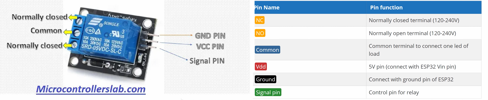

>[Torna a gateway digitale](loraswgatewaydigitale.md)

## **Gateway per scheda relè digitale**

### **Schema di principio del collegamento a stella**

Notare i **collegamenti punto-punto** tra tutti i dispositivi e il microcontrollore tramite linee esclusive.


### **La scheda relè**

Il relè è un dispositivo elettromeccanico utilizzato come interruttore e frapposto tra dispositivi ad alta corrente e dispositivi a bassa corrente. Le sue parti principali sono bobina e contatti. Generalmente applichiamo tensioni CC (5-12V) alla bobina e colleghiamo il carico (230V) attraverso i contatti normalmente aperti o chiusi. Quando forniamo tensione continua alla bobina, questa inizia a caricare, lungo il suo asse (traferro) un campo magnetico. Quando la bobina è completamente eccitata, il contatto passa dalla posizione normalmente aperta alla posizione normalmente chiusa sotto la forza esercitata dal mampo magnetico sul metallo del contatto.


Le lampadine o i motori di solito funzionano con alimentazione a 230 volt in caso di alimentazione in CA (corrente alternata). Non possiamo interfacciare questi carichi AC direttamente con la scheda di sviluppo ESP32. Dobbiamo usare un relè tra ESP32 e la lampada. 

Utilizzeremo un relè come interruttore per controllare lampade da 120-230 volt. Controlleremo il relè con ESP32. Potremmo usare qualsiasi modulo relè. Tuttavia, utilizzeremo il modulo relè SRD-05VDC-SL-C 5V. Funziona e può essere utilizzato per controllare carichi in uscita da 120-240 volt e una corrente massima di 10 A.

Bisogna fare attenzione a distinguere tra **carichi resistivi** e **carichi induttivi**. Una lampadina è un tipico carico resistivo, mentre un motore è un tipico carico induttivo. 

I **carichi induttivi** sono costituiti internamente da bobine più o meno grandi. I carichi induttivi soffrono del problema delle **sovratensioni** e delle **sovracorrenti** all'**accensione** e allo **spegnimento**. 

Una **sovracorrente** è una corrente che può essere **parecchie volte superiore** alla **massima corrente nominale** del **carico** (anche 10-15 volte), ha però la caratteristica di essere presente per un periodo **transitorio molto breve**. La sua presenza è un **fattore di stress** per i relè che ne accorcia la vita operativa. Esistono relè **appositamente progettati** per l'azionamento dei **carichi induttivi** ma hanno normalmente dimensioni e costo maggiore di quelli per carichi resistivi.

E' da rimarcare che normalmente non è una buona idea **collegare direttamente** la bobina di un relè ad una porta digitale del microcontrollore perchè questa potrebbe non fornire tutta la **corrente necessaria** per **eccitare competamente** il relè. Normalmente tra, microcontrollore e relè vi sono dei **circuiti di pilotaggio** che forniscono la corrente necessaria realizzati con **transistor BJT o MOS**. Una **scheda relè** normalmente ha a bordo, oltre al relè, pure i circuiti di pilotaggio necessari.



Una **scheda relè** consiste di **6 pin**:
- Tre pin vengono utilizzati per il collegamento con il **lato ad alta tensione**, ad esempio carichi elettrici e alimentazione a 220 volt 
- altri tre pin vengono utilizzati per il **lato a bassa tensione**, vale a dire: vcc, massa e pin del segnale di controllo.


Ci sono due **pin di contatto** che sono **normalmente aperti** e **normalmente chiusi**. Si usa sempre un **pin comune** insieme ad un pin normalmente aperto o un pin normalmente chiuso alternativamente per collegare il carico. A seconda di NC o NO, si utilizza un segnale attivo alto o attivo basso per controllare il relè:
- **Normalmente aperto (NA)**. Si utilizza un pin normalmente aperto, il relè si attiverà quando il segnale alto è presente sul **pin di controllo** mentre il segnale basso sullo stesso pin spegnerà il relè come mostrato in figura.
- **Normalmente chiuso (NC)**.  Si utilizza un pin normalmente chiuso, il segnale basso sul **pin di controllo** attiva il relè mentre il segnale alto sul pin di controllo disattiva il relè.

Alcuni moduli relè hanno transistor che funzionano con logica invertita. Logica invertita significa che il segnale basso attivo attiverà il relè mentre il segnale alto attivo spegnerà il relè. È necessario controllare la funzionalità del modulo relè prima di utilizzarlo. SRD-05VDC-SL-C, il modulo relè a 5V utilizzato nel progetto, non funziona su logica invertita.

### **Schema cablaggio**

**Avvertenza:** prima di realizzare questo schema elettrico, assicurarsi di non aver collegato ESP32 e lampada con alimentazione ad alta tensione. Stai utilizzando l'ALTA tensione in questo progetto, prendi tutte le precauzioni prima di creare questo layout. 

**Prima di toccare** il circuito per **inserire o disinserire collegamenti** assicurarsi con **certezza assoluta** di aver **scollegato la tensione di rete a 230V**. **Ripetere** questo controllo **con scrupolo** ogni volta che si **maneggia il circuito**.


### **Librerie del progetto**

Dal **punto di vista SW** non servono librerie particolari tranne quelle per la pubblicazione dei valori tramite MQTT. 

### **Gateway GPIO-LoRaWan con modem SW per il comando di una scheda relè**


Il codice seguente, alla ricezione del messaggio sotto forma di un singolo byte (uint8_t) scrive il bit basso o alto sulla **porta di controllo** del relè ivi collegato. **Subito dopo** la scrittura del comando viene effettuata una **lettura dello stato** della stessa porta (la cmdport) e viene inviato il suo valore al server applicativo lungo un **canale di feedback** in uplink. 

**Periodicamente**, grazie ad una **schedulazione** all'interno del loop(), il microcontrollore **invia spontaneamente** lo **stato della porta** del relè con una cadenza memorizzata su interval e impostata a **60 secondi**.

```C++
/*******************************************************************************
 * Copyright (c) 2015 Thomas Telkamp and Matthijs Kooijman
 * Copyright (c) 2018 Terry Moore, MCCI
 *
 * Permission is hereby granted, free of charge, to anyone
 * obtaining a copy of this document and accompanying files,
 * to do whatever they want with them without any restriction,
 * including, but not limited to, copying, modification and redistribution.
 * NO WARRANTY OF ANY KIND IS PROVIDED.
 *
 * This example sends a valid LoRaWAN packet with payload "Hello,
 * world!", using frequency and encryption settings matching those of
 * the The Things Network.
 *
 * This uses OTAA (Over-the-air activation), where where a DevEUI and
 * application key is configured, which are used in an over-the-air
 * activation procedure where a DevAddr and session keys are
 * assigned/generated for use with all further communication.
 *
 * Note: LoRaWAN per sub-band duty-cycle limitation is enforced (1% in
 * g1, 0.1% in g2), but not the TTN fair usage policy (which is probably
 * violated by this sketch when left running for longer)!

 * To use this sketch, first register your application and device with
 * the things network, to set or generate an AppEUI, DevEUI and AppKey.
 * Multiple devices can use the same AppEUI, but each device has its own
 * DevEUI and AppKey.
 *
 * Do not forget to define the radio type correctly in
 * arduino-lmic/project_config/lmic_project_config.h or from your BOARDS.txt.
 *
 *******************************************************************************/

#include <lmic.h>
#include <hal/hal.h>
#include <SPI.h>

//
// For normal use, we require that you edit the sketch to replace FILLMEIN
// with values assigned by the TTN console. However, for regression tests,
// we want to be able to compile these scripts. The regression tests define
// COMPILE_REGRESSION_TEST, and in that case we define FILLMEIN to a non-
// working but innocuous value.
//
#define FILLMEIN 1
/*
#ifdef COMPILE_REGRESSION_TEST
#define FILLMEIN 0
#else
#warning "You must replace the values marked FILLMEIN with real values from the TTN control panel!"
#define FILLMEIN (#dont edit this, edit the lines that use FILLMEIN)
#endif
*/
// This EUI must be in little-endian format, so least-significant-byte
// first. When copying an EUI from ttnctl output, this means to reverse
// the bytes. For TTN issued EUIs the last bytes should be 0xD5, 0xB3,
// 0x70.
static const u1_t PROGMEM APPEUI[8]={ FILLMEIN };
void os_getArtEui (u1_t* buf) { memcpy_P(buf, APPEUI, 8);}

// This should also be in little endian format, see above.
static const u1_t PROGMEM DEVEUI[8]={ FILLMEIN };
void os_getDevEui (u1_t* buf) { memcpy_P(buf, DEVEUI, 8);}

// This key should be in big endian format (or, since it is not really a
// number but a block of memory, endianness does not really apply). In
// practice, a key taken from ttnctl can be copied as-is.
static const u1_t PROGMEM APPKEY[16] = { FILLMEIN };
void os_getDevKey (u1_t* buf) {  memcpy_P(buf, APPKEY, 16);}

// payload to send to TTN gateway
static uint8_t payload[5];
static osjob_t sendjob;
bool flag_TXCOMPLETE = false;

// Schedule TX every this many seconds (might become longer due to duty
// cycle limitations).
const unsigned TX_INTERVAL = 60;

// Pin mapping
const lmic_pinmap lmic_pins = {
    .nss = 6,
    .rxtx = LMIC_UNUSED_PIN,
    .rst = 5,
    .dio = {2, 3, 4},
};

int8_t cmdport = 22;
int8_t ax;

void initLoRaWAN() {
	// LMIC init
	os_init();

	// Reset the MAC state. Session and pending data transfers will be discarded.
	LMIC_reset();

	// by joining the network, precomputed session parameters are be provided.
	//LMIC_setSession(0x1, DevAddr, (uint8_t*)NwkSkey, (uint8_t*)AppSkey);

	// Enabled data rate adaptation
	LMIC_setAdrMode(1);

	// Enable link check validation
	LMIC_setLinkCheckMode(0);

	// Set data rate and transmit power
	LMIC_setDrTxpow(DR_SF7, 21);
}

void printHex2(unsigned v) {
    v &= 0xff;
    if (v < 16)
        Serial.print('0');
    Serial.print(v, HEX);
}

void do_recv(uint8_t  bPort, uint8_t *msg, uint8_t len){
	digitalWrite(cmdport, msg[0]);
	do_send(&sendjob);
}

void onEvent (ev_t ev) {
    Serial.print(os_getTime());
    Serial.print(": ");
    switch(ev) {
        case EV_JOINED:
            Serial.println(F("EV_JOINED"));
            {
              u4_t netid = 0;
              devaddr_t devaddr = 0;
              u1_t nwkKey[16];
              u1_t artKey[16];
              LMIC_getSessionKeys(&netid, &devaddr, nwkKey, artKey);
              Serial.print("netid: ");
              Serial.println(netid, DEC);
              Serial.print("devaddr: ");
              Serial.println(devaddr, HEX);
              Serial.print("AppSKey: ");
              for (size_t i=0; i<sizeof(artKey); ++i) {
                if (i != 0)
                  Serial.print("-");
                printHex2(artKey[i]);
              }
              Serial.println("");
              Serial.print("NwkSKey: ");
              for (size_t i=0; i<sizeof(nwkKey); ++i) {
                      if (i != 0)
                              Serial.print("-");
                      printHex2(nwkKey[i]);
              }
              Serial.println();
            }
            // Disable link check validation (automatically enabled
            // during join, but because slow data rates change max TX
	        // size, we don't use it in this example.
            LMIC_setLinkCheckMode(0);
			// enable pinging mode, start scanning...
            // (set local ping interval configuration to 2^1 == 2 sec)
            LMIC_setPingable(1);
            Serial.println("SCANNING...\r\n");
            break;
		 // beacon found by scanning
		case EV_BEACON_FOUND:
            // send empty frame up to notify server of ping mode and interval!
            LMIC_sendAlive();
            break;
	case EV_RXCOMPLETE:
		// data received in ping slot
		Serial.println(F("EV_RXCOMPLETE"));
		// Any data to be received?
		if (LMIC.dataLen != 0 || LMIC.dataBeg != 0) {
			 // Data was received. Extract port number if any.
			 u1_t bPort = 0;
			 if (LMIC.txrxFlags & TXRX_PORT)
				bPort = LMIC.frame[LMIC.dataBeg - 1];
			 // Call user-supplied function with port #, pMessage, nMessage;
			 // nMessage might be zero.
			 do_recv(bPort, LMIC.frame + LMIC.dataBeg, LMIC.dataLen);
		 }
                 break;
        case EV_TXCOMPLETE:
            Serial.println(F("EV_TXCOMPLETE (includes waiting for RX windows)"));
            if (LMIC.txrxFlags & TXRX_ACK)
              Serial.println(F("Received ack"));
            if (LMIC.dataLen) {
              Serial.print(F("Received "));
              Serial.print(LMIC.dataLen);
              Serial.println(F(" bytes of payload"));
            }
            // Schedule next transmission
            os_setTimedCallback(&sendjob, os_getTime()+sec2osticks(TX_INTERVAL), do_send);
	        flag_TXCOMPLETE = true;
            break;
		case EV_LINK_DEAD:
            initLoRaWAN();
	    break;
        default:
            Serial.print(F("Unknown event: "));
            Serial.println((unsigned) ev);
            break;
    }
}

void do_send(osjob_t* j){
	byte payload[1];

	Serial.print("Requesting data...");
	ax = digitalRead(cmdport);
	Serial.println("DONE");

	payload[0] = ax;

	Serial.println(F("Packet queued"));

	// prepare upstream data transmission at the next possible time.
	// transmit on port 1 (the first parameter); you can use any value from 1 to 223 (others are reserved).
	// don't request an ack (the last parameter, if not zero, requests an ack from the network).
	// Remember, acks consume a lot of network resources; don't ask for an ack unless you really need it.
	LMIC_setTxData2(1, payload, sizeof(payload), 0);
	Serial.println(F("Packet queued"));
    // Next TX is scheduled after TX_COMPLETE event.
}

void sensorInit(){}

void setup() {
    Serial.begin(9600);
    Serial.println(F("Starting"));

    #ifdef VCC_ENABLE
    // For Pinoccio Scout boards
    pinMode(VCC_ENABLE, OUTPUT);
    digitalWrite(VCC_ENABLE, HIGH);
    delay(1000);
    #endif

   // Setup LoRaWAN state
	initLoRaWAN();
	
	sensorInit();

    // Start job (sending automatically starts OTAA too)
    do_send(&sendjob);
}

void loop() {
	os_runloop_once();
	/* In caso di instabilità
	//Run LMIC loop until he as finish
	while(flag_TXCOMPLETE == false)
	{
		os_runloop_once();
	}
	flag_TXCOMPLETE = false;
	*/
}
```

**Sitografia:**

- https://microcontrollerslab.com/esp32-web-server-control-relay-220-volt-lamp/
- https://www.monicoimpianti.net/rele-passo-passo/

>[Torna a gateway digitale](loraswgatewaydigitale.md)
