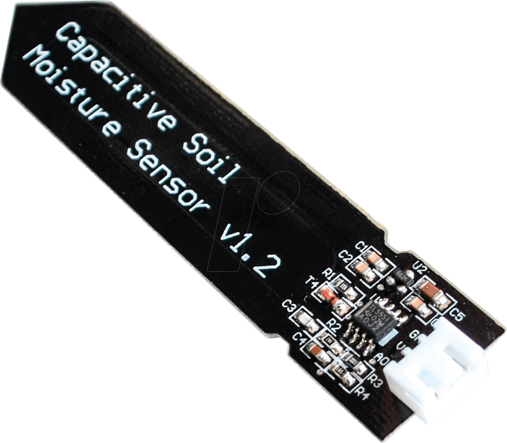

>[Torna a gateway analogico](loraswgatewayanalogico.md)

## **Gateway per sensore capacitivo di umidità del suolo**

### **Schema di principio del collegamento a stella**

Notare i **collegamenti punto-punto** tra tutti i dispositivi e il microcontrollore tramite linee esclusive.


### **Il sensore di livello capacitivo**



### **Schema cablaggio**


### **Condizionamento digitale**

    | Tensione di alimentazione               |        3.3V         |          5V           |
    |-----------------------------------------|---------|-----------|-----------|-----------|
    | Umido/Secco                             |  Umido  |   Secco   |   Umido   |   Secco   |
    | Sensore di umidità del suolo capacitivo |  2...8  |  14...21  | 821...824 | 490...549 |
    | Sensore di umidità del suolo resistivo  |   1024  | 483...505 |   1023    | 344...358 |
    
Teoricamente si può usare una qualsiasi di queste combinazioni, ma è necessario calibrare il  sensore prima di dichiarare che il terreno è bagnato o asciutto.

Per il sensore di umidità del suolo capacitivo si vede anche dalla tabella che la differenza nel valore del sensore per una tensione di esercizio di 3,3V è molto bassa. Pertanto per evitare probabili errori è consigliabile, per il sensore capacitivo, utilizzare una tensione operativa di 5V.

### **Librerie del progetto**

Dal **punto di vista SW** non servono librerie particolari tranne quelle per la pubblicazione dei valorri traite MQTT. Una parte del codice va comunque dedicata al condizionamento dei valori misurati dal sensore per tradurli ai valori di interesse di umidità.

### **Gateway LoRaWan LMIC per la lettura di un solo sensore di umidità del suolo**

```C++
/*******************************************************************************
 * Copyright (c) 2015 Thomas Telkamp and Matthijs Kooijman
 * Copyright (c) 2018 Terry Moore, MCCI
 *
 * Permission is hereby granted, free of charge, to anyone
 * obtaining a copy of this document and accompanying files,
 * to do whatever they want with them without any restriction,
 * including, but not limited to, copying, modification and redistribution.
 * NO WARRANTY OF ANY KIND IS PROVIDED.
 *
 * This example sends a valid LoRaWAN packet with payload "Hello,
 * world!", using frequency and encryption settings matching those of
 * the The Things Network.
 *
 * This uses OTAA (Over-the-air activation), where where a DevEUI and
 * application key is configured, which are used in an over-the-air
 * activation procedure where a DevAddr and session keys are
 * assigned/generated for use with all further communication.
 *
 * Note: LoRaWAN per sub-band duty-cycle limitation is enforced (1% in
 * g1, 0.1% in g2), but not the TTN fair usage policy (which is probably
 * violated by this sketch when left running for longer)!

 * To use this sketch, first register your application and device with
 * the things network, to set or generate an AppEUI, DevEUI and AppKey.
 * Multiple devices can use the same AppEUI, but each device has its own
 * DevEUI and AppKey.
 *
 * Do not forget to define the radio type correctly in
 * arduino-lmic/project_config/lmic_project_config.h or from your BOARDS.txt.
 *
 *******************************************************************************/

#include <lmic.h>
#include <hal/hal.h>
#include <SPI.h>

//
// For normal use, we require that you edit the sketch to replace FILLMEIN
// with values assigned by the TTN console. However, for regression tests,
// we want to be able to compile these scripts. The regression tests define
// COMPILE_REGRESSION_TEST, and in that case we define FILLMEIN to a non-
// working but innocuous value.
//
#define FILLMEIN 1
/*
#ifdef COMPILE_REGRESSION_TEST
#define FILLMEIN 0
#else
#warning "You must replace the values marked FILLMEIN with real values from the TTN control panel!"
#define FILLMEIN (#dont edit this, edit the lines that use FILLMEIN)
#endif
*/
//#define SensorPin A0  // used for Arduino and ESP8266
#define SensorPin 4     // used for ESP32

// This EUI must be in little-endian format, so least-significant-byte
// first. When copying an EUI from ttnctl output, this means to reverse
// the bytes. For TTN issued EUIs the last bytes should be 0xD5, 0xB3,
// 0x70.
static const u1_t PROGMEM APPEUI[8]={ FILLMEIN };
void os_getArtEui (u1_t* buf) { memcpy_P(buf, APPEUI, 8);}

// This should also be in little endian format, see above.
static const u1_t PROGMEM DEVEUI[8]={ FILLMEIN };
void os_getDevEui (u1_t* buf) { memcpy_P(buf, DEVEUI, 8);}

// This key should be in big endian format (or, since it is not really a
// number but a block of memory, endianness does not really apply). In
// practice, a key taken from ttnctl can be copied as-is.
static const u1_t PROGMEM APPKEY[16] = { FILLMEIN };
void os_getDevKey (u1_t* buf) {  memcpy_P(buf, APPKEY, 16);}

// payload to send to TTN gateway
static uint8_t payload[5];
static osjob_t sendjob;
bool flag_TXCOMPLETE = false;

// Schedule TX every this many seconds (might become longer due to duty
// cycle limitations).
const unsigned TX_INTERVAL = 60;

// Pin mapping
const lmic_pinmap lmic_pins = {
    .nss = 6,
    .rxtx = LMIC_UNUSED_PIN,
    .rst = 5,
    .dio = {2, 3, 4},
};

int16_t h1;

void printHex2(unsigned v) {
    v &= 0xff;
    if (v < 16)
        Serial.print('0');
    Serial.print(v, HEX);
}

void onEvent (ev_t ev) {
    Serial.print(os_getTime());
    Serial.print(": ");
    switch(ev) {
        case EV_JOINED:
            Serial.println(F("EV_JOINED"));
            {
              u4_t netid = 0;
              devaddr_t devaddr = 0;
              u1_t nwkKey[16];
              u1_t artKey[16];
              LMIC_getSessionKeys(&netid, &devaddr, nwkKey, artKey);
              Serial.print("netid: ");
              Serial.println(netid, DEC);
              Serial.print("devaddr: ");
              Serial.println(devaddr, HEX);
              Serial.print("AppSKey: ");
              for (size_t i=0; i<sizeof(artKey); ++i) {
                if (i != 0)
                  Serial.print("-");
                printHex2(artKey[i]);
              }
              Serial.println("");
              Serial.print("NwkSKey: ");
              for (size_t i=0; i<sizeof(nwkKey); ++i) {
                      if (i != 0)
                              Serial.print("-");
                      printHex2(nwkKey[i]);
              }
              Serial.println();
            }
            // Disable link check validation (automatically enabled
            // during join, but because slow data rates change max TX
	        // size, we don't use it in this example.
            LMIC_setLinkCheckMode(0);
            break;
        case EV_TXCOMPLETE:
            Serial.println(F("EV_TXCOMPLETE (includes waiting for RX windows)"));
            if (LMIC.txrxFlags & TXRX_ACK)
              Serial.println(F("Received ack"));
            if (LMIC.dataLen) {
              Serial.print(F("Received "));
              Serial.print(LMIC.dataLen);
              Serial.println(F(" bytes of payload"));
            }
            // Schedule next transmission
            os_setTimedCallback(&sendjob, os_getTime()+sec2osticks(TX_INTERVAL), do_send);
	        flag_TXCOMPLETE = true;
            break;
	case EV_LINK_DEAD:
            initLoRaWAN();
	    break;
        default:
            Serial.print(F("Unknown event: "));
            Serial.println((unsigned) ev);
            break;
    }
}

void do_send(osjob_t* j){
	// Split both words (16 bits) into 2 bytes of 8
	byte payload[2];

	Serial.print("Requesting data...");
	h1 = analogRead(SensorPin);
	Serial.println("DONE");

	payload[0] = highByte(h1);
	payload[1] = lowByte(h1);

	LMIC_setTxData2(1, payload, sizeof(payload)-1, 0);
	Serial.println(F("Packet queued"));
}

void initLoRaWAN() {
	// LMIC init
	os_init();

	// Reset the MAC state. Session and pending data transfers will be discarded.
	LMIC_reset();

	// by joining the network, precomputed session parameters are be provided.
	//LMIC_setSession(0x1, DevAddr, (uint8_t*)NwkSkey, (uint8_t*)AppSkey);

	// Enabled data rate adaptation
	LMIC_setAdrMode(1);

	// Enable link check validation
	LMIC_setLinkCheckMode(0);

	// Set data rate and transmit power
	LMIC_setDrTxpow(DR_SF7, 21);
}

void sensorInit(){
	
}

void setup() {
    Serial.begin(9600);
    Serial.println(F("Starting"));

    #ifdef VCC_ENABLE
    // For Pinoccio Scout boards
    pinMode(VCC_ENABLE, OUTPUT);
    digitalWrite(VCC_ENABLE, HIGH);
    delay(1000);
    #endif

   // Setup LoRaWAN state
	initLoRaWAN();
	
	sensorInit();

    // Start job (sending automatically starts OTAA too)
    do_send(&sendjob);
}

void loop() {
	os_runloop_once();
	/* In caso di instabilità
	//Run LMIC loop until he as finish
	while(flag_TXCOMPLETE == false)
	{
		os_runloop_once();
	}
	flag_TXCOMPLETE = false;
	*/
}
```
### **Gateway MQTT per la lettura periodica di un sensore di umidità del suolo alimentato a batteria**

Il codice seguente utilizza la modalità di sleep profondo del microcontrollore ESP32 che consiste nello spegnimento dei due core della CPU e di tutte le periferiche fatta eccezione per un timer HW che viene impostato ad un timeout allo scadere del quale avviene il risveglio della CPU. Lo sleep profondo consente un drastico risparmio di energia nei periodi di inattività che allunga la durata di una eventuale alimentazione a batterie.

L'istruzione ``` esp_deep_sleep_start(); ``` avvia la fase di sleep e viene eseguita una volta sola all'interno del setup(). Il loop() è praticamente inutile e viene lasciato vuoto dato che non è possibile arrivare alla sua esecuzione.

Il risveglio fa ripartire ogni volta il sistema dal setup() per cui tutte le elaborazioni e le eventuali comunicazioni devono avvenire la dentro.

L'istruzione ``` esp_sleep_enable_timer_wakeup(TIME_TO_SLEEP * uS_TO_S_FACTOR) ``` imposta il timeout del timer.

La funzione ``` print_wakeup_reason() ``` stampa sulla seriale il motivo del wakeup.

I motivi possono essere:
- l'evento di timer HW, che sveglia il sistema in periodi di tempo prestabiliti;
- l'evento di tocco tattile di un certo pin;
- un evento di riattivazione esterna: è possibile utilizzare una riattivazione esterna o più risvegli esterni diversi;
- un evento generato dal coprocessore ULP ma questo non sarà trattato nella presente guida.

```C++
#include <arduino.h>
#include <lmic.h>
#include <hal/hal.h>
#include <SPI.h>

// include the DHT22 Sensor Library
#include "DHT.h"
// DHT digital pin and sensor type
#define DHTPIN 10
#define DHTTYPE DHT22

//#include <ttn_credentials.h>
#define TTN_APPEUI {0}
#define TTN_DEVEUI {0}
#define TTN_APPKEY {0}
#define MAX_BANDS 4
//#define CFG_LMIC_EU_like 0

bool GOTO_DEEPSLEEP = false;

// rename ttn_credentials.h.example to ttn_credentials.h and add you keys
static const u1_t PROGMEM APPEUI[8] = TTN_APPEUI;
static const u1_t PROGMEM DEVEUI[8] = TTN_DEVEUI;
static const u1_t PROGMEM APPKEY[16] = TTN_APPKEY;
void os_getArtEui(u1_t *buf) { memcpy_P(buf, APPEUI, 8); }
void os_getDevEui(u1_t *buf) { memcpy_P(buf, DEVEUI, 8); }
void os_getDevKey(u1_t *buf) { memcpy_P(buf, APPKEY, 16); }

//static uint8_t payload[5];
static osjob_t sendjob;
bool flag_TXCOMPLETE = false;

// Schedule TX every this many seconds
// Respect Fair Access Policy and Maximum Duty Cycle!
// https://www.thethingsnetwork.org/docs/lorawan/duty-cycle.html
// https://www.loratools.nl/#/airtime
const unsigned TX_INTERVAL = 30;

// payload to send to TTN gateway


// Saves the LMIC structure during DeepSleep
RTC_DATA_ATTR lmic_t RTC_LMIC;

#define PIN_LMIC_NSS 18
#define PIN_LMIC_RST 14
#define PIN_LMIC_DIO0 26
#define PIN_LMIC_DIO1 33
#define PIN_LMIC_DIO2 32
//sensors defines
//#define SensorPin A0  // used for Arduino and ESP8266
#define SensorPin 4     // used for ESP32

// Pin mapping
const lmic_pinmap lmic_pins = {
    .nss = PIN_LMIC_NSS,
    .rxtx = LMIC_UNUSED_PIN,
    .rst = PIN_LMIC_RST,
    .dio = {PIN_LMIC_DIO0, PIN_LMIC_DIO1, PIN_LMIC_DIO2},
};

int16_t h1;

// https://github.com/mcci-catena/arduino-lmic/blob/89c28c5888338f8fc851851bb64968f2a493462f/src/lmic/lmic.h#L233

void PrintRuntime()
{
    long seconds = millis() / 1000;
    Serial.print("Runtime: ");
    Serial.print(seconds);
    Serial.println(" seconds");
}

void PrintLMICVersion()
{
    Serial.print(F("LMIC: "));
    Serial.print(ARDUINO_LMIC_VERSION_GET_MAJOR(ARDUINO_LMIC_VERSION));
    Serial.print(F("."));
    Serial.print(ARDUINO_LMIC_VERSION_GET_MINOR(ARDUINO_LMIC_VERSION));
    Serial.print(F("."));
    Serial.print(ARDUINO_LMIC_VERSION_GET_PATCH(ARDUINO_LMIC_VERSION));
    Serial.print(F("."));
    Serial.println(ARDUINO_LMIC_VERSION_GET_LOCAL(ARDUINO_LMIC_VERSION));
}

void onEvent(ev_t ev)
{
    Serial.print(os_getTime());
    Serial.print(": ");
    switch (ev)
    {
    case EV_SCAN_TIMEOUT:
        Serial.println(F("EV_SCAN_TIMEOUT"));
        break;
    case EV_BEACON_FOUND:
        Serial.println(F("EV_BEACON_FOUND"));
        break;
    case EV_BEACON_MISSED:
        Serial.println(F("EV_BEACON_MISSED"));
        break;
    case EV_BEACON_TRACKED:
        Serial.println(F("EV_BEACON_TRACKED"));
        break;
    case EV_JOINING:
        Serial.println(F("EV_JOINING"));
        break;
    case EV_JOINED:
        Serial.println(F("EV_JOINED"));
        {
            u4_t netid = 0;
            devaddr_t devaddr = 0;
            u1_t nwkKey[16];
            u1_t artKey[16];
            LMIC_getSessionKeys(&netid, &devaddr, nwkKey, artKey);
            Serial.print("netid: ");
            Serial.println(netid, DEC);
            Serial.print("devaddr: ");
            Serial.println(devaddr, HEX);
            Serial.print("artKey: ");
            for (size_t i = 0; i < sizeof(artKey); ++i)
            {
                Serial.print(artKey[i], HEX);
            }
            Serial.println("");
            Serial.print("nwkKey: ");
            for (size_t i = 0; i < sizeof(nwkKey); ++i)
            {
                Serial.print(nwkKey[i], HEX);
            }
            Serial.println("");
        }
        // Disable link check validation (automatically enabled
        // during join, but because slow data rates change max TX
        // size, we don't use it in this example.
        LMIC_setLinkCheckMode(0);
        break;
    /*
        || This event is defined but not used in the code. No
        || point in wasting codespace on it.
        ||
        || case EV_RFU1:
        ||     Serial.println(F("EV_RFU1"));
        ||     break;
        */
    case EV_JOIN_FAILED:
        Serial.println(F("EV_JOIN_FAILED"));
        break;
    case EV_REJOIN_FAILED:
        Serial.println(F("EV_REJOIN_FAILED"));
        break;
    case EV_TXCOMPLETE:
        Serial.println(F("EV_TXCOMPLETE (includes waiting for RX windows)"));
        if (LMIC.txrxFlags & TXRX_ACK)
            Serial.println(F("Received ack"));
        if (LMIC.dataLen)
        {
            Serial.print(F("Received "));
            Serial.print(LMIC.dataLen);
            Serial.println(F(" bytes of payload"));
        }
        GOTO_DEEPSLEEP = true;
        break;
    case EV_LOST_TSYNC:
        Serial.println(F("EV_LOST_TSYNC"));
        break;
    case EV_RESET:
        Serial.println(F("EV_RESET"));
        break;
    case EV_RXCOMPLETE:
        // data received in ping slot
        Serial.println(F("EV_RXCOMPLETE"));
        break;
    case EV_LINK_DEAD:
        Serial.println(F("EV_LINK_DEAD"));
        break;
    case EV_LINK_ALIVE:
        Serial.println(F("EV_LINK_ALIVE"));
        break;
    /*
        || This event is defined but not used in the code. No
        || point in wasting codespace on it.
        ||
        || case EV_SCAN_FOUND:
        ||    Serial.println(F("EV_SCAN_FOUND"));
        ||    break;
        */
    case EV_TXSTART:
        Serial.println(F("EV_TXSTART"));
        break;
    case EV_TXCANCELED:
        Serial.println(F("EV_TXCANCELED"));
        break;
    case EV_RXSTART:
        /* do not print anything -- it wrecks timing */
        break;
    case EV_JOIN_TXCOMPLETE:
        Serial.println(F("EV_JOIN_TXCOMPLETE: no JoinAccept"));
        break;
    default:
        Serial.print(F("Unknown event: "));
        Serial.println((unsigned)ev);
        break;
    }
}

void do_send(osjob_t *j)
{
    // Check if there is not a current TX/RX job running
    if (LMIC.opmode & OP_TXRXPEND)
    {
        Serial.println(F("OP_TXRXPEND, not sending"));
    }
    else
    {
        // Prepare upstream data transmission at the next possible time.
        byte payload[2];

		Serial.print("Requesting data...");
		h1 = analogRead(SensorPin);
		Serial.println("DONE");

		payload[0] = highByte(h1);
		payload[1] = lowByte(h1);
	
		Serial.println(F("Packet queued"));

        // prepare upstream data transmission at the next possible time.
        // transmit on port 1 (the first parameter); you can use any value from 1 to 223 (others are reserved).
        // don't request an ack (the last parameter, if not zero, requests an ack from the network).
        // Remember, acks consume a lot of network resources; don't ask for an ack unless you really need it.
        LMIC_setTxData2(1, payload, sizeof(payload)-1, 0);
        Serial.println(F("Packet queued"));
    }
    // Next TX is scheduled after TX_COMPLETE event.
}

void SaveLMICToRTC(int deepsleep_sec)
{
    Serial.println(F("Save LMIC to RTC"));
    RTC_LMIC = LMIC;

    // ESP32 can't track millis during DeepSleep and no option to advanced millis after DeepSleep.
    // Therefore reset DutyCyles

    unsigned long now = millis();

    // EU Like Bands
#if defined(CFG_LMIC_EU_like2)//era CFG_LMIC_EU_like ma non funziona
    Serial.println(F("Reset CFG_LMIC_EU_like band avail"));
    for (int i = 0; i < MAX_BANDS; i++)
    {
        ostime_t correctedAvail = RTC_LMIC.bands[i].avail - ((now / 1000.0 + deepsleep_sec) * OSTICKS_PER_SEC);
        if (correctedAvail < 0)
        {
            correctedAvail = 0;
        }
        RTC_LMIC.bands[i].avail = correctedAvail;
    }

    RTC_LMIC.globalDutyAvail = RTC_LMIC.globalDutyAvail - ((now / 1000.0 + deepsleep_sec) * OSTICKS_PER_SEC);
    if (RTC_LMIC.globalDutyAvail < 0)
    {
        RTC_LMIC.globalDutyAvail = 0;
    }
#else
    Serial.println(F("No DutyCycle recalculation function!"));
#endif
}

void LoadLMICFromRTC()
{
    Serial.println(F("Load LMIC from RTC"));
    LMIC = RTC_LMIC;
}

void GoDeepSleep()
{
    Serial.println(F("Go DeepSleep"));
    PrintRuntime();
    Serial.flush();
    esp_sleep_enable_timer_wakeup(TX_INTERVAL * 1000000);
    esp_deep_sleep_start();
}

void setup()
{
    Serial.begin(115200);

    Serial.println(F("Starting DeepSleep test"));
    PrintLMICVersion();

    // LMIC init
    os_init();

    // Reset the MAC state. Session and pending data transfers will be discarded.
    LMIC_reset();

    if (RTC_LMIC.seqnoUp != 0)
    {
        LoadLMICFromRTC();
    }

    // Start job (sending automatically starts OTAA too)
    do_send(&sendjob);
}

void loop()
{
    static unsigned long lastPrintTime = 0;

    os_runloop_once();

    const bool timeCriticalJobs = os_queryTimeCriticalJobs(ms2osticksRound((TX_INTERVAL * 1000)));
    if (!timeCriticalJobs && GOTO_DEEPSLEEP == true && !(LMIC.opmode & OP_TXRXPEND))
    {
        Serial.print(F("Can go sleep "));
        SaveLMICToRTC(TX_INTERVAL);
        GoDeepSleep();
    }
    else if (millis() - lastPrintTime > 2000)
    {
        Serial.print(F("Cannot sleep "));
        Serial.print(F("TimeCriticalJobs: "));
        Serial.print(timeCriticalJobs);
        Serial.print(" ");

        PrintRuntime();
        lastPrintTime = millis();
    }
}
```


**Sitografia:**

- https://diyi0t.com/soil-moisture-sensor-tutorial-for-arduino-and-esp8266
- https://randomnerdtutorials.com/esp32-deep-sleep-arduino-ide-wake-up-sources/
- https://randomnerdtutorials.com/esp32-timer-wake-up-deep-sleep/

>[Torna a gateway analogico](loraswgatewayanalogico.md)
