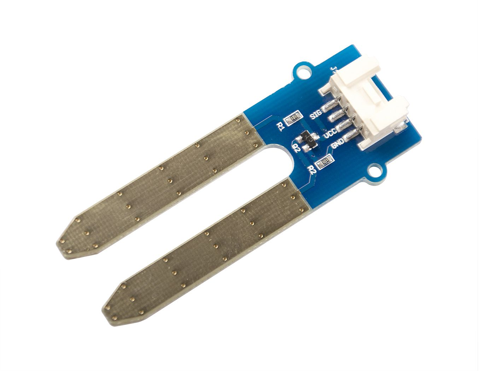
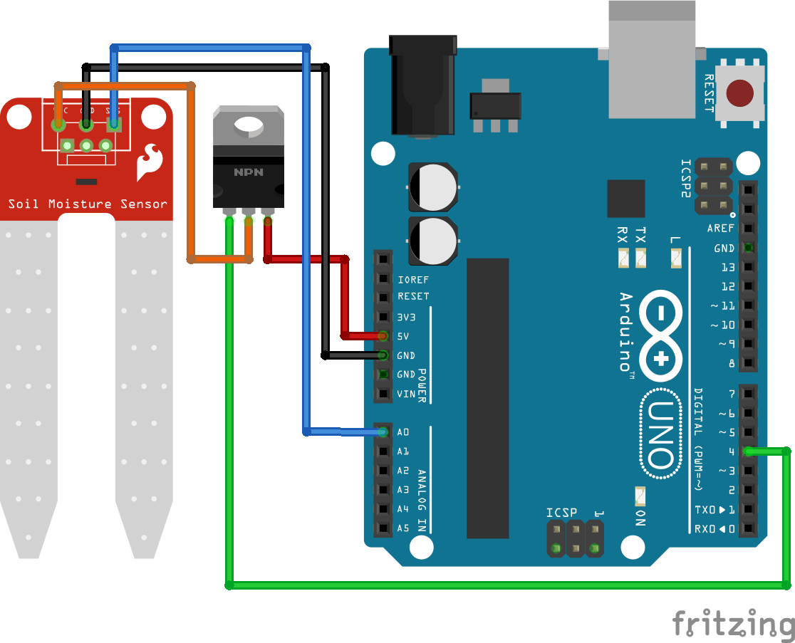

>[Torna a gateway analogico](loraswgatewayanalogico.md)


## **Gateway per sensore resistivo di umidità del suolo**

### **Schema di principio del collegamento a stella**

Notare i **collegamenti punto-punto** tra tutti i dispositivi e il microcontrollore tramite linee esclusive.


### **Il sensore di livello resistivo**



### **Schema cablaggio**



### **Condizionamento digitale**

    | Tensione di alimentazione               |        3.3V         |          5V           |
    |-----------------------------------------|---------|-----------|-----------|-----------|
    | Umido/Secco                             |  Umido  |   Secco   |   Umido   |   Secco   |
    | Sensore di umidità del suolo capacitivo |  2...8  |  14...21  | 821...824 | 490...549 |
    | Sensore di umidità del suolo resistivo  |   1024  | 483...505 |   1023    | 344...358 |
    
Teoricamente si può usare una qualsiasi di queste combinazioni, ma è necessario calibrare il  sensore prima di dichiarare che il terreno è bagnato o asciutto.

Per il sensore di umidità del suolo capacitivo si vede anche dalla tabella che la differenza nel valore del sensore per una tensione di esercizio di 3,3V è molto bassa. Pertanto per evitare probabili errori è consigliabile, per il sensore capacitivo, utilizzare una tensione operativa di 5V.

### **Sensore di umidità del suolo resistivo**

Il **sensore resistivo di umidità** del suolo è composto da 2 sonde con inserimento nel terreno. A seconda della direzione della corrente, una sonda funzionerà come catodo e l'altra come anodo. Generalmente quale sonda sia l'anodo o il catodo è irrilevante per la funzionalità del sensore, perché il sensore misura solo la resistenza ed è quindi indipendente dalla direzione del flusso di corrente.

Il circuito elettrico è chiuso sul **terreno** che funge da **resistenza** per il flusso di corrente. Questa resistenza viene misurata e dipende dalla **quantità di acqua** nel terreno perché l'acqua è un conduttore naturale per l'elettricità. Minore è la resistenza misurata, maggiore è la quantità di acqua nel terreno.

Il flusso di corrente attraverso l'anodo del sensore resistivo di umidità del suolo, che ha contatto con l'acqua, è un ambiente perfetto per l'**elettrolisi** e quindi la deposizione galvanica. Questa elettrolisi danneggia il sensore e rende il sensore impreciso. Quanto sarà forte l'elettrolisi dipende da quanto spesso e da quanta corrente viene fatta passare attraverso gli elettrodi.

Per evitare il flusso di corrente al sensore, utilizziamo un circuito MOSFET a canale N per scollegare il sensore dall'alimentazione. Inoltre leggiamo il valore del sensore solo una volta ogni tanto.

### **Librerie del progetto**

Dal **punto di vista SW** non servono librerie particolari tranne quelle per la pubblicazione dei valorri traite MQTT. Una parte del codice va comunque dedicata al condizionamento dei valori misurati dal sensore per tradurli ai valori di interesse di umidità.

### **Gateway MQTT per la lettura di un solo sensore di umidità del suolo**

Utilizziamo il pin digitale per abilitare il flusso di corrente sul gate del MOSFET. Questo chiude il circuito del sensore di umidità del suolo e leggiamo il valore del sensore analogico dopo un breve ritardo di 1 secondo. Dopo che il valore del sensore è stato stampato sul monitor seriale, aspettiamo 1 secondo e disabilitiamo il flusso di corrente attraverso il sensore tirando il Gate del MOSFET LOW.

Poiché ogni pin I/O digitale dell'ESP32, che non viene utilizzato per un'interfaccia di comunicazione, può essere un ingresso analogico, dobbiamo scegliere un pin qualsiasi come ingresso analogico.

```C++
/*
 * Author: JP Meijers
 * Date: 2016-10-20
 *
 * Transmit a one byte packet via TTN. This happens as fast as possible, while still keeping to
 * the 1% duty cycle rules enforced by the RN2483's built in LoRaWAN stack. Even though this is
 * allowed by the radio regulations of the 868MHz band, the fair use policy of TTN may prohibit this.
 *
 * CHECK THE RULES BEFORE USING THIS PROGRAM!
 *
 * CHANGE ADDRESS!
 * Change the device address, network (session) key, and app (session) key to the values
 * that are registered via the TTN dashboard.
 * The appropriate line is "myLora.initABP(XXX);" or "myLora.initOTAA(XXX);"
 * When using ABP, it is advised to enable "relax frame count".
 *
 * Connect the RN2xx3 as follows:
 * RN2xx3 -- ESP8266
 * Uart TX -- GPIO4
 * Uart RX -- GPIO5
 * Reset -- GPIO15
 * Vcc -- 3.3V
 * Gnd -- Gnd
 *
 */
#include <rn2xx3.h>
#include <SoftwareSerial.h>

#define RESET 15
// Interval between send in seconds, so 300s = 5min
#define CONFIG_INTERVAL ((uint32_t) 300)
//sensors defines
//#define SensorPin A0  // used for Arduino and ESP8266
#define SensorPin 4     // used for ESP32
#define SENSOR_VCC_PIN  5     // used for ESP32

SoftwareSerial mySerial(4, 5); // RX, TX !! labels on relay board is swapped !!

//create an instance of the rn2xx3 library,
//giving the software UART as stream to use,
//and using LoRa WAN
rn2xx3 myLora(mySerial);

int16_t h1;

void inline sensorsInit() {

}

void inline readSensorsAndTx() {
// Split both words (16 bits) into 2 bytes of 8
	byte payload[2];

	Serial.print("Requesting data...");
	digitalWrite(SENSOR_VCC_PIN, HIGH);
	h1 = analogRead(SensorPin);
	digitalWrite(SENSOR_VCC_PIN, LOW);
	Serial.println("DONE");

	payload[0] = highByte(h1);
	payload[1] = lowByte(h1);
	
	Serial.println(F("Packet queued"));
  
	//myLora.tx("!"); //send String, blocking function
	myLora.txBytes(payload, sizeof(payload)); // blocking function
}

// the setup routine runs once when you press reset:
void setup() {
  // LED pin is GPIO2 which is the ESP8266's built in LED
  pinMode(2, OUTPUT);
  pinMode(SENSOR_VCC_PIN, OUTPUT);
  led_on();

  // Open serial communications and wait for port to open:
  Serial.begin(57600);
  mySerial.begin(57600);
  
  sensorsInit();
  
  delay(1000); //wait for the arduino ide's serial console to open

  Serial.println("Startup");

  initialize_radio();

  //transmit a startup message
  myLora.tx("TTN Mapper on ESP8266 node");

  led_off();

  delay(2000);
}

void initialize_radio()
{
  //reset RN2xx3
  pinMode(RESET, OUTPUT);
  digitalWrite(RESET, LOW);
  delay(100);
  digitalWrite(RESET, HIGH);

  delay(100); //wait for the RN2xx3's startup message
  mySerial.flush();

  //check communication with radio
  String hweui = myLora.hweui();
  while(hweui.length() != 16)
  {
    Serial.println("Communication with RN2xx3 unsuccessful. Power cycle the board.");
    Serial.println(hweui);
    delay(10000);
    hweui = myLora.hweui();
  }

  //print out the HWEUI so that we can register it via ttnctl
  Serial.println("When using OTAA, register this DevEUI: ");
  Serial.println(hweui);
  Serial.println("RN2xx3 firmware version:");
  Serial.println(myLora.sysver());

  //configure your keys and join the network
  Serial.println("Trying to join TTN");
  bool join_result = false;

  //ABP: initABP(String addr, String AppSKey, String NwkSKey);
  join_result = myLora.initABP("02017201", "8D7FFEF938589D95AAD928C2E2E7E48F", "AE17E567AECC8787F749A62F5541D522");

  //OTAA: initOTAA(String AppEUI, String AppKey);
  //join_result = myLora.initOTAA("70B3D57ED00001A6", "A23C96EE13804963F8C2BD6285448198");

  while(!join_result)
  {
    Serial.println("Unable to join. Are your keys correct, and do you have TTN coverage?");
    delay(60000); //delay a minute before retry
    join_result = myLora.init();
  }
  Serial.println("Successfully joined TTN");

}

// the loop routine runs over and over again forever:
void loop() {
    led_on();
    
    readSensorsAndTx();
	
    led_off();
    delay(2000);
}

void led_on()
{
  digitalWrite(2, 1);
}

void led_off()
{
  digitalWrite(2, 0);
}
```

### **Gateway MQTT per la lettura periodica di un sensore di umidità del suolo alimentato a batteria**

Il codice seguente utilizza la modalità di sleep profondo del microcontrollore ESP32 che consiste nello spegnimento dei due core della CPU e di tutte le periferiche fatta eccezione per un timer HW che viene impostato ad un timeout allo scadere del quale avviene il risveglio della CPU. Lo sleep profondo consente un drastico risparmio di energia nei periodi di inattività che allunga la durata di una eventuale alimentazione a batterie.

L'istruzione ``` esp_deep_sleep_start(); ``` avvia la fase di sleep e viene eseguita una volta sola all'interno del setup(). Il loop() è praticamente inutile e viene lasciato vuoto dato che non è possibile arrivare alla sua esecuzione.

Il risveglio fa ripartire ogni volta il sistema dal setup() per cui tutte le elaborazioni e le eventuali comunicazioni devono avvenire la dentro.

L'istruzione ``` esp_sleep_enable_timer_wakeup(TIME_TO_SLEEP * uS_TO_S_FACTOR) ``` imposta il timeout del timer.

La funzione ``` print_wakeup_reason() ``` stampa sulla seriale il motivo del wakeup.

I motivi possono essere:
- l'evento di timer HW, che sveglia il sistema in periodi di tempo prestabiliti;
- l'evento di tocco tattile di un certo pin;
- un evento di riattivazione esterna: è possibile utilizzare una riattivazione esterna o più risvegli esterni diversi;
- un evento generato dal coprocessore ULP ma questo non sarà trattato nella presente guida.

Nel codice seguente vengono effettuati alcuni tentativi di riconnessione in caso di mancato collegamento del WiFi o di mancata connessione MQTT. Fallito il numero massimo di tentativi si va in sleep profondo e si riprova al prossimo risveglio.

```C++
//#include <WiFiClientSecure.h>
//#include <ESP8266WiFi.h> per ESP8266
#include <AsyncMqttClient.h>
#include <WiFi.h>       // per ESP32

// Raspberry Pi Mosquitto MQTT Broker
//#define MQTT_HOST IPAddress(192, 168, 1, 254)
#define MQTT_HOST "test.mosquitto.org"
// For a cloud MQTT broker, type the domain name
//#define MQTT_HOST "example.com"
#define MQTT_PORT 1883

#define WIFI_SSID "myssid"
#define WIFI_PASSWORD "mypsw"

//Temperature MQTT Topic
#define MQTT_PUB "esp/umiditasuolo/"
//#define SensorPin A0  // used for Arduino and ESP8266
#define SensorPin 4     		// used for ESP32
#define SENSOR_VCC_PIN  5     // used for ESP32
//deep sleep
#define uS_TO_S_FACTOR 1000000  /* Conversion factor for micro seconds to seconds */
#define TIME_TO_SLEEP  30        /* Time ESP32 will go to sleep (in seconds) */

RTC_DATA_ATTR int bootCount = 0;

String datastr = "";

AsyncMqttClient mqttClient;

unsigned long previousMillis = 0;   // Stores last time temperature was published
const long interval = 2000;        // Interval at which to publish sensor readings
byte count = 0;

unsigned long previusMillis = 0;
bool sensor1 = false;
float t1, h1;

/*
Method to print the reason by which ESP32
has been awaken from sleep
*/
void print_wakeup_reason(){
  esp_sleep_wakeup_cause_t wakeup_reason;

  wakeup_reason = esp_sleep_get_wakeup_cause();

  switch(wakeup_reason)
  {
    case ESP_SLEEP_WAKEUP_EXT0 : Serial.println("Wakeup caused by external signal using RTC_IO"); break;
    case ESP_SLEEP_WAKEUP_EXT1 : Serial.println("Wakeup caused by external signal using RTC_CNTL"); break;
    case ESP_SLEEP_WAKEUP_TIMER : Serial.println("Wakeup caused by timer"); break;
    case ESP_SLEEP_WAKEUP_TOUCHPAD : Serial.println("Wakeup caused by touchpad"); break;
    case ESP_SLEEP_WAKEUP_ULP : Serial.println("Wakeup caused by ULP program"); break;
    default : Serial.printf("Wakeup was not caused by deep sleep: %d\n",wakeup_reason); break;
  }
}

void connectToWifi() {
  Serial.println("Connecting to Wi-Fi...");
  WiFi.mode(WIFI_STA);
  //WiFi.disconnect();
  WiFi.begin(WIFI_SSID, WIFI_PASSWORD);
}

void packData(String &str){    
	str = "{\"humidity1\":\"";
	str += h1;
	str += "\"}";
}

void loop_once() {  
	  Serial.print("Requesting data...");
	  digitalWrite(SENSOR_VCC_PIN, HIGH);
	  h1 = analogRead(SensorPin);
	  digitalWrite(SENSOR_VCC_PIN, LOW);
	  Serial.println("DONE");
	  
	  packData(datastr);
	    
          // Publish an MQTT message on topic esp32/ds18b20/temperature    
	  uint16_t packetIdPub1 = mqttClient.publish(MQTT_PUB, 1, true, datastr.c_str(), datastr.length());                        
          Serial.print("Pubblicato sul topic %s at QoS 1, packetId: ");
	  Serial.println(MQTT_PUB);
          Serial.println(packetIdPub1);
	  Serial.print("Messaggio inviato: ");
	  Serial.println(datastr); 
}

void setup() {
  Serial.begin(115200);
  Serial.println();
  Serial.println();
  pinMode(SENSOR_VCC_PIN, OUTPUT);
  mqttClient.setServer(MQTT_HOST, MQTT_PORT);
  // If your broker requires authentication (username and password), set them below
  //mqttClient.setCredentials("REPlACE_WITH_YOUR_USER", "REPLACE_WITH_YOUR_PASSWORD");
  
  count = 0;
  connectToWifi();
  while (WiFi.status() != WL_CONNECTED && count < 10) {
	count++;
	Serial.print(".");
    delay(500);
  }
  if(WiFi.status() == WL_CONNECTED){
	//se il WiFi è connesso
	Serial.println("WiFi connected");
	Serial.print("IP address: ");
	Serial.println(WiFi.localIP());
  }
  
  count = 0;
  Serial.println("Connecting to MQTT...");
  mqttClient.connect();
  while (!mqttClient.connected() && WiFi.status() == WL_CONNECTED && count < 10) {
	//Serial.print("MQTT lastError: ");
	//Serial.println(mqttClient.lastError());
	mqttClient.connect();
	count++;
	Serial.print(".");
	delay(500);
  }
  if(mqttClient.connected()){
	//se il WiFi è connesso
	Serial.println("MQTT connected");
  }
  
  //Increment boot number and print it every reboot
  ++bootCount;
  Serial.println("Boot number: " + String(bootCount));
  
  //Print the wakeup reason for ESP32
  print_wakeup_reason();
  /*
  First we configure the wake up source
  We set our ESP32 to wake up every tot seconds
  */
  esp_sleep_enable_timer_wakeup(TIME_TO_SLEEP * uS_TO_S_FACTOR);
  Serial.println("Setup ESP32 to sleep for every " + String(TIME_TO_SLEEP) + " Seconds");
  
  loop_once();
  
  Serial.println("Going to sleep now");
  delay(1000);
  Serial.flush(); 
  esp_deep_sleep_start();
  Serial.println("This will never be printed");
}

void loop(){}
```


**Sitografia:**

- https://diyi0t.com/soil-moisture-sensor-tutorial-for-arduino-and-esp8266
- https://randomnerdtutorials.com/esp32-deep-sleep-arduino-ide-wake-up-sources/
- https://randomnerdtutorials.com/esp32-timer-wake-up-deep-sleep/

>[Torna a gateway analogico](loraswgatewayanalogico.md)
