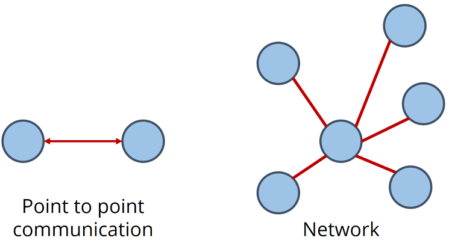
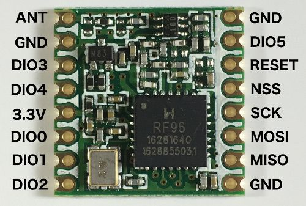

>[Torna a gateway digitale](gateway.md)

## **Gateway mondo cablato - Client LoraWan**

### **Schema di principio**



### **La scheda LoRa RMF95/W**



E' un modem Lora che implementa esclusivamente il **livello fisico** dello stack LoraWan spesso indicato semplicemente come **LoRa**. Sopra di esso può essere utilizzato lo **stack applicativo LoRawan** oppure un qualsiasi altro stack (ad es. **6LowPan e REPL**). 

In ogni caso, le funzioni di **rete** ed **applicative** al di sopra del livello fisico, con il **chip RMF95/W**M vanno implementate in SW mediante apposite **Mlibrerie**M. Se si vuole un **modem** che implementi **in HW** tutto lo **stack LoraWan** si guardi il modulo **Microchip RN2483**.

### **Schema cablaggio**


La lunghezza del filo dipende dalla frequenza:
- 868 MHz: 86,3 mm 
- 915 MHz: 81,9 mm
- 433 MHz: 173,1 mm

Per il nostro modulo dobbiamo utilizzare un filo da 86,3 mm saldato direttamente al pin ANA del ricetrasmettitore. Si noti che l'utilizzo di un'antenna adeguata estenderà il raggio di comunicazione.

### **Librerie del progetto**

La libreria **LMIC** offre un semplice **modello di programmazione** basato sugli **eventi** in cui sono presenti tutti gli eventi del protocollo
inviato alla funzione di callback **onEvent()** dell'applicazione. Per liberare l'applicazione di dettagli come **tempi** o **interruzioni**, la libreria ha un ambiente di runtime integrato per prendersi cura di timer, code e gestione dei lavori (jobs).

**Lavori di un'applicazione**

In questo modello tutto il codice dell'applicazione viene eseguito nei cosiddetti job che vengono eseguiti sul thread principale dallo **schedulatore** dei task run-time **os_runloop()**. Questi lavori di applicazione sono codificati come normali funzioni C e possono essere gestiti a run-time utilizzando apposite funzioni.

Per la **gestione dei jobs** è necessario un **descrittore** del job **osjob_t** che identifica il job e
memorizza le informazioni di **contesto**. I lavori **non** devono essere di **lunga durata** per garantire un funzionamento **senza interruzioni**. Dovrebbero solo **aggiornare lo stato** e **pianificare le azioni**, che attiveranno nuovi **job** o **callback** di eventi.

**Tempi del sistema operativo**

**LMIC** utilizza valori del tipo **```ostime_t```** per rappresentare il tempo in **tick**. Il **rate** di questi tick è predefinito
a 32768 tick al secondo, ma può essere configurato in fase di compilazione su qualsiasi valore compreso tra 10000 tick al secondo e 64516 tic al secondo.

**Loop di eventi principale**

Tutto ciò che un'applicazione deve fare è inizializzare l'ambiente di runtime utilizzando **os_init()** o
**os_init_ex()** e quindi chiama periodicamente la funzione di pianificazione dei lavori (schedulatore) **os_runloop_once()**. Per avviare le azioni del protocollo e generare eventi, è necessario impostare un lavoro iniziale. Pertanto, un job di avvio (startup job) è schedulato (pianificato) utilizzando la funzione **os_setCallback()**.
```C++
osjob_t initjob;
void setup () {
 // initialize run-time env
 os_init();
 // setup initial job
 os_setCallback(&initjob, initfunc);
}
void loop () {
 // execute scheduled jobs and events
 os_runloop_once();
}
```
Il codice di avvio mostrato nella funzione **```initfunc()```** di seguito inizializza il MAC ed esegue il Join alla
rete LoraWan:
```C++
// initial job
static void initfunc (osjob_t* j) {
 // reset MAC state
 LMIC_reset();
 // start joining
 LMIC_startJoining();
 // init done - onEvent() callback will be invoked...
}
```
La funzione **```initfunc()```** non è bloccante ma ritorna immediatamente e lo stato della connessione verrà notificato quando verrà chiamata la funzione di callback **```onEvent()```**. La notifica avviene tramite gli eventi: ```EV_JOINING**```, ```EV_JOINED``` o ```EV_JOIN_FAILED```.


**Callback onEvent()**

Questa funzione di callback può reagire a determinati eventi e attivare nuove azioni in base all'**evento** e allo **stato** della connessione. Tipicamente, un'applicazione non elabora tutti gli eventi ma solo quelli a cui è interessata e pianifica (schedula) ulteriori azioni del protocollo utilizzando le API di LMIC. 

Gli eventi possibili sono:
- EV_JOINING
Il nodo ha iniziato a unirsi alla rete.
- EV_JOINED
Il nodo si è unito con successo alla rete ed è ora pronto per gli scambi di dati.
- EV_JOIN_FAILED
Il nodo non è stato in grado di unirsi alla rete (dopo aver riprovato).
- EV_REJOIN_FAILED
Il nodo non si è unito a una nuova rete ma è ancora connesso alla vecchia rete.
- EV_TXCOMPLETE
I dati preparati tramite LMIC_setTxData() sono stati inviati e la finestra di ricezione per
i dati a valle sono completi. Se è stata richiesta conferma, la conferma è stata
ricevuto. Durante la gestione di questo evento, il codice dovrebbe anche verificare la ricezione dei dati. 
- EV_RXCOMPLETE Solo classe B: è stato ricevuto un downlink in uno slot ping. Il codice dovrebbe controllare i dati di ricezione. 
- EV_SCAN_TIMEOUT Dopo una chiamata a LMIC_enableTracking() non è stato ricevuto alcun beacon entro l'intervallo di beacon.
Il monitoraggio deve essere riavviato.
- EV_BEACON_FOUND Dopo una chiamata a LMIC_enableTracking() il primo beacon è stato ricevuto all'interno dell'intervallo di beacon .
- EV_BEACON_TRACKED Il prossimo segnale è stato ricevuto all'ora prevista.
- EV_BEACON_MISSED Nessun segnale è stato ricevuto all'ora prevista.
- EV_LOST_TSYNC Il segnale è stato perso ripetutamente e la sincronizzazione dell'ora è andata persa. Il onitoraggio o ping deve essere riavviato.
- EV_RESET Ripristino della sessione a causa del rollover dei contatori di sequenza. La rete verrà riconnessa automaticamente a acquisire nuova sessione.
- EV_LINK_DEAD Nessuna conferma è stata ricevuta dal server di rete per un lungo periodo di tempo.
Le trasmissioni sono ancora possibili ma la loro ricezione è incerta.
- EV_LINK_ALIVE Il collegamento era morto, ma ora è di nuovo vivo.
- EV_LINK_DEAD Nessuna conferma è stata ricevuta dal server di rete per un lungo periodo di tempo.
Le trasmissioni sono ancora possibili, ma la loro ricezione è incerta.
- EV_TXSTART Questo evento viene segnalato appena prima di dire al driver radio di iniziare la trasmissione.
- EV_SCAN_FOUND Questo evento è riservato per uso futuro e non viene mai segnalato.
- 
**Funzioni di gestione run-time**


### **Gateway MQTT per il comando di una scheda relè individuato via JSON**

La libreria MQTT è asincrona per cui non bloccante. E' adoperabile sia per **ESP8266** che per **ESP32**.

Il codice seguente, alla ricezione dei messaggi JSON, inviati via MQTT sul topic **"torele"**,  **{"rele1":"0"}** oppure **{"rele1":"1"}** scrive il bit basso o alto sulla **porta di controllo** del relè ivi collegato. **Subito dopo** la scrittura del comando viene effettuata una **lettura dello stato** della stessa porta (la cmdport) e viene inviato il suo valore al server MQTT lungo un **canale di feedback** al topic **"fromrele"**. I **comandi** vengono inviati dal server MQTT sul topic **"torele"**.

**Periodicamente**, grazie ad una **schedulazione** all'interno del loop(), il microcontrollore **invia spontaneamente** lo **stato della porta** del relè con una cadenza memorizzata su interval e impostata a **60 secondi**.

```C++
//#include <WiFiClientSecure.h>
#include <WiFi.h>       // per ESP32
//#include <ESP8266WiFi.h> per ESP8266
#include <AsyncMqttClient.h>
#include <Ticker.h>

#define WIFI_SSID "myssid"
#define WIFI_PASSWORD "mypsw"
#define WIFIRECONNECTIME  2000
#define MQTTRECONNECTIME  2000

Ticker mqttReconnectTimer;
Ticker wifiReconnectTimer;
// Raspberry Pi Mosquitto MQTT Broker
//#define MQTT_HOST IPAddress(192, 168, 1, 254)
#define MQTT_HOST "test.mosquitto.org"
// For a cloud MQTT broker, type the domain name
//#define MQTT_HOST "example.com"
#define MQTT_PORT 1883
// Temperature MQTT Topic
#define MQTT_PUB "fromrele"
#define MQTT_SUB "torele"

//{"rele1":"0"}, {"rele1":"1"}

AsyncMqttClient mqttClient;

unsigned long previousMillis = 0;   // Stores last time temperature was published
const long interval = 60*1000;        // Interval at which to publish sensor readings
byte count = 0;
int8_t ax;
int8_t cmdport = 22;

void connectToWifi() {
  Serial.println("Connecting to Wi-Fi...");
  WiFi.mode(WIFI_STA);
  //WiFi.disconnect();
  WiFi.begin(WIFI_SSID, WIFI_PASSWORD);
}

void connectToMqtt() {
  Serial.println("Connecting to MQTT...");
  mqttClient.connect();
}

void readDataAndPub(){ 
    //crea la stringa JSON
    ax = digitalRead(cmdport);
	String str = "{\"rele1\":\"";
	str += ax;
	str += "\"}";
	
    // Publish an MQTT message on topic esp32/ds18b20/temperature    
    uint16_t packetIdPub1 = mqttClient.publish(MQTT_PUB, 1, true, str.c_str(), str.length());                           
    Serial.print("Pubblicato sul topic %s at QoS 1, packetId: ");
    Serial.println(MQTT_PUB);
    Serial.println(packetIdPub1);
    Serial.print("Messaggio inviato: ");
    Serial.println(str); 
}

void onMqttMessage(char* topic, char* payload, AsyncMqttClientMessageProperties properties, size_t len, size_t index, size_t total) {
  Serial.println("Publish received.");
  Serial.print("  topic: ");
  Serial.println(topic);
  Serial.print("  qos: ");
  Serial.println(properties.qos);
  Serial.print("  dup: ");
  Serial.println(properties.dup);
  Serial.print("  retain: ");
  Serial.println(properties.retain);
  Serial.print("  len: ");
  Serial.println(len);
  Serial.print("  index: ");
  Serial.println(index);
  Serial.print("  total: ");
  Serial.println(total);
  Serial.print("  payload: ");
  Serial.println(payload);
  
  //parsing della stringa JSON
  String instr = String(payload);
  if(instr.indexOf("\"rele1\":\"1\"") >= 0){
	  digitalWrite(cmdport, HIGH);
  }
  if(instr.indexOf("\"rele1\":\"0\"") >= 0){
	  digitalWrite(cmdport, LOW);
  }
  
  Serial.print("Requesting data...");
  readDataAndPub();
  Serial.println("DONE");
}

void WiFiEvent(WiFiEvent_t event) {
  Serial.printf("[WiFi-event] event: %d\n", event);
  switch(event) {
    case SYSTEM_EVENT_STA_GOT_IP:
      Serial.println("WiFi connected");
      Serial.println("IP address: ");
      Serial.println(WiFi.localIP());
      connectToMqtt();
      break;
    case SYSTEM_EVENT_STA_DISCONNECTED:
      Serial.println("WiFi lost connection");
      mqttReconnectTimer.detach(); // ensure we don't reconnect to MQTT while reconnecting to Wi-Fi
      wifiReconnectTimer.once_ms(WIFIRECONNECTIME, connectToWifi);
      break;
  }
}

void onMqttConnect(bool sessionPresent) {
  Serial.println("Connected to MQTT.");
  Serial.print("Session present: ");
  Serial.println(sessionPresent);
  uint16_t packetIdSub = mqttClient.subscribe(MQTT_SUB, 2);
  Serial.print("Subscribing at QoS 2, packetId: ");
  Serial.println(packetIdSub);
}

void onMqttDisconnect(AsyncMqttClientDisconnectReason reason) {
  Serial.println("Disconnected from MQTT.");
  if (WiFi.isConnected()) {
    mqttReconnectTimer.once_ms(MQTTRECONNECTIME, connectToMqtt);
  }
}

void onMqttPublish(uint16_t packetId) {
  Serial.println("Publish acknowledged.");
  Serial.print("  packetId: ");
  Serial.println(packetId);
}

void setup() {
  Serial.begin(115200);
  Serial.println();
  Serial.println();
  delay(2000);
  pinMode(cmdport, OUTPUT);

  WiFi.onEvent(WiFiEvent);

  mqttClient.onConnect(onMqttConnect);
  mqttClient.onDisconnect(onMqttDisconnect);
  mqttClient.onPublish(onMqttPublish);
  mqttClient.onMessage(onMqttMessage);
  mqttClient.setServer(MQTT_HOST, MQTT_PORT);
  // If your broker requires authentication (username and password), set them below
  //mqttClient.setCredentials("REPlACE_WITH_YOUR_USER", "REPLACE_WITH_YOUR_PASSWORD");
  connectToWifi();
  count = 0;
  while (WiFi.status() != WL_CONNECTED && count < 10) {
    delay(500);
    count++;
    Serial.print(".");
  }
}

void loop() {
  unsigned long currentMillis = millis();
  // Every X number of seconds it publishes a new MQTT message
  if (currentMillis - previousMillis >= interval) {
        previousMillis = currentMillis;
    
        Serial.print("Requesting data...");
	readDataAndPub();
	Serial.println("DONE");
  }
}


```
### **Gateway MQTT per il comando di una scheda relè individuato via topic MQTT**

E' anche possibile utilizzare direttamente la **struttura gerarchica dei topic** per creare un **path** che individui univocamente il **nome** di un **comando** o di uno **stato**. Ad esempio: **soggiorno/lampadario1/led4/cmd** per il comando e **soggiorno/lampadario1/led4/state** per lo stato.

Variante del codice precdente in cui, alla ricezione dei messaggi JSON, inviati via MQTT sul topic **"torele1/cmd"** **"0"** oppure **"1"** scrive il bit basso o alto sulla **porta di controllo** del relè ivi collegato. **Subito dopo** la scrittura del comando viene effettuata una **lettura dello stato** della stessa porta (la cmdport) e viene inviato il suo valore al server MQTT lungo un **canale di feedback** al topic **"fromrele1/state"**. I **comandi** vengono inviati dal server MQTT sul topic **"torele1/cmd"**. 

**Periodicamente**, grazie ad una **schedulazione** all'interno del loop(), il microcontrollore **invia spontaneamente** lo **stato della porta** del relè con una cadenza memorizzata su interval e impostata a **60 secondi**.

```C++
//#include <WiFiClientSecure.h>
#include <WiFi.h>       // per ESP32
//#include <ESP8266WiFi.h> per ESP8266
#include <AsyncMqttClient.h>
#include <Ticker.h>

#define WIFI_SSID "myssid"
#define WIFI_PASSWORD "mypsw"
#define WIFIRECONNECTIME  2000
#define MQTTRECONNECTIME  2000

Ticker mqttReconnectTimer;
Ticker wifiReconnectTimer;
// Raspberry Pi Mosquitto MQTT Broker
//#define MQTT_HOST IPAddress(192, 168, 1, 254)
#define MQTT_HOST "test.mosquitto.org"
// For a cloud MQTT broker, type the domain name
//#define MQTT_HOST "example.com"
#define MQTT_PORT 1883
// Temperature MQTT Topic
#define MQTT_PUB "fromrele1/state"
#define MQTT_SUB "torele1/cmd"

AsyncMqttClient mqttClient;

unsigned long previousMillis = 0;   // Stores last time temperature was published
const long interval = 60*1000;        // Interval at which to publish sensor readings
byte count = 0;
int8_t ax;
int8_t cmdport = 22;

void connectToWifi() {
  Serial.println("Connecting to Wi-Fi...");
  WiFi.mode(WIFI_STA);
  //WiFi.disconnect();
  WiFi.begin(WIFI_SSID, WIFI_PASSWORD);
}

void connectToMqtt() {
  Serial.println("Connecting to MQTT...");
  mqttClient.connect();
}

void readDataAndPub(){ 
        //crea la stringa JSON
        ax = digitalRead(cmdport);
	char str[2];
	
	itoa(ax,str,10);
        // Publish an MQTT message on topic esp32/ds18b20/temperature    
	uint16_t packetIdPub1 = mqttClient.publish(MQTT_PUB, 1, true, str, 1);                           
        Serial.print("Pubblicato sul topic %s at QoS 1, packetId: ");
	Serial.println(MQTT_PUB);
        Serial.println(packetIdPub1);
	Serial.print("Messaggio inviato: ");
	Serial.println(str); 
}

void onMqttMessage(char* topic, char* payload, AsyncMqttClientMessageProperties properties, size_t len, size_t index, size_t total) {
  Serial.println("Publish received.");
  Serial.print("  topic: ");
  Serial.println(topic);
  Serial.print("  qos: ");
  Serial.println(properties.qos);
  Serial.print("  dup: ");
  Serial.println(properties.dup);
  Serial.print("  retain: ");
  Serial.println(properties.retain);
  Serial.print("  len: ");
  Serial.println(len);
  Serial.print("  index: ");
  Serial.println(index);
  Serial.print("  total: ");
  Serial.println(total);
  Serial.print("  payload: ");
  Serial.println(payload);
  
  digitalWrite(cmdport, atoi(payload));
  
  Serial.print("Requesting data...");
  readDataAndPub();
  Serial.println("DONE");
}

void WiFiEvent(WiFiEvent_t event) {
  Serial.printf("[WiFi-event] event: %d\n", event);
  switch(event) {
    case SYSTEM_EVENT_STA_GOT_IP:
      Serial.println("WiFi connected");
      Serial.println("IP address: ");
      Serial.println(WiFi.localIP());
      connectToMqtt();
      break;
    case SYSTEM_EVENT_STA_DISCONNECTED:
      Serial.println("WiFi lost connection");
      mqttReconnectTimer.detach(); // ensure we don't reconnect to MQTT while reconnecting to Wi-Fi
      wifiReconnectTimer.once_ms(WIFIRECONNECTIME, connectToWifi);
      break;
  }
}

void onMqttConnect(bool sessionPresent) {
  Serial.println("Connected to MQTT.");
  Serial.print("Session present: ");
  Serial.println(sessionPresent);
  uint16_t packetIdSub = mqttClient.subscribe(MQTT_SUB, 2);
  Serial.print("Subscribing at QoS 2, packetId: ");
  Serial.println(packetIdSub);
}

void onMqttDisconnect(AsyncMqttClientDisconnectReason reason) {
  Serial.println("Disconnected from MQTT.");
  if (WiFi.isConnected()) {
    mqttReconnectTimer.once_ms(MQTTRECONNECTIME, connectToMqtt);
  }
}

void onMqttPublish(uint16_t packetId) {
  Serial.println("Publish acknowledged.");
  Serial.print("  packetId: ");
  Serial.println(packetId);
}

void setup() {
  Serial.begin(115200);
  Serial.println();
  Serial.println();
  delay(2000);
  pinMode(cmdport, OUTPUT);

  WiFi.onEvent(WiFiEvent);

  mqttClient.onConnect(onMqttConnect);
  mqttClient.onDisconnect(onMqttDisconnect);
  mqttClient.onPublish(onMqttPublish);
  mqttClient.onMessage(onMqttMessage);
  mqttClient.setServer(MQTT_HOST, MQTT_PORT);
  // If your broker requires authentication (username and password), set them below
  //mqttClient.setCredentials("REPlACE_WITH_YOUR_USER", "REPLACE_WITH_YOUR_PASSWORD");
  connectToWifi();
  count = 0;
  while (WiFi.status() != WL_CONNECTED && count < 10) {
    delay(500);
    count++;
    Serial.print(".");
  }
}

void loop() {
  unsigned long currentMillis = millis();
  // Every X number of seconds it publishes a new MQTT message
  if (currentMillis - previousMillis >= interval) {
        previousMillis = currentMillis;
    
        Serial.print("Requesting data...");
	readDataAndPub();
	Serial.println("DONE");
  }
}
```

**Sitografia:**

- https://microcontrollerslab.com/esp32-web-server-control-relay-220-volt-lamp/
- https://www.monicoimpianti.net/rele-passo-passo/

>[Torna a gateway digitale](gateway.md)
