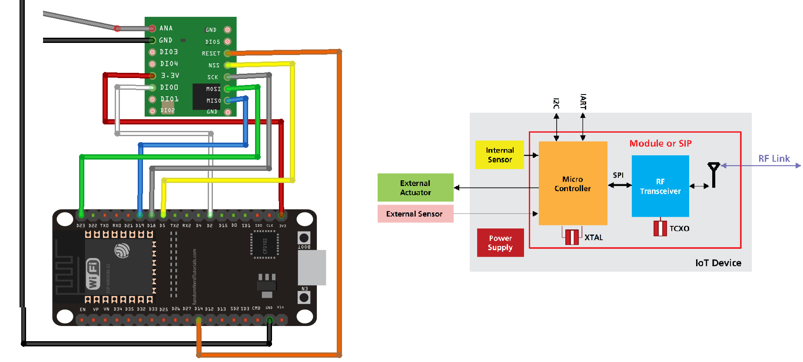

>[Torna a gateway digitale](gateway.md)

## **Gateway mondo cablato - Client LoraWan**

### **Schema di principio**


### **La scheda LoRa RMF95/W**


E' un modem Lora che implementa esclusivamente il **livello fisico** dello stack LoraWan spesso indicato semplicemente come **LoRa**. Sopra di esso può essere utilizzato lo **stack applicativo LoRawan** oppure un qualsiasi altro stack (ad es. **6LowPan e REPL**). 

In ogni caso, le funzioni di **rete** ed **applicative** al di sopra del livello fisico, con il **chip RMF95/W**M vanno implementate in SW mediante apposite **Mlibrerie**M. Se si vuole un **modem** che implementi **in HW** tutto lo **stack LoraWan** si guardi il modulo **Microchip RN2483**.

### **Schema cablaggio**



La lunghezza del filo dipende dalla frequenza:
- 868 MHz: 86,3 mm 
- 915 MHz: 81,9 mm
- 433 MHz: 173,1 mm

Per il nostro modulo dobbiamo utilizzare un filo da 86,3 mm saldato direttamente al pin ANA del ricetrasmettitore. Si noti che l'utilizzo di un'antenna adeguata estenderà il raggio di comunicazione.

### **Modi di autenticazione**

**Attivazione via etere (OTAA)**

L'**attivazione over-the-air (OTAA)** è il modo preferito e più sicuro per connettersi con The Things Network. I dispositivi eseguono una procedura di unione con la rete (join), durante la quale viene assegnato un **DevAddr** dinamico e le **chiavi** di sicurezza vengono **negoziate** con il dispositivo.

**Attivazione tramite personalizzazione (ABP)**

In alcuni casi potrebbe essere necessario codificare il **DevAddr** e le **chiavi di sicurezza** hardcoded nel dispositivo. Ciò significa attivare un dispositivo **tramite personalizzazione (ABP)**. Questa strategia potrebbe sembrare più semplice, perché si salta la procedura di adesione, ma presenta alcuni svantaggi legati alla sicurezza.

**ABP vs OTAA**

In generale, non ci sono inconvenienti nell'utilizzo dell'OTAA rispetto all'utilizzo dell'ABP, ma ci sono alcuni requisiti che devono essere soddisfatti quando si utilizza l'OTAA.La specifica LoRaWAN avverte in modo specifico contro il ricongiungimento sistematico in caso di guasto della rete. Un dispositivo dovrebbe conservare il risultato di un'attivazione in una memoria permanente se si prevede che il dispositivo venga spento e riacceso durante la sua vita:
- un dispositivo ABP utilizza una memoria non volatile per mantenere i contatori di frame tra i riavvii. 
- Un approccio migliore sarebbe passare all'utilizzo di OTAA e memorizzare la sessione OTAA anziché i contatori di frame.

L'unica cosa da tenere a mente è che un join OTAA richiede che il dispositivo finale si trovi all'interno della copertura della rete su cui è registrato. La ragione di ciò è che la procedura di join OTAA richiede che il dispositivo finale sia in grado di ricevere il messaggio di downlink Join Accept dal server di rete.

Un approccio migliore consiste nell'eseguire un join OTAA in una fabbrica o in un'officina in cui è possibile garantire la copertura di rete e i downlink funzionanti. Non ci sono svantaggi in questo approccio finché il dispositivo segue le migliori pratiche LoRaWAN (https://www.thethingsindustries.com/docs/devices/best-practices/).

### **Buone pratiche**

**Connessioni confermate**

È possibile che non si riceva subito un ACK per ogni uplink o downlink di tipo confermato. Una buona regola empirica è attendere almeno tre ACK mancati per presumere la perdita del collegamento.

In caso di perdita del collegamento, procedere come segue:
- Imposta la potenza TX al massimo consentito/supportato e riprova
- Diminuisci gradualmente la velocità dei dati e riprova
- Ripristina i canali predefiniti e riprova
- Invia richieste di adesione periodiche con backoff

**Cicli di alimentazione**

I dispositivi dovrebbero salvare i parametri di rete tra i cicli di alimentazione regolari. Ciò include parametri di sessione come DevAddr, chiavi di sessione, FCnt e nonces. Ciò consente al dispositivo di unirsi facilmente, poiché chiavi e contatori rimangono sincronizzati.

### **Librerie del progetto**

Dal **punto di vista SW** seve **4 librerie** da scaricare dentro la solita cartella **libraries**:
- **Arduino-LMIC library**. Si scarica da https://github.com/mcci-catena/arduino-lmic come arduino-lmic-master.zip da scompattare e rinominare semplicemente come **arduino-lmic**

La libreria **LMIC** offre un semplice **modello di programmazione** basato sugli **eventi** in cui sono presenti tutti gli eventi del protocollo
inviato alla funzione di callback **onEvent()** dell'applicazione. Per liberare l'applicazione di dettagli come **tempi** o **interruzioni**, la libreria ha un ambiente di runtime integrato per prendersi cura di timer, code e gestione dei lavori (jobs).

**Jobs di un'applicazione**

In questo modello tutto il codice dell'applicazione viene eseguito nei cosiddetti job che vengono eseguiti sul thread principale dallo **schedulatore** dei task run-time **os_runloop()**. Questi lavori di applicazione sono codificati come normali funzioni C e possono essere gestiti a run-time utilizzando apposite funzioni.

Per la **gestione dei jobs** è necessario un **descrittore** del job **osjob_t** che identifica il job e
memorizza le informazioni di **contesto**. I lavori **non** devono essere di **lunga durata** per garantire un funzionamento **senza interruzioni**. Dovrebbero solo **aggiornare lo stato** e **pianificare le azioni**, che attiveranno nuovi **job** o **callback** di eventi.

**Tempi del sistema operativo**

**LMIC** utilizza valori del tipo **```ostime_t```** per rappresentare il tempo in **tick**. Il **rate** di questi tick è predefinito
a 32768 tick al secondo, ma può essere configurato in fase di compilazione su qualsiasi valore compreso tra 10000 tick al secondo e 64516 tic al secondo.

**Loop di eventi principale**

Tutto ciò che un'applicazione deve fare è inizializzare l'ambiente di runtime utilizzando **os_init()** o
**os_init_ex()** e quindi chiama periodicamente la funzione di pianificazione dei lavori (schedulatore) **os_runloop_once()**. Per avviare le azioni del protocollo e generare eventi, è necessario impostare un lavoro iniziale. Pertanto, un job di avvio (startup job) è schedulato (pianificato) utilizzando la funzione **os_setCallback()**.
```C++
osjob_t initjob;
void setup () {
 // initialize run-time env
 os_init();
 // setup initial job
 os_setCallback(&initjob, initfunc);
}
void loop () {
 // execute scheduled jobs and events
 os_runloop_once();
}
```
Il codice di avvio mostrato nella funzione **```initfunc()```** di seguito inizializza il MAC ed esegue il Join alla
rete LoraWan:
```C++
// initial job
static void initfunc (osjob_t* j) {
 // reset MAC state
 LMIC_reset();
 // start joining
 LMIC_startJoining();
 // init done - onEvent() callback will be invoked...
}
```
La funzione **```initfunc()```** non è bloccante ma ritorna immediatamente e lo stato della connessione verrà notificato quando verrà chiamata la funzione di callback **```onEvent()```**. La notifica avviene tramite gli eventi: ```EV_JOINING**```, ```EV_JOINED``` o ```EV_JOIN_FAILED```.


**Callback onEvent()**

Questa funzione di callback può reagire a determinati eventi e attivare nuove azioni in base all'**evento** e allo **stato** della connessione. Tipicamente, un'applicazione non elabora tutti gli eventi ma solo quelli a cui è interessata e pianifica (schedula) ulteriori azioni del protocollo utilizzando le API di LMIC. 

Gli eventi possibili sono:
- EV_JOINING
Il nodo ha iniziato a unirsi alla rete.
- EV_JOINED
Il nodo si è unito con successo alla rete ed è ora pronto per gli scambi di dati.
- EV_JOIN_FAILED
Il nodo non è stato in grado di unirsi alla rete (dopo aver riprovato).
- EV_REJOIN_FAILED
Il nodo non si è unito a una nuova rete ma è ancora connesso alla vecchia rete.
- EV_TXCOMPLETE
I dati preparati tramite LMIC_setTxData() sono stati inviati e la finestra di ricezione per
i dati a valle sono completi. Se è stata richiesta conferma, la conferma è stata
ricevuta. Durante la gestione di questo evento, il codice dovrebbe anche verificare la ricezione dei dati. 
- EV_RXCOMPLETE Solo classe B: è stato ricevuto un downlink in uno slot ping. Il codice dovrebbe controllare i dati di ricezione. 
- EV_SCAN_TIMEOUT Dopo una chiamata a LMIC_enableTracking() non è stato ricevuto alcun beacon entro l'intervallo di beacon.
Il monitoraggio deve essere riavviato.
- EV_BEACON_FOUND Dopo una chiamata a LMIC_enableTracking() il primo beacon è stato ricevuto all'interno dell'intervallo di beacon .
- EV_BEACON_TRACKED Il prossimo segnale è stato ricevuto all'ora prevista.
- EV_BEACON_MISSED Nessun segnale è stato ricevuto all'ora prevista.
- EV_LOST_TSYNC Il segnale è stato perso ripetutamente e la sincronizzazione dell'ora è andata persa. Il onitoraggio o ping deve essere riavviato.
- EV_RESET Ripristino della sessione a causa del rollover dei contatori di sequenza. La rete verrà riconnessa automaticamente a acquisire nuova sessione.
- EV_LINK_DEAD Nessuna conferma è stata ricevuta dal server di rete per un lungo periodo di tempo.
Le trasmissioni sono ancora possibili ma la loro ricezione è incerta.
- EV_LINK_ALIVE Il collegamento era morto, ma ora è di nuovo vivo.
- EV_LINK_DEAD Nessuna conferma è stata ricevuta dal server di rete per un lungo periodo di tempo.
Le trasmissioni sono ancora possibili, ma la loro ricezione è incerta.
- EV_TXSTART Questo evento viene segnalato appena prima di dire al driver radio di iniziare la trasmissione.
- EV_SCAN_FOUND Questo evento è riservato per uso futuro e non viene mai segnalato.

**Gestione della ricezioe**

Quando viene ricevuto EV_TXCOMPLETE o EV_RXCOMPLETE, il codice di elaborazione dell'evento dovrebbe controllare se ci sono dati in ricezione (downlink) ed eventualmente passarli all'applicazione. Per fare ciò, si usa un codice come il seguente:
```C++
// Any data to be received?
 if (LMIC.dataLen != 0) {
	 // Data was received. Extract port number if any.
	 u1_t bPort = 0;
	 if (LMIC.txrxFlags & TXRX_PORT)
		 bPort = LMIC.frame[LMIC.dataBeg – 1];
	 // Call user-supplied function with port #, pMessage, nMessage
	 receiveMessage(bPort, LMIC.frame + LMIC.dataBeg, LMIC.dataLen);
 }
```
Se si vuole mettere in guardia il client dell'avvenuta ricezione di messaggi di **lunghezza zero**, deve essere usato un codice leggermente più complesso:
```C++
// Any data to be received?
 if (LMIC.dataLen != 0 || LMIC.dataBeg != 0) {
	 // Data was received. Extract port number if any.
	 u1_t bPort = 0;
	 if (LMIC.txrxFlags & TXRX_PORT)
	 	bPort = LMIC.frame[LMIC.dataBeg – 1];
	 // Call user-supplied function with port #, pMessage, nMessage;
	 // nMessage might be zero.
	 receiveMessage(bPort, LMIC.frame + LMIC.dataBeg, LMIC.dataLen );
 }
```
### **Gateway LoraWan (ttn-abp.ino)**

Si trova, assieme ad altri esempi, nella cartella al link https://github.com/oktavianabd/arduino-lmic/tree/master/examples

```C++
/*******************************************************************************
 * Copyright (c) 2015 Thomas Telkamp and Matthijs Kooijman
 * Copyright (c) 2018 Terry Moore, MCCI
 *
 * Permission is hereby granted, free of charge, to anyone
 * obtaining a copy of this document and accompanying files,
 * to do whatever they want with them without any restriction,
 * including, but not limited to, copying, modification and redistribution.
 * NO WARRANTY OF ANY KIND IS PROVIDED.
 *
 * This example sends a valid LoRaWAN packet with payload "Hello,
 * world!", using frequency and encryption settings matching those of
 * the The Things Network.
 *
 * This uses ABP (Activation-by-personalisation), where a DevAddr and
 * Session keys are preconfigured (unlike OTAA, where a DevEUI and
 * application key is configured, while the DevAddr and session keys are
 * assigned/generated in the over-the-air-activation procedure).
 *
 * Note: LoRaWAN per sub-band duty-cycle limitation is enforced (1% in
 * g1, 0.1% in g2), but not the TTN fair usage policy (which is probably
 * violated by this sketch when left running for longer)!
 *
 * To use this sketch, first register your application and device with
 * the things network, to set or generate a DevAddr, NwkSKey and
 * AppSKey. Each device should have their own unique values for these
 * fields.
 *
 * Do not forget to define the radio type correctly in
 * arduino-lmic/project_config/lmic_project_config.h or from your BOARDS.txt.
 *
 *******************************************************************************/

 // References:
 // [feather] adafruit-feather-m0-radio-with-lora-module.pdf

#include <lmic.h>
#include <hal/hal.h>
#include <SPI.h>

//
// For normal use, we require that you edit the sketch to replace FILLMEIN
// with values assigned by the TTN console. However, for regression tests,
// we want to be able to compile these scripts. The regression tests define
// COMPILE_REGRESSION_TEST, and in that case we define FILLMEIN to a non-
// working but innocuous value.
//
#ifdef COMPILE_REGRESSION_TEST
# define FILLMEIN 0
#else
# warning "You must replace the values marked FILLMEIN with real values from the TTN control panel!"
# define FILLMEIN (#dont edit this, edit the lines that use FILLMEIN)
#endif

// LoRaWAN NwkSKey, network session key
// This should be in big-endian (aka msb).
static const PROGMEM u1_t NWKSKEY[16] = { FILLMEIN };

// LoRaWAN AppSKey, application session key
// This should also be in big-endian (aka msb).
static const u1_t PROGMEM APPSKEY[16] = { FILLMEIN };

// LoRaWAN end-device address (DevAddr)
// See http://thethingsnetwork.org/wiki/AddressSpace
// The library converts the address to network byte order as needed, so this should be in big-endian (aka msb) too.
static const u4_t DEVADDR = FILLMEIN ; // <-- Change this address for every node!

// These callbacks are only used in over-the-air activation, so they are
// left empty here (we cannot leave them out completely unless
// DISABLE_JOIN is set in arduino-lmic/project_config/lmic_project_config.h,
// otherwise the linker will complain).
void os_getArtEui (u1_t* buf) { }
void os_getDevEui (u1_t* buf) { }
void os_getDevKey (u1_t* buf) { }

static uint8_t mydata[] = "Hello, world!";
static osjob_t sendjob;

// Schedule TX every this many seconds (might become longer due to duty
// cycle limitations).
const unsigned TX_INTERVAL = 60;

// Pin mapping
// Adapted for Feather M0 per p.10 of [feather]
const lmic_pinmap lmic_pins = {
    .nss = 8,                       // chip select on feather (rf95module) CS
    .rxtx = LMIC_UNUSED_PIN,
    .rst = 4,                       // reset pin
    .dio = {6, 5, LMIC_UNUSED_PIN}, // assumes external jumpers [feather_lora_jumper]
                                    // DIO1 is on JP1-1: is io1 - we connect to GPO6
                                    // DIO1 is on JP5-3: is D2 - we connect to GPO5
};

void onEvent (ev_t ev) {
    Serial.print(os_getTime());
    Serial.print(": ");
    switch(ev) {
        case EV_SCAN_TIMEOUT:
            Serial.println(F("EV_SCAN_TIMEOUT"));
            break;
        case EV_BEACON_FOUND:
            Serial.println(F("EV_BEACON_FOUND"));
            break;
        case EV_BEACON_MISSED:
            Serial.println(F("EV_BEACON_MISSED"));
            break;
        case EV_BEACON_TRACKED:
            Serial.println(F("EV_BEACON_TRACKED"));
            break;
        case EV_JOINING:
            Serial.println(F("EV_JOINING"));
            break;
        case EV_JOINED:
            Serial.println(F("EV_JOINED"));
            break;
        /*
        || This event is defined but not used in the code. No
        || point in wasting codespace on it.
        ||
        || case EV_RFU1:
        ||     Serial.println(F("EV_RFU1"));
        ||     break;
        */
        case EV_JOIN_FAILED:
            Serial.println(F("EV_JOIN_FAILED"));
            break;
        case EV_REJOIN_FAILED:
            Serial.println(F("EV_REJOIN_FAILED"));
            break;
        case EV_TXCOMPLETE:
            Serial.println(F("EV_TXCOMPLETE (includes waiting for RX windows)"));
            if (LMIC.txrxFlags & TXRX_ACK)
              Serial.println(F("Received ack"));
            if (LMIC.dataLen) {
              Serial.println(F("Received "));
              Serial.println(LMIC.dataLen);
              Serial.println(F(" bytes of payload"));
            }
            // Schedule next transmission
            os_setTimedCallback(&sendjob, os_getTime()+sec2osticks(TX_INTERVAL), do_send);
            break;
        case EV_LOST_TSYNC:
            Serial.println(F("EV_LOST_TSYNC"));
            break;
        case EV_RESET:
            Serial.println(F("EV_RESET"));
            break;
        case EV_RXCOMPLETE:
            // data received in ping slot
            Serial.println(F("EV_RXCOMPLETE"));
            break;
        case EV_LINK_DEAD:
            Serial.println(F("EV_LINK_DEAD"));
            break;
        case EV_LINK_ALIVE:
            Serial.println(F("EV_LINK_ALIVE"));
            break;
        /*
        || This event is defined but not used in the code. No
        || point in wasting codespace on it.
        ||
        || case EV_SCAN_FOUND:
        ||    Serial.println(F("EV_SCAN_FOUND"));
        ||    break;
        */
        case EV_TXSTART:
            Serial.println(F("EV_TXSTART"));
            break;
        default:
            Serial.print(F("Unknown event: "));
            Serial.println((unsigned) ev);
            break;
    }
}

void do_send(osjob_t* j){
    // Check if there is not a current TX/RX job running
    if (LMIC.opmode & OP_TXRXPEND) {
        Serial.println(F("OP_TXRXPEND, not sending"));
    } else {
        // Prepare upstream data transmission at the next possible time.
        LMIC_setTxData2(1, mydata, sizeof(mydata)-1, 0);
        Serial.println(F("Packet queued"));
    }
    // Next TX is scheduled after TX_COMPLETE event.
}

void setup() {
//    pinMode(13, OUTPUT);
    while (!Serial); // wait for Serial to be initialized
    Serial.begin(115200);
    delay(100);     // per sample code on RF_95 test
    Serial.println(F("Starting"));

    #ifdef VCC_ENABLE
    // For Pinoccio Scout boards
    pinMode(VCC_ENABLE, OUTPUT);
    digitalWrite(VCC_ENABLE, HIGH);
    delay(1000);
    #endif

    // LMIC init
    os_init();
    // Reset the MAC state. Session and pending data transfers will be discarded.
    LMIC_reset();

    // Set static session parameters. Instead of dynamically establishing a session
    // by joining the network, precomputed session parameters are be provided.
    #ifdef PROGMEM
    // On AVR, these values are stored in flash and only copied to RAM
    // once. Copy them to a temporary buffer here, LMIC_setSession will
    // copy them into a buffer of its own again.
    uint8_t appskey[sizeof(APPSKEY)];
    uint8_t nwkskey[sizeof(NWKSKEY)];
    memcpy_P(appskey, APPSKEY, sizeof(APPSKEY));
    memcpy_P(nwkskey, NWKSKEY, sizeof(NWKSKEY));
    LMIC_setSession (0x13, DEVADDR, nwkskey, appskey);
    #else
    // If not running an AVR with PROGMEM, just use the arrays directly
    LMIC_setSession (0x13, DEVADDR, NWKSKEY, APPSKEY);
    #endif

    #if defined(CFG_eu868)
    // Set up the channels used by the Things Network, which corresponds
    // to the defaults of most gateways. Without this, only three base
    // channels from the LoRaWAN specification are used, which certainly
    // works, so it is good for debugging, but can overload those
    // frequencies, so be sure to configure the full frequency range of
    // your network here (unless your network autoconfigures them).
    // Setting up channels should happen after LMIC_setSession, as that
    // configures the minimal channel set.
    LMIC_setupChannel(0, 868100000, DR_RANGE_MAP(DR_SF12, DR_SF7),  BAND_CENTI);      // g-band
    LMIC_setupChannel(1, 868300000, DR_RANGE_MAP(DR_SF12, DR_SF7B), BAND_CENTI);      // g-band
    LMIC_setupChannel(2, 868500000, DR_RANGE_MAP(DR_SF12, DR_SF7),  BAND_CENTI);      // g-band
    LMIC_setupChannel(3, 867100000, DR_RANGE_MAP(DR_SF12, DR_SF7),  BAND_CENTI);      // g-band
    LMIC_setupChannel(4, 867300000, DR_RANGE_MAP(DR_SF12, DR_SF7),  BAND_CENTI);      // g-band
    LMIC_setupChannel(5, 867500000, DR_RANGE_MAP(DR_SF12, DR_SF7),  BAND_CENTI);      // g-band
    LMIC_setupChannel(6, 867700000, DR_RANGE_MAP(DR_SF12, DR_SF7),  BAND_CENTI);      // g-band
    LMIC_setupChannel(7, 867900000, DR_RANGE_MAP(DR_SF12, DR_SF7),  BAND_CENTI);      // g-band
    LMIC_setupChannel(8, 868800000, DR_RANGE_MAP(DR_FSK,  DR_FSK),  BAND_MILLI);      // g2-band
    // TTN defines an additional channel at 869.525Mhz using SF9 for class B
    // devices' ping slots. LMIC does not have an easy way to define set this
    // frequency and support for class B is spotty and untested, so this
    // frequency is not configured here.
    #elif defined(CFG_us915)
    // NA-US channels 0-71 are configured automatically
    // but only one group of 8 should (a subband) should be active
    // TTN recommends the second sub band, 1 in a zero based count.
    // https://github.com/TheThingsNetwork/gateway-conf/blob/master/US-global_conf.json
    LMIC_selectSubBand(1);
    #endif

    // Disable link check validation
    LMIC_setLinkCheckMode(0);

    // TTN uses SF9 for its RX2 window.
    LMIC.dn2Dr = DR_SF9;

    // Set data rate and transmit power for uplink
    LMIC_setDrTxpow(DR_SF7,14);

    // Start job
    do_send(&sendjob);
}

void loop() {
    unsigned long now;
    now = millis();
    if ((now & 512) != 0) {
      digitalWrite(13, HIGH);
    }
    else {
      digitalWrite(13, LOW);
    }

    os_runloop_once();

}
```

### **Gateway LoraWan con deepSleep**

```C++
#include <arduino.h>
#include <lmic.h>
#include <hal/hal.h>
#include <SPI.h>
#include <ttn_credentials.h>

bool GOTO_DEEPSLEEP = false;

// rename ttn_credentials.h.example to ttn_credentials.h and add you keys
static const u1_t PROGMEM APPEUI[8] = TTN_APPEUI;
static const u1_t PROGMEM DEVEUI[8] = TTN_DEVEUI;
static const u1_t PROGMEM APPKEY[16] = TTN_APPKEY;
void os_getArtEui(u1_t *buf) { memcpy_P(buf, APPEUI, 8); }
void os_getDevEui(u1_t *buf) { memcpy_P(buf, DEVEUI, 8); }
void os_getDevKey(u1_t *buf) { memcpy_P(buf, APPKEY, 16); }

static uint8_t mydata[] = "Test";
static osjob_t sendjob;

// Schedule TX every this many seconds
// Respect Fair Access Policy and Maximum Duty Cycle!
// https://www.thethingsnetwork.org/docs/lorawan/duty-cycle.html
// https://www.loratools.nl/#/airtime
const unsigned TX_INTERVAL = 30;

// Saves the LMIC structure during DeepSleep
RTC_DATA_ATTR lmic_t RTC_LMIC;

#define PIN_LMIC_NSS 18
#define PIN_LMIC_RST 14
#define PIN_LMIC_DIO0 26
#define PIN_LMIC_DIO1 33
#define PIN_LMIC_DIO2 32

// Pin mapping
const lmic_pinmap lmic_pins = {
    .nss = PIN_LMIC_NSS,
    .rxtx = LMIC_UNUSED_PIN,
    .rst = PIN_LMIC_RST,
    .dio = {PIN_LMIC_DIO0, PIN_LMIC_DIO1, PIN_LMIC_DIO2},
};

// opmode def
// https://github.com/mcci-catena/arduino-lmic/blob/89c28c5888338f8fc851851bb64968f2a493462f/src/lmic/lmic.h#L233
void LoraWANPrintLMICOpmode(void)
{
    Serial.print(F("LMIC.opmode: "));
    if (LMIC.opmode & OP_NONE)
    {
        Serial.print(F("OP_NONE "));
    }
    if (LMIC.opmode & OP_SCAN)
    {
        Serial.print(F("OP_SCAN "));
    }
    if (LMIC.opmode & OP_TRACK)
    {
        Serial.print(F("OP_TRACK "));
    }
    if (LMIC.opmode & OP_JOINING)
    {
        Serial.print(F("OP_JOINING "));
    }
    if (LMIC.opmode & OP_TXDATA)
    {
        Serial.print(F("OP_TXDATA "));
    }
    if (LMIC.opmode & OP_POLL)
    {
        Serial.print(F("OP_POLL "));
    }
    if (LMIC.opmode & OP_REJOIN)
    {
        Serial.print(F("OP_REJOIN "));
    }
    if (LMIC.opmode & OP_SHUTDOWN)
    {
        Serial.print(F("OP_SHUTDOWN "));
    }
    if (LMIC.opmode & OP_TXRXPEND)
    {
        Serial.print(F("OP_TXRXPEND "));
    }
    if (LMIC.opmode & OP_RNDTX)
    {
        Serial.print(F("OP_RNDTX "));
    }
    if (LMIC.opmode & OP_PINGINI)
    {
        Serial.print(F("OP_PINGINI "));
    }
    if (LMIC.opmode & OP_PINGABLE)
    {
        Serial.print(F("OP_PINGABLE "));
    }
    if (LMIC.opmode & OP_NEXTCHNL)
    {
        Serial.print(F("OP_NEXTCHNL "));
    }
    if (LMIC.opmode & OP_LINKDEAD)
    {
        Serial.print(F("OP_LINKDEAD "));
    }
    if (LMIC.opmode & OP_LINKDEAD)
    {
        Serial.print(F("OP_LINKDEAD "));
    }
    if (LMIC.opmode & OP_TESTMODE)
    {
        Serial.print(F("OP_TESTMODE "));
    }
    if (LMIC.opmode & OP_UNJOIN)
    {
        Serial.print(F("OP_UNJOIN "));
    }
}

void LoraWANDebug(lmic_t lmic_check)
{
    Serial.println("");
    Serial.println("");

    LoraWANPrintLMICOpmode();
    Serial.println("");

    Serial.print(F("LMIC.seqnoUp = "));
    Serial.println(lmic_check.seqnoUp);

    Serial.print(F("LMIC.globalDutyRate = "));
    Serial.print(lmic_check.globalDutyRate);
    Serial.print(F(" osTicks, "));
    Serial.print(osticks2ms(lmic_check.globalDutyRate) / 1000);
    Serial.println(F(" sec"));

    Serial.print(F("LMIC.globalDutyAvail = "));
    Serial.print(lmic_check.globalDutyAvail);
    Serial.print(F(" osTicks, "));
    Serial.print(osticks2ms(lmic_check.globalDutyAvail) / 1000);
    Serial.println(F(" sec"));

    Serial.print(F("LMICbandplan_nextTx = "));
    Serial.print(LMICbandplan_nextTx(os_getTime()));
    Serial.print(F(" osTicks, "));
    Serial.print(osticks2ms(LMICbandplan_nextTx(os_getTime())) / 1000);
    Serial.println(F(" sec"));

    Serial.print(F("os_getTime = "));
    Serial.print(os_getTime());
    Serial.print(F(" osTicks, "));
    Serial.print(osticks2ms(os_getTime()) / 1000);
    Serial.println(F(" sec"));

    Serial.print(F("LMIC.txend = "));
    Serial.println(lmic_check.txend);
    Serial.print(F("LMIC.txChnl = "));
    Serial.println(lmic_check.txChnl);

    Serial.println(F("Band \tavail \t\tavail_sec\tlastchnl \ttxcap"));
    for (u1_t bi = 0; bi < MAX_BANDS; bi++)
    {
        Serial.print(bi);
        Serial.print("\t");
        Serial.print(lmic_check.bands[bi].avail);
        Serial.print("\t\t");
        Serial.print(osticks2ms(lmic_check.bands[bi].avail) / 1000);
        Serial.print("\t\t");
        Serial.print(lmic_check.bands[bi].lastchnl);
        Serial.print("\t\t");
        Serial.println(lmic_check.bands[bi].txcap);
    }
    Serial.println("");
    Serial.println("");
}

void PrintRuntime()
{
    long seconds = millis() / 1000;
    Serial.print("Runtime: ");
    Serial.print(seconds);
    Serial.println(" seconds");
}

void PrintLMICVersion()
{
    Serial.print(F("LMIC: "));
    Serial.print(ARDUINO_LMIC_VERSION_GET_MAJOR(ARDUINO_LMIC_VERSION));
    Serial.print(F("."));
    Serial.print(ARDUINO_LMIC_VERSION_GET_MINOR(ARDUINO_LMIC_VERSION));
    Serial.print(F("."));
    Serial.print(ARDUINO_LMIC_VERSION_GET_PATCH(ARDUINO_LMIC_VERSION));
    Serial.print(F("."));
    Serial.println(ARDUINO_LMIC_VERSION_GET_LOCAL(ARDUINO_LMIC_VERSION));
}

void onEvent(ev_t ev)
{
    Serial.print(os_getTime());
    Serial.print(": ");
    switch (ev)
    {
    case EV_SCAN_TIMEOUT:
        Serial.println(F("EV_SCAN_TIMEOUT"));
        break;
    case EV_BEACON_FOUND:
        Serial.println(F("EV_BEACON_FOUND"));
        break;
    case EV_BEACON_MISSED:
        Serial.println(F("EV_BEACON_MISSED"));
        break;
    case EV_BEACON_TRACKED:
        Serial.println(F("EV_BEACON_TRACKED"));
        break;
    case EV_JOINING:
        Serial.println(F("EV_JOINING"));
        break;
    case EV_JOINED:
        Serial.println(F("EV_JOINED"));
        {
            u4_t netid = 0;
            devaddr_t devaddr = 0;
            u1_t nwkKey[16];
            u1_t artKey[16];
            LMIC_getSessionKeys(&netid, &devaddr, nwkKey, artKey);
            Serial.print("netid: ");
            Serial.println(netid, DEC);
            Serial.print("devaddr: ");
            Serial.println(devaddr, HEX);
            Serial.print("artKey: ");
            for (size_t i = 0; i < sizeof(artKey); ++i)
            {
                Serial.print(artKey[i], HEX);
            }
            Serial.println("");
            Serial.print("nwkKey: ");
            for (size_t i = 0; i < sizeof(nwkKey); ++i)
            {
                Serial.print(nwkKey[i], HEX);
            }
            Serial.println("");
        }
        // Disable link check validation (automatically enabled
        // during join, but because slow data rates change max TX
        // size, we don't use it in this example.
        LMIC_setLinkCheckMode(0);
        break;
    /*
        || This event is defined but not used in the code. No
        || point in wasting codespace on it.
        ||
        || case EV_RFU1:
        ||     Serial.println(F("EV_RFU1"));
        ||     break;
        */
    case EV_JOIN_FAILED:
        Serial.println(F("EV_JOIN_FAILED"));
        break;
    case EV_REJOIN_FAILED:
        Serial.println(F("EV_REJOIN_FAILED"));
        break;
    case EV_TXCOMPLETE:
        Serial.println(F("EV_TXCOMPLETE (includes waiting for RX windows)"));
        if (LMIC.txrxFlags & TXRX_ACK)
            Serial.println(F("Received ack"));
        if (LMIC.dataLen)
        {
            Serial.print(F("Received "));
            Serial.print(LMIC.dataLen);
            Serial.println(F(" bytes of payload"));
        }
        GOTO_DEEPSLEEP = true;
        break;
    case EV_LOST_TSYNC:
        Serial.println(F("EV_LOST_TSYNC"));
        break;
    case EV_RESET:
        Serial.println(F("EV_RESET"));
        break;
    case EV_RXCOMPLETE:
        // data received in ping slot
        Serial.println(F("EV_RXCOMPLETE"));
        break;
    case EV_LINK_DEAD:
        Serial.println(F("EV_LINK_DEAD"));
        break;
    case EV_LINK_ALIVE:
        Serial.println(F("EV_LINK_ALIVE"));
        break;
    /*
        || This event is defined but not used in the code. No
        || point in wasting codespace on it.
        ||
        || case EV_SCAN_FOUND:
        ||    Serial.println(F("EV_SCAN_FOUND"));
        ||    break;
        */
    case EV_TXSTART:
        Serial.println(F("EV_TXSTART"));
        break;
    case EV_TXCANCELED:
        Serial.println(F("EV_TXCANCELED"));
        break;
    case EV_RXSTART:
        /* do not print anything -- it wrecks timing */
        break;
    case EV_JOIN_TXCOMPLETE:
        Serial.println(F("EV_JOIN_TXCOMPLETE: no JoinAccept"));
        break;
    default:
        Serial.print(F("Unknown event: "));
        Serial.println((unsigned)ev);
        break;
    }
}

void do_send(osjob_t *j)
{
    // Check if there is not a current TX/RX job running
    if (LMIC.opmode & OP_TXRXPEND)
    {
        Serial.println(F("OP_TXRXPEND, not sending"));
    }
    else
    {
        // Prepare upstream data transmission at the next possible time.
        LMIC_setTxData2(1, mydata, sizeof(mydata) - 1, 0);
        Serial.println(F("Packet queued"));
    }
    // Next TX is scheduled after TX_COMPLETE event.
}

void SaveLMICToRTC(int deepsleep_sec)
{
    Serial.println(F("Save LMIC to RTC"));
    RTC_LMIC = LMIC;

    // ESP32 can't track millis during DeepSleep and no option to advanced millis after DeepSleep.
    // Therefore reset DutyCyles

    unsigned long now = millis();

    // EU Like Bands
#if defined(CFG_LMIC_EU_like)
    Serial.println(F("Reset CFG_LMIC_EU_like band avail"));
    for (int i = 0; i < MAX_BANDS; i++)
    {
        ostime_t correctedAvail = RTC_LMIC.bands[i].avail - ((now / 1000.0 + deepsleep_sec) * OSTICKS_PER_SEC);
        if (correctedAvail < 0)
        {
            correctedAvail = 0;
        }
        RTC_LMIC.bands[i].avail = correctedAvail;
    }

    RTC_LMIC.globalDutyAvail = RTC_LMIC.globalDutyAvail - ((now / 1000.0 + deepsleep_sec) * OSTICKS_PER_SEC);
    if (RTC_LMIC.globalDutyAvail < 0)
    {
        RTC_LMIC.globalDutyAvail = 0;
    }
#else
    Serial.println(F("No DutyCycle recalculation function!"));
#endif
}

void LoadLMICFromRTC()
{
    Serial.println(F("Load LMIC from RTC"));
    LMIC = RTC_LMIC;
}

void GoDeepSleep()
{
    Serial.println(F("Go DeepSleep"));
    PrintRuntime();
    Serial.flush();
    esp_sleep_enable_timer_wakeup(TX_INTERVAL * 1000000);
    esp_deep_sleep_start();
}

void setup()
{
    Serial.begin(115200);

    Serial.println(F("Starting DeepSleep test"));
    PrintLMICVersion();

    // LMIC init
    os_init();

    // Reset the MAC state. Session and pending data transfers will be discarded.
    LMIC_reset();

    if (RTC_LMIC.seqnoUp != 0)
    {
        LoadLMICFromRTC();
    }

    LoraWANDebug(LMIC);

    // Start job (sending automatically starts OTAA too)
    do_send(&sendjob);
}

void loop()
{
    static unsigned long lastPrintTime = 0;

    os_runloop_once();

    const bool timeCriticalJobs = os_queryTimeCriticalJobs(ms2osticksRound((TX_INTERVAL * 1000)));
    if (!timeCriticalJobs && GOTO_DEEPSLEEP == true && !(LMIC.opmode & OP_TXRXPEND))
    {
        Serial.print(F("Can go sleep "));
        LoraWANPrintLMICOpmode();
        SaveLMICToRTC(TX_INTERVAL);
        GoDeepSleep();
    }
    else if (millis() - lastPrintTime > 2000)
    {
        Serial.print(F("Cannot sleep "));
        Serial.print(F("TimeCriticalJobs: "));
        Serial.print(timeCriticalJobs);
        Serial.print(" ");

        LoraWANPrintLMICOpmode();
        PrintRuntime();
        lastPrintTime = millis();
    }
}

```
### **APPENDICE DI CONSULTAZIONE**

 **Funzioni di gestione run-time**

- ```void os_init()``` Inizializza il sistema operativo chiamando os_init_ex(NULL).
- void os_init_ex (const void * pHalData) Per facilitare l'uso di questa libreria su più piattaforme, la routine os_init_ex() prende un puntatore arbitrario ai dati della piattaforma. L'implementazione HAL predefinita di Arduino LMIC prevede che questo puntatore sia un riferimento a un oggetto C++ struct lmic_pinmap. Vedere README.md per ulteriori informazioni.
- ```void os_setCallback (osjob_t* job, osjobcb_t cb)``` Prepara un job immediatamente eseguibile. Questa funzione può essere chiamata in qualsiasi momento, anche dai contesti del gestore di interrupt (ad es. se è diventato disponibile un nuovo valore del sensore).
- ```void os_setTimedCallback (osjob_t* job, ostime_t time, osjobcb_t cb)``` Pianifica un lavoro a tempo da eseguire con il timestamp specificato (ora di sistema assoluta). Questa funzione può essere chiamata in qualsiasi momento, anche dai contesti del gestore di interrupt.
- ```void os_clearCallback (osjob_t* job)``` Annulla un processo di runtime. Un processo di runtime pianificato in precedenza viene rimosso dal timer e dalle code di esecuzione. Il lavoro è identificato dall'indirizzo della struttura del lavoro. La funzione non ha effetto se il lavoro specificato non è ancora pianificato.
- ```void os_runloop()``` Esegue i lavori di runtime dal timer e dalle code di esecuzione. Questa funzione è il principale distributore di azioni. Non ritorna e deve essere eseguito sul thread principale. Questa routine non viene normalmente utilizzata in
Ambienti Arduino, in quanto disabilita la normale chiamata della funzione Arduino loop().
- ```void os_runloop_once()``` Esegue i lavori di runtime dal timer e dalle code di esecuzione. Questa funzione è proprio come os_runloop(), tranne per il fatto che ritorna dopo aver inviato il primo lavoro disponibile.
- ```ostime_t os_getTime()``` Interroga l'ora di sistema assoluta (in tick).
- ```ostime_t us2osticks(s4_t us)``` Restituisce i tick corrispondenti al valore intero us. Questa potrebbe essere una macro simile a una funzione, quindi potrebbe essere valutata più di una volta. Qualsiasi parte frazionaria del calcolo viene scartata.
ostime_t us2osticksCeil(s4_t us) Restituisce i tick corrispondenti al valore intero us. Questa potrebbe essere una macro simile a una funzione, quindi potrebbe essere valutata più di una volta. Se la parte frazionaria del calcolo è diversa da zero, il risultato viene aumentato verso l'infinito positivo.
- ```ostime_t us2osticksRound(s4_t us)``` Restituisce i tick corrispondenti al valore intero us. Questa potrebbe essere una macro simile a una funzione, quindi potrebbe essere valutata più di una volta. Il risultato viene arrotondato al segno di spunta più vicino.
- ```ostime_t ms2osticks(s4_t ms)``` Restituisce i tick corrispondenti al valore intero in millisecondi ms. Questa potrebbe essere una macro simile a una funzione, quindi ms può essere valutato più di una volta. Se la parte frazionaria del calcolo è diversa da zero, il risultato viene aumentato verso l'infinito positivo.
- ```ostime_t ms2osticksCeil(s4_t ms)``` Restituisce i tick corrispondenti al valore intero in millisecondi ms. Questa potrebbe essere una macro simile a una funzione, quindi ms può essere valutato più di una volta.
- ```ostime_t ms2osticksRound(s4_t ms)``` Restituisce i tick corrispondenti al valore intero in millisecondi ms. Questa potrebbe essere una macro simile a una funzione, quindi ms può essere valutato più di una volta. Il risultato viene arrotondato al segno di spunta più vicino.
- ```ostime_t us2osticks(s4_t sec)``` Restituisce i tick corrispondenti al secondo valore intero sec. Questa potrebbe essere una macro simile a una funzione, quindi sec può essere valutato più di una volta.
- ```S4_t osticks2ms(ostime_t os)``` Restituisce i millisecondi corrispondenti al valore di tick os. Questa potrebbe essere una macro simile a una funzione, quindi os può essere valutato più di una volta.
- ```S4_t osticks2us(ostime_t os)``` Restituisce i microsecondi corrispondenti al valore di tick os. Questa potrebbe essere una macro simile a una funzione, quindi os può essere valutato più di una volta.

**Callbacks dell'applicazione**

Oltre la ```void onEvent (ev_t ev)```, la libreria LMIC richiede che l'applicazione implementi alcune funzioni di callback. Queste funzioni verranno chiamate dal motore di stato per eseguire query su informazioni specifiche dell'applicazione e per fornire eventi di stato all'applicazione.
- ```void os_getDevEui (u1_t* buf)``` L'implementazione di questa funzione di callback deve fornire l'EUI del dispositivo e copiarlo nel buffer specificato. L'EUI del dispositivo ha una lunghezza di 8 byte ed è memorizzato in formato little-endian, ovvero il primo byte meno significativo (LSBF).
- ```void os_getDevKey (u1_t* buf)``` L'implementazione di questa funzione di callback deve fornire la chiave dell'applicazione crittografica specifica del dispositivo e copiarla nel buffer specificato. La chiave dell'applicazione specifica del dispositivo è una chiave AES a 128 bit (16 byte di lunghezza). Modello di programmazione e API Arduino LoRaWAN MAC in C (LMIC) Specifiche tecniche 11
- ```void os_getArtEui (u1_t* buf)``` L'implementazione di questa funzione di callback deve fornire l'applicazione EUI e copiarla nel dato
respingente. L'EUI dell'applicazione ha una lunghezza di 8 byte ed è memorizzata in formato little-endian, ovvero lesssignificant-byte-first (LSBF).


### **Sitografia:**

- https://redmine.laas.fr/attachments/download/1505/LMIC-v2.3.pdf
- https://randomnerdtutorials.com/esp32-lora-rfm95-transceiver-arduino-ide/
- https://jackgruber.github.io/2020-04-13-ESP32-DeepSleep-and-LoraWAN-OTAA-join/

>[Torna a gateway digitale](gateway.md)
