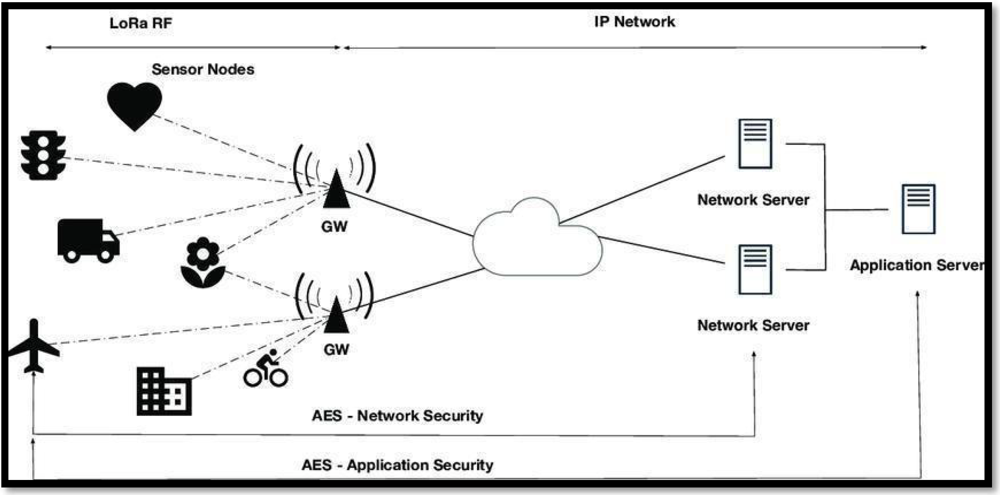
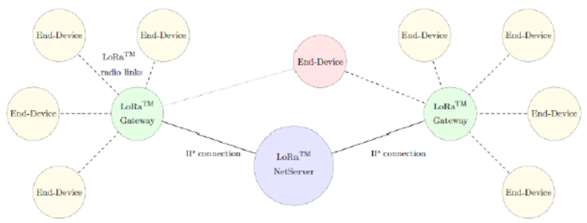
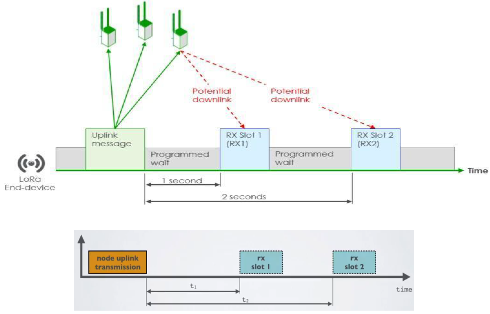
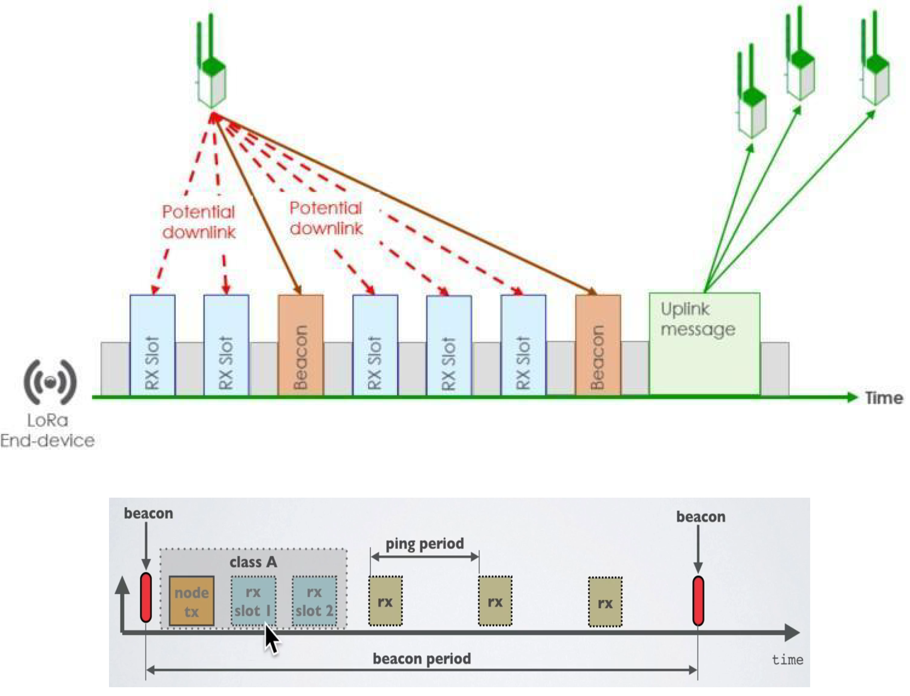
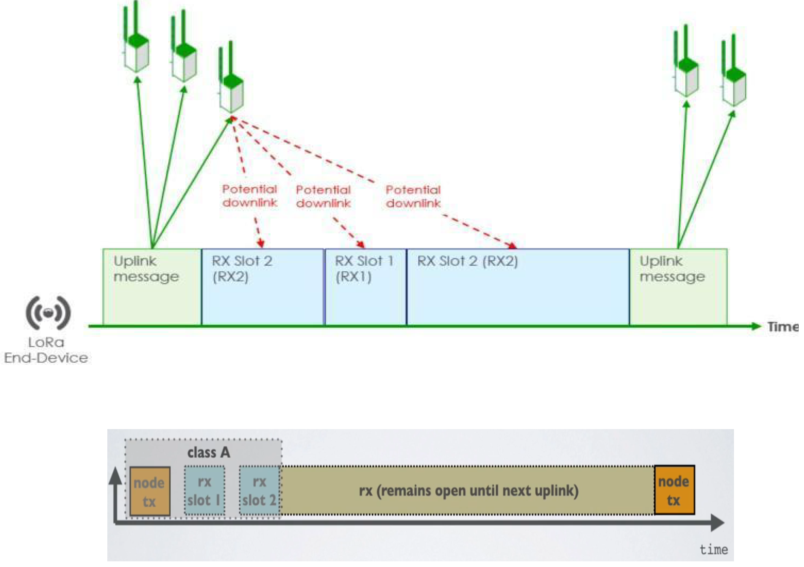
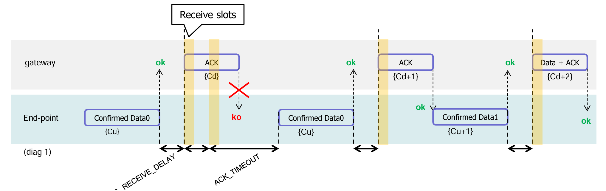
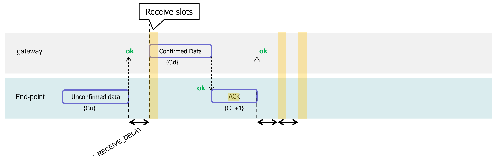
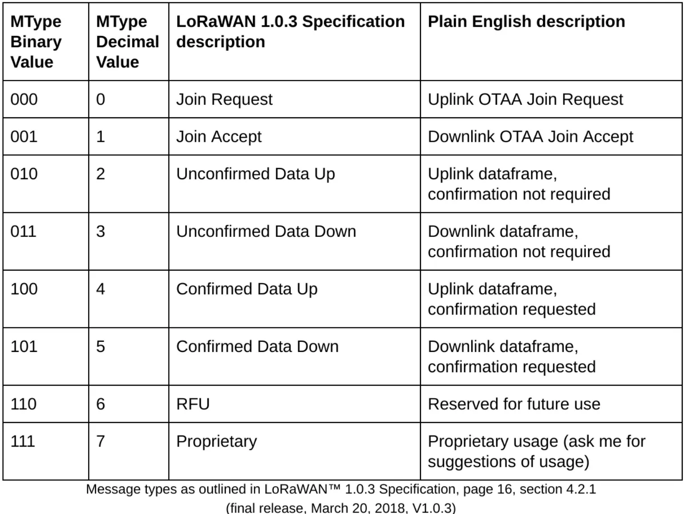

>[Torna a reti di sensori](sensornetworkshort.md#reti-di-sensori-e-attuatori)

Di seguito è riportata l'architettura generale di una rete Lorawan. Essa è composta, a **livello fisico**, essenzialmente di una **rete di accesso** ai sensori e da una **rete di distribuzione** che fa da collante di ciascuna rete di sensori.

La rete di sensori fisica è a stella dove il centro stella è il gateway. Un sensore può anche essere associato a più gateway ed inviare dati a tutti i gateway a cui esso è associato. I dati normalmente arrivano ad un certo dispositivo attraverso un solo gateway.

I gateway utilizzano la rete internet (o una LAN) per realizzare un collegamento diretto **virtuale** con il network server, per cui, in definitiva, la topologia risultante è:
- **fisicamente** quella di più **reti di accesso** a stella tenute insieme da una **rete di distribuzione** qualsiasi purchè sia di tipo TCP/IP (LAN o Internet).
- **logicamente** quella di una stella di reti a stella. Il **centrostella** di livello gerarchico più alto è il **network server** ed aggrega solo gateways, gli altri centrostella sono realizzati dai **gateway** che aggregano solamente **dispositivi IoT**.

  

  La specifica LoRaWAN definisce tre classi di dispositivi:

- **A(ll)** Dispositivi alimentati a batteria. Ogni dispositivo effettua il collegamento in uplink al gateway ed è seguito da due brevi finestre di ricezione del downlink.
- **B(eacon)** Come la classe A ma questi dispositivi aprono anche finestre di ricezione aggiuntive a orari programmati.
- **C(continuo)** Uguale ad A ma questi dispositivi sono in ascolto continuo. Pertanto questi dispositivi consumano più energia e sono spesso alimentati dalla rete elettrica.

### **Classe A**

In qualsiasi momento un nodo terminale può trasmettere un segnale. Dopo questa trasmissione uplink (tx) il nodo finale ascolterà una risposta dal gateway.

Il nodo terminale apre due slot di ricezione in t1 e t2 secondi dopo una trasmissione uplink. Il gateway può rispondere all'interno del primo slot di ricezione o del secondo slot di ricezione, ma non in entrambi. I dispositivi di classe B e C devono supportare anche la funzionalità di classe A.

  

### **Classe B**

Oltre agli slot di ricezione di Classe A, i dispositivi di classe B aprono slot di ricezione aggiuntivi a orari programmati.

Il nodo terminale riceve un beacon sincronizzato col tempo dal gateway, consentendo al gateway di sapere quando il nodo è in ascolto. Un dispositivo di classe B non supporta la funzionalità del dispositivo C.

Il beacon viene inviato ogni 128 secondi a partire dalle 00:00:00 Coordinated Universal Time 13 (UTC), 1 gennaio 1970 più NwkID più TBeaconDelay. 

TBeaconDelay è un ritardo specifico della rete scelto nell'intervallo [0:50] ms. TBeaconDelay può variare da una rete all'altra ed è pensato per consentire un leggero ritardo di trasmissione dei gateway. TBeaconDelay deve essere lo stesso per tutti i gateway di una determinata rete. Tutti gli slot di ping dei dispositivi terminali utilizzano il tempo di trasmissione del beacon come riferimento temporale, pertanto il server di rete deve tenere in considerazione questo tempo quando pianifica i downlink di classe B.

  

### **Classe C**

Oltre agli slot di ricezione di Classe A, un dispositivo di Classe C ascolterà continuamente le risposte dal gateway. Un dispositivo di classe C non supporta la funzionalità del dispositivo B.

Non c'è un messaggio specifico per un nodo per dire al server che è un nodo di Classe C. Spetta all'applicazione lato server sapere che 13 gestisce i nodi di Classe C in base al contratto passato durante la procedura di join.

  

### **Messaggi confermati**

La conferma dei messaggi è prevista per sia per messaggi in **uplink** che in **downlink**.

**Uplink confermato**

1. Il dispositivo finale trasmette innanzitutto un frame di dati confermato contenente il payload Data0 in un istante arbitrario e su un canale arbitrario. Il frame counter Cu è semplicemente derivato aggiungendo 1 al precedente frame counter di uplink.
2. La rete riceve il frame, genera un frame in downlink con il bit ACK impostato, e lo invia esattamente RECEIVE_DELAY1 secondi dopo utilizzando la prima finestra di ricezione del dispositivo finale. Questo frame di downlink utilizza la stessa velocità di dati e lo stesso canale dell'uplink di Dati0. Anche il contatore del frame downlink Cd è derivato aggiungendo 1 all'ultimo downlink verso quello specifico dispositivo finale. Se non c'è alcun payload di downlink in sospeso, la rete genererà un frame senza carico utile.
3. In questo esempio il frame di ACK non viene ricevuto. Se un nodo finale non riceve un frame di ACK in una delle due finestre di ricezione immediatamente dopo la trasmissione, l'uplink può inviare nuovamente lo stesso frame con lo stesso payload e contatore di frame entro ACK_TIMEOUT secondi dopo la seconda finestra di ricezione.
4. Questo nuovo invio deve essere effettuato su un altro canale e deve rispettare la limitazione sul duty cycle come qualsiasi altra normale trasmissione.
5. Se questa volta il dispositivo terminale riceve in downlink l'ACK durante la sua prima finestra di ricezione, appena il frame ACK viene demodulato, il dispositivo terminale è libero di trasmettere un nuovo frame su un nuovo canale.

**Downlink confermato**

1. Lo scambio di frame viene avviato dal dispositivo terminale che trasmette un payload dell'applicazione "non confermato" o qualsiasi altro frame sul canale A.
2. La rete utilizza la finestra di ricezione downlink per trasmettere un frame di dati "confermato" verso il dispositivo finale sullo stesso canale A
3. Alla ricezione di questo frame di dati che richiede una conferma, il dispositivo finale trasmette un frame con il bit ACK impostato a sua discrezione. Questo frame potrebbe anche contenere dati (piggybacking) o comandi MAC come carico utile. Questo uplink ACK viene trattato come qualsiasi uplink standard e come tale viene trasmesso su un canale casuale che potrebbe anche essere diverso dal canale A.
   
**Piggy backing**

Per consentire ai dispositivi terminali di essere il più semplici possibile e di mantenere il minor numero di stati possibile, è possibile trasmettere un messaggio di ack puro cioè senza dati possibilmente subito dopo la ricezione di un messaggio di dati che richiede una conferma. In alternativa, il dispositivo finale può dilazionare la trasmissione di un ack per collegarlo al successivo messaggio di dati (tecnica del piggy backing).

### **Formato dei messaggi**

**Sitografia**:
- https://lora.readthedocs.io/en/latest/#lorawan-device-classes
- https://lora-alliance.org/wp-content/uploads/2020/11/2015_-_lorawan_specification_1r0_611_1.pdf
- https://medium.com/@prajzler/lorawan-confirmations-and-acks-ba784a56d2d7

>[Torna a reti di sensori](sensornetworkshort.md#reti-di-sensori-e-attuatori)
