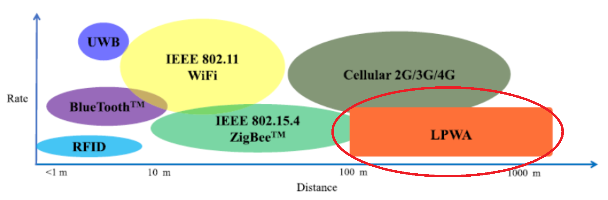
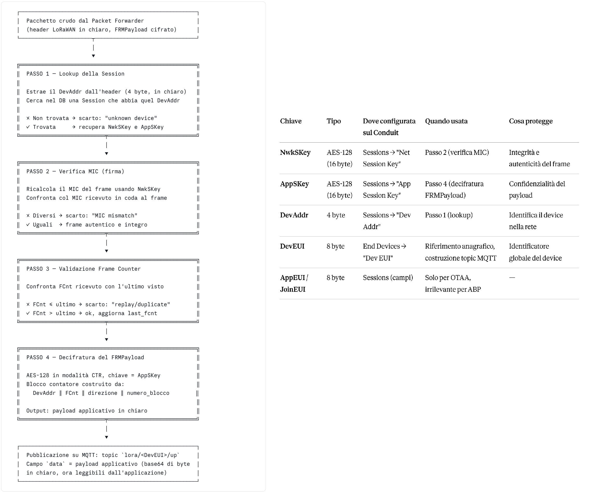
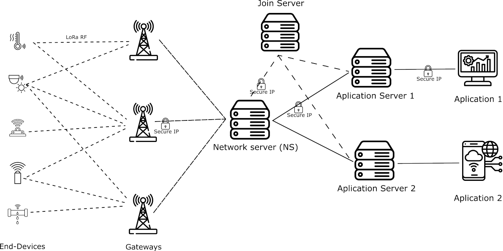
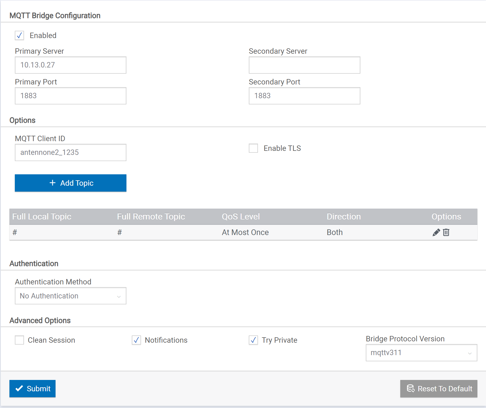
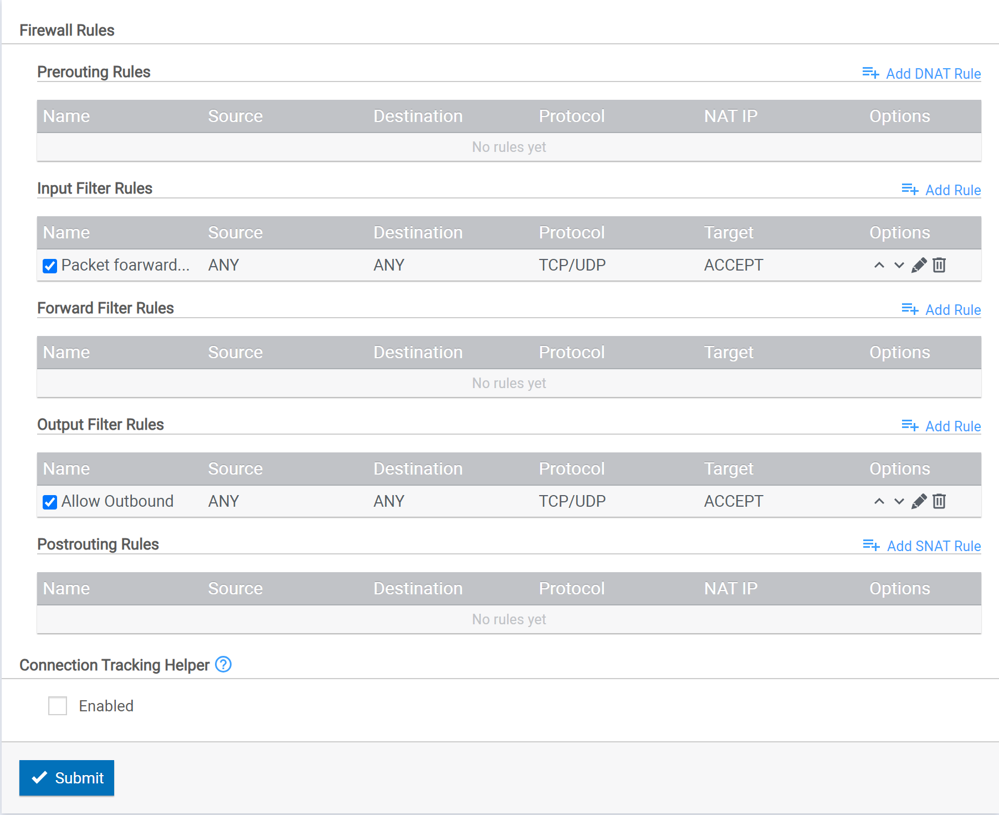

## **TECNOLOGIA WSN LORAWAN**

>[Torna a reti di sensori](sensornetworkshort.md#classificazione-delle-tecnologie-wsn-in-base-a-velocità-e-copertura)

- [Dettaglio architettura Ethernet](archeth.md)
- [Dettaglio architettura Zigbee](archzigbee.md)
- [Dettaglio architettura BLE](archble.md)
- [Dettaglio architettura WiFi infrastruttura](archwifi.md)
- [Dettaglio architettura WiFi mesh](archmesh.md)
- [Dettaglio architettura 5G/6G](ranprivata.md)
- [Dettaglio architettura RFID](archrfid.md)
 
## **Caso d'uso LoRaWan** 

Date le particolarità della tecnologia, i casi d'uso per la rete di sensori sono quelli tipici applicazioni **IoT outdoor** a **lungo raggio** dette **LPWA**, dove concorre con altre tecnologie di rete: Sigfow, NB IoT e sotto certe condizioni, wifi. **Caratteristiche** di LoRaWAN sono essenzialmente:
- trasmissione di messaggi brevi e sporadici. Infatti, a causa del **bassissimo bitrate** e a causa di forti limitazioni di **duty cycle**, sono possibili trasmissioni di **pochi byte** con **cadenza** del **minuto** o più.
- possibilità di realizzare **comandi** a distanza wireless anche molto piccoli con una **lunga durata** delle batterie (dell'ordine degli anni).
- possibilità di realizzare **sensori** ambientali molto piccoli e alimentati con batterie che possono essere sostituite **dopo anni**.
- possibilità di poter mettere **pochi gateway** verso la rete LAN/WAN, anche a grande distanza dai sensori e dai comandi che devono poter **coordinare**.
- architettura ad **hop singolo** del collegamento verso la stazione radio base costituita, in questo caso, da un **gateway LoRaWAN** che deve essere in posizione **baricentrica** rispetto ai dispositivi ad esso collegati. Il **consumo** dei dispositivi è tanto minore quanto e breve la distanza dai gateway ma è comunque **ottimizzato** alla sensoristica e quindi **molto basso**.
- **rete di sensori** composta **dai gateway** per il **primo tratto**, e da un **tunnel applicativo** su LAN/WAN per un **secondo tratto** verso un unico dispositivo di smistamento finale (verso l'applicazione) detto **network Server**.
- **affidabilità** della rete di sensori **indipendente** da quella della rete dati. Topologia predisposta alla **ridondanza** essendo possibile agganciare lo stesso dispositivo a più gateway contemporaneamente.



### **Aspetti critici da documentare**

Elementi **critici** su cui **bilanciare convenienze** e saper fare delle **scelte argomentate** sono:
- schema fisico (**planimetria**) dello scenario del problema con la rappresentazione di ambienti e edifici chiave e schema (indoor ed outdoor) dell'infrastruttura con etichettatura univoca di tutti gli asset tecnologici di rete.
- tipologia di **divisione in gruppi** degli utenti e loro caratterizzazione (dislocazione fisica delimitata o diffusa a macchia a macchia di leopardo).
- definizione delle **tecnologie dei dispositivi** chiave quali sensori/attuatori (stella, bus, singolo), gateway, link (dual radio, three radio), accesso radio (allocazione di servizi sincroni TDM, asincroni CSMA/CA o a basso ritardo slotted CSMA/CA) e loro dimensionamento di  massima (quantità, numero di porte, banda, ecc.).
- definizione di dorsali wireless e di punti di accesso e aggregazione dei dispositivi utente
- eventuali vincoli normativi sulle tecnologie in uso come potenza, EIRP, ERP e duty cycle.
- schema logico (albero degli **apparati attivi**) di tutti i dispositivi di rete con il loro ruolo e i **link virtuali** astratti ai vari livelli della **pila ISO/OSI** (tipicamente L2, L3, L7)
- dislocazione di eventuali **gateway**.
- **subnetting** e definizione degli indirizzi delle **subnet di aggregazione** per i vari gruppi di utenti (generalmente statica), e definizione degli indirizzi delle **subnet di dorsale** (statica o automatica basata su Link Local), definizione degli indirizzi delle **subnet di servizio** (server farm e DMZ),
- definizione degli indirizzi dei server e dei range di quelli dei client.
- definizione delle tecniche di **autenticazione** degli utenti necessarie per un dato scenario nonchè di quelle che realizzano l'autenticazione dei servizi.
- definizione del **tipo di routing** (statico o dinamico). In caso si scelga il **routing statico**, definizione delle **tabelle di routing** più significative.
- definizione della posizione del broker MQTT.
- definizione dei topic utili per i casi d'uso richiesti.
- definizione dei **messaggi JSON** per alcuni **dispositivi IoT** ritenuti significativi in merito a **comandi**, **stato** o **configurazione**.
- definizione (anche in pseudocodice) delle **funzioni del firmware** di bordo dei **dispositivi IoT**.


[Rete di reti Lorawan](/approfondimenti/lorawan_federation.md)  

[Messaggi MQTT](/approfondimenti/messaggi_mqtt.md)

[Broker MQTT](/approfondimenti/broker_mqtt.md)

[Messaggi MQTT](/approfondimenti/messaggi_mqtt.md)

[Server di gestione](/approfondimenti/server_di_gestione.md)

[Sensori](/approfondimenti/sensore.md)

## **Funzioni di una rete LoRaWAN**

Le **funzioni** dell'architettura **LoRaWAN** possono essere distinte su **3 dispositivi diversi** oppure coincidere in un **unico dispositivo** che le ingloba tutte:

- Il **packet forwarder** è il gateway stesso essendo la funzione di forwarding, (inoltro) dei messaggi dal sensore al network server, la funzione principale del gateway. L'inoltro dei messaggi di uno stesso sensore può essere **parallelo** se questo è associato a più di un gateway, circostanza che aumenta la ridondanza a costo della presenza di duplicati in rete. In ogni caso, i **messaggi duplicati** verranno successivamente scartati dal network server, prima dell'inoltro finale verso l'applicazione.

- Il **network server**, responsabile dell'inoltro di messaggi senza duplicati verso il **server di applicazione** (ad es. nodered) tramite protocolli **client server** di alto livello in modalità request/response (HTTPS, COAP) oppure publish/subscribe (**broker MQTT**). 

- Il **join server**, o server di associazione,si occupa delle funzioni di autenticazione ed autorizzazione dei sensori in fase di registrazione e poi di riconoscimento e di gestione delle connessioni in fase di sessione:
    - **Join Request Validation**: Il Join Server verifica la validità delle richieste di join inviate dai dispositivi end-device. Questo processo include la verifica delle firme digitali e altre informazioni di autenticazione fornite dal dispositivo. Può avvenire tramite il processo **Over-the-Air Activation (OTAA)**, con cui il Join Server fornisce al dispositivo le **chiavi di sessione** necessarie per stabilire una connessione sicura con il Network Server, in maniera automatica. Nel **modo ABP** deve essere invece l'utente a generare ed inserire le chiavi di sessione nel join server.      
    - **Gestione delle sessioni**: Il Join Server mantiene il contesto di sicurezza per i dispositivi che sono stati autorizzati a unirsi alla rete. Questo include la gestione delle chiavi di sessione e altre informazioni di sicurezza necessarie per garantire una comunicazione sicura tra il dispositivo e il Network Server.

## **Join Server e accesso OTAA**

Per abilitare l'**accesso OTAA**, vanno configurati sia il **dispositivo IoT** che il **network server**.


Sul **Dispositivo IoT** (End-Device) vanno impostati:
- **DevEUI** o **identificatore del dispositivo**, è unico e normalmente si deduce dal MAC Ethernet con il processo **EUI64**.
- **AppEUI** o **dentificatore dell'applicazione**, è unico e normalmente è fornito dall'**amministratore** della rete (è un parametro impostato sul Network Server).
- **AppKey** o **Chiave di applicazione**, una chiave **segreta** e **precondivisa** (su un canale sicuro) tra il dispositivo e il join server, serve per cifrare con hash con chiave HMAC la chiave OTP di sessione che verrà utilizzata dai dispositivi ad ogni nuova connessione.
 
Sul **Network Server**:
- si impostano i parametri del dispositivo (DevEUI, AppEUI) e l'AppKey, tutti corrispondenti a quelli del dispositivo.
- si esegue l'associazione a un **join server** che gestirà il processo di accesso.

La chiave **AppKey** può essere generata online su cloud di gestione dei dispositivi LoraWAN come TTN, oppure localmente, ad esempio con il comando ```openssl rand -hex 16```.

In realtà, il **server** genera, automaticamente e in maniera trasparente all'utente, **due chiavi**:
- **AppSKey**: utilizzata dal **protocollo** LoRaWAN per cifrare e decifrare il payload delle applicazioni. Viene utilizzato per garantire la **privatezza** (confidenzialità) dei messaggi. Il messaggio è **cifrato** dal dispositivo IoT e può essere **decifrato** sia dal **Network Server** che, nella variante End To End, direttamente dal **Server Applicativo**.
- **NwkSKey**: utilizzata dal **protocollo** LoRaWAN in ingresso all'algoritmo AES-CMAC (Cipher-based Message Authentication Code), un HMAC con chiave con il quale viene generato un **hash del frame** da trasmettere, detto **MIC**. Il **trasmettitore** allega il MIC al messaggio e lo invia al **ricevitore** che estrae il MIC e lo **mette da parte** mentre ricalcola una **copia locale** del MIC utilizzando la **stessa chiave** usata in trasmissione. Se i due MIC, quello ricevuto e  quello locale,  **coincidono** allora vengono provati contemporaneamente sia l'**integrità** del messaggio che l'**autenticazione** del mittente.



**Nota**. In ABP queste chiavi sono fisse e configurate manualmente. In OTAA vengono generate ad ogni JoinRequest dal Join Server, ma il loro ruolo nella pipeline (passi 2 e 4) è identico.

## **Server di gestione** 


E' un **client** del **broker MQTT** con funzioni sia di **publisher** che di **subscriber** per:
- realizzazione delle **interfacce web** per la gestione e la visualizzazione dei dati dei dispositivi e delle applicazioni agli utenti.
- elaborazioni a **breve termine** quali la generazione di **statistiche** per la determinazione di **soglie** o **predizioni** per:
    - realizzazione da remoto della **logica di comando** (processo dei comandi) degli **attuatori**
    - **report** per l'assistenza alle decisioni
    - generazioni di **allarmi**
    - realizzazione di **ottimizzazioni** della gestione o del consumo di risorse, energia o materie prime
    - contabilizzazione dei consumi (**smart metering**)
    - controllo e sorveglianza in tempo reale dello **stato** di impianti o macchinari
    - segnalazione dei **guasti** o loro **analisi predittiva** prima che accadano
    - **consapevolezza situazionale** di ambienti remoti, difficili, pericolosi o ostili (https://it.wikipedia.org/wiki/Situational_awareness)
- elaborazioni a **lungo termine** quali:
    - analisi dei dati per la realizzazione di studi scientifici
    - elaborazione di nuovi modelli statistici o fisici o biologici dell'ambiente misurato

## **Server di rete**

Il **network server** è comune in alcune tipologie di **reti wireless** LPWA ed è una componente di **back-end** responsabile dello **smistamento** finale verso gli utenti (routing applicativo) dei dati provenienti dai vari **gateway** configurandosi, quindi, come il **centro stella logico** di una  stella di gateway. Lo **schema logico** di una rete di sensori LPWA basata su **network server** quindi appare:



### **Funzioni essenziali**

Il Network Server, dopo aver elaborato i messaggi ricevuti dai gateway, li inoltra al LoRa App Server.
La comunicazione tra il Network Server e l'Application Server generalmente avviene utilizzando HTTP, MQTT o altri protocolli di messaggistica.
Il Network Server trasmette i dati dei payload applicativi al LoRa App Server insieme a informazioni di contesto (es. ID del dispositivo, metadati di rete).

Il **network server** è anche responsabile dello svolgimento di alcuni **processi** di **controllo** e **gestione** della rete: 
- si connette a **più gateway** tramite una connessione TCP/IP protetta 
- esegue il **filtraggio** e l'eliminazione di eventuali **pacchetti duplicati**, dato che l'inoltro di uno **stesso messaggio**, da un **sensore** al network server, può avvenire anche passando per **più gateway** (inoltro basato sul **flooding**). Il Network Server poi si occuperà di effettuarne l'**inoltro** verso il **server applicativo**.
- decide **quale gateway** dovrebbe rispondere a un messaggio di quei nodi terminali che sono connessi **contemporaneamente** a più di un gateway.
- implementa la funzionalità di **controllo remoto** dei terminali remoti tra le quali fondamentale è la gestione della loro velocità mediante **adaptive data rate (ADR)**. Il network server assegna a ogni end node che si vuole connettere alla rete, un data rate e una potenza di uscita diversa a seconda della esigenza e della situazione:
    - un data rate maggiore e una potenza di uscita minore ai nodi terminali piu`vicini al  gateway  in  quanto meno suscettibili alle interferenze (trasmissione rapida e a bassa potenza). 
    - un data rate piu`basso (minore suscettibilità ai rumori) e una maggiore potenza di uscita solo ai nodi che si trovano a distanze notevoli dal gateway (trasmissione lunga e a alta potenza).
- Inoltra messaggi di richiesta di adesione (join) e di accettazione di adesione tra i dispositivi finali e il server di adesione (Join Server).

### **Server di rete come IS**

Il **Server di Rete** è un dispositivo **IS** (Intermediate System) che normalmente **non** è presente nelle reti **meshed tradizionali** perchè non esiste in queste reti un server deputato a possedere **capacità di routing** (smistamento). Talvolta, invece, nelle **reti mesh** è presente un  **server controller** che, però, non è un dispositivo di smistamento IS ma solamente un server responsabile della **supervisione**, **gestione** e **configurazione** di altri dispositivi di rete intesi come **IS**. Un esempio notevole è il **controller degli AP** WiFi.

### **Server di rete come nodo radice**

Il **server di rete** è collegato ai **gateway dei sensori** mediante una normale **rete IP** mediante **protocollo di livello applicativo**. E' un **nodo di smistamento finale** e, in questo senso, può essere considerati come dei **router di livello applicativo**. In pratica è il **centro stella** di una **stella di gateway** (o base station) che a **loro volta** sono il **centro stella** di una **stella di sensori**. I gateway sono tutti dello stesso tipo e si collegano, tramite lo stesso protocollo, al network server realizzando, con questo, un collegamento virtuale diretto.

I dati ricevuti possono essere **inviati agli application server** per le elaborazioni successive oppure è possibile inviare eventuali notifiche agli end device per far attuare un’azione.
Non ci sono interfacce standard di trasmissione dei dati tra network server ed application server (webservice, websocket, webhook, MQTT sono variamente implementati).

Quindi sono macchine che partecipano attivamente alle **funzioni di rete** e pertanto fanno esse stesse parte della **infrastruttura di rete**. Spesso sono **virtualizzate** e le loro funzioni sono offerte come **servizio** su abbonamento. Sono presenti in quasi tutte le **infrastrutture LPWA** a lungo raggio come **LoraWan**, **Sigfox** e **NB-IoT**.

## **Gateway**

**Riassumendo**, alla **rete di distribuzione IP** si collegano, quindi, una o più **reti secondarie** che servono da **rete di accesso** per i dispositivi sensori o attuatori con **interfacce** spesso di tipo **non ethernet** che necessitano di un **gateway** di confine con possibili funzioni di:     
  - **Inoltro**, cioè smistamento dei messaggi da un tipo di rete all'altro di tipo L3 (**routing**) o di tipo L2 (**bridging**). L'inoltro del messaggio di un sensore può essere:
       - **diretto** nella rete di distribuzione tramite link fisico verso il dispositivo di smistamento (router o switch) più vicino.
           - Nel caso di una LAN il gateway possiede un indirizzo IP privato.
           - Nel caso di una WAN il gateway possiede un indirizzo IP pubblico.
       - **indiretto** tramite una dorsale virtuale, cioè un **tunnel**, verso il network server o verso un router di una WAN privata, realizzato, ad esempio, in maniera cifrata tramite un **client di VPN**, oppure in maniera non cifrata tramite un client di tunnel generico **GRE**. In questo caso il **gateway** possiede:
         - un indirizzo **IP pubblico** nell'interfaccia in **Internet**. 
         - un **IP privato** nell'interfaccia sul **tunnel cifrato**. Il tunnel cifrato, per VPN L3, è gestito con una subnet IP **separata** per ogni tunnel.
  - **Traduzione di formato** dei **messaggi** dalla interfaccia sulla rete **LoRaWAN** a quella sulla rete **ethernet** e viceversa. La **traduzione** del livello applicativo **non** è presente, dato che LoRaWAN **non definisce** una **semantica** per gli oggetti IoT. LoRaWan fornisce un mero servizio di **messagistica breve** e a **basso consumo** la cui **semantica** (significato degli oggetti) deve essere definita dall'**applicazione**.
  - **Interrogazione periodica** (polling) dei dispositivi nella rete di sensori (master di una architettura master/slave)
  - **Raccolta e memorizzazione** delle informazioni per essere trasferite in un **secondo momento** al server di gestione
  - **Protezione della rete di sensori**, cioè di firewall, soprattutto quando questa, tramite il gateway, si connette direttamente alla rete **Internet** mediante un **IP pubblico**.

### **Comunicazione tra Gateway e Network Server**

Comunemente, i gateway utilizzano il protocollo **UDP** o **MQTT** per trasmettere i pacchetti al **Network Server**.
Il **Network Server** riceve i pacchetti, li decodifica, verifica l'integrità e l'autenticità dei messaggi e gestisce la rete (es. ADR, downlink).

Il **gateway** è uno **snodo nevralgico** dei messaggi, per cui la sua posizione dovrebbe essere **ben nota** e accuratamente **riportata in planimetria** per permettere una sua rapida manutenzione/sostituzione.

### **Gateway come Client MQTT**

In **generale**, su reti **non IP**, i **client MQTT** (con il ruolo di **publisher** o di **subscriber**) sono sempre i **gateway di confine** della **rete di sensori**. Le uniche reti di sensori che non hanno bisogno di un gateway di confine che sia, nel contempo anche client MQTT, sono le reti IP. Esistono ancora i gateway nelle **reti IP** ma con **scopi diversi** da quello di **realizzare** un **client MQTT**. Nelle **reti IP**, il **client MQTT** è, normalmente, direttamente **a bordo** del **dispositivo** sensore dotato di indirizzo IP (**MCU**).

### **Gateway come MCU hub di sensori**

La **parola gateway** potrebbe talvolta portare a **fraintendimenti** dovuti al diverso significato nei **diversi contesti** in cui la si usa. **Spesso**, con il **termine gateway** si intente anche il **dispositivo IoT** che potrebbe essere, **a sua volta**, un **gateway** tra la il **link di campo**, porte analogiche/digitali o BUS, (vedi [bus di campo](cablatisemplici.md) per dettagli) e la **rete di sensori** (WiFi, Zigbee, LoraWAN, LAN, BLE, ecc.). In questo caso il gateway ha il compito di tradurre i messaggi dall'interfaccia a BUS su filo verso quella LoRaWAN e viceversa. Vedi ([dispositivi terminali](sensornetworkshort.md#dispositivi-terminali-sensoriattuatori)) per approfondimenti.

## **Formato del payload**

In sintesi, la lunghezza dei messaggi LoRaWAN è strettamente correlata alle **limitazioni in banda ISM** attraverso le restrizioni sul **duty cycle** e il **Time on Air**. Gli **sviluppatori** devono bilanciare la necessità di trasmettere dati con le normative che limitano il tempo di trasmissione per assicurare un uso efficiente e conforme dello spettro radio.

**Time on Air (ToA)** è a durata della trasmissione di un messaggio, dipende dalla lunghezza del messaggio e dalle impostazioni di trasmissione come il **Data Rate** e il **Spreading Factor (SF)**. Messaggi **più lunghi** o l'uso di **Spreading Factor più alti** aumentano il Time on Air. Poiché il duty cycle limita il tempo totale di trasmissione, **messaggi più lunghi** riducono la **frequenza** con cui i dispositivi possono trasmettere senza superare i limiti di duty cycle.

**Calcolatori online**. Un esempio di calcolatore online di duty cycle per la **tecnologia LoraWAN** è: https://avbentem.github.io/airtime-calculator/ttn/eu868

[Dettaglio banda ISM 868 MHz](ism.md)


I messaggi scambiati in una rete LoraWAN sono complessivamente di due tipi che si mappano l’uno sull’altro: **Messaggi corti** e **messaggi lunghi**. 

### **Messaggi corti**

Sono in formato binario, tra sensore e gateway. Vengono mandati in wireless su **banda ISM** con forti limitazioni di duty cycle, per cui devono essere i più **corti** possibile, anche a discapito della chiarezza. Possono essere **definiti** sotto forma di **struct C** e poi inviati ad una **libreria di serializzazione** (come Cayenne LPP) che si occupa di trasformali in una **sequenza compatta** di singoli bit.
  
```python
            # Stesso formato del programma originale:
            #   <Q  uint64  timestamp
            #    H  uint16  pmSensorID
            #    H  uint16  pm10
            #    H  uint16  pm25
            #    H  uint16  eCO2
            #    H  uint16  tVOC
            #    h  int16   temp
            #    I  uint32  press
            payload = struct.pack('<QHHHHHhI',
                                  ts, pmSensorID, pm10, pm25,
                                  eCO2, tVOC, temp, press)
```

### **Messaggi lunghi**

Sono scambiati tra tra Network Server e server Applicativo. Vengono mandati **in Internet** e devono essere più che altro chiari e, se possibile, autoesplicativi. Dato che vengono inviati su un mezzo senza particolari limitazioni di banda, possono essere **definiti** in **formato JSON**.

Esempio di **json di servizio** tra gateway e application server:
```Json
{
  "jver": 1,
  "tmst": 561224395,
  "time": "2023-03-04T23:14:39.522787Z",
  "tmms": 1362006897523,
  "chan": 6,
  "rfch": 1,
  "freq": 903.5,
  "mid": 8,
  "stat": 1,
  "modu": "LORA",
  "datr": "SF9BW125",
  "codr": "4/5",
  "rssis": -14,
  "lsnr": 9.2,
  "foff": -2769,
  "rssi": -13,
  "opts": "03070307",
  "size": 8,
  "fcnt": 1,
  "cls": 0,
  "port": 33,
  "mhdr": "80cb80d000840100",
  "data": "dDEAAAAAAAAFAPoAngCcASUC5gCSjAEA", // dato pacchettizzato decifrato e codificato in BCD
  "appeui": "8b-6c-f0-8e-ee-df-1b-b6",
  "deveui": "00-80-00-ff-ff-00-00-03",
  "joineui": "16-ea-76-f6-ab-66-3d-80",
  "name": "JSR-DEBIAN-PC-DOT2",
  "devaddr": "00d080cb",
  "ack": false,
  "adr": true,
  "gweui": "00-80-00-00-d0-00-01-ff",
  "seqn": 1
}
```


La **deserializzazione** del  campo ```data``` dal formato pacchettizzato binario al formato strutturato nei singoli campi contenenti i valori delle varie misure, non viene fatta normalmente direttamente sul gateway, lui li **decifra** con la chiave simmetrica di sesssione e li trasferisce in chiaro in un **JSON di servizio** ma senza scompattare (deserializzare) il payload applicativo. La **trasformazione dei dati** (come la codifica e decodifica in formato Cayenne LPP) tipicamente avviene a livello di **server di rete** o di **server di applicazione** o di **dashboard di visualizzazione** (ad esempio web). Ecco come potrebbe essere gestita:

- **Server di Rete LoRaWAN (Network Server)**: Alcuni server di rete LoRaWAN, come quelli offerti da The Things Network (TTN) o ChirpStack, forniscono integrazioni che possono gestire il payload dei dispositivi. E' possibile configurare questi server per utilizzare codec specifici che codificano o decodificano i messaggi nel formato desiderato, come Cayenne LPP.

- **Applicazione Custom**: E' possibile creare un'**applicazione** (sull'application server) che riceva i dati dal **server di rete** LoRaWAN e che poi gestisca la compattazione e decompressione dei dati JSON utilizzando librerie apposite (come Cayenne LPP). Questa applicazione si può considerare un **middleware** che si occupa della **trasformazione dei dati** prima di passarli alla **applicazione finale** (livello di presentazione OSI). 
- **Integrazione diretta con un cloud**: Ad esempio, Cayenne di MyDevices fornisce una piattaforma per la gestione e visualizzazione dei dati IoT che supporta nativamente il formato Cayenne LPP. Puoi configurare il tuo server di rete per inviare i dati direttamente alla piattaforma Cayenne, che si occuperà della decodifica e visualizzazione dei dati in formato JSON.
 
Per esempi di messagggi LoRawaN lunghi e corti vedi [Esempi messaggi LoRa](esempimessaggilora.md)
  
## **Gestione bridge broker MQTT**

E' una maniera per fare diventare il network server un **client del broker MQTT** che sta nella rete di distribuzione centrale.

Serve a realizzare un ponte tra: 
- un broker MQTT locale al network server che colleziona tutti i messaggi del modem LoraWAN
- il broker in uso nella rete di distribuzione che è interessato solo ad un sottoinsieme dei topic del network server (vengono filtrati i messaggi di servizio)
- #, # è invece l’impostazione per un bridge privo di filtraggi



###  Tabella riassuntiva dei topic

| Topic | Direzione | Stadio della pipeline | Quando pubblicato | Contenuto principale | Uso tipico |
|---|---|---|---|---|---|
| `packet_recv` | **uplink** | PHY (prima della decifratura) | Ogni frame demodulato con CRC OK, **anche se poi verrà scartato dal NS** | Metadati radio (freq, SF, RSSI, SNR) + `data` ancora **cifrato** | Diagnostica radio, monitoraggio qualità link |
| `up` | **uplink** | Applicativo (dopo i 4 passi) | Solo per frame validati e decifrati | `data` **in chiaro** + DevEUI + FCnt | **Topic principale per le applicazioni** |
| `packet_missed` | uplink (meta) | LoRaWAN | Quando il NS rileva un salto nel FCnt | `{"count": N}` con N = numero di pacchetti persi | Statistiche packet loss |
| `geolocation` | uplink (meta) | LoRaWAN | Insieme a ogni `up` | DevEUI, gateway che ha ricevuto, RSSI, SNR | Triangolazione multi-gateway |
| `packet_sent` | **downlink** | PHY | Quando il gateway sta per trasmettere un downlink | `data` del frame downlink (cifrato), parametri TX | Tracciamento downlink lato radio |
| `mac_sent` | **downlink** | LoRaWAN | Quando il NS spedisce un MAC command | `opts` = MAC commands codificati (LinkADRReq, DevStatusReq…) | Capire perché il NS parla al device |

### Quale topic serve per cosa

**"Voglio leggere i dati del mio sensore."**
→ `lora/<DevEUI>/up`. È il topic principale. Tutto il resto è diagnostica.

**"Voglio capire perché un device non funziona."**
→ Sottoscrivi a `lora/<DevEUI>/#` (wildcard `#` = tutti i sotto-topic). Vedi `packet_recv` ma non `up` → il NS sta scartando i pacchetti, controlla chiavi e FCnt. Vedi sia `packet_recv` che `up` → tutto ok lato pipeline, il problema è nell'applicazione.

**"Voglio statistiche sulla qualità del link."**
→ `packet_recv` (RSSI, SNR per ogni frame ricevuto) + `packet_missed` (frame persi).

**"Voglio vedere cosa il NS sta dicendo al device."**
→ `mac_sent` (cosa significa) e `packet_sent` (come viene trasmesso).

### Differenza chiave: `packet_recv` vs `up`

```
            ┌─────────────────────────────────────────────┐
            │  Frame demodulato dalla radio (CRC OK)      │
            └──────────────────────┬──────────────────────┘
                                   │
                                   ▼
              ┌────────── pubblicazione su `packet_recv` ──────────┐
              │   contiene: metadati radio + data CIFRATO          │
              │   pubblicato SEMPRE, anche se i passi 1-4 falliscono│
              └─────────────────────┬──────────────────────────────┘
                                    │
                                    ▼
                       [ 4 passi di decifratura ]
                                    │
                  ┌─────────────────┴─────────────────┐
                  │                                   │
                  ▼                                   ▼
          ✗ qualche passo                   ✓ tutti i passi
            fallisce                          superati
                  │                                   │
                  ▼                                   ▼
         scartato, niente               pubblicazione su `up`
         pubblicato su `up`             contiene: metadati + data CHIARO
```

**Conseguenze pratiche.**

- Un device che trasmette ma è **registrato male sul Conduit** (chiavi sbagliate, FCnt incoerente): i suoi pacchetti compaiono in `packet_recv` ma **mai** in `up`. È esattamente questo lo scenario "Recent Rx Packets vede il pacchetto ma Sessions non si aggiorna".
- Un device **completamente sconosciuto** (DevAddr non corrispondente a nessuna Session): stessa cosa, `packet_recv` sì, `up` no.
- Un device **funzionante**: `packet_recv` + `up` pubblicati per ogni TX, contemporaneamente.


### **Tutti i topic**
Topic in cui recuperare tutti i **messaggi associati** ad un **gateway** avente identificativo univoco ```APP-EUI```e a un **dispositivo IoT** avente un identificativo EUI64 che vale ```APP-EUI``` 
L'**associazione** può riguardare i **topic**:
-  **```up```** in cui **dispositivo** è il **publisher** dei messaggi che vanno nella **direzione** dal dispositivo al gateway, mentre il **gateway** è il loro **subscriber**
- **```down```** in cui **gateway** è il **publisher** dei messaggi che vanno nella **direzione** dal gateway al dispositivo, mentre il **dispositivo** è il loro **subscriber**

Il **payload** è un **messaggio JSON** contenente un campo **data** e varie informazioni di controllo. Il campo data è **codificato** in BASE64 e **compattato** per occupare meno spazio possibile nella tratta dal sensore al gateway.

Un applicativo còient del broker MQTT generale può recuperarare i messaggi di un certo sensore eseguendo il subscribe sul topic ```lorawan/<APP-EUI>/<DEV-EUI>/+``` dove <APP-EUI> è il MAC del network server mentre /<DEV-EUI> è il MAC del sensore.

```Python
lorawan/<APP-EUI>/<DEV-EUI>/+
lorawan/8b-6c-f0-8e-ee-df-1b-b6/00-80-00-ff-ff-00-00-03/+
```
### **Solo topic up**
**Topic** ```up``` in cui **dispositivo** è il **publisher** dei messaggi che vanno nella **direzione** dal dispositivo al gateway, mentre il **gateway** è il loro **subscriber**
```Python
lorawan/<APP-EUI>/<DEV-EUI>/up 
lorawan/8b-6c-f0-8e-ee-df-1b-b6/00-80-00-ff-ff-00-00-03/up
```
Questo topic può essere **letto** (come subscriber) dal **Server applicativo** per realizzare una **attuazione** verso un altro dispositivo o una **elaborazione statistica** o un **salvataggio persistente** in un database.

### **Solo topic down**
**Topic** ```down``` in cui **gateway** è il **publisher** dei messaggi che vanno nella **direzione** dal gateway al dispositivo, mentre il **dispositivo** è il loro **subscriber**
```Python
lorawan/<APP-EUI>/<DEV-EUI>/down
lorawan/8b-6c-f0-8e-ee-df-1b-b6/00-80-00-ff-ff-00-00-03/down
```
Questo topic può essere **scritto** (come publisher) dal **Server applicativo** o da un altro dispositivo IoT per realizzare una attuazione o una configurazione

## **Gestione firewall**

Serve a proteggere l’accesso alla rete di distribuzione che, di base, è IP con indirizzi pubblici.

Può essere impostato per far passare tutto se la rete di distribuzione è sicura come accade, ad esempio, nel caso di una LAN aziendale.



## **Beacon**

I beacon sono delle **sequenze di sincronizzazione** (dette preambolo) in grado sia di sincronizzare gli **orologi** dei dispositivi (Tx e Rx) che si accingono ad iniziare una comunicazione, ma anche di **indentificare** in maniera univoca i dispositivi che li emettono. Per dei dettagli vedi [preambolo di sincronizzazione](protocolli.md#preambolo-di-sincronizzazione).

La trama dati compresa tra due beacon consecutivi viene detta **supertrama** (superframe) ed è generalmente divisa in due zone con **politiche di accesso** al canale diverse:  
- una **deterministica** al riparo dalle collisioni detta **CFP** (Contention Free Period) e regolata dalla multiplazione statica TDMA, che viene usata per trasmettere i dati delle comunicazioni **unicast**.
- una **probabilistica** a contesa, in cui i tentativi di accesso dei dispositivi sono soggetti al **rischio di collisione** perchè regolata da un protocollo di tipo **CSMA/CA**, che invece serve per trasmettere delle particolari informazioni **broadcast** dette **advertisement**.

Nel contesto di LoRaWAN, un **gateway** può assumere un ruolo di **coordinamento**, simile a quello svolto dal PCF in una rete Wi-Fi, gestendo l'accesso al canale nel modo master/slave, quello in cui il centrale ha il ruolo di **master** che stabilisce **quale** stazione deve parlare, **quando** e **per quanto** tempo, usando una politica di **turnazione** delle stazioni (**polling**).

## **Classi di dispositivi**

  La specifica LoRaWAN definisce tre classi di dispositivi:

- **A(ll)** Dispositivi alimentati a batteria. Ogni dispositivo effettua il collegamento in uplink al gateway ed è seguito da due brevi finestre di ricezione del downlink.
- **B(eacon)** Come la classe A ma questi dispositivi aprono anche finestre di ricezione aggiuntive a orari programmati.
- **C(continuo)** Uguale ad A ma questi dispositivi sono in ascolto continuo. Pertanto questi dispositivi consumano più energia e sono spesso alimentati dalla rete elettrica.

Per il dettaglio sulla gestione delle classi di servizio vedi [Classi di servizio LoRAWAN](classilora.md).

[Tutorial Conduit](approfondimenti/tutorial-conduit-abp.md)

### **Pagine correlate:**

- [Dettaglio architettura Ethernet](archeth.md)
- [Dettaglio architettura Zigbee](archzigbee.md)
- [Dettaglio architettura BLE](archble.md)
- [Dettaglio architettura WiFi infrastruttura](archwifi.md)
- [Dettaglio architettura WiFi mesh](archmesh.md) 


**Sitografia**:
- https://lora.readthedocs.io/en/latest/#lorawan-device-classes
- https://lora-alliance.org/wp-content/uploads/2020/11/2015_-_lorawan_specification_1r0_611_1.pdf
- https://medium.com/@prajzler/lorawan-confirmations-and-acks-ba784a56d2d7
- chatGPT per struct e JSON di sensori e attuatori
- https://github.com/myDevicesIoT/cayenne-docs/blob/master/docs/LORA.md
- https://webthesis.biblio.polito.it/secure/18698/1/tesi.pdf
- https://www.starlink.com/business/direct-to-cell
- https://eadalabs.com/lorawan-overhead/

>[Torna a reti di sensori](sensornetworkshort.md#classificazione-delle-tecnologie-wsn-in-base-a-velocità-e-copertura)
