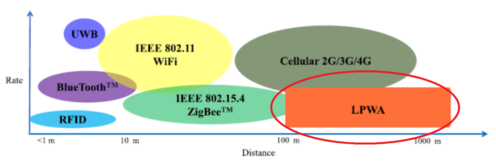
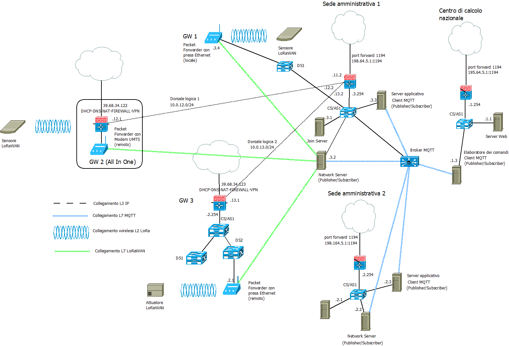

>[Torna a reti di sensori](sensornetworkshort.md#classificazione-delle-tecnologie-wsn-in-base-a-velocità-e-copertura)

- [Dettaglio architettura Ethernet](archeth.md)
- [Dettaglio architettura Zigbee](archzigbee.md)
- [Dettaglio architettura BLE](archble.md)
- [Dettaglio architettura WiFi infrastruttura](archwifi.md)
- [Dettaglio architettura WiFi mesh](archmesh.md) 
  
## **Caso d'uso LoRaWan** 

Date le particolarità della tecnologia, i casi d'uso per la rete di sensori sono quelli tipici applicazioni **IoT outdoor** a **lungo raggio** dette **LPWA**, dove concorre con altre tecnologie di rete: Sigfow, NB IoT e sotto certe condizioni, wifi. **Caratteristiche** di LoRaWAN sono essenzialmente:
- trasmissione di messaggi brevi e sporadici. Infatti, a causa del **bassissimo bitrate** e a causa di forti limitazioni di **duty cycle**, sono possibili trasmissioni di **pochi byte** con **cadenza** del **minuto** o più.
- possibilità di realizzare **comandi** a distanza wireless anche molto piccoli con una **lunga durata** delle batterie (dell'ordine degli anni).
- possibilità di realizzare **sensori** ambientali molto piccoli e alimentati con batterie che possono essere sostituite **dopo anni**.
- possibilità di poter mettere **pochi gateway** verso la rete LAN/WAN, anche a grande distanza dai sensori e dai comandi che devono poter **coordinare**.
- architettura ad **hop singolo** del collegamento verso la stazione radio base costituita, in questo caso, da un **gateway LoRaWAN** che deve essere in posizione **baricentrica** rispetto ai dispositivi ad esso collegati. Il **consumo** dei dispositivi è tanto minore quanto e breve la distanza dai gateway ma è comunque **ottimizzato** alla sensoristica e quindi **molto basso**.
- **rete di sensori** composta **dai gateway** per il **primo tratto**, e da un **tunnel applicativo** su LAN/WAN per un **secondo tratto** verso un unico dispositivo di smistamento finale (verso l'applicazione) detto **network Server**.
- **affidabilità** della rete di sensori **indipendente** da quella della rete dati. Topologia predisposta alla **ridondanza** essendo possibile agganciare lo stesso dispositivo a più gateway contemporaneamente.



### **Aspetti critici**

Elementi **critici** su cui **bilanciare convenienze** e saper fare delle **scelte argomentate** sono:
- schema fisico (**planimetria**) dell'infrastruttura con etichettatura univoca di tutti gli asset tecnologici di rete.
- tipologia di **divisione in gruppi** degli utenti.
- definizione delle **tecnologie dei dispositivi** chiave quali sensori/attuatori ([dispositivi terminali](sensornetworkshort.md#dispositivi-terminali-sensoriattuatori)), gateway, link (dual radio, three radio), accesso radio (allocazione di servizi sincroni TDM, asincroni CSMA/CA o a basso ritardo slotted CSMA/CA) e loro dimensionamento di  massima (quantità, numero di porte, banda, ecc.).
- eventuali vincoli normativi sulle tecnologie in uso come potenza, EIRP, ERP e duty cycle. 
- schema logico (albero degli **apparati attivi**) di tutti i dispositivi di rete con il loro ruolo e i **link virtuali** astratti ai vari livelli della **pila ISO/OSI** (tipicamente L2, L3, L7)
- dislocazione di eventuali **gateway**.
- **subnetting** e definizione degli indirizzi dei vari gruppi di utenti, delle server farm, definizione degli indirizzi dei server.
- definizione del **tipo di routing** (statico o dinamico). In caso si scelga il **routing statico**, definizione delle **tabelle di routing** più significative.
- definizione della posizione del broker MQTT.
- definizione dei topic utili per i casi d'uso richiesti.
- definizione dei **messaggi JSON** per alcuni **dispositivi IoT** ritenuti significativi in merito a **comandi**, **stato** o **configurazione**.
- definizione (anche in pseudocodice) delle **funzioni del firmware** di bordo dei **dispositivi IoT**.

  
## **Architettura di una rete di reti** 

Di seguito è riportata l'architettura generale **fisica** di una rete Lorawan. Essa è composta, a **livello fisico**, essenzialmente di una **rete di accesso** ai sensori e da una **rete di distribuzione** che fa da collante di ciascuna rete di sensori.


La rete di sensori **fisica** è a stella dove il centro stella è il gateway. Un sensore può anche essere associato a più gateway ed inviare dati a tutti i gateway a cui esso è associato. I dati normalmente arrivano ad un certo dispositivo attraverso un solo gateway.

I gateway utilizzano la rete internet (o una LAN) per realizzare un collegamento diretto **virtuale** con il network server, per cui, in definitiva, la topologia risultante è:
- **fisicamente** quella di più **reti di accesso** a stella tenute insieme da una **rete di distribuzione** qualsiasi purchè sia di tipo TCP/IP (LAN o Internet).
- **logicamente** quella di una stella di reti a stella. Il **centrostella** di livello gerarchico più alto è il **network server** ed aggrega solo gateways, gli altri centrostella sono realizzati dai **gateway** che aggregano solamente **dispositivi IoT**.

Avere a disposizione una **rete di distribuzione IP** per i comandi e le letture è utile perchè permette di creare interfacce web o applicazioni per smartphone o tablet per:
- eseguire, in un'unica interfaccia (form), comandi verso attuatori posti su reti con tecnologia differente.
- riassumere in un'unica interfaccia (report) letture di sensori provenienti da reti eterogenee per tecnologia e topologia

La **figura** sottostante riassume la rete LoRaWAN dal punto di osservazione di un **collegamento L7** (applicativo) sulla **rete di distribuzione**:


Si noti, che il canale che collega i dispositivi IoT ai gateway non supera mai il **livello 2** della pila ISO/OSI. Questi link hanno **topologia** a **stella** e possono collegare lo stesso sensore/attuatore a molti gateway. I dispositivi utilizzano un meccanismo di **routing** di livello L1 e quindi basato sul **flooding**. E' il  routing **più semplice** possibile, e anche il **più affidabile** ma possiede l'**incoveniente** di generare **pacchetti duplicati** nel loro percorso verso l'**applicazione**. Questo problema è gestito dal **network server**.

## **Documentazione logica (albero degli apparati attivi)**

Esempio di connessione alla rete di distribuzione IP tramite gateway dotati di client VPN:

  

Si noti che l'**architettura generale** è quella di una **federazione** di reti di sensori più o meno **isolate** e **sparpagliate** sul territorio, ognuna delle quali fa capo, con topologia a stella, ad un proprio **gateway**, deputato al **coordinamento** della stella. La federazione è **amministrata** da un unico **network server** che **inoltra** i dati provenienti dai gateway verso l'**applicazione** utilizzando i servizi di trasporto offerti da una WAN. I servizi di **autenticazione** e **cifratura** (normalmente assenti in Internet) possono essere offerti, oltre che dal protocollo LoRaWAN, anche da da una VPN. I gateway posseggono la componente lora-gateway-bridge che si occupa di inserire il messaggio LoRaWAN in un payload di servizio MQTT per il network server

Il **gateway All-In-One** potrebbe essere un dispositivo con **doppia interfaccia**, modem **UMTS** per l'accesso alla rete di distribuzione su **Internet**, **LoRaWAN** verso la **rete di sensori**. Può essere utile per realizzare un **gateway LoRaWAN da campo** da adoperare:
- in **contesti occasionali** (fiere, eventi sportivi, infrastrutture di emergenza, grandi mezzi mobili).
- in contesti simili ma **dispersi** in aree geografiche molto distanti tra loro e coperte solo dalla **rete cellulare** terrestre della telefonia mobile o dai **satelliti in orbita bassa (LEO)**.

##  **Canali di comunicazione principali in una rete di sensori**

**In sintesi**, sono necessari almeno **due canali** di comunicazione che, insieme, complessivamente, realizzano la **comunicazione tra sensori e gestore** delle informazioni:
- **tra sensori e gateway** verso la LAN realizzato dalle **sottoreti dei sensori**:
    - **A filo** con accesso:,
        - **singolo dedicato**: un filo o un canale per sensore in tecnologia SDM o TDM (multiplexer, UART, porta analogica, porta digitale)
        - **multiplo condiviso** cioè tramite mezzo broadcast (BUS) con **arbitraggio** di tipo **master slave** (Modubus, Dallas, I2C, SPI) o **peer to peer** (CanBUS, KNX, ecc) o misto (ProfiBUS). 
        - Spesso **bidirezionale** specie se in presenza di attuatori
        
    - **Senza filo** cioè wireless con accesso:
        - **singolo dedicato**: link punto-punto analogico digitalizzato con AX25 oppure digitale con un radio modem (Yarm ACME Systems, 6LoWPAN, LoRa) resi full duplex con l'uso di multiplazioni FDM o TDM.
        - **Multiplo e condiviso** (BUS) di tipo half duplex reso bidirezionale (full duplex) tramite tecniche asincrone CSMA/CA (Zigbee, wifi, LoRa) o sincrone TDMA (Zigbee, Bluetooth).
- **Tra gateway e gestore** delle informazioni realizzato dalla **rete di distribuzione**:
     - Tipicamente tramite **LAN ethernet** e architettura **Client/Server**
     - Interazioni di tipo PUSH o PULL
     - Paradigma Request/Response (HTTPS, COAP), Publish/Subscriber (MQTT) oppure canale persistente bidirezionale (BSD socket o WebSocket)

## **Broker MQTT** 

Il **broker MQTT** è solo una delle tante soluzioni possibili per realizzare un **canale multicast** di livello **applicativo** tramite cui un utente col ruolo di **publisher** è in grado di notificare una **replica** dello stesso messaggio a più **subscribers**. E' utile per:
- inoltro dei comandi da un **sensore di comando** su una rete di tipo A (ad es. LoRaWAN) ad un attuatore su una rete diversa di tipo B (ad es. Zigbee)
- inoltro di una **misura** da un **sensore ambientale** su una rete di tipo A (ad es. LoRaWAN) ad un **pannello di controllo** su una rete diversa di tipo B (tipicamente IP)
- inoltro di una **misura** da un **sensore ambientale** su una rete di tipo A (ad es. LoRaWAN) ad un **server di gestione** su una rete diversa di tipo B (tipicamente IP)

Il **canale applicativo** su cui vengono inviati i messaggi sono quindi i **topic**. Su un certo **topic** il dispositivo con il ruolo di **output** agisce come un **publisher**, mentre quello con il ruolo di **input** agisce come un **subscriber**.

Gli utenti, in ogni caso, si comportano tutti come **client** poiché sono loro che **iniziano la connessione** con il broker e non il viceversa. 


**Fasi** del protocollo:
1. Il **Subscriber** dichiara presso il broker il proprio interesse a ricevere notifiche riguardo ad un certo argomento (topic) effettuando una chiamata **subscribe()**
2. il **publisher** pubblica un messaggio che riguarda un **certo topic** effettuando una chiamata **publish()**
3. Il **broker** inoltra il messaggio a tutti i subscriber interessati a **quel topic**

L'**ID MQTT** è un identificativo che permette di individuare un dispositivo ma non è un indirizzo di livello 3, non individua la macchina host in base al suo IP, piuttosto è un indirizzo di livello applicativo noto solo ad un server centrale, cioè il broker. Un dispositivo IoT non è tenuto a conoscere l'IP di tutti gli altri dispositivi ma solamente quello del broker. Il broker soltanto sa gli indirizzi di tutti i dispositivi, conoscenza che acquisisce durante la fase di **connessione** di un client al broker, momento in cui avviene anche il recupero del'**socket remoto** del client.

Il **broker**, dal canto suo, **associa** ogni **topic** con tutti gli **ID** che sono registrati presso di esso come **subscriber**. Questa associazione è utilizzata per smistare tutti i messaggi che arrivano con un certo topic verso tutti gli ID che ad esso sono associati. Il topic diventa così un **indirizzo di gruppo**. La particolarità di questo indirizzo è che è **gerarchico** secondo una struttura ad **albero**, cioè gruppi di dispositivi possono essere suddivisi in **sottogruppi** più piccoli estendendo il nome del path con un **ulteriore prefisso**, diverso per ciascun sottogruppo. L'operazione può essere ripetuta ulteriormente in maniera **ricorsiva**.

**Ad esempio**, posso individuare le lampade della casa con il path ```luci``` e accenderle e spegnerle tutte insieme, ma posso sezionarle ulteriormente con il path ```luci/soggiorno``` con il quale accendere o spegnere solo quelle del soggiorno oppure con il path ```luci/soggiorno/piantane``` con il quale fare la stessa cosa ma solo con le piantane del soggiorno.
Osservando l'albero degli **apparati attivi**, si vede bene che, in una **rete IP WiFi**, il **client MQTT** (con il ruolo di **publisher** o di **subscriber**) è sempre il **dispositivo IoT**. 

Osservando l'albero degli **apparati attivi**, si vede bene che, in una **rete LoRaWAN**, il **client MQTT** (con il ruolo di **publisher** o di **subscriber**) è sempre il **Network Server**. Il Netwok Server è anche il **gateway** della **rete di sensori** inteso complessivamente come **rete LoraWAN**. Il gateway dalla rete Lora alla rete IP, in realtà, è il **gateway LoRaWAN**. 

In **generale**, su reti **non IP**, i **client MQTT** (con il ruolo di **publisher** o di **subscriber**) sono sempre i **gateway di confine** della **rete di sensori**. Le uniche reti di sensori che non hanno bisogno di un gateway di confine che sia, nel contempo anche client MQTT, sono le reti IP. Esistono ancora i gateway nelle **reti IP** ma con **scopi diversi** da quello di **realizzare** un **client MQTT**. Nelle **reti IP**, il **client MQTT** è, normalmente, direttamente **a bordo** del **dispositivo** sensore dotato di indirizzo IP (**MCU**).

Il **vantaggio** del **broker MQTT** è quello di poter gestire in modo semplice e **standardizzato** lo **smistamento** (inoltro) delle **misure** e dei **comandi** tra i vari portatori di interesse (stakeholder) di un **cluster** di reti di sensori, siano essi utenti umani, interfacce grafiche, server applicativi diversi o altri dispositivi IoT.

### **Alternative ad MQTT**

Esistono molte altre soluzioni che magari sono più semplici e graficamente accattivanti ma che passano per portali proprietari o per servizi cloud a pagamento e nulla aggiungono di didatticamente rilevante ai nostri discorsi. Normalmente sono basate su webservices realizzati con protocolli Request/Response quali **HTTPS** e **COAP**.

## **Server di gestione** 


E' un **client** del **broker MQTT** con funzioni sia di **publisher** che di **subscriber** per:
- realizzazione delle **interfacce web** per la gestione e la visualizzazione dei dati dei dispositivi e delle applicazioni agli utenti.
- elaborazioni a **breve termine** quali la generazione di **statistiche** per la determinazione di **soglie** o **predizioni** per:
    - realizzazione da remoto della **logica di comando** (processo dei comandi) degli **attuatori**
    - **report** per l'assistenza alle decisioni
    - generazioni di **allarmi**
    - realizzazione di **ottimizzazioni** della gestione o del consumo di risorse, energia o materie prime
    - contabilizzazione dei consumi (**smart metering**)
    - controllo e sorveglianza in tempo reale dello **stato** di impianti o macchinari
    - segnalazione dei **guasti** o loro **analisi predittiva** prima che accadano
    - **consapevolezza situazionale** di ambienti remoti, difficili, pericolosi o ostili (https://it.wikipedia.org/wiki/Situational_awareness)
- elaborazioni a **lungo termine** quali:
    - analisi dei dati per la realizzazione di studi scientifici
    - elaborazione di nuovi modelli statistici o fisici o biologici dell'ambiente misurato
 
## **Sensore**

### Fasi Principali del Firmware di un Sensore che Utilizza MQTT

1. **Inizializzazione dei Parametri di Connessione**
   - Configurare i parametri del broker MQTT (indirizzo, porta, username, password).
   - Configurare il pin del sensore di temperatura e l'intervallo di lettura.

2. **Connessione al Broker MQTT**
   - Stabilire la connessione con il broker MQTT utilizzando i parametri configurati.

3. **Inizializzazione del Sensore di Temperatura**
   - Configurare il pin del sensore per la lettura della temperatura.

4. **Ciclo Principale**
   - Ottenere il tempo corrente.
   - Leggere il valore della temperatura dal sensore.
   - Creare un messaggio con il valore della temperatura.
   - Inviare il messaggio al broker MQTT se è trascorso l'intervallo prefissato.
   - Aggiornare il timestamp dell'ultima lettura inviata.

5. **Attesa Prima della Prossima Iterazione**
   - Attendere un breve periodo (ad esempio, 1 secondo) prima di ripetere il ciclo.

Per il dettaglio sulla realizzazione del firmware vedi [Firmware](sensorlora.md).

## **Server di rete**

Il **network server** è comune in alcune tipologie di **reti wireless** LPWA ed è una componente di **back-end** responsabile dello **smistamento** finale verso gli utenti (routing applicativo) dei dati provenienti dai vari **gateway** configurandosi, quindi, come il **centro stella logico** di una  stella di gateway. Lo **schema logico** di una rete di sensori LPWA basata su **network server** quindi appare:


### **Funzioni essenziali**

Il Network Server, dopo aver elaborato i messaggi ricevuti dai gateway, li inoltra al LoRa App Server.
La comunicazione tra il Network Server e l'Application Server generalmente avviene utilizzando HTTP, MQTT o altri protocolli di messaggistica.
Il Network Server trasmette i dati dei payload applicativi al LoRa App Server insieme a informazioni di contesto (es. ID del dispositivo, metadati di rete).

Il **network server** è anche responsabile dello svolgimento di alcuni **processi** di **controllo** e **gestione** della rete: 
- si connette a **più gateway** tramite una connessione TCP/IP protetta 
- esegue il **filtraggio** e l'eliminazione di eventuali **pacchetti duplicati**, dato che l'inoltro di uno **stesso messaggio**, da un **sensore** al network server, può avvenire anche passando per **più gateway** (inoltro basato sul **flooding**). Il Network Server poi si occuperà di effettuarne l'**inoltro** verso il **server applicativo**.
- decide **quale gateway** dovrebbe rispondere a un messaggio di quei nodi terminali che sono connessi **contemporaneamente** a più di un gateway.
- implementa la funzionalità di **controllo remoto** dei terminali remoti tra le quali fondamentale è la gestione della loro velocità mediante **adaptive data rate (ADR)**. Il network server assegna a ogni end node che si vuole connettere alla rete, un data rate e una potenza di uscita diversa a seconda della esigenza e della situazione:
    - un data rate maggiore e una potenza di uscita minore ai nodi terminali piu`vicini al  gateway  in  quanto meno suscettibili alle interferenze (trasmissione rapida e a bassa potenza). 
    - un data rate piu`basso (minore suscettibilità ai rumori) e una maggiore potenza di uscita solo ai nodi che si trovano a distanze notevoli dal gateway (trasmissione lunga e a alta potenza).
- Inoltra messaggi di richiesta di adesione (join) e di accettazione di adesione tra i dispositivi finali e il server di adesione (Join Server).

### **Server di rete come IS**

Il **Server di Rete** è un dispositivo **IS** (Intermediate System) che normalmente **non** è presente nelle reti **meshed tradizionali** perchè non esiste in queste reti un server deputato a possedere **capacità di routing** (smistamento). Talvolta, invece, nelle **reti mesh** è presente un  **server controller** che, però, non è un dispositivo di smistamento IS ma solamente un server responsabile della **supervisione**, **gestione** e **configurazione** di altri dispositivi di rete intesi come **IS**. Un esempio notevole è il **controller degli AP** WiFi.

### **Server di rete come nodo radice**

Il **server di rete** è collegato ai **gateway dei sensori** mediante una normale **rete IP** mediante **protocollo di livello applicativo**. E' un **nodo di smistamento finale** e, in questo senso, può essere considerati come dei **router di livello applicativo**. In pratica è il **centro stella** di una **stella di gateway** (o base station) che a **loro volta** sono il **centro stella** di una **stella di sensori**. I gateway sono tutti dello stesso tipo e si collegano, tramite lo stesso protocollo, al network server realizzando, con questo, un collegamento virtuale diretto.

I dati ricevuti possono essere **inviati agli application server** per le elaborazioni successive oppure è possibile inviare eventuali notifiche agli end device per far attuare un’azione.
Non ci sono interfacce standard di trasmissione dei dati tra network server ed application server (webservice, websocket, webhook, MQTT sono variamente implementati).

Quindi sono macchine che partecipano attivamente alle **funzioni di rete** e pertanto fanno esse stesse parte della **infrastruttura di rete**. Spesso sono **virtualizzate** e le loro funzioni sono offerte come **servizio** su abbonamento. Sono presenti in quasi tutte le **infrastrutture LPWA** a lungo raggio come **LoraWan**, **Sigfox** e **NB-IoT**.

## **Gateway**

**Riassumendo**, alla **rete di distribuzione IP** si collegano, quindi, una o più **reti secondarie** che servono da **rete di accesso** per i dispositivi sensori o attuatori con **interfacce** spesso di tipo **non ethernet** che necessitano di un **gateway** di confine con possibili funzioni di:     
  - **Inoltro**, cioè smistamento dei messaggi da un tipo di rete all'altro di tipo L3 (**routing**) o di tipo L2 (**bridging**). L'inoltro del messaggio di un sensore può essere:
       - **diretto** nella rete di distribuzione tramite link fisico verso il dispositivo di smistamento (router o switch) più vicino.
           - Nel caso di una LAN il gateway possiede un indirizzo IP privato.
           - Nel caso di una WAN il gateway possiede un indirizzo IP pubblico.
       - **indiretto** tramite una dorsale virtuale, cioè un **tunnel**, verso il network server o verso un router di una WAN privata, realizzato, ad esempio, in maniera cifrata tramite un **client di VPN**, oppure in maniera non cifrata tramite un client di tunnel generico **GRE**. In questo caso il **gateway** possiede:
         - un indirizzo **IP pubblico** nell'interfaccia in **Internet**. 
         - un **IP privato** nell'interfaccia sul **tunnel cifrato**. Il tunnel cifrato, per VPN L3, è gestito con una subnet IP **separata** per ogni tunnel.
  - **Traduzione di formato** dei **messaggi** dalla interfaccia sulla rete **LoRaWAN** a quella sulla rete **ethernet** e viceversa. La **traduzione** del livello applicativo **non** è presente, dato che LoRaWAN **non definisce** una **semantica** per gli oggetti IoT. LoRaWan fornisce un mero servizio di **messagistica breve** e a **basso consumo** la cui **semantica** (significato degli oggetti) deve essere definita dall'**applicazione**.
  - **Interrogazione periodica** (polling) dei dispositivi nella rete di sensori (master di una architettura master/slave)
  - **Raccolta e memorizzazione** delle informazioni per essere trasferite in un **secondo momento** al server di gestione
  - **Protezione della rete di sensori**, cioè di firewall, soprattutto quando questa, tramite il gateway, si connette direttamente alla rete **Internet** mediante un **IP pubblico**.

### **Comunicazione tra Gateway e Network Server**

Comunemente, i gateway utilizzano il protocollo **UDP** o **MQTT** per trasmettere i pacchetti al **Network Server**.
Il **Network Server** riceve i pacchetti, li decodifica, verifica l'integrità e l'autenticità dei messaggi e gestisce la rete (es. ADR, downlink).

Il **gateway** è uno **snodo nevralgico** dei messaggi, per cui la sua posizione dovrebbe essere **ben nota** e accuratamente **riportata in planimetria** per permettere una sua rapida manutenzione/sostituzione.

### **Gateway come Client MQTT**

In **generale**, su reti **non IP**, i **client MQTT** (con il ruolo di **publisher** o di **subscriber**) sono sempre i **gateway di confine** della **rete di sensori**. Le uniche reti di sensori che non hanno bisogno di un gateway di confine che sia, nel contempo anche client MQTT, sono le reti IP. Esistono ancora i gateway nelle **reti IP** ma con **scopi diversi** da quello di **realizzare** un **client MQTT**. Nelle **reti IP**, il **client MQTT** è, normalmente, direttamente **a bordo** del **dispositivo** sensore dotato di indirizzo IP (**MCU**).

### **Gateway come MCU hub di sensori**

La **parola gateway** potrebbe talvolta portare a **fraintendimenti** dovuti al diverso significato nei **diversi contesti** in cui la si usa. **Spesso**, con il **termine gateway** si intente anche il **dispositivo IoT** che potrebbe essere, **a sua volta**, un **gateway** tra la il **link di campo**, porte analogiche/digitali o BUS, (vedi [bus di campo](cablatisemplici.md) per dettagli) e la **rete di sensori** (WiFi, Zigbee, LoraWAN, LAN, BLE, ecc.). In questo caso il gateway ha il compito di tradurre i messaggi dall'interfaccia a BUS su filo verso quella LoRaWAN e viceversa. Vedi ([dispositivi terminali](sensornetworkshort.md#dispositivi-terminali-sensoriattuatori)) per approfondimenti.

### **Funzioni di una rete LoRaWAN**

Le **funzioni** dell'architettura **LoRaWAN** possono essere distinte su **3 dispositivi diversi** oppure coincidere in un **unico dispositivo** che le ingloba tutte:

- Il **packet forwarder** è il gateway stesso essendo la funzione di forwarding, (inoltro) dei messaggi dal sensore al network server, la funzione principale del gateway. L'inoltro dei messaggi di uno stesso sensore può essere **parallelo** se questo è associato a più di un gateway, circostanza che aumenta la ridondanza a costo della presenza di duplicati in rete. In ogni caso, i **messaggi duplicati** verranno successivamente scartati dal network server, prima dell'inoltro finale verso l'applicazione.

- Il **network server**, responsabile dell'inoltro di messaggi senza duplicati verso il **server di applicazione** (ad es. nodered) tramite protocolli **client server** di alto livello in modalità request/response (HTTPS, COAP) oppure publish/subscribe (**broker MQTT**). 

- Il **join server**, o server di associazione,si occupa delle funzioni di autenticazione ed autorizzazione dei sensori in fase di registrazione e poi di riconoscimento e di gestione delle connessioni in fase di sessione:
    - **Join Request Validation**: Il Join Server verifica la validità delle richieste di join inviate dai dispositivi end-device. Questo processo include la verifica delle firme digitali e altre informazioni di autenticazione fornite dal dispositivo. Può avvenire tramite il processo **Over-the-Air Activation (OTAA)**, con cui il Join Server fornisce al dispositivo le **chiavi di sessione** necessarie per stabilire una connessione sicura con il Network Server, in maniera automatica. Nel **modo ABP** deve essere invece l'utente a generare ed inserire le chiavi di sessione nel join server.      
    - **Gestione delle sessioni**: Il Join Server mantiene il contesto di sicurezza per i dispositivi che sono stati autorizzati a unirsi alla rete. Questo include la gestione delle chiavi di sessione e altre informazioni di sicurezza necessarie per garantire una comunicazione sicura tra il dispositivo e il Network Server.

## **Acesso OTAA**

Per abilitare l'**accesso OTAA**, vanno configurati sia il **dispositivo IoT** che il **network server**.

Sul **Dispositivo IoT** (End-Device) vanno impostati:
- **DevEUI** o **identificatore del dispositivo**, è unico e normalmente si deduce dal MAC Ethernet con il processo **EUI64**.
- **AppEUI** o **dentificatore dell'applicazione**, è unico e normalmente è fornito dall'**amministratore** della rete (è un parametro impostato sul Network Server).
- **AppKey** o **Chiave di applicazione**, una chiave **segreta** e **precondivisa** (su un canale sicuro) tra il dispositivo e il join server, serve per cifrare con hash con chiave HMAC la chiave OTP di sessione che verrà utilizzata dai dispositivi ad ogni nuova connessione.
 
Sul **Network Server**:
- si impostano i parametri del dispositivo (DevEUI, AppEUI) e l'AppKey, tutti corrispondenti a quelli del dispositivo.
- si esegue l'associazione a un **join server** che gestirà il processo di accesso.

La chiave **AppKey** può essere generata online su cloud di gestione dei dispositivi LoraWAN come TTN, oppure localmente, ad esempio con il comando ```openssl rand -hex 16```.

In realtà, il **server** genera, automaticamente e in maniera trasparente all'utente, **due chiavi**:
- **AppSKey**: utilizzata dal **protocollo** LoRaWAN per cifrare e decifrare il payload delle applicazioni. Viene utilizzato per garantire la **privatezza** (confidenzialità) dei messaggi. Il messaggio è **cifrato** dal dispositivo IoT e può essere **decifrato** sia dal **Network Server** che, nella variante End To End, direttamente dal **Server Applicativo**.
- **NwkSKey**: utilizzata dal **protocollo** LoRaWAN in ingresso all'algoritmo AES-CMAC (Cipher-based Message Authentication Code), un HMAC con chiave con il quale viene generato un **hash del frame** da trasmettere, detto **MIC**. Il **trasmettitore** allega il MIC al messaggio e lo invia al **ricevitore** che estrae il MIC e lo **mette da parte** mentre ricalcola una **copia locale** del MIC utilizzando la **stessa chiave** usata in trasmissione. Se i due MIC, quello ricevuto e  quello locale,  **coincidono** allora vengono provati contemporaneamente sia l'**integrità** del messaggio che l'**autenticazione** del mittente.
  

## **Formato del payload**

In sintesi, la lunghezza dei messaggi LoRaWAN è strettamente correlata alle **limitazioni in banda ISM** attraverso le restrizioni sul **duty cycle** e il **Time on Air**. Gli **sviluppatori** devono bilanciare la necessità di trasmettere dati con le normative che limitano il tempo di trasmissione per assicurare un uso efficiente e conforme dello spettro radio.

**Time on Air (ToA)** è a durata della trasmissione di un messaggio, dipende dalla lunghezza del messaggio e dalle impostazioni di trasmissione come il **Data Rate** e il **Spreading Factor (SF)**. Messaggi **più lunghi** o l'uso di **Spreading Factor più alti** aumentano il Time on Air. Poiché il duty cycle limita il tempo totale di trasmissione, **messaggi più lunghi** riducono la **frequenza** con cui i dispositivi possono trasmettere senza superare i limiti di duty cycle.

[Dettaglio banda ISM 868 MHz](ism.md)

 

I messaggi scambiati in una rete LoraWAN sono complessivamente di due tipi che si mappano l’uno sull’altro:
- **Messaggi corti**, in formato binario, tra sensore e gateway. Vengono mandati in wireless su **banda ISM** con forti limitazioni di duty cycle, per cui devono essere i più **corti** possibile, anche a discapito della chiarezza. Possono essere **definiti** sotto forma di **struct C** e poi inviati ad una **libreria di serializzazione** (come Cayenne LPP) che si occupa di trasformali in una **sequenza compatta** di singoli bit.
- **Messaggi lunghi** tra Network Server e server Applicativo. Vengono mandati **in Internet** e devono essere più che altro chiari e, se possibile, autoesplicativi. Dato che vengono inviati su un mezzo senza particolari limitazioni di banda, possono essere **definiti** in **formato JSON**.

La **traduzione** non viene fatta normalmente direttamente sul gateway, anche se lui li traduce effettivamente in un JSON di servizio ma senza scompattare il payload applicativo (componente lora-gateway-bridge del gateway). La **trasformazione dei dati** (come la codifica e decodifica in formato Cayenne LPP) tipicamente avviene a livello di **server di rete** o di **server di applicazione**. Ecco come potrebbe essere gestita:

- **Server di Rete LoRaWAN (Network Server)**: Alcuni server di rete LoRaWAN, come quelli offerti da The Things Network (TTN) o ChirpStack, forniscono integrazioni che possono gestire il payload dei dispositivi. E' possibile configurare questi server per utilizzare codec specifici che codificano o decodificano i messaggi nel formato desiderato, come Cayenne LPP.

- **Applicazione Custom**: E' possibile creare un'**applicazione** (sull'application server) che riceva i dati dal **server di rete** LoRaWAN e che poi gestisca la compattazione e decompressione dei dati JSON utilizzando librerie apposite (come Cayenne LPP). Questa applicazione si può considerare un **middleware** che si occupa della **trasformazione dei dati** prima di passarli alla **applicazione finale** (livello di presentazione OSI). L'applicazione di **serializzazione** e **compattazione** è contemporaneamente:
    - in **uplink**:
        - **subscriber** dei **messaggi corti** per poterli **leggere** dal **dispositivo** ed elaborare (scompattare)
        - **publisher** dei **messaggi lunghi** per poterli inviare all'**applicazione**
    - in **downlink**:
        - **subscriber** dei **messaggi lunghi** per poterli leggere dall'**applicazione** ed elaborare  (compattare)
        - **publisher** dei **messaggi corti** per poterli inviare al **dispositivo**        
- **Integrazione diretta con un cloud**: Ad esempio, Cayenne di MyDevices fornisce una piattaforma per la gestione e visualizzazione dei dati IoT che supporta nativamente il formato Cayenne LPP. Puoi configurare il tuo server di rete per inviare i dati direttamente alla piattaforma Cayenne, che si occuperà della decodifica e visualizzazione dei dati in formato JSON.
 
Per esempi di messagggi LoRawaN lunghi e corti vedi [Esempi messaggi LoRa](esempimessaggilora.md)
  
## **Gestione bridge broker MQTT**

E' una maniera per fare diventare il network server un **client del broker MQTT** che sta nella rete di distribuzione centrale.

Serve a realizzare un ponte tra: 
- un broker MQTT locale al network server che colleziona tutti i messaggi del modem LoraWAN
- il broker in uso nella rete di distribuzione che è interessato solo ad un sottoinsieme dei topic del network server (vengono filtrati i messaggi di servizio)
- #, # è invece l’impostazione per un bridge privo di filtraggi


### **Tutti i topic**
Topic in cui recuperare tutti i **messaggi associati** ad un **gateway** avente identificativo univoco ```APP-EUI```e a un **dispositivo IoT** avente un identificativo EUI64 che vale ```APP-EUI``` 
L'**associazione** può riguardare i **topic**:
-  **```up```** in cui **dispositivo** è il **publisher** dei messaggi che vanno nella **direzione** dal dispositivo al gateway, mentre il **gateway** è il loro **subscriber**
- **```down```** in cui **gateway** è il **publisher** dei messaggi che vanno nella **direzione** dal gateway al dispositivo, mentre il **dispositivo** è il loro **subscriber**

Il **payload** è un **messaggio JSON** contenente un campo **data** e varie informazioni di controllo. Il campo data è **codificato** in BASE64 e **compattato** per occupare meno spazio possibile nella tratta dal sensore al gateway.

Un applicativo còient del broker MQTT generale può recuperarare i messaggi di un certo sensore eseguendo il subscribe sul topic ```lorawan/<APP-EUI>/<DEV-EUI>/+``` dove <APP-EUI> è il MAC del network server mentre /<DEV-EUI> è il MAC del sensore.

```Python
lorawan/<APP-EUI>/<DEV-EUI>/+
lorawan/8b-6c-f0-8e-ee-df-1b-b6/00-80-00-ff-ff-00-00-03/+
```
### **Solo topic up**
**Topic** ```up``` in cui **dispositivo** è il **publisher** dei messaggi che vanno nella **direzione** dal dispositivo al gateway, mentre il **gateway** è il loro **subscriber**
```Python
lorawan/<APP-EUI>/<DEV-EUI>/up 
lorawan/8b-6c-f0-8e-ee-df-1b-b6/00-80-00-ff-ff-00-00-03/up
```
Questo topic può essere **letto** (come subscriber) dal **Server applicativo** per realizzare una **attuazione** verso un altro dispositivo o una **elaborazione statistica** o un **salvataggio persistente** in un database.

Esempio di **payload**:
```Json
{
  "jver": 1,
  "tmst": 561224395,
  "time": "2023-03-04T23:14:39.522787Z",
  "tmms": 1362006897523,
  "chan": 6,
  "rfch": 1,
  "freq": 903.5,
  "mid": 8,
  "stat": 1,
  "modu": "LORA",
  "datr": "SF9BW125",
  "codr": "4/5",
  "rssis": -14,
  "lsnr": 9.2,
  "foff": -2769,
  "rssi": -13,
  "opts": "03070307",
  "size": 8,
  "fcnt": 1,
  "cls": 0,
  "port": 33,
  "mhdr": "80cb80d000840100",
  "data": "dGVzdGRhdGE=",
  "appeui": "8b-6c-f0-8e-ee-df-1b-b6",
  "deveui": "00-80-00-ff-ff-00-00-03",
  "joineui": "16-ea-76-f6-ab-66-3d-80",
  "name": "JSR-DEBIAN-PC-DOT2",
  "devaddr": "00d080cb",
  "ack": false,
  "adr": true,
  "gweui": "00-80-00-00-d0-00-01-ff",
  "seqn": 1
}
```
### **Solo topic down**
**Topic** ```down``` in cui **gateway** è il **publisher** dei messaggi che vanno nella **direzione** dal gateway al dispositivo, mentre il **dispositivo** è il loro **subscriber**
```Python
lorawan/<APP-EUI>/<DEV-EUI>/down
lorawan/8b-6c-f0-8e-ee-df-1b-b6/00-80-00-ff-ff-00-00-03/down
```
Questo topic può essere **scritto** (come publisher) dal **Server applicativo** o da un altro dispositivo IoT per realizzare una attuazione o una configurazione

## **Gestione firewall**

Serve a proteggere l’accesso alla rete di distribuzione che, di base, è IP con indirizzi pubblici.

Può essere impostato per far passare tutto se la rete di distribuzione è sicura come accade, ad esempio, nel caso di una LAN aziendale.


## **Beacon**

I beacon sono delle **sequenze di sincronizzazione** (dette preambolo) in grado sia di sincronizzare gli **orologi** dei dispositivi (Tx e Rx) che si accingono ad iniziare una comunicazione, ma anche di **indentificare** in maniera univoca i dispositivi che li emettono. Per dei dettagli vedi [preambolo di sincronizzazione](protocolli.md#preambolo-di-sincronizzazione).

La trama dati compresa tra due beacon consecutivi viene detta **supertrama** (superframe) ed è generalmente divisa in due zone con **politiche di accesso** al canale diverse:  
- una **deterministica** al riparo dalle collisioni detta **CFP** (Contention Free Period) e regolata dalla multiplazione statica TDMA, che viene usata per trasmettere i dati delle comunicazioni **unicast**.
- una **probabilistica** a contesa, in cui i tentativi di accesso dei dispositivi sono soggetti al **rischio di collisione** perchè regolata da un protocollo di tipo **CSMA/CA**, che invece serve per trasmettere delle particolari informazioni **broadcast** dette **advertisement**.

Nel contesto di LoRaWAN, un **gateway** può assumere un ruolo di **coordinamento**, simile a quello svolto dal PCF in una rete Wi-Fi, gestendo l'accesso al canale nel modo master/slave, quello in cui il centrale ha il ruolo di **master** che stabilisce **quale** stazione deve parlare, **quando** e **per quanto** tempo, usando una politica di **turnazione** delle stazioni (**polling**).

## **Classi di dispositivi**

  La specifica LoRaWAN definisce tre classi di dispositivi:

- **A(ll)** Dispositivi alimentati a batteria. Ogni dispositivo effettua il collegamento in uplink al gateway ed è seguito da due brevi finestre di ricezione del downlink.
- **B(eacon)** Come la classe A ma questi dispositivi aprono anche finestre di ricezione aggiuntive a orari programmati.
- **C(continuo)** Uguale ad A ma questi dispositivi sono in ascolto continuo. Pertanto questi dispositivi consumano più energia e sono spesso alimentati dalla rete elettrica.

Per il dettaglio sulla gestione delle classi di servizio vedi [Classi di servizio LoRAWAN](classilora.md).

### **Formato dei messaggi**


## **Messaggi MQTT**

### **Messaggi confermati**

La **conferma** dei messaggi inviati da parte del ricevente normalmente non è necessaria nel caso dei **sensori**. Infatti, se un invio da parte di un sensore non andasse a buon fine, è inutile richiedere la ritrasmissione di un dato che comunque a breve arriva con una misura più aggiornata. 

La conferma, invece, è prevista per funzioni di **comando** o **configurazione**.  Ad esempio  nel caso di pulsanti, rilevatori di transito o allarmi in cui l'invio del messaggiò avviene sporadicamente e in maniera del tutto **asincrona** (cioè non prevedibile dal ricevitore), potrebbe essere auspicabile avere un feedback da parte del protocollo mediante un meccanismo di conferma basato su **ack**. Ma non sempre ciò è possibile.

La **conferma**, però, potrebbe pure essere gestita soltanto dal **livello applicativo** (non dal protocollo) utilizzando un **topic di feeedback** (o stato) per inviare il valore dello stato corrente subito dopo che questo viene interessato da un comando in ingresso sul dispositivo. 

### **Definizione di topic e payload**

Sovente, nella rete di distribuzione IP è presente un server col ruolo di **broker MQTT** a cui sono associati:
- su un **topic di misura o attuazione (comando)**:
    - il dispositivo **sensore** è registrato sul broker col ruolo di **publisher** perchè vuole usare questo canale di output per **inviare il comando** verso l'attuatore 
    - il dispositivo **attuatore** è registrato sul broker con il ruolo di **subscriber** perchè è interessato a ricevere, su un canale di input, eventuali comandi di attuazione (motori, cancelli). 
-  su un **topic di feedback (stato)** (dal dispositivo terminale, verso il broker), utile al server applicativo per ricevere la conferma dell'avvenuto cambio di stato dell'attuatore ma anche utile all'utente per conoscere il nuovo stato:
    - il dispositivo **attuatore** è registrato sul broker con il ruolo di **publisher** perchè intende adoperare questo canale di output per **inviare il feedback** con il proprio stato ad un **display** associato al sensore di comando.
    - il dispositivo **sensore**, ma meglio dire il dispositivo **display** associato al dispositivo sensore (un led o uno schermo), è registrato sul broker con il ruolo di **subscriber** perchè è interessato a ricevere, su un canale di input, eventuali  **feedback** sullo stato dell'attuatore per **mostrarli** all'utente. In questo caso è demandato all'utente, e non al protocollo, **decidere** se e quante volte ripetere il comando, nel caso che lo stato del dispositivo non sia ancora quello voluto.
-  su un **topic di configurazione** dove può pubblicare solamente il server applicativo mentre tutti gli altri dispositivi IoT sono dei subscriber:
    - sia i dispositivi **sensori** che i dispositivi **attuatori** si registrano sul broker con il ruolo di **subscriber** perchè intendono adoperare questo canale di **input** per ricevere **comandi di configurazione** quali, per esempio, attivazione/disattivazione, frequenza di una misura, durata dello stand by, aggiornamenti del firmware via wirelesss (modo OTA), ecc.
    - il **server applicativo** è responsabile della definizione delle impostazioni di configurazione e decide **quali** mandare e a **chi**.

**In realtà**, il topic di configurazione, pur essendo teoricamente appropriato, potrebbe anche essere incorporato nel topic di comando, magari prevedendo un livello più alto di autorizzazione rispetto ai comandi relativi alle funzioni ordinarie.

### **Gestione dei topic di comando**

Potremmo a questo punto inserire il comando delle luci nel topic più generale delle misure ed attuazioni che chiameremo ```comandi``` e registrare i pulsanti del soggiorno al topic ```luci/soggiorno/comandi``` come pubblisher, mentre potremmo registrare le attuazioni delle lampade allo stesso topic come subscriber. Il comando potrebbe essere il JSON  ```{"toggle":"true"}```, per cui alla fine tutto intero il path diventerebbe ```luci/soggiorno/comandi/{"toggle":"true"}```. Se volessimo selezionare un solo dispositivo sono possibili due strade alternative:
- inserire il **prefisso mqtt** del dispositivo direttamente **nel path** ```luci/soggiorno/comandi/mydevice1-98F4ABF298AD/{"toggle":"true"}```
- inserire un **id** del dispositivo **nel JSON** ```luci/soggiorno/comandi/{"deviceid":"01", "toggle":"true"}```, dove con ```01``` ci indica un indirizzo univoco solamente all'interno del sottogruppo ```luci/soggiorno```. Con questa soluzione il dispositivo deve saper gestire un secondo livello di indirizzi indipendente dal meccanismo del path dei topic.

### **Gestione dei topic di stato**

Questo canale viene utilizzato per inviare lo **stato** di un dispositivo a tutti coloro che ne sono interessati. L'interesse potrebbe nascere per più motivi:
- **Conferma** dell'avvenuta **attuazione**. Alla **ricezione** di un comando (ad esempio "on":"true"), l'**attuatore** potrebbe essere tenuto a **notificare** (in modalità PUSH), al **display** associato al sensore (o al **server di processo**) trasmittente, il proprio **stato attuale**, in modo che l'**utente** (o il server di processo) possa verificare l'effettiva **efficacia** dell'ultimo comando di attuazione.
- **Sincronizzazione PULL** del **server di processo**. Il server di processo potrebbe **prelevare** sul topic di stato, tramite un **comando di richiesta** inviato al dispositivo terminale sul topic comandi, lo **stato** degli attuatori per aggiornare un pannello generale di comando o eseguire delle statistiche o per recuperare gli input di un algoritmo che deve eseguire.
- **Sincronizzazione PULL** di un **pannello di controllo**. Un **quadro di controllo web** potrebbe **prelevare** sul topic di stato, tramite un **comando di richiesta** inviato al dispositivo terminale sul topic comandi, lo **stato** degli attuatori:
    -  una **sola volta**, all'inizio, quando la pagina è stata **caricata/ricaricata** dall'utente
    -  **periodicamente**, per essere certi di avere sempre lo **stato più aggiornato**, anche a fronte di una eventuale **disconnessione** di rete che abbia impedito la registrazione dell'ultimo feedback da parte dell'attuatore.
- **Sincronizzazione PUSH**. Lo stesso attuatore potrebbe prendere l'iniziativa di **spedire periodicamente** il proprio stato a tutti coloro che ne sono interessati (server di processo o tutti i display web che lo comandano), senza che nessuno invii richieste esplicite sul topic di comando. E' un'**alternativa PUSH** alla sincronizzazione PULL periodica.

Un esempio di **canale MQTT di stato** potrebbe essere: 
- nel caso di **identificazione univoca** del dispositivo via  **path MQTT**: ```luci/soggiorno/stato/mydevice1-98F4ABF298AD/{"state":"on"}```
- nel caso di **identificazione univoca** del dispositivo nel **payload JSON**: ```luci/soggiorno/stato/{"deviceid":"01", "state":"on"}```

### **Gestione dei topic di configurazione**

Questo canale viene utilizzato per inviare **comandi di configurazione** al dispositivo da parte del server di processo. L'interesse potrebbe nascere per più motivi:
- effettuare un aggiornamento del FW di bordo via wireless.
- impostare qualche caratteristica nella definizione delle sue funzioni come, ad esempio, comportarsi come un apricancello o come comando per luci.
- impostare la frequenza di una misura, o l'intervallo di scatto di un allarme, ecc.
- cambiare la sintassi dei JSON di payload o quella di un path MQTT

Un esempio di **canale MQTT di configurazione** per, ad esempio, impostare il periodo di pubblicazione automatica dello stato potrebbe essere: 
- nel caso di **identificazione univoca** del dispositivo via  **path MQTT**: ```luci/soggiorno/config/mydevice1-98F4ABF298AD/{"stateperiod":"3000"}```
- nel caso di **identificazione univoca** del dispositivo nel **payload JSON**: ```luci/soggiorno/config/{"deviceid":"01", "stateperiod":"3000"}```

### **Pagine correlate:**

- [Dettaglio architettura Ethernet](archeth.md)
- [Dettaglio architettura Zigbee](archzigbee.md)
- [Dettaglio architettura BLE](archble.md)
- [Dettaglio architettura WiFi infrastruttura](archwifi.md)
- [Dettaglio architettura WiFi mesh](archmesh.md) 


**Sitografia**:
- https://lora.readthedocs.io/en/latest/#lorawan-device-classes
- https://lora-alliance.org/wp-content/uploads/2020/11/2015_-_lorawan_specification_1r0_611_1.pdf
- https://medium.com/@prajzler/lorawan-confirmations-and-acks-ba784a56d2d7
- chatGPT per struct e JSON di sensori e attuatori
- https://github.com/myDevicesIoT/cayenne-docs/blob/master/docs/LORA.md
- https://webthesis.biblio.polito.it/secure/18698/1/tesi.pdf
- https://www.starlink.com/business/direct-to-cell

>[Torna a reti di sensori](sensornetworkshort.md#classificazione-delle-tecnologie-wsn-in-base-a-velocità-e-copertura)
