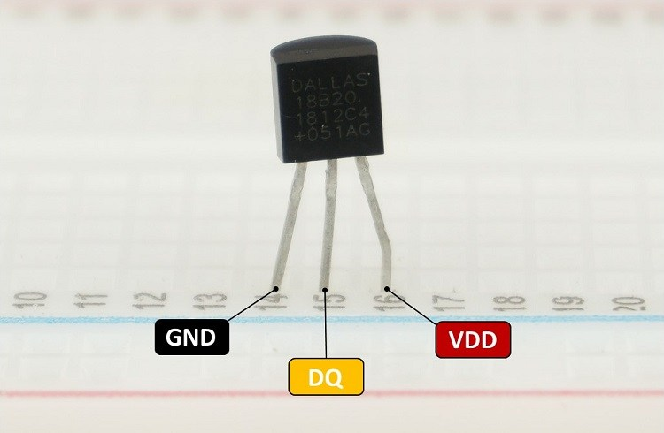
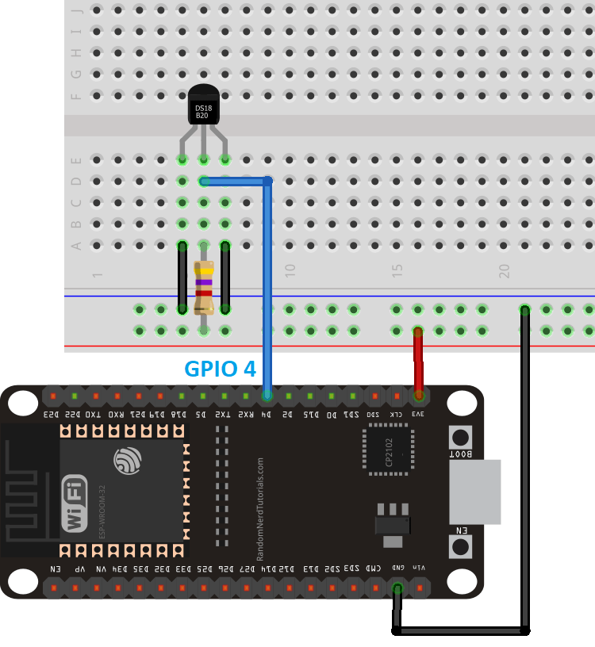
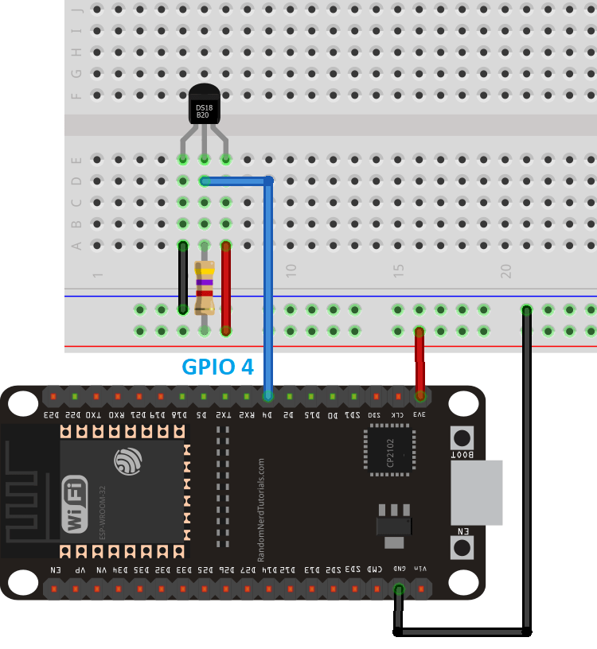

>[Torna a gateway LoRaWan](lorawan.md)

## **Gateway per BUS Dallas (OneWire)**

### **Schema di principio del BUS OneWire**

Notare i **collegamenti in parallelo** tra tutti i dispositivi attorno a 2 (parasite mode) o 3 fili (normal mode).


### **Il sensore di temperatura DS18B20**



### **Parasite mode**

Il bus onewire teoricamente possiede **2 soli fili** (uno senza la massa):
- una **massa comune** per il ritorno della corrente 
- un **filo dati** che è usato anche per l'alimentazione del dispositivo. Poichè il livello **L (basso)** è di solito codificato con 0V l'alimentazione risulta **intermittente**. Per ovviare a questi buchi (lack) di alimentazione si collega una **capacità** in parallelo a massa e linea dati che funge da **tampone locale** alla mancanza di alimentazione dovuta a sequenze consecutive di zeri. Questo modo di funzionamente si chiama **parasite mode**.



### **Normal mode**

In pratica è usuale anche un collegamento a **3 fili** (2 senza la massa):
- una **massa comune** per il ritorno della corrente 
- un **filo dati** che è **a se stante** cioè **non** viene usato anche per l'alimentazione del dispositivo.
- un **positivo di alimentazione** che alimenta tutti i dispositivi. Questa modalità si chiama **normal mode**.



### **Librerie del progetto**

Dal **punto di vista SW** sevono **due librerie** da scaricare e scompattare dentro la solita cartella **libraries** (disponibili su Git al link https://github.com/PaulStoffregen/OneWire e al link https://github.com/milesburton/Arduino-Temperature-Control-Library) :
- **OneWire-master.zip** da scompattare e rinominare semplicemente **OneWire**. Per installare il protocollo standard OneWire.
- **Arduino-Temperature-Control-Library-master** da scompattare e rinominare semplicemente **DallasTemperature** per installare il particolare protocollo applicativo di quella categoria di sensori di temperatura (**DS18B20**).

### **Gateway OneWire-LoRaWan con modem RN2483 per la lettura di un solo sensore**

La libreria MQTT è asincrona per cui non bloccante. E' adoperabile sia per **ESP8266** che per **ESP32**.

Anche in questo caso sono possibili entrambi i collegamenti, **normal mode** e **parasite mode**. Di seguito è illustrato il **normal mode**:


```C++
/*
 * Author: JP Meijers
 * Date: 2016-10-20
 *
 * Transmit a one byte packet via TTN. This happens as fast as possible, while still keeping to
 * the 1% duty cycle rules enforced by the RN2483's built in LoRaWAN stack. Even though this is
 * allowed by the radio regulations of the 868MHz band, the fair use policy of TTN may prohibit this.
 *
 * CHECK THE RULES BEFORE USING THIS PROGRAM!
 *
 * CHANGE ADDRESS!
 * Change the device address, network (session) key, and app (session) key to the values
 * that are registered via the TTN dashboard.
 * The appropriate line is "myLora.initABP(XXX);" or "myLora.initOTAA(XXX);"
 * When using ABP, it is advised to enable "relax frame count".
 *
 * Connect the RN2xx3 as follows:
 * RN2xx3 -- ESP8266
 * Uart TX -- GPIO4
 * Uart RX -- GPIO5
 * Reset -- GPIO15
 * Vcc -- 3.3V
 * Gnd -- Gnd
 *
 */
#include <rn2xx3.h>
#include <SoftwareSerial.h>
#include <OneWire.h>
#include <DallasTemperature.h>

#define RESET 15
//sensors defines
#define ONWIREPORT 10
SoftwareSerial mySerial(4, 5); // RX, TX !! labels on relay board is swapped !!
//create an instance of the rn2xx3 library,
//giving the software UART as stream to use,
//and using LoRa WAN
rn2xx3 myLora(mySerial);
// Setup the one wire connection on pin 10
OneWire oneWire(ONWIREPORT);
DallasTemperature sensors(&oneWire);
DeviceAddress thermometer;

void inline sensorsInit() {
	sensors.begin();
}

void inline readSensorsAndTx() {
	// Get the temp
	sensors.getAddress(thermometer, 0);
	sensors.setResolution(thermometer, 12);
	sensors.requestTemperatures();
	uint16_t temperature = sensors.getTempC(thermometer);

	// Split both words (16 bits) into 2 bytes of 8
	byte payload[2];
	payload[0] = highByte(temperature);
	payload[1] = lowByte(temperature);

	Serial.print("Temperature: ");
	Serial.println(temperature);

	//myLora.tx("!"); //send String, blocking function
	myLora.txBytes(payload, sizeof(payload)); // blocking function
}

// the setup routine runs once when you press reset:
void setup() {
  // LED pin is GPIO2 which is the ESP8266's built in LED
  pinMode(2, OUTPUT);
  led_on();

  // Open serial communications and wait for port to open:
  Serial.begin(57600);
  mySerial.begin(57600);
  
  sensorsInit();
  
  delay(1000); //wait for the arduino ide's serial console to open

  Serial.println("Startup");

  initialize_radio();

  //transmit a startup message
  myLora.tx("TTN Mapper on ESP8266 node");

  led_off();

  delay(2000);
}

void initialize_radio()
{
  //reset RN2xx3
  pinMode(RESET, OUTPUT);
  digitalWrite(RESET, LOW);
  delay(100);
  digitalWrite(RESET, HIGH);

  delay(100); //wait for the RN2xx3's startup message
  mySerial.flush();

  //check communication with radio
  String hweui = myLora.hweui();
  while(hweui.length() != 16)
  {
    Serial.println("Communication with RN2xx3 unsuccessful. Power cycle the board.");
    Serial.println(hweui);
    delay(10000);
    hweui = myLora.hweui();
  }

  //print out the HWEUI so that we can register it via ttnctl
  Serial.println("When using OTAA, register this DevEUI: ");
  Serial.println(hweui);
  Serial.println("RN2xx3 firmware version:");
  Serial.println(myLora.sysver());

  //configure your keys and join the network
  Serial.println("Trying to join TTN");
  bool join_result = false;

  //ABP: initABP(String addr, String AppSKey, String NwkSKey);
  join_result = myLora.initABP("02017201", "8D7FFEF938589D95AAD928C2E2E7E48F", "AE17E567AECC8787F749A62F5541D522");

  //OTAA: initOTAA(String AppEUI, String AppKey);
  //join_result = myLora.initOTAA("70B3D57ED00001A6", "A23C96EE13804963F8C2BD6285448198");

  while(!join_result)
  {
    Serial.println("Unable to join. Are your keys correct, and do you have TTN coverage?");
    delay(60000); //delay a minute before retry
    join_result = myLora.init();
  }
  Serial.println("Successfully joined TTN");

}

// the loop routine runs over and over again forever:
void loop() {
    led_on();
    
    readSensorsAndTx();
	
    led_off();
    delay(200);
}

void led_on()
{
  digitalWrite(2, 1);
}

void led_off()
{
  digitalWrite(2, 0);
}
```

**Sitografia:**

https://randomnerdtutorials.com/esp32-mqtt-publish-ds18b20-temperature-arduino/
https://randomnerdtutorials.com/micropython-mqtt-publish-ds18b10-esp32-esp8266/
https://randomnerdtutorials.com/esp32-ds18b20-temperature-arduino-ide/
https://randomnerdtutorials.com/esp32-multiple-ds18b20-temperature-sensors/

>[Torna a gateway LoRaWan](lorawan.md)

