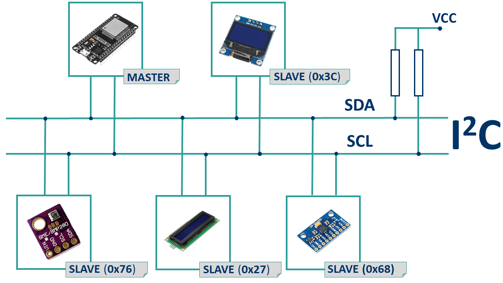

>[Torna a gateway LoraWan con modem LMIC](gatewayi2clorasw.md)

## **Gateway per BUS I2C (TwoWire)**

### **Schema di principio del BUS I2C**

Notare i **collegamenti in parallelo** tra tutti i dispositivi attorno a 3 fili (2 fili escluso massa).

 

### **Il sensore di movimento MPU6050**


### **Esempio di cablaggio**


### **Librerie del progetto**

Dal **punto di vista SW** seve **una libreria** da scaricare dentro la solita cartella **libraries** (disponibile su Git al link https://github.com/ElectronicCats/mpu6050) :
- **mpu6050-master.zip** da scompattare e rinominare semplicemente **mpu6050**. Per installare il protocollo standard I2C e il driver del sensore MPU6050.

### **Gateway MPU6050-LoRaWan con modem RN2483**

La libreria MQTT è asincrona per cui non bloccante. E' adoperabile sia per **ESP8266** che per **ESP32**.

```C++
/*******************************************************************************
 * Copyright (c) 2015 Thomas Telkamp and Matthijs Kooijman
 * Copyright (c) 2018 Terry Moore, MCCI
 *
 * Permission is hereby granted, free of charge, to anyone
 * obtaining a copy of this document and accompanying files,
 * to do whatever they want with them without any restriction,
 * including, but not limited to, copying, modification and redistribution.
 * NO WARRANTY OF ANY KIND IS PROVIDED.
 *
 * This example sends a valid LoRaWAN packet with payload "Hello,
 * world!", using frequency and encryption settings matching those of
 * the The Things Network.
 *
 * This uses OTAA (Over-the-air activation), where where a DevEUI and
 * application key is configured, which are used in an over-the-air
 * activation procedure where a DevAddr and session keys are
 * assigned/generated for use with all further communication.
 *
 * Note: LoRaWAN per sub-band duty-cycle limitation is enforced (1% in
 * g1, 0.1% in g2), but not the TTN fair usage policy (which is probably
 * violated by this sketch when left running for longer)!

 * To use this sketch, first register your application and device with
 * the things network, to set or generate an AppEUI, DevEUI and AppKey.
 * Multiple devices can use the same AppEUI, but each device has its own
 * DevEUI and AppKey.
 *
 * Do not forget to define the radio type correctly in
 * arduino-lmic/project_config/lmic_project_config.h or from your BOARDS.txt.
 *
 *******************************************************************************/

#include <lmic.h>
#include <hal/hal.h>
#include <SPI.h>

// include the MPU6050 Sensor Library
#include <I2Cdev.h>
#include <Wire.h>
#include <MPU6050.h>

//
// For normal use, we require that you edit the sketch to replace FILLMEIN
// with values assigned by the TTN console. However, for regression tests,
// we want to be able to compile these scripts. The regression tests define
// COMPILE_REGRESSION_TEST, and in that case we define FILLMEIN to a non-
// working but innocuous value.
//
#define FILLMEIN 1
/*
#ifdef COMPILE_REGRESSION_TEST
#define FILLMEIN 0
#else
#warning "You must replace the values marked FILLMEIN with real values from the TTN control panel!"
#define FILLMEIN (#dont edit this, edit the lines that use FILLMEIN)
#endif
*/
// This EUI must be in little-endian format, so least-significant-byte
// first. When copying an EUI from ttnctl output, this means to reverse
// the bytes. For TTN issued EUIs the last bytes should be 0xD5, 0xB3,
// 0x70.
static const u1_t PROGMEM APPEUI[8]={ FILLMEIN };
void os_getArtEui (u1_t* buf) { memcpy_P(buf, APPEUI, 8);}

// This should also be in little endian format, see above.
static const u1_t PROGMEM DEVEUI[8]={ FILLMEIN };
void os_getDevEui (u1_t* buf) { memcpy_P(buf, DEVEUI, 8);}

// This key should be in big endian format (or, since it is not really a
// number but a block of memory, endianness does not really apply). In
// practice, a key taken from ttnctl can be copied as-is.
static const u1_t PROGMEM APPKEY[16] = { FILLMEIN };
void os_getDevKey (u1_t* buf) {  memcpy_P(buf, APPKEY, 16);}

// payload to send to TTN gateway
static uint8_t payload[5];
static osjob_t sendjob;
bool flag_TXCOMPLETE = false;

// Schedule TX every this many seconds (might become longer due to duty
// cycle limitations).
const unsigned TX_INTERVAL = 60;

// Pin mapping
const lmic_pinmap lmic_pins = {
    .nss = 6,
    .rxtx = LMIC_UNUSED_PIN,
    .rst = 5,
    .dio = {2, 3, 4},
};

// class default I2C address is 0x68
// specific I2C addresses may be passed as a parameter here
// AD0 low = 0x68 (default for InvenSense evaluation board)
// AD0 high = 0x69
MPU6050 accelgyro;
int16_t ax, ay, az;
int16_t gx, gy, gz;

void set_sensor_offset() {
  // use the code below to change accel/gyro offset values
  Serial.println("Updating internal sensor offsets...");
    // -76  -2359 1688  0 0 0
    Serial.print(accelgyro.getXAccelOffset()); Serial.print("\t"); // -76
    Serial.print(accelgyro.getYAccelOffset()); Serial.print("\t"); // -2359
    Serial.print(accelgyro.getZAccelOffset()); Serial.print("\t"); // 1688
    Serial.print(accelgyro.getXGyroOffset()); Serial.print("\t"); // 0
    Serial.print(accelgyro.getYGyroOffset()); Serial.print("\t"); // 0
    Serial.print(accelgyro.getZGyroOffset()); Serial.print("\t"); // 0
    Serial.print("\n");
    accelgyro.setXGyroOffset(220);
    accelgyro.setYGyroOffset(76);
    accelgyro.setZGyroOffset(-85);
    Serial.print(accelgyro.getXAccelOffset()); Serial.print("\t"); // -76
    Serial.print(accelgyro.getYAccelOffset()); Serial.print("\t"); // -2359
    Serial.print(accelgyro.getZAccelOffset()); Serial.print("\t"); // 1688
    Serial.print(accelgyro.getXGyroOffset()); Serial.print("\t"); // 0
    Serial.print(accelgyro.getYGyroOffset()); Serial.print("\t"); // 0
    Serial.print(accelgyro.getZGyroOffset()); Serial.print("\t"); // 0
    Serial.print("\n");
}

void printHex2(unsigned v) {
    v &= 0xff;
    if (v < 16)
        Serial.print('0');
    Serial.print(v, HEX);
}

void onEvent (ev_t ev) {
    Serial.print(os_getTime());
    Serial.print(": ");
    switch(ev) {
        case EV_JOINED:
            Serial.println(F("EV_JOINED"));
            {
              u4_t netid = 0;
              devaddr_t devaddr = 0;
              u1_t nwkKey[16];
              u1_t artKey[16];
              LMIC_getSessionKeys(&netid, &devaddr, nwkKey, artKey);
              Serial.print("netid: ");
              Serial.println(netid, DEC);
              Serial.print("devaddr: ");
              Serial.println(devaddr, HEX);
              Serial.print("AppSKey: ");
              for (size_t i=0; i<sizeof(artKey); ++i) {
                if (i != 0)
                  Serial.print("-");
                printHex2(artKey[i]);
              }
              Serial.println("");
              Serial.print("NwkSKey: ");
              for (size_t i=0; i<sizeof(nwkKey); ++i) {
                      if (i != 0)
                              Serial.print("-");
                      printHex2(nwkKey[i]);
              }
              Serial.println();
            }
            // Disable link check validation (automatically enabled
            // during join, but because slow data rates change max TX
	        // size, we don't use it in this example.
            LMIC_setLinkCheckMode(0);
            break;
        case EV_TXCOMPLETE:
            Serial.println(F("EV_TXCOMPLETE (includes waiting for RX windows)"));
            if (LMIC.txrxFlags & TXRX_ACK)
              Serial.println(F("Received ack"));
            if (LMIC.dataLen) {
              Serial.print(F("Received "));
              Serial.print(LMIC.dataLen);
              Serial.println(F(" bytes of payload"));
            }
            // Schedule next transmission
            os_setTimedCallback(&sendjob, os_getTime()+sec2osticks(TX_INTERVAL), do_send);
	        flag_TXCOMPLETE = true;
            break;
	case EV_LINK_DEAD:
            initLoRaWAN();
	    break;
        default:
            Serial.print(F("Unknown event: "));
            Serial.println((unsigned) ev);
            break;
    }
}

void do_send(osjob_t* j){
	// Split both words (16 bits) into 2 bytes of 8
	byte payload[12];

	accelgyro.getMotion6(&ax, &ay, &az, &gx, &gy, &gz);

	payload[0] = highByte(ax);
	payload[1] = lowByte(ax);
	payload[2] = highByte(ay);
	payload[3] = lowByte(ay);
	payload[4] = highByte(az);
	payload[5] = lowByte(az);
	payload[6] = highByte(gx);
	payload[7] = lowByte(gx);
	payload[8] = highByte(gy);
	payload[9] = lowByte(gy);
	payload[10] = highByte(gz);
	payload[11] = lowByte(gz);

	LMIC_setTxData2(1, payload, sizeof(payload)-1, 0);
	Serial.println(F("Packet queued"));
}

void initLoRaWAN() {
	// LMIC init
	os_init();

	// Reset the MAC state. Session and pending data transfers will be discarded.
	LMIC_reset();

	// by joining the network, precomputed session parameters are be provided.
	//LMIC_setSession(0x1, DevAddr, (uint8_t*)NwkSkey, (uint8_t*)AppSkey);

	// Enabled data rate adaptation
	LMIC_setAdrMode(1);

	// Enable link check validation
	LMIC_setLinkCheckMode(0);

	// Set data rate and transmit power
	LMIC_setDrTxpow(DR_SF7, 21);
}

void sensorInit(){
	// join I2C bus (I2Cdev library doesn't do this automatically)
	Wire.begin();
	// initialize device
	delay(2000);
	Serial.println("Initializing I2C devices...");
	accelgyro.initialize();
	delay(2000);
	// verify connection
	Serial.println("Testing device connections...");
	Serial.println(accelgyro.testConnection() ? "MPU6050 connection successful" : "MPU6050 connection failed");
	delay(500);
	//Set accel/gyro offsets
	set_sensor_offset();
}

void setup() {
    Serial.begin(9600);
    Serial.println(F("Starting"));

    #ifdef VCC_ENABLE
    // For Pinoccio Scout boards
    pinMode(VCC_ENABLE, OUTPUT);
    digitalWrite(VCC_ENABLE, HIGH);
    delay(1000);
    #endif

   // Setup LoRaWAN state
	initLoRaWAN();
	
	sensorInit();

    // Start job (sending automatically starts OTAA too)
    do_send(&sendjob);
}

void loop() {
	os_runloop_once();
	/* In caso di instabilità
	//Run LMIC loop until he as finish
	while(flag_TXCOMPLETE == false)
	{
		os_runloop_once();
	}
	flag_TXCOMPLETE = false;
	*/
}
```

**Sitografia:**
- https://randomnerdtutorials.com/esp32-mpu-6050-web-server/


>[Torna a gateway LoraWan con modem RN2483](gatewayi2clorasw.md)
