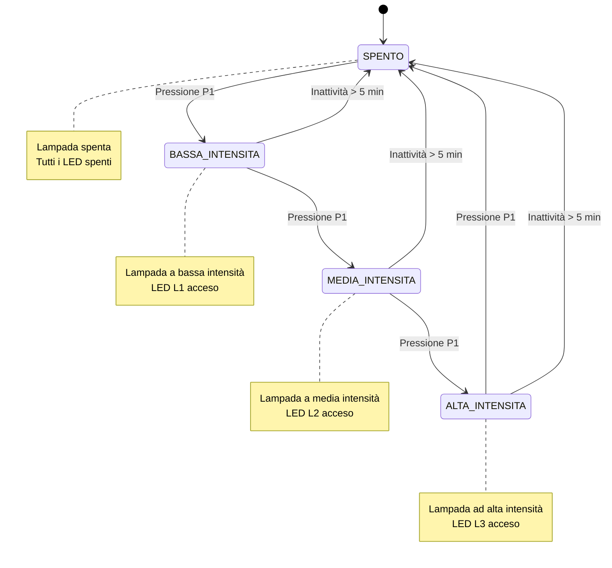

>[Torna all'indice generale](indexstatifiniti.md)

# **PULSANTE LUCI**

Scrivere un programma che realizzi una lampada intelligente
che funzioni in questo modo:
- Si accenda premendo il pulsante P1, alla cui pressione si attiva la luce a bassa intensità (stato 1) e si accende il LED indicatore L1.
- Una seconda pressione del pulsante P1 mentre la lampada è accesa a bassa intensità la porta a media intensità (stato 2), spegnendo L1 e accendendo L2.
- Una terza pressione del pulsante P1 porta la lampada ad alta intensità (stato 3), spegnendo L2 e accendendo L3.
- Una quarta pressione del pulsante P1 spegne completamente la lampada (stato 0), spegnendo tutti i LED indicatori.
- Se la lampada rileva che non ci sono movimenti per più di 5 minuti (tramite un sensore di movimento PIR), si spegne automaticamente passando allo stato 0.

Gli studenti dovranno:     
- Identificare gli stati necessari per descrivere il funzionamento del sistema.
- Definire le transizioni tra gli stati in base agli eventi rilevati dai sensori e alle azioni richieste dal sistema.
- Individuare quali siano gli ingressi (input) e le uscite (output) che il sistema deve gestire.
- Implementare la logica della FSM in un microcontrollore (Arduino, ESP32 o altro) utilizzando un linguaggio di programmazione adeguato.
- Documentare il lavoro svolto con un diagramma a stati e una tabella delle  transizioni.

## Tabella di Transizione della Lampada Intelligente

| Stato attuale | Input | Stato prossimo | Output |
|---------------|-------|----------------|--------|
| SPENTO | Pressione pulsante P1 | BASSA_INTENSITA | Lampada accesa a bassa intensità, LED L1 acceso |
| BASSA_INTENSITA | Pressione pulsante P1 | MEDIA_INTENSITA | Lampada accesa a media intensità, LED L1 spento, LED L2 acceso |
| BASSA_INTENSITA | Inattività > 5 minuti | SPENTO | Lampada spenta, LED L1 spento |
| MEDIA_INTENSITA | Pressione pulsante P1 | ALTA_INTENSITA | Lampada accesa ad alta intensità, LED L2 spento, LED L3 acceso |
| MEDIA_INTENSITA | Inattività > 5 minuti | SPENTO | Lampada spenta, LED L2 spento |
| ALTA_INTENSITA | Pressione pulsante P1 | SPENTO | Lampada spenta, LED L3 spento |
| ALTA_INTENSITA | Inattività > 5 minuti | SPENTO | Lampada spenta, LED L3 spento |

## Ingressi (Input)
- **Pulsante P1**: Utilizzato per cambiare l'intensità della lampada
- **Sensore PIR**: Sensore di movimento per rilevare l'inattività

## Uscite (Output)
- **Lampada**: Con tre livelli di intensità (bassa, media, alta)
- **LED L1**: Indicatore di bassa intensità 
- **LED L2**: Indicatore di media intensità
- **LED L3**: Indicatore di alta intensità

## Note
- Il sistema rileva l'inattività tramite il sensore PIR e avvia un timer di 5 minuti
- Ogni rilevamento di movimento resetta il timer di inattività
- In ogni stato di accensione, solo uno dei LED indicatori è acceso

## **Diagramma degli stati**



## **Codice Arduino "prima gli stati e poi gli ingressi"**

```C++
//##### urutils.h #####
void waitUntilInputLow(int btn, unsigned t)
{
   do{
     delay(t);
   }while(digitalRead(btn)!=LOW);
}

struct DiffTimer
{
	unsigned long elapsed, last;
	bool timerstate=false;
	byte state = 0;
	byte count = 0;
	void reset(){
		elapsed = 0;
		last = millis();
	}
	void toggle(){
		if(timerstate){
    	    stop();
		}else{
			start();
		}	
	}
	void stop(){
		if(timerstate){
			timerstate = false;
    	    elapsed += millis() - last;
		}	
	}
	void start(){
		if(!timerstate){
			timerstate = true;
			last = millis();
		}
	}
	unsigned long get(){
		if(timerstate){
			return millis() - last + elapsed;
		}
		return elapsed;
	}
	void set(unsigned long e){
		reset();
		elapsed = e;
	}
};
//##### urutils.h #####

// Definizione dei pin
const int pulsanteP1 = 2;     // Pin per il pulsante P1
const int pirSensor = 3;      // Pin per il sensore PIR
const int ledL1 = 4;          // LED indicatore bassa intensità
const int ledL2 = 5;          // LED indicatore media intensità
const int ledL3 = 6;          // LED indicatore alta intensità
const int outputLampada = 9;  // Pin PWM per controllare l'intensità della lampada

// Valori di intensità della lampada
const int INTENSITA_BASSA = 85;    // ~33% di 255
const int INTENSITA_MEDIA = 170;   // ~66% di 255
const int INTENSITA_ALTA = 255;    // 100% di 255

// Timer per l'inattività
DiffTimer timerInattivita;
const unsigned long TEMPO_INATTIVITA = 300000; // 5 minuti in millisecondi

// Definizione stati
enum Stati {
  SPENTO = 0,
  BASSA_INTENSITA = 1,
  MEDIA_INTENSITA = 2,
  ALTA_INTENSITA = 3
};

// Variabile di stato
uint8_t statoCorrente;

void setup() {
  // Inizializzazione pin
  pinMode(pulsanteP1, INPUT);    // Pulsante con resistenza di pull-down esterna
  pinMode(pirSensor, INPUT);     // Sensore PIR
  pinMode(ledL1, OUTPUT);
  pinMode(ledL2, OUTPUT);
  pinMode(ledL3, OUTPUT);
  pinMode(outputLampada, OUTPUT);
  
  // Inizializzazione stato
  statoCorrente = SPENTO;
  
  // Inizializzazione seriale per debug
  Serial.begin(115200);
  
  // Spegni tutti i LED e la lampada inizialmente
  digitalWrite(ledL1, LOW);
  digitalWrite(ledL2, LOW);
  digitalWrite(ledL3, LOW);
  analogWrite(outputLampada, 0);
  
  Serial.println("Sistema Lampada Intelligente inizializzato");
}

void loop() {
  // Macchina a stati
  switch (statoCorrente) {
    case SPENTO:
      // Stato SPENTO: tutti i LED e lampada spenti
      digitalWrite(ledL1, LOW);
      digitalWrite(ledL2, LOW);
      digitalWrite(ledL3, LOW);
      analogWrite(outputLampada, 0);
      
      Serial.println("Stato: SPENTO");
      
      // Controllo pressione pulsante P1 (HIGH con pull-down quando premuto)
      if (digitalRead(pulsanteP1) == HIGH) {
        waitUntilInputLow(pulsanteP1, 50); // Debounce tramite waitUntilInputLow
        statoCorrente = BASSA_INTENSITA;
        timerInattivita.reset();
        timerInattivita.start();
      }
      break;
      
    case BASSA_INTENSITA:
      // Stato BASSA_INTENSITA: LED L1 acceso, altri spenti, lampada a bassa intensità
      digitalWrite(ledL1, HIGH);
      digitalWrite(ledL2, LOW);
      digitalWrite(ledL3, LOW);
      analogWrite(outputLampada, INTENSITA_BASSA);
      
      Serial.println("Stato: BASSA_INTENSITA");
      
      // Controllo pressione pulsante P1
      if (digitalRead(pulsanteP1) == HIGH) {
        waitUntilInputLow(pulsanteP1, 50);
        statoCorrente = MEDIA_INTENSITA;
        timerInattivita.reset(); // Reset del timer di inattività
      }
      
      // Controllo movimento (rilevato = HIGH)
      if (digitalRead(pirSensor) == HIGH) {
        timerInattivita.reset(); // Reset del timer di inattività
        Serial.println("Movimento rilevato - Timer resettato");
      }
      
      // Verifica inattività
      if (timerInattivita.get() > TEMPO_INATTIVITA) {
        Serial.println("Inattività rilevata - Spegnimento automatico");
        timerInattivita.stop();
        statoCorrente = SPENTO;
      }
      break;
      
    case MEDIA_INTENSITA:
      // Stato MEDIA_INTENSITA: LED L2 acceso, altri spenti, lampada a media intensità
      digitalWrite(ledL1, LOW);
      digitalWrite(ledL2, HIGH);
      digitalWrite(ledL3, LOW);
      analogWrite(outputLampada, INTENSITA_MEDIA);
      
      Serial.println("Stato: MEDIA_INTENSITA");
      
      // Controllo pressione pulsante P1
      if (digitalRead(pulsanteP1) == HIGH) {
        waitUntilInputLow(pulsanteP1, 50);
        statoCorrente = ALTA_INTENSITA;
        timerInattivita.reset(); // Reset del timer di inattività
      }
      
      // Controllo movimento
      if (digitalRead(pirSensor) == HIGH) {
        timerInattivita.reset(); // Reset del timer di inattività
        Serial.println("Movimento rilevato - Timer resettato");
      }
      
      // Verifica inattività
      if (timerInattivita.get() > TEMPO_INATTIVITA) {
        Serial.println("Inattività rilevata - Spegnimento automatico");
        timerInattivita.stop();
        statoCorrente = SPENTO;
      }
      break;
      
    case ALTA_INTENSITA:
      // Stato ALTA_INTENSITA: LED L3 acceso, altri spenti, lampada ad alta intensità
      digitalWrite(ledL1, LOW);
      digitalWrite(ledL2, LOW);
      digitalWrite(ledL3, HIGH);
      analogWrite(outputLampada, INTENSITA_ALTA);
      
      Serial.println("Stato: ALTA_INTENSITA");
      
      // Controllo pressione pulsante P1
      if (digitalRead(pulsanteP1) == HIGH) {
        waitUntilInputLow(pulsanteP1, 50);
        statoCorrente = SPENTO;
        timerInattivita.stop(); // Ferma il timer di inattività
      }
      
      // Controllo movimento
      if (digitalRead(pirSensor) == HIGH) {
        timerInattivita.reset(); // Reset del timer di inattività
        Serial.println("Movimento rilevato - Timer resettato");
      }
      
      // Verifica inattività
      if (timerInattivita.get() > TEMPO_INATTIVITA) {
        Serial.println("Inattività rilevata - Spegnimento automatico");
        timerInattivita.stop();
        statoCorrente = SPENTO;
      }
      break;
  }
  
  delay(10); // Piccolo delay per stabilità
}
```

Simulazione con Arduino su Tinkercad: https://www.tinkercad.com/things/ixDZp3lQSwo-lampada-intelligente

## **Codice Arduino "prima gli ingressi e poi gli stati"**

```C++
//##### urutils.h #####
void waitUntilInputLow(int btn, unsigned t)
{
   do{
     delay(t);
   }while(digitalRead(btn)!=LOW);
}

struct DiffTimer
{
	unsigned long elapsed, last;
	bool timerstate=false;
	byte state = 0;
	byte count = 0;
	void reset(){
		elapsed = 0;
		last = millis();
	}
	void toggle(){
		if(timerstate){
    	    stop();
		}else{
			start();
		}	
	}
	void stop(){
		if(timerstate){
			timerstate = false;
    	    elapsed += millis() - last;
		}	
	}
	void start(){
		if(!timerstate){
			timerstate = true;
			last = millis();
		}
	}
	unsigned long get(){
		if(timerstate){
			return millis() - last + elapsed;
		}
		return elapsed;
	}
	void set(unsigned long e){
		reset();
		elapsed = e;
	}
};
//##### urutils.h #####

// Definizione dei pin
const int pulsanteP1 = 2;     // Pin per il pulsante P1
const int pirSensor = 3;      // Pin per il sensore PIR
const int ledL1 = 4;          // LED indicatore bassa intensità
const int ledL2 = 5;          // LED indicatore media intensità
const int ledL3 = 6;          // LED indicatore alta intensità
const int outputLampada = 9;  // Pin PWM per controllare l'intensità della lampada

// Valori di intensità della lampada
const int INTENSITA_BASSA = 85;    // ~33% di 255
const int INTENSITA_MEDIA = 170;   // ~66% di 255
const int INTENSITA_ALTA = 255;    // 100% di 255

// Timer per l'inattività
DiffTimer timerInattivita;
const unsigned long TEMPO_INATTIVITA = 300000; // 5 minuti in millisecondi

// Definizione stati
enum Stati {
  SPENTO = 0,
  BASSA_INTENSITA = 1,
  MEDIA_INTENSITA = 2,
  ALTA_INTENSITA = 3
};

// Variabile di stato
uint8_t statoCorrente;

void setup() {
  // Inizializzazione pin
  pinMode(pulsanteP1, INPUT);    // Pulsante con resistenza di pull-down esterna
  pinMode(pirSensor, INPUT);     // Sensore PIR
  pinMode(ledL1, OUTPUT);
  pinMode(ledL2, OUTPUT);
  pinMode(ledL3, OUTPUT);
  pinMode(outputLampada, OUTPUT);
  
  // Inizializzazione stato
  statoCorrente = SPENTO;
  
  // Inizializzazione seriale per debug
  Serial.begin(115200);
  
  // Spegni tutti i LED e la lampada inizialmente
  digitalWrite(ledL1, LOW);
  digitalWrite(ledL2, LOW);
  digitalWrite(ledL3, LOW);
  analogWrite(outputLampada, 0);
  
  Serial.println("Sistema Lampada Intelligente inizializzato");
}

void loop() {
  // Macchina a stati con priorità agli ingressi
  
  // INGRESSO 1: Pulsante P1 premuto
  if (digitalRead(pulsanteP1) == HIGH) {
    waitUntilInputLow(pulsanteP1, 50); // Debounce tramite waitUntilInputLow
    
    // Gestione pressione del pulsante in base allo stato attuale
    switch (statoCorrente) {
      case SPENTO:
        Serial.println("Passaggio a BASSA_INTENSITA");
        statoCorrente = BASSA_INTENSITA;
        // Output per BASSA_INTENSITA
        digitalWrite(ledL1, HIGH);
        digitalWrite(ledL2, LOW);
        digitalWrite(ledL3, LOW);
        analogWrite(outputLampada, INTENSITA_BASSA);
        // Avvio timer inattività
        timerInattivita.reset();
        timerInattivita.start();
        break;
        
      case BASSA_INTENSITA:
        Serial.println("Passaggio a MEDIA_INTENSITA");
        statoCorrente = MEDIA_INTENSITA;
        // Output per MEDIA_INTENSITA
        digitalWrite(ledL1, LOW);
        digitalWrite(ledL2, HIGH);
        digitalWrite(ledL3, LOW);
        analogWrite(outputLampada, INTENSITA_MEDIA);
        // Reset timer inattività
        timerInattivita.reset();
        break;
        
      case MEDIA_INTENSITA:
        Serial.println("Passaggio a ALTA_INTENSITA");
        statoCorrente = ALTA_INTENSITA;
        // Output per ALTA_INTENSITA
        digitalWrite(ledL1, LOW);
        digitalWrite(ledL2, LOW);
        digitalWrite(ledL3, HIGH);
        analogWrite(outputLampada, INTENSITA_ALTA);
        // Reset timer inattività
        timerInattivita.reset();
        break;
        
      case ALTA_INTENSITA:
        Serial.println("Passaggio a SPENTO");
        statoCorrente = SPENTO;
        // Output per SPENTO
        digitalWrite(ledL1, LOW);
        digitalWrite(ledL2, LOW);
        digitalWrite(ledL3, LOW);
        analogWrite(outputLampada, 0);
        // Stop timer inattività
        timerInattivita.stop();
        break;
    }
  }
  
  // INGRESSO 2: Sensore di movimento PIR
  else if (digitalRead(pirSensor) == HIGH) {
    // Gestione rilevamento movimento in base allo stato attuale
    switch (statoCorrente) {
      case SPENTO:
        // Non fa nulla quando è spento
        break;
        
      case BASSA_INTENSITA:
      case MEDIA_INTENSITA:
      case ALTA_INTENSITA:
        // Reset del timer di inattività per tutti gli stati accesi
        timerInattivita.reset();
        Serial.println("Movimento rilevato - Timer resettato");
        break;
    }
  }
  
  // INGRESSO 3: Timer di inattività scaduto
  else if (timerInattivita.get() > TEMPO_INATTIVITA) {
    // Gestione timeout inattività in base allo stato attuale
    switch (statoCorrente) {
      case SPENTO:
        // Già spento, non fa nulla
        break;
        
      case BASSA_INTENSITA:
      case MEDIA_INTENSITA:
      case ALTA_INTENSITA:
        // Spegnimento automatico per tutti gli stati accesi
        Serial.println("Inattività rilevata - Spegnimento automatico");
        statoCorrente = SPENTO;
        // Output per SPENTO
        digitalWrite(ledL1, LOW);
        digitalWrite(ledL2, LOW);
        digitalWrite(ledL3, LOW);
        analogWrite(outputLampada, 0);
        // Stop timer inattività
        timerInattivita.stop();
        break;
    }
  }
  
  delay(10); // Piccolo delay per stabilità
}
```

>[Torna all'indice generale](indexstatifiniti.md)
