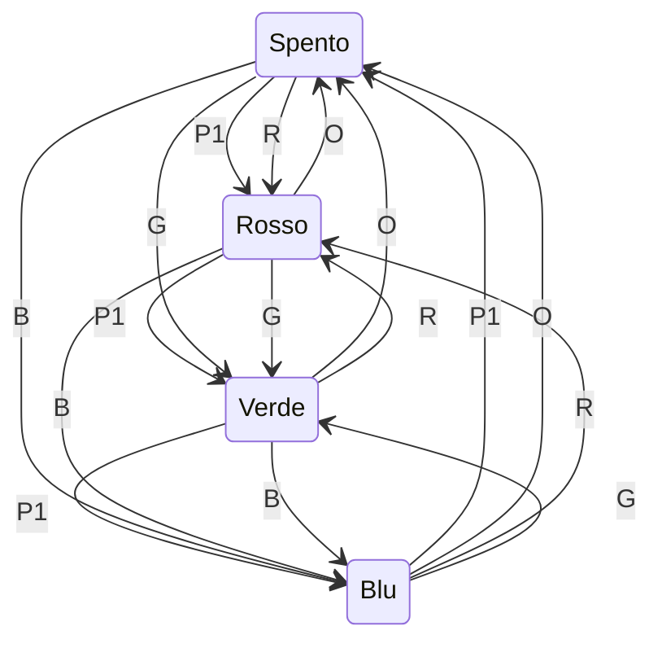

>[Torna all'indice generale](indexstatifiniti.md)

# **PULSANTE LUCI SERIALE**

Esercitazione: Sistema di controllo illuminazione con FSM e comunicazione seriale

Implementare un sistema di controllo per una striscia LED RGB utilizzando una macchina a stati finiti (FSM) che risponda sia a input fisici che a comandi seriali.
Specifiche del progetto:

Il sistema deve funzionare nel seguente modo:
- Un pulsante fisico (P1) cambia la modalità di illuminazione ciclicamente
- Comandi seriali possono essere usati per controllare il sistema da remoto

Il sistema ha 4 stati principali:
- Stato 0: Spento (tutti i LED spenti)
- Stato 1: Colore Rosso
- Stato 2: Colore Verde
- Stato 3: Colore Blu

Requisiti di funzionamento:
- La pressione del pulsante P1 fa avanzare il sistema al prossimo stato in sequenza
- Quando la striscia LED è nello stato 3 (Blu), una ulteriore pressione di P1 riporta il sistema allo stato 0 (Spento)

Il sistema deve accettare i seguenti comandi seriali:
- "R" - Imposta il sistema su Rosso (Stato 1)
- "G" - Imposta il sistema su Verde (Stato 2)
- "B" - Imposta il sistema su Blu (Stato 3)
- "O" - Spegne il sistema (Stato 0)
- "S" - Richiede lo stato attuale del sistema (risponde con "Stato: X")


Ad ogni cambiamento di stato, il sistema deve inviare un messaggio seriale indicando il nuovo stato

Collegamenti hardware:
- Pin 2: Pulsante P1 (con resistenza di pull-up)
- Pin 9: LED Rosso (o canale R di un LED RGB)
- Pin 10: LED Verde (o canale G di un LED RGB)
- Pin 11: LED Blu (o canale B di un LED RGB)

Compiti:
- Identificare gli stati e le transizioni della macchina a stati finiti
- Disegnare un diagramma degli stati che mostri chiaramente tutte le possibili transizioni
- Implementare il codice Arduino che realizzi la macchina a stati descritta
- Implementare la gestione della comunicazione seriale per ricevere comandi ed inviare lo stato corrente
- Documentare il lavoro con commenti adeguati nel codice e una breve relazione
- Testare il sistema verificando che risponda correttamente sia agli input fisici che ai comandi seriali

Suggerimenti:
- Utilizzare variabili per tenere traccia dello stato corrente del sistema
- Gestire correttamente il debounce del pulsante per evitare letture multiple
- Utilizzare la funzione Serial.available() per verificare se ci sono dati disponibili sulla porta seriale
- Utilizzare una struttura switch-case per implementare la logica di transizione tra gli stati


## Tabella di Transizione della Lampada Intelligente

Per dettagli sulle macchine a stati finiti (o FSM) vedi [FSM](indexstatifiniti.md) e [Linee guida FSM](statifinitisviluppo.md)

## Tabella di Transizione della Lampada Intelligente
| Stato attuale | Input | Stato prossimo | Output |
|---------------|-------|----------------|--------|
| SPENTO | Pressione pulsante P1 | BASSA_INTENSITA | Lampada accesa a bassa intensità, LED L1 acceso |
| SPENTO | Rilevamento movimento (PIR) | SPENTO | Nessun cambiamento |
| BASSA_INTENSITA | Pressione pulsante P1 | MEDIA_INTENSITA | Lampada accesa a media intensità, LED L1 spento, LED L2 acceso |
| BASSA_INTENSITA | Inattività > 5 minuti (PIR) | SPENTO | Lampada spenta, LED L1 spento |
| BASSA_INTENSITA | Rilevamento movimento (PIR) | BASSA_INTENSITA | Reset timer inattività |
| MEDIA_INTENSITA | Pressione pulsante P1 | ALTA_INTENSITA | Lampada accesa ad alta intensità, LED L2 spento, LED L3 acceso |
| MEDIA_INTENSITA | Inattività > 5 minuti (PIR) | SPENTO | Lampada spenta, LED L2 spento |
| MEDIA_INTENSITA | Rilevamento movimento (PIR) | MEDIA_INTENSITA | Reset timer inattività |
| ALTA_INTENSITA | Pressione pulsante P1 | SPENTO | Lampada spenta, LED L3 spento |
| ALTA_INTENSITA | Inattività > 5 minuti (PIR) | SPENTO | Lampada spenta, LED L3 spento |
| ALTA_INTENSITA | Rilevamento movimento (PIR) | ALTA_INTENSITA | Reset timer inattività |

Ho aggiunto sia le transizioni per il rilevamento del movimento (che resettano il timer di inattività quando la lampada è accesa) che il comportamento quando il PIR rileva movimento mentre la lampada è spenta (in quel caso non succede nulla, poiché l'accensione avviene solo tramite pressione del pulsante P1).
## Ingressi (Input)
- **Pulsante P1**: Utilizzato per cambiare l'intensità della lampada
- **Sensore PIR**: Sensore di movimento per rilevare l'inattività

## Uscite (Output)
- **Lampada**: Con tre livelli di intensità (bassa, media, alta)
- **LED L1**: Indicatore di bassa intensità 
- **LED L2**: Indicatore di media intensità
- **LED L3**: Indicatore di alta intensità

## Note
- Il sistema rileva l'inattività tramite il sensore PIR e avvia un timer di 5 minuti
- Ogni rilevamento di movimento resetta il timer di inattività
- In ogni stato di accensione, solo uno dei LED indicatori è acceso

## **Diagramma degli stati**



## **Codice Arduino "prima gli stati e poi gli ingressi"**

Per lo sviluppo fare riferimento alla metodologia esposta in: [priorità-statoingresso](statifinitisviluppo.md#priorità-statoingresso)

```C++
/*
 * Sistema di controllo illuminazione RGB con FSM e comunicazione seriale
 * 
 * Implementazione di un sistema di controllo per una striscia LED RGB
 * utilizzando una macchina a stati finiti (FSM) che risponda sia a 
 * input fisici che a comandi seriali.
 * 
 * Specifiche:
 * - 4 stati: Spento, Rosso, Verde, Blu
 * - Transizioni: pulsante fisico P1 o comandi seriali
 * - Comunicazione seriale per controllo remoto
 * 
 * Pin:
 * - Pin 2: Pulsante P1 (con resistenza di pull-up)
 * - Pin 9: LED Rosso (o canale R di un LED RGB)
 * - Pin 10: LED Verde (o canale G di un LED RGB)
 * - Pin 11: LED Blu (o canale B di un LED RGB)
 */

//##### urutils.h #####
void waitUntilInputLow(int btn, unsigned t)
{
   do{
     delay(t);
   }while(digitalRead(btn)!=LOW);
}

struct DiffTimer
{
	unsigned long elapsed, last;
	bool timerstate=false;
	byte state = 0;
	byte count = 0;
	void reset(){
		elapsed = 0;
		last = millis();
	}
	void toggle(){
		if(timerstate){
    	    		stop();
		}else{
			start();
		}	
	}
	void stop(){
		if(timerstate){
			timerstate = false;
    	    		elapsed += millis() - last;
		}	
	}
	void start(){
		if(!timerstate){
			timerstate = true;
			last = millis();
		}
	}
	unsigned long get(){
		if(timerstate){
			return millis() - last + elapsed;
		}
		return elapsed;
	}
	void set(unsigned long e){
		reset();
		elapsed = e;
	}
};
//##### Fine urutils.h #####

// Definizione dei pin
const int pulsanteP1 = 2;  // Pin per il pulsante P1
const int redPin = 9;      // LED Rosso
const int greenPin = 10;   // LED Verde
const int bluePin = 11;    // LED Blu

// Definizione degli stati
enum Stati {
  SPENTO = 0,
  STATO_ROSSO = 1,
  STATO_VERDE = 2,
  STATO_BLU = 3
};

// Variabile di stato
uint8_t statoCorrente = SPENTO;

void updateOutputs(uint8_t r, uint8_t g, uint8_t b){
    digitalWrite(redPin, r);
    digitalWrite(greenPin, g);
    digitalWrite(bluePin, b);
}

// Funzione per stampare la descrizione dello stato
void stampaDescrizioneStato() {
  switch (statoCorrente) {
    case SPENTO:
      Serial.println("LED spenti");
      break;
    case STATO_ROSSO:
      Serial.println("LED Rosso acceso");
      break;
    case STATO_VERDE:
      Serial.println("LED Verde acceso");
      break;
    case STATO_BLU:
      Serial.println("LED Blu acceso");
      break;
  }
  Serial.println();
}

// Funzione per gestire i comandi seriali
void gestioneComandi() {
  if (Serial.available() > 0) {
    char comando = Serial.read();
    comando = toupper(comando);
    
    switch (comando) {
      case 'R': // Rosso
        statoCorrente = STATO_ROSSO;
        Serial.println("Comando ricevuto: R (Rosso)");
        Serial.println("Stato: STATO_ROSSO");
        updateOutputs(HIGH, LOW, LOW);
        break;
      case 'G': // Verde
        statoCorrente = STATO_VERDE;
        Serial.println("Comando ricevuto: G (Verde)");
        Serial.println("Stato: STATO_VERDE");
        updateOutputs(LOW, HIGH, LOW);
        break;
      case 'B': // Blu
        statoCorrente = STATO_BLU;
        Serial.println("Comando ricevuto: B (Blu)");
        Serial.println("Stato: STATO_BLU");
        updateOutputs(LOW, LOW, HIGH);
        break;
      case 'O': // Spento
        statoCorrente = SPENTO;
        Serial.println("Comando ricevuto: O (Spento)");
        Serial.println("Stato: SPENTO");
        updateOutputs(LOW, LOW, LOW);
        break;
      case 'S': // Stato
        Serial.println("Comando ricevuto: S (Stato)");
        Serial.print("Stato: ");
        Serial.println(statoCorrente);
        stampaDescrizioneStato();
        break;
    }
  }
}

void setup() {
  // Inizializzazione pin
  pinMode(pulsanteP1, INPUT_PULLUP);  // Pulsante con resistenza di pull-up interna
  pinMode(redPin, OUTPUT);
  pinMode(greenPin, OUTPUT);
  pinMode(bluePin, OUTPUT);
  
  // Inizializzazione seriale per debug
  Serial.begin(9600);
  
  // Spegni tutti i LED inizialmente
  updateOutputs(LOW, LOW, LOW);
  
  Serial.println("Sistema di controllo LED RGB avviato");
  Serial.println("Comandi disponibili: R, G, B, O, S");
  Serial.print("Stato: ");
  Serial.println(statoCorrente);
  stampaDescrizioneStato();
}

void loop() {
  // Gestione dei comandi seriali (fuori dallo switch-case)
  gestioneComandi();
  
  // Macchina a stati per gestione pulsante fisico
  switch (statoCorrente) {
    case SPENTO:
      // Stato SPENTO: tutti i LED spenti
      // Controllo pressione pulsante P1 (LOW con pull-up quando premuto)
      if (digitalRead(pulsanteP1) == LOW) {
        waitUntilInputLow(pulsanteP1, 50); // Debounce
        statoCorrente = STATO_ROSSO;
        Serial.println("Stato: STATO_ROSSO");
        // Imposta LED rosso acceso
        updateOutputs(HIGH, LOW, LOW);
      }
      break;
      
    case STATO_ROSSO:
      // Stato ROSSO: LED rosso acceso, altri spenti
      // Controllo pressione pulsante P1
      if (digitalRead(pulsanteP1) == LOW) {
        waitUntilInputLow(pulsanteP1, 50);
        statoCorrente = STATO_VERDE;
        Serial.println("Stato: STATO_VERDE");
        // Imposta LED verde acceso
        updateOutputs(LOW, HIGH, LOW);
      }
      break;
      
    case STATO_VERDE:
      // Stato VERDE: LED verde acceso, altri spenti
      // Controllo pressione pulsante P1
      if (digitalRead(pulsanteP1) == LOW) {
        waitUntilInputLow(pulsanteP1, 50);
        statoCorrente = STATO_BLU;
        Serial.println("Stato: STATO_BLU");
        // Imposta LED blu acceso
        updateOutputs(LOW, LOW, HIGH);
      }
      break;
      
    case STATO_BLU:
      // Stato BLU: LED blu acceso, altri spenti
      // Controllo pressione pulsante P1
      if (digitalRead(pulsanteP1) == LOW) {
        waitUntilInputLow(pulsanteP1, 50);
        statoCorrente = SPENTO;
        Serial.println("Stato: SPENTO");
        // Spegni tutti i LED
        updateOutputs(LOW, LOW, LOW);
      }
      break;
  }
  
  delay(10); // Piccolo delay per stabilità
}
```

Simulazione su Arduino con Tinkercad: https://www.tinkercad.com/things/b8jpqj7mosQ-lampada-seriale

>[Torna all'indice generale](indexstatifiniti.md)
