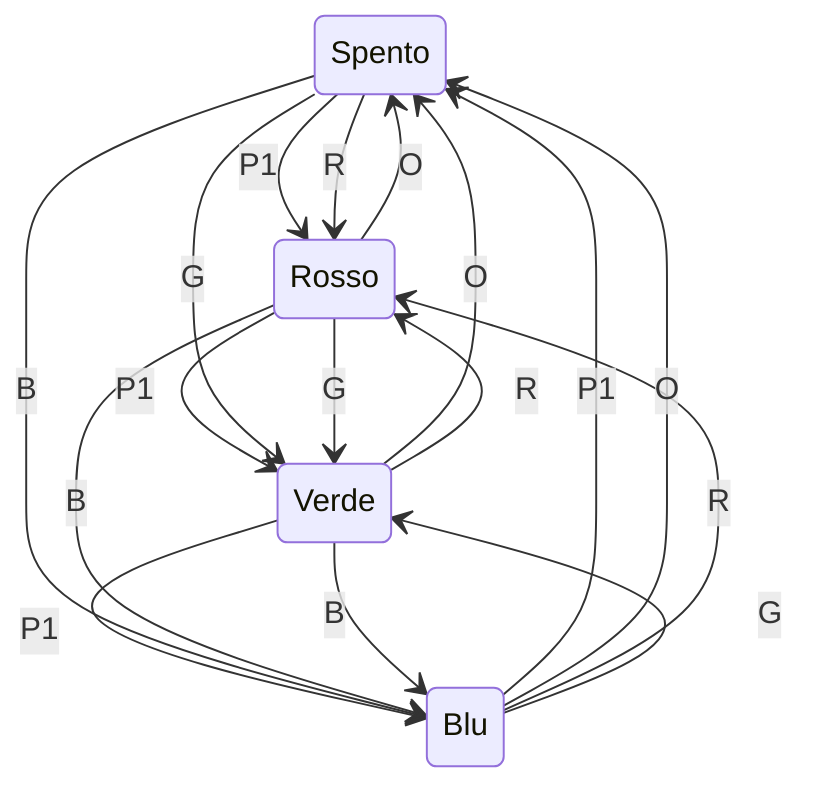

>[Torna all'indice generale](indexstatifiniti.md)

# **PULSANTE LUCI SERIALE**

Esercitazione: Sistema di controllo illuminazione con FSM e comunicazione seriale

Implementare un sistema di controllo per una striscia LED RGB utilizzando una macchina a stati finiti (FSM) che risponda sia a input fisici che a comandi seriali.
Specifiche del progetto:

Il sistema deve funzionare nel seguente modo:
- Un pulsante fisico (P1) cambia la modalità di illuminazione ciclicamente
- Comandi seriali possono essere usati per controllare il sistema da remoto

Il sistema ha 4 stati principali:
- Stato 0: Spento (tutti i LED spenti)
- Stato 1: Colore Rosso
- Stato 2: Colore Verde
- Stato 3: Colore Blu

Requisiti di funzionamento:
- La pressione del pulsante P1 fa avanzare il sistema al prossimo stato in sequenza
- Quando la striscia LED è nello stato 3 (Blu), una ulteriore pressione di P1 riporta il sistema allo stato 0 (Spento)

Il sistema deve accettare i seguenti comandi seriali:
- "R" - Imposta il sistema su Rosso (Stato 1)
- "G" - Imposta il sistema su Verde (Stato 2)
- "B" - Imposta il sistema su Blu (Stato 3)
- "O" - Spegne il sistema (Stato 0)
- "S" - Richiede lo stato attuale del sistema (risponde con "Stato: X")


Ad ogni cambiamento di stato, il sistema deve inviare un messaggio seriale indicando il nuovo stato

Collegamenti hardware:
- Pin 2: Pulsante P1 (con resistenza di pull-up)
- Pin 9: LED Rosso (o canale R di un LED RGB)
- Pin 10: LED Verde (o canale G di un LED RGB)
- Pin 11: LED Blu (o canale B di un LED RGB)

Compiti:
- Identificare gli stati e le transizioni della macchina a stati finiti
- Disegnare un diagramma degli stati che mostri chiaramente tutte le possibili transizioni
- Implementare il codice Arduino che realizzi la macchina a stati descritta
- Implementare la gestione della comunicazione seriale per ricevere comandi ed inviare lo stato corrente
- Documentare il lavoro con commenti adeguati nel codice e una breve relazione
- Testare il sistema verificando che risponda correttamente sia agli input fisici che ai comandi seriali

Suggerimenti:
- Utilizzare variabili per tenere traccia dello stato corrente del sistema
- Gestire correttamente il debounce del pulsante per evitare letture multiple
- Utilizzare la funzione Serial.available() per verificare se ci sono dati disponibili sulla porta seriale
- Utilizzare una struttura switch-case per implementare la logica di transizione tra gli stati


## Tabella di Transizione della Lampada Intelligente

Per dettagli sulle macchine a stati finiti (o FSM) vedi [FSM](indexstatifiniti.md) e [Linee guida FSM](statifinitisviluppo.md)

## Tabella di Transizione della Lampada Intelligente
| Stato attuale | Input | Stato prossimo | Output |
|---------------|-------|----------------|--------|
| SPENTO | Pressione pulsante P1 | BASSA_INTENSITA | Lampada accesa a bassa intensità, LED L1 acceso |
| SPENTO | Rilevamento movimento (PIR) | SPENTO | Nessun cambiamento |
| BASSA_INTENSITA | Pressione pulsante P1 | MEDIA_INTENSITA | Lampada accesa a media intensità, LED L1 spento, LED L2 acceso |
| BASSA_INTENSITA | Inattività > 5 minuti (PIR) | SPENTO | Lampada spenta, LED L1 spento |
| BASSA_INTENSITA | Rilevamento movimento (PIR) | BASSA_INTENSITA | Reset timer inattività |
| MEDIA_INTENSITA | Pressione pulsante P1 | ALTA_INTENSITA | Lampada accesa ad alta intensità, LED L2 spento, LED L3 acceso |
| MEDIA_INTENSITA | Inattività > 5 minuti (PIR) | SPENTO | Lampada spenta, LED L2 spento |
| MEDIA_INTENSITA | Rilevamento movimento (PIR) | MEDIA_INTENSITA | Reset timer inattività |
| ALTA_INTENSITA | Pressione pulsante P1 | SPENTO | Lampada spenta, LED L3 spento |
| ALTA_INTENSITA | Inattività > 5 minuti (PIR) | SPENTO | Lampada spenta, LED L3 spento |
| ALTA_INTENSITA | Rilevamento movimento (PIR) | ALTA_INTENSITA | Reset timer inattività |

Ho aggiunto sia le transizioni per il rilevamento del movimento (che resettano il timer di inattività quando la lampada è accesa) che il comportamento quando il PIR rileva movimento mentre la lampada è spenta (in quel caso non succede nulla, poiché l'accensione avviene solo tramite pressione del pulsante P1).
## Ingressi (Input)
- **Pulsante P1**: Utilizzato per cambiare l'intensità della lampada
- **Sensore PIR**: Sensore di movimento per rilevare l'inattività

## Uscite (Output)
- **Lampada**: Con tre livelli di intensità (bassa, media, alta)
- **LED L1**: Indicatore di bassa intensità 
- **LED L2**: Indicatore di media intensità
- **LED L3**: Indicatore di alta intensità

## Note
- Il sistema rileva l'inattività tramite il sensore PIR e avvia un timer di 5 minuti
- Ogni rilevamento di movimento resetta il timer di inattività
- In ogni stato di accensione, solo uno dei LED indicatori è acceso

## **Diagramma degli stati**



## **Codice Arduino "prima gli stati e poi gli ingressi"**

Per lo sviluppo fare riferimento alla metodologia esposta in: [priorità-statoingresso](statifinitisviluppo.md#priorità-statoingresso)

```C++
//##### urutils.h #####
void waitUntilInputLow(int btn, unsigned t)
{
   do{
     delay(t);
   }while(digitalRead(btn)!=LOW);
}

struct DiffTimer
{
	unsigned long elapsed, last;
	bool timerstate=false;
	byte state = 0;
	byte count = 0;
	void reset(){
		elapsed = 0;
		last = millis();
	}
	void toggle(){
		if(timerstate){
    	    		stop();
		}else{
			start();
		}	
	}
	void stop(){
		if(timerstate){
			timerstate = false;
    	    		elapsed += millis() - last;
		}	
	}
	void start(){
		if(!timerstate){
			timerstate = true;
			last = millis();
		}
	}
	unsigned long get(){
		if(timerstate){
			return millis() - last + elapsed;
		}
		return elapsed;
	}
	void set(unsigned long e){
		reset();
		elapsed = e;
	}
};
//##### urutils.h #####

// Definizione dei pin
const int pulsanteP1 = 2;     // Pin per il pulsante P1
const int pirSensor = 8;      // Pin per il sensore PIR
const int ledL1 = 13;          // LED indicatore bassa intensità
const int ledL2 = 12;          // LED indicatore media intensità
const int ledL3 = 4;          // LED indicatore alta intensità
const int outputLampada = 5;  // Pin PWM per controllare l'intensità della lampada

// Valori di intensità della lampada
const int OFF = 0;    // 0% di 255
const int INTENSITA_BASSA = 85;    // ~33% di 255
const int INTENSITA_MEDIA = 170;   // ~66% di 255
const int INTENSITA_ALTA = 255;    // 100% di 255

// Timer per l'inattività
DiffTimer timerInattivita;
const unsigned long TEMPO_INATTIVITA = 300000; // 5 minuti in millisecondi

// Definizione stati
enum Stati {
  SPENTO = 0,
  BASSA_INTENSITA = 1,
  MEDIA_INTENSITA = 2,
  ALTA_INTENSITA = 3
};

// Variabile di stato
uint8_t statoCorrente;

void updateOutputs(uint8_t l1, uint8_t l2, uint8_t l3, uint8_t al){
    digitalWrite(ledL1, l1);
    digitalWrite(ledL2, l2);
    digitalWrite(ledL3, l3);
    analogWrite(outputLampada, al);   
}

void setup() {
  // Inizializzazione pin
  pinMode(pulsanteP1, INPUT);    // Pulsante con resistenza di pull-down esterna
  pinMode(pirSensor, INPUT);     // Sensore PIR
  pinMode(ledL1, OUTPUT);
  pinMode(ledL2, OUTPUT);
  pinMode(ledL3, OUTPUT);
  pinMode(outputLampada, OUTPUT);
  
  // Inizializzazione stato
  statoCorrente = SPENTO;  
  // Inizializzazione seriale per debug
  Serial.begin(115200);  
  // Spegni tutti i LED e la lampada inizialmente
  updateOutputs(LOW, LOW, LOW, SPENTO);  
  Serial.println("Sistema Lampada Intelligente inizializzato");
}

void loop() {
  // Macchina a stati
  switch (statoCorrente) {
    case SPENTO:   
      // Stato SPENTO: tutti i LED e lampada spenti
      // Controllo pressione pulsante P1 (HIGH con pull-down quando premuto)
      if (digitalRead(pulsanteP1) == HIGH) {
        waitUntilInputLow(pulsanteP1, 50); // Debounce tramite waitUntilInputLow
	Serial.println("Stato: BASSA_INTENSITA");
        statoCorrente = BASSA_INTENSITA;
	Serial.println("Stato: BASSA_INTENSITA");
	// impostazione valore uscite
	updateOutputs(HIGH, LOW, LOW, INTENSITA_BASSA);
	// inizializzazione stato successivo
        timerInattivita.reset();
        timerInattivita.start();
      }
      break;
      
    case BASSA_INTENSITA:
      // Stato BASSA_INTENSITA: LED L1 acceso, altri spenti, lampada a bassa intensità     
       
      if (digitalRead(pulsanteP1) == HIGH) {// Controllo pressione pulsante P1
        waitUntilInputLow(pulsanteP1, 50);
        statoCorrente = MEDIA_INTENSITA;
	Serial.println("Stato: MEDIA_INTENSITA");
	// impostazione valore uscite
	updateOutputs(LOW, HIGH, LOW, INTENSITA_MEDIA);
	// inizializzazione stato successivo
	timerInattivita.reset(); // Reset del timer di inattività
      }else if (digitalRead(pirSensor) == HIGH) {// Controllo movimento (rilevato = HIGH)
	// inizializzazione stato successivo
        timerInattivita.reset(); // Reset del timer di inattività
        Serial.println("Movimento rilevato - Timer resettato");
      }else if( timerInattivita.get() > TEMPO_INATTIVITA) {// Verifica inattività
        Serial.println("Inattività rilevata - Spegnimento automatico");
        statoCorrente = SPENTO;
	Serial.println("Stato: SPENTO");
	// impostazione valore uscite
	updateOutputs(LOW, LOW, LOW, OFF);
	// inizializzazione stato successivo
	timerInattivita.stop();
      }
      break;
      
    case MEDIA_INTENSITA:
      // Stato MEDIA_INTENSITA: LED L2 acceso, altri spenti, lampada a media intensità
      // Controllo pressione pulsante P1
      if(digitalRead(pulsanteP1) == HIGH) {
        waitUntilInputLow(pulsanteP1, 50);
        statoCorrente = ALTA_INTENSITA;
	Serial.println("Stato: ALTA_INTENSITA");
	// impostazione valore uscite
	updateOutputs(LOW, LOW, HIGH, INTENSITA_ALTA);
	// inizializzazione stato successivo
        timerInattivita.reset(); // Reset del timer di inattività
      }else if (digitalRead(pirSensor) == HIGH) {// Controllo movimento
	// inizializzazione stato successivo
        timerInattivita.reset(); // Reset del timer di inattività
        Serial.println("Movimento rilevato - Timer resettato");
      }else if (timerInattivita.get() > TEMPO_INATTIVITA) {// Verifica inattività
        Serial.println("Inattività rilevata - Spegnimento automatico");
        statoCorrente = SPENTO;
	Serial.println("Stato: SPENTO");
	// impostazione valore uscite
	updateOutputs(LOW, LOW, LOW, OFF);
	// inizializzazione stato successivo
	timerInattivita.reset();
      }
      break;
      
    case ALTA_INTENSITA:
      // Stato ALTA_INTENSITA: LED L3 acceso, altri spenti, lampada ad alta intensità           
      // Controllo pressione pulsante P1
      if(digitalRead(pulsanteP1) == HIGH) {
	Serial.println("Stato: SPENTO");
        waitUntilInputLow(pulsanteP1, 50);
        statoCorrente = SPENTO;
	// impostazione valore uscite
	updateOutputs(LOW, LOW, LOW, OFF);
	// inizializzazione stato successivo
        timerInattivita.stop(); // Ferma il timer di inattività
      }else if(digitalRead(pirSensor) == HIGH) { // controllo movimento
	// inizializzazione stato successivo
        timerInattivita.reset(); // Reset del timer di inattività
        Serial.println("Movimento rilevato - Timer resettato");
      }else if(timerInattivita.get() > TEMPO_INATTIVITA) {// Verifica inattività
        Serial.println("Inattività rilevata - Spegnimento automatico");
        statoCorrente = SPENTO;
	Serial.println("Stato: SPENTO");
	// impostazione valore uscite
	updateOutputs(LOW, LOW, LOW, OFF);
	// inizializzazione stato successivo
	timerInattivita.stop();
      }
      break;
  }
  delay(10); // Piccolo delay per stabilità
}
```

Simulazione con Arduino su Tinkercad: https://www.tinkercad.com/things/ixDZp3lQSwo-lampada-intelligente

## **Codice Arduino "prima gli ingressi e poi gli stati"**

Per lo sviluppo fare riferimento alla metodologia esposta in: [priorità-statoingresso](statifinitisviluppo.md#priorità-statoingresso)

```C++
//##### urutils.h #####
void waitUntilInputLow(int btn, unsigned t)
{
   do{
     delay(t);
   }while(digitalRead(btn)!=LOW);
}

struct DiffTimer
{
	unsigned long elapsed, last;
	bool timerstate=false;
	byte state = 0;
	byte count = 0;
	void reset(){
		elapsed = 0;
		last = millis();
	}
	void toggle(){
		if(timerstate){
    	    		stop();
		}else{
			start();
		}	
	}
	void stop(){
		if(timerstate){
			timerstate = false;
    	    		elapsed += millis() - last;
		}	
	}
	void start(){
		if(!timerstate){
			timerstate = true;
			last = millis();
		}
	}
	unsigned long get(){
		if(timerstate){
			return millis() - last + elapsed;
		}
		return elapsed;
	}
	void set(unsigned long e){
		reset();
		elapsed = e;
	}
};
//##### urutils.h #####

// Definizione dei pin
const int pulsanteP1 = 2;     // Pin per il pulsante P1
const int pirSensor = 3;      // Pin per il sensore PIR
const int ledL1 = 4;          // LED indicatore bassa intensità
const int ledL2 = 5;          // LED indicatore media intensità
const int ledL3 = 6;          // LED indicatore alta intensità
const int outputLampada = 9;  // Pin PWM per controllare l'intensità della lampada

// Valori di intensità della lampada
const int OFF = 0;    // 0% di 255
const int INTENSITA_BASSA = 85;    // ~33% di 255
const int INTENSITA_MEDIA = 170;   // ~66% di 255
const int INTENSITA_ALTA = 255;    // 100% di 255

// Timer per l'inattività
DiffTimer timerInattivita;
const unsigned long TEMPO_INATTIVITA = 300000; // 5 minuti in millisecondi

// Definizione stati
enum Stati {
  SPENTO = 0,
  BASSA_INTENSITA = 1,
  MEDIA_INTENSITA = 2,
  ALTA_INTENSITA = 3
};

// Variabile di stato
uint8_t statoCorrente;

void updateOutputs(uint8_t l1, uint8_t l2, uint8_t l3, uint8_t al){
    digitalWrite(ledL1, l1);
    digitalWrite(ledL2, l2);
    digitalWrite(ledL3, l3);
    analogWrite(outputLampada, al);   
}

void setup() {
  // Inizializzazione pin
  pinMode(pulsanteP1, INPUT);    // Pulsante con resistenza di pull-down esterna
  pinMode(pirSensor, INPUT);     // Sensore PIR
  pinMode(ledL1, OUTPUT);
  pinMode(ledL2, OUTPUT);
  pinMode(ledL3, OUTPUT);
  pinMode(outputLampada, OUTPUT);
  
  // Inizializzazione stato
  statoCorrente = SPENTO;
  
  // Inizializzazione seriale per debug
  Serial.begin(115200);
  
  // Spegni tutti i LED e la lampada inizialmente
  updateOutputs(LOW, LOW, LOW, SPENTO);
  
  Serial.println("Sistema Lampada Intelligente inizializzato");
}

void loop() {
  // Macchina a stati con priorità agli ingressi
  
  // INGRESSO 1: Pulsante P1 premuto
  if (digitalRead(pulsanteP1) == HIGH) {
    waitUntilInputLow(pulsanteP1, 50); // Debounce tramite waitUntilInputLow
    // Gestione pressione del pulsante in base allo stato attuale
    switch (statoCorrente) {
      case SPENTO:
        Serial.println("Passaggio a BASSA_INTENSITA");
        statoCorrente = BASSA_INTENSITA;
        // impostazione valore uscite
        updateOutputs(HIGH, LOW, LOW, SPENTO);
        analogWrite(outputLampada, INTENSITA_BASSA);
	// inizializzazione stato successivo
        timerInattivita.reset();
        timerInattivita.start();// Avvio timer inattività
        break;
        
      case BASSA_INTENSITA:
        Serial.println("Passaggio a MEDIA_INTENSITA");
        statoCorrente = MEDIA_INTENSITA;
        // impostazione valore uscite
	updateOutputs(LOW, HIGH, LOW, INTENSITA_MEDIA);
        // inizializzazione stato successivo
        timerInattivita.reset();// Reset timer inattività
        break;
        
      case MEDIA_INTENSITA:
        Serial.println("Passaggio a ALTA_INTENSITA");
        statoCorrente = ALTA_INTENSITA;
        // impostazione valore uscite
	updateOutputs(LOW, LOW, HIGH, INTENSITA_ALTA);
	// inizializzazione stato successivo
        timerInattivita.reset();// Reset timer inattività
        break;
        
      case ALTA_INTENSITA:
        Serial.println("Passaggio a SPENTO");
        statoCorrente = SPENTO;
        // impostazione valore uscite
        updateOutputs(LOW, LOW, LOW, OFF);
	// inizializzazione stato successivo
        timerInattivita.stop();// Stop timer inattività
        break;
    }
  }
  
  // INGRESSO 2: Sensore di movimento PIR
  else if (digitalRead(pirSensor) == HIGH) {
    // Gestione rilevamento movimento in base allo stato attuale
    switch (statoCorrente) {
      case SPENTO:
        // Non fa nulla quando è spento
        break;
        
      case BASSA_INTENSITA:
      case MEDIA_INTENSITA:
      case ALTA_INTENSITA:
        // inizializzazione stato successivo
        timerInattivita.reset();// Reset del timer di inattività per tutti gli stati accesi
        Serial.println("Movimento rilevato - Timer resettato");
        break;
    }
  }
  
  // INGRESSO 3: Timer di inattività scaduto
  else if (timerInattivita.get() > TEMPO_INATTIVITA) {
    // Gestione timeout inattività in base allo stato attuale
    switch (statoCorrente) {
      case SPENTO:
        // Già spento, non fa nulla
        break;
        
      case BASSA_INTENSITA:
      case MEDIA_INTENSITA:
      case ALTA_INTENSITA:
        // Spegnimento automatico per tutti gli stati accesi
        Serial.println("Inattività rilevata - Spegnimento automatico");
        statoCorrente = SPENTO;
        // impostazione valore uscite
        updateOutputs(LOW, LOW, LOW, OFF);
        // inizializzazione stato successivo
        timerInattivita.stop();// Stop timer inattività
        break;
    }
  }
  delay(10); // Piccolo delay per stabilità
}
```

## **Codice Arduino "prima gli ingressi e poi gli stati" rappresentati come contatori**

Per lo sviluppo fare riferimento alla metodologia esposta in: [priorità-statoingresso](statifinitisviluppo.md#priorità-statoingresso)

```C++
//##### urutils.h #####
void waitUntilInputLow(int btn, unsigned t)
{
   do{
     delay(t);
   }while(digitalRead(btn)!=LOW);
}

struct DiffTimer
{
	unsigned long elapsed, last;
	bool timerstate=false;
	byte state = 0;
	byte count = 0;
	void reset(){
		elapsed = 0;
		last = millis();
	}
	void toggle(){
		if(timerstate){
    	    		stop();
		}else{
			start();
		}	
	}
	void stop(){
		if(timerstate){
			timerstate = false;
    	    		elapsed += millis() - last;
		}	
	}
	void start(){
		if(!timerstate){
			timerstate = true;
			last = millis();
		}
	}
	unsigned long get(){
		if(timerstate){
			return millis() - last + elapsed;
		}
		return elapsed;
	}
	void set(unsigned long e){
		reset();
		elapsed = e;
	}
};
//##### urutils.h #####

// Enum degli stati della lampada
enum StatoLampada {
  SPENTO = 0,
  BASSA_INTENSITA = 1,
  MEDIA_INTENSITA = 2,
  ALTA_INTENSITA = 3,
  NUM_STATI // Questo valore sarà automaticamente 4
};

// Definizione dei pin
const int pulsanteP1 = 2;     // Pin per il pulsante P1
const int pirSensor = 3;      // Pin per il sensore PIR
const int outputLampada = 9;  // Pin PWM per controllare l'intensità della lampada

// Array dei pin LED - ora possono essere non consecutivi
const int ledPins[] = {4, 5, 6};  // ledL1, ledL2, ledL3 - possono essere qualsiasi pin
const int NUM_LED = sizeof(ledPins) / sizeof(ledPins[0]);

// Valori di intensità della lampada
const int INTENSITA[] = {0, 85, 170, 255};  // Valori di intensità per ogni stato

// Timer per l'inattività
DiffTimer timerInattivita;
const unsigned long TEMPO_INATTIVITA = 300000; // 5 minuti in millisecondi

// Variabile di stato usando l'enum
StatoLampada statoCorrente = SPENTO;

// Nomi degli stati per i messaggi di debug
const char* NOMI_STATI[] = {"SPENTO", "BASSA_INTENSITA", "MEDIA_INTENSITA", "ALTA_INTENSITA"};

void setup() {
  // Inizializzazione pin
  pinMode(pulsanteP1, INPUT);    // Pulsante con resistenza di pull-down esterna
  pinMode(pirSensor, INPUT);     // Sensore PIR
  pinMode(outputLampada, OUTPUT);
  
  // Inizializzazione dei pin LED
  for (int i = 0; i < NUM_LED; i++) {
    pinMode(ledPins[i], OUTPUT);
    digitalWrite(ledPins[i], LOW);  // Tutti i LED inizialmente spenti
  }
  
  // Inizializzazione seriale per debug
  Serial.begin(115200);
  
  // Imposta l'output iniziale
  analogWrite(outputLampada, INTENSITA[statoCorrente]);
  
  Serial.println("Sistema Lampada Intelligente inizializzato");
}

void loop() {
  // Macchina a stati con priorità agli ingressi
  
  // INGRESSO 1: Pulsante P1 premuto
  if (digitalRead(pulsanteP1) == HIGH) {
    waitUntilInputLow(pulsanteP1, 50); // Debounce tramite waitUntilInputLow

    // inizializzazione stato successivo usando switch-case
    switch (statoCorrente) {
      case SPENTO:
        timerInattivita.reset();
        timerInattivita.start();
        break;
      case ALTA_INTENSITA:
        timerInattivita.stop();
        break;
      default:
        timerInattivita.reset();
        break;
    }
    
    // Incrementa lo stato in modo ciclico
    statoCorrente = static_cast<StatoLampada>((statoCorrente + 1) % NUM_STATI);
    Serial.print("Passaggio a stato: ");
    Serial.println(NOMI_STATI[statoCorrente]);
    
    // Aggiorna output in base al nuovo stato
    aggiornaOutput();
  }
  
  // INGRESSO 2: Sensore di movimento PIR
  else if (digitalRead(pirSensor) == HIGH) {
    // Reset del timer di inattività solo se la lampada è accesa
    if (statoCorrente != SPENTO) {
      timerInattivita.reset();
      Serial.println("Movimento rilevato - Timer resettato");
    }
  }
  
  // INGRESSO 3: Timer di inattività scaduto
  else if (statoCorrente != SPENTO && timerInattivita.get() > TEMPO_INATTIVITA) {
    // Spegnimento automatico
    Serial.println("Inattività rilevata - Spegnimento automatico");
    statoCorrente = SPENTO;  // Torna allo stato SPENTO
    // inizializzazione stato successivo
    timerInattivita.stop();
    
    // Aggiorna output
    aggiornaOutput();
  }

  delay(10); // Piccolo delay per stabilità
}

// Funzione per aggiornare gli output in base allo stato corrente
void aggiornaOutput() {
  // Imposta l'intensità della lampada
  analogWrite(outputLampada, INTENSITA[statoCorrente]);
  
  // Aggiorna i LED utilizzando uno switch-case
  // Prima spegne tutti i LED
  for (int i = 0; i < NUM_LED; i++) {
    digitalWrite(ledPins[i], LOW);
  }
  
  // Poi accende solo il LED appropriato in base allo stato
  switch (statoCorrente) {
    case SPENTO:
      // Tutti i LED rimangono spenti
      break;
    case BASSA_INTENSITA:
      digitalWrite(ledPins[0], HIGH);
      break;
    case MEDIA_INTENSITA:
      digitalWrite(ledPins[1], HIGH);
      break;
    case ALTA_INTENSITA:
      digitalWrite(ledPins[2], HIGH);
      break;
    default:
      // Gestione di sicurezza per stati imprevisti
      Serial.println("Stato non valido!");
      break;
  }
}
```

>[Torna all'indice generale](indexstatifiniti.md)
