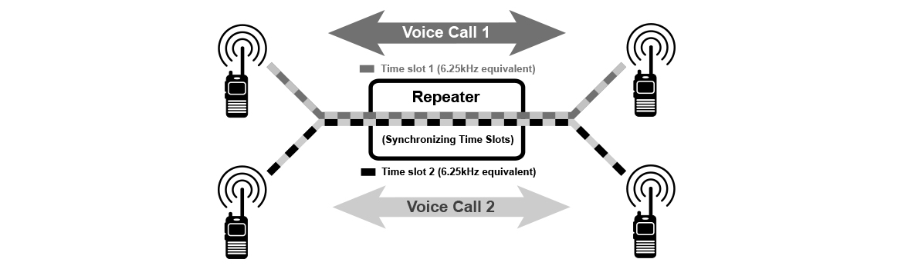
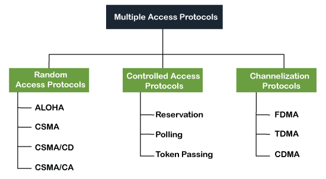

>[Torna a reti di sensori](sensornetworkshort.md#Interfaccia-radio)

## **Mezzo radio**

Il **mezzo radio** possiede la **proprietà** di essere intrinsecamente **multipunto (mezzo broadcast)** cioè, se un interlocutore trasmette **tutti gli altri ascoltano**. Inoltre, essendo in pratica un BUS, è soggetto al fenomeno delle **collisioni** (in quest'ambito sono fisicamente delle interferenze distruttive) che si possono risolvere come sempre, cioè facendo in modo che in **certo canale**, in un **dato posto** e in un **dato tempo** si parli **uno alla volta**. Il **canale radio** cioè, è intrinsecamente **half duplex**. 

### **Duplexer**

Una trasmissione radio **full duplex** può essere realizzata:
- utilizzando **due canali diversi** nelle **due direzioni** di trasmissione (tecnica FDM)
- **partizionando** ulteriormente il canale nelle grandezze residue **ancora non partizionate** in **due sottocanali** (TDM o CDM). 

Normalmente si usa allo scopo il **tempo** con tecniche TDM, cioè **due interlocutori** diversi parlano nello stesso canale in **istanti diversi**. 

### **Multiplazione TDM**

Ma il meccanismo dell'**alternanza nel tempo** può anche essere esteso ad un **numero arbitrario** di interlocutori che parlano **uno alla volta** senza accavallarsi.

La partizione **TDM** nel tempo del canale può essere statica o dinamica. Quella **statica** utilizza la tecnica di multiplazione **TDMA**. Quella **dinamica** utilizza un **protocollo di arbitraggio** che, con un meccanismo di **ack**, permette di realizzare **l'alternanza nel tempo** delle comunicazioni. Si basa essenzialmente sui protocolli **ALOHA** o **CSMA/CA**. 

### **Multiplazione statica TDMA**

Nel **TDMA** un **numero arbitrario** di interlocutori parlano **a turno** secondo un criterio di dialogo assimilabile a quello della **"tavola rotonda"**. Ciascun interlocutore **è numerato** ed è **abbinato** ad **uno o più** numeri di **altri** interlocutori. Un partecipante con **un certo numero**, per realizzare una comunicazione **punto punto** o **multipunto**, dovrebbe **ascoltare** soltanto i discorsi pronunciati **da un solo** interlocutore o **da tutti** gli interlocutori aventi però uno dei numeri a cui egli **è abbinato**.

La multiplazione **statica TDMA** di **parecchie sorgenti** richiede però che **tutte** siano **sincronizzate** con precisione presso un **nodo router**, cioè non possono comunicare **direttamente tra loro**, in maniera peer to peer, ma solo in presenza di un **nodo master** da cui devono essere **ragiungibili**. 

Il **nodo master** stabilisce la **composizione** della **"tavola rotonda"** (cioè **chi** può trasmettere), in che **ordine** (cioè la scaletta degli interventi) e per **quanto tempo** deve durare un intervento. La **scaletta completa**, riportata sull'**asse dei tempi**, si chiama **trama**. Tutti gli interventi hanno, sull'asse dei tempi, durata uguale detta **slot** e, complessivamente, occupano esattamente tutta la trama.  La **trama** viene ripetuta **periodicamente** in un tempo detto **periodo di trama**. 

### **Multiplazione TDM dinamica ALOHA**

Nel **TDM** dinamico ALOHA un **numero arbitrario** di interlocutori parlano **non appena** hanno qualcosa da dire. Se sono **fortunati** nessun altro parla sopra di loro e la comunicazione va a buon fine. Se sono **sfortunati** la comunicazione è **degradata** in maniera irreparabile da una **collisione** con un'altra comunicazione concomitante. Il **caso** determina il **problema** e il caso fornisce pure una **soluzione**.

Rappresentazione grafica del protocollo **ALOHA**. I **riquadri chiari** indicano le trame ricevute correttamente. I **riquadri ombreggiati** indicano le trame che hanno **colliso** e che verranno scartate perchè arrivate **corrotte**. Il **servizio radio** potrebbe prevedere la funzione di **conferma**, cioè che **tutti i messaggi trasmessi** debbano essere **confermati** presso il **nodo** che li **ha trasmessi** mediante la **ricezione** di un **messaggio di ack** inviato dal **ricevente** al loro arrivo. Le **trame corrotte** non saranno confermate dal ricevente e, allo **scadere di un timeout**, verranno **ritrasmesse** ma **non subito**, bensì dopo un **tempo casuale** detto **backoff** che limita la probabilità che le **altre stazioni**, che hanno partecipato alla collisione, scelgano lo stesso tempo per **ricominciare** la loro **trasmissione**.
 

### **Gestione interferenze sul canale**

Spesso il **TDM** non partiziona direttamente il canale FDM ma tra esso e il canale FDM si **interpone** una ulteriore divisione nel **dominio della potenza** o nel **dominio del tempo**:
- **La prima** è detta **multiplazione a divisione di codice** o **CDMA** che è associata ad un certo **cluster di utenti** afferenti ad un **certo dispositivo** (ad esempio un AP WiFi). **Dispositivi diversi** hanno **codici** (detti ortogonali) **diversi**. Ad es, il **BSSID** di un AP (Access Point wifi) è associato ad un **codice ortogonale** diverso da quello degli altri AP in modo che una sua comunicazione sia **distinguibile** da quelle degli altri AP, pur interferndo completamente con quelle.  E' la strategia generalmente adottata nei sistemi LPWA, a **bassa potenza**, e **bassa bitrate** e **basso costo**.
**Riassumendo la divisione nel dominio della potenza (spettro espanso)**, si possono **annidare** le multiplazioni una dentro l'altra differenziando per **caratteristiche fisiche** diverse le **singole comunicazioni** e associandole a **gruppi di sorgenti diverse**. In questo caso:
    - la **banda** è **divisa** tra più **gruppi** di dispositivi (ad es. AP WiFi), ogni gruppo sul **suo canale FDM**, tramite una multiplazione **FDMA**.
    - un **canale FDM**, assegnato ad un gruppo di AP o BS, è **diviso** tra **più AP**, ogni AP col **suo codice ortogonale (canale CDM)**, tramite multiplazione **CDMA**.
    - un **canale CDM**, assegnato ad un gruppo di sorgenti (quelle **attestate** su **un AP**), è **diviso** tra **più sorgenti**, ogni sorgente col suo **slot temporale (canale TDM)**, tramite multiplazione **TDM** (dinamica o statica).  
- **La seconda** è detta **multiplazione a divisione di frequenze ortogonali** o **OFDM**. **Più canali** sono divisi in **sottoportanti diverse**. Ogni **sottoportante** può essere ulteriormente **partizionata nel tempo** tramite un **TDM** schedulato centralmente (nell'AP o nella BS) o tramite un TDM a contesa che la assegna a **più sorgenti**. Il partizionamento di una trasmissione veloce su un **canale a banda larga** in più trasmissioni lente su **sottoportanti a banda stretta** limita una eventuale collisione dovuta ad interferenza alla sola sottoportante in cui essa avviene, lasciando le altre in grado di comunicare ancora attive. In pratica, per ottenere **l'allocazione** del canale ad **una sorgente**, questo è **partizionato** **nel tempo** (con OFDMA anche **nella frequenza**). E' la strategia generalmente adottata nei sistemi **WiFi** e sistemi di telefonia mobile **4G** e **5G**, caratterizzati da **alte potenze**, **elevate bitrate** e **alto costo**.
    - In questo contesto l'**arbitraggio CSMA/CA** avviene a **livello di sottoportanti** e ha la particolarità di gestire non solo la **contesa** per l'**accesso al mezzo** tra dispositivi di **uno stesso AP**, ma anche quella di tutti i dispositivi, quelli appartennti ad un'**altro AP**, ma anche quelli appartenenti ad **altri sistemi** che in quella zona accedono al canale a vario titolo. Se l'**energia** delle inerferenze dovute ad altri sistemi **è elevata**, il canale è considerato **occupato** per cui viene **dilazionato** il tentativo di accedervi ad un **momento migliore**. L'**interferenza** tra comunicazioni diverse sul canale è evitata applicando il principo **LBT** (Listen Before Talk).
 
Normalmente le **multiplazioni** sono gestite a **livello fisico** in HW utilizzando delle **schede radio dedicate** su cui si impostano i **registri** per la **configurazione** e da cui provengono le **notifiche** dei vari **eventi** legati alla **trasmissione** o alla **ricezione**.

### **Comunicazioni non broadcast**

A seconda della tecnologia adoperata si possono realizare comunicazioni **punto-punto** o **multipunto**, ma di base il mezzo radio è pur sempre **intrinsecamente broadcast**. 

L'**isolamento punto punto** nei mezzi a BUS con **arbitraggio a contesa** (ALOHA e CSMA/CA) è in genere **logico** e non si ottiene **in trasmissione** scegliendo un **link isolato** verso la destinazione ma si ottiene **in ricezione**, a **livello di scheda** di rete, facendo in modo che una stazione radio che non riconosca il **proprio indirizzo** nella destinazione dei messaggi **ignori** le comunicazioni non proprie. Diventa più effettivo con la **cifratura** delle informazioni.

### **Multiplazioni non TDM**

In ogni caso, oltre che con il **TDMA**, con **FDMA** o con il **CSMA** è possibile pure **condividere** lo stesso canale per **più** comunicazioni **punto-punto**. Il mezzo radio è quindi anche assimilabile ad un **BUS condiviso** o mediante un **protocollo di arbitraggio** (ALOHA, CSMA/CA) o mediante una **tecnica di multiplazione statica** (FDMA, TDMA, CDMA, SDMA).

La **multiplazione SDM** (divisione di spazio) del mezzo radio è sempre in qualche misura possibile **controllando accuratamente le potenze** di trasmissione dato che la **propagazione** delle onde radio, anche **nel vuoto**, è soggetta ad un **intenso fenomeno di attenuazione** che cresce con il **quadrato della frequenza** e con il **quadrato della distanza**. Un esempio di SDM radio è la **divisione in celle** dell'area di **copertura del servizio** radio avente la proprietà che **celle vicine** usano frequenze molto diverse mentre **celle distanti** riutilizzano la stessa frequenza.

I dispositivi mobili che si spostano da una cella all'altra vengono presi in carico automaticamente e in modo trasparente dalla nuova cella senza perdere il collegamento (meccanismo del roaming).

>[Torna a reti di sensori](sensornetworkshort.md#Interfaccia-radio)
