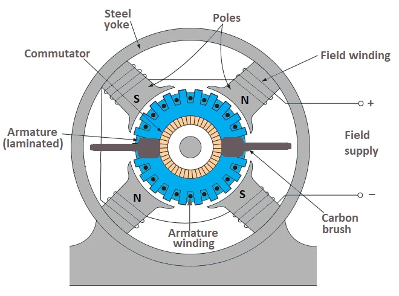
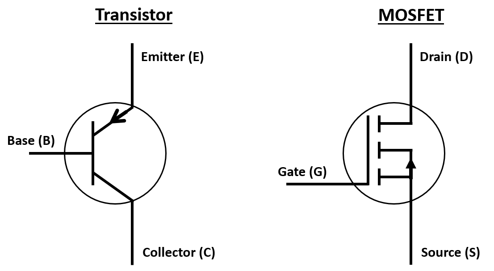
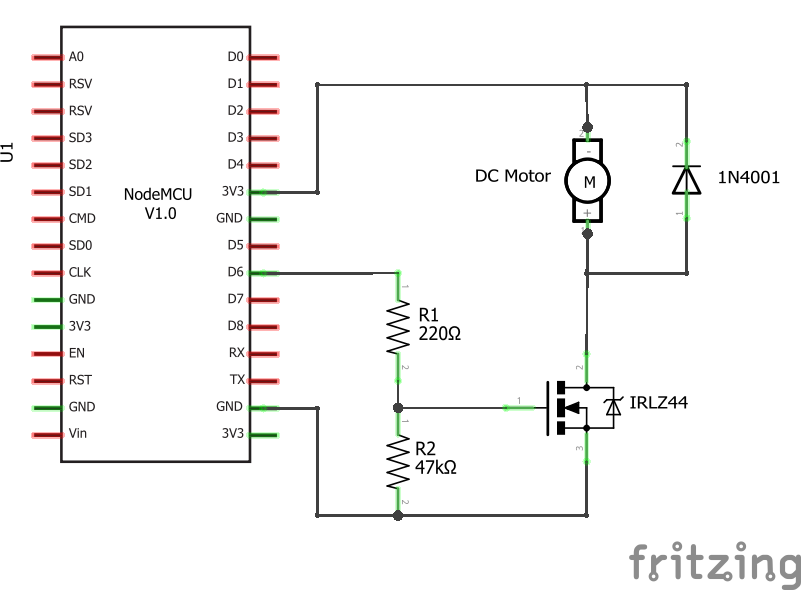
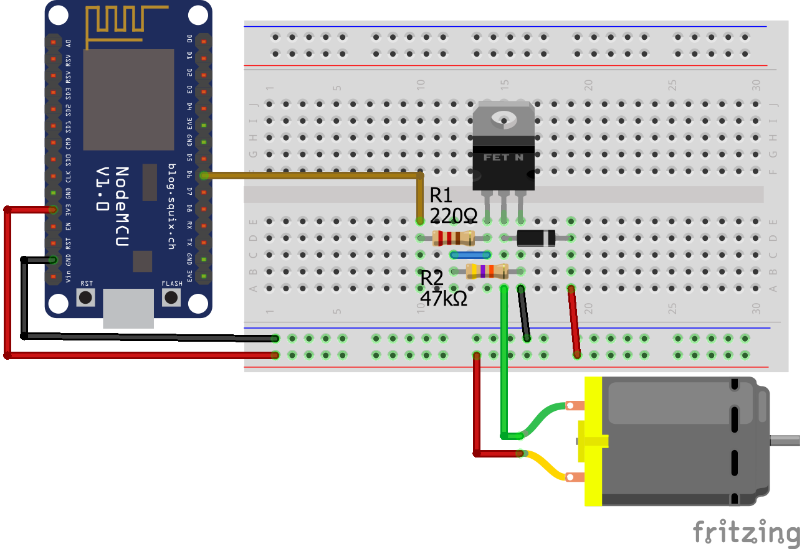

>[Torna a gateway digitale](gateway.md)

## **Gateway per scheda relè digitale**

### **Schema di principio del collegamento a stella**

Notare i **collegamenti punto-punto** tra tutti i dispositivi e il microcontrollore tramite linee esclusive.


### **Il motore in corrente continua (DC)**

Ogni motore DC è costituito da due componenti chiave importanti per la funzionalità:
- Lo **statore** è la parte stazionaria del motore che fornisce un campo magnetico rotante per l'armatura.
- L'**armatura** è la parte del motore a corrente continua che ruota e in cui sono collegati componenti esterni, come una ruota.

I **magneti** nello statore (poli) e una **bobina** di fili (avvolgimento di campo), attraversati da una corrente, generano un **campo elettromagnetico**. Gli avvolgimenti del filo isolato all'esterno dell'armatura (avvolgimento dell'indotto) sono avvolti attorno all'armatura per concentrare il campo magnetico dello statore.



Gli avvolgimenti dell'indotto sono collegati a un **commutatore**, fondamentalmente un **interruttore elettrico rotante**, che applica corrente elettrica agli avvolgimenti. La corrente elettrica eccita ciascuna bobina dell'indotto e crea un campo magnetico rotante costante. L'interruttore, a contatti striscianti, serve a fornire corrente alla bobina che è in grado di trainare il rotore, togliendo corrente alle bobine che non sono più nella posizione giusta per spigerlo.

Se le bobine dell'indotto vengono accese e spente in sequenza, il campo magnetico rotante interagisce con il campo magnetico dello statore e crea una coppia, che fa ruotare l'armatura. Pertanto, il motore DC **converte** l'**energia elettrica** in **energia meccanica**.

E' da rimarcare che normalmente non è una buona idea **collegare direttamente** la bobina di un relè ad una porta digitale del microcontrollore perchè questa potrebbe non fornire tutta la **corrente necessaria** per **eccitare competamente** il motore perchè questo non sarebbe in grado di erogare tutta la corrente necessaria. 

Utilizzeremo un transistor MOS come interruttore per controllare un piccolo motore a basso consumo. Controlleremo il MOS con ESP32. Potremmo usare qualsiasi altro microcontrollore. 

Bisogna fare attenzione a distinguere tra **carichi resistivi** e **carichi induttivi**. Una lampadina è un tipico carico resistivo, mentre un motore è un tipico carico induttivo. 

I **carichi induttivi** sono costituiti internamente da bobine più o meno grandi. I carichi induttivi soffrono del problema delle **sovratensioni** e delle **sovracorrenti** all'**accensione** e allo **spegnimento**. 

Una **sovracorrente** è una corrente che può essere **parecchie volte superiore** alla **massima corrente nominale** del **carico** (anche 10-15 volte), ha però la caratteristica di essere presente per un periodo **transitorio molto breve**. La sua presenza è un **fattore di stress** per i tramsistor che ne accorcia la vita operativa. Per cui è opportuno progettare il circuito per renderlo in grado di erogare una intensa corrente di spunto parecchie volte maggiore di quella nominale.



### **Come scegliere il MOSFET giusto per controllare il motore DC?**

Per il nostro circuito scegliamo il MOSFET IRLZ44. Ma come facevo a sapere che posso usare questo MOSFET? La decisione si basa sul microcontrollore e sulle specifiche elettriche del motore CC. I seguenti passaggi mostrano il processo, come trovare il transistor giusto per il tuo circuito:
- La tensione di soglia del gate (V_GS) è inferiore alla tensione di funzionamento del microcontrollore. L'IRLZ44 ha una tensione di soglia gate-source compresa tra 1 V e 2 V. Il nostro Arduino con tensione operativa di 5 V e ESP32 ed ESP8266 con una tensione operativa di 3,3 V hanno una tensione superiore alla tensione di soglia gate-source dell'IRLZ44.
- La tensione di rottura drain-source (breakdown voltage) non viene superata. Poiché utilizziamo il microcontrollore come fonte di alimentazione del motore CC, la nostra tensione drain-source non supererà i 5V. La tensione di rottura drain-source dell'IRLZ44 è molto più alta con 55V.
- La corrente di drain continua non viene superata. Il motore CC che usiamo in questo esempio assorbe in media 100 mA e il valore massimo assoluto per la corrente di drain continua dell'IRLZ44 è 35 A. Pertanto, il MOSFET IRLZ44 è una buona scelta per il nostro circuito. 

### **Perché abbiamo bisogno di un diodo in parallelo al motore DC?**

Abbiamo appreso nella prima parte di questo articolo che il motore DC ha bobine all'interno che creano un campo magnetico. Quando un motore DC è spento, la corrente nello statore è 0A e il rotore gira a vuoto a causa del momento d'inerzia. Questa rotazione provoca un'autoinduzione nelle bobine del motore e quindi picchi di tensione. 

Il diodo, chiamato anche **diodo flyback**, che abbiamo collegato in parallelo al motore CC fornisce un percorso sicuro per la corrente induttiva in modo che la tensione drain-source non aumenti e danneggi potenzialmente il circuito.

### **Perché abbiamo bisogno di un resistore tra il gate del transistor e la massa?**

Se il pin I/O digitale del microcontrollore Arduino, ESP8266 o ESP32 è impostato su LOW, ma la tensione di alimentazione del motore CC all'emettitore è ancora attiva, è possibile che il transistor sia passato in modo errato. Questo può accadere anche all'inizio del programma, dove il pin digitale del microcontrollore non è ancora definito come output. Con il resistore R2 impostiamo uno stato predefinito in questo caso portiamo a massa il gate.

La dimensione di questo resistore R2 tra gate e terra crea un partitore di tensione con il resistore R1. L'uscita del partitore di tensione è la tensione di gate del MOSFET. L'obiettivo è che la tensione di gate non sia troppo ridotta dal resistore R2. In caso contrario, potrebbe accadere che la tensione di soglia non venga superata per commutare il MOSFET.

### **Perché abbiamo bisogno di un resistore in serie al gate del transistor?**

Il resistore R1 è lì per limitare la corrente per il microcontrollore perché il gate del MOSFET è un piccolo condensatore che inizia a caricarsi se viene applicata una tensione al gate. L'assorbimento di corrente iniziale potrebbe essere troppo alto per il pin I/O digitale del microcontrollore, come mostrato nella figura seguente.

Quando la corrente supera la corrente massima del microcontrollore, che abbiamo visto nella tabella del capitolo precedente, il microcontrollore potrebbe danneggiarsi. Pertanto, utilizziamo il resistore R1 per proteggere il pin digitale e appiattire la curva di carica del gate MOSFET. Se volessimo un'alta frequenza di commutazione superiore a 100 kHz, possiamo usare un resistore R1 di 220.

### **Schema cablaggio**

**Avvertenza:** prima di realizzare questo schema elettrico, assicurarsi di non aver collegato ESP32 e lampada con alimentazione ad alta tensione. Stai utilizzando l'ALTA tensione in questo progetto, prendi tutte le precauzioni prima di creare questo layout. 

**Prima di toccare** il circuito per **inserire o disinserire collegamenti** assicurarsi con **certezza assoluta** di aver **scollegato la tensione di rete a 230V**. **Ripetere** questo controllo **con scrupolo** ogni volta che si **maneggia il circuito**.





### **Librerie del progetto**

Dal **punto di vista SW** non servono librerie particolari tranne quelle per la pubblicazione dei valori tramite MQTT. 

### **Gateway MQTT per il comando di una scheda relè individuato via JSON**

La libreria MQTT è asincrona per cui non bloccante. E' adoperabile sia per **ESP8266** che per **ESP32**.

Il codice seguente, alla ricezione dei messaggi JSON, inviati via MQTT sul topic **"torele"**,  **{"rele1":"0"}** oppure **{"rele1":"1"}** scrive il bit basso o alto sulla **porta di controllo** del relè ivi collegato. **Subito dopo** la scrittura del comando viene effettuata una **lettura dello stato** della stessa porta (la cmdport) e viene inviato il suo valore al server MQTT lungo un **canale di feedback** al topic **"fromrele"**. I **comandi** vengono inviati dal server MQTT sul topic **"torele"**.

**Periodicamente**, grazie ad una **schedulazione** all'interno del loop(), il microcontrollore **invia spontaneamente** lo **stato della porta** del relè con una cadenza memorizzata su interval e impostata a **60 secondi**.

```C++
//#include <WiFiClientSecure.h>
#include <WiFi.h>       // per ESP32
//#include <ESP8266WiFi.h> per ESP8266
#include <AsyncMqttClient.h>
#include <Ticker.h>

#define WIFI_SSID "myssid"
#define WIFI_PASSWORD "mypsw"
#define WIFIRECONNECTIME  2000
#define MQTTRECONNECTIME  2000

Ticker mqttReconnectTimer;
Ticker wifiReconnectTimer;
// Raspberry Pi Mosquitto MQTT Broker
//#define MQTT_HOST IPAddress(192, 168, 1, 254)
#define MQTT_HOST "test.mosquitto.org"
// For a cloud MQTT broker, type the domain name
//#define MQTT_HOST "example.com"
#define MQTT_PORT 1883
// Temperature MQTT Topic
#define MQTT_PUB "fromrele"
#define MQTT_SUB "torele"

//{"rele1":"0"}, {"rele1":"1"}

AsyncMqttClient mqttClient;

unsigned long previousMillis = 0;   // Stores last time temperature was published
const long interval = 60*1000;        // Interval at which to publish sensor readings
byte count = 0;
int8_t ax;
int8_t cmdport = 22;

void connectToWifi() {
  Serial.println("Connecting to Wi-Fi...");
  WiFi.mode(WIFI_STA);
  //WiFi.disconnect();
  WiFi.begin(WIFI_SSID, WIFI_PASSWORD);
}

void connectToMqtt() {
  Serial.println("Connecting to MQTT...");
  mqttClient.connect();
}

void readDataAndPub(){ 
    //crea la stringa JSON
    ax = digitalRead(cmdport);
	String str = "{\"rele1\":\"";
	str += ax;
	str += "\"}";
	
    // Publish an MQTT message on topic esp32/ds18b20/temperature    
    uint16_t packetIdPub1 = mqttClient.publish(MQTT_PUB, 1, true, str.c_str(), str.length());                           
    Serial.print("Pubblicato sul topic %s at QoS 1, packetId: ");
    Serial.println(MQTT_PUB);
    Serial.println(packetIdPub1);
    Serial.print("Messaggio inviato: ");
    Serial.println(str); 
}

void onMqttMessage(char* topic, char* payload, AsyncMqttClientMessageProperties properties, size_t len, size_t index, size_t total) {
  Serial.println("Publish received.");
  Serial.print("  topic: ");
  Serial.println(topic);
  Serial.print("  qos: ");
  Serial.println(properties.qos);
  Serial.print("  dup: ");
  Serial.println(properties.dup);
  Serial.print("  retain: ");
  Serial.println(properties.retain);
  Serial.print("  len: ");
  Serial.println(len);
  Serial.print("  index: ");
  Serial.println(index);
  Serial.print("  total: ");
  Serial.println(total);
  Serial.print("  payload: ");
  Serial.println(payload);
  
  //parsing della stringa JSON
  String instr = String(payload);
  if(instr.indexOf("\"rele1\":\"1\"") >= 0){
	  digitalWrite(cmdport, HIGH);
  }
  if(instr.indexOf("\"rele1\":\"0\"") >= 0){
	  digitalWrite(cmdport, LOW);
  }
  
  Serial.print("Requesting data...");
  readDataAndPub();
  Serial.println("DONE");
}

void WiFiEvent(WiFiEvent_t event) {
  Serial.printf("[WiFi-event] event: %d\n", event);
  switch(event) {
    case SYSTEM_EVENT_STA_GOT_IP:
      Serial.println("WiFi connected");
      Serial.println("IP address: ");
      Serial.println(WiFi.localIP());
      connectToMqtt();
      break;
    case SYSTEM_EVENT_STA_DISCONNECTED:
      Serial.println("WiFi lost connection");
      mqttReconnectTimer.detach(); // ensure we don't reconnect to MQTT while reconnecting to Wi-Fi
      wifiReconnectTimer.once_ms(WIFIRECONNECTIME, connectToWifi);
      break;
  }
}

void onMqttConnect(bool sessionPresent) {
  Serial.println("Connected to MQTT.");
  Serial.print("Session present: ");
  Serial.println(sessionPresent);
  uint16_t packetIdSub = mqttClient.subscribe(MQTT_SUB, 2);
  Serial.print("Subscribing at QoS 2, packetId: ");
  Serial.println(packetIdSub);
}

void onMqttDisconnect(AsyncMqttClientDisconnectReason reason) {
  Serial.println("Disconnected from MQTT.");
  if (WiFi.isConnected()) {
    mqttReconnectTimer.once_ms(MQTTRECONNECTIME, connectToMqtt);
  }
}

void onMqttPublish(uint16_t packetId) {
  Serial.println("Publish acknowledged.");
  Serial.print("  packetId: ");
  Serial.println(packetId);
}

void setup() {
  Serial.begin(115200);
  Serial.println();
  Serial.println();
  delay(2000);
  pinMode(cmdport, OUTPUT);

  WiFi.onEvent(WiFiEvent);

  mqttClient.onConnect(onMqttConnect);
  mqttClient.onDisconnect(onMqttDisconnect);
  mqttClient.onPublish(onMqttPublish);
  mqttClient.onMessage(onMqttMessage);
  mqttClient.setServer(MQTT_HOST, MQTT_PORT);
  // If your broker requires authentication (username and password), set them below
  //mqttClient.setCredentials("REPlACE_WITH_YOUR_USER", "REPLACE_WITH_YOUR_PASSWORD");
  connectToWifi();
  count = 0;
  while (WiFi.status() != WL_CONNECTED && count < 10) {
    delay(500);
    count++;
    Serial.print(".");
  }
}

void loop() {
  unsigned long currentMillis = millis();
  // Every X number of seconds it publishes a new MQTT message
  if (currentMillis - previousMillis >= interval) {
        previousMillis = currentMillis;
    
        Serial.print("Requesting data...");
	readDataAndPub();
	Serial.println("DONE");
  }
}


```
### **Gateway MQTT per il comando di una scheda relè individuato via topic MQTT**

E' anche possibile utilizzare direttamente la **struttura gerarchica dei topic** per creare un **path** che individui univocamente il **nome** di un **comando** o di uno **stato**. Ad esempio: **soggiorno/lampadario1/led4/cmd** per il comando e **soggiorno/lampadario1/led4/state** per lo stato.

Variante del codice precdente in cui, alla ricezione dei messaggi JSON, inviati via MQTT sul topic **"torele1/cmd"** **"0"** oppure **"1"** scrive il bit basso o alto sulla **porta di controllo** del relè ivi collegato. **Subito dopo** la scrittura del comando viene effettuata una **lettura dello stato** della stessa porta (la cmdport) e viene inviato il suo valore al server MQTT lungo un **canale di feedback** al topic **"fromrele1/state"**. I **comandi** vengono inviati dal server MQTT sul topic **"torele1/cmd"**. 

**Periodicamente**, grazie ad una **schedulazione** all'interno del loop(), il microcontrollore **invia spontaneamente** lo **stato della porta** del relè con una cadenza memorizzata su interval e impostata a **60 secondi**.

```C++
//#include <WiFiClientSecure.h>
#include <WiFi.h>       // per ESP32
//#include <ESP8266WiFi.h> per ESP8266
#include <AsyncMqttClient.h>
#include <Ticker.h>

#define WIFI_SSID "myssid"
#define WIFI_PASSWORD "mypsw"
#define WIFIRECONNECTIME  2000
#define MQTTRECONNECTIME  2000

Ticker mqttReconnectTimer;
Ticker wifiReconnectTimer;
// Raspberry Pi Mosquitto MQTT Broker
//#define MQTT_HOST IPAddress(192, 168, 1, 254)
#define MQTT_HOST "test.mosquitto.org"
// For a cloud MQTT broker, type the domain name
//#define MQTT_HOST "example.com"
#define MQTT_PORT 1883
// Temperature MQTT Topic
#define MQTT_PUB "fromrele1/state"
#define MQTT_SUB "torele1/cmd"

AsyncMqttClient mqttClient;

unsigned long previousMillis = 0;   // Stores last time temperature was published
const long interval = 60*1000;        // Interval at which to publish sensor readings
byte count = 0;
int8_t ax;
int8_t cmdport = 22;

void connectToWifi() {
  Serial.println("Connecting to Wi-Fi...");
  WiFi.mode(WIFI_STA);
  //WiFi.disconnect();
  WiFi.begin(WIFI_SSID, WIFI_PASSWORD);
}

void connectToMqtt() {
  Serial.println("Connecting to MQTT...");
  mqttClient.connect();
}

void readDataAndPub(){ 
        //crea la stringa JSON
        ax = digitalRead(cmdport);
	char str[2];
	
	itoa(ax,str,10);
        // Publish an MQTT message on topic esp32/ds18b20/temperature    
	uint16_t packetIdPub1 = mqttClient.publish(MQTT_PUB, 1, true, str, 1);                           
        Serial.print("Pubblicato sul topic %s at QoS 1, packetId: ");
	Serial.println(MQTT_PUB);
        Serial.println(packetIdPub1);
	Serial.print("Messaggio inviato: ");
	Serial.println(str); 
}

void onMqttMessage(char* topic, char* payload, AsyncMqttClientMessageProperties properties, size_t len, size_t index, size_t total) {
  Serial.println("Publish received.");
  Serial.print("  topic: ");
  Serial.println(topic);
  Serial.print("  qos: ");
  Serial.println(properties.qos);
  Serial.print("  dup: ");
  Serial.println(properties.dup);
  Serial.print("  retain: ");
  Serial.println(properties.retain);
  Serial.print("  len: ");
  Serial.println(len);
  Serial.print("  index: ");
  Serial.println(index);
  Serial.print("  total: ");
  Serial.println(total);
  Serial.print("  payload: ");
  Serial.println(payload);
  
  digitalWrite(cmdport, atoi(payload));
  
  Serial.print("Requesting data...");
  readDataAndPub();
  Serial.println("DONE");
}

void WiFiEvent(WiFiEvent_t event) {
  Serial.printf("[WiFi-event] event: %d\n", event);
  switch(event) {
    case SYSTEM_EVENT_STA_GOT_IP:
      Serial.println("WiFi connected");
      Serial.println("IP address: ");
      Serial.println(WiFi.localIP());
      connectToMqtt();
      break;
    case SYSTEM_EVENT_STA_DISCONNECTED:
      Serial.println("WiFi lost connection");
      mqttReconnectTimer.detach(); // ensure we don't reconnect to MQTT while reconnecting to Wi-Fi
      wifiReconnectTimer.once_ms(WIFIRECONNECTIME, connectToWifi);
      break;
  }
}

void onMqttConnect(bool sessionPresent) {
  Serial.println("Connected to MQTT.");
  Serial.print("Session present: ");
  Serial.println(sessionPresent);
  uint16_t packetIdSub = mqttClient.subscribe(MQTT_SUB, 2);
  Serial.print("Subscribing at QoS 2, packetId: ");
  Serial.println(packetIdSub);
}

void onMqttDisconnect(AsyncMqttClientDisconnectReason reason) {
  Serial.println("Disconnected from MQTT.");
  if (WiFi.isConnected()) {
    mqttReconnectTimer.once_ms(MQTTRECONNECTIME, connectToMqtt);
  }
}

void onMqttPublish(uint16_t packetId) {
  Serial.println("Publish acknowledged.");
  Serial.print("  packetId: ");
  Serial.println(packetId);
}

void setup() {
  Serial.begin(115200);
  Serial.println();
  Serial.println();
  delay(2000);
  pinMode(cmdport, OUTPUT);

  WiFi.onEvent(WiFiEvent);

  mqttClient.onConnect(onMqttConnect);
  mqttClient.onDisconnect(onMqttDisconnect);
  mqttClient.onPublish(onMqttPublish);
  mqttClient.onMessage(onMqttMessage);
  mqttClient.setServer(MQTT_HOST, MQTT_PORT);
  // If your broker requires authentication (username and password), set them below
  //mqttClient.setCredentials("REPlACE_WITH_YOUR_USER", "REPLACE_WITH_YOUR_PASSWORD");
  connectToWifi();
  count = 0;
  while (WiFi.status() != WL_CONNECTED && count < 10) {
    delay(500);
    count++;
    Serial.print(".");
  }
}

void loop() {
  unsigned long currentMillis = millis();
  // Every X number of seconds it publishes a new MQTT message
  if (currentMillis - previousMillis >= interval) {
        previousMillis = currentMillis;
    
        Serial.print("Requesting data...");
	readDataAndPub();
	Serial.println("DONE");
  }
}
```

**Sitografia:**

- https://microcontrollerslab.com/esp32-web-server-control-relay-220-volt-lamp/
- https://www.monicoimpianti.net/rele-passo-passo/

>[Torna a gateway digitale](gateway.md)
