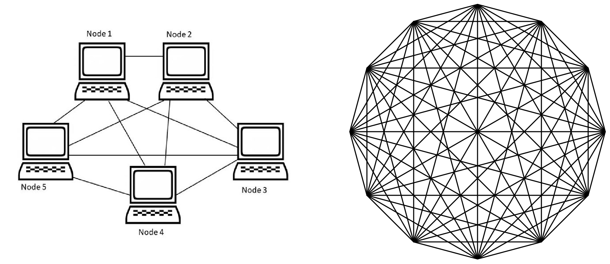
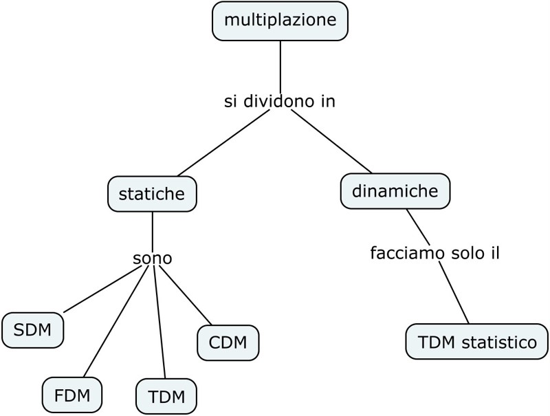
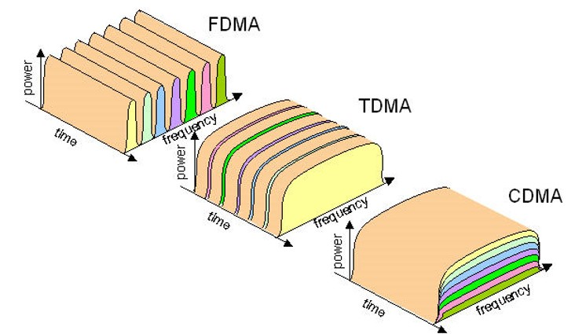
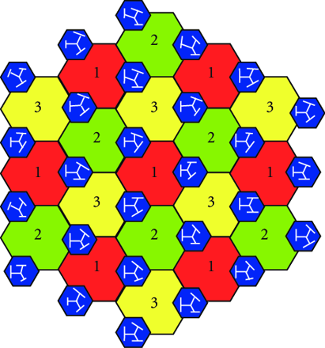
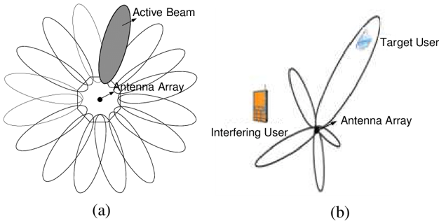

>[Torna a reti di sensori](sensornetworkshort.md#servizi-di-accesso-radio-per-WSN)

## **Le multiplazioni statiche**

Un rete di computer potrebbe, in **linea di principio**, essere realizzata con un collegamento **fisico**, **diretto** e **dedicato** tra un PC e **tutti** gli altri. Un collegamento fidsico **dedicato** è un link fisico utilizzato solamente da due interlocutori e basta, che quindi possono usufruirne sempre e in qualunque momento senza aspettare.



Dalla figura, si vede chiaramente che, all'aumentare del numero dei dispositivi in numero dei collegamenti aumenta con un incremento, in proprorzione, sempre maggiore.

La **formula** esatta sarebbe:
```C++
N*(N-1)/2
```
dato che:
- un PC dovrebbe realizzare ```N-1``` collegamenti per tutti gli altri (escudendo se stesso)
- la stessa cosa dovrebbero fare complessivamente N PC

L'**incremento** è praticamente **quadratico** porta rapidamente all'esplosione del numero dei collegamenti. Per **un miliardo** di dispositivi sparsi per tutto il globo, il **quadrato** di connessioni dedicate darebbe un numero così grande di connessioni fisiche che avrebbe il semplice difetto di essere **economicamente insostenibile** per chi le realizzasse con costi accessibili per gli utenti. 

La soluzione è **rinunciare** ai collegamenti fisici dedicati tra coppie di utenti e introdurre un certo grado di **condivisione** nell'utilizzo dei mezzi fisici di trasmissione (canali). La **condivisione** delle risorse è l'unico metodo per aumentare l'**efficienza** del loro utilizzo. 

L'aumento progressivo dell'**efficienza** nell'utilizzo dei canali ha portato, nel corso dei decenni, alla progressiva diffusione delle **trasmissioni globali**, rare e costose negli anni 80' del secolo scorso, pervasive e a prezzi popolari nel mondo attuale. Anzi l'**accesso alla rete**, intesa come rete globale Internet, è considerato un **diritto primario** del cittadino  dato che su du essa si sono spostati, in maniera esclusiva, molti **servizi pubblici**.

Le **multiplazioni** sono delle **tecniche** per aumentare l'**efficienza** di un canale introducendo un certo grado di **condivisione** dello stesso tra più **sorgenti**. 

La **condivisione** effettiva del canale è solo **parziale**. L'**allocazione** delle sorgenti sul canale in realtà è sempre **ripartita** in base **ad una** delle grandezze fisiche che lo contraddistinguono, mentre, per le rimanenti grandezze, la condivisioe è **totale**, cioè le sorgenti, su quelle grandezze, occupano **tutto** il canale nella sua interezza.

### **Modalità di allocazione di una risorsa**

L’**assegnazione (allocazione)** della risorsa canale fisico ad una comunicazione avviene in genere con una modalità detta **on demand (cioè su richiesta)**.

L’**assegnazione di una risorsa** ad un trasmettitore per una comunicazione è **classificabile** in base al **momento** in cui avviene la sua  **richiesta**:
- **all’apertura del contratto** con l’utente. La risorsa viene allocata ad una sorgente al momento del suo collegamento alla rete e non termina mai (allocazione assoluta). Avviene in genere nelle sottoreti di accesso alla rete (ultimo miglio del doppino telefonico, collegamento allo switch nelle LAN).
- **all’apertura della comunicazione (allocazione statica)**: analogamente a una conversazione telefonica, la risorsa viene allocata ad una sorgente all’inizio della comunicazione (apertura) e viene deallocata alla fine (chiusura) . Garantisce, grazie all’allocazione preventiva, una continuità della qualità del servizio per tutta la durata della comunicazione. 
- **Al momento della trasmissione** del messaggio (**allocazione dinamica**). La risorsa viene assegnata ad una sorgente all’inizio della trasmissione di un suo messaggio. Finita la trasmissione del messaggio il canale viene deallocato e occupato da un altro messaggio non necessariamente della stessa sorgente. Garantisce, tramite la multiplazione statistica, una grande efficienza di utilizzo delle risorse soprattutto quando comunicano sorgenti intermittenti.

### **Efficienza e condivisione**

Una **gestione efficiente** delle risorse (**canali**) si realizza attraverso la loro **condivisione** tra molti utenti, ottenibile con una **tecnica di multiplazione** che può essere:
- **Multiplazione fissa o statica**: assegna una parte della risorsa (una porzione canale) alla sorgente per **tutta la durata della comunicazione**, anche quando questa **non trasmette**.
- **Multiplazione dinamica o statistica**: assegna tutta la risorsa (tutta la capacità trasmissiva) per **tutta la durata della trasmissione**, cioè solo quando la sorgente **occupa il canale**.



### **Multiplazione statica**

La capacità trasmissiva viene frazionata in tante parti quante sono le sorgenti che la devono utilizzare (ripartizione del canale in parti uguali).
Le proprietà fisiche del mezzo trasmissivo che possono essere suddivise sono: spazio, frequenza, tempo e codice.

Nell’**SDM** il canale viene utilizzato nelle stesse frequenze e nello stesso tempo ma in **spazi separati**, (ad esempio più fili all’interno dello stesso cavo o più celle radio con la stessa frequenza vengono usate nel medesimo istante in locazioni sufficientemente distanti da non interferirsi).

Nel **FDM** il canale viene usato nello stesso tempo e nello stesso spazio ma su **frequenze diverse**, quindi anche in questo caso senza interferenza (ad esempio telefonia ADSL, broadcast radio e TV).

Nel **TDM** tutta la banda di frequenza disponibile (la stessa per tutte le comunicazioni) viene usata in tutto lo spazio disponibile (lo stesso per tutte le comunicazioni) ma in **istanti diversi** quindi anche in questo caso senza interferenza (ad esempio telefonia fissa, telefonia GSM, TV digitale terrestre). [Dettaglio TDM statico](tdmstatico.md) 

Nel **CDM** i segnali occupano e condividono la stessa frequenza lo stesso spazio e lo stesso tempo, ma, nonostante di fatto **si interferiscano**, possono ancora essere **distinti in base alla potenza** grazie ad un **codice ortogonale univoco** che permette di **filtrare** una certa comunicazione.



E’ possibile **allocare** una comunicazione su **una porzione** della **grandezza fisica** (spazio, tempo, frequenza, potenza) a cui essa **è associata**. La **grandezza fisica** è una **proprietà** del **segnale** che **codifica** sul canale i **bit** della comunicazione mediante processi di **modulazione digitale**. 


I **segnali** possono essere **frazionati** variando alternativamente le grandezze **tempo**, **frequenza**, **spazio** e **potenza**.
Le **zone colorate** in figura rappresentano la **grandezza fisica** che, di volta in volta, viene **ripartita** tra le **varie sorgenti**.

### **SDM nella telefonia cellulare**




**Colori uguali** rappresentano **frequenze uguali**
Per evitare interferenze, le celle che usano la stessa frequenza si separano nello spazio inframezzando celle servite da frequenze diverse:
- **Celle vicine** usano frequenze molto **diverse**
- **Celle lontane** riusano le **stesse** frequenze

### **SDM nelle Smart Antenna**



**Un lobo** è la zona tridimensionale dello spazio dove l’antenna **concentra** la maggior parte della **potenza emessa** nonché quella da dove **riceve meglio** (principio di reciprocità)

I f**asci comandati elettronicamente** realizzano: un **beam switching** tra direzioni predefinite (a) oppure un **beam forming** che insegue con continuità il target (b)

L’antenna **dirige il fascio** in modo da concentrarlo sul **target** per:
- **Massimizzare** la **potenza trasmessa** sul e la **sensibilità di ricezione** dal  target.
- **Evitare** di ricevere **interferenze RFI** da altri dispositivi diversi dal target.
- Si realizza un **SDM** se si inviano **simultaneamente** comunicazioni diverse **su fasci separati**.

[Dettaglio TDM statico su mezzi punto-punto](tdmstatico.md) 

>[Torna a reti di sensori](sensornetworkshort.md#servizi-di-accesso-radio-per-WSN)
