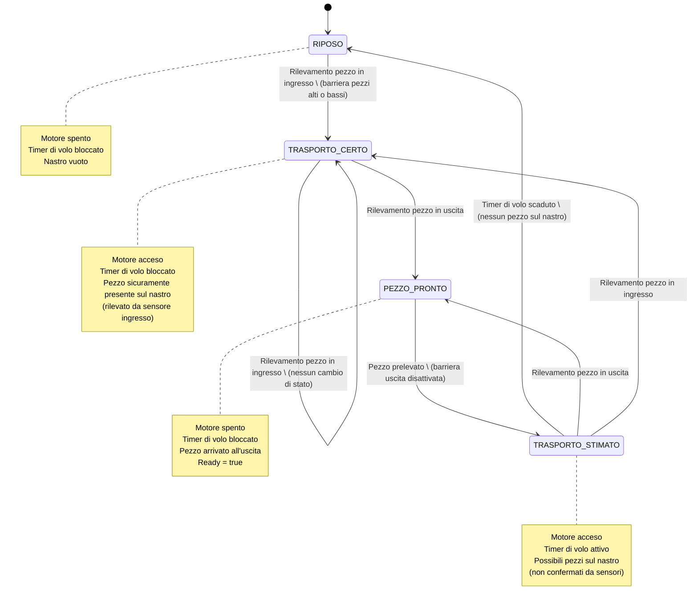

>[Torna all'indice](indexpulsanti.md) >[versione in Python](nastro_py.md)

#  **NASTRO TRASPORTATORE**

##  **Gestione di un nastro**

Programma per la gestione di un nastro trasportatore realizzato con un **timer** basato sul polling della funzione ```millis()``` e su **rilevatori di transito** basati su ```delay()```.

Per dettagli sulle macchine a stati finiti o FSM vedi [FSM](indexstatifiniti.md)

###  **Esigenza**

Scrivere un programma che realizzi la gestione di un nastro traportatore attraverso la lettura di tre sensori di transito (barriere ad infrarossi) e il comando di un motore. 

I sensori permangono al livello alto finchè un oggetto ingombra l'area del sensore, dopodichè vanno a livello basso. I sensori sono due all'inizio del nastro (uno per i pezzi bassi ed un'altro per quelli alti) ed uno alla fine del nastro che rileva il pezzo pronto per essere prelevato. 

Esiste un timer di volo, così chiamato perchè dura esattamente per il tempo che impiegherebbe il pezzo più lontano dall'uscita, cioè quello sulla barriera di ingresso, per arrivare sulla barriera di uscita. 

All'attivazione di un qualsiasi sensore di ingresso parte il motore e si resetta e pure si blocca il timer di volo. All'attivazione del sensore di uscita si blocca il nastro, alla sua disattivazione riparte il nastro e parte il timer di volo. Allo scadere del timer di volo si spegne il motore.

## **Stati**

- **RIPOSO**: Il nastro è vuoto e fermo, in attesa di nuovi pezzi.
- **TRASPORTO_CERTO**: C'è almeno un pezzo sul nastro, confermato dal rilevamento di un sensore all'ingresso. Il timer è disattivato perché abbiamo certezza della presenza del pezzo.
- **PEZZO_PRONTO**: Un pezzo è arrivato all'uscita ed è pronto per essere prelevato. Il nome riflette perfettamente lo stato del sistema piuttosto che l'azione esterna.
- **TRASPORTO_STIMATO**: Potrebbero esserci altri pezzi sul nastro, ma non ne abbiamo conferma diretta dai sensori. Il timer è attivo per stimare quando il nastro sarà vuoto.


## Tabella di Transizione del Nastro Trasportatore

| Stato attuale | Input | Stato prossimo | Output |
|---------------|-------|----------------|--------|
| RIPOSO | Sensore pezzi alti = LOW oppure Sensore pezzi bassi = LOW | TRASPORTO_CERTO | Accensione motore, Reset e blocco timer di volo, Ready = false |
| TRASPORTO_CERTO | Sensore uscita = LOW | PEZZO_PRONTO | Spegnimento motore, Blocco timer di volo, Ready = true |
| TRASPORTO_CERTO | Sensore pezzi alti = LOW oppure Sensore pezzi bassi = LOW | TRASPORTO_CERTO | Nessun cambio (il motore resta acceso) |
| PEZZO_PRONTO | Sensore uscita = HIGH | TRASPORTO_STIMATO | Accensione motore, Reset e avvio timer di volo, Ready = false |
| TRASPORTO_STIMATO | Sensore uscita = LOW | PEZZO_PRONTO | Spegnimento motore, Blocco timer di volo, Ready = true |
| TRASPORTO_STIMATO | Timer di volo scaduto | RIPOSO | Spegnimento motore, Ready = false |
| TRASPORTO_STIMATO | Sensore pezzi alti = LOW oppure Sensore pezzi bassi = LOW | TRASPORTO_CERTO | Reset e blocco timer di volo (motore rimane acceso) |

##  **Diagramma degli stati**



##  **Soluzione in logica "prima gli ingressi"**

L'algoritmo proposto per la gestione di un nastro trasportatore fa uso: 
- della **primitiva** ```waitUntilInputLow()``` per la realizzazione della logica di barriera (pulsante toggle)
- delle **funzioni** ```stop()```, ```reset()``` e ```get()``` per la gestione di un timer
- della **variabile globale** ```ready``` per segnalare agli altri thread (o al loop principale) la presenza di un **pezzo pronto** per essere prelevato.

L'algoritmo gestisce **tre sensori** di barriera (rilevatori di transito):
- uno in barriera di ingresso per i **pezzi alti** appena inseriti sul nastro
- uno in barriera di ingresso per i **pezzi bassi** appena inseriti sul nastro
- uno in barriera di uscita per i **pezzi pronti** per essere prelevati

L'algoritmo si divide in due **fasi** in cui vengono svolti due compiti (**task**) differenti:
- la **lettura degli ingressi**, ovvero il controllo dello stato dei **sensori di transito**, sia quello dei **pezzi in ingresso** che quello dei **pezzi in uscita**.
- il polling dello **stato del timer** per stabilire se non ci sono più pezzi sul nastro e quindi **spegnere il motore**.

L'algoritmo è implementato usando una **logica FSM** di tipo **"prima gli ingressi e dopo gli stati"**.

```C++
bool ready = false;

void setup() {
  ready = false;
}

void loop() {
	// lettura degli ingressi
	// RIPOSO
	// TRASPORTO_CERTO
	// TRASPORTO_STIMATO
	if(digitalRead(startSensorHigh)==HIGH){		// se è alto c'è stato un fronte di salita
		// TRASPORTO_CERTO
		engineon = true; 	
		volo.stop();				// c'è almeno un pezzo in transito			
		waitUntilInputLow(startSensorHigh,50);	// attendi finchè non c'è fronte di discesa
	}else if(digitalRead(startSensorLow)==HIGH){	// se è alto c'è stato un fronte di salita
		// TRASPORTO_CERTO
		engineon = true; 	
		volo.stop();				// c'è almeno un pezzo in transito				
		waitUntilInputLow(startSensorLow,50);	// attendi finchè non c'è fronte di discesa
	}else if(digitalRead(stopSensor)==HIGH) {
		// PEZZO_PRONTO
		engineon = false; 
		ready = true;
		waitUntilInputLow(stopSensor,50);
		// TRASPORTO_STIMATO
		ready = false;
		engineon = true; 
		volo.start(); 		// se c'è un pezzo in transito arriverà prima dello scadere
		volo.reset();
	}
	// polling del timer di volo
	// TRASPORTO_STIMATO
        // timer in corsa solo a partire da TRASPORTO_STIMATO
	if(volo.get() > 10000){
		// RIPOSO
        	volo.stop();
        	volo.reset();
		engineon = false; 
	}
}
```

Si noti che:
- gli ingressi sui due sensori di start possono determinare transizioni verso il solo stato ```TRASPORTO_CERTO```, per cui lo switch-case interno è inutile.
- l'ingresso sul sensore di stop determina due stati ma in momenti diversi, uno prima (```PEZZO_PRONTO```) del blocco del codice con ```waitUntilInputLow``` e uno dopo (```TRASPORTO_STIMATO```), ne consegue che anche in questo caso lo switch-case interno è superfluo.
- il timer è un ingresso che apparentemente è in ascolto su tre stati (```RIPOSO```, ```TRASPORTO_CERTO```, ```TRASPORTO_STIMATO```) ma che, in realtà, è effettivamente attivo solo nello stato ```TRASPORTO_STIMATO```, coerentemente con la tabella delle transizioni e il diagramma degli stati.
- il timer è un ingresso che può determinare transizioni verso il solo stato ```RIPOSO``` per cui, anche in questo caso, lo switch-case interno è inutile.

Un **esempio completo** per la gestione di un singolo nastro, corredato di elementi di segnalazione (led) e messaggistica di debug è riportato di seguito:


```C++
/*Alla pressione del pulsante si attiva o disattiva il lampeggo di un led*/
#include "urutils.h"
byte startSensorHigh = 4;
byte startSensorLow = 3;
byte stopSensor = 2;
byte engineLed = 10;
byte lowStartLed = 9;
byte highStartLed = 8;
byte stopLed = 11;
unsigned flyTime = 4000; //tempo di volo di un pezzo sul nastro
bool engineon;  // variabile globale che memorizza lo stato del motore
 
void setup() {
  Serial.begin(115200);
  pinMode(engineLed, OUTPUT);
  pinMode(lowStartLed, OUTPUT);
  pinMode(highStartLed, OUTPUT);
  pinMode(stopLed, OUTPUT);
  pinMode(startSensorHigh, INPUT);
  pinMode(startSensorLow, INPUT);
  pinMode(stopSensor, INPUT); 
  engineon= false;
  volo.stop();
}

// loop principale
void loop() {
	// RIPOSO
	// TRASPORTO_CERTO
	// TRASPORTO_STIMATO
	if(digitalRead(startSensorLow)==HIGH){				// se è alto c'è stato un fronte di salita
		engineon = true; 	
		digitalWrite(engineLed, HIGH);
		digitalWrite(lowStartLed, HIGH);
		volo.stop();						// c'è almeno un pezzo in transito				
		Serial.println("Pezzo basso in ingresso");
		Serial.println("Timer di volo disattivato");
		waitUntilInputLow(startSensorLow,50);			// attendi finchè non c'è fronte di discesa
		Serial.println("Pezzo basso transitato in ingresso");
		digitalWrite(lowStartLed, LOW);
		// TRASPORTO_CERTO
	}else if(digitalRead(startSensorHigh)==HIGH){			// se è alto c'è stato un fronte di salita
		engineon = true; 	
		digitalWrite(engineLed, HIGH);
		digitalWrite(highStartLed, HIGH);
		volo.stop();						// c'è almeno un pezzo in transito
		Serial.println("Pezzo alto in ingresso");
		Serial.println("Timer di volo disattivato");
		waitUntilInputLow(startSensorHigh,50);			// attendi finchè non c'è fronte di discesa
		Serial.println("Pezzo alto transitato in ingresso");
		digitalWrite(highStartLed, LOW);
		// TRASPORTO_CERTO
	}else if(digitalRead(stopSensor)==HIGH) {
		// PEZZO_PRONTO
		engineon = false;
		digitalWrite(engineLed, LOW);
		digitalWrite(stopLed, HIGH);
		Serial.println("Pezzo in uscita");
		waitUntilInputLow(stopSensor,50);
		// TRASPORTO STIMATO
		Serial.println("Pezzo prelevato dall'uscita");
		engineon = true; 
		digitalWrite(stopLed, LOW);
		digitalWrite(engineLed, HIGH);
		volo.start(); 					// se c'è un pezzo in transito arriverà prima dello scadere
		volo.reset();
                Serial.println("Timer di volo attivato");
	} else if(volo.get() > flyTime){// timer in corsa solo a partire da TRASPORTO_STIMATO
		// RIPOSO
        	volo.stop();
        	volo.reset();
		engineon = false; 
		digitalWrite(engineLed, LOW);
		Serial.println("Timer di volo scaduto");	
	}
}
```
Simulazione su Arduino con Tinkercad: https://www.tinkercad.com/things/bKP671nY2MU-copy-of-nastrouno/editel?tenant=circuits

##  **Soluzione in logica "prima gli stati"**

L'algoritmo è implementato usando una **logica FSM** di tipo **"prima gli stati e dopo gli ingressi"**.

```C++
//##### urutils.h #####
void waitUntilInputLow(int btn, unsigned t)
{
   do{
     delay(t);
   }while(digitalRead(btn)!=LOW);
}

struct DiffTimer
{
  unsigned long elapsed, last;
  bool timerstate=false;
  byte state = 0;
  byte count = 0;
  void reset(){
    elapsed = 0;
    last = millis();
  }
  void toggle(){
    if(timerstate){
      stop();
    }else{
      start();
    }  
  }
  void stop(){
    if(timerstate){
      timerstate = false;
      elapsed += millis() - last;
    }  
  }
  void start(){
    if(!timerstate){
      timerstate = true;
      last = millis();
    }
  }
  unsigned long get(){
    if(timerstate){
      return millis() - last + elapsed;
    }
    return elapsed;
  }
  void set(unsigned long e){
    reset();
    elapsed = e;
  }
};
//##### urutils.h #####

// Definizione pin per sensori e attuatori
const int SENSORE_PEZZI_ALTI = 2;   // Sensore di ingresso per pezzi alti
const int SENSORE_PEZZI_BASSI = 3;  // Sensore di ingresso per pezzi bassi
const int SENSORE_USCITA = 4;       // Sensore di uscita
const int MOTORE_NASTRO = 5;        // Pin per il controllo del motore

// Timer di volo
DiffTimer timerVolo;
const unsigned long TEMPO_VOLO = 10000; // 10 secondi (da regolare in base alla lunghezza del nastro)

// Variabili di stato
enum Stati {
  RIPOSO,
  TRASPORTO_CERTO,
  TRASPORTO_STIMATO,
  PEZZO_PRONTO
};

uint8_t statoCorrente = RIPOSO;
bool ready = false; // Segnale che indica un pezzo pronto per essere prelevato

void setup() {
  // Inizializzazione I/O
  pinMode(SENSORE_PEZZI_ALTI, INPUT);  // Utilizzo pullup interno: LOW quando un pezzo interrompe la barriera
  pinMode(SENSORE_PEZZI_BASSI, INPU); // Utilizzo pullup interno: LOW quando un pezzo interrompe la barriera
  pinMode(SENSORE_USCITA, INPUT);      // Utilizzo pullup interno: LOW quando un pezzo interrompe la barriera
  pinMode(MOTORE_NASTRO, OUTPUT);
  // Inizializzazione dello stato
  digitalWrite(MOTORE_NASTRO, LOW); // Motore inizialmente spento
  // Inizializzazione timer
  timerVolo.reset();
  // Inizializzazione seriale per debug
  Serial.begin(9600);
  Serial.println("Sistema Nastro Trasportatore inizializzato");
}

void loop() {
  // Macchina a stati
  switch (statoCorrente) {
    case RIPOSO:
      // Nastro fermo, in attesa di rilevare un pezzo in ingresso
	  
      if (digitalRead(SENSORE_PEZZI_ALTI) == HIGH) {
        Serial.println("Pezzo ALTO rilevato in ingresso");
        waitUntilInputLow(SENSORE_PEZZI_ALTI, 50); // Attendi che il pezzo attraversi completamente il sensore
        Serial.println("Avvio trasporto certo");
	// Aggiorna lo stato
	statoCorrente = TRASPORTO_CERTO;
	// impostazione valore uscite
	digitalWrite(MOTORE_NASTRO, HIGH);// Attiva il motore
	// inizializzazione stato successivo
	timerVolo.reset();// Resetta e blocca il timer di volo
	timerVolo.stop();
      } 
      else if (digitalRead(SENSORE_PEZZI_BASSI) == HIGH) {
        Serial.println("Pezzo BASSO rilevato in ingresso");
        waitUntilInputLow(SENSORE_PEZZI_BASSI, 50); // Attendi che il pezzo attraversi completamente il sensore
        // Aggiorna lo stato
	statoCorrente = TRASPORTO_CERTO;
	// impostazione valore uscite
	digitalWrite(MOTORE_NASTRO, HIGH);// Attiva il motore
	// inizializzazione stato successivo
	timerVolo.reset();// Resetta e blocca il timer di volo
	timerVolo.stop();
      }
      break;
      
    case TRASPORTO_CERTO:
      // Nastro in movimento con presenza certa di un pezzo
      
      if (digitalRead(SENSORE_USCITA) == HIGH) {// Monitora il sensore di uscita
        Serial.println("Pezzo arrivato all'uscita");
	// Aggiorna lo stato
	statoCorrente = PEZZO_PRONTO;
      }
      break;
      
    case PEZZO_PRONTO:
      // Pezzo in attesa di essere prelevato
      
      // Monitora il sensore di uscita per rilevare quando il pezzo viene prelevato
      if (digitalRead(SENSORE_USCITA) == HIGH) {
        Serial.println("Pezzo prelevato. Avvio trasporto stimato");  
	// Aggiorna lo stato
	statoCorrente = TRASPORTO_STIMATO;
    	ready = true;// segnala al thred del braccio che il pezzo è pronto
	digitalWrite(MOTORE_NASTRO, LOW);// Blocca il motore
	waitUntilInputLow(SENSORE_USCITA,50);// aspetta che il braccio prelevi il pezzo
	// impostazione valore uscite
	digitalWrite(MOTORE_NASTRO, HIGH);// Riavvia il motore
	// inizializzazione stato successivo
	ready = false;// segnala al thred del braccio che il pezzo è stato prelevato
	timerVolo.reset();
	timerVolo.start();// Avvia il timer di volo
      }
      break;
      
    case TRASPORTO_STIMATO:
      // Nastro in movimento, possibile presenza di pezzi non confermata
      
      // Controlla se è arrivato un pezzo all'uscita
      if (digitalRead(SENSORE_USCITA) == HIGH) {
        Serial.println("Pezzo arrivato all'uscita durante trasporto stimato");
	// Aggiorna lo stato
	statoCorrente = PEZZO_PRONTO;
      // Controlla se è arrivato un nuovo pezzo all'ingresso
      else if (digitalRead(SENSORE_PEZZI_ALTI) == HIGH) {
        Serial.println("Nuovo pezzo ALTO rilevato in ingresso durante trasporto stimato");
        waitUntilInputLow(SENSORE_PEZZI_ALTI, 50);
        // Aggiorna lo stato
	statoCorrente = TRASPORTO_CERTO;
        // inizializzazione stato successivo
	timerVolo.reset();// Resetta e blocca il timer di volo (il motore è già acceso)
	timerVolo.stop();
      }
      else if (digitalRead(SENSORE_PEZZI_BASSI) == HIGH) {
        Serial.println("Nuovo pezzo BASSO rilevato in ingresso durante trasporto stimato");
        waitUntilInputLow(SENSORE_PEZZI_BASSI, 50);
        // Aggiorna lo stato
	statoCorrente = TRASPORTO_CERTO;
        // inizializzazione stato successivo
	timerVolo.reset();// Resetta e blocca il timer di volo (il motore è già acceso)
	timerVolo.stop();
      }
      // Controlla se è scaduto il timer di volo
      else if (timerVolo.get() >= TEMPO_VOLO) {
        Serial.println("Timer di volo scaduto. Nastro vuoto");
        // Aggiorna lo stato
	statoCorrente = RIPOSO;
        // impostazione valore uscite
        digitalWrite(MOTORE_NASTRO, LOW);// Ferma il motore
	// inizializzazione stato successivo
        ready = false;
      }
      break;
  }

  // Piccolo delay per stabilità
  delay(50);
}
```

## **URUTILS**
I prossimi esercizi sono realizzati adoperando la libreria che si può scaricare cliccando col tasto sinistro sul link [urutils.h](urutils.h). 

Una volta aperta la pagina, per scaricarla sul proprio PC, premere la freccetta di download in alto a destra.

###  **Gestione di due nastri**

Programma per la gestione di **due** nastri trasportatori realizzato con un **timer HW** gestito dalla libreria ```Ticker``` e con **rilevatori di transito** toggle basati su istruzioni ```delay()```. Il **timer** di sistema lavora con segnali di **interrupt** che attivano **callback** invocate **in sequenza**, per cui al loro interno sarebbe opportuno perdere poco tempo evitando di usare istruzioni lente (**no delay()**). I **rilevatori di transito** riguardano due nastri e la loro definizione è **indipendente** per ciascuno di essi perchè è realizzata all'interno di due **thread** separati.

Nel ```loop()``` principale è gestito lo **switch** di un **pulsante generale** di sicurezza che **disabilità** la marcia dei motori di entrambi i nastri. La gestione è **non bloccante** e inibisce l'attivazione dei motori anche se i thread ancora non hanno completato il loro flusso di esecuzione arrivando fino all'ultima istruzione. Infatti, l'istruzione ```digitalWrite(n->engineLed, HIGH && isrun)``` accende il motore solo se la variabile globale ```isrun``` è asserita dallo switch nel **loop** principale del programma.

```C++
#include <pthread.h> //libreria di tipo preemptive
#include "urutils.h" //libreria di utilità like Universal Robots
pthread_t t1;
pthread_t t2;
bool engineon;  // variabile globale che memorizza lo stato del motore
uint8_t safetystop;
bool isrun;

typedef struct
{
	uint8_t id;
	uint8_t startSensorHigh;
	uint8_t startSensorLow;
	uint8_t stopSensor;
	uint8_t engineLed;
	uint8_t lowStartLed;
	uint8_t highStartLed;
	uint8_t stopLed;
	unsigned flyTime;
	bool engineon;
} Nastro;
Nastro nastro1, nastro2;
DiffTimer fly[2];

void initNastri(){
	// porte nastro 1
	nastro1.id = 0;
	nastro1.startSensorHigh=14;
	nastro1.startSensorLow=12;
	nastro1.stopSensor=13;
	nastro1.engineLed=33;
	nastro1.lowStartLed=26;
	nastro1.highStartLed=25;
	nastro1.stopLed=27;
	nastro1.flyTime=4000;
	// porte nastro 2
	nastro2.id = 1;
	nastro2.startSensorHigh=4;
	nastro2.startSensorLow=2;
	nastro2.stopSensor=15;
	nastro2.engineLed=21;
	nastro2.lowStartLed=18;
	nastro2.highStartLed=19;
	nastro2.stopLed=5;
	nastro2.flyTime=8000;
	// set porte nastro 1
	pinMode(nastro1.engineLed, OUTPUT);
	pinMode(nastro1.lowStartLed, OUTPUT);
	pinMode(nastro1.highStartLed, OUTPUT);
	pinMode(nastro1.stopLed, OUTPUT);
	//pinMode(nastro1.motorCmd, OUTPUT);
	pinMode(nastro1.startSensorHigh, INPUT);
	pinMode(nastro1.startSensorLow, INPUT);
	pinMode(nastro1.stopSensor, INPUT); 
	// set porte nastro 2
	pinMode(nastro2.engineLed, OUTPUT);
	pinMode(nastro2.lowStartLed, OUTPUT);
	pinMode(nastro2.highStartLed, OUTPUT);
	pinMode(nastro2.stopLed, OUTPUT);
	//pinMode(nastro2.motorCmd, OUTPUT);
	pinMode(nastro2.startSensorHigh, INPUT);
	pinMode(nastro2.startSensorLow, INPUT);
	pinMode(nastro2.stopSensor, INPUT); 
}

void * beltThread(void * d)
{
		Nastro *n;
    n = (Nastro *) d;
    while(true){    	
	String id = "Nastro "+String(n->id) + ": ";			
	if(digitalRead(n->startSensorLow)==HIGH){				// se è alto c'è stato un fronte di salita
		n->engineon = true && isrun; 	
		digitalWrite(n->engineLed, HIGH && isrun);
		digitalWrite(n->lowStartLed, HIGH);
		fly[n->id].stop();						// c'è almeno un pezzo in transito
		fly[n->id].reset();
		Serial.println(id+"Pezzo basso in ingresso");
		Serial.println(id+"Timer di volo disattivato");
		waitUntilInputLow(n->startSensorLow,50);			// attendi finchè non c'è fronte di discesa
		Serial.println(id+"Pezzo basso transitato in ingresso");
		digitalWrite(n->lowStartLed, LOW);
	}else if(digitalRead(n->startSensorHigh)==HIGH){			// se è alto c'è stato un fronte di salita
		n->engineon = true && isrun; 	
		digitalWrite(n->engineLed, HIGH && isrun);
		digitalWrite(n->highStartLed, HIGH);
		fly[n->id].stop();						 // c'è almeno un pezzo in transito
		fly[n->id].reset();
		Serial.println(id+"Pezzo alto in ingresso");
		Serial.println(id+"Timer di volo disattivato");
		waitUntilInputLow(n->startSensorHigh,50);			// attendi finchè non c'è fronte di discesa
		Serial.println(id+"Pezzo alto transitato in ingresso");
		digitalWrite(n->highStartLed, LOW);
	}else if(digitalRead(n->stopSensor)==HIGH) {
		n->engineon = false;
		fly[n->id].stop();	
		digitalWrite(n->engineLed, LOW);
		digitalWrite(n->stopLed, HIGH);
		Serial.println(id+"Pezzo in uscita");
		waitUntilInputLow(n->stopSensor,50);
		Serial.println(id+"Pezzo prelevato dall'uscita");
		n->engineon = true && isrun; 
		digitalWrite(n->stopLed, LOW);
		digitalWrite(n->engineLed, HIGH && isrun);
		fly[n->id].start();
		fly[n->id].reset();
		Serial.println(id+"Timer di volo attivato");
	}else if(fly[n->id].get() > n->flyTime){
		String id = "Nastro "+String(n->id) + ": ";	 
		n->engineon = false; 
		digitalWrite(n->engineLed, LOW);
		Serial.println(id+"Timer di volo scaduto");
		fly[n->id].stop();
		fly[n->id].reset();
	}else if(!isrun){
		fly[n->id].stop();
		fly[n->id].reset();
	}
	delay(10);
    }
    return NULL;
}

void setup() {
  Serial.begin(115200);
	safetystop = 32;
	pinMode(safetystop, INPUT);
  engineon= false;
  isrun = false;
  initNastri();
  if (pthread_create(&t1, NULL, beltThread, (void *)&nastro1)) {
         Serial.println("Errore crezione btnThread");
  }
  if (pthread_create(&t2, NULL, beltThread, (void *)&nastro2)) {
         Serial.println("Errore crezione blinkThread");
  } 
}

void loop() {
	if(digitalRead(safetystop)==HIGH){			        // se è alto c'è stato un fronte di salita
		isrun = false;
		digitalWrite(nastro1.engineLed, LOW);	                // impostazione dello stato del toggle
		digitalWrite(nastro2.engineLed, LOW);
	}else{
		isrun = true;
	}
	delay(10); 						// equivale a yeld() (10 per le simulazioni 0 in HW)
}
```
Simulazione su Esp32 con Wowki: https://wokwi.com/projects/349524035968696915

###  **Gestione di due nastri e tasto emergenza con interrupt (debouncing bloccante con i delay)**

E' normalmente la soluzione più affidabile per la realizzazione di un pulsante di emergenza dato che il **disarmo** del sistema avviene in un flusso di esecuzione **diretto** ed **indipendente** (parallelo) al flusso di esecuzione principale del programma.

Il **riarmo** del pulsante di arresto, essendo meno problematico ai fini della sicurezza, invece avviene tramite una **funzione** nel **loop principale** che esegue il **debouncing SW** del tasto e la **selezione** del **fronte di discesa** dello stesso. 

Per una discussione più completa sugli interrupt vedi [interrupt](interruptsbase.md).

Per una discussione più completa su pulsanti e interrupt vedi [interrupt pulsanti](intpulsante.md).

Versione con debouncing blocccante basato su delay:

```C++
/*
Scrivere un programma che realizzi la gestione di un nastro traportatore attraverso la lettura di tre sensori 
di transito e il comando di un motore.
I sensori permangono al livello alto finchè un oggetto ingombra l'area del sensore, dopodichè vanno a livello basso. 
I sensori sono due all'inizio del nastro (uno per i pezzi bassi ed un'altro per quelli alti) ed uno alla fine del nastro 
che rileva il pezzo pronto per essere prelevato.
All'attivazione di un qualsiasi sensore di ingresso parte il motore e si resetta (blocca) il timer di volo.
All'attivazione del sensore di uscita si blocca il nastro, alla sua disattivazione riparte il nastro e parte il timer di volo.
Allo scadere del timer di volo si spegne il motore.
*/
#include <pthread.h> //libreria di tipo preemptive
#include "urutils.h"
#define DEBOUNCETIME 50
pthread_t t1;
pthread_t t2;
bool engineon;  // variabile globale che memorizza lo stato del motore
uint8_t safetystop;
bool isrun;
//gestione interrupt
volatile bool pressed = false;
//fine gestione interrupt

typedef struct
{
	uint8_t id;
	uint8_t startSensorHigh;
	uint8_t startSensorLow;
	uint8_t stopSensor;
	uint8_t engineLed;
	uint8_t lowStartLed;
	uint8_t highStartLed;
	uint8_t stopLed;
	unsigned flyTime;
	bool engineon;
} Nastro;

Nastro nastro1, nastro2;
DiffTimer fly[2];

void initNastri(){
	// porte nastro 1
	nastro1.id = 0;
	nastro1.startSensorHigh=14;
	nastro1.startSensorLow=12;
	nastro1.stopSensor=13;
	nastro1.engineLed=33;
	nastro1.lowStartLed=26;
	nastro1.highStartLed=25;
	nastro1.stopLed=27;
	nastro1.flyTime=4000;
	// porte nastro 2
	nastro2.id = 1;
	nastro2.startSensorHigh=4;
	nastro2.startSensorLow=2;
	nastro2.stopSensor=15;
	nastro2.engineLed=21;
	nastro2.lowStartLed=18;
	nastro2.highStartLed=19;
	nastro2.stopLed=5;
	nastro2.flyTime=8000;
	// set porte nastro 1
	pinMode(nastro1.engineLed, OUTPUT);
	pinMode(nastro1.lowStartLed, OUTPUT);
	pinMode(nastro1.highStartLed, OUTPUT);
	pinMode(nastro1.stopLed, OUTPUT);
	//pinMode(nastro1.motorCmd, OUTPUT);
	pinMode(nastro1.startSensorHigh, INPUT);
	pinMode(nastro1.startSensorLow, INPUT);
	pinMode(nastro1.stopSensor, INPUT); 
	// set porte nastro 2
	pinMode(nastro2.engineLed, OUTPUT);
	pinMode(nastro2.lowStartLed, OUTPUT);
	pinMode(nastro2.highStartLed, OUTPUT);
	pinMode(nastro2.stopLed, OUTPUT);
	//pinMode(nastro2.motorCmd, OUTPUT);
	pinMode(nastro2.startSensorHigh, INPUT);
	pinMode(nastro2.startSensorLow, INPUT);
	pinMode(nastro2.stopSensor, INPUT); 
}

void * beltThread(void * d)
{
		Nastro *n;
    n = (Nastro *) d;
    while(true){    	
	String id = "Nastro "+String(n->id) + ": ";			
	if(digitalRead(n->startSensorLow)==HIGH){				// se è alto c'è stato un fronte di salita
		n->engineon = true && isrun; 	
		digitalWrite(n->engineLed, HIGH && isrun);
		digitalWrite(n->lowStartLed, HIGH);
		fly[n->id].stop();						// c'è almeno un pezzo in transito
		fly[n->id].reset();
		Serial.println(id+"Pezzo basso in ingresso");
		Serial.println(id+"Timer di volo disattivato");
		waitUntilInputLow(n->startSensorLow,50);			// attendi finchè non c'è fronte di discesa
		Serial.println(id+"Pezzo basso transitato in ingresso");
		digitalWrite(n->lowStartLed, LOW);
	}else if(digitalRead(n->startSensorHigh)==HIGH){			// se è alto c'è stato un fronte di salita
		n->engineon = true && isrun; 	
		digitalWrite(n->engineLed, HIGH && isrun);
		digitalWrite(n->highStartLed, HIGH);
		fly[n->id].stop();						 // c'è almeno un pezzo in transito
		fly[n->id].reset();
		Serial.println(id+"Pezzo alto in ingresso");
		Serial.println(id+"Timer di volo disattivato");
		waitUntilInputLow(n->startSensorHigh,50);			// attendi finchè non c'è fronte di discesa
		Serial.println(id+"Pezzo alto transitato in ingresso");
		digitalWrite(n->highStartLed, LOW);
	}else if(digitalRead(n->stopSensor)==HIGH) {
		n->engineon = false; 		
		digitalWrite(n->engineLed, LOW);
		digitalWrite(n->stopLed, HIGH);
		Serial.println(id+"Pezzo in uscita");
		waitUntilInputLow(n->stopSensor,50);
		Serial.println(id+"Pezzo prelevato dall'uscita");
		n->engineon = true && isrun; 
		digitalWrite(n->stopLed, LOW);
		digitalWrite(n->engineLed, HIGH && isrun);
		fly[n->id].reset();
		fly[n->id].start();
		Serial.println(id+"Timer di volo attivato");
	}else if(fly[n->id].get() > n->flyTime){
		String id = "Nastro "+String(n->id) + ": ";	 
		n->engineon = false; 
		digitalWrite(n->engineLed, LOW);
		Serial.println(id+"Timer di volo scaduto");
		fly[n->id].stop();
		fly[n->id].reset();
	}else if(!isrun){
		fly[n->id].stop();
		fly[n->id].reset();
	}
	delay(10);
    }
    return NULL;
}

void setup() {
  Serial.begin(115200);
  safetystop = 32;
  pinMode(safetystop, INPUT);
  attachInterrupt(digitalPinToInterrupt(safetystop), switchPressed, CHANGE );  
  engineon= false;
  isrun = true;
  initNastri();
  if (pthread_create(&t1, NULL, beltThread, (void *)&nastro1)) {
         Serial.println("Errore creazione btnThread");
  }
  if (pthread_create(&t2, NULL, beltThread, (void *)&nastro2)) {
         Serial.println("Errore creazione blinkThread");
  } 
}

// Interrupt Service Routine (ISR)
void switchPressed ()
{
  pressed = true;
  byte val = digitalRead(safetystop); // lettura stato pulsante
  if(val==HIGH){ // fronte di salita
	isrun = false; 					// impostazione dello stato dei nastri
	digitalWrite(nastro1.engineLed, LOW);	               
	digitalWrite(nastro2.engineLed, LOW);
  }
}  // end of switchPressed

void loop() {
	if(pressed){
		pressed = false;
		waitUntilInputLow(safetystop, 50);
		isrun = true;
	}
	delay(10); 			// equivale a yeld() (10 per le simulazioni 0 in HW)
}
```

https://wokwi.com/projects/382319808340761601

###  **Gestione di due nastri e tasto emergenza con interrupt (debouncing non bloccante con polling nel loop)**

Per una discussione più completa sugli interrupt vedi [interrupt](interruptsbase.md).

Per una discussione più completa su pulsanti e interrupt vedi [interrupt pulsanti](intpulsante.md).

Versione con debouncing non blocccante basato su polling:

```C++
/*
Scrivere un programma che realizzi la gestione di un nastro traportatore attraverso la lettura di tre sensori 
di transito e il comando di un motore.
I sensori permangono al livello alto finchè un oggetto ingombra l'area del sensore, dopodichè vanno a livello basso. 
I sensori sono due all'inizio del nastro (uno per i pezzi bassi ed un'altro per quelli alti) ed uno alla fine del nastro 
che rileva il pezzo pronto per essere prelevato.
All'attivazione di un qualsiasi sensore di ingresso parte il motore e si resetta (blocca) il timer di volo.
All'attivazione del sensore di uscita si blocca il nastro, alla sua disattivazione riparte il nastro e parte il timer di volo.
Allo scadere del timer di volo si spegne il motore.
*/
#include <pthread.h> //libreria di tipo preemptive
#include "urutils.h"
#define DEBOUNCETIME 50
pthread_t t1;
pthread_t t2;
bool engineon;  // variabile globale che memorizza lo stato del motore
uint8_t safetystop;
bool isrun;
//gestione interrupt
volatile unsigned long previousMillis = 0;
volatile unsigned short numberOfButtonInterrupts = 0;
//fine gestione interrupt

typedef struct
{
	uint8_t id;
	uint8_t startSensorHigh;
	uint8_t startSensorLow;
	uint8_t stopSensor;
	uint8_t engineLed;
	uint8_t lowStartLed;
	uint8_t highStartLed;
	uint8_t stopLed;
	unsigned flyTime;
	bool engineon;
} Nastro;

Nastro nastro1, nastro2;
DiffTimer fly[2];

void initNastri(){
	// porte nastro 1
	nastro1.id = 0;
	nastro1.startSensorHigh=14;
	nastro1.startSensorLow=12;
	nastro1.stopSensor=13;
	nastro1.engineLed=33;
	nastro1.lowStartLed=26;
	nastro1.highStartLed=25;
	nastro1.stopLed=27;
	nastro1.flyTime=4000;
	// porte nastro 2
	nastro2.id = 1;
	nastro2.startSensorHigh=4;
	nastro2.startSensorLow=2;
	nastro2.stopSensor=15;
	nastro2.engineLed=21;
	nastro2.lowStartLed=18;
	nastro2.highStartLed=19;
	nastro2.stopLed=5;
	nastro2.flyTime=8000;
	// set porte nastro 1
	pinMode(nastro1.engineLed, OUTPUT);
	pinMode(nastro1.lowStartLed, OUTPUT);
	pinMode(nastro1.highStartLed, OUTPUT);
	pinMode(nastro1.stopLed, OUTPUT);
	//pinMode(nastro1.motorCmd, OUTPUT);
	pinMode(nastro1.startSensorHigh, INPUT);
	pinMode(nastro1.startSensorLow, INPUT);
	pinMode(nastro1.stopSensor, INPUT); 
	// set porte nastro 2
	pinMode(nastro2.engineLed, OUTPUT);
	pinMode(nastro2.lowStartLed, OUTPUT);
	pinMode(nastro2.highStartLed, OUTPUT);
	pinMode(nastro2.stopLed, OUTPUT);
	//pinMode(nastro2.motorCmd, OUTPUT);
	pinMode(nastro2.startSensorHigh, INPUT);
	pinMode(nastro2.startSensorLow, INPUT);
	pinMode(nastro2.stopSensor, INPUT); 
}

void * beltThread(void * d)
{
		Nastro *n;
    n = (Nastro *) d;
    while(true){    	
	String id = "Nastro "+String(n->id) + ": ";			
	if(digitalRead(n->startSensorLow)==HIGH){				// se è alto c'è stato un fronte di salita
		n->engineon = true && isrun; 	
		digitalWrite(n->engineLed, HIGH && isrun);
		digitalWrite(n->lowStartLed, HIGH);
		fly[n->id].stop();						// c'è almeno un pezzo in transito
		fly[n->id].reset();
		Serial.println(id+"Pezzo basso in ingresso");
		Serial.println(id+"Timer di volo disattivato");
		waitUntilInputLow(n->startSensorLow,50);			// attendi finchè non c'è fronte di discesa
		Serial.println(id+"Pezzo basso transitato in ingresso");
		digitalWrite(n->lowStartLed, LOW);
	}else if(digitalRead(n->startSensorHigh)==HIGH){			// se è alto c'è stato un fronte di salita
		n->engineon = true && isrun; 	
		digitalWrite(n->engineLed, HIGH && isrun);
		digitalWrite(n->highStartLed, HIGH);
		fly[n->id].stop();						 // c'è almeno un pezzo in transito
		fly[n->id].reset();
		Serial.println(id+"Pezzo alto in ingresso");
		Serial.println(id+"Timer di volo disattivato");
		waitUntilInputLow(n->startSensorHigh,50);			// attendi finchè non c'è fronte di discesa
		Serial.println(id+"Pezzo alto transitato in ingresso");
		digitalWrite(n->highStartLed, LOW);
	}else if(digitalRead(n->stopSensor)==HIGH) {
		n->engineon = false; 		
		digitalWrite(n->engineLed, LOW);
		digitalWrite(n->stopLed, HIGH);
		Serial.println(id+"Pezzo in uscita");
		waitUntilInputLow(n->stopSensor,50);
		Serial.println(id+"Pezzo prelevato dall'uscita");
		n->engineon = true && isrun; 
		digitalWrite(n->stopLed, LOW);
		digitalWrite(n->engineLed, HIGH && isrun);
		fly[n->id].reset();
		fly[n->id].start();
		Serial.println(id+"Timer di volo attivato");
	}else if(fly[n->id].get() > n->flyTime){
		String id = "Nastro "+String(n->id) + ": ";	 
		n->engineon = false; 
		digitalWrite(n->engineLed, LOW);
		Serial.println(id+"Timer di volo scaduto");
		fly[n->id].stop();
		fly[n->id].reset();
	}else if(!isrun){
		fly[n->id].stop();
		fly[n->id].reset();
	}
	delay(10);
    }
    return NULL;
}

void setup() {
  Serial.begin(115200);
  safetystop = 32;
  pinMode(safetystop, INPUT);
  attachInterrupt(digitalPinToInterrupt(safetystop), switchPressed, CHANGE );  
  engineon= false;
  isrun = true;
  initNastri();
  if (pthread_create(&t1, NULL, beltThread, (void *)&nastro1)) {
         Serial.println("Errore creazione btnThread");
  }
  if (pthread_create(&t2, NULL, beltThread, (void *)&nastro2)) {
         Serial.println("Errore creazione blinkThread");
  } 
}

// Interrupt Service Routine (ISR)
void switchPressed ()
{
  numberOfButtonInterrupts++; // contatore rimbalzi
  byte val = digitalRead(safetystop); // lettura stato pulsante
  previousMillis = millis(); // tempo evento
  if(val==HIGH){ // fronte di salita
		isrun = false; 				// impostazione dello stato dei nastri
		digitalWrite(nastro1.engineLed, LOW);	               
		digitalWrite(nastro2.engineLed, LOW);
  }
}  // end of switchPressed

void waitUntilInputLow2()
{
   // sezione critica
   // protegge previousMillis che, essendo a 16it, potrebbe essere danneggiata se interrotta da un interrupt
   // numberOfButtonInterrupts è 8bit e non è danneggiabile ne in lettura ne in scrittura
   noInterrupts();
   // il valore lastintTime potrà essere in seguito letto interrotto ma non danneggiato
   unsigned long lastintTime = previousMillis;
   interrupts();
   if ((numberOfButtonInterrupts != 0) //flag interrupt! Rimbalzo o valore sicuro? 
        && (millis() - lastintTime > DEBOUNCETIME )//se è passato il transitorio 
        && digitalRead(safetystop) == LOW)//se coincide con il valore di un polling
    { 
		Serial.print("HIT: "); Serial.print(numberOfButtonInterrupts);
		numberOfButtonInterrupts = 0; // reset del flag
	
		Serial.println(" in DISCESA");
		Serial.println(" Riattivo il nastro dopo blocco di sicurezza");
		isrun = true;
    }
}

void loop() {
	waitUntilInputLow2();
	delay(10); 				// equivale a yeld() (10 per le simulazioni 0 in HW)
}
```

Simulazione su Esp32 con Wowki: https://wokwi.com/projects/349645533881565780


>[Torna all'indice](indexpulsanti.md) >[versione in Python](nastro_py.md)
