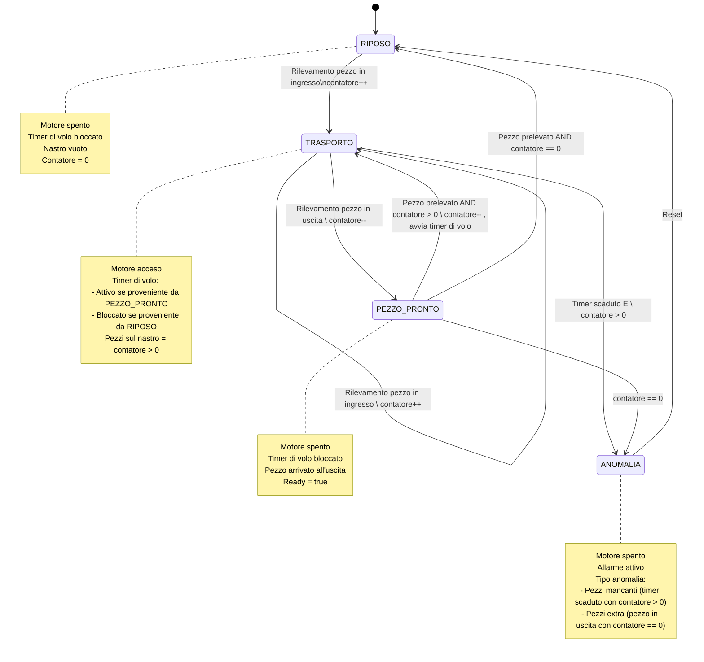

>[Torna all'indice](indexpulsanti.md) >[versione in Python](nastro_py.md)

#  **NASTRO TRASPORTATORE**

##  **Gestione di un nastro**

Programma per la gestione di un nastro trasportatore realizzato con un **timer** basato sul polling della funzione ```millis()``` e su **rilevatori di transito** basati su ```delay()```.

Per dettagli sulle macchine a stati finiti (o FSM) vedi [FSM](indexstatifiniti.md) e [Linee guida FSM](statifinitisviluppo.md)

###  **Esigenza**

Scrivere un programma che realizzi la gestione di un nastro traportatore attraverso la lettura di tre sensori di transito (barriere ad infrarossi) e il comando di un motore. 

I sensori permangono al livello alto finchè un oggetto ingombra l'area del sensore, dopodichè vanno a livello basso. I sensori sono due all'inizio del nastro (uno per i pezzi bassi ed un'altro per quelli alti) ed uno alla fine del nastro che rileva il pezzo pronto per essere prelevato. 

Esiste un timer di volo, così chiamato perchè dura esattamente per il tempo che impiegherebbe il pezzo più lontano dall'uscita, cioè quello sulla barriera di ingresso, per arrivare sulla barriera di uscita. 

All'attivazione di un qualsiasi sensore di ingresso parte il motore e si resetta e pure si blocca il timer di volo. All'attivazione del sensore di uscita si blocca il nastro, alla sua disattivazione riparte il nastro e parte il timer di volo. Allo scadere del timer di volo si spegne il motore.

## **Stati**

- **RIPOSO**: Il nastro è vuoto e fermo, in attesa di nuovi pezzi.
- **TRASPORTO_CERTO**: C'è almeno un pezzo sul nastro, confermato dal rilevamento di un sensore all'ingresso. Il timer è disattivato perché abbiamo certezza della presenza del pezzo.
- **PEZZO_PRONTO**: Un pezzo è arrivato all'uscita ed è pronto per essere prelevato. Il nome riflette perfettamente lo stato del sistema piuttosto che l'azione esterna.
- **TRASPORTO_STIMATO**: Potrebbero esserci altri pezzi sul nastro, ma non ne abbiamo conferma diretta dai sensori. Il timer è attivo per stimare quando il nastro sarà vuoto.


# Tabella delle Transizioni degli Stati del Sistema Trasportatore

| Stato Attuale | Evento | Condizione | Azione | Stato Successivo |
|---------------|--------|------------|--------|------------------|
| RIPOSO | Rilevamento pezzo in ingresso | - | contatore++ | TRASPORTO |
| TRASPORTO | Rilevamento pezzo in ingresso | - | contatore++ | TRASPORTO |
| TRASPORTO | Rilevamento pezzo in uscita | - | - | PEZZO_PRONTO |
| TRASPORTO | Timer scaduto | contatore > 0 | - | ANOMALIA |
| PEZZO_PRONTO | Pezzo prelevato | contatore > 1 | contatore--, avvia timer di volo | TRASPORTO |
| PEZZO_PRONTO | Pezzo prelevato | contatore == 1 | contatore-- | RIPOSO |
| PEZZO_PRONTO | - | contatore == 0 | - | ANOMALIA |
| ANOMALIA | Reset | - | - | RIPOSO |

## Azioni degli Stati

| Stato | Motore | Timer di Volo | Condizioni | Altri Segnali |
|-------|--------|--------------|------------|---------------|
| RIPOSO | Spento | Bloccato | Nastro vuoto, Contatore = 0 | - |
| TRASPORTO | Acceso | Attivo se da PEZZO_PRONTO, Bloccato se da RIPOSO | Pezzi sul nastro (contatore > 0) | - |
| PEZZO_PRONTO | Spento | Bloccato | Pezzo arrivato all'uscita | Ready = true |
| ANOMALIA | Spento | - | - | Allarme attivo |

## Tipi di Anomalia
- **Pezzi mancanti**: Timer scaduto con contatore > 0 nel stato TRASPORTO
- **Pezzi extra**: Pezzo rilevato in uscita con contatore == 0 nel stato PEZZO_PRONTO

##  **Diagramma degli stati**



##  **Soluzione in logica "prima gli ingressi"**

L'algoritmo proposto per la gestione di un nastro trasportatore fa uso: 
- della **primitiva** ```waitUntilInputLow()``` per la realizzazione della logica di barriera (pulsante toggle)
- delle **funzioni** ```stop()```, ```reset()``` e ```get()``` per la gestione di un timer
- della **variabile globale** ```ready``` per segnalare agli altri thread (o al loop principale) la presenza di un **pezzo pronto** per essere prelevato.

L'algoritmo gestisce **tre sensori** di barriera (rilevatori di transito):
- uno in barriera di ingresso per i **pezzi alti** appena inseriti sul nastro
- uno in barriera di ingresso per i **pezzi bassi** appena inseriti sul nastro
- uno in barriera di uscita per i **pezzi pronti** per essere prelevati

L'algoritmo si divide in due **fasi** in cui vengono svolti due compiti (**task**) differenti:
- la **lettura degli ingressi**, ovvero il controllo dello stato dei **sensori di transito**, sia quello dei **pezzi in ingresso** che quello dei **pezzi in uscita**.
- il polling dello **stato del timer** per stabilire se non ci sono più pezzi sul nastro e quindi **spegnere il motore**.

L'algoritmo è implementato usando una **logica FSM** di tipo **"prima gli ingressi e dopo gli stati"**.

```C++
bool ready = false;
in contatore = 0;

void setup() {
  ready = false;
}

void loop() {
	if(digitalRead(startSensorHigh)==HIGH){		// se è alto c'è stato un fronte di salita
		switch (statoCorrente) {
		  case RIPOSO:
		        statoCorrente = TRASPORTO;
                        waitUntilInputLow(startSensorHigh,50);
		        contatore++;
                        engineon = true; 
			volo.stop();
		  case ANOMALIA:
			break;
		}
	}else if(digitalRead(startSensorLow)==HIGH){	// se è alto c'è stato un fronte di salita
		switch (statoCorrente) {
		  case RIPOSO:
			statoCorrente = TRASPORTO;
			waitUntilInputLow(startSensorLow,50);
			contatore++;
			engineon = true; 
			volo.stop();
		  case ANOMALIA:
			break;
		}
	}else if(digitalRead(stopSensor)==HIGH) {
		switch (statoCorrente) {
		  case TRASPORTO:
			engineon = false; 
			ready = true;
			waitUntilInputLow(stopSensor,50);
			// PEZZO_PRONTO
			contatore--;
			ready = false;
			if(contatore == 0){
				statoCorrente = RIPOSO;
			}else if(contatore > 0){
				statoCorrente = TRASPORTO;
				engineon = true; 
				volo.start(); 		
				volo.reset();
			}else{
				statoCorrente = ANOMALIA;
				volo.stop();
	        		volo.reset();
				ready = false;
				engineon = false; 
			}	
		  case ANOMALIA:
			break;
		}
	}else if(digitalRead(reset)==HIGH) {
		switch (statoCorrente) {
		  case ANOMALIA:
		        waitUntilInputLow(stopSensor,50);
			statoCorrente = RIPOSO;
 			contatore = 0; 
			break;
		}
	}else if(volo.get() > 10000){
		switch (statoCorrente) {
		  case TRASPORTO:
			statoCorrente = ANOMALIA;
			volo.stop();
        		volo.reset();
			ready = false;
			engineon = false;  
			break;
		}
	}
}
```


Un **esempio completo** per la gestione di un singolo nastro, corredato di elementi di segnalazione (led) e messaggistica di debug è riportato di seguito:


```C++
/*Sistema di nastro trasportatore con contapezzi*/
#include "urutils.h"

// Pin di I/O
byte startSensorHigh = 4;
byte startSensorLow = 3;
byte stopSensor = 2;
byte engineLed = 10;
byte lowStartLed = 9;
byte highStartLed = 8;
byte stopLed = 11;
byte anomalyLed = 12;  // Nuovo LED per segnalare anomalie

// Costanti
unsigned flyTime = 4000; // tempo di volo di un pezzo sul nastro

// Variabili globali
bool engineon;           // stato del motore
int contatore = 0;       // contatore pezzi sul nastro
bool anomalia = false;   // flag per stato di anomalia
String tipoAnomalia = ""; // tipo di anomalia rilevata

// Definizione degli stati
typedef enum {
  RIPOSO,
  TRASPORTO,
  PEZZO_PRONTO,
  ANOMALIA
} Stato;

// Stato corrente del sistema
Stato stato_corrente = RIPOSO;

void setup() {
  Serial.begin(115200);
  
  // Configurazione pin
  pinMode(engineLed, OUTPUT);
  pinMode(lowStartLed, OUTPUT);
  pinMode(highStartLed, OUTPUT);
  pinMode(stopLed, OUTPUT);
  pinMode(anomalyLed, OUTPUT);
  pinMode(startSensorHigh, INPUT);
  pinMode(startSensorLow, INPUT);
  pinMode(stopSensor, INPUT); 
  
  // Inizializzazione
  engineon = false;
  digitalWrite(engineLed, LOW);
  digitalWrite(anomalyLed, LOW);
  volo.stop();
  contatore = 0;
  
  Serial.println("Sistema inizializzato - Stato: RIPOSO");
}

void loop() {
  // Rilevamento pezzo in ingresso (sia alto che basso)
  if (digitalRead(startSensorLow) == HIGH || digitalRead(startSensorHigh) == HIGH) {
    byte sensorAttivo = (digitalRead(startSensorLow) == HIGH) ? startSensorLow : startSensorHigh;
    byte ledAttivo = (digitalRead(startSensorLow) == HIGH) ? lowStartLed : highStartLed;
    String tipoPezzo = (digitalRead(startSensorLow) == HIGH) ? "basso" : "alto";
    
    // Indipendentemente dallo stato attuale, passiamo a TRASPORTO
    stato_corrente = TRASPORTO;
    contatore++;
    
    // Aggiorniamo le uscite
    engineon = true;
    digitalWrite(engineLed, HIGH);
    digitalWrite(ledAttivo, HIGH);
    volo.stop(); // blocca il timer di volo
    
    Serial.print("Pezzo ");
    Serial.print(tipoPezzo);
    Serial.println(" in ingresso");
    Serial.print("Contatore: ");
    Serial.println(contatore);
    Serial.println("Timer di volo disattivato");
    
    // Attesa del passaggio completo del pezzo
    waitUntilInputLow(sensorAttivo, 50);
    
    Serial.print("Pezzo ");
    Serial.print(tipoPezzo);
    Serial.println(" transitato in ingresso");
    digitalWrite(ledAttivo, LOW);
  }
  
  // Rilevamento pezzo in uscita
  else if (digitalRead(stopSensor) == HIGH) {
    if (contatore > 0) {
      // Transizione a PEZZO_PRONTO
      stato_corrente = PEZZO_PRONTO;
      
      // Aggiorniamo le uscite
      engineon = false;
      digitalWrite(engineLed, LOW);
      digitalWrite(stopLed, HIGH);
      
      Serial.println("Pezzo in uscita");
      Serial.print("Contatore prima del prelievo: ");
      Serial.println(contatore);
      
      // Attesa del prelievo del pezzo
      waitUntilInputLow(stopSensor, 50);
      
      // Decremento contatore dopo prelievo
      contatore--;
      
      Serial.println("Pezzo prelevato dall'uscita");
      Serial.print("Contatore dopo il prelievo: ");
      Serial.println(contatore);
      
      // Decisione in base al contatore
      if (contatore > 0) {
        // Ci sono ancora pezzi sul nastro
        stato_corrente = TRASPORTO;
        engineon = true;
        digitalWrite(engineLed, HIGH);
        volo.start();
        volo.reset();
        Serial.println("Timer di volo attivato");
      } else {
        // Non ci sono più pezzi, torna a RIPOSO
        stato_corrente = RIPOSO;
        Serial.println("Stato: RIPOSO");
      }
      digitalWrite(stopLed, LOW);
    } else {
      // Anomalia: pezzo in uscita ma contatore è 0
      stato_corrente = ANOMALIA;
      anomalia = true;
      tipoAnomalia = "Pezzo extra rilevato";
      
      engineon = false;
      digitalWrite(engineLed, LOW);
      digitalWrite(anomalyLed, HIGH);
      
      Serial.println("ANOMALIA: Pezzo extra rilevato all'uscita");
      Serial.println("Contatore = 0 ma c'è un pezzo all'uscita");
      
      // Attendi prelievo del pezzo
      waitUntilInputLow(stopSensor, 50);
      digitalWrite(stopLed, LOW);
    }
  }
  
  // Timer di volo scaduto (solo in stato TRASPORTO)
  else if (stato_corrente == TRASPORTO && volo.get() > flyTime) {
    if (contatore > 0) {
      // Anomalia: timer scaduto ma contatore > 0
      stato_corrente = ANOMALIA;
      anomalia = true;
      tipoAnomalia = "Pezzi mancanti";
      
      engineon = false;
      digitalWrite(engineLed, LOW);
      digitalWrite(anomalyLed, HIGH);
      volo.stop();
      volo.reset();
      
      Serial.println("ANOMALIA: Pezzi mancanti");
      Serial.print("Timer di volo scaduto ma contatore = ");
      Serial.println(contatore);
    }
  }
  
  // Reset dell'anomalia (simulato con pressione su entrambi i sensori di ingresso)
  if (stato_corrente == ANOMALIA && 
      digitalRead(startSensorHigh) == HIGH && 
      digitalRead(startSensorLow) == HIGH) {
    
    // Reset del sistema
    stato_corrente = RIPOSO;
    contatore = 0;
    anomalia = false;
    tipoAnomalia = "";
    
    engineon = false;
    digitalWrite(engineLed, LOW);
    digitalWrite(anomalyLed, LOW);
    volo.stop();
    volo.reset();
    
    Serial.println("Reset anomalia");
    Serial.println("Stato: RIPOSO");
    
    // Attendi il rilascio dei pulsanti
    while(digitalRead(startSensorHigh) == HIGH || digitalRead(startSensorLow) == HIGH) {
      delay(50);
    }
  }
}
```
Simulazione su Arduino con Tinkercad: https://www.tinkercad.com/things/bKP671nY2MU-copy-of-nastrouno/editel?tenant=circuits

##  **Soluzione in logica "prima gli stati"**

L'algoritmo è implementato usando una **logica FSM** di tipo **"prima gli stati e dopo gli ingressi"**.

```C++
//##### urutils.h #####
void waitUntilInputLow(int btn, unsigned t)
{
   do{
     delay(t);
   }while(digitalRead(btn)!=LOW);
}

struct DiffTimer
{
  unsigned long elapsed, last;
  bool timerstate=false;
  byte state = 0;
  byte count = 0;
  void reset(){
    elapsed = 0;
    last = millis();
  }
  void toggle(){
    if(timerstate){
      stop();
    }else{
      start();
    }  
  }
  void stop(){
    if(timerstate){
      timerstate = false;
      elapsed += millis() - last;
    }  
  }
  void start(){
    if(!timerstate){
      timerstate = true;
      last = millis();
    }
  }
  unsigned long get(){
    if(timerstate){
      return millis() - last + elapsed;
    }
    return elapsed;
  }
  void set(unsigned long e){
    reset();
    elapsed = e;
  }
};
//##### urutils.h #####

// Definizione pin per sensori e attuatori
const int SENSORE_PEZZI_ALTI = 2;   // Sensore di ingresso per pezzi alti
const int SENSORE_PEZZI_BASSI = 3;  // Sensore di ingresso per pezzi bassi
const int SENSORE_USCITA = 4;       // Sensore di uscita
const int MOTORE_NASTRO = 5;        // Pin per il controllo del motore

// Timer di volo
DiffTimer timerVolo;
const unsigned long TEMPO_VOLO = 10000; // 10 secondi (da regolare in base alla lunghezza del nastro)

// Variabili di stato
enum Stati {
  RIPOSO,
  TRASPORTO_CERTO,
  TRASPORTO_STIMATO,
  PEZZO_PRONTO
};

uint8_t statoCorrente = RIPOSO;
bool ready = false; // Segnale che indica un pezzo pronto per essere prelevato

void setup() {
  // Inizializzazione I/O
  pinMode(SENSORE_PEZZI_ALTI, INPUT);  // Utilizzo pullup interno: LOW quando un pezzo interrompe la barriera
  pinMode(SENSORE_PEZZI_BASSI, INPU); // Utilizzo pullup interno: LOW quando un pezzo interrompe la barriera
  pinMode(SENSORE_USCITA, INPUT);      // Utilizzo pullup interno: LOW quando un pezzo interrompe la barriera
  pinMode(MOTORE_NASTRO, OUTPUT);
  // Inizializzazione dello stato
  digitalWrite(MOTORE_NASTRO, LOW); // Motore inizialmente spento
  // Inizializzazione timer
  timerVolo.reset();
  // Inizializzazione seriale per debug
  Serial.begin(9600);
  Serial.println("Sistema Nastro Trasportatore inizializzato");
}

void loop() {
  // Macchina a stati
  switch (statoCorrente) {
    case RIPOSO:
      // Nastro fermo, in attesa di rilevare un pezzo in ingresso
	  
      if (digitalRead(SENSORE_PEZZI_ALTI) == HIGH) {
        Serial.println("Pezzo ALTO rilevato in ingresso");
        waitUntilInputLow(SENSORE_PEZZI_ALTI, 50); // Attendi che il pezzo attraversi completamente il sensore
        Serial.println("Avvio trasporto certo");
	// Aggiorna lo stato
	statoCorrente = TRASPORTO_CERTO;
	// impostazione valore uscite
	digitalWrite(MOTORE_NASTRO, HIGH);// Attiva il motore
	// inizializzazione stato successivo
	timerVolo.reset();// Resetta e blocca il timer di volo
	timerVolo.stop();
      } 
      else if (digitalRead(SENSORE_PEZZI_BASSI) == HIGH) {
        Serial.println("Pezzo BASSO rilevato in ingresso");
        waitUntilInputLow(SENSORE_PEZZI_BASSI, 50); // Attendi che il pezzo attraversi completamente il sensore
        // Aggiorna lo stato
	statoCorrente = TRASPORTO_CERTO;
	// impostazione valore uscite
	digitalWrite(MOTORE_NASTRO, HIGH);// Attiva il motore
	// inizializzazione stato successivo
	timerVolo.reset();// Resetta e blocca il timer di volo
	timerVolo.stop();
      }
      break;
      
    case TRASPORTO_CERTO:
      // Nastro in movimento con presenza certa di un pezzo
      
      if (digitalRead(SENSORE_USCITA) == HIGH) {// Monitora il sensore di uscita
        Serial.println("Pezzo arrivato all'uscita");
	// Aggiorna lo stato
	statoCorrente = PEZZO_PRONTO;
      }
      break;
      
    case PEZZO_PRONTO:
      // Pezzo in attesa di essere prelevato
      
      // Monitora il sensore di uscita per rilevare quando il pezzo viene prelevato
      if (digitalRead(SENSORE_USCITA) == HIGH) {
        Serial.println("Pezzo prelevato. Avvio trasporto stimato");  
	// Aggiorna lo stato
	statoCorrente = TRASPORTO_STIMATO;
    	ready = true;// segnala al thred del braccio che il pezzo è pronto
	digitalWrite(MOTORE_NASTRO, LOW);// Blocca il motore
	waitUntilInputLow(SENSORE_USCITA,50);// aspetta che il braccio prelevi il pezzo
	// impostazione valore uscite
	digitalWrite(MOTORE_NASTRO, HIGH);// Riavvia il motore
	// inizializzazione stato successivo
	ready = false;// segnala al thred del braccio che il pezzo è stato prelevato
	timerVolo.reset();
	timerVolo.start();// Avvia il timer di volo
      }
      break;
      
    case TRASPORTO_STIMATO:
      // Nastro in movimento, possibile presenza di pezzi non confermata
      
      // Controlla se è arrivato un pezzo all'uscita
      if (digitalRead(SENSORE_USCITA) == HIGH) {
        Serial.println("Pezzo arrivato all'uscita durante trasporto stimato");
	// Aggiorna lo stato
	statoCorrente = PEZZO_PRONTO;
      // Controlla se è arrivato un nuovo pezzo all'ingresso
      else if (digitalRead(SENSORE_PEZZI_ALTI) == HIGH) {
        Serial.println("Nuovo pezzo ALTO rilevato in ingresso durante trasporto stimato");
        waitUntilInputLow(SENSORE_PEZZI_ALTI, 50);
        // Aggiorna lo stato
	statoCorrente = TRASPORTO_CERTO;
        // inizializzazione stato successivo
	timerVolo.reset();// Resetta e blocca il timer di volo (il motore è già acceso)
	timerVolo.stop();
      }
      else if (digitalRead(SENSORE_PEZZI_BASSI) == HIGH) {
        Serial.println("Nuovo pezzo BASSO rilevato in ingresso durante trasporto stimato");
        waitUntilInputLow(SENSORE_PEZZI_BASSI, 50);
        // Aggiorna lo stato
	statoCorrente = TRASPORTO_CERTO;
        // inizializzazione stato successivo
	timerVolo.reset();// Resetta e blocca il timer di volo (il motore è già acceso)
	timerVolo.stop();
      }
      // Controlla se è scaduto il timer di volo
      else if (timerVolo.get() >= TEMPO_VOLO) {
        Serial.println("Timer di volo scaduto. Nastro vuoto");
        // Aggiorna lo stato
	statoCorrente = RIPOSO;
        // impostazione valore uscite
        digitalWrite(MOTORE_NASTRO, LOW);// Ferma il motore
	// inizializzazione stato successivo
        ready = false;
      }
      break;
  }

  // Piccolo delay per stabilità
  delay(50);
}
```


>[Torna all'indice](indexpulsanti.md) >[versione in Python](nastro_py.md)
