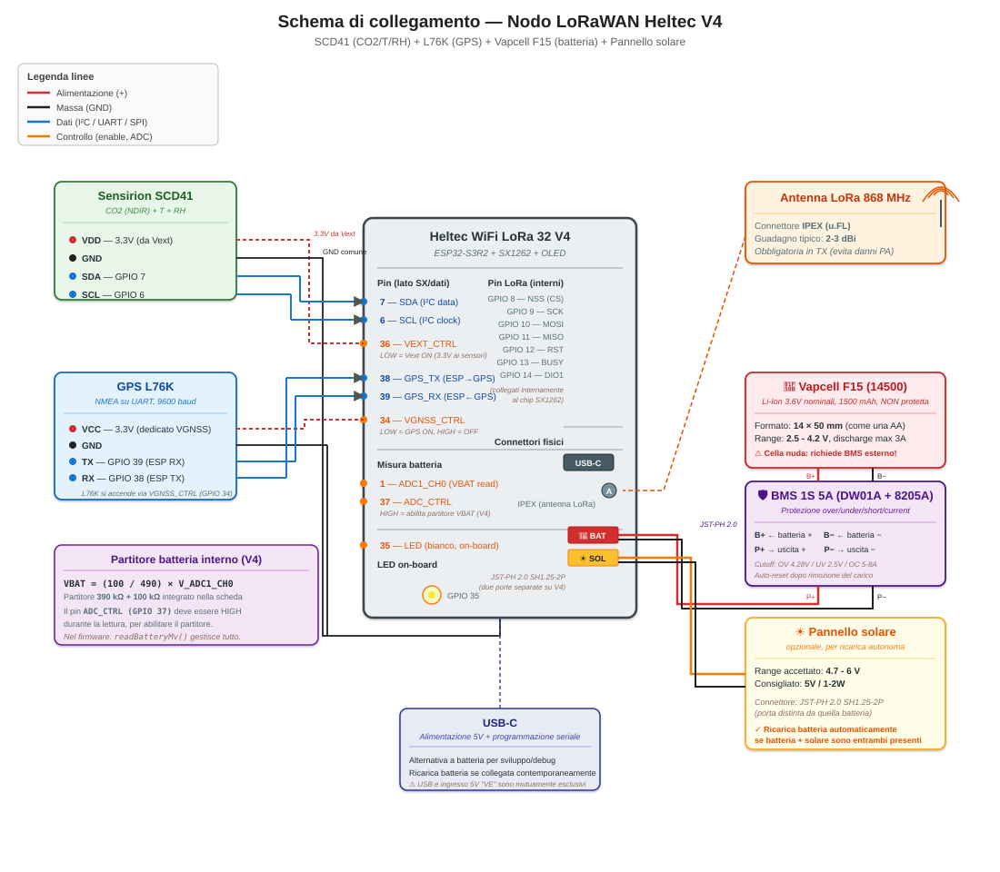

# Schema di collegamento del nodo LoRaWAN

Documento di riferimento per il cablaggio fisico del nodo. Complementa la [dispensa firmware](dispensa-firmware-lorawan-lowpower.md) che descrive il comportamento software, mostrando qui **come sono collegati fisicamente** i vari componenti alla scheda Heltec WiFi LoRa 32 V4.

## Indice

1. [Componenti richiesti](#componenti-richiesti)
2. [Schema visuale](#schema-visuale)
3. [Le particolarità della Heltec V4](#le-particolarità-della-heltec-v4)
4. [Pinout dettagliato](#pinout-dettagliato)
5. [Cablaggio passo passo](#cablaggio-passo-passo)
6. [Il partitore batteria e la misura VBAT](#il-partitore-batteria-e-la-misura-vbat)
7. [Il pannello solare — dimensionamento e scelta](#il-pannello-solare--dimensionamento-e-scelta)
8. [Precauzioni e cose da NON fare](#precauzioni-e-cose-da-non-fare)
9. [Checklist di verifica prima di alimentare](#checklist-di-verifica-prima-di-alimentare)

---

## Componenti richiesti

Per assemblare il nodo servono:

| Componente | Modello | Ruolo | Note |
|-----------|---------|-------|------|
| Scheda principale | **Heltec WiFi LoRa 32 V4** | Micro + radio LoRa + gestione batteria | Versione high-power raccomandata (28 dBm) |
| Sensore ambientale | **Sensirion SCD41** | CO2 (NDIR) + temperatura + umidità | Modulo I²C, richiede 3.3V |
| GPS | **Quectel L76K** | Fix GNSS per geolocalizzazione | UART 9600 baud, richiede antenna GPS |
| Batteria | **Vapcell F15 (18650)** | Alimentazione autonoma | ~2900 mAh, 3.0-4.2V, JST-PH 2.0 |
| Pannello solare (opzionale) | **5V / 1-2W** | Ricarica batteria | JST-PH 2.0, range 4.7-6V |
| Antenna LoRa | **SMA/IPEX 868 MHz** | Trasmissione radio | 2-3 dBi tipici |
| Antenna GPS | **Attiva 3.3V** | Ricezione satelliti | Solitamente inclusa col modulo L76K |
| Cavi jumper | **F/F o F/M** | Cablaggio SCD41 e L76K | 20-30 cm consigliati |

Il costo totale del nodo si aggira intorno ai **€60-80** (Heltec V4 ~€25, SCD41 ~€20, L76K ~€15, batteria + pannello + antenne ~€15-20).

---

## Schema visuale

<p align="center">
  
</p>

*Figura: schema dei collegamenti elettrici del nodo. In rosso l'alimentazione, in nero la massa, in blu i segnali dati (I²C, UART, SPI), in arancione i segnali di controllo (enable, ADC). Le linee tratteggiate rosse rappresentano l'alimentazione Vext, controllata via GPIO 36 del microcontroller: quando LOW, Vext eroga 3.3V a SCD41 e altri sensori esterni; quando HIGH, tutto è spento (per il deep sleep).*

---

## Le particolarità della Heltec V4

La Heltec **WiFi LoRa 32 V4** ha alcune caratteristiche uniche rispetto ai modelli precedenti (V2, V3) che vale la pena conoscere prima di collegarci qualsiasi cosa:

### Due connettori JST-PH separati: batteria + solare

Questa è la novità più importante rispetto alla V3. La V4 ha **due connettori fisicamente distinti**, entrambi in formato **SH1.25 2-pin** (equivalente a JST-PH 2.0):

- **Connettore batteria** (marcato "BAT" sul PCB) — collega la Li-Ion 18650
- **Connettore pannello solare** (marcato "SOLAR" o "SOL") — collega il pannello

Sulla V3 c'era solo il connettore batteria. Se volevi ricaricare da pannello dovevi mettere in mezzo un modulo TP4056 esterno e i suoi problemi (mancanza di MPPT, drop di tensione, cablaggio extra).

**Sulla V4 la gestione è integrata**: puoi collegare batteria e pannello contemporaneamente. Il circuito interno gestisce automaticamente:
- Se solo batteria: il device scarica la batteria normalmente
- Se solo USB: alimenta il device e ricarica la batteria (se presente)
- Se solo pannello (con sufficiente luce): alimenta il device e ricarica la batteria
- Se USB + batteria + pannello: USB ha la precedenza, pannello contribuisce, batteria si ricarica

Il range di tensione accettato dal pannello è **4.7-6V**. Fuori da questa finestra il circuito di ricarica non funziona (sotto 4.7V) o rischia danno (sopra 6V).

**Attenzione al mutuo esclusivo USB vs 5V esterno**: la scheda ha anche un pin `VE` che accetta 5V esterni per alimentazione (utile in installazioni fisse), ma **non si può usare `VE` e USB simultaneamente**. Il pannello solare invece è compatibile con qualsiasi altra sorgente.

### Consumo in deep sleep ottimizzato

La V4 dichiara **meno di 20 μA** in deep sleep (contro i ~150 μA della V3). Questo perché ha:
- Ottimizzato il regolatore di tensione interno per basso consumo a riposo
- Aggiunto un controllo dedicato per il GNSS (pin GPIO 34) che stacca completamente il modulo L76K quando non serve
- Aggiunto il controllo Vext (pin GPIO 36) che stacca l'alimentazione ai sensori esterni

Nel firmware questo si traduce in: prima del deep sleep, il codice imposta `PIN_VEXT_CTRL = HIGH` e `PIN_VGNSS_CTRL = HIGH` per spegnere SCD41 e L76K, poi il microcontroller entra in sleep sotto i 20 μA.

### GNSS su connettore dedicato SH1.25 8-pin

La V4 ha un **connettore GNSS dedicato** a 8 pin (SH1.25) accanto ai connettori batteria e solare. Questo connettore è pensato per moduli GPS compatti tipo il **Heltec HT-CG04** (che è essenzialmente un L76K con connettore JST già pronto).

**Nel nostro progetto** usiamo il **Quectel L76K su modulo breakout esterno** (comune, economico), collegato via cavi jumper ai GPIO 38/39 esposti sui pin header. Non usiamo il connettore GNSS dedicato per due motivi:
- Il modulo breakout costa meno e permette più flessibilità di posizionamento
- Il collegamento su GPIO 38/39 è coerente col codice firmware, senza dover modificare i pin

Se un domani volessi passare al connettore dedicato, cambiano i pin (vedi datasheet Heltec V4) e il firmware va aggiornato di conseguenza.

### Compatibilità pinout con V3

La V4 mantiene la **compatibilità pinout** con la V3 per tutti i pin GPIO principali (I²C, SPI, UART). Se hai codice che gira su V3, quasi sempre gira anche su V4 senza modifiche. Le differenze sono:
- V4 aggiunge nuovi pin per GNSS dedicato e controllo alimentazione
- La potenza TX massima è più alta (28 dBm vs 22 dBm) — devi rispettare i limiti duty cycle regionali
- Il partitore batteria è diverso (V4: 390k+100k, V3: 100k+100k) — la formula di lettura VBAT cambia

---

## Pinout dettagliato

Riferimento completo per orientarsi sui pin usati dal firmware:

### GPIO del microcontroller usati

| GPIO | Funzione | Direzione | Note |
|------|----------|-----------|------|
| **1** | ADC1_CH0 — VBAT read | Input analogico | Legge tensione batteria (via partitore) |
| **6** | I²C SCL | Output/Input | Clock I²C per SCD41 |
| **7** | I²C SDA | Bidirezionale | Data I²C per SCD41 |
| **8** | SX1262 NSS (CS) | Output | Chip select radio LoRa (interno) |
| **9** | SX1262 SCK | Output | Clock SPI radio (interno) |
| **10** | SX1262 MOSI | Output | Master → Radio (interno) |
| **11** | SX1262 MISO | Input | Radio → Master (interno) |
| **12** | SX1262 RST | Output | Reset radio LoRa (interno) |
| **13** | SX1262 BUSY | Input | Radio busy signal (interno) |
| **14** | SX1262 DIO1 | Input (IRQ) | Interrupt radio (interno) |
| **34** | VGNSS_CTRL | Output | LOW = GPS acceso, HIGH = spento |
| **35** | LED bianco on-board | Output | Indicatore visivo |
| **36** | VEXT_CTRL | Output | LOW = Vext ON, HIGH = OFF |
| **37** | ADC_CTRL | Output | LOW = abilita partitore VBAT |
| **38** | UART TX → GPS RX | Output | ESP trasmette al GPS |
| **39** | UART RX ← GPS TX | Input | ESP riceve dal GPS |

I pin marcati "interni" (8-14) sono già connessi al chip SX1262 all'interno del PCB della V4 — **non serve cablarli tu**, li usa RadioLib automaticamente.

### Pin da NON usare

Alcuni GPIO della V4 sono già occupati da funzioni on-board:

- **GPIO 15, 16, 17, 18** — SPI OLED display (se presente)
- **GPIO 19, 20** — USB D+/D− (comunicazione USB-C)
- **GPIO 45, 46, 47, 48** — strapping pins e boot mode
- **Pin flash SPI** (26-32) — riservati alla flash interna, non usarli

Se devi aggiungere sensori, usa i GPIO liberi: **2, 3, 4, 5, 40, 41, 42, 43, 44**.

---

## Cablaggio passo passo

### 1. SCD41 → Heltec V4

Il SCD41 usa 4 fili (I²C standard):

| SCD41 pin | Heltec V4 pin | Colore filo consigliato |
|-----------|---------------|-------------------------|
| VDD | **3.3V (Vext)** — dal pin `3V3` con Vext ON | Rosso |
| GND | Uno qualsiasi dei pin GND | Nero |
| SDA | GPIO 7 | Blu / bianco |
| SCL | GPIO 6 | Giallo / verde |

**Punto delicato**: il SCD41 deve essere alimentato dai **3.3V erogati da Vext**, non dai 3.3V "sempre accesi". Perché? Per poter spegnere completamente il sensore durante il deep sleep — un SCD41 acceso consuma ~15 mA continui, che scaricherebbero la batteria in poche giorni.

Sulla V4, i pin marcati `3V3` sui pin header sono l'uscita di Vext, che è controllata da GPIO 36. Il firmware fa `PIN_VEXT_CTRL = LOW` prima delle misure e `HIGH` prima del deep sleep.

Non serve resistenza di pull-up esterna su SDA/SCL: il modulo SCD41 breakout tipico ne ha già di integrate (10 kΩ).

### 2. GPS L76K → Heltec V4

Il L76K usa 4 fili (UART standard):

| L76K pin | Heltec V4 pin | Colore filo consigliato |
|----------|---------------|-------------------------|
| VCC | **3.3V** (VGNSS dedicato, se disponibile sul modulo) | Rosso |
| GND | Uno qualsiasi dei pin GND | Nero |
| TX | GPIO 39 (ESP RX) | Verde |
| RX | GPIO 38 (ESP TX) | Bianco |

**Attenzione al crossover TX/RX**: il TX del GPS va all'RX dell'ESP e viceversa. Se colleghi TX↔TX (errore comune), il GPS non risponderà mai a nulla.

**Alimentazione**: se il tuo modulo L76K breakout ha un pin dedicato per l'enable/power (spesso marcato `EN`, `PWR` o `SET`), puoi collegarlo al GPIO 34 per averne il controllo dal firmware. Altrimenti collegalo permanentemente ai 3.3V — il modulo consumerà i suoi ~30 mA quando la scheda è alimentata (accettabile in USB, gravoso a batteria).

### 3. Batteria → Heltec V4

La batteria Vapcell F15 va connessa al **connettore JST-PH 2.0 marcato "BAT"** sulla V4.

**Polarità critica**: guardando il connettore BAT sulla V4 con l'apertura verso di te, **il pin di destra è il positivo (+)**. Alcune batterie 18650 commerciali con cablaggio già saldato hanno il rosso a sinistra, quindi controlla sempre col multimetro prima di inserire il connettore.

Se la batteria è nuova senza cablaggio, salda:
- Filo rosso al polo `+` della batteria (il "positivo" con il bordo rialzato)
- Filo nero al polo `−` (il "negativo" piatto)
- Termina con un connettore JST-PH 2.0 femmina (contatto rosso corrispondente al pin destro del connettore board)

**Precauzione**: NON mettere in corto il connettore o la batteria durante il cablaggio. Una 18650 in corto può erogare oltre 10A e sviluppare abbastanza calore da bruciare fili o innescare la batteria stessa. Se puoi, salda i fili alla batteria **prima** di collegare l'altra estremità al connettore JST.

### 4. Pannello solare → Heltec V4 (opzionale)

Il pannello va connesso al **connettore JST-PH 2.0 marcato "SOLAR"** sulla V4.

**Requisiti**:
- **Tensione a vuoto (Voc)** tra **4.7V e 6V**
- **Corrente di corto (Isc)** almeno 100-200 mA (per una ricarica sensata)
- Potenza tipica **1-2W**

**Dimensionamento pratico** — per un nodo con TX ogni 60 secondi che consuma in media ~5 mA (misurato: ~5 mAh al giorno), un pannello 5V/1W (200 mA @ 5V) genera in una giornata di sole diretto di 4h effettive circa **200 mA × 4h = 800 mAh di carica utile**. Ampiamente sufficiente per un nodo a duty cycle basso.

**Attenzione all'orientamento**: il pannello va posizionato in modo da ricevere luce diretta per almeno 2-3 ore al giorno. Se il nodo è indoor (dentro una stanza, dietro un vetro), la resa cala del 50-90%. Verifica sul campo prima di considerare il sistema autonomo.

**Polarità**: come per la batteria, il pin destro del connettore SOLAR sulla V4 è il positivo. Verifica con multimetro (con pannello sotto luce) prima di collegare.

### 5. Antenna LoRa → Heltec V4

L'antenna LoRa 868 MHz si collega al **connettore IPEX (u.FL)** sulla V4. Il connettore è piccolo e delicato: inserisci l'antenna con l'apposito connettore IPEX allineandolo e spingendo verticalmente fino a sentire lo scatto.

**Non trasmettere mai senza antenna**. Il PA della SX1262, se non trova un carico da 50Ω a valle, opera in condizioni di mismatch severo e può danneggiarsi in modo permanente. Nel firmware, la prima cosa che fai al setup è `radio.begin()` che tenta subito una trasmissione di test — se non hai l'antenna, hai già bruciato qualcosa.

---

## Il partitore batteria e la misura VBAT

Per misurare la tensione della batteria, l'ADC dell'ESP32-S3 non può leggere direttamente 4.2V (il massimo di una Li-Ion carica). L'ADC accetta al massimo circa 3.1V con l'attenuazione 11 dB. Serve un **partitore di tensione** che porti VBAT dentro il range dell'ADC.

Sulla V4, il partitore è **già integrato nel PCB**, con valori:

- Resistenza superiore: **390 kΩ**
- Resistenza inferiore: **100 kΩ**

Il fattore di divisione è quindi **100 / (390 + 100) = 100/490 ≈ 0.2041**.

Per VBAT = 4.2V (batteria carica), l'ADC vede **4.2 × 0.2041 ≈ 0.857 V**.
Per VBAT = 3.0V (batteria scarica), l'ADC vede **3.0 × 0.2041 ≈ 0.612 V**.

La formula di conversione nel firmware è quindi:

```cpp
uint16_t adc_mv = analogReadMilliVolts(PIN_VBAT_READ);
uint16_t vbat_mv = (uint32_t)adc_mv * 490 / 100;
```

**Perché il partitore va abilitato via GPIO 37 (ADC_CTRL)?** Un partitore permanente attivo consumerebbe corrente continuamente attraverso le resistenze — con 4.2V ai capi di 490 kΩ, il consumo è `I = 4.2 / 490.000 ≈ 8.5 μA`. Non tanto in valore assoluto, ma **quasi la metà del consumo totale del device in deep sleep** (20 μA). Per questo Heltec ha aggiunto un MOSFET in serie al partitore, controllato da `ADC_CTRL`:

- `GPIO 37 = LOW` → il MOSFET conduce, il partitore è attivo, si può leggere VBAT
- `GPIO 37 = HIGH` → il MOSFET è aperto, il partitore è disconnesso, zero consumo

Il firmware attiva il partitore solo per il tempo strettamente necessario alla misura (~10 ms), poi lo disattiva.

---

## Il pannello solare — dimensionamento e scelta

Ricapitoliamo con numeri concreti quale pannello scegliere e cosa aspettarsi.

### Consumo del nodo

Con TX ogni 60 secondi in OTAA:
- Ciclo attivo: ~15 secondi @ ~40 mA = 0.17 mAh per ciclo
- Deep sleep: ~45 secondi @ ~20 μA = trascurabile
- **Media consumo: ~10 mAh al giorno** (con 1440 cicli/giorno)

Con TX ogni 5 minuti (più realistico):
- **Media consumo: ~2 mAh al giorno**

### Durata su batteria sola

Vapcell F15 = **2900 mAh utili** (considerando taglio a 3.0V).

- Con TX ogni 60s: **~290 giorni** = 9-10 mesi
- Con TX ogni 5 min: **~1450 giorni** = 4 anni (limite pratico: autoscarica della batteria)

### Con pannello solare da 1W

Un pannello 5V/1W tipico produce ~150-200 mA @ 5V in condizioni ideali. In una giornata media con 3-4 ore di sole diretto: **500-800 mAh generati al giorno**.

Anche con solo 1 ora di luce sufficiente, il pannello genera **~150 mAh/giorno**, che è **15-75 volte** il consumo del nodo. Il sistema è **autonomo indefinitamente** in qualsiasi installazione outdoor con esposizione minima.

### Con pannello da 2W

Ridondante per questo caso d'uso. Utile solo se il nodo è in ombra parziale o in latitudine molto alta (poche ore di luce d'inverno).

### Pannelli consigliati

Alcuni prodotti reperibili facilmente:

- **Voltaic Systems 1W (5.5V)** — di alta qualità, epossidica, adatto outdoor
- **Adafruit 500mA (6V)** — buon rapporto qualità/prezzo, disponibile su Amazon
- **DIY generico "5V 1W solar panel"** su AliExpress — economico (~€3-5), qualità variabile

Preferisci pannelli con **incapsulamento epossidico** (resistenti alla pioggia) piuttosto che quelli laminati in plastica, che si degradano dopo pochi mesi outdoor.

---

## Precauzioni e cose da NON fare

- **Non collegare la batteria con polarità invertita**. Non c'è protezione: farebbe scattare il fusibile interno o danneggiare il circuito di ricarica. Verifica sempre col multimetro.

- **Non collegare fonti a più di 6V al connettore SOLAR**. Sopra i 6V il circuito di ricarica può danneggiarsi. Se il tuo pannello ha Voc > 6V (comune per pannelli 6V nominali che raggiungono 7-7.5V a circuito aperto), usa un regolatore step-down davanti.

- **Non alimentare il nodo con USB e VE simultaneamente**. Sono mutuamente esclusivi. La combinazione può danneggiare i regolatori.

- **Non collegare/scollegare i moduli con la scheda alimentata**. Spegni sempre (o scollega USB e batteria) prima di rimuovere/aggiungere SCD41, GPS, o modifiche al cablaggio. Un errore di allineamento del jumper mentre l'alimentazione è attiva può cortocircuitare pin adiacenti.

- **Non accendere mai il nodo senza antenna LoRa**. Come detto: il PA della SX1262 può danneggiarsi in modo permanente.

- **Non usare batterie 18650 di dubbia provenienza**. Batterie contraffatte hanno capacità reali di 200-500 mAh (nonostante siglature "9800 mAh") e possono avere protezioni scadenti. Vapcell, Molicel, LG, Samsung sono marche affidabili.

- **Non mettere fili di alimentazione sopra fili di segnale sensibili senza schermatura**. I fili SDA/SCL dell'I²C possono captare disturbi se corrono paralleli a fili di alimentazione (specialmente in prossimità del pannello o della radio). Se noti letture SCD41 instabili, prova a distanziare i cablaggi.

---

## Checklist di verifica prima di alimentare

Prima di alimentare il nodo per la prima volta, verifica in questo ordine:

**Verifiche visive con scheda SPENTA**:

- [ ] Antenna LoRa collegata al connettore IPEX (non lo scollegherai più)
- [ ] SCD41 cablato: VDD, GND, SDA, SCL nei pin corretti (rispettivamente 3.3V, GND, GPIO 7, GPIO 6)
- [ ] L76K cablato: VCC, GND, RX↔TX incrociati correttamente (GPS TX su GPIO 39, GPS RX su GPIO 38)
- [ ] Nessun cortocircuito visibile tra fili adiacenti (guarda dai due lati)

**Verifiche con multimetro (scheda SPENTA)**:

- [ ] Continuità 0Ω tra tutti i GND (SCD41-GND ↔ L76K-GND ↔ V4-GND)
- [ ] Nessuna continuità (∞Ω) tra VDD/VCC dei moduli e GND (evita corti in alimentazione)
- [ ] Polarità della batteria: rosso sul + della cella
- [ ] Polarità del pannello solare (se presente): rosso sul + del pannello

**Prima accensione — via USB (NON con batteria)**:

- [ ] Collega la scheda al PC via USB-C
- [ ] Verifica che il LED on-board lampeggi o si accenda (segno di boot riuscito)
- [ ] Apri Serial Monitor a 115200 baud, verifica che il firmware stampi il banner di boot
- [ ] Verifica che SCD41 risponda (log tipo "SCD41: CO2=... T=... RH=...")
- [ ] Verifica che il GPS emetta NMEA (log tipo "GPS: NMEA ricevuti X byte")

**Seconda accensione — solo con batteria**:

- [ ] Scollega USB
- [ ] Collega batteria carica al connettore BAT
- [ ] Verifica ancora il LED e i log via Serial (Arduino IDE 2.x tiene aperta la porta anche in wake dal deep sleep)
- [ ] Verifica lettura batteria coerente (log tipo "Batteria: 4050 mV (87%)")

**Test finale — con pannello (se presente)**:

- [ ] Posiziona il pannello sotto luce diretta
- [ ] Con il multimetro sul connettore SOLAR, verifica tensione stabile (dovrebbe essere tra 4.7 e 6V)
- [ ] Collega il pannello
- [ ] Verifica che dopo qualche minuto la tensione della batteria salga (misura VBAT prima e dopo)

Se tutti i passi sono OK, il nodo è pronto per essere sigillato nella sua enclosure e messo in campo.

---

## Riferimenti

- [Dispensa firmware](dispensa-firmware-lorawan-lowpower.md) — comportamento software e configurazione
- [Dispensa ChirpStack](dispensa-chirpstack-configurazione.md) — configurazione lato Network Server
- [Datasheet Heltec V4](https://heltec.org/project/wifi-lora-32-v4/) — schema elettrico completo, pinout ufficiale, dimensioni
- [Datasheet SCD41](https://sensirion.com/products/catalog/SCD41/) — specifiche sensore CO2
- [Datasheet L76K](https://www.quectel.com/product/l76k/) — specifiche modulo GPS
