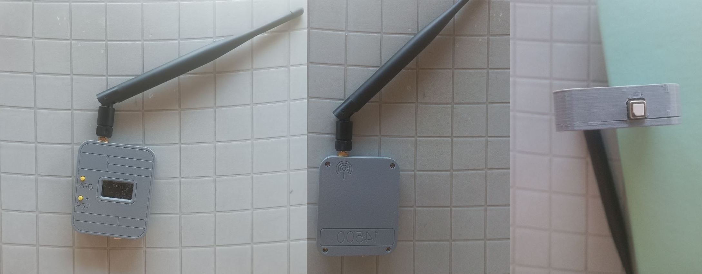
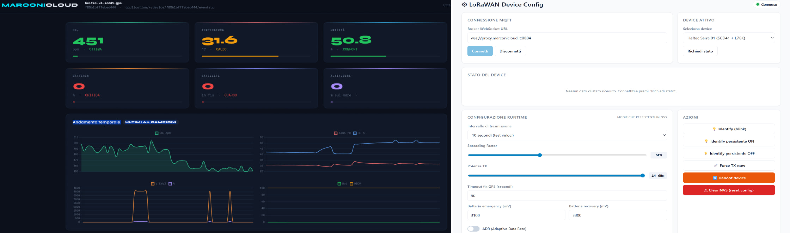
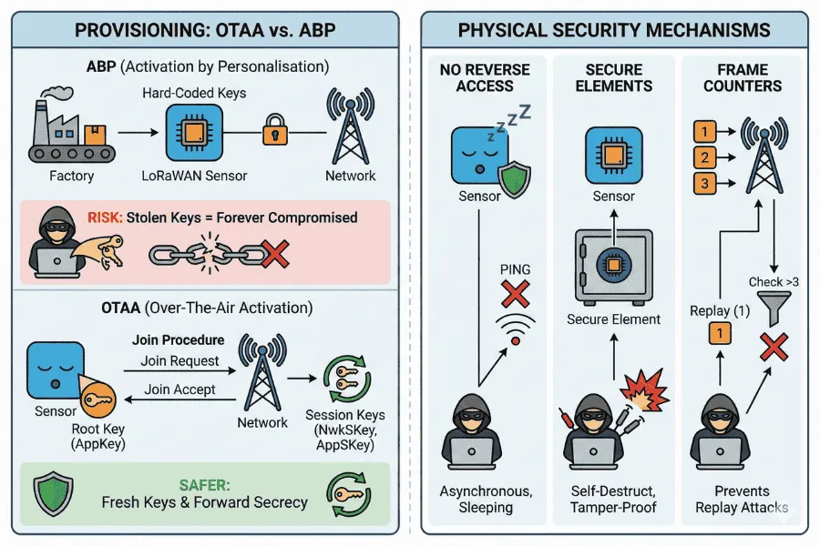

# Dispensa: firmware LoRaWAN low-power per stazione ambientale

Analisi del firmware `heltec_v4_scd41_gps_lorawan.ino`, un end-device LoRaWAN autonomo che campiona CO₂, temperatura, umidità e posizione GPS, e li trasmette via LoRaWAN in classe A con deep sleep.

## Indice

1. [Contesto e obiettivi](#contesto-e-obiettivi)
2. [Architettura hardware](#architettura-hardware)
3. [Il ciclo di vita del firmware](#il-ciclo-di-vita-del-firmware)
4. [Schema del payload versionato](#schema-del-payload-versionato)
5. [FPort: il discriminatore di tipo LoRaWAN](#fport-il-discriminatore-di-tipo-lorawan)
6. [Gestione dell'alimentazione delle periferiche](#gestione-dellalimentazione-delle-periferiche)
7. [Sensore SCD41: I²C e misure periodiche](#sensore-scd41-ic-e-misure-periodiche)
8. [GPS L76K: parsing NMEA e timeout adattivo](#gps-l76k-parsing-nmea-e-timeout-adattivo)
9. [LoRaWAN con RadioLib 7.x](#lorawan-con-radiolib-7x)
10. [ABP vs OTAA: attivazione statica o dinamica](#abp-vs-otaa-attivazione-statica-o-dinamica)
11. [Persistenza del frame counter](#persistenza-del-frame-counter)
12. [Deep sleep e GPIO hold](#deep-sleep-e-gpio-hold)
13. [Protezione batteria da under-discharge](#protezione-batteria-da-under-discharge)
14. [Watchdog hardware](#watchdog-hardware)
15. [ADR e politica di gestione dei parametri runtime](#adr-e-politica-di-gestione-dei-parametri-runtime)
16. [Downlink handler e comandi remoti](#downlink-handler-e-comandi-remoti)
17. [Modalità debug e produzione](#modalità-debug-e-produzione)
18. [Diagnostica e osservabilità](#diagnostica-e-osservabilità)

---

## Contesto e obiettivi

<p align="center">
  
</p>

Il device è pensato per campionare la qualità dell'aria (CO₂, temperatura, umidità) e la posizione, e trasmettere periodicamente questi dati via **LoRaWAN** verso una rete condivisa. I vincoli principali di progetto sono tre:

**Autonomia energetica**. Il device deve poter funzionare per mesi o anni a batteria (opzionalmente con pannello solare). Questo comporta l'uso di deep sleep aggressivo e lo spegnimento fisico delle periferiche tra un ciclo e l'altro.

**Robustezza in caso di power-loss**. Non si può fare affidamento sulla continuità dell'alimentazione: la batteria può scaricarsi, il pannello solare può essere ombreggiato, il device può essere spostato e spento. Il firmware deve riprendersi da queste situazioni senza intervento umano e senza rompere le sessioni LoRaWAN attive.

**Semplicità di manutenzione**. Il codice deve essere leggibile, con separazione chiara delle responsabilità e con flag di configurazione ben esposti in cima al file. Sviluppo e debug devono essere possibili senza tool esoterici, con solo Arduino IDE e Serial Monitor.

Non è un progetto commerciale: la finalità è didattica. Molte scelte sono commentate esplicitamente nel codice per rendere trasparenti i motivi delle decisioni.

Sono state realizzate due dashboard: una di misura e una di configurazione e lettura dello stato del dispositivo.

<p align="center">
  
</p>
---

## Architettura hardware

Il device è basato sulla **Heltec WiFi LoRa 32 V4**, che integra:

<p align="center">
  
</p>

*Figura 1: pinout della Heltec WiFi LoRa 32. L'immagine mostra la V3, ma la V4 R8 usa la stessa piedinatura sugli header J2/J3 con l'aggiunta del connettore SH1.25-8P per il modulo di espansione (GPS/batteria).*

- **ESP32-S3R2**: microcontrollore dual-core Xtensa LX7 a 32 bit con PSRAM da 2 MB, USB-CDC integrato (senza chip UART bridge esterno), WiFi e Bluetooth
- **SX1262**: radio LoRa Semtech per la banda EU868 (~868 MHz), con PA integrato fino a +22 dBm (limitato per legge a +14 dBm in EU)

Alla scheda base si aggiungono, via header:

- **Sensirion SCD41**: sensore CO₂ NDIR fotoacustico su bus I²C, con temperatura e umidità
- **Quectel L76K**: ricevitore GNSS multi-costellazione (GPS + BeiDou) su UART, con controllo di alimentazione
- Batteria LiPo 1S opzionale, con partitore su ADC per il monitoraggio della tensione

Sulla V4 esistono due pin di controllo dell'alimentazione periferica, entrambi comandati dal microcontrollore:

- **Vext_Ctrl (GPIO 36)** — pilota un MOSFET P-channel che alimenta la linea *Vext* (usata per SCD41). Attivo-basso: LOW = MOSFET conduce = periferiche accese.
- **VGNSS_Ctrl (GPIO 34)** — pilota l'alimentazione del solo modulo GPS. Nella particolare release del PCB usata qui la logica è invertita rispetto alla documentazione base: LOW = GPS acceso.

Questo pattern MOSFET P active-low è tipico di tutte le schede low-power: durante il deep sleep, il micro non ha bisogno di "spegnere attivamente" niente perché il pin che comanda il MOSFET si trova già nello stato che spegne il gate (attivo alto quando spento). L'unico accorgimento è mantenere questo livello anche durante il sleep — vedi la sezione sui GPIO hold.

---

## Il ciclo di vita del firmware

A differenza di un firmware Arduino tradizionale con `setup()` una volta e `loop()` continuo, questo firmware è strutturato come **ciclo singolo**: dopo ogni trasmissione entra in deep sleep. Al wake, la CPU riparte da capo con un nuovo `setup()`. Il `loop()` è vuoto perché non viene mai eseguito — il flusso finisce sempre in `esp_deep_sleep_start()` prima.

Un ciclo tipico dura ~30-60 secondi di attività seguiti da ~1 minuto (o più) di sleep, per un duty cycle attivo del 30-50%. Le fasi in ordine:

1. **Boot e rilascio hold GPIO**. La CPU si sveglia, rilascia i lock sui GPIO che erano stati "congelati" prima del sleep precedente.
2. **Alimentazione periferiche**. `vextOn()` accende il SCD41, `gpsPowerOn()` accende il GPS.
3. **Inizializzazione I²C e sensore SCD41**. Reset del sensore, verifica del serial number, avvio delle misure periodiche.
4. **Attesa fix GPS in parallelo alle misure SCD41**. Il GPS può richiedere 30-90 secondi al primo fix; nel frattempo il SCD41 sta già misurando (una misura ogni 5 secondi).
5. **Lettura di tutti i dati**: valori SCD41, coordinate GPS, tensione batteria.
6. **Composizione payload** in una struct C impacchettata (schema versionato).
7. **Inizializzazione radio LoRa e attivazione LoRaWAN ABP**. Ripristino del session buffer da NVS o RTC memory.
8. **Trasmissione via `sendReceive()` su FPort 1**. Il device parla, poi apre due finestre RX (obbligatorie in classe A) per ricevere eventuali downlink.
9. **Aggiornamento persistenza**. FCnt salvato in RTC memory sempre, in NVS ogni N cicli.
10. **Deep sleep**. Spegnimento periferiche, hold dei GPIO, timer di wake.

Ogni fase è confinata in una funzione dedicata. Il `setup()` è essenzialmente una sequenza di chiamate al livello superiore, senza logica di controllo complessa.

---

## Schema del payload versionato

Il payload LoRaWAN è progettato per essere **compatto**, **fisso**, e **riconoscibile**. Compatto perché ogni byte in più aumenta l'airtime e quindi il consumo energetico e il duty cycle usato. Fisso perché il codec sul Network Server deve poter decodificare senza dover interpretare struttura variabile. Riconoscibile perché in futuro potremmo voler aggiungere altri sensori (nuovi schemi) allo stesso Network Server, e serve un modo per distinguerli.

Il progetto usa **due schemi distinti**, ognuno con il suo FPort:

- **Schema 0x42 (misure ambientali)** su FPort 1 — inviato ad ogni ciclo TX
- **Schema 0x43 (state del device)** su FPort 2 — inviato solo su richiesta o dopo eventi significativi

### Schema 0x42 — Misure ambientali

All'interno del payload, un **primo byte "schema_id"** identifica univocamente la struttura seguente:

```c
#define SCHEMA_ID  0x42     // SCD41 + L76K + batteria

#pragma pack(push, 1)
struct Payload_v0x42 {
    uint8_t  schema_id;      // 0x42
    uint8_t  fix_quality;    // 0=no, 1=GPS, 2=DGPS
    uint8_t  satellites;
    uint8_t  battery_pct;
    uint64_t timestamp;
    uint16_t co2_ppm;
    int16_t  temp_c100;      // T x 100 (centesimi °C)
    uint16_t hum_pct100;     // RH x 100
    uint16_t vbat_mv;
    int32_t  lat_e7;         // latitudine x 1e7
    int32_t  lon_e7;
    int16_t  alt_m;
    uint16_t hdop_x100;
};
#pragma pack(pop)

static_assert(sizeof(Payload_v0x42) == 32, "Payload deve essere 32 byte");
```

Alcuni dettagli notevoli:

**Interi al posto di float**. Temperatura e umidità sono moltiplicate per 100 e trasmesse come interi. Latitudine e longitudine sono moltiplicate per 10⁷. Questo risparmia byte (`int16_t` invece di `float32`) senza perdere precisione utile.

**`#pragma pack(push, 1)`**. Senza questa direttiva il compilatore inserisce padding tra i campi per allineare le word alle boundary del processore, portando la struct a più di 32 byte. Con `pack(1)` i campi sono impacchettati senza spazi.

**`static_assert(sizeof(...) == 32, ...)`**. Se il compilatore per qualsiasi motivo produce una struct di dimensione diversa (per esempio se un futuro sviluppatore modifica lo schema senza aggiornare l'`assert`), il build fallisce subito, prima ancora di scaricare il firmware sul device. È una salvaguardia difensiva a costo zero.

### Schema 0x43 — State del device

Il payload state serve a comunicare la **configurazione runtime corrente** e alcune **informazioni diagnostiche** del device, in un formato consumabile da un'interfaccia di configurazione remota (webapp, dashboard). È distinto dallo schema misure perché:

- **Frequenza diversa**: le misure viaggiano ad ogni TX, lo state solo su richiesta o dopo eventi
- **FPort diverso** (2 invece di 1): la webapp filtra facilmente cosa mostrare dove
- **Contenuto diverso**: config + diagnostica, non dati sensoriali

```c
#define SCHEMA_ID_STATE  0x43

#pragma pack(push, 1)
struct Payload_v0x43 {
    uint8_t  schema_id;              // 0x43
    uint32_t bootCount;              // reset totali dal power-on
    uint32_t uptime_s;               // wall-clock secondi dal power-on
    uint8_t  battery_pct;            // batteria in %
    uint8_t  cfgTxIntervalPreset;    // preset 0-5
    uint8_t  cfgLoRaWANSF;           // SF 7-12
    uint8_t  cfgTxPower;             // dBm 2-14
    uint16_t cfgGpsTimeoutS;         // secondi 10-300
    uint16_t cfgVbatEmergencyMv;     // mV
    uint16_t cfgVbatRecoveryMv;      // mV
    uint8_t  cfgAdr;                 // 0/1
    uint8_t  featureFlags;           // bit-packed
    uint8_t  fwVersion;              // FW_VERSION define
    uint8_t  resetReason;            // esp_reset_reason() codificato
};
#pragma pack(pop)

static_assert(sizeof(Payload_v0x43) == 23, "Payload state deve essere 23 byte");
```

**Il byte `featureFlags` è bit-packed** per efficienza — un solo byte contiene 6 boolean:

| Bit | Feature |
|-----|---------|
| 0 | `USE_OTAA` (1 = OTAA, 0 = ABP) |
| 1 | `ENABLE_NVS_PERSISTENCE` |
| 2 | `ENABLE_DOWNLINK_HANDLER` |
| 3 | `ENABLE_WATCHDOG` |
| 4 | `ENABLE_BATTERY_PROTECTION` |
| 5 | `DEBUG_NO_DEEP_SLEEP` |

Sono valori **compile-time**: non modificabili via downlink, ma utili alla webapp per decidere cosa mostrare (per esempio, disabilitare il toggle ADR se il device è in ABP).

**Quando viene inviato il payload state**. Il firmware invia un uplink su FPort 2 in tre occasioni:

1. **Al primo boot dopo un power cycle** (`bootCount == 1`) — così la piattaforma sa che il device è ripartito
2. **Dopo ogni cambio di configurazione via downlink FPort 20** — feedback all'utente che la modifica è stata applicata
3. **Su richiesta esplicita** con il comando downlink `GET_STATE` (FPort 10, byte 0x07)

Il meccanismo è governato da una variabile in RTC memory `sendStateNext` (bool): impostata da uno dei trigger sopra, consumata al primo TX riuscito. Se il TX fallisce, il flag resta attivo e ritenta al ciclo successivo.

**Vantaggio pratico**: gli uplink misure normali non trasportano informazioni di configurazione (che sarebbe uno spreco di airtime), ma quando la webapp di configurazione ne ha bisogno può richiederle esplicitamente. Il round-trip tipico è di 1-2 cicli TX.

### Discriminatori: schema id e FPort insieme

Il pattern "primo byte come discriminatore di schema" è usato anche da protocolli come CBOR, MessagePack e altri codec versionati. Consente di far coesistere versioni multiple senza ambiguità.

Nel nostro progetto abbiamo **due meccanismi** di discriminazione: il FPort a livello LoRaWAN, e lo schema_id come primo byte del payload applicativo. Sembra ridondante, ma i due discriminatori operano a **livelli diversi**: il FPort è visibile al Network Server per instradare i pacchetti al codec giusto (o per capire il tipo semantico di messaggio senza decodificare il payload), mentre lo schema_id è interno al codec e distingue formati concreti. La prossima sezione entra nel dettaglio del ruolo di FPort.

---


## FPort: il discriminatore di tipo LoRaWAN

Ogni pacchetto LoRaWAN che viaggia tra device e gateway contiene, oltre alle chiavi crittografiche e header MAC, due campi applicativi fondamentali:

```
+--------+---------------------------+
| FPort  | FRMPayload (0-242 byte)   |
+--------+---------------------------+
```

- **FPort**: 1 byte, valore 0-255
- **FRMPayload**: il payload applicativo vero e proprio

Il **FPort** è un campo del protocollo LoRaWAN definito dalla LoRa Alliance. **Non è una feature di ChirpStack**: esiste da sempre nella specifica, e tutti i Network Server LoRaWAN (ChirpStack, TTN, Loriot, Actility) lo espongono nello stesso modo.

### A cosa serve

Concettualmente, FPort è l'equivalente di:

- Il **numero di porta** in TCP/UDP (che discrimina i servizi: 80=HTTP, 443=HTTPS, 22=SSH)
- Il campo **type** in un pacchetto Ethernet (0x0800=IPv4, 0x86DD=IPv6)
- L'**endpoint URL** in un'API REST (`/api/temperature` vs `/api/config`)

Serve a **discriminare tra tipi di payload** senza dover ispezionare il contenuto. Un Network Server che vede arrivare un pacchetto con FPort=3 sa che è (per esempio) un heartbeat, senza doverne decodificare i byte per capirlo.

### I range riservati dalla specifica

La specifica LoRaWAN riserva alcuni range di valori con significati particolari:

| FPort | Uso |
|-------|-----|
| **0** | Riservato per MAC commands puri (comandi di gestione del layer LoRaWAN, non applicativi) |
| **1 - 223** | **Applicazione**: liberi per l'utente |
| **224** | Riservato per test conformità LoRaWAN |
| **225 - 255** | Riservati per future estensioni della specifica |

Abbiamo quindi **223 valori disponibili** per organizzare i nostri messaggi.

### Le convenzioni del nostro progetto

Nel nostro firmware abbiamo scelto quattro FPort:

| FPort | Direzione | Uso | Formato interno |
|-------|-----------|-----|-----------------|
| **1** | Uplink | Misure ambientali | Struct binaria versionata (byte 0 = `schema_id = 0x42`) |
| **2** | Uplink | State del device (config runtime + diagnostica) | Struct binaria (byte 0 = `schema_id = 0x43`) |
| **10** | Downlink | Comandi ordinari (azione) | Byte 0 = `command_id`, resto = argomenti |
| **20** | Downlink | Configurazione persistente | Byte 0 = `config_id`, resto = argomenti |

Sono numeri **arbitrari** ma scelti seguendo una piccola convenzione visiva:

- Uplink su FPort bassi (1, 2, 3, ...)
- Downlink su FPort a **decine tonde** (10, 20, 30, ...) per essere riconoscibili a colpo d'occhio nei log del Network Server

Se un giorno aggiungiamo un downlink per aggiornamento OTA, useremo FPort 30. Il pattern si scala facilmente.

**Perché uplink misure e uplink state su FPort diversi**. Sarebbe stato possibile mettere tutti gli uplink su FPort 1 e discriminare solo per `schema_id`. Ma avere FPort distinti è comodo perché:

- La webapp può sottoscriversi solo agli uplink che le interessano
- La dashboard misure ignora completamente gli state (e viceversa)
- La `payload_type` viene distinta anche a livello LoRaWAN, non solo applicativo
- Il monitoring lato Network Server (per esempio `mosquitto_sub -t application/+/device/+/event/up`) può usare filtri sui topic per rilevare uplink state anomali

### Il flusso end-to-end del FPort in un downlink

Il ciclo di vita del FPort per un downlink attraversa più componenti:

**1. Origine — chi lo decide**

Quando l'utente accoda un downlink, deve specificare il FPort. Ci sono tre modi:

- Via **API REST** di ChirpStack, con il campo `fPort`
- Via **MQTT**, pubblicando su `application/<id>/device/<eui>/command/down` con `{"fPort": N, "object": {...}}`
- Via **ChirpStack UI**: tab "Queue" del device, campo "FPort"

**2. Codec — può sovrascriverlo (ma noi non lo facciamo)**

Il codec `encodeDownlink` in ChirpStack **può** ritornare un `fPort` nel valore di ritorno, sovrascrivendo quello ricevuto. Sarebbe possibile inferire il FPort dal contenuto del comando (es. `reboot` → FPort 10 automaticamente).

Nel nostro codec abbiamo scelto di **non farlo**: il client MQTT deve specificare il FPort corretto per la categoria del comando, e il codec si limita a validare la coerenza. Il motivo di questa scelta:

- **Il messaggio MQTT è auto-descrittivo**: guardando il `fPort` nel JSON capisci subito la categoria del comando
- **Se un giorno vuoi bypassare il codec** (per esempio inviando `data` binaria pre-encoded invece di `object`), il FPort giusto è già lì
- **Il debug è più semplice**: se il messaggio arriva sul FPort sbagliato, sai dove guardare

**3. Trasmissione radio**

ChirpStack accoda il messaggio con il FPort finale (quello scelto dal codec, se presente). Il gateway lo trasmette via LoRa nel pacchetto radio, dove FPort è un campo del PHY payload cifrato con la AppSKey.

**4. Device — legge il FPort**

Sul device, RadioLib decifra il pacchetto ed espone il FPort come parametro separato dal payload:

```cpp
uint8_t buf[64];
size_t  len = sizeof(buf);
uint8_t port = 0;
node.getDownlinkData(buf, &len, &port);
// port = 20, buf = [0x11, 0x03]
```

Il firmware fa il dispatch in base a `port`, esattamente come facciamo con `handleDownlinkPort10()` e `handleDownlinkPort20()`.

### Perché non usare un solo FPort per tutto

Si potrebbe pensare: perché non usare un solo FPort (es. 1) e distinguere tutto tramite il primo byte del payload, come fa il `schema_id`? Funzionerebbe, ma perdiamo alcuni vantaggi:

- **Filtraggio lato Network Server**: puoi configurare regole di routing che agiscono in base al FPort (per esempio: uplink su FPort 1 vanno al dashboard, uplink su FPort 2 vanno al monitoring)
- **Diagnostica veloce nei log**: un frame LoRaWAN visualizzato in ChirpStack mostra il FPort a colpo d'occhio, senza dover decodificare il payload
- **Chiarezza semantica**: nel codec, `input.fPort === 1` è più immediato di "guarda il primo byte se è 0x41 o 0x42"
- **Compatibilità con integrations esistenti**: molti tool assumono che un tipo di messaggio corrisponda a un FPort

Il costo è nullo: il FPort occupa 1 byte già presente nel protocollo, non toglie spazio al payload utile.

---

## Gestione dell'alimentazione delle periferiche

Il consumo del device è dominato non dal microcontrollore (che sta in deep sleep la maggior parte del tempo) ma dalle periferiche:

- **SCD41 in idle low-power**: ~0.5 mA
- **SCD41 durante misura**: picchi ~200 mA (fotoacustico!)
- **L76K con fix attivo**: ~25 mA continui
- **L76K in acquisizione (cold start)**: ~35 mA per 60-90 secondi
- **SX1262 in TX a 14 dBm**: ~130 mA per 100-300 ms

Lasciare queste periferiche sempre accese vuol dire consumare come minimo 30 mA sempre, che significa una batteria LiPo da 2000 mAh scarica in ~66 ore. Con lo spegnimento aggressivo durante il sleep, il consumo medio scende di 10-50 volte.

La logica di controllo è a tre livelli:

1. **Vext_Ctrl** attiva la linea Vext che alimenta il SCD41. Prima del sleep, `vextOff()` porta il pin a HIGH e il MOSFET P interrompe la corrente al sensore. Il SCD41 si "spegne" completamente e non consuma più nulla.

2. **VGNSS_Ctrl** fa lo stesso per il GPS. Utile perché il GPS è di gran lunga la periferica che consuma di più durante l'acquisizione.

3. **ADC_Ctrl (GPIO 37)** abilita il partitore resistivo per leggere la tensione batteria. Anche il partitore consuma corrente (~30 μA con il rapporto 4.9:1). Lo si abilita solo per il tempo della lettura ADC, poi lo si spegne.

Il pattern generale è: **accendi la periferica solo quando serve, spegnila appena hai finito**. Nel `setup()` la sequenza è deterministica: prima si alimenta, poi si aspetta la stabilizzazione (delay 100 ms), poi si comunica.

---

## Sensore SCD41: I²C e misure periodiche

<p align="center">
  
</p>

*Figura 3: sensore CO₂ Sensirion SCD41. Include misura di CO₂ (400-5000 ppm) via fotoacustica, oltre a temperatura e umidità. Comunica via I²C all'indirizzo 0x62.*

Il SCD41 è un sensore a **misure periodiche**: gli si dà un comando `startPeriodicMeasurement`, e da quel momento in poi produce una misura ogni 5 secondi. Non c'è "on-demand": non puoi chiedere "misura ora, dammi il valore adesso".

Il flusso è quindi:

```cpp
scd4x.stopPeriodicMeasurement();   // per sicurezza dopo reset "sporco"
delay(500);
scd4x.getSerialNumber(serialNumber);
scd4x.startPeriodicMeasurement();  // parte il campionamento

// [nel frattempo aspetto il GPS...]

// Ora leggo l'ultima misura pronta
while (!ready) {
    scd4x.getDataReadyStatus(ready);
    if (ready) scd4x.readMeasurement(co2, tempC, humRH);
    delay(200);
}

scd4x.stopPeriodicMeasurement();   // spengo prima di sleep
```

**Perché stopPeriodicMeasurement prima di startPeriodicMeasurement?** Se il device fa un reset software mentre il sensore stava misurando, il SCD41 mantiene lo stato "periodic measurement active". Al boot successivo, senza uno `stopPeriodicMeasurement`, il comando `startPeriodicMeasurement` fallisce perché il sensore è già in quello stato. Lo stop iniziale è una salvaguardia.

**Perché `getDataReadyStatus`?** Il sensore ci mette ~5 secondi tra una misura e l'altra. Se leggi troppo presto, ricevi valori nulli o vecchi. Il polling di `getDataReadyStatus` (con delay tra un tentativo e l'altro) è il modo pulito di aspettare senza bloccare.

**Conversione a interi scalati**. Le API SCD41 restituiscono `float` per temperatura e umidità. Il payload usa interi scalati x100. La conversione avviene una sola volta al momento di comporre il payload:

```cpp
payload.temp_c100  = (int16_t)(tempC * 100.0f);
payload.hum_pct100 = (uint16_t)(humRH * 100.0f);
```

I decimali oltre il centesimo vengono tagliati. Un `int16_t` copre da -327.68°C a +327.67°C, ben oltre il range fisiologico del sensore. Sufficiente.

---

## GPS L76K: parsing NMEA e timeout adattivo

Il L76K comunica via UART inviando **stringhe NMEA**, uno standard testuale della marina militare americana che è diventato il de facto standard per i GPS. Frasi tipo:

```
$GNGGA,143045.00,3752.5678,N,01505.4321,E,1,08,0.9,42.5,M,45.8,M,,*47
$GNRMC,143045.00,A,3752.5678,N,01505.4321,E,0.05,180.5,110826,,,A*7B
$GNGSV,3,1,10,03,45,180,42,05,30,090,37,08,60,270,45*70
```

<p align="center">
  
</p>

*Figura 4: struttura di una sentenza NMEA. Ogni riga inizia con `$`, seguita dal talker ID (GP=GPS, GN=multi-GNSS), il tipo di frase (GGA, RMC, GSV, ...), i campi separati da virgola, e termina con un checksum XOR dopo `*`.*

Il parser NMEA usato è **TinyGPSPlus** di Mikal Hart, che consuma i caratteri uno alla volta e mantiene lo stato interno. Il flusso:

```cpp
while (GpsSerial.available()) {
    gps.encode(GpsSerial.read());
}
if (gps.location.isValid() && gps.hdop.isValid() && gps.hdop.hdop() < 50.0) {
    // fix valido!
}
```

Il controllo `hdop < 50.0` è un filtro di qualità: HDOP (Horizontal Dilution of Precision) misura quanto è "buona" la geometria dei satelliti visibili. Valori bassi (<1) sono ottimi, alti (>10) sono scarsi. Il threshold 50 è generoso ma esclude i fix "impossibili" (tipici del bootstrap).

**Timeout adattivo cold/warm start**. Un GPS che si accende per la prima volta senza nessuna informazione (cold start) può richiedere fino a **90 secondi** per il primo fix, perché deve:
- ricevere l'almanacco (informazioni orbitali) via broadcast satellitare
- acquisire il tempo TOW (Time Of Week)
- risolvere l'ambiguità di posizione iniziale

Una volta che ha un fix e viene ricaricato (warm start, con l'almanacco valido in memoria) il fix richiede tipicamente 5-30 secondi. Il firmware distingue i due casi:

```cpp
uint32_t gpsTimeout = hasWarmData ? GPS_FIX_TIMEOUT_WARM_S : GPS_FIX_TIMEOUT_COLD_S;
```

`hasWarmData` è una variabile in RTC memory: sopravvive al deep sleep. Al primo boot dopo un power-cycle è `false` (cold), poi diventa `true` per tutti i wake successivi.

**Fallback a "posizione stale"**. Se il fix non arriva entro il timeout, il payload viene composto comunque usando l'ultima posizione valida nota:

```cpp
if (gpsOk) {
    // ...usa il fix corrente
    lastLat_e7 = payload.lat_e7;
    lastLon_e7 = payload.lon_e7;
    hasWarmData = true;
} else if (hasWarmData) {
    payload.lat_e7 = lastLat_e7;   // ultima posizione buona
    payload.hdop_x100 = 9999;       // marker "posizione stale"
}
```

Il valore `9999` in HDOP è un marker convenzionale: la dashboard può riconoscerlo e mostrare il marker in grigio invece di verde, indicando "posizione probabilmente vecchia".

---

## LoRaWAN con RadioLib 7.x

RadioLib è la libreria che astrae il chip SX1262 sotto uno stack LoRaWAN. La versione 7.x ha un'API leggermente diversa dalla 6.x, e il codice segue esattamente il pattern degli esempi ufficiali `LoRaWAN_ABP.ino`. La sequenza:

<p align="center">
  
</p>

*Figura 5: timing delle finestre RX in LoRaWAN classe A. Dopo ogni TX, il device apre due brevi finestre di ricezione (RX1 dopo 1 secondo, RX2 dopo 2 secondi) per ricevere eventuali downlink dal server. Al di fuori di queste finestre il device è in deep sleep e non può ricevere nulla.*

```cpp
ConfigLoRa_t config;
config.frequency = 868;              // MHz, poi LoRaWAN lo cambia da solo
radio.begin(config);

node.beginABP(devAddr, NULL, NULL, nwkSKey, appSKey);
node.activateABP();
```

Alcune cose non ovvie:

**`ConfigLoRa_t config` con solo `frequency = 868`**. Non ci sono altri campi da settare. Gli altri parametri (bandwidth, spreading factor, coding rate) sono default. È stato uno dei bug più fastidiosi da debuggare durante lo sviluppo: chiamando `radio.begin()` senza argomenti (come in RadioLib 6.x), il chip veniva inizializzato con bandwidth = 0, e ogni tentativo di TX falliva con errore `-1101 = INVALID_BANDWIDTH`.

**Chiavi ABP per LoRaWAN 1.0**. RadioLib 7.x supporta nativamente LoRaWAN 1.1, che ha **tre chiavi network separate**: `fNwkSIntKey`, `sNwkSIntKey`, `nwkSEncKey`. LoRaWAN 1.0 (che è quello supportato dal Conduit e da ChirpStack di default) ne ha una sola: `NwkSKey`. Per compatibilità 1.0 si passano le prime due chiavi come `NULL`:

```cpp
node.beginABP(devAddr, NULL, NULL, nwkSKey, appSKey);
```

Questo dice a RadioLib "attiva la sessione in modalità 1.0", usando la stessa `nwkSKey` per tutti i ruoli criptografici che 1.1 separerebbe. È il pattern documentato dalla LoRa Alliance per il fallback 1.1→1.0.

**`activateABP()` restituisce codici non-error**. La funzione ritorna `RADIOLIB_LORAWAN_NEW_SESSION` (=2) o `RADIOLIB_LORAWAN_SESSION_RESTORED` (=1), che **non sono errori** ma status. Il codice tratta i valori positivi come "OK" e prosegue.

**`sendReceive` in classe A**. Il metodo `node.sendReceive()` esegue la sequenza completa della LoRaWAN classe A:

1. Trasmette il pacchetto su `LORAWAN_FPORT` (= 1 nel nostro caso)
2. Apre finestra RX1 (dopo 1 secondo, sulla stessa frequenza del TX ma con DR diverso)
3. Apre finestra RX2 (dopo 2 secondi, su 869.525 MHz, DR0)
4. Se riceve un downlink, lo decodifica automaticamente
5. Ritorna con codice che indica se il downlink è arrivato in RX1 (=1), RX2 (=2), o nessun downlink (=0)

Non si può fare TX senza aprire le due finestre RX: è specifica del protocollo LoRaWAN classe A. Il consumo delle finestre RX è ~10-15 mA per pochi secondi.

**La firma estesa di `sendReceive` per gestire il downlink**. Nel firmware usiamo la versione che riceve **direttamente** il payload di downlink come parametro:

```cpp
uint8_t          dlBuf[64];
size_t           dlLen = sizeof(dlBuf);
LoRaWANEvent_t   dlEvent;

int16_t state = node.sendReceive(
    (uint8_t*)buf, len, LORAWAN_FPORT,   // uplink: payload, length, fPort
    dlBuf, &dlLen, false,                // downlink: buffer, size (in/out), isConfirmed
    NULL, &dlEvent                       // eventi opzionali (uplink/downlink)
);
```

I parametri chiave:
- **`dlBuf` e `dlLen`**: buffer allocato dal chiamante dove RadioLib scrive il downlink ricevuto. In ingresso `dlLen` è la capacità del buffer, in uscita è la lunghezza effettiva ricevuta.
- **`isConfirmed = false`**: non richiediamo ACK dal NS (aumenterebbe il traffico e il duty cycle usato).
- **`dlEvent`**: struct `LoRaWANEvent_t` popolata con i metadati del downlink ricevuto — in particolare **`dlEvent.fPort`** contiene il FPort del downlink, necessario per instradare correttamente al dispatcher (FPort 10 = comandi ordinari, FPort 20 = configurazione).

Se il downlink handler è disabilitato (`ENABLE_DOWNLINK_HANDLER = 0`) usiamo la versione minimale che ignora il downlink:

```cpp
int16_t state = node.sendReceive((uint8_t*)buf, len, LORAWAN_FPORT);
```

**Attenzione — un errore comune migrando da RadioLib 6.x**: nelle versioni precedenti esisteva un metodo separato tipo `node.getDownlinkData(buf, &len, &port)` da chiamare **dopo** `sendReceive()` per estrarre il payload ricevuto. In RadioLib 7.x **questo metodo è stato rimosso**: il downlink si ottiene esclusivamente tramite i parametri di `sendReceive()`. Se il compilatore ti segnala:

```
error: 'class LoRaWANNode' has no member named 'getDownlinkData';
       did you mean 'getDownlinkClassC'?
```

la soluzione è passare a `sendReceive()` con la firma estesa (buffer + `LoRaWANEvent_t*`) come mostrato sopra. Il suggerimento del compilatore verso `getDownlinkClassC` è fuorviante: quel metodo esiste ma è per la classe C (device sempre in ascolto), non per la classe A.

**Un secondo trabocchetto — codici di ritorno del join OTAA**. Quando si chiama `node.activateOTAA()`, RadioLib 7.x può ritornare **due valori distinti che sono entrambi successo**, ma è facile confondersi:

```cpp
#define RADIOLIB_LORAWAN_NEW_SESSION       (-1118)  // successo: nuovo join riuscito
#define RADIOLIB_LORAWAN_SESSION_RESTORED  (-1117)  // successo: sessione ripristinata dai buffer nonces
```

Entrambi sono **valori negativi**, quindi verrebbero facilmente trattati come errori se si controlla solo `if (rc == RADIOLIB_ERR_NONE)` o `if (rc >= 0)`. Il codice corretto per gestire il join OTAA è:

```cpp
int16_t st = node.activateOTAA();
if (st == RADIOLIB_LORAWAN_NEW_SESSION ||
    st == RADIOLIB_LORAWAN_SESSION_RESTORED) {
    // Successo — la sessione e' attiva
    // NEW_SESSION: appena joinato via radio
    // SESSION_RESTORED: sessione ricostruita dai buffer nonces
    //                   (non serve airtime radio, molto piu' veloce)
    Serial.println("Join OK");
} else {
    // Errore vero — retry o abort
}
```

Nella pratica `SESSION_RESTORED` è quello che vedi al secondo boot e successivi (dopo che i nonces sono stati salvati in NVS al primo join), mentre `NEW_SESSION` è quello che vedi al primo boot su un device fresco o dopo un `clear_nvs`. Vedere sempre `SESSION_RESTORED` ai boot successivi è **desiderabile** perché non consuma airtime per la JoinRequest.

---

## ABP vs OTAA: attivazione statica o dinamica

Prima che un device LoRaWAN possa trasmettere dati applicativi al Network Server, deve essere **attivato** — ovvero il NS deve conoscerlo, associare le sue chiavi crittografiche, e assegnargli un indirizzo di rete (`DevAddr`). La specifica LoRaWAN definisce due metodi di attivazione, alternativi e mutualmente esclusivi:

<p align="center">
  
</p>

*Figura 8: a sinistra, il confronto tra provisioning ABP (chiavi hard-coded caricate in fabbrica, con il rischio "stolen keys = forever compromised") e OTAA (join procedure che genera session keys fresche ad ogni attivazione, garantendo forward secrecy). A destra, altri meccanismi di sicurezza LoRaWAN: assenza di accesso reverse su device dormienti, secure elements resistenti al tampering, frame counter per prevenire replay attack (rilevante per la sezione "Persistenza del frame counter" più avanti).*

**ABP** (Activation By Personalization) — le chiavi di sessione e il DevAddr sono statici, generati fuori banda e caricati manualmente sia sul device sia sul NS. Nessuno scambio radio è necessario per l'attivazione.

**OTAA** (Over-The-Air Activation) — il device conosce solo un DevEUI (identificativo) e un AppKey (chiave master). All'accensione fa un "join": manda una `JoinRequest` via radio, il NS risponde con `JoinAccept` che contiene DevAddr assegnato dinamicamente e materiale per derivare le chiavi di sessione (NwkSKey, AppSKey).

Il firmware supporta entrambi tramite il flag `#define USE_OTAA`:

```cpp
#define USE_OTAA  0   // 0 = ABP (default), 1 = OTAA
```

Cambiare il flag e ricompilare basta a switchare comportamento: non serve modificare altro nel codice, solo riconfigurare il device su ChirpStack (o Conduit) di conseguenza.

### Cosa serve caricare sul device

**In ABP** servono tre cose statiche:
- **DevAddr** (4 byte) — indirizzo di rete assegnato dal NS
- **NwkSKey** (16 byte) — chiave di sessione per l'integrità dei pacchetti
- **AppSKey** (16 byte) — chiave di sessione per la cifratura del payload applicativo

Nel firmware, questi valori sono in cima al file:

```cpp
uint32_t devAddr = 0x260B262C;
uint8_t nwkSKey[16] = { 0xC7, 0x7F, ... };
uint8_t appSKey[16] = { 0x7A, 0x95, ... };
```

**In OTAA** ne servono due:
- **AppEUI** (8 byte, chiamato anche JoinEUI in LoRaWAN 1.1) — identificativo dell'applicazione, spesso zeri per progetti privati
- **AppKey** (16 byte) — chiave master da cui il device e il NS derivano le chiavi di sessione al join

```cpp
const uint64_t appEui = 0x0000000000000000ULL;
uint8_t appKey[16] = { 0x00, 0x11, 0x22, ... };
```

Il **DevEUI** è comune ad entrambe le attivazioni: nel nostro firmware viene derivato deterministicamente dal MAC address del chip ESP32 tramite la funzione `getDevEuiFromMac()`. Non va inserito manualmente.

### Cosa succede al boot

**In ABP** la sessione LoRaWAN è già attiva al termine di `beginABP()`. Non c'è comunicazione radio per l'attivazione; il device può immediatamente trasmettere:

```cpp
node.beginABP(devAddr, NULL, NULL, nwkSKey, appSKey);
node.activateABP();
// Pronto a trasmettere
```

**In OTAA** il device deve prima fare il join. Manda una `JoinRequest` (piccolo pacchetto radio di ~15 byte), aspetta il `JoinAccept` nella finestra RX del join (che dura più a lungo delle finestre RX normali: 5 secondi per RX1 del join, 6 secondi per RX2). Se arriva la risposta, la sessione si attiva; altrimenti si riprova.

Il firmware gestisce l'attivazione con retry e backoff crescente:

```cpp
for (int attempt = 1; attempt <= 3; attempt++) {
    int16_t st = node.activateOTAA();
    if (st == RADIOLIB_LORAWAN_NEW_SESSION) {
        Serial.println("Join OTAA riuscito!");
        break;
    }
    delay(30000UL * attempt);   // 30s, poi 60s, poi 90s
}
```

Dopo un join riuscito, la sessione è come quella ABP: DevAddr e chiavi di sessione, pronte per trasmettere. La differenza è che sono state derivate dinamicamente invece che precompilate.

### Il vantaggio operativo di OTAA

L'attivazione statica di ABP è **funzionalmente semplice**, ma pone problemi in scenari di deployment reale:

- **FCnt sync**. In ABP, se il device fa reset e perde il counter, il NS lo rifiuta come replay (a meno di attivare "skip FCnt check", che indebolisce la sicurezza). In OTAA, ogni join azzera tutto: il NS accetta il nuovo DevAddr e il FCnt riparte da zero. Nessun problema.

- **Provisioning**. Con ABP, per ogni nuovo device devi generare tre chiavi (o farle generare dal NS) e caricarle manualmente. Con OTAA, tutti i device possono condividere lo **stesso AppKey**, ognuno con il proprio DevEUI derivato dal MAC. Provisioning enormemente semplificato per flotte grandi.

- **Sicurezza**. In OTAA le chiavi di sessione **cambiano** ogni volta che il device rifà join (per esempio dopo un power-off). Una chiave compromessa scade quando il device ricongiungerà. In ABP le chiavi sono per sempre.

Per uso didattico e prototipale, ABP è più semplice da capire e configurare (nessun retry, nessuna gestione dei nonces). Per uso di produzione con più device sul campo, OTAA è quasi sempre la scelta corretta.

### Il problema dei nonces in OTAA

Un dettaglio non ovvio: LoRaWAN protegge il join da attacchi di replay tramite un **DevNonce** (contatore di 2 byte che il device incrementa ad ogni `JoinRequest`). Il NS memorizza i DevNonce già visti e rifiuta i join con valori ripetuti.

Se il device fa power-off e riparte da zero, senza aver salvato il DevNonce, al prossimo join potrebbe generare un valore già usato → il NS rifiuta con "MIC mismatch" o "DevNonce reused" → il device non riesce mai a connettersi.

**Soluzione**: persistere il buffer dei nonces (~24 byte) in NVS. Il firmware lo fa automaticamente con `saveNoncesToNVS()` dopo ogni join riuscito, e lo ricarica con `loadNoncesFromNVS()` al boot successivo.

Per questo il firmware emette un warning statico a compile-time se metti OTAA senza NVS:

```cpp
#if USE_OTAA && !ENABLE_NVS_PERSISTENCE
#warning "USE_OTAA=1 senza ENABLE_NVS_PERSISTENCE: rischio di join fallito dopo power-off"
#endif
```

La configurazione consigliata per OTAA è:

```cpp
#define USE_OTAA               1
#define ENABLE_NVS_PERSISTENCE 1
```

### Come configurare ChirpStack per l'una o l'altra modalità

Sulla UI di ChirpStack la scelta è nel **Device Profile**, campo "Device supports OTAA":

- **OFF** → il device è ABP. Al momento della creazione del device inserisci DevAddr, NwkSKey, AppSKey.
- **ON** → il device è OTAA. Al momento della creazione del device inserisci solo AppKey (il DevAddr viene assegnato dal NS al primo join).

Il DevEUI è sempre richiesto in entrambe le modalità.

Attenzione: **cambiare Device Profile su un device esistente** (per esempio da ABP a OTAA) di solito non è possibile senza cancellare il device e ricrearlo. Se vuoi migrare dopo il primo deployment, prevedi la creazione di un nuovo device sul NS con la nuova modalità.

### Riepilogo: quale scegliere

**Raccomandazione operativa**: per uso reale del progetto, usa **OTAA** (`#define USE_OTAA 1`) in combinazione con **vero deep sleep** (`#define DEBUG_NO_DEEP_SLEEP 0`). Questa è l'unica configurazione in cui abbiamo verificato che il **FCntUp incrementa correttamente** e i **downlink applicativi funzionano affidabilmente**.

**Perché ABP è problematico con RadioLib 7.x** (scoperta emersa dalla debug session del progetto):

- RadioLib 7.x è ottimizzato per OTAA. La persistenza del session buffer in ABP tramite `setBufferSession()` **restituisce successo** ma internamente non ripristina affidabilmente il FCntUp
- Il device riparte da `FCntUp=0` ad ogni boot
- ChirpStack accetta gli uplink grazie a "Skip frame-counter check" ma **considera la sessione sospetta**
- La coda downlink resta in stato `Pending: no` permanentemente
- I comandi applicativi (identify, set_config, ...) non vengono mai consegnati al device

In ABP il device continua a inviare uplink correttamente, quindi se il tuo caso d'uso è **solo trasmettere misure** senza mai controllare il device da remoto, ABP funziona. Ma se ti servono downlink applicativi affidabili, serve OTAA.

**Modalità didattica** (`USE_OTAA=0`, ABP): valida per esplorare i concetti LoRaWAN base senza gestire nonces e join. Perfetta per la prima messa in aria del progetto.

**Modalità produzione** (`USE_OTAA=1`, OTAA): pattern chiavi in mano per uso reale, con downlink funzionanti e persistenza corretta.

Il firmware supporta entrambe le modalità: basta cambiare `#define USE_OTAA` e ricompilare, ricordandosi di riconfigurare il device su ChirpStack di conseguenza.

---

## Persistenza del frame counter

Il **frame counter uplink (FCnt)** è un contatore monotono che ogni end-device incrementa ad ogni trasmissione. Il Network Server ne tiene traccia e **rifiuta i pacchetti con FCnt minore di quello atteso** — protezione contro attacchi di replay.

Il problema: al reset del device (batteria staccata, brown-out, reflash), il FCnt in RAM si perde. Se il device riparte da FCnt=0, i suoi pacchetti vengono rigettati dal NS finché non risale sopra l'ultimo valore visto.

### Le due strategie disponibili

**In OTAA** — la strategia consigliata. Ogni `activateOTAA()` genera una sessione nuova con DevAddr fresco e FCnt che riparte da 0 in modo **consensuale**: il device manda `JoinRequest`, il NS accetta, entrambi ripartono puliti. Nessun rischio di replay-rejection. Il firmware persiste i **nonces** in NVS per evitare di ripetere `DevNonce` già usati (che il NS rifiuterebbe come replay del join).

Dopo il primo join, i successivi boot **non rifanno il join radio**: la sessione viene ripristinata dai buffer con `SESSION_RESTORED` (rc=-1117), che è più veloce e non consuma airtime. Il FCntUp riprende dall'ultimo valore salvato.

**In ABP** — la strategia teorica: salvare l'intera sessione in NVS con `getBufferSession()`/`setBufferSession()` prima e dopo ogni reset. **Ma in RadioLib 7.x non funziona bene**: `setBufferSession()` ritorna successo ma internamente non ripristina il FCntUp, che riparte sempre da 0. La conseguenza pratica è che i downlink applicativi si bloccano nella coda ChirpStack (`Pending: no` cronico).

### Il pattern usato dal firmware in OTAA

```cpp
// RTC memory: sopravvive a deep sleep, persa a power-off/restart
RTC_DATA_ATTR uint8_t rtcNoncesBuffer[RADIOLIB_LORAWAN_NONCES_BUF_SIZE];
RTC_DATA_ATTR uint8_t rtcSessionBuffer[RADIOLIB_LORAWAN_SESSION_BUF_SIZE];
RTC_DATA_ATTR bool    rtcNoncesValid  = false;
RTC_DATA_ATTR bool    rtcSessionValid = false;

// NVS (flash): sopravvive a power-off, reset HW, reflash del firmware
Preferences prefs;
```

Al boot si tenta il ripristino dalla RTC memory (veloce, nessuna usura) e in fallback dalla NVS:

```cpp
// Prima carica nonces (necessari per non ripetere DevNonce)
if (rtcNoncesValid) { node.setBufferNonces(rtcNoncesBuffer); }
else if (loadNoncesFromNVS(...)) { node.setBufferNonces(...); }

// Poi tenta di ripristinare la sessione (evita join radio)
if (rtcSessionValid) { node.setBufferSession(rtcSessionBuffer); }
else if (loadSessionFromNVS(...)) { node.setBufferSession(...); }

// Se il ripristino sessione fallisce, activateOTAA() fara' il join vero
int16_t st = node.activateOTAA();
```

Dopo ogni TX riuscito, la sessione va aggiornata in RTC. Il salvataggio in NVS è **periodico** (ogni 200 cicli) per limitare l'usura della flash:

```cpp
cacheSessionInRTC();       // sempre, zero costo
if (currentFCnt % FCNT_NVS_SAVE_EVERY == 0) {
    saveSessionToNVS();    // ogni 200 cicli
}
```

**Vita della flash**. Con TX ogni minuto e save ogni 200 cicli: ~7 scritture NVS al giorno. Con wear leveling ESP-IDF ogni settore riceve una frazione delle scritture totali. Vita stimata: **oltre 10 anni** anche in condizioni pessimistiche.

**Il flag `ENABLE_NVS_PERSISTENCE`** permette di disattivare completamente NVS per debug rapido. In produzione va tenuto a `1`. In modalità `DEBUG_NO_DEEP_SLEEP=1` viene salvata la sessione ad ogni ciclo (non ogni 200) perché `ESP.restart()` azzera anche la RTC memory — è documentato più avanti nella sezione "Modalità debug e produzione".

---

## Deep sleep e GPIO hold

L'ESP32-S3 supporta il **deep sleep** con consumo tipico <10 μA. In questa modalità:

<p align="center">
  
</p>

*Figura 6: le modalità di risparmio energetico dell'ESP32. Il **deep sleep** spegne CPU, RAM principale, WiFi e BT, lasciando acceso solo il dominio RTC (con RTC RAM da 8 KB e i pin RTC GPIO). Il chip può svegliarsi solo tramite le sorgenti configurate (timer, GPIO, ULP).*

- CPU spenta
- RAM principale (SRAM) spenta → contenuto perso
- WiFi, BT, radio spenti
- USB CDC spento (importante: la porta COM sparisce da Windows)
- **Dominio RTC** resta acceso: timer di wake, RTC RAM (8 KB), RTC GPIO

Le variabili marcate `RTC_DATA_ATTR` vengono piazzate in RTC RAM invece che in SRAM, sopravvivendo al sleep. Il wake avviene tramite:

```cpp
esp_sleep_enable_timer_wakeup((uint64_t)seconds * 1000000ULL);
esp_deep_sleep_start();
```

Il timer RTC è basato su oscillatore XTAL o RC interno; la precisione è >99% ma non perfetta.

**Il problema dei GPIO che vanno flottanti**. Quando il dominio digital si spegne, i pin GPIO normali perdono il loro stato: tornano flottanti (o al default hardware pull-up/down). Per pin che comandano MOSFET di alimentazione, questo può causare disastri: `VEXT_CTRL` a HIGH (spento) potrebbe diventare flottante, il MOSFET P si accende parzialmente, Vext resta alimentata e il SCD41 continua a consumare.

La soluzione è il **digital hold**:

```cpp
gpio_hold_en((gpio_num_t)PIN_VEXT_CTRL);   // congela il livello attuale (HIGH)
gpio_hold_en((gpio_num_t)PIN_VGNSS_CTRL);
gpio_deep_sleep_hold_en();                  // arma gli hold globalmente
```

`gpio_hold_en` dice al dominio RTC di mantenere il livello logico corrente del pin anche mentre il digital è spento. `gpio_deep_sleep_hold_en` è l'interruttore globale che abilita gli hold ad avere effetto in deep sleep.

Al risveglio, prima di poter di nuovo manovrare i pin, bisogna **rilasciare** l'hold:

```cpp
gpio_hold_dis((gpio_num_t)PIN_VEXT_CTRL);
gpio_hold_dis((gpio_num_t)PIN_VGNSS_CTRL);
gpio_deep_sleep_hold_dis();
```

Se non lo fai, `digitalWrite(PIN_VEXT_CTRL, LOW)` non ha effetto: il pin resta bloccato al valore precedente. Debug fastidioso.

---

## Protezione batteria da under-discharge

Le celle litio-ione (LiPo, 18650, 14500) hanno un limite basso di tensione oltre il quale iniziano a degradarsi in modo **irreversibile**. Per una cella LiPo standard il valore critico è **~2.5 V**; sotto questa soglia:

- La struttura cristallina degli elettrodi collassa parzialmente
- La cella perde capacità residua (spesso >50%)
- Alla ricarica successiva può entrare in "deep discharge lockout" e non rispondere
- Nel peggiore dei casi, si può gonfiare durante la ricarica successiva o entrare in thermal runaway

Il pattern classico per prevenire questi problemi è a due livelli:

1. **Protezione hardware** — una BMS (Battery Management System) o PCM (Protection Circuit Module) esterna che monitora la tensione della cella e **fisicamente scollega il carico** quando la tensione scende sotto la soglia. Reagisce in microsecondi, funziona anche se il firmware è morto.

<p align="center">
  
</p>

*Figura 2: scheda BMS 1S 5A per celle 18650/14500/LiPo. I quattro pad principali sono B+ e B− (verso la cella), P+ e P− (verso il carico).*

2. **Protezione software** — il firmware legge periodicamente la tensione batteria, e se scende sotto una soglia di sicurezza mette il device in "emergency mode": deep sleep di lunga durata, niente trasmissioni, minimo consumo assoluto.

### Quando entrambe servono, e quando basta il software

Con il TP4054 integrato nella Heltec V4, la ricarica è già protetta (over-charge). Il gap che rimane è l'over-discharge sul carico.

**Se il device sta sul tuo tavolo** con monitoraggio via seriale o via dashboard MQTT, e usi celle di buona qualità (Vapcell, Samsung, LG), la protezione software da sola è sufficiente:
- Vedi in dashboard che `battery_pct` scende
- Ricarichi prima che diventi critico
- La protezione software è una safety net che ti evita di rovinare la cella se dimentichi il device sotto carica per settimane

**Se il device è sigillato in un case senza accesso visivo** (installazione permanente, box outdoor, deployment su campo lontano), la protezione software da sola non basta e serve una BMS hardware. Ecco perché:

*Il device sigillato non può essere "visto"*. Non hai un LED che ti dice "batteria scarica, ricaricami". Il device si comporta come uno zombie: continua a fare boot ogni tot minuti, la cella si scarica sempre di più, tu non te ne accorgi perché sei lontano.

*L'ultimo TX di un device sigillato spesso non riesce*. Quando la batteria è quasi scarica, il picco di corrente della trasmissione LoRa (~130 mA) fa crollare la tensione sotto la soglia di brown-out del ESP32 (~2.4V). Il chip fa reset, riprova, fa reset di nuovo. Il device non riesce mai a completare un TX, quindi il dashboard non riceve mai il messaggio "sono al 10% di batteria!". Da fuori sembra che il device sia semplicemente offline. Nel frattempo la cella continua a scaricarsi ogni volta che il chip fa un tentativo, fino a distruggersi.

*Il ciclo di boot infinito accelera il danno*. Ogni boot consuma corrente prima ancora di poter fare qualcosa. Il device sigillato entra in un loop di reset ripetuti che scarica la cella molto più velocemente di un firmware pulito che va in sleep. In 24-48 ore la cella può scendere sotto 1.5V, punto senza ritorno.

*Un cortocircuito interno passa inosservato*. Se una vibrazione o uno stress termico causa un contatto anomalo dentro il case (filo che si scolla, isolante che cede), non c'è nessuno a spegnere il device. La cella eroga corrente massima in cortocircuito, si scalda, nel peggiore dei casi prende fuoco. La BMS esterna interviene in <100 μs e taglia il carico.

*Nessuno può intervenire prima che il danno sia fatto*. In un ambiente controllato ti accorgi delle stranezze in tempo reale. In un box sigillato in un capannone, in una serra remota, sopra un traliccio, l'unica difesa è quella integrata nell'hardware.

### Il codice della protezione software

Il firmware espone tre `#define` per configurare le soglie:

```cpp
#define ENABLE_BATTERY_PROTECTION  1
#define VBAT_EMERGENCY_MV       3100   // sotto questa soglia: emergency sleep
#define VBAT_RECOVERY_MV        3300   // sopra: ripresa operativita' normale
#define VBAT_EMERGENCY_SLEEP_S  21600  // 6 ore di sleep in emergenza
```

E nel `setup()`, subito dopo la lettura di `vbat_mv`:

```cpp
#if ENABLE_BATTERY_PROTECTION
if (vbat_mv > 0 && vbat_mv < VBAT_EMERGENCY_MV) {
    Serial.printf("BATTERIA CRITICA: %u mV\n", vbat_mv);
    enterDeepSleep(VBAT_EMERGENCY_SLEEP_S);
}
#endif
```

Con questo, se la tensione scende sotto 3.1 V:
- Il device non trasmette (evita picco di corrente di ~130 mA)
- Non attiva GPS e SCD41 (evita consumo di ~50 mA)
- Non fa I2C né altre operazioni ridondanti
- Va in deep sleep per 6 ore

Sei ore dopo si sveglia, rilegge la batteria. Se è stata ricaricata nel frattempo (magari il pannello solare ha fatto il suo lavoro), riprende operatività normale. Se è ancora sotto soglia, torna in emergency sleep per altre 6 ore.

### La scelta delle soglie

La soglia critica **3.1 V** è conservativa. La cella si danneggia sotto ~2.5 V, ma:
- Il partitore ADC della V4 ha una tolleranza di ~5%
- Il picco di trasmissione TX fa scendere ulteriormente di ~200 mV per una frazione di secondo
- Un margine di sicurezza porta la soglia realistica a 3.0-3.2 V

**3.1 V** lascia un margine per il picco TX (finiresti a ~2.9 V durante il TX) e per l'errore di misura ADC. Corrisponde a circa il **5-10% di capacità residua**.

Se usi celle di qualità inferiore o rigenerate, alza la soglia a **3.2-3.3 V** per un margine ancora più generoso.

**VBAT_RECOVERY_MV = 3300 mV** (isteresi) è la soglia sopra la quale si riprende operatività normale. L'isteresi (differenza tra soglia di ingresso e uscita dall'emergency mode) è importante: se avessi la stessa soglia per entrare e uscire, il device oscillerebbe tra i due stati quando la tensione è vicina alla soglia, sprecando cicli. Con 200 mV di isteresi, l'emergency mode "sente" solo transizioni nette.

**VBAT_EMERGENCY_SLEEP_S = 6 ore** è un compromesso tra risparmio massimo (dormire per giorni) e possibilità di ripresa rapida (svegliarsi ogni ora per controllare). Con 6 ore, se il pannello solare ricarica di giorno, entro un giorno il device è di nuovo operativo.

### Cosa lascia scoperto

La protezione software è ottima ma non è infallibile. Casi in cui fallisce:

*Firmware corrotto*. Se il firmware crasha, entra in loop, o ha un bug che gli impedisce di leggere correttamente la batteria, la protezione software non serve a niente. La BMS hardware invece funziona sempre, indipendentemente dal firmware.

*Cortocircuito improvviso*. Il picco di corrente di un cortocircuito è tale che nessun firmware può intervenire in tempo — servono microsecondi, il codice ha bisogno di millisecondi. La BMS hardware è progettata per questo caso specifico.

*Brown-out prima di poter salvare stato*. Se la batteria è così scarica che il chip fa reset prima di poter completare il codice di emergency sleep, si entra nel loop di boot infinito descritto sopra. La BMS interrompe il carico ben prima che si arrivi a questo punto.

Per un uso didattico da laboratorio, la protezione software è più che sufficiente. Per un deployment reale in scatola sigillata, si aggiunge sempre la BMS hardware come cintura + bretelle.

---

## Watchdog hardware

Un firmware embedded può bloccarsi in modi inaspettati anche quando è stato testato a fondo:

- **Bug latenti in librerie terze** che si manifestano solo con particolari sequenze di dati
- **Deadlock su bus condivisi** (per esempio se il SCD41 non risponde al comando I²C e la libreria aspetta all'infinito)
- **Loop infiniti** in gestori di errore mal scritti
- **Interferenze RF** che corrompono lo stato interno di un chip a partire dal SPI o UART

Se il firmware si blocca, il device non entra in deep sleep, e le periferiche restano tutte accese assorbendo corrente in continuazione. Una batteria da 1500 mAh si scarica in **~15-40 ore** a seconda di quali periferiche sono rimaste attive. Nel caso peggiore, se il device è sigillato in un case in campo aperto, non hai modo di accorgertene se non quando smette di trasmettere.

### Come funziona il watchdog dell'ESP32-S3

L'ESP32-S3 ha un **hardware watchdog timer** integrato: un contatore che decrementa nel tempo. Se il firmware non lo resetta periodicamente, il contatore raggiunge zero e il chip **fa un reset hardware forzato**.

L'analogia da cui viene il nome è quella di un cane da guardia legato in giardino: ogni tanto il padrone deve andare a spazzolarlo (pet the dog in inglese, letteralmente accarezzarlo) per confermare la propria presenza. Se il padrone non torna per troppo tempo, il cane si insospettisce e "abbaia" (nel nostro caso: fa reset del device). Nel gergo tecnico embedded, l'operazione di ripristinare il timer viene chiamata "**pettinare il cane**" (o *feed the dog*, *kick the watchdog*): si traduce concretamente in una singola scrittura in un registro del chip che azzera il contatore.

Il ciclo di vita è:

1. **All'inizio del setup** si arma il watchdog con un timeout (nel nostro caso 120 secondi)
2. **Il task corrente** (in Arduino: `loopTask`) si iscrive al watchdog
3. **In vari punti del ciclo** si chiama `esp_task_wdt_reset()` per confermare al watchdog che il firmware è vivo
4. **Se il firmware si blocca** e non pettina il watchdog entro il timeout, il chip fa reset
5. **Prima del deep sleep** si rimuove il task dal watchdog (altrimenti il sleep verrebbe interpretato come blocco)

Il reset causato dal watchdog è visibile nel log di boot successivo tramite `esp_reset_reason()`, permettendo di rilevare che c'è stato un problema.

### Un gotcha: il watchdog è già inizializzato al boot

Nelle versioni recenti di **arduino-esp32 (3.x)**, il framework auto-inizializza il Task WDT durante lo startup, con un timeout di default di **5 secondi**. Questo comportamento non era presente nelle versioni 2.x e crea una trappola sottile per chi migra codice più vecchio.

Il problema: chiamare `esp_task_wdt_init()` sopra un WDT già inizializzato **non aggiorna** la configurazione. La funzione ritorna un errore silenzioso (`ESP_ERR_INVALID_STATE`), e il timeout resta 5 secondi. Il codice sembra funzionare perché la chiamata non fallisce visibilmente, ma appena il ciclo attivo supera i 5s (per esempio durante il fix GPS cold start), il chip resetta con:

```
E (14248) task_wdt: Task watchdog got triggered.
The following tasks/users did not reset the watchdog in time:
 - loopTask (CPU 1)
Tasks currently running:
 CPU 0: IDLE0
 CPU 1: loopTask
```

Il numero tra parentesi (`14248` nell'esempio) è il tempo in ms dal boot: notare che è molto minore del `WDT_TIMEOUT_S` scelto, e questo è il sintomo tipico del problema.

**La soluzione** è rimuovere esplicitamente la configurazione preesistente con `esp_task_wdt_deinit()` prima di applicare la nostra:

```cpp
esp_task_wdt_deinit();   // rimuovi il wdt di default a 5s
esp_task_wdt_config_t wdtCfg = {
    .timeout_ms = WDT_TIMEOUT_S * 1000,
    .idle_core_mask = (1 << 0),
    .trigger_panic = true
};
esp_task_wdt_init(&wdtCfg);
esp_task_wdt_add(NULL);
esp_task_wdt_reset();    // reset iniziale per partire pulito
```

Il campo `idle_core_mask = (1 << 0)` mantiene la sorveglianza del task idle di CPU0 (come faceva il default del framework). Con `0` si perde questo controllo, con potenziale interferenza.

Se un giorno vedi il watchdog scattare **molto prima** del tuo timeout impostato, la prima cosa da verificare è che ci sia il `deinit()` a inizio setup.

### La scelta del timeout

Il timeout va dimensionato sul massimo tempo che un ciclo normale può richiedere, con un margine di sicurezza.

Nel nostro caso, la parte più lenta è il **cold start GPS**, che può arrivare a **90 secondi**. Aggiungendo tempo per SCD41, TX LoRa, finestre RX, il ciclo attivo massimo è circa **100-110 secondi**.

**Scelta**: `WDT_TIMEOUT_S = 120`. Genereo abbastanza da non scattare in condizioni normali, ma abbastanza corto da recuperare rapidamente da un blocco reale.

Timeout troppo lungo (per esempio 600 s) = il device può stare bloccato molto prima del reset, con consumo alto.

Timeout troppo corto (per esempio 30 s) = il watchdog scatta durante un cold start GPS normale, causando reset spuri.

### Dove pettinare il watchdog

Il watchdog viene resettato in tre punti chiave del firmware:

**1. Nel loop di attesa fix GPS**, ogni 5 secondi (nel log periodico):
```cpp
#if ENABLE_WATCHDOG
    esp_task_wdt_reset();
#endif
```
Necessario perché il cold start GPS può superare il timeout senza questa chiamata.

**2. Subito dopo il TX LoRa**:
```cpp
    Serial.println("TX ok, nessun downlink");
#if ENABLE_WATCHDOG
    esp_task_wdt_reset();
#endif
```
Marker "sono arrivato fuori dalla parte lenta del ciclo".

**3. Prima del deep sleep** (in `enterDeepSleep`), rimozione del task:
```cpp
#if ENABLE_WATCHDOG
    esp_task_wdt_delete(NULL);
#endif
```
Il sleep interrompe l'esecuzione, quindi il task non pettinerà più il watchdog. Se non lo togliessimo, il watchdog resetterebbe il device durante il sleep. Al prossimo wake, `setup()` lo riarma da capo.

### Come attivare/disattivare

Il flag `#define ENABLE_WATCHDOG` controlla tutta la logica:

```cpp
#define ENABLE_WATCHDOG    1   // 0 durante debug con breakpoint
#define WDT_TIMEOUT_S    120
```

**Metti a 0 durante il debug attivo** con breakpoint dell'IDE: se fermi l'esecuzione a esaminare lo stato, il watchdog non sa che stai debuggando e resetta il device. Molto fastidioso.

**Metti a 1 in modalità produzione**: la ridondanza è a costo zero e ti salva da situazioni impreviste.

### Il costo in termini di risorse

- **RAM**: alcune decine di byte per il descrittore del watchdog
- **CPU**: le chiamate `esp_task_wdt_reset()` sono in scrittura registro, tempi nell'ordine del microsecondo
- **Energia**: praticamente zero (nessun impatto sul consumo)
- **Complessità**: 5-6 righe di codice sparse, tutte condizionali sotto `#if ENABLE_WATCHDOG`

Un caso in cui il watchdog **non aiuta**: se il blocco avviene in un interrupt di alta priorità che tiene la CPU costantemente occupata, il task `loopTask` non gira e non può nemmeno essere resettato. Ma questi casi sono rari nell'architettura Arduino/ESP32 tipica.

### Diagnostica del reset

Se sospetti che il device stia venendo resettato dal watchdog, puoi verificarlo aggiungendo all'inizio del setup:

```cpp
esp_reset_reason_t reason = esp_reset_reason();
Serial.printf("Reset reason: %d\n", reason);
// ESP_RST_TASK_WDT = 7  → il watchdog ha fatto reset
```

Se vedi `Reset reason: 7`, sai che il ciclo precedente è stato interrotto forzatamente e vale la pena indagare cosa non andava.

---

## ADR e politica di gestione dei parametri runtime

L'**Adaptive Data Rate** (ADR) è un meccanismo standard LoRaWAN in cui il Network Server ottimizza automaticamente i parametri radio del device — spreading factor e potenza TX — in base alla qualità del link. Un device che sta vicino al gateway con buona ricezione viene fatto scendere a SF7, riducendo l'airtime di ~8 volte rispetto a SF9. Un device in condizioni difficili viene fatto salire fino a SF12 per garantire la ricezione.

Il vantaggio energetico è concreto: SF7 significa airtime di ~60 ms per un payload di 32 byte, contro i ~250 ms di SF9. Su una batteria alimentata a lungo termine, questo si traduce in centinaia di trasmissioni in più a parità di energia.

### DR vs SF: il glossario nascosto di LoRaWAN

Sia ADR sia molti tool ChirpStack ragionano in **Data Rate (DR)**, non in Spreading Factor (SF). I due concetti sono correlati ma non sinonimi: il DR è un identificatore numerico definito **per regione** dalla specifica LoRaWAN, che incapsula insieme SF, bandwidth (BW) e coding rate. Serve una tabella di conversione per orientarsi.

Per la banda **EU868** (quella che usiamo), la tabella è:

| DR | Spreading Factor | Bandwidth | Bitrate | Airtime 32 byte | Sensibilità |
|----|------------------|-----------|---------|-----------------|-------------|
| DR0 | SF12 | 125 kHz | ~250 bps | ~1500 ms | −137 dBm |
| DR1 | SF11 | 125 kHz | ~440 bps | ~740 ms | −135 dBm |
| DR2 | SF10 | 125 kHz | ~980 bps | ~370 ms | −133 dBm |
| DR3 | **SF9** | 125 kHz | ~1760 bps | ~185 ms | −130 dBm |
| DR4 | SF8 | 125 kHz | ~3125 bps | ~100 ms | −127 dBm |
| DR5 | SF7 | 125 kHz | ~5470 bps | ~60 ms | −124 dBm |
| DR6 | SF7 | 250 kHz | ~11000 bps | ~30 ms | −121 dBm |
| DR7 | FSK | — | 50 kbps | — | — |

**DR3 (SF9)** è il default del nostro firmware (`#define LORAWAN_SF 9`). Con ADR attivo, il NS tipicamente porta il device a **DR5 (SF7)** se il link lo permette, che è il DR più efficiente per LoRa in EU868 (DR6 con BW 250 kHz è raramente supportato dai gateway commerciali; DR7 è FSK, non LoRa).

Osservazioni utili leggendo la tabella:

- **Ogni step di DR** raddoppia (o quasi) il bitrate, dimezzando l'airtime. Passare da DR3 a DR5 significa airtime da 185 ms a 60 ms.
- **La sensibilità** peggiora salendo di DR: il NS accetta un DR alto solo se il link è buono a sufficienza (SNR margin > 0).
- **La finestra RX2** in EU868 usa fisso **DR0** (SF12) su 869.525 MHz per massimizzare la probabilità di ricezione anche in condizioni di link degradate. Per questo la RX2 è più "lenta" della RX1.

### Come funziona ADR concretamente

Ogni uplink di un device ADR-enabled porta con sé un bit `ADRCtrl` nel MAC header che dice al NS "ottimizzami tu". Il NS raccoglie statistiche sul link (SNR, RSSI degli ultimi ~20 uplink) e quando ha abbastanza dati manda un MAC command `LinkADRReq` al device via downlink, indicando il nuovo SF e la nuova potenza TX. Il device applica i nuovi parametri e conferma con `LinkADRAns` nel prossimo uplink.

Esiste anche un meccanismo di safety: se il device fa 32 uplink senza ricevere alcun downlink (nemmeno un `LinkADRAns` di conferma), setta il bit `ADRACKReq` sul prossimo per chiedere al NS di rispondere. Se non arriva risposta entro altri 32 uplink, il device sale di uno step in SF autonomamente, ripetendo il ciclo. Questo previene situazioni in cui il device abbia SF troppo basso e il gateway non lo senta più.

### ADR con OTAA vs ADR con ABP

**Con OTAA**, ADR funziona nativamente. Il device fa join, il NS conosce lo stato iniziale, i parametri ADR negoziati vengono mantenuti attraverso i deep sleep grazie alla persistenza del session buffer (che include lo stato ADR). Un reboot completo del device è raro e ricrea la sessione via join.

**Con ABP**, ADR è problematico:

- Al primo boot, il device parte con parametri fissi (SF9 nel nostro caso)
- Il NS negozia ADR, il device scende a SF7
- **Al reboot** (power-off della batteria), il device dimentica lo stato ADR: riparte da SF9
- Il NS che aveva memoria dell'ultimo stato ADR (SF7) si trova in **desync** con il device
- Serve un ciclo di rinegoziazione durante il quale ci possono essere pacchetti persi

Il nostro firmware **disabilita completamente ADR in modalità ABP**, indipendentemente dalle configurazioni. Il log al boot lo dice esplicitamente:

```
ADR ignorato: modo ABP non supporta ADR affidabilmente
```

Solo con `USE_OTAA=1` ADR viene effettivamente attivato.

### La politica di gestione dei parametri modificabili

Arrivati a questo punto della dispensa, il firmware ha diversi parametri configurabili sia via `#define` (compile-time) sia via NVS (runtime, modificabile via downlink):

- Intervallo TX (`TX_INTERVAL_PRESET` / `set_tx_interval`)
- Spreading factor (`LORAWAN_SF` / `set_lorawan_sf`)
- Potenza TX (14 dBm hardcoded / `set_tx_power`)
- Timeout GPS (`GPS_FIX_TIMEOUT_COLD_S` / `set_gps_timeout`)
- Soglie batteria (`VBAT_EMERGENCY_MV`, `VBAT_RECOVERY_MV` / `set_batt_thresholds`)
- ADR (`ENABLE_ADR` / `set_adr_enabled`)

Questa dualità potrebbe sembrare una duplicazione (perché avere sia il define sia la NVS?), ma è un pattern deliberato con una logica precisa:

**Il `#define` è il default di fabbrica**. È il valore che il firmware userà al **primo boot**, quando la NVS è vuota, e quello a cui si torna con un `clear_nvs`. Se un giorno riflashi il firmware su un device nuovo, cambiare i `#define` è il modo per personalizzare i valori iniziali senza dover mandare downlink post-flash.

**La NVS è il valore corrente**. È quello effettivamente usato dal codice, modificabile a runtime tramite downlink. Sopravvive a reboot, deep sleep, e persino a un reflash del firmware (i valori NVS non si toccano quando riflashi il codice).

**La variabile `cfg*` in RAM è l'accesso operativo**. Il codice usa `cfgTxIntervalPreset`, `cfgLoRaWANSF`, `cfgAdr` ecc., mai direttamente i `#define` (che diventano solo default) né la NVS (che viene letta una sola volta al boot).

Il flusso al boot è:

```
loadRuntimeConfig() chiamata all'inizio del setup()
    │
    ├── Inizializza cfg* con i valori di default dei #define
    │
    ├── Apre NVS in read-only
    │   │
    │   ├── Per ogni chiave presente in NVS → sovrascrive cfg*
    │   │   Per ogni chiave assente         → mantiene il default #define
    │
    ├── Chiude NVS
    │
    └── Sanity check: valori impossibili → torna al default
```

E il flusso quando arriva un downlink di configurazione:

```
handleDownlinkPort20() riceve set_tx_interval=3
    │
    ├── Valida il valore (0-5)
    │
    ├── Salva in NVS con chiave "tx_int"
    │
    └── Aggiorna cfgTxIntervalPreset in RAM
        → prossimo ciclo usa il nuovo valore
```

### Un esempio concreto di ciclo di vita di un parametro

Prendiamo l'ADR come esempio, perché è quello appena introdotto:

**Momento 1**: sviluppatore imposta `#define ENABLE_ADR 1` e compila. Firmware flashato su un device nuovo.

**Momento 2**: primo boot. NVS vuota. `loadRuntimeConfig()` inizializza `cfgAdr = true` dal default `ENABLE_ADR`. `initLoRaWAN()` chiama `node.setADR(true)` (perché siamo in OTAA con cfgAdr=true).

**Momento 3**: il device gira per giorni con ADR attivo. Il NS lo porta a SF7. Tutto ok.

**Momento 4**: operatore vuole fare un test forzando manualmente SF12 per misurare portata. Manda `set_adr_enabled=0`. Il firmware salva `0` in NVS chiave `"adr"` e aggiorna `cfgAdr = false`. Log:
```
[DOWNLINK] SET_ADR_ENABLED: disabilitato
           applicato al prossimo initLoRaWAN (reboot o wake)
```

**Momento 5**: al prossimo wake, `loadRuntimeConfig()` legge NVS chiave `"adr"` (presente, vale 0) → `cfgAdr = false`. `initLoRaWAN()` chiama `node.setADR(false)`. Ora ADR è spento.

**Momento 6**: operatore manda `set_lorawan_sf=12`. Il firmware salva SF12 in NVS e aggiorna `cfgLoRaWANSF = 12`. Nessun warning ADR (che è spento). Al prossimo wake, il device trasmette a SF12.

**Momento 7**: test finito, operatore riabilita ADR con `set_adr_enabled=1`. Al prossimo wake, `cfgAdr = true`, ADR riattivato, il NS ricomincia a ottimizzare.

**Momento 8**: eventualmente lo sviluppatore vuole ripristinare tutto ai default di fabbrica: manda `clear_nvs`. NVS cancellata, al prossimo boot `loadRuntimeConfig()` non trova nessuna chiave → tutti i `cfg*` tornano ai valori dei `#define`.

### L'interazione tra set_lorawan_sf e ADR

Il conflitto è che ADR sovrascrive continuamente l'SF. Se ADR è attivo e mandi un `set_lorawan_sf=12`:

- Il valore viene salvato in NVS (`cfgLoRaWANSF = 12`)
- Ma ADR nel giro di pochi cicli manda un `LinkADRReq` per riportare l'SF ottimale
- L'SF che avevi impostato viene sovrascritto

Il firmware non impedisce l'operazione (non c'è motivo tecnico per bloccarla), ma emette un **warning nel log**:

```
[DOWNLINK] SET_LORAWAN_SF: SF12
[DOWNLINK] WARNING: ADR attivo, sovrascrivera' l'SF
           usa set_adr_enabled=0 prima, se vuoi forzare SF manuale
```

Chi vuole forzare SF manuale deve prima disabilitare ADR con `set_adr_enabled=0`, poi impostare l'SF desiderato.

### Riepilogo: quando usare cosa

**Se stai preparando il firmware per uno scenario nuovo** (nuovo tipo di deployment, nuovo caso d'uso): modifica i `#define` prima di compilare. Questi diventeranno i default di fabbrica per tutti i device flashati con quel firmware.

**Se stai gestendo device già in campo**: usa i downlink FPort 20. Puoi cambiare i parametri di runtime da remoto senza dover riflashare.

**Se un device si comporta in modo strano** e sospetti che la NVS sia corrotta: manda `clear_nvs` per tornare ai default `#define`. Il device rigenera la sessione LoRaWAN e riparte pulito.

---


## Downlink handler e comandi remoti

Il firmware espone la possibilità di ricevere **comandi remoti** dal Network Server tramite downlink LoRaWAN. Il device resta in **classe A** — significa che i comandi vengono ricevuti solo nelle due brevi finestre RX che si aprono dopo ogni uplink. La latenza massima di un comando è quindi l'intervallo tra due TX (~60 secondi con la configurazione di default).

<p align="center">
  
</p>

*Figura 7: architettura LoRaWAN end-to-end. I dati partono dal device end-node (a sinistra), attraversano il canale radio verso i gateway, che li inoltrano via IP al Network Server. L'Application Server decifra i payload applicativi e li rende disponibili a dashboard, database, API. I downlink seguono il percorso inverso.*

### La filosofia: comandi ordinari e configurazione

Seguendo la [convenzione dei topic MQTT del progetto](https://github.com/sebastianomelita/ArduinoBareMetal/blob/master/approfondimenti/messaggi_mqtt.md), i downlink al device sono divisi concettualmente in due categorie:

- **Comandi ordinari** — azioni one-shot che non modificano lo stato persistente del device (reboot, identify, forza uplink). Corrispondono al topic MQTT `<ambiente>/comandi/<device>/`.
- **Configurazione** — modifiche persistenti a parametri del device (intervallo TX, potenza radio, soglie di batteria). Corrispondono al topic MQTT `<ambiente>/config/<device>/`.

A livello LoRaWAN, la distinzione è realizzata tramite due FPort dedicati:

| Categoria | FPort LoRaWAN | Persistenza |
|-----------|---------------|-------------|
| Comandi ordinari | **10** | No (one-shot) |
| Configurazione | **20** | Sì (salvata in NVS) |

### Il codec ChirpStack: input base64, output bytes

Il codec attualmente in uso (`chirpstack_codec.js`) segue una filosofia **pass-through** rispetto ai comandi: non conosce le semantiche dei singoli comandi. Riceve dal MQTT publisher una **stringa base64 già encodata** e la decodifica in bytes.

```javascript
function encodeDownlink(input) {
    var data = input.data;              // stringa base64
    if (!data || typeof data !== "string") {
        return { errors: ["missing base64 data"] };
    }
    var bytes = base64ToBytes(data);
    var fPort = deduceFPort(bytes[0]);  // 0x01-0x07 -> 10, 0x11-0x16 -> 20
    return { bytes: bytes, fPort: fPort };
}
```

**Perché questo pattern invece del classico `{cmd:"reboot"}`**. Durante lo sviluppo abbiamo osservato che il campo `object` nei downlink MQTT verso ChirpStack v4 è **soggetto a comportamenti anomali**: a volte i downlink con oggetto strutturato non venivano inseriti in coda o venivano scartati silenziosamente. Il formato base64 puro è più deterministico e ha meno problemi di serializzazione JSON.

**Chi costruisce i bytes**. La responsabilità di conoscere la mappa "comando → bytes" si sposta dal codec al **client MQTT** (webapp, script bash, backend). Il vantaggio è che il codec non deve essere aggiornato ogni volta che si aggiunge un comando lato firmware: cambia solo il client che invia. Lo svantaggio è che il client deve conoscere la codifica binaria dettagliata (magic bytes, endianness, ecc.).

**Il modulo `mqtt_downlink_encoder.js`** (nella cartella `webapp/`) fornisce funzioni JavaScript pronte per costruire i payload base64 per tutti i comandi supportati. Vedi la [webapp di configurazione](#la-webapp-di-configurazione) più avanti in questa sezione.

### La deduzione del FPort dal primo byte

Il codec deduce automaticamente il FPort dal primo byte del payload, secondo la convenzione:

- **Byte `0x01`-`0x07`** → FPort 10 (comandi di azione)
- **Byte `0x11`-`0x16`** → FPort 20 (comandi di configurazione)
- Altri byte → non validi (rifiutati dal codec)

**Attenzione**: pur essendo deducibile, il **FPort deve essere esplicitamente presente nel messaggio MQTT** che il client pubblica. ChirpStack v4 richiede che il downlink contenga tutti i campi essenziali:

```json
{
  "devEui":    "f85b1bfffebed444",
  "fPort":     10,
  "confirmed": false,
  "data":      "AQ=="
}
```

Senza uno di questi campi (`devEui`, `fPort`, `confirmed`, `data`) ChirpStack scarta silenziosamente il messaggio.

### Il primo byte come identificatore di comando

All'interno del payload di ciascun FPort, il **primo byte** è il `command_id`, seguito da eventuali argomenti binari. È lo stesso pattern versionato del `schema_id` dell'uplink: puoi aggiungere comandi nuovi in futuro senza rompere quelli esistenti, e il device può respingere comandi sconosciuti in modo pulito.

Esempio dello scambio per cambiare TX interval:

```
Utente pubblica:      MQTT su application/.../command/down
                      {"fPort":20, "object":{"cmd":"set_tx_interval","value":3}}
        │
        ▼
Codec ChirpStack:     encodeDownlink({data:{cmd:"set_tx_interval",value:3}, fPort:20})
                        → verifica cmd valido su FPort 20 ✓
                        → valida value=3 in range 0-5 ✓
                        → ritorna { bytes: [0x11, 0x03] }
        │
        ▼
LoRaWAN downlink:     FPort=20, payload = [0x11, 0x03]
                                            │     └─ preset 3 = 5 minuti
                                            └─────── comando SET_TX_INTERVAL
        │
        ▼
Firmware dispatcha:   handleDownlinkPort20([0x11, 0x03], 2)
                        → riconosce CFG_SET_TX_INTERVAL
                        → valida 0x03 in range 0-5
                        → salva in NVS con chiave "tx_int"
                        → aggiorna cfgTxIntervalPreset in RAM
                        → stampa log "SET_TX_INTERVAL: preset=3 (300s)"

Ciclo successivo:     usa TX_INTERVAL_SECONDS[cfgTxIntervalPreset] = 300s
```

### La lista dei comandi supportati

**FPort 10 — Comandi ordinari (azioni one-shot, non persistenti)**

| Comando | Byte | Argomenti | Descrizione |
|---------|------|-----------|-------------|
| `REBOOT` | 0x01 | (nessuno) | Riavvia il device via `ESP.restart()` |
| `IDENTIFY` | 0x02 | (nessuno) | LED lampeggia 10 volte per identificare visivamente |
| `FORCE_TX_NOW` | 0x03 | (nessuno) | Setta flag `forceTxNow`, prossimo ciclo TX dopo 2 secondi |
| `CLEAR_NVS` | 0x04 | `0xA5` (magic) | Cancella l'intera NVS del namespace `lora`, riavvia |
| `IDENTIFY_ON` | 0x05 | (nessuno) | Attiva modalità identify persistente (blink continuo) |
| `IDENTIFY_OFF` | 0x06 | (nessuno) | Disattiva modalità identify persistente |
| `GET_STATE` | 0x07 | (nessuno) | Richiede invio del payload state 0x43 nel prossimo TX |

Il byte magic `0xA5` su `CLEAR_NVS` è una **cintura di sicurezza**: senza di esso il comando viene ignorato. Un errore accidentale (comando corrotto, checksum sbagliato) non deve poter cancellare una sessione LoRaWAN valida.

`IDENTIFY_ON` è pensato per il **debug in campo**: se hai più device fisicamente vicini e non sai quale è quale, mandi `IDENTIFY_ON` a un DevEUI specifico e cerchi visivamente il device col LED che lampeggia. Poi mandi `IDENTIFY_OFF` per fermarlo.

`GET_STATE` è il **cuore del flusso di configurazione remota**: quando la webapp si apre, non conosce ancora la configurazione corrente del device. Manda `GET_STATE` e attende che il device risponda con un payload state 0x43 su FPort 2.

**FPort 20 — Configurazione persistente**

| Comando | Byte | Argomenti | Descrizione |
|---------|------|-----------|-------------|
| `SET_TX_INTERVAL` | 0x11 | 1 byte (0-5) | Cambia preset TX: 0=10s, 1=20s, 2=1min, 3=5min, 4=10min, 5=30min |
| `SET_LORAWAN_SF` | 0x12 | 1 byte (7-12) | Cambia spreading factor |
| `SET_TX_POWER` | 0x13 | 1 byte (2-14) | Cambia potenza TX in dBm |
| `SET_GPS_TIMEOUT` | 0x14 | 2 byte LE (10-300) | Cambia timeout attesa fix GPS in secondi |
| `SET_BATT_THRESH` | 0x15 | 4 byte (2×uint16 LE) | Cambia soglie batteria emergency + recovery |
| `SET_ADR_ENABLED` | 0x16 | 1 byte (0 o 1) | Abilita/disabilita ADR (solo effettivo in OTAA) |

Ogni comando include **validazione dei range** sia lato client (prima di trasmettere) sia lato firmware (prima di salvare in NVS): valori fuori dai limiti vengono ignorati e loggati. Questo evita che una NVS corrotta possa portare il device in configurazioni impossibili (es. SF=15).

**Feedback automatico**. Dopo ogni comando di configurazione (FPort 20) applicato con successo, il firmware imposta `sendStateNext = true` e nel prossimo ciclo TX invia un payload state 0x43 su FPort 2 con la nuova configurazione. La webapp usa questo meccanismo per aggiornare i campi del form senza dover richiedere esplicitamente `GET_STATE` dopo ogni modifica.

### Persistenza in NVS delle configurazioni

I comandi FPort 20 salvano il nuovo valore in NVS con chiavi dedicate:

```cpp
#define NVS_KEY_TX_INTERVAL   "tx_int"
#define NVS_KEY_LORAWAN_SF    "lora_sf"
#define NVS_KEY_TX_POWER      "tx_pow"
#define NVS_KEY_GPS_TIMEOUT   "gps_t"
#define NVS_KEY_VBAT_EMERG    "vbat_em"
#define NVS_KEY_VBAT_RECOV    "vbat_rc"
```

Al boot successivo, `loadRuntimeConfig()` legge tutte le chiavi. Se una manca (primo boot, o valore mai settato via downlink), usa il default hardcoded dal corrispondente `#define`:

```cpp
void loadRuntimeConfig() {
    // Default hardcoded
    cfgTxIntervalPreset = TX_INTERVAL_PRESET;
    cfgLoRaWANSF        = LORAWAN_SF;
    // ...
    if (prefs.begin(NVS_NAMESPACE, true)) {
        cfgTxIntervalPreset = prefs.getUChar(NVS_KEY_TX_INTERVAL, cfgTxIntervalPreset);
        cfgLoRaWANSF        = prefs.getUChar(NVS_KEY_LORAWAN_SF,  cfgLoRaWANSF);
        // ...
        prefs.end();
    }
    // Sanity check contro NVS corrotta
    if (cfgLoRaWANSF < 7 || cfgLoRaWANSF > 12) cfgLoRaWANSF = LORAWAN_SF;
}
```

Il pattern è quindi:
- **Il `#define`** è il valore di fabbrica (compile-time)
- **La NVS** è il valore attuale (runtime, modificabile da remoto)
- **La variabile `cfg*`** è quello effettivamente usato nel codice

Cambiare un `#define` e riflashare **non sovrascrive** il valore in NVS: i device sul campo mantengono la loro config remota. Solo un `CLEAR_NVS` esplicito ripristina i default.

### Esempi mosquitto_pub

Il topic canonico di ChirpStack v4 per i downlink è:

```
application/<app-uuid>/device/<devEUI>/command/down
```

Le variabili da adattare:
- `<app-uuid>` — Application UUID di ChirpStack v4 (es. `1c2774a7-fe34-46ef-a7bf-18dbd11061fb`, lo trovi nell'URL della UI)
- `<devEUI>` — DevEUI del device in **lowercase senza trattini** (es. `f85b1bfffebed444`)

Il **formato del payload MQTT** deve contenere quattro campi obbligatori: `devEui`, `fPort`, `confirmed`, `data`. Il `data` è la base64 del payload binario, `fPort` corrisponde al primo byte (10 per azioni, 20 per config). Senza uno di questi campi ChirpStack scarta silenziosamente il downlink.

**Reboot del device** (azione, FPort 10, byte 0x01):
```bash
mosquitto_pub -h <IP-broker> -p 1883 \
  -t "application/1c2774a7-fe34-46ef-a7bf-18dbd11061fb/device/f85b1bfffebed444/command/down" \
  -m '{"devEui":"f85b1bfffebed444","fPort":10,"confirmed":false,"data":"AQ=="}'
```

`AQ==` è la base64 di `[0x01]`.

**Identify** (azione, FPort 10, byte 0x02):
```bash
mosquitto_pub -h <IP-broker> -p 1883 \
  -t "application/1c2774a7-fe34-46ef-a7bf-18dbd11061fb/device/f85b1bfffebed444/command/down" \
  -m '{"devEui":"f85b1bfffebed444","fPort":10,"confirmed":false,"data":"Ag=="}'
```

**Richiedi state del device** (azione, FPort 10, byte 0x07):
```bash
mosquitto_pub -h <IP-broker> -p 1883 \
  -t "application/1c2774a7-fe34-46ef-a7bf-18dbd11061fb/device/f85b1bfffebed444/command/down" \
  -m '{"devEui":"f85b1bfffebed444","fPort":10,"confirmed":false,"data":"Bw=="}'
```

**Cambia TX interval a 5 minuti** (configurazione, FPort 20, bytes `[0x11, 0x03]`):
```bash
mosquitto_pub -h <IP-broker> -p 1883 \
  -t "application/1c2774a7-fe34-46ef-a7bf-18dbd11061fb/device/f85b1bfffebed444/command/down" \
  -m '{"devEui":"f85b1bfffebed444","fPort":20,"confirmed":false,"data":"EQM="}'
```

`EQM=` è la base64 di `[0x11, 0x03]` (SET_TX_INTERVAL preset=3).

**Riduci potenza TX a 2 dBm** (configurazione, FPort 20, bytes `[0x13, 0x02]`):
```bash
mosquitto_pub -h <IP-broker> -p 1883 \
  -t "application/1c2774a7-fe34-46ef-a7bf-18dbd11061fb/device/f85b1bfffebed444/command/down" \
  -m '{"devEui":"f85b1bfffebed444","fPort":20,"confirmed":false,"data":"EwI="}'
```

**Come generare la base64 lato client**. In JavaScript:
```javascript
btoa(String.fromCharCode(0x01))         // "AQ==" - REBOOT
btoa(String.fromCharCode(0x07))         // "Bw==" - GET_STATE
btoa(String.fromCharCode(0x11, 0x03))   // "EQM=" - SET_TX_INTERVAL preset=3
```

In Python:
```python
import base64
base64.b64encode(bytes([0x01])).decode()          # "AQ=="
base64.b64encode(bytes([0x11, 0x03])).decode()    # "EQM="
```

Nel repository c'è anche uno **script bash `test_downlinks.sh`** che avvolge tutti questi comandi in un'interfaccia sintetica:

```bash
./test_downlinks.sh reboot
./test_downlinks.sh identify
./test_downlinks.sh get_state
./test_downlinks.sh set_tx_interval 3
./test_downlinks.sh sub_up
```

### La webapp di configurazione

Per una gestione più comoda dei downlink senza dover ricordare i valori base64, il repository include una **webapp mobile-first** nella cartella `webapp/`:

- **`webapp/index.html`** — singolo file HTML autoconsistente con dashboard responsive
- **`webapp/mqtt_downlink_encoder.js`** — modulo JavaScript con tutte le funzioni di encoding
- **`webapp/README.md`** — istruzioni per servirla e configurarla

La webapp si connette al broker MQTT via **WebSocket** (richiede listener `9001` abilitato su Mosquitto) e permette di:

- Vedere lo stato corrente del device (batteria, uptime, boot count, feature flags)
- Modificare tutte le configurazioni runtime tramite form (TX interval, SF, potenza, GPS timeout, soglie batteria, ADR)
- Eseguire le azioni one-shot (reboot, identify, force TX, clear NVS) con conferma esplicita per quelle distruttive
- Vedere il log MQTT in tempo reale (uplink misure, uplink state, downlink inviati)

Il layout è **mobile-first**: 1 colonna su smartphone, 2 su tablet, 3 su desktop. Tema dark/light automatico dalle preferenze sistema. Progettata per essere usabile anche da smartphone in campo per operazioni di manutenzione.

Vedi `webapp/README.md` per il setup completo e la configurazione di Mosquitto WebSocket.

### Il flusso completo di un comando remoto

Ricapitolando il percorso di un comando dal momento in cui viene pubblicato a quando viene eseguito:

1. **Il client MQTT costruisce i bytes** del comando (es. `[0x11, 0x03]` per SET_TX_INTERVAL preset=3)
2. **Il client encoda in base64** (`btoa()` in JavaScript, `base64.b64encode()` in Python)
3. **Il client pubblica** su MQTT topic `application/<uuid>/device/<eui>/command/down` un JSON con `devEui`, `fPort`, `confirmed`, `data`
4. **ChirpStack riceve** e chiama `encodeDownlink()` del codec
5. **Il codec decodifica** la base64 e verifica che il primo byte sia in un range valido (`0x01-0x07` o `0x11-0x16`)
6. **ChirpStack accoda** il downlink con il FPort specificato
7. **Il device fa il prossimo uplink** (secondo il suo intervallo TX)
8. **RadioLib apre le finestre RX** (1s e 2s dopo il TX)
9. **ChirpStack invia il downlink** nella finestra RX appropriata
10. **`node.sendReceive()` restituisce state > 0**, indicando che è arrivato un downlink
11. **Il firmware chiama** `handleDownlink(port, buf, len)`, che dispatcha in base al FPort
12. **Il comando viene eseguito**: azione immediata (FPort 10) o salvataggio in NVS + `sendStateNext = true` (FPort 20)
13. **Per i comandi FPort 20**: al ciclo successivo il device invia un payload state 0x43 su FPort 2 con la nuova configurazione, così il client vede il feedback della modifica

Latenza tipica end-to-end: da alcuni secondi (se il device sta per trasmettere) a diversi minuti (se ha appena finito un ciclo). Il feedback state (punto 13) aggiunge un ulteriore ciclo TX di latenza.

### Ricognizione dei log

Quando arriva un downlink, il firmware stampa nel monitor seriale:

```
TX ok + downlink in RX1
[DOWNLINK] FPort=20 len=2 data=1103
[DOWNLINK] SET_TX_INTERVAL: preset=3 (300s)
```

Il primo log dice **quando** è arrivato (in RX1 o RX2). Il secondo dice **cosa** è arrivato (bytes esadecimali). Il terzo dice **cosa è stato fatto** (comando riconosciuto e applicato). Se un comando fallisce la validazione lato firmware, il terzo log dice il motivo:

```
[DOWNLINK] FPort=20 len=2 data=1207
[DOWNLINK] SET_LORAWAN_SF: SF fuori range 7-12
```

Utile per debug quando il comando arriva ma il device non si comporta come atteso.

---

## Modalità debug e produzione

Il firmware espone alcuni flag di configurazione in cima al file per switchare tra sviluppo e produzione:

```cpp
#define DEBUG_NO_DEEP_SLEEP        0   // 0 = deep sleep vero, 1 = debug con USB CDC viva
#define ENABLE_NVS_PERSISTENCE     1   // 1 = persistenza sessione + config in flash
#define ENABLE_BATTERY_PROTECTION  1   // 1 = emergency sleep se vbat sotto soglia
#define ENABLE_DOWNLINK_HANDLER    1   // 1 = interpreta i downlink come comandi
#define ENABLE_WATCHDOG            1   // 1 = wdt hardware, 0 durante debug con breakpoint
#define ENABLE_ADR                 1   // default fabbrica ADR (attivo solo in OTAA)
#define USE_OTAA                   1   // 1 = OTAA (raccomandato), 0 = ABP
```

**Configurazione produzione raccomandata** (i valori sopra):
- `USE_OTAA=1` — necessario per FCnt e downlink affidabili (vedi sezione "ABP vs OTAA")
- `DEBUG_NO_DEEP_SLEEP=0` — vero deep sleep, RTC memory persiste
- `ENABLE_NVS_PERSISTENCE=1` — necessario per nonces OTAA e config runtime
- `ENABLE_WATCHDOG=1` — recovery automatico da blocchi imprevisti
- `ENABLE_BATTERY_PROTECTION=1` — protezione della batteria

### Modalità debug (`DEBUG_NO_DEEP_SLEEP=1`)

Al posto di `esp_deep_sleep_start()`, il codice usa `delay(seconds*1000)` + `ESP.restart()`. Effetti:

- USB CDC resta viva → la porta COM non sparisce da Windows
- Il Monitor Seriale continua a mostrare i log senza interruzioni tra un ciclo e l'altro
- Consumo alto (~30 mA) ma tanto sei con USB collegato

**Attenzione ai limiti di questa modalità**:
- `ESP.restart()` **azzera anche la RTC memory** (a differenza del deep sleep vero, che la preserva). Le variabili `RTC_DATA_ATTR` si perdono ad ogni ciclo.
- Per far sopravvivere la sessione LoRaWAN, il firmware in questa modalità salva **ad ogni ciclo** in NVS (invece che ogni 200 come in produzione). Costo trascurabile per una sessione di debug, ma se dovessi usare questa modalità in continuo per giorni, l'usura flash sale.
- **In ABP** questa modalità aggrava il problema di persistenza FCnt (già problematico in ABP con RadioLib 7.x): il device riparte da FCnt=0 ad ogni ciclo. **In OTAA** invece funziona: al primo boot fa il join vero, ai successivi la sessione viene ripristinata da NVS con `SESSION_RESTORED` e il FCnt incrementa.

### Modalità produzione (`DEBUG_NO_DEEP_SLEEP=0`)

- Vero `esp_deep_sleep_start()`
- USB CDC muore al sleep → porta COM sparisce da Windows/Linux
- Il Monitor Seriale si scollega dopo ogni TX
- Consumo <10 μA in sleep — batteria dura settimane/mesi
- La RTC memory **persiste** tra sleep e wake: sessione LoRaWAN, nonces, uptime accumulato, e altre variabili `RTC_DATA_ATTR` sopravvivono senza dover salvare in NVS ad ogni ciclo

Per flashare un device che sta in deep sleep, si usa la sequenza pulsanti **BOOT + RST**:
1. Tieni premuto BOOT
2. Premi e rilascia RST (BOOT ancora giù)
3. Rilascia BOOT

Ora il device è in bootloader mode indipendentemente da cosa stava facendo il firmware. `esptool.py` può connettersi e flashare.

### Gli altri flag

**`ENABLE_NVS_PERSISTENCE`** — in produzione va sempre a `1` (necessario per OTAA nonces e config runtime). Solo per test isolati di logica applicativa può essere messo a 0 per evitare qualsiasi scrittura flash.

**`USE_OTAA`** seleziona la strategia di attivazione LoRaWAN. Entrambe le modalità sono pienamente implementate — vedi la sezione dedicata "ABP vs OTAA" per i dettagli. La modalità ABP è utile per una prima esplorazione didattica del protocollo, ma per uso operativo (con downlink affidabili e FCnt persistente) serve OTAA.

---

## Diagnostica e osservabilità

Il firmware stampa un banner esteso ad ogni boot che include informazioni utili per il debug:

```
===================================================
 Heltec V4 - SCD41 + L76K - LoRaWAN ABP
 schema=0x42  boot#3  TX=60s  SF9  TxPow=14dBm
 DevEUI: 26-A1-60-FF-FE-6E-86-BC
 DevAddr (configurato): 260B262C
===================================================
```

**Il DevEUI derivato dal MAC**. L'ESP32 ha un MAC address di fabbrica (48 bit) leggibile con `ESP.getEfuseMac()`. Per costruire un DevEUI standard EUI-64 (64 bit) si applica il pattern IEEE MAC48-to-EUI64: inserisci `FF:FE` in mezzo:

```
MAC 48-bit:  26:A1:60:6E:86:BC
DevEUI 64:   26:A1:60:FF:FE:6E:86:BC
                     └─┬─┘
                    inseriti
```

Non è un identificatore ufficiale IEEE OUI-based, ma è un identificatore stabile e unico per quel chip. Perfetto per registrare il device sul Network Server.

**Log di ogni fase con timestamp**. Ogni step del ciclo stampa il proprio stato:

```
Attendo fix GPS (max 90 s)...
  [GPS] 5s  RX bytes=1541  frasi NMEA=54  sat.in.fix=0  fix=NO
  [GPS] 10s  RX bytes=2931  frasi NMEA=104  sat.in.fix=3  fix=NO
Fix ok in 12500 ms: lat=37.512345 lon=15.089876 sat=7 hdop=1.10
SCD41: CO2=485 ppm  T=20.36 °C  RH=47.5 %
Batteria: 4096 mV (89 %)
TX 32 byte: 42010700595D000000000000E501D8092D12...
TX ok, nessun downlink
FCnt uplink corrente: 42
```

Il timestamp permette di misurare quanto ci vuole ogni fase. Se il GPS fix dura 89 secondi ogni volta, forse il timeout warm-start di 30 secondi è troppo aggressivo — si può alzare.

**Decodifica errori RadioLib**. La funzione `sendPayload` stampa il significato dei codici di errore comuni:

```cpp
switch(state) {
    case -1101: Serial.println("  (bandwidth non valida - check band plan)"); break;
    case -1102: Serial.println("  (spreading factor non valido)"); break;
    case -1116: Serial.println("  (RX timeout - nessun downlink ricevuto, normale)"); break;
    ...
}
```

Questa è forse la modifica che ci è costata più tempo durante lo sviluppo: capire cosa vogliono dire i numeri negativi di RadioLib è la chiave per risolvere il 90% dei problemi di configurazione.

**Sketch di diagnostica dedicati**. Oltre al firmware principale, la repo contiene due sketch di test:

- `diagnostica_i2c_v4.ino`: alimenta Vext e fa uno scan I²C completo per verificare che il SCD41 (indirizzo 0x62) risponda. Utile per debug hardware (cavi, alimentazione, pull-up).
- `diagnostica_gps_v4.ino`: alimenta il GPS e stampa raw NMEA in tempo reale, per verificare che il modulo comunichi e che veda satelliti.

Questi sketch non usano LoRaWAN né altre astrazioni; sono minimali e mirati. Si caricano temporaneamente quando serve isolare un problema.

---

## Considerazioni finali

Il firmware, per essere solo un end-device LoRaWAN "banale", incorpora concetti che coprono uno spettro ampio:

- **Basso consumo con deep sleep** e gestione dell'alimentazione periferica
- **Sensori con protocolli diversi** (I²C sincrono per SCD41, UART asincrono per GPS)
- **Payload binario compatto versionato** con schema forward-compatible
- **Stack LoRaWAN** con classe A, banda EU868, ABP e OTAA selezionabili via `#define`
- **Uso didattico di FPort** come discriminatore di tipo di messaggio
- **Persistenza multilivello** (RTC memory + NVS con write batching)
- **Downlink handler con configurazione runtime modificabile** da remoto
- **Protezione batteria** software da under-discharge
- **Watchdog hardware** per recupero automatico da blocchi imprevisti
- **ADR** (Adaptive Data Rate) attivo in OTAA per ottimizzazione automatica di SF/potenza
- **Modalità debug/produzione** switchabili
- **Diagnostica strutturata** con logging e sketch dedicati

Alcune cose che non si sono fatte ma che varrebbe la pena aggiungere in un progetto reale:

- **Persistenza dell'ultima posizione GPS in NVS** invece che solo in RTC memory: sopravvivrebbe anche a power-off (scelta didattica: non implementata perché la posizione stale può essere fuorviante se il device viene spostato mentre spento)
- **Node-RED come traduttore MQTT** per rispettare la convenzione `<ambiente>/comandi/` e `<ambiente>/config/` sul broker centrale, mappandoli al topic canonico ChirpStack

Ognuna di queste sarebbe una lezione a parte.

---

## Fonti immagini

Le immagini sono nella cartella `img/` accanto al file `.md`. Se una dovesse mancare o essere danneggiata, questi sono gli URL originali da cui sono state scaricate:

- **Figura 1** (`img/heltec_pinout.png`) — Pinout Heltec: `https://resource.heltec.cn/download/WiFi_LoRa32_V3/HTIT-WB32LA_V3.png` — Heltec Automation
- **Figura 2** (`img/bms_1s_5a.png`) — BMS 1S 5A per 18650 — immagine commerciale Amazon
- **Figura 3** (`img/scd41.png`) — Sensore SCD41: `https://sensirion.com/media/images/00/f5/94/1743502836/CO2-Sensor-SCD41.png/w-800.png` — Sensirion AG
- **Figura 4** (`img/nmea_format.png`) — Struttura sentenza NMEA: `https://www.hemispheregnss.com/wp-content/uploads/2020/02/NMEA-0183-Message-Format.png` — Hemisphere GNSS
- **Figura 5** (`img/lorawan_class_a.png`) — LoRaWAN classe A RX windows: `https://miro.medium.com/v2/resize:fit:1400/1*fpe80CIVX5PWTvLTBaBBWQ.png` — articolo Medium sulla LoRaWAN
- **Figura 6** (`img/esp32_sleep_modes.png`) — Modalità sleep ESP32: `https://lastminuteengineers.b-cdn.net/wp-content/uploads/iot/ESP32-Sleep-Modes-Comparison-Power-Consumption-Wake-up-Sources.png` — Last Minute Engineers
- **Figura 7** (`img/lorawan_architecture.png`) — Architettura LoRaWAN: `https://www.thethingsindustries.com/docs/img/technologies/lorawan/architecture.png` — The Things Industries
- **Figura 8** (`img/lorawan_provisioning_security.png`) — Provisioning ABP/OTAA e meccanismi di sicurezza LoRaWAN — fonte fornita dall'utente

Se un'immagine dovesse smettere di essere disponibile, cerca su Google Immagini con le seguenti keyword:
- "Heltec WiFi LoRa 32 pinout"
- "SCD41 sensor Sensirion"
- "NMEA 0183 sentence format"
- "LoRaWAN class A downlink RX window"
- "ESP32 sleep modes power"
- "LoRaWAN architecture diagram"
- "LoRaWAN provisioning OTAA ABP security"

---

## Codice sorgente

I file completi descritti in questa dispensa sono disponibili in:

- **Firmware Arduino**: [`FWs/heltec_v4_scd41_gps_lorawan.ino`](FWs/heltec_v4_scd41_gps_lorawan.ino)
- **Codec JavaScript per ChirpStack**: [`codecs/chirpstack_codec.js`](codecs/chirpstack_codec.js)
- **Script bash di test downlink**: [`tests/test_downlinks.sh`](tests/test_downlinks.sh)
- **Dashboard di configurazione**: [`indexconfiglora.html`](../dashboard/indexconfiglora.html)
- **Codec dashboard**: [`mqtt_downlink_encoder.js`](../dashboard/mqtt_downlink_encoder.js)
- **Dashboard di comando singola**: [`dashboard_single.html`](../dashboard/dashboard_single.html)
- **Dashboard di comando multipla**: [`dashboard_multi.html`](../dashboard/dashboard_multi.html)
- **Readme configurazione**: [`README-configurazione.md`](../dashboard/README-configurazione.md)
