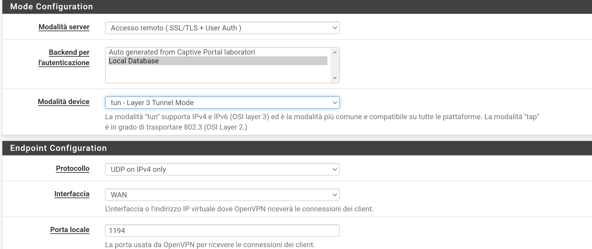

>[Torna a vpn](ethvpn.md)

- [Dettaglio architettura Ethernet](archeth.md)
- [Dettaglio architettura Zigbee](archzigbee.md)
- [Dettaglio architettura BLE](archble.md)
- [Dettaglio architettura WiFi infrastruttura](archwifi.md)
- [Dettaglio architettura WiFi mesh](archmesh.md) 
- [Dettaglio architettura LoraWAN](lorawanclasses.md) 

# **VPN di reti Ethernet** 

In una configurazione VPN IPsec tra due router Cisco, l'indirizzo IP privato del tunnel (indirizzo di overlay) non è visibile o configurato esplicitamente come si farebbe con una VPN basata su interfaccia virtuale (come GRE o VTI). Invece, la VPN IPsec incapsula il traffico tra le due subnet locali direttamente.

## **Configurazione servizio Open VPN su Pfsense**

## **Configurazione protocollo trasporto**

In questa fase vengono impostati:
- il **tipo di tunnel**, si può scegliere tra:
    - **tun**: crea una interfacccia L3, cioè il protocollo di trasporto è l'**IP**
    - **tap**: crea una interfacccia L2, cioè il protocollo di trasporto è il **MAC**
- l'**indirizzo** dell'interfaccia pubblica, cioè l'**IP pubblico** della **destinazione** a cui si collegheraà il client VPN
- il **tipo** (TCP o UDP) e il **numero di porta**. Di default sono **UDP** e **1194** ma possono anche esssere modificati a piacimento in TCP e in un qualsiasi altro numero di porta

## **Configurazione del protocollo passeggero**

In questa fase vengono impostati:
- la **subnet di accesso** comune a tutti i client VPN che si connettono (anche contemporaneamente). Questa è la rete virtuale IPv4 utilizzata per le comunicazioni private tra questo server e gli host client espressi utilizzando la notazione CIDR (ad esempio 10.0.8.0/24). Il primo indirizzo utilizzabile nella rete verrà assegnato all'interfaccia virtuale del server. I rimanenti indirizzi utilizzabili verranno assegnati ai client in connessione
- **Elenco delle subnet** della rete del server che saranno accessibili dal client VPN.

img src="img/openvpn_passeggero.png" alt="alt text" width="1100">

Specifica il metodo utilizzato per fornire un indirizzo IP dell'adattatore virtuale ai client quando si utilizza la modalità TUN su IPv4.

Sitografia:
