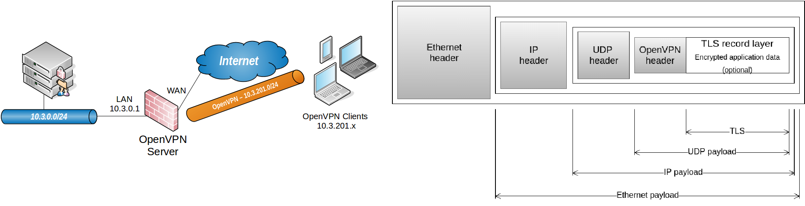
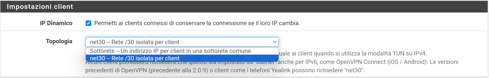
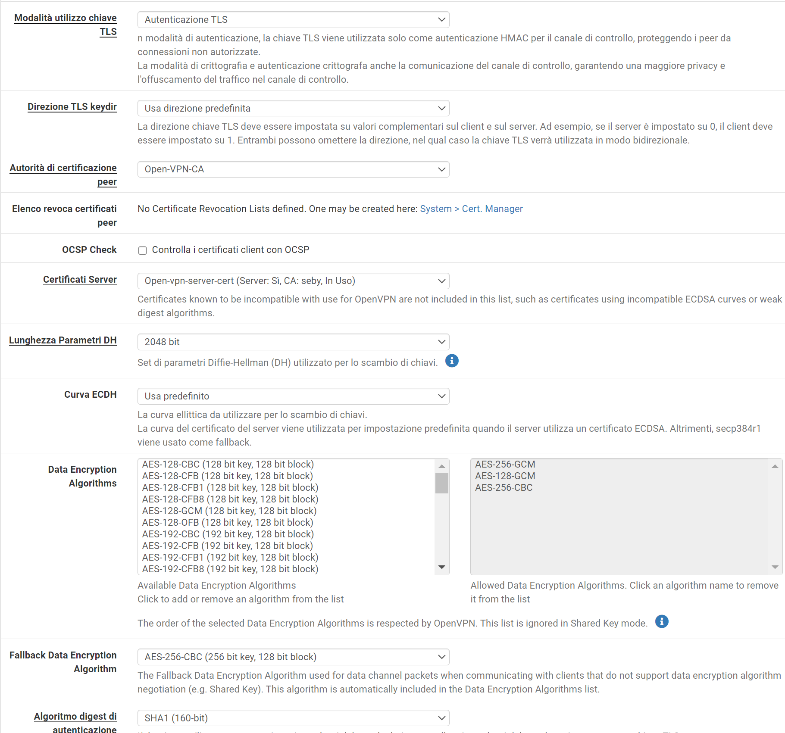

>[Torna a vpn](ethvpn.md)

- [Dettaglio architettura Ethernet](archeth.md)
- [Dettaglio architettura Zigbee](archzigbee.md)
- [Dettaglio architettura BLE](archble.md)
- [Dettaglio architettura WiFi infrastruttura](archwifi.md)
- [Dettaglio architettura WiFi mesh](archmesh.md) 
- [Dettaglio architettura LoraWAN](lorawanclasses.md) 

# **Configurazione servizio Open VPN su Pfsense**



Questo esempio mostra la configurazione della una VPN Home to Site OpenVPN installata sul firewall commerciale Pfsense.

## **Configurazione protocollo trasporto**


In questa fase vengono impostati:
- il **tipo di tunnel**, si può scegliere tra:
    - **tun**: crea una interfacccia L3, cioè il protocollo **passeggero** è l'**IP**
    - **tap**: crea una interfacccia L2, cioè il protocollo **passeggero** è il **MAC**
- l'**indirizzo** dell'interfaccia pubblica, cioè l'**IP pubblico** della **destinazione** a cui si collegherà il client VPN. Il protocollo di **trasporto** è l'IP con indirizzo pubblico di router/server VPN e client VPN (router di casa).
- il **tipo** (TCP o UDP) e il **numero di porta**. Di default sono **UDP** e **1194** ma possono anche esssere modificati a piacimento in TCP e in un qualsiasi altro numero di porta
- il protocollo **carrier** è, ovviamente, **OpenVPN** che introduce un proprio header tra l'intestazione di trasporto  e quella del protocollo passeggero.

## **Configurazione del protocollo passeggero**


In questa fase vengono impostati:
- la **subnet di accesso** comune a tutti i client VPN che si connettono (anche contemporaneamente). Questa è la rete virtuale IPv4 utilizzata per le comunicazioni private tra questo server e gli host client espressi utilizzando la notazione CIDR (ad esempio 10.0.8.0/24). Il primo indirizzo utilizzabile nella rete verrà assegnato all'interfaccia virtuale del server. I rimanenti indirizzi utilizzabili verranno assegnati ai client in connessione
- **Elenco delle subnet** della rete del server che saranno accessibili dal client VPN.



Specifica il metodo utilizzato per fornire un indirizzo IP dell'adattatore virtuale ai client quando si utilizza la modalità TUN su IPv4.

La subnet di accesso può essere partizionata:
- mediante **subnetting automatico**, in tante **subnets /30** punto-punto, allocata dinamicamente a ciascun client che man mano si collega al server. E' la modalità che garantisce maggior isolamento in quanto i vari client non si vedono.
- utilizzando una **subnet comune** non partizionata, assegnando dinamicamente il primo indirizzo libero ad ogni client VPN che man mano si connette al server. E' la modalità che garantisce minor isolamento in quanto i vari client si vedono tra loro.
  
## **Configurazione della crittogfrafia**



## **Informazioni di configurazione e test**

### **Parametri interfaccia Tun**

I parametri dell'interfaccia Tun del PC si possono recuperare con il comando ```ipconfig``` (oppure ```ifconfig``` su macchine Linux) 

``` C++
C:\Users\me>ipconfig /all

Scheda sconosciuta OpenVPN Wintun:

   Suffisso DNS specifico per connessione:
   Descrizione . . . . . . . . . . . . . : Wintun Userspace Tunnel
   Indirizzo fisico. . . . . . . . . . . :
   DHCP abilitato. . . . . . . . . . . . : No
   Configurazione automatica abilitata   : Sì
   Indirizzo IPv6 locale rispetto al collegamento . : fe80::3d2b:be72:4201:26ac%7(Preferenziale)
   Indirizzo IPv4. . . . . . . . . . . . : 10.29.2.2(Preferenziale)
   Subnet mask . . . . . . . . . . . . . : 255.255.255.0
   Gateway predefinito . . . . . . . . . :
   Server DNS . . . . . . . . . . . . .  : 10.12.0.25
                                           10.12.0.26
   NetBIOS su TCP/IP . . . . . . . . . . : Attivato

Scheda LAN wireless Wi-Fi:

   Suffisso DNS specifico per connessione:
   Descrizione . . . . . . . . . . . . . : Intel(R) Wi-Fi 6 AX201 160MHz
   Indirizzo fisico. . . . . . . . . . . : 04-6C-59-C3-34-44
   DHCP abilitato. . . . . . . . . . . . : Sì
   Configurazione automatica abilitata   : Sì
   Indirizzo IPv6 locale rispetto al collegamento . : fe80::cc93:91f1:19ed:2560%18(Preferenziale)
   Indirizzo IPv4. . . . . . . . . . . . : 192.168.10.187(Preferenziale)
   Subnet mask . . . . . . . . . . . . . : 255.255.255.0
   Lease ottenuto. . . . . . . . . . . . : sabato 6 luglio 2024 00:37:29
   Scadenza lease . . . . . . . . . . .  : domenica 7 luglio 2024 09:02:43
   Gateway predefinito . . . . . . . . . : 192.168.10.1
   Server DHCP . . . . . . . . . . . . . : 192.168.10.1
   IAID DHCPv6 . . . . . . . . . . . : 151284825
   DUID Client DHCPv6. . . . . . . . : 00-01-00-01-2B-B7-6A-EB-04-6C-59-C3-34-44
   Server DNS . . . . . . . . . . . . .  : 192.168.10.1
   NetBIOS su TCP/IP . . . . . . . . . . : Attivato
```
Si notino:
- l'**assenza** del'impostazione **gateway predefinito** nell'**interfaccia Tun**. Il **gateway di default** in un sistema di rete (router o PC) è **unico** per tutte le interfacce, circostanza che permette di attribuirlo solamente ad una di esse. Nello specifico, è possibile impostare **alternativamente** un **gateway locale** su una interfaccia LAN locale (la scheda wireless) oppure un **gateway remoto** su una interfaccia tunnel (OpenVPN Wintun).
- la **presenza** dell'impostazione **gateway predefinito** nell'**interfaccia locale** wireless (LAN locale). Significa che il sistema va in **Internet** con la **connessione locale** e non con quella remota.
- la presenza di un server DNS per il traffico su questa interfaccia, ovvero per **risolvere** gli indirizzi della rete **remota**. In realtà, il sistema client organizza i server DNS sulle varie interfacce secondo una **metrica** che ne sancisce un ordine di priorità nella scelta da parte del SO. Il risultato è che, quando la connessione VPN è **attiva**, il **server DNS remoto** ha priorità maggiore e tutte le richieste DNS sono risolte da lui.
- l'indirizzo 10.29.2.2 dell'**endpoint** locale della **dorsale virtuale** verso la **rete remota**. 

### **Tabella di routing del PC**
I dettagli della tabella di routing del PC si possono recuperare con il comando ```route print``` (oppure ```ip route``` o ```netstat -rn``` su macchine Linux).

Normalmente un PC non fa routing tra le sue interfacce fisiche, ma esegue comunque il routing tra lo stack TCP/IP del sistema, agganciato all'**interfaccia di loopback**, e le interfacce fisiche. 

In ogni caso, ci sta una **tabella di routing** che deve avere il **default gateway** del sistema nella **rotta di deafault** verso 0.0.0.0 0.0.0.0 ed è, in questo caso, l'indirizzo del **router di confine** della **LAN locale**.

``` C++
C:\Users\me>route print
===========================================================================
Elenco interfacce
  7...........................Wintun Userspace Tunnel
 16...00 ff 95 d7 fa 38 ......TAP-Windows Adapter V9
 20...04 6c 59 c3 34 45 ......Microsoft Wi-Fi Direct Virtual Adapter
  6...06 6c 59 c3 34 44 ......Microsoft Wi-Fi Direct Virtual Adapter #2
 18...04 6c 59 c3 34 44 ......Intel(R) Wi-Fi 6 AX201 160MHz
  5...04 6c 59 c3 34 48 ......Bluetooth Device (Personal Area Network)
  1...........................Software Loopback Interface 1
===========================================================================

IPv4 Tabella route
===========================================================================
Route attive:
     Indirizzo rete             Mask          Gateway     Interfaccia Metrica
          0.0.0.0          0.0.0.0     192.168.10.1   192.168.10.187     50
         10.0.0.0      255.128.0.0        10.29.2.1        10.29.2.2    261
        10.29.2.0    255.255.255.0         On-link         10.29.2.2    261
        10.29.2.2  255.255.255.255         On-link         10.29.2.2    261
      10.29.2.255  255.255.255.255         On-link         10.29.2.2    261
        127.0.0.0        255.0.0.0         On-link         127.0.0.1    331
        127.0.0.1  255.255.255.255         On-link         127.0.0.1    331
  127.255.255.255  255.255.255.255         On-link         127.0.0.1    331
       172.16.1.0    255.255.255.0        10.29.2.1        10.29.2.2    261
      192.168.2.0    255.255.255.0        10.29.2.1        10.29.2.2    261
      192.168.3.0    255.255.255.0        10.29.2.1        10.29.2.2    261
     192.168.10.0    255.255.255.0         On-link    192.168.10.187    306
   192.168.10.187  255.255.255.255         On-link    192.168.10.187    306
   192.168.10.255  255.255.255.255         On-link    192.168.10.187    306
        224.0.0.0        240.0.0.0         On-link         127.0.0.1    331
        224.0.0.0        240.0.0.0         On-link         10.29.2.2    261
        224.0.0.0        240.0.0.0         On-link    192.168.10.187    306
  255.255.255.255  255.255.255.255         On-link         127.0.0.1    331
  255.255.255.255  255.255.255.255         On-link         10.29.2.2    261
  255.255.255.255  255.255.255.255         On-link    192.168.10.187    306
===========================================================================
Route permanenti:
  Nessuna
```
Si notino:
- la **rotta di default** locale verso il router di confine del PC:  ```0.0.0.0   0.0.0.0   192.168.10.1   192.168.10.187     50```
- la **rotta** con il **next hop** 10.29.2.1 verso la **subnet della sede remota** 10.0.0.0/9 attraverso l'**interfaccia** 10.29.2.2 (quella del tunnel Tun):  ```10.0.0.0      255.128.0.0        10.29.2.1        10.29.2.2    261```
- la rotta verso la subnet **direttamente connessa** (senza next hop) della **dorsale virtuale** attraverso l'interfaccia 10.29.2.2 (quella del tunnel Tun):  ```10.29.2.0    255.255.255.0    On-link     10.29.2.2    261```

Sitografia:
- https://docs.netgate.com/pfsense/en/latest/vpn/openvpn/index.html
- https://docs.netgate.com/pfsense/en/latest/recipes/openvpn-ra.html
