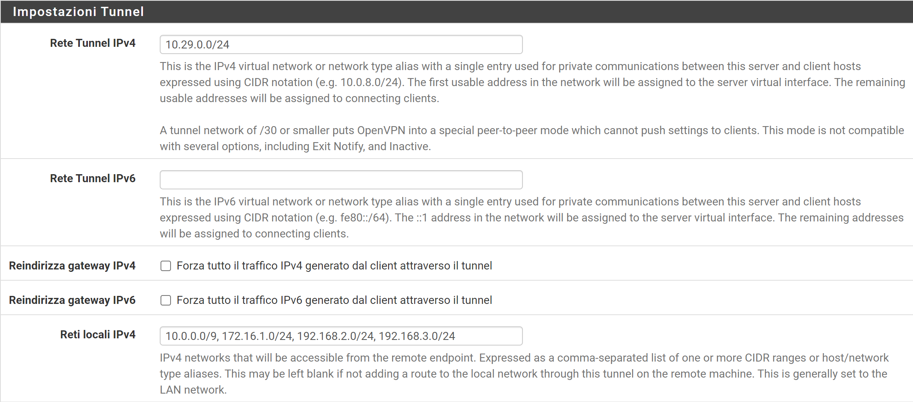

>[Torna a vpn](ethvpn.md)

- [Dettaglio architettura Ethernet](archeth.md)
- [Dettaglio architettura Zigbee](archzigbee.md)
- [Dettaglio architettura BLE](archble.md)
- [Dettaglio architettura WiFi infrastruttura](archwifi.md)
- [Dettaglio architettura WiFi mesh](archmesh.md) 
- [Dettaglio architettura LoraWAN](lorawanclasses.md) 

# **Configurazione servizio Open VPN su Pfsense**

Questo esempio mostra la configurazione della una VPN Home to Site OpenVPN installata sul firewall commerciale Pfsense.

## **Configurazione protocollo trasporto**

In questa fase vengono impostati:
- il **tipo di tunnel**, si può scegliere tra:
    - **tun**: crea una interfacccia L3, cioè il protocollo di trasporto è l'**IP**
    - **tap**: crea una interfacccia L2, cioè il protocollo di trasporto è il **MAC**
- l'**indirizzo** dell'interfaccia pubblica, cioè l'**IP pubblico** della **destinazione** a cui si collegheraà il client VPN
- il **tipo** (TCP o UDP) e il **numero di porta**. Di default sono **UDP** e **1194** ma possono anche esssere modificati a piacimento in TCP e in un qualsiasi altro numero di porta

## **Configurazione del protocollo passeggero**

In questa fase vengono impostati:
- la **subnet di accesso** comune a tutti i client VPN che si connettono (anche contemporaneamente). Questa è la rete virtuale IPv4 utilizzata per le comunicazioni private tra questo server e gli host client espressi utilizzando la notazione CIDR (ad esempio 10.0.8.0/24). Il primo indirizzo utilizzabile nella rete verrà assegnato all'interfaccia virtuale del server. I rimanenti indirizzi utilizzabili verranno assegnati ai client in connessione
- **Elenco delle subnet** della rete del server che saranno accessibili dal client VPN.

Specifica il metodo utilizzato per fornire un indirizzo IP dell'adattatore virtuale ai client quando si utilizza la modalità TUN su IPv4.

La subnet di accesso può essere partizionata:
- mediante subnetting automatico, in tante subnet /30 punto-punto, allocata dinamicamente a ciascun client che man mano si collega al server. E' la modalità che garantisce maggior isolamento in quanto i vari client non si vedono.
- utilizzando una subnet comune non partizinata assegnando dinamicamente il primo indirizzo libero ad ogni client VPN che man mano si connette al server. E' la modalità che garantisce minor isolamento in quanto i vari client si vedono tra loro.
  
## **Configurazione della crittogfrafia**

Sitografia:
- https://docs.netgate.com/pfsense/en/latest/vpn/openvpn/index.html
- https://docs.netgate.com/pfsense/en/latest/recipes/openvpn-ra.html
