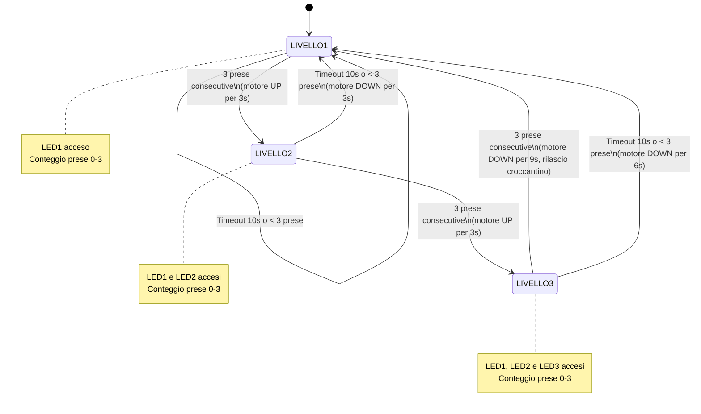

>[Torna all'indice generale](indexstatifiniti.md)

# **PALESTRA PER CANI**

 Realizzare una palestra per cani che funzioni in questo modo:
- un osso da mordere viene portato ad una certa altezza tramite un motore che agisce per 5 secondi. 
- il cane salta, afferra l'oggetto con i denti e fa scattare un interruttore (con memoria) che conta le prese.
- dopo tre prese con successo consecutive l'osso viene fatto salire di una altezza corrispondente ad altri 5 secondi
- il processo ricomincia fino a 3 step consecutivi, cioè 15 secondi complessivi.
- dopo l'osso scende ad un'altezza di 5 secondi e viene rilasciato un croccantino.
- tre led diversi (giallo, rosso e verde) indicano le tre altezze, un led indica i croccantini pronti.
- se entro dieci secondi il cane non  effettua un tentativo, si da per scontato che rinuncia e si riparte, 
  col conteggio delle prese azzerato, dal livello più basso.

## Tabella di Transizione della Lampada Intelligente

# Tabella di Transizione Semplificata della Palestra per Cani

Questa tabella segue l'approccio "prima ingressi, poi stati" con transizioni dirette tra i livelli, considerando i movimenti del motore come ritardi nelle transizioni piuttosto che stati separati.

## Ingresso: Pulsante premuto e rilasciato

| Stato attuale | Conteggio prese | Stato prossimo | Azione | Output |
|---------------|-----------------|----------------|--------|--------|
| LIVELLO1 | count < 2 | LIVELLO1 | count++, reset timer | LED1 rimane acceso |
| LIVELLO1 | count = 2 | LIVELLO2 | count=0, attiva motore UP per 3s, level=2 | LED1 acceso, poi LED1+LED2 accesi dopo 3s |
| LIVELLO2 | count < 2 | LIVELLO2 | count++, reset timer | LED1 e LED2 rimangono accesi |
| LIVELLO2 | count = 2 | LIVELLO3 | count=0, attiva motore UP per 3s, level=3 | LED1+LED2 accesi, poi LED1+LED2+LED3 accesi dopo 3s |
| LIVELLO3 | count < 2 | LIVELLO3 | count++, reset timer | LED1, LED2 e LED3 rimangono accesi |
| LIVELLO3 | count = 2 | LIVELLO1 | count=0, attiva motore DOWN per 9s, rilascia croccantino, level=1 | LED1+LED2+LED3 accesi, poi LED1 acceso dopo 9s |

## Ingresso: Timeout (t1.get() > 10000)

| Stato attuale | Stato prossimo | Azione | Output |
|---------------|----------------|--------|--------|
| LIVELLO1 | LIVELLO1 | count=0, reset timer | LED1 rimane acceso |
| LIVELLO2 | LIVELLO1 | count=0, attiva motore DOWN per 3s, level=1 | LED1+LED2 accesi, poi LED1 acceso dopo 3s |
| LIVELLO3 | LIVELLO1 | count=0, attiva motore DOWN per 6s, level=1 | LED1+LED2+LED3 accesi, poi LED1 acceso dopo 6s |

## Variabili di stato principali
- `level`: Livello attuale (1-3)
- `count`: Conteggio delle prese consecutive (0-3)
- `t1`: Timer che monitora l'inattività

## Ingressi
- **Pulsante premuto e rilasciato**: Rilevato tramite digitalRead(pulsante1) e waitUntilInputLow()
- **Timeout**: Rilevato tramite t1.get() > 10000

## Uscite
- **LED di livello**: LED1, LED2, LED3 per indicare il livello attuale
- **Motore UP/DOWN**: LED_up e LED_down per indicare il movimento del motore
- **Croccantino**: Rilasciato dopo il completamento di tutti e tre i livelli

## Note
- Questa rappresentazione corrisponde meglio all'implementazione effettiva del codice che usa principalmente la variabile `level` per tenere traccia dello stato
- Il codice non implementa esplicitamente gli stati di transizione come stati separati, ma usa delay() che fungono da ritardi nell'esecuzione
- I LED di livello (1, 2, 3) vengono gestiti dalla funzione paintBar() che accende i LED in base al valore di `level`

## **Diagramma degli stati**



## **Codice Arduino**

```C++
/*
 Realizzare una palestra per cani che funzioni in questo modo:
- un osso da mordere viene portato ad una certa altezza tramite un motore che agisce per 5 secondi. 
- il cane salta, afferra l'oggetto con i denti e fa scattare un interruttore (con memoria) che conta le prese.
- dopo tre prese con successo consecutive l'osso viene fatto salire di una altezza corrispondente ad altri 5 secondi
- il processo ricomincia fino a 3 step consecutivi, cioè 15 secondi complessivi.
- dopo l'osso scende ad un'altezza di 5 secondi e viene rilasciato un croccantino.
- tre led diversi (giallo, rosso e verde) indicano le tre altezze, un led indica i croccantini pronti.
- se entro dieci secondi il cane non  effettua un tentativo, si da per scontato che rinuncia e si riparte, 
  col conteggio delle prese azzerato, dal livello più basso.
*/
 
//##### urutils.h #####
void waitUntilInputLow(int btn, unsigned t)
{
   do{
	 delay(t);
   }while(digitalRead(btn)!=LOW);
}

struct DiffTimer {
	unsigned long elapsed, last;
	bool timerstate=false;
	byte state = 0;
	byte count = 0;
	void reset(){
		elapsed = 0;
		last = millis();
	}
	void toggle(){
		if(timerstate){
    	    stop();
		}else{
			start();
		}	
	}
	void stop(){
		if(timerstate){
			timerstate = false;
    	    elapsed += millis() - last;
		}	
	}
	void start(){
		if(!timerstate){
			timerstate = true;
			last = millis();
		}
	}
	unsigned long get(){
		if(timerstate){
			return millis() - last + elapsed;
		}
		return elapsed;
	}
	void set(unsigned long e){
		reset();
		elapsed = e;
	}
};
//##### urutils.h #####
int led_1=13; 	// indicatore di livello 1
int led_2=12; 	// indicatore di livello 2
int led_3=4; 	// indicatore di livello 3
int led_up=5;    // indicatore di motore up
int led_down=3;    // indicatore di motore down
int pulsante1=2; // sensore di transito (in ingresso o in uscita)
uint8_t count = 0; // contatore dei soggiorni
uint8_t level = 0;
DiffTimer t1;
int ledPins[3] = {led_1, led_2, led_3};

void blink(int led) {
  digitalWrite(led, !digitalRead(led));
}

void paintBar(int ledLevel){
 for (int thisLed = 0; thisLed <= 3; thisLed++) {
   if (thisLed < ledLevel) {
     digitalWrite(ledPins[thisLed], HIGH);
   } else {
     digitalWrite(ledPins[thisLed], LOW);
   }
 }
}

void setup(){
  pinMode(pulsante1, INPUT);
  pinMode(led_1, OUTPUT); // indicatore di erogazione
  pinMode(led_2, OUTPUT); // indicatore di accensione/spegnimento
  pinMode(led_3, OUTPUT); // indicatore di erogazione
  pinMode(led_up, OUTPUT); // indicatore di accensione/spegnimento
  pinMode(led_down, OUTPUT); // indicatore di accensione/spegnimento
  Serial.begin(115200);
  t1.start();
  level = 1;
}

void loop() {
	Serial.print("LIVELLO: ");Serial.println(level);
	paintBar(level);// accendo il giusto numero di led
	if(digitalRead(pulsante1) == HIGH){
		waitUntilInputLow(pulsante1, 50);
		count++;
		Serial.print("Osso preso e rilasciato: ");Serial.println(count);
		t1.reset();
		if(count >= 3){
			count = 0;
			t1.stop();// blocco il timer dei tentativi
			level++;// aumento il livello di difficoltà
			if(level <= 3){
				digitalWrite(led_down, LOW);// spengo il motore down
				digitalWrite(led_up, HIGH);// accendo il motore up
				Serial.print("up: ");Serial.println(3000);
				delay(3000);// aspetto 3 secondi
				digitalWrite(led_up, LOW);// spengo il motore up
			}else{
				digitalWrite(led_up, LOW);// spengo il motore up
				digitalWrite(led_down, HIGH);// accendo il motore down
				Serial.print("down: ");Serial.println(6000);
				delay(3000*(level-1));// aspetto 5 secondi se L2 o 10 sec se L3
				digitalWrite(led_down, LOW);// spengo il motore down
				level = 1;// ritorno al livello 1
			}
			t1.start();// riattivo il timer dei tentativi
			t1.reset();
		}
	}
	if(t1.get() > 10000){
      t1.reset();
      digitalWrite(led_up, LOW);// spengo il motore up
      digitalWrite(led_down, HIGH);// accendo il motore down
      Serial.print("down from timer: ");Serial.println(3000*(level-1));
      delay(3000*(level-1));// aspetto 5 secondi se L2 o 10 sec se L3
      digitalWrite(led_down, LOW);// spengo il motore down
      level = 1;// ritorno al livello 1
    }
    delay(10);
}


```

>[Torna all'indice generale](indexstatifiniti.md)
