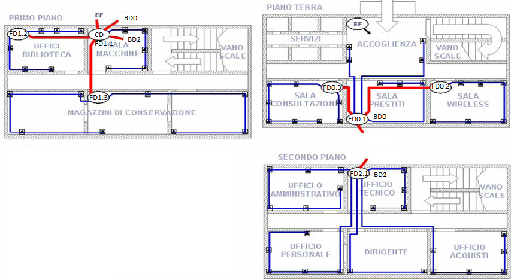

>[Torna a reti ethernet](archeth.md#documentazione)

- [Dettaglio architettura Zigbee](archzigbee.md)
- [Dettaglio architettura BLE](archble.md)
- [Dettaglio architettura WiFi infrastruttura](archwifi.md)
- [Dettaglio architettura WiFi mesh](archmesh.md) 
- [Dettaglio architettura LoraWAN](lorawanclasses.md) 

### **Planimetria con cablaggio**

Nella planimetria vanno riportate con precisione:
- Le **dimensioni lineari** (lunghezza, larghezza e altezza) degli ambienti. Per l’altezza si può considerare quella standard (3m).
- La **posizione** di ogni **armadio** con etichetta
- **Posizione** di ogni **TO** con relativa etichetta
- **Percorso** delle **canalizzazioni** sia di cablaggio orizzontale che verticale indicando la posizione (soffitto, pavimenti, parete).
- **Legenda** delle **etichette** di **armadi** e **TO** scegliendo, sostanzialmente, tra due possibili opzioni:
    - **Numerazione piatta** con numeri di presa che non si ripetono per tutto l’impianto
    - **Numerazione gerarchica** in cui il numero del TO  si può ripetere a patto che sia distinto da un diverso prefisso di FD.
- I **prefissi** strettamente necessari sono: quelli di **FD** e quelli di **BD**. Il prefisso del CD è non necessario essendo unico.
- Valgono i **vincoli** stabiliti dallo **standard** riguardo a numero di postazioni, armadi e lunghezza dei cavi.

### **Vincoli del cablaggio**

Nella definizione quantitativa dei componenti si deve tenere conto dei seguenti vincoli obbligatori previsti dallo standard:
- Una **postazione** ogni 10m2 (se non diversamente richiesto dal cliente)
- Una **postazione** è composta da una **placchetta** con almeno **due TO** RJ45 (per PC e telefono)
- Un **armadio di piano** FD ogni 1000m2
- **Lunghezza massima** del cablaggio **orizzontale** (di piano) di 90m
- **Lunghezza massima** del cablaggio di **edificio** di 500m
- **Lunghezza massima** del cablaggio di **campus** di 1500m
- **Posizione baricentrica** degli armadi (rispetto alle prese o ad altri armadi)

### **Linee guida del cablaggio in planimetria**

Nella progettazione è raccomandabile seguire alcune linee guida:
- Stabilire se il progetto riguarda un edificio già esistente o da costruire ex novo 
- Sapere se i percorsi delle canalizzazioni sono su cavedii comuni (controsoffitto o sottopavimento) o su tubazioni sulle pareti delle stanze
- Prediligere più cavi e meno armadi se le distanze sono corte, e/o vi sono poche prese e/o vi sono cavedii comuni facilmente accessibili
- Prediligere più armadi e meno cavi se le distanze sono grandi, e/o vi sono molte prese e/o vi sono cavedii perimetrali non facilmente realizzabili per molti cavi.
- Utilizzare senza remora una dorsale in fibra ottica per distanze prossime o superiori ai 100m (minori interferenze, minori attenuazioni, massimizzazione della banda). Non esistono soluzioni ideali. 
- Ogni scelta è frutto di un compromesso tra esperienza, costo e disponibilità del materiale, costo e facilità della posa.

### **Disposizione degli armadi**

Non sempre esiste un unico armadio BD (di secondo livello) per edificio, come non sempre esiste un unico armadio FD di terzo livello per ciascun piano:
- In un piano potrebbero esserci più armadi di terzo livello FD ed uno di secondo BD (piano assimilabile ad un edificio).
- In un edificio potrebbero esserci più armadi di secondo livello BD (uno per piano) ed un solo di primo livello CD.
- Spesso, per risparmiare su armadi e dispositivi attivi, un armadio ha più ruoli collassati l’uno sull’altro.

Il CD può avere tre ruoli perché da esso si possono diramare dorsali di campus (verso altri BD), di edificio (verso altri FD) e di piano (verso prese TO).
Un BD può avere due ruoli perché da esso possono diramarsi dorsali di edificio (verso altri FD) e di piano (verso prese TO).

Nell’esempio:
- Al secondo piano vi è un unico armadio di piano FD che fa anche da BD2
- Al primo piano il CD fa anche da BD1 ma anche da FD1.1 collegando delle prese TO
- Al piano terra vi è un BD0 che fa anche da FD0.1 concentrando su di se dei TO
- Il resto degli armadi fa soltando da FD perché da essi si diramano soltanto dorsali di piano (in blu) e nessuna dorsale di edificio (di secondo livello) verso altri armadi FD

### **Topologia cavi vs topologia canalizzazioni**

- La topologia dei cavi UTP è sempre a stella nelle reti di ufficio e domestiche. Nella reti industriali e ferrotranviarie è possibile anche quella a BUS.
- La topologia delle canalizzazioni è, invece:
    - A BUS o, al limite, ad anello se realizzata a parete. 
    - A stella se realizzata sotto il pavimento (oppure in un controsoffitto) lungo percorsi comuni a più stanze. Talvolta si ha l’opportunità di realizzare i cavidotti a stella (mediante corrugati) prima di gettare il calcestruzzo del pavimento in fase di costruzione (o in fase di ristrutturazione) dell’edificio.
- All’interno di una canalizzazione normalmente vi sono più cavi UTP, uno per ogni presa TO servita da quella canalizzazione.
- Le canalizzazioni vanno etichettate e la loro molteplicità massima, cioè il numero massimo di cavi che conterranno lungo tutta la loro estensione, che va stabilita in fase di progetto insieme ad una stima di massima della loro lunghezza.

- >[Torna a reti ethernet](archeth.md#documentazione)

- [Dettaglio architettura Zigbee](archzigbee.md)
- [Dettaglio architettura BLE](archble.md)
- [Dettaglio architettura WiFi infrastruttura](archwifi.md)
- [Dettaglio architettura WiFi mesh](archmesh.md) 
- [Dettaglio architettura LoraWAN](lorawanclasses.md) 
