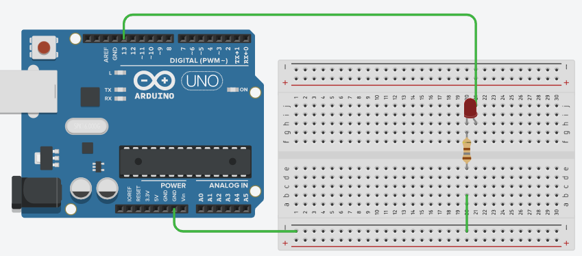
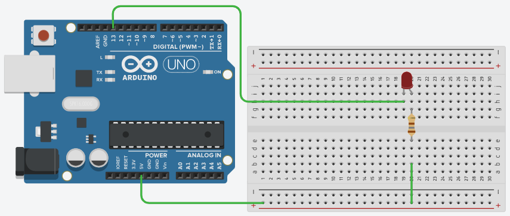

>[Torna all'indice generale](index.md)

**ACCENSIONE DI UN LED CON UN MICROCONTROLLORE**

Un LED si accende quando in esso **scorre la corrente** sufficiente per illuminarlo. La corrente necessaria è compresa tipicamente tra 10 e 20mA, il **valore** di questa corrente può essere **controllato** impostando il valore della **resistenza di polarizzazione**: resistenze più piccole determinano maggiore corrente (e maggiore luminosità), resistenze più grandi determinano minore corrente (e minore luminosità).

Mai in ogni caso andrebbe collegato un led **direttamente** alla porta, senza una resistenza di polarizzazione perché, in questo caso, la resistenza sarebbe quella di CC (corto circuito). La **resistenza di CC** è interna alla porta ed è di valore **molto basso**, così basso da poter lasciar passare una corrente tanto elevata da **danneggiare il led** (nel migliore dei casi) o la **porta** stessa (nel peggiore dei casi).

La corrente in un LED però scorre solo se questo è **opportunamente polarizzato in tensione**. In generale:

- **tensioni uguali** ai suoi capi (entrambe GND o entrambe 5V) **non** fanno scorrere la corrente

- **tensioni diverse** fanno scorrere la corrente solo se **l’anodo** è a potenziale **maggiore** del **catodo**

Per **accendere** un led con un microcontrollore:

- le **porte** del microcontrollore collegate ad un led devono essere impostate in **modo OUTPUT**.

- le **porte** del microcontrollore possono essere o **sorgente** della corrente o **pozzo** della corrente:

    - In caso di **sorgente**, la porta è analoga ad un generatore di tensione interno alla porta pari a Vcc (5V) e la corrente generata dalla porta **scorre** verso il led e si **scarica** a massa (GND). **L’anodo** del led è collegato alla **porta** mentre il **catodo** è collegato a **GND**.

    - In caso di **pozzo**, stavolta la porta è connessa a GND e la corrente **scorre** da un generatore esterno verso la porta dove si **scarica** a massa. Il **catodo** del led è collegato alla **porta** mentre **l’anodo** è collegato a al generatore **Vcc**.

Di conseguenza, i **valori delle attivazioni** dei segmenti (mediante i livelli HIGH o LOW) sono:

- **Catodo a GND (porta sorgente)**:

    - le **porte** del microcontrollore **spengono** un led se poste a livello **LOW** e lo **accendono** se poste a livello **HIGH** e in questa condizione erogano corrente (pin di sorgente)

- **Anodo a GND (porta pozzo)**:

    - **porte** del microcontrollore **spengono** un led se poste a livello **HIGH** e lo **accendono** se poste a livello **LOW** in questa condizione assorbono corrente (pin di pozzo o drain).

La situazione delle porte del microcontrollore in caso di led collegato ad **anodo a massa (GND)** può sembrare, dal punto di vista elettrico, abbastanza insolita. In questo caso la corrente scorre quando **l’anodo** del segmento va a potenziale +5V (**esterno**, ad es. una batteria) mentre la **porta** è posta a un potenziale di GND (**interno**, ottenuto impostandola col livello logico **LOW**). La porta in questo caso, pur essendo in modo OUTPUT, assorbe la corrente del led dirottandola verso GND (massa). 

Si tratta di una modalità di funzionamento speciale non sempre pienamente supportata da tutti i dispositivi che è detta modo DRAIN (scarico) o anche modalità DRAIN (pozzo). Si contrappone al modo usuale delle porte poste a livello logico alto che sono, di fatto, assimilabili a un **generatore di tensione,** internamente posto a +5V, che eroga corrente verso GND (o un qualunque potenziale più basso della porta). In genere la **corrente massima** assorbibile in modo DRAIN **è minore** di quella massima erogabile quando la porta è posta in modo generatore di tensione.

**Polarizzazione con catodo a massa.**

**Polarizzazione con anodo a massa.**

>[Torna all'indice generale](index.md)
<!--stackedit_data:
eyJoaXN0b3J5IjpbMTM3NzYzOTU4NF19
-->
