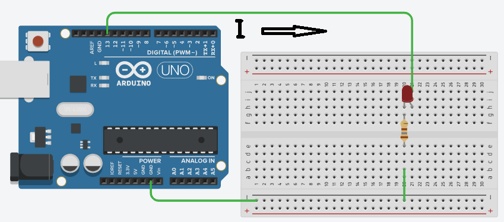
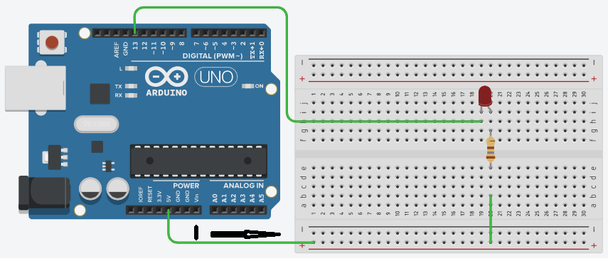

>[Torna all'indice generale](index.md)

**ACCENSIONE DI UN LED CON UN MICROCONTROLLORE**

Un LED è un dispositivo **optoelettronico** che sfrutta la capacità di alcuni materiali semiconduttori di produrre fotoni attraverso un fenomeno di emissione spontanea quando attraversati da una corrente elettrica.

Un LED si accende quando in esso **scorre la corrente** sufficiente per illuminarlo. La corrente necessaria è compresa tipicamente tra 10 e 20mA, il **valore** di questa corrente può essere **controllato** impostando il valore della **resistenza di polarizzazione**: resistenze più piccole determinano maggiore corrente (e maggiore luminosità), resistenze più grandi determinano minore corrente (e minore luminosità).

Il valore con cui viene **codificato** lo stato di una **porta digitale** può essere HIGH (vale di solito 1) o LOW (vale di solito 0). L'impostazione del bit della porta ha un signicato fisico che influenza tutte le grandezze elettriche di un circuito ad esse collegato (in particolare tensione e corrente) ma imposta, **forzandola** ad un valore ben preciso, solo una di queste: la **tensione** della porta rispetto a GND.
- se la porta è in **HIGH** la tensione vale immancabilmente **Vcc Volt** (5 V per Arduino, 3.3 volt per ESP32 o ESP 8266) **indipendentemente** dalla quantità e dal verso della corrente che vi scorre attraverso.
- se la porta è in **LOW** la tensione vale immancabilmente **GND**, cioè **0 Volt** **indipendentemente** dalla quantità e dal verso della corrente che vi scorre attraverso.

Per quanto riguarda la determinazione del **verso** della **corrente** su una **porta** o su un qualsiasi **dispositivo** esterno ad essa, vale la regola che la corrente va sempre dal punto a potenziale (voltaggio) più alto a quello a potenziale più basso. In altre parole, il **verso** della corrente tra due punti è dato dal **segno** della differenza di potenziale tra quei punti. 

Per quanto riguarda il calcolo del **valore** esatto della **corrente ai capi** di un dispositivo basta rifarsi alla **caratteristica tensione-corrente** dello stesso che è riconducibile alla **legge di Ohm** per le **resistenze** ma ha leggi più complesse per i dispositivi **non lineari** come i **diodi led**.

Mai in ogni caso andrebbe collegato un led **direttamente** alla porta, senza una resistenza di polarizzazione perché, in questo caso, la resistenza sarebbe quella di CC (corto circuito). La **resistenza di CC** è interna alla porta ed è di valore **molto basso**, così basso da poter lasciar passare una corrente tanto elevata da **danneggiare il led** (nel migliore dei casi) o la **porta** stessa (nel peggiore dei casi).

La corrente in un LED però scorre solo se questo è **opportunamente polarizzato in tensione**. In generale:

- **tensioni uguali** ai suoi capi (entrambe GND o entrambe 5V) **non** fanno scorrere la corrente

- **tensioni diverse** fanno scorrere la corrente solo se **l’anodo** è a potenziale **maggiore** del **catodo**

Per **accendere** un led con un microcontrollore:

- le **porte** del microcontrollore collegate ad un led devono essere impostate in **modo OUTPUT**.

- le **porte** del microcontrollore possono essere o **sorgente** della corrente o **drain** (scarico) della corrente:

    - In caso di **sorgente**, la porta è analoga ad un generatore di tensione **interno** alla porta pari a Vcc (5V) e la corrente generata dalla porta **scorre** verso il led e si **scarica** su una massa (GND) **esterna**. **L’anodo** del led è collegato alla **porta** mentre il **catodo** è collegato a **GND**. E' la modalità più comune.

    - In caso di **drain**, stavolta la porta è connessa a GND e la corrente **scorre** da un generatore di tensione **esterno** verso la porta dove si **scarica** su una massa **interna** alla porta. Il **catodo** del led è collegato alla **porta** mentre **l’anodo** è collegato a al generatore **Vcc**. E' una modlaità meno usuale.

Di conseguenza, i **valori delle attivazioni** dei segmenti (mediante i livelli HIGH o LOW) sono:

- **Catodo a GND (porta sorgente)**:

    - le **porte** del microcontrollore **spengono** un led se poste a livello **LOW** e lo **accendono** se poste a livello **HIGH** e in questa condizione erogano corrente (pin di sorgente)

- **Anodo a GND (porta pozzo)**:

    - le **porte** del microcontrollore **spengono** un led se poste a livello **HIGH** e lo **accendono** se poste a livello **LOW** in questa condizione assorbono corrente (pin di pozzo o drain).

La situazione delle porte del microcontrollore in caso di led collegato ad **anodo a massa (GND)** può sembrare, dal punto di vista elettrico, abbastanza insolita. In questo caso la corrente scorre quando **l’anodo** del segmento va a potenziale +5V (**esterno**, ad es. una batteria) mentre la **porta** è posta a un potenziale di GND (**interno**, ottenuto impostandola col livello logico **LOW**). La porta in questo caso, pur essendo in modo OUTPUT, assorbe la corrente del led dirottandola verso GND (massa). 

Si tratta di una modalità di funzionamento speciale non sempre pienamente supportata da tutti i dispositivi che è detta **modo DRAIN** (scarico). 
In genere la **corrente massima** assorbibile in modo DRAIN **è minore** di quella massima erogabile quando la porta è posta in modo generatore di tensione.

**Polarizzazione con catodo a massa.**

**Polarizzazione con anodo a massa.**

### **Sitografia:**
- https://it.wikipedia.org/wiki/LED

>[Torna all'indice generale](index.md)
<!--stackedit_data:
eyJoaXN0b3J5IjpbMTM3NzYzOTU4NF19
-->
