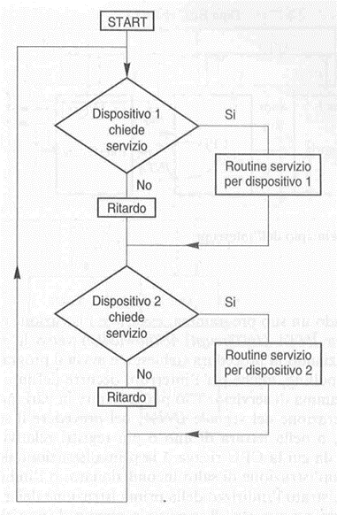

>[Torna all'indice generale](index.md)

## **Polling**

Nel controllo da programma (polling), la CPU interroga periodicamente la porta della periferica di interesse, in modo da tenere sotto controllo lo stato della stessa. Quando la periferica è disponibile a ricevere o trasmettere un dato, la CPU esegue le istruzioni necessarie.  Questo approccio risulta assai poco efficiente, comportando un grosso spreco di tempo da parte della CPU. Ha il vantaggio di non richiedere hardware dedicato.  La gestione delle periferiche è SINCRONA al programma. Ossia è il programmatore a decidere quando servire la periferica. E’ una tecnica adatta alla lettura periodica di dati forniti da sensori da tenere costantemente sotto controllo (ad esempio un termostato per comandare una valvola).

Riassumendo. La tecnica del polling consiste nell’interrogazione periodica delle periferiche da svolgere a margine (dopo di) di ogni attività, compito o programma principale svolto dalla CPU. Grosso svantaggio, il programma principale deve occuparsi di interrogare direttamente le periferiche, oltre a svolgere i compiti a lui assegnati.

>[Torna all'indice generale](index.md)
