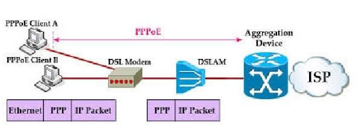
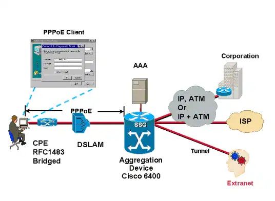
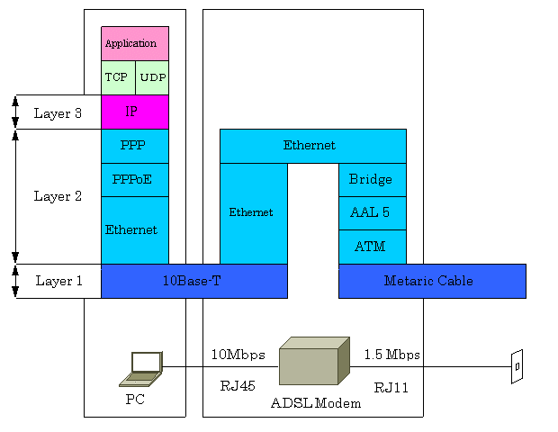

>[Torna a vpn](ethvpn.md)

- [Dettaglio architettura Ethernet](archeth.md)
- [Dettaglio architettura Zigbee](archzigbee.md)
- [Dettaglio architettura BLE](archble.md)
- [Dettaglio architettura WiFi infrastruttura](archwifi.md)
- [Dettaglio architettura WiFi mesh](archmesh.md) 
- [Dettaglio architettura LoraWAN](lorawanclasses.md) 

# **Tunnel PPPoE** 

PPPoE (Point-to-Point Protocol over Ethernet) è un protocollo di rete che incapsula i frame PPP (Point-to-Point Protocol) all'interno di frame Ethernet. Questo permette agli ISP di utilizzare il protocollo PPP per gestire connessioni a larga banda su reti Ethernet. PPPoE è comunemente utilizzato nelle connessioni DSL. 



I **pacchetti IP** viaggiano incapsulati dentro trame PPP per tutta la tratta dall'utente alla centrale. Però mentre a **monte del modem** le trame PPP viaggiano in tunnel **incapsulate** dentro trame MAC, dopo, a **valle del modem**, queste viaggiano **da sole** fino al modem in centrale.   



Un protocollo di trasporto a **valle del modem** non è necessario, in quanto sono le stesse **trame PPP** a trasportare i pacchetti IP payload fino al primo router di confine. Da li in poi, le **trame PPP** viaggiano incapsulate all'interno delle **trame MAC** della **rete carrier** che realizza la **connessione di trasporto** fino al nodo in cui avviene lo **sbustamento** del pacchetto IP **payload**, che può trovarsi nella sede di un **ISP** regionale, in una **extranet** di un fornitore, oppure in una **sede remota** della stessa azienda che ha iniziato il **tunnel** mediante un **client PPPoE**.



A differenza dell'incapsulamento, il tunneling consente a un protocollo di **livello inferiore**, o a un protocollo dello **stesso livello**, di essere trasportato attraverso il tunnel. Un'**interfaccia** tunnel è un'**interfaccia virtuale** (o logica). 

Il **tunneling** è costituito da **tre componenti** principali:

- **Protocollo passeggero**: il protocollo che si sta incapsulando. In questo caso è il protocollo IP.
- **Protocollo carrier** (operatore): il protocollo che esegue l'incapsulamento. In questo caso è il protocollo PPP.
- **Protocollo di trasporto**: Il protocollo utilizzato per trasportare il protocollo incapsulato. In questo caso è il protocollo MAC.


## **Esempio di Configurazione PPPoE su un Router Cisco**

Supponiamo di voler configurare un router Cisco per connettersi a un ISP tramite PPPoE. Ecco come configurarlo:

### **Client PPPoE**

```C++
interface Ethernet0/0
 no ip address
 pppoe enable group global
 pppoe-client dial-pool-number 1
 exit

interface Dialer1
 mtu 1492
 ip address negotiated
 encapsulation ppp
 dialer pool 1
 ppp chap hostname <tuo_username>
 ppp chap password <tua_password>
 end
```

### **Server PPPoE**

```C++
bba-group pppoe global
 virtual-template 1
 sessions per-mac limit 1
 exit

interface Virtual-Template1
 mtu 1492
 ip unnumbered Loopback0
 peer default ip address pool pppoe-pool
 ppp encrypt mppe auto
 ppp authentication chap callin
 end

ip local pool pppoe-pool 192.168.1.1 192.168.1.100
```

### **Verifica del Tunnel GRE** 

Per verificare che il tunnel GRE sia operativo, puoi usare i seguenti comandi:
```C++
show interfaces Dialer1
show running-config interface Ethernet0/0
show pppoe session
show pppoe summary
show pppoe interface Virtual-Template1
```

Sitografia:
- https://www.cisco.com/c/it_it/support/docs/long-reach-ethernet-lre-digital-subscriber-line-xdsl/asymmetric-digital-subscriber-line-adsl/12915-pppoe-arch.html

>[Torna a vpn](ethvpn.md)

- [Dettaglio architettura Ethernet](archeth.md)
- [Dettaglio architettura Zigbee](archzigbee.md)
- [Dettaglio architettura BLE](archble.md)
- [Dettaglio architettura WiFi infrastruttura](archwifi.md)
- [Dettaglio architettura WiFi mesh](archmesh.md) 
- [Dettaglio architettura LoraWAN](lorawanclasses.md) 


