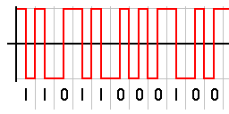
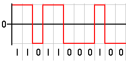
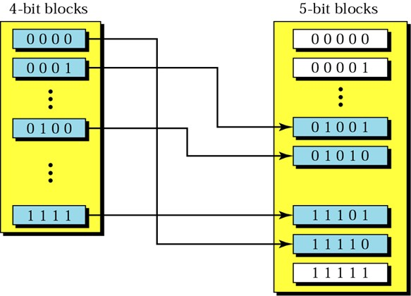
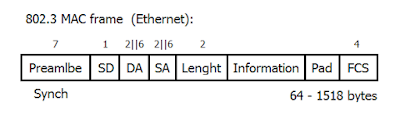
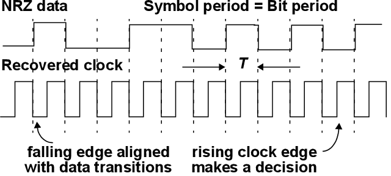
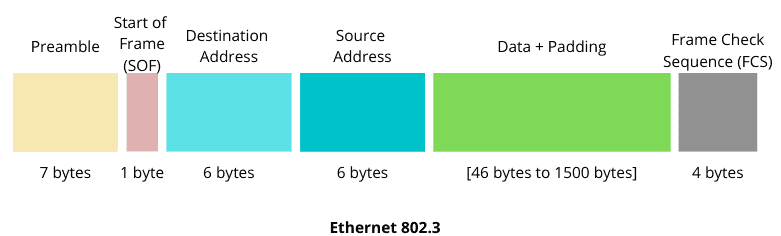
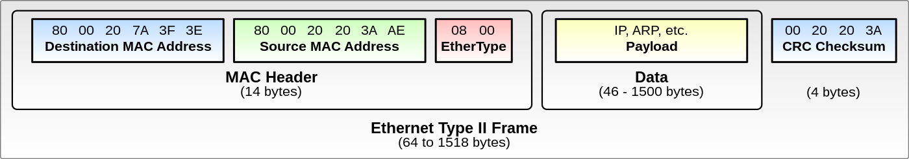
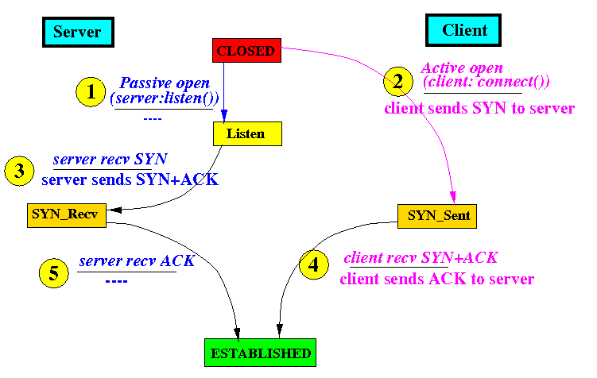

>[Torna a reti di sensori](sensornetworkshort.md#reti-di-sensori-e-attuatori)

## **Codifica di bit**

La **codifica dei bit** si esegue in **trasmissione** ed è il processo di **traduzione** di ciascun bit di un messaggio in una certa sequenza di segnali elettrici caratterizzati da proprietà fisiche stabilite da standard internazionali. Alcune di queste caratteristiche sono forma, ampiezza, periodo. In definitiva, è una **traduzione** da simboli (binari) in segnali elettrici.

La **decodifica dei bit** si esegue in **ricezione** ed è il processo di **traduzione** di ciascuna sequenza di segnali elettrici ricevuta in una certa sequenza di bit. In definitiva, è una **traduzione** da segnali elettrici a simboli (binari).

### **Codifica manchester**

Nelle telecomunicazioni la codifica Manchester è una forma di comunicazione dati nella quale ogni punto viene segnalato da una transizione. La codifica Manchester è considerata una codifica **auto-sincronizzante** (non necessita di un segnale di sincronia esterno), il che significa che permette un'accurata sincronizzazione del flusso dati.

### **Codifica NRZ**

Nelle telecomunicazioni, un codice di linea di non ritorno a zero (NRZ) è un codice binario in cui gli uno sono rappresentati da una condizione significativa, solitamente una tensione positiva, mentre gli zeri sono rappresentati da qualche altra condizione significativa, solitamente una tensione negativa, senza altra condizione neutra o di riposo.

A dispetto della codifca Manchester, la NRZ **non** è considerata una codfica autosincronizzante perchè **lunghe sequenze** di tutti **zero** o di tutti **uno** non presentano neppure **un fronte** per tutta la loro durata.

### **Codifica 4B5B**

Nelle telecomunicazioni, 4B5B è una forma di codice per la trasmissione di dati. 4B5B lavora mappando gruppi di 4 bit in gruppi di 5. Siccome ci sono 32 possibili combinazioni usando 5 bit e solo 16 usandone 4, i 16 gruppi di 5 bit col maggior numero di transizioni sono usati per fornire più transizioni possibili. 4B5B garantisce almeno una transizione per blocco (ingresso di 4 bit / uscita di 5) il quale permette al segnale di essere scoperto. Sfortunatamente l'uso di 5 bit per rappresentarne 4 implica che per trasmettere i dati abbiamo bisogno di una larghezza di banda più grande del 25%.

Dipendentemente dallo standard o dalle specifiche, potrebbero esserci diversi caratteri che 4B5B non usa. La presenza di uno dei caratteri "inusati" nello stream di dati può essere usato come indice di un problema nella connessione. Infatti, i caratteri non usati vengono attualmente usati per scovare gli errori negli stream di dati.

Con la codifica 4B5B vengono risolti i problemi relativi alla trasmissione di più zeri consecutivi. Le sequenze generate vengono poi trasmesse attraverso una codifica NRZI (Senza ritorno a zero invertito), che elimina anche il problema della presenza di un numero eccessivo di 1 consecutivi. Il risultato è che la codifica 4B/5B elimina ripetizioni consecutive di un numero eccessivo di valori binari tutti uguali.

## **Protocolli**

I protocolli sono **regole di comunicazione** che tutti gli **interlocutori** devono seguire per **portare avanti** la **comunicazione** su di un **canale**.
Un protocollo **definisce** il **formato** e l’**ordine dei messaggi** scambiati tra due o più entità di rete, le **azioni in risposta** ai messaggi ricevuti o **altri eventi**.
Sono valide per un **determinato canale** e si realizzano in **maniera software** (o al limite con logica digitale cablata) tramite programmi che girano sui nodi della rete.

Realizzano **algoritmi distribuiti** che comprendono:
- funzioni sui nodi della rete
- scambio di messaggi lungo i canali della rete

### **Formato messaggi**

Definisce **cosa** va comunicato, il **come** e il **quando** ciò va fatto. Gli **elementi chiave** di un protocollo sono: **sintassi**, **semantica**, **temporizzazione**.

Il **formato** è definito indicando:
- il **significato** dei vari campi. Ad esempio:
    -  **DA** rappresenta il Destination Address 
    - **SA** è il Sorce Address. 
    - Il campo **Information** rappresenta il payload, cioè il carico utile, ovvero le informazioni che il protocollo deve spostare dalla sorgente alla destinazione. 
- Tutto ciò che **sta prima** del campo paysload è l'**Header**, ovvero l'**intestazione** del messaggio detta anche **PCI (Protocol Control Information)**.
- la **lunghezza** dei vari campi, può essere:
    - **fissa**. E' misurata in byte ed è indicata con dei numeretti posti sopra il nome del campo che misurano.
    - **variabile**. Normalmente viene indicata la lunghezza minima e quella massima. Talvolta un campo aggiuntivo (**Length** in figura) è deputato proprio a contenere la lunghezza del payload 

Per **accedere** (in lettura o in scrittura) a un **determinato campo** basta sommare la lunghezza dei campi che precedono il campo da accedere per determinare il suo **spiazzamento** dall'inizio del messaggio.

### **Tipo dei messaggi**

I **messaggi** si possono **classificare in**:
- **messaggi dati**. Portano il cosidetto payload, cioè il carico utile del messaggio, ovvero l'informazione che ha valore per gli utenti utilizzano il canale (o la rete).
- **messaggi di controllo**. Informazioni di servizio che per gli utenti del canale (o della rete) non hanno alcun significato ma che sono necessari per il funzionamento dei protocolli di comunicazione in uso su quel canale.

I **messaggi** si possono **classificare in**:
- **sincroni**. Quando il ricevente sa il momento esatto in cui comincerà a riceverli perchè già stabilito in fase di apertura della comunicazione. Sono, in genere, associati a protocolli connessi in cui si adopera proprio la fase di apertura per negoziare accordi tra TX e RX che riguardano i dettagli sulla consegna dei dati, quali, per l'appunto, il tempo di trasmissione assegnato ad una certa sorgente.
- **asincroni**. Quando il ricevente non conosce il momento esatto in cui comincerà a riceverli perchè non esistono accordi in merito tra TX e RX, per cui l'inizio del messaggio deve essere segnalato. Normalmente si utilizza, per questo scopo, una particolare **sequenza di bit** stabilita dal protocollo in uso nel canale e quindi nota ad entrambi gli interlocutori.

### **Preambolo di sincronizzazione (di bit)**

I **preamboli** di un messaggio sono delle **sequenze di sincronizzazione** in grado sia di sincronizzare gli **orologi** dei dispositivi (Tx e Rx) che si accingono ad iniziare una comunicazione, ma anche di **indentificare** in maniera univoca i dispositivi che li emettono. 

La **sincronizzazione** di cui parliamo adesso è la cosidetta **sincronizzazione di bit** e serve a fare in modo che, al momento di una **transizione** (fronte) del **clock**, sia il dispositivo TX che quello RX siano posizionati esattamente sul **ventre** di un bit, cioè sul punto di mezzo del livello del bit, condizione necessaria in ricezione per ottenere la massima probabilità di **campionare** (misurare o decidere) un **bit corretto**. La sincronizzazione di bit, in sostanza, serve a fare in modo che il ricevente RX legga il bit nel punto **più stabile**, in posizione centrale rispetto ai fronti (di salita e di discesa).

Il **momento giusto** di questa misura è implicito, cioè non viene segnalato dal trasmettitore, ma deve essere **estratto** (dal ricevitore) dal flusso di bit dei dati e mantenuto almeno per tutti i **campionamenti** dei bit del **messaggio** corrente. Per il **messaggio successivo** il ricevitore recupera il sincronismo leggendo un **nuovo preambolo**.

L'**estrazione** del clock avviene **in banda**, cioè sullo stesso **canale dei dati**, attraverso il riconoscimento dei **fronti** dei **bit ricevuti**, fronti che sono sicuramente presenti, in numero **sufficiente** allo scopo, solamente durante un **preambolo di sincronizzazione**.

Tutte le tecniche di multiplazione del canale (broadcast o meno) basate sulla **ripartizione** del tempo di trasmissione tra sorgenti diverse (TDM), richiedono una **sincronizzazione di bit** elevata. Però, non tutte le tecniche richiedono la **sincronizzazione del messaggio** trasmesso tra TX e RX. L'RX non è normalmente tenuto a sapere l'esatto momento dell'arrivo del prossimo messaggio. 
- Quelle **dinamiche** (TDM dinamico, ALOHA, CSMA) consentono la trasmissione di una sequenza di bit dati in qualunque momento, tanto l'**inizio** del messaggio è segnalato da una sequenza di bit di **SOF** (Start Of Frame). Vedi [Dettaglio TDM statistico su mezzi punto-punto](tdmstatistico.md) e [Dettaglio mezzi a BUS](protocollidiaccesso.md) per approfondimenti.
- Quelle **statiche** (TDM statico), **allocano** i messaggi di stazioni trasmittenti diverse in **differenti intervalli** temporali di dimensione **fissa** detti **slot**. Ogni slot **non** possiede identificatori espliciti del messaggio (come l'indirizzo) nè del suo inizio (come lo SOF). In ricezione, un messaggio può essere riconosciuto e letto soltanto in base alla sua **posizione** all'interno di un treno prestabilito di slot, detto **trama** TDMA. Vedi [Dettaglio multiplazioni statiche](multiplazioni.md) per approfondimenti. Alcune tecniche di trasmissione includono tra una trama e l'altra TDMA dei preamboli di sincronizzazione che, in questo contesto, si chiamano **beacon**.

### **Start of frame (SOF)**

Per i protocolli in cui il messaggio è **asincrono**, cioè di cui il ricevente non conosce in anticipo il momento esatto della ricezione, l'**inizio** dello stesso deve essere segnalato in qualche modo. Lo 
 Start Of Frame (SOF) serve a realizzare il cosidetto **sincronismo di trama** (o di messaggio), cioè la proprietà per la quale trasmettirore TX e ricevitore RX concordano su quale sia il **bit di inizio** della **trama** (o del messaggio): 
- Nei **protocolli a carattere**, quali il **seriale RS232**, si è ricorso ad un **segnale di start** (transizione dal livello alto di idle a quello basso).
- Nei protocolli per le **reti di computer** si preferisce delimitare il **bordo di inizio** di un **messaggio** con una particolare sequenza di bit detta **SOF** (Start Frame delimiter) o anche **SFD** (Start Frame Delimiter). 

Il valore di SOF per IEEE 802.3 (EThernet) è 10101011. Il ricevitore esegue la **lettura continua** dei bit del canale e quando vede scorrere esattamente **quella sequenza** sa che a partire dal **bit successivo all'ultimo** dell'SOF deve cominciare a leggere un messaggio, contando i bit per identificare, isolare e leggere separatamente i **vari campi** di cui è composto il messaggio ricevuto.

### **Trama MAC**

E' il messaggio 

Una **trama Ethernet** è un pacchetto di dati che viene trasmesso su una rete Ethernet. È composta da una serie di campi che contengono informazioni cruciali per la comunicazione tra i dispositivi collegati alla rete. Ecco una panoramica dei campi principali all'interno di una trama Ethernet:
- **Preambolo**: 7 byte che precedono il campo di "Start of Frame" (SOF) e serve a sincronizzare i dispositivi riceventi con il segnale in ingresso.
- **Start of Frame Delimiter (SFD)**: 1 byte che segnalano l'inizio della trama Ethernet. Solitamente è costituito da un singolo byte con un valore specifico, ad esempio, 0x55 seguito da 0xD5.
- **Indirizzo di Destinazione (Destination Address)**: 6 byte che Indica l'indirizzo MAC del destinatario della trama.
- **Indirizzo di Sorgente (Source Address)**: 6 byte che indicano l'indirizzo MAC del mittente della trama.
- **Tipo/ Lunghezza (Type/Length)**: 2 byte che possono essere utilizzati in due modi diversi:
    - In una trama Ethernet II, questo campo specifica il tipo di protocollo dei dati (ad esempio, IPv4, IPv6, ARP).
    - In una trama IEEE 802.3, questo campo specifica la lunghezza dei dati nel campo "Data".
    - Dati (Data): Contiene il payload effettivo della trama, ovvero i dati trasportati.
- **Frame Check Sequence (FCS)**: 4 byte che realizzano un campo di controllo di errore che viene calcolato sulla base dei dati della trama e utilizzato per verificare l'integrità dei dati durante la trasmissione.
- **Inter Frame Gap (IFG)**: È una breve pausa tra l'invio di due trame consecutive. Serve a garantire che i dispositivi riceventi abbiano il tempo di elaborare la trama ricevuta prima dell'arrivo della successiva.

La struttura e il significato di questi campi possono variare leggermente a seconda dello standard Ethernet utilizzato, come ad esempio Ethernet II o IEEE 802.3.

### **Classificazione protocolli**

I protocolli si possono **classificare** in:
- connessi e non connessi
- confermati e non confermati
- con stato e senza stato

### **Protocolli connessi e non**

I **protocolli connessi** sono sempre composti da **tre fasi**: 
- **apertura** (o setup): 
    - viene iniziata la connessione da uno degli interlocutori
    - vengono negoziati i parametri della connessione
    - vengono allocate (assegnate o prenotate) le risorse trasmissive (sui nodi e sui canali)
- **Dialogo**: vengono scambiati i messaggi (PDU) seguendo le regole del protocollo
- **Chiusura**: viene chiusa la comunicazione e vengono rilasciate le risorse precedentemente allocate.

I **protocolli non connessi** sono sempre composti da **una sola fase**: 
- **Dialogo o trasmissione**: vengono scambiati i messaggi (PDU) seguendo le regole del protocollo

I **protocolli connessi** realizzano connessioni intrinsecamente più affidabili perchè presuppongono che all'altro **capo della comunicazione** ci sia sempre un interlocutore **pronto a ricevere** i messaggi, dato che essa è stata da questo esplicitamente accettata in **fase di apertura**. I protocolli connessi pongono in genere l'**enfasi** sulla **affidabilità** e sulla **correttezza** dei messaggi.

I **protocolli non orientati alla connessione** (o semplicemente detti non connessi) realizzano comunicazioni in cui il mittente si limita semplicemente a spedire i messaggi senza curarsi affatto se all'atro **capo della comunicazione** ci sia effettivamente un interlocutore pronto a riceverli. I protocolli non connessi pongono in genere l'**enfasi** sulle **prestazioni** in termini di velocità e sulla **puntualità** della consegna dei messaggi.

### **Protocolli confermati e non**

I **protocolli confermati** sono protocolli in cui il **mittente** possiede un timer, detto **timer di ritrasmissione**, impostato ad un valore massimo di conteggio detto **timeout**. Il timer viene **avviato** al momento esatto dell'invio di un messaggio e viene **resettato** al momento della ricezione di un messaggio di conferma  di corretto arrivo a destinazione.

Il messaggio di **conferma** viene detto **ack** (acknowledgement) e viene inviato **dal ricevente** in direzione del **mittente**. Un ack **è sempre inviato** dal **ricevente** di un **precedente** messaggio, **mai** dal **mittente** di quel messaggio.

Se il **timer di trasmissione** è resettato **prima** dello scadere del timeout la trasmissione è considerata **avvenuta con successo**. Se invece allo scadere del timeout ancora **non si ricevono ack** allora il messaggio viene **dato per perso** ed è, dal mittente, **ritrasmesso**.

I protocolli **non confermati** non necessitano di conferme mediate ricevute di ritorno e pertanto il tramittente **è sprovvisto del timer** che serve a questo a scopo.

### **Protocolli con stato e non**

Un protocollo si dice **stateful** cioè **con stato** quando vale una delle due situazioni che rappresentano due facce diverse di una stessa medaglia:
- un messaggio scambiato in un certo momento **è correlato** con gli altri messaggi scambiati in **precedenza**
- all'arrivo di ogni messaggio viene aggiornato **un elemento di memoria** (variabile) che **riassume** la **storia dell'evoluzione** del protocollo **nel tempo**.

Un protocollo si dice **stateless** cioè **senza stato** quando vale una dele due situazioni:
- un messaggio scambiato in un certo momento **non è correlato** con gli altri messaggi scambiati in **precedenza**
- non esiste **un elemento di memoria** (variabile) che **riassume** la **storia dell'evoluzione** del protocollo **nel tempo**.

L'elemento di memoria che tiene traccia dello stato può essere anche un **campo** all'interno del messaggio opportunamente aggiornato ad ogni nuovo invio.

L'evoluzione degli stati di un protocollo può essere rappresentato in funzione del loro **valore** e del particolare **messaggio** che è stato **ricevuto** mediante un **diagramma delle transizioni** di stato:

I **nodi** sono gli stati mentre gli **archi** rappresentano gli **stimoli** ai cambiamenti di stato, ovvero gli **ingressi**, cioè i **messaggi ricevuti**.

[Dettaglio ES/IS](isvses.md)

[Dettaglio protocolli](protocolli.md)

[Dettaglio ISO/OSI](isoosi.md)

Sitografia:
- https://sierrahardwaredesign.com/tag/ethernet/
- https://www.baeldung.com/cs/popular-network-protocols
- https://it.wikipedia.org/wiki/Codifica_Manchester
- https://stackoverflow.com/questions/44992151/how-can-i-encode-0000-to-11110-in-4b-5b-encoding-scheme
- https://it.wikipedia.org/wiki/Codifica_4B/5B
- https://it.wikipedia.org/wiki/Frame_Ethernet
- chatGPT per trama MAC

>[Torna a reti di sensori](sensornetworkshort.md#reti-di-sensori-e-attuatori)
