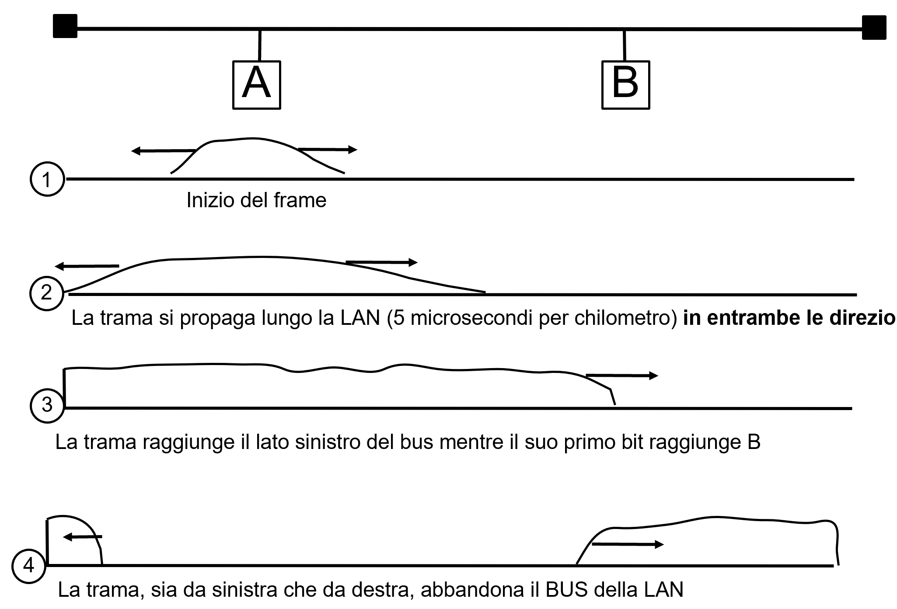

>[Torna a reti di sensori](sensornetworkshort.md#Interfaccia-radio)

## **ALOHA**

### **Fasi ALOHA**

Significa Carrier Sensing Multiple Access cioè protocollo di Accesso Multiplo con Ascolto della Portante (prima della trasmissione)

Una stazione trasmittente: 
- al momento che ha una trama pronta, aspetta finchè non “sente” il canale libero (cioè nessuno trasmette).
- Appena essa rileva il canale libero invia immediatamente la trama.
- Dopo l’invio aspetta per un certo tempo.
- Se essa riceve il messaggio di ack allora la trasmissione è avvenuta con successo.
- Altrimenti la stazione usa una strategia di backoff e invia nuovamente il pachetto dopo un tempo casuale.
- Dopo molte volte che non si ricevono conferme (acknowledgement) allora la stazione abbandona l’dea di trasmettere.


```C++
N=1;
while(N <= max){
	send(data_frame);
	waitUntil(ackOrTimeout());
	if(ack_received){
		exit while;
	}else{
		/* timeout scaduto: ritrasmissione*/
		t=random();
		wait(t);
		N=N+1;
}
/* troppi tentativi: rinuncio a trasmette
```


## **CSMA**

### **Fasi CSMA**

Significa Carrier Sensing Multiple Access cioè protocollo di Accesso Multiplo con Ascolto della Portante (prima della trasmissione)
Una stazione trasmittente: 
- al momento che ha una trama pronta, aspetta finchè non “sente” il canale libero (cioè nessuno trasmette).
- Appena essa rileva il canale libero invia immediatamente la trama.
- Dopo l’invio aspetta per un certo tempo.
- Se essa riceve il messaggio di ack allora la trasmissione è avvenuta con successo.
- Altrimenti la stazione usa una strategia di backoff e invia nuovamente il pachetto dopo un tempo casuale.
- Dopo molte volte che non si ricevono conferme (acknowledgement) allora la stazione abbandona l’dea di trasmettere.

### **Ritardo di propagazione**

Una stazione non può rilevare l’occupazione del BUS da parte di una stazione remota semplicemente ascoltando prima di trasmettere a causa di un fenomeno fisico detto ritardo di propagazione del segnale.
Il ritardo di propagazione di un segnale è il tempo finito con cui esso viaggia da una parte all’altra di un mezzo trasmissivo ed è dovuto al fatto che esso si propaga nello spazio con una velocità finita:
- Nel vuoto essa è pari alla velocità della luce cioè 300.000Km/sec
- In un conduttore metallico ha un valore inferiore pari a circa 200.000Km/sec

se due stazioni A e B trasmettono in successione separate di un tempo Δt e il tempo di propagazione tra A a B è maggiore di Δt allora, ascoltando la portante, B sente il canale libero e inizia a trasmettere il suo messaggio mentre c’è quello di A che sta per arrivare.
ciascuna stazione riterrà di essere l’unica a trasmettere sul canale fino a che la trama (corrotta dalla collisione) di A, che ha trasmesso prima, non arriverrà all’altra stazione B dopo il tempo di propagazione Δt corrispondente alla distanza tra A e B.

La rilevazione reale, da parte di una stazione, di una collisione può avvenire solo dopo l’inizio della trasmissione (o durante o alla fine).
Maggiore è la distanza tra due stazioni maggiore sarà il tempo con cui il segnale si propaga dall’una all’altra:   td = d/vP





CSMA: pseudocodice

```C++
N=1;
while(N <= max){
	waitUntil(channelFree()); 
	send(data_frame); 	
	waitUntil(ackOrTimeout()); 
	if(ack_received){ 
		exit while;
	}else{
		/* timeout scaduto: ritrasmissione*/ 	 		
		N=N+1;
	}
}
/* troppi tentativi: rinuncio a trasmettere*/	

```

### **Riassumendo ALOHA e CSMA**

Similitudini:
- Sia ALOHA che CSMA devono implementare un meccanismo di rilevazione della collisione basato su ack
- Sia ALOHA che CSMA rilevano la collisione a seguito dell’evento mancata ricezione del messaggio di ack (allo scadere di un timeout). 

Differenze:
- ALOHA trasmette senza verificare se il canale è occupato o meno.
- CSMA trasmette solo se “sente” il canale libero.
- CSMA deve implementare un meccanismo di ascolto del canale prima della trasmissione (CCA: Clear Channel Assesment).

## **CSMA/CD**

### **Fasi CSMA/CD basico**

Significa Carrier Sensing Multiple Access Collision Detection cioè protocollo di Accesso Multiplo con Ascolto della Portante (prima della trasmissione) e rilevazione della Collisione (durante la trasmissione).

Una stazione trasmittente:
- al momento che ha una trama pronta, ascolta il canale prima di trasmettere per stabilire se esso è libero o meno.
- Appena essa rileva il canale libero invia immediatamente la trama ma ascolta anche durante la trasmissione.
- L’ascolto durante la trasmissione serve a stabilire se sul canale è avvenuta o meno una collisione. 
- Se non vengono rilevati echi di collisione allora la trasmissione è avvenuta con successo.
- Altrimenti la stazione arresta la trasmissione corrente e ricomincia da zero la trasmissione della trama dopo un tempo casuale.
- Dopo molte volte che non si ricevono conferme (acknowledgement) allora la stazione abbandona l’dea di trasmettere.

### **CSMA/CD basico: pseudocodice**

Soluzione di base per il TX

```C++
N=1;
while(N <= max){
	waitUntil(channelFree());
	sendAndListen(frame);
	waitUntil(endOfFrame() or collision());
	if(collision()){
		stopTransmitting();
		send(jamming);
	}else{
		/* no collision detected */
		wait(interframe_delay);
		exit while;
	}
	N=N+1;
}
/* troppi tentativi: rinuncio!*/
```


### **Possiamo determinare tutte le collisioni?**

- Se non si ascolta evidentemente no.
- Ma si ascolta solo finchè si trasmette…


### **Soluzione: trasmissione abbastanza lunga**

- Caso peggiore: il tramittente A è ad un capo e la collisione avviene all’altro capo quando trasmette pure B.
- Per ricevere l’eco della collisione A deve continuare ad ascoltare (cioè a trasmettere) finchè la trama corrotta non si propaga da B fino a lei.


### **Come rilevare tutte le collisioni?**

Caso peggiore: il tramittente A è ad un capo e la collisione avviene all’altro capo quando trasmette pure B.

Per ricevere l’eco della collisione A deve continuare ad ascoltare (cioè a trasmettere) finchè la trama corrotta non si propaga da B fino a lei.

Il tempo di propagazione da A a B per 10Mb/sec è 25.6 µsec
Il tempo di andata da A a B e poi di ritorno ad A è detto RTT (Round Trip Time) e alla velocità di 10Mb/sec è 51.2 µsec

Soluzione  vincolo operativo: 
- ogni stazione deve ascoltare (cioè trasmettere) per un tempo minimo pari a un RTT cioè 51.2 µsec
- Se la velocità di trasmissione è fissa, la condizione sul tempo si traduce in una condizione sulla lunghezza minima della trama (nel caso di Ethernet 64 byte).
- Cioè ogni stazione deve trasmettere trame lunghe almeno 64 byte

### **Come reagire a fronte di una collisione?**

Soluzione: Backoff esponenziale
- È un tempo casuale
- È calcolato in maniera indipendente l’una dall’altra da tutte le stazioni
- Serve a determinare la stazione che deve trasmettere per prima minimizzando il rischio di trasmissioni contemporanee
- È calcolato all’interno di un intervallo (finestra) di contesa

Il tempo di Backoff si calcola in multipli interi di uno slot che è uguale ad un RTT (slot = 1 RTT) secondo la formula r = random(0, 2k – 1)*RTT
- 1ma collisione : aspetta da 0 a 1 slot
- 2da collisione : aspetta 0, 1,2 o 3 slots 
- iesima collisione : aspetta 0..2i-1 slots 

### **Finestra di contesa**

La finestra di collisione o di contesa (contention Window o CW) è l’intervallo di valori all’interno del quale viene calcolato il tempo casuale di backoff

La finestra di collisione è deterministica (cioè ha un valore non casuale) e può essere fissa o variabile, ad es: [0  2k – 1]è variabile e dipende dal numero k di tentativi andati a vuoto.

Una finestra di collisione grande minimizza la probabilità di una collisione ma aumenta il ritardo medio prima della trasmissione che, a sua volta, diminuisce la velocità media di trasmissione.

Una finestra di collisione variabile realizza un buon compromesso tecnico: quando non ci sono collisioni è piccola e il ritardo è minimo, in presenza di collisioni essa si allarga gradatamente per diminuirne la probabilità ad ogni successivo tentativo.

Il tempo di backoff è un numero casuale calcolato tra un valore minimo ed un valore massimo che  rappresentano la finestra di collisione.
Nel caso del CSMA/CD:
```C++
	        k = min(10, N); //numero di tentativi
		r = random(0, 2k – 1)*RTT; //tempo di backoff
```
### **CSMA/CD completo: pseudocodice**
```C++
N=1;
while(N<= max){
	waitUntil(channelFree());
	sendAndListen(frame);
	waitUntil(endOfFrame() or collision()); 	
	if(collision()){
		stopTransmitting();
		send(jamming);
		k = min (10, N);
		r = random(0, 2k – 1);
		wait(r*RTT);
	}else{
		/* no collision detected */
		wait(interframe_delay);
		exit while;
	}
	N=N+1;
}
/* troppi tentativi: rinuncio!*/
```

### **Fasi CSMA/CD completo**

Le altre stazioni, quando ricevono la sequenza di jamming, sono avvisate della avvenuta collisione e:
- Se ricevevano, scaricano dal buffer di ricezione quanto ricevuto fino a quell momento
- Se trasmettevano, arrestano immediatamente la trasmissione e fanno partire l’algoritmo di backoff che stabilisce il ritardo casuale prima della ritrasmissione del messaggio interrotto.


### **Riassumendo CSMA e CSMA/CD**

Similitudini:
- CSMA e CSMA/CD devono implementare un meccanismo di ascolto del canale prima della trasmissione per stabilire se esso è libero o meno. 

Differenze:
- il CSMA rileva la collisione indirettamente dopo la trasmissione in fase di ricezione, a seguito del mancato arrivo del messaggio di ack (allo scadere di un timeout), Si tratta di una tecnica SW. Trasmissione e ricezione non devono essere contemporanee.
- Il CSMA/CD durante la trasmissione mantiene attiva anche la funzione di  ricezione che può rilevare una collisione perchè:
- Il segnale “ascoltato” durante la trasmissione ha una potenza più elevata di quello effettivamente trasmesso. É una tecnica HW.
- Il segnale “ascoltato” e decodificato durante la trasmissione ha un valore in bit diverso da quello trasmesso. É una tecnica SW.

## **CSMA/CA**

Non è possibile sempre rilevare le collisioni durante la trasmissione (mezzo radio)

Miglioramento del CSMA grazie all’introduzione degli IFS (interframe space):
- Ritardo iniziale di trasmissione (EIFS) 
- Short Inter Frame Space (SIFS): ritardo tra una trama e l’invio del suo ack. È il tempo minimo per consentire ai dispositivi HW di commutare dallo stato di ricezione a qello di trasmissione.
- Distributed Inter Frame Space (DIFS): ritardo minimo tra due trame successive in trasmissione. DIFS =  SIFS  + (2 * Slot time). Serve a proteggere la trasmissione di un ack da eventuali  collisioni
 SlotTime = CCATime + RxTxTurnaroundTime + AirPropagationTime+ MACProcessingDelay è il tempo per percorrere il tragitto tra due stazioni poste agli estremi più remoti della cella radio.

Vale la disuguaglianza:   
```C++
SIFS < DIFS < EIFS
```

### **CSMA/CA: ricevitore**
```C++
While (true)
{
 WaitUntil(dataFrameArrived());
	if(!duplicate())
		{ deliver(frame) }
 wait(SIFS);
 send(ack_frame);
}
```
La funzione deliver() consegna la trama al livello superiore (ad un protocollo di livello superiore o alla applicazione)

### **Fasi CSMA/CA al ricevitore**
**

Una stazione ricevente:
- Aspetta l’arrivo di una nuova trama
- Controlla se è una trama duplicate, cioè gia ricevuta
- Controlla il CRC della trama per verificare se è stata ricevuta correttamente
se non lo è la consegna al livello superiore
- Aspetta un SIFS
- Invia una trama di ack

### **CSMA/CA : trasmettitore**
```C++
N=1;
while(N <= max){
    waitUntil(channelFree());
	if(receivedCorruped())
	{ 
	 wait(EIFS);
	}else
	{ 
	 wait(DIFS);
	}
	send(data_frame);
	  waitUntil(ackOrTimeout());
	if(ack_received){
		exit while;
	}else{
		/* timeout scaduto: si ritrasmette*/
		N=N+1;
	}
}
/* troppi tentativi: rinuncio!*/	
```
### **Fasi CSMA/CA al trasmettitore senza backoff**

Una stazione trasmittente:
- Se la trama precedentemente ricevuta era corrotta prima di trasmettere, aspetta un tempo EIFS 
- Altrimenti se la stazione sente il canale occupato aspetta finchè è libero, da quel momento in poi, aspetta un tempo DIFS 
- Trascorso il DIFS invia immediatamente la trama
- Aspetta l’arrivo di un ack, se non arriva in tempo, allo scadere di un timeout, avvia la ritrasmissione della stessa trama.


Anche se C, sfortunatamente, valutasse il canale libero ascoltandolo durante il SIFS di B poichè DIFS>SIFS accadrebbe che C ritroverebbe il canale occupato durante la seguente trasmissione dell’ack di B e quindi si :


### **Significato di DIFS**

È il tempo che aspettano tutte le stazioni per trasmettere a partire dalla fine dell’ultima trasmissione valida (invio ack messaggio precedente)

Serve a proteggere la trasmissione di un ack da eventuali  collisioni, è sempre:       
```C++
DIFS =  SIFS  + (2 * Slot time) 
```

- SIFS dovrebbe essere più breve di DIFS in modo che sia possibile inviare un frame di ACK prima che le altre stazioni riprendano il loro backoff
- Il DIFS dura quanto basta affinchè una qualunque stazione si possa accorgere che il canale è occupato a seguito della trasmissione di un ack
- Viene calcolato nel caso peggiore possibile (2 * Slot time ), cioè ipotizzando che la le stazioni interessate siano poste agli estremi più distanti della cella radio.

Nel grafico, DATA e ACK sono tempi di trasmissione (non di propagazione)

Durante il tempo di attesa DIFS l’ack ha il tempo di propagarsi fino alla stazione più remota senza essere disturbato da altre trasmissioni


### **Significato di EIFS**
```C++
EIFS  = SIFS + DIFS + ACK_Tx_Time
```
- usato al posto di DIFS dalle stazioni che hanno ricevuto un frame incomprensibile
- Anche se una stazione non è stata in grado di decodificare il frame, potrebbe essere che invece il destinatario legittimo sia ancora in grado di farlo. 
- Se ciò accade, il destinatario dovrebbe avere l'opportunità di restituire un frame di ack; il ritardo EIFS garantisce che la trasmissione del frame di Ack possa procedere senza interferenze da parte di chi non è stato in grado di decodificare il frame.


### **Backoff**

Se due stazioni, dopo averlo ascoltato, trovano il canale libero potrebbero iniziare a trasmettere contemporaneamente (o quasi a meno di tempi di propagazione) 
Ciò causa una collisione che determina la ricezione di trame corrotte da parte delle stazioni destinatarie che, a sua volta, causa il mancato invio di un ack alle stazioni trasmittenti che avviano, appena possono, la ritrasmissione

La ritrasmissione avviene dopo uno stesso ritardo DIFS dal momento in cui entrambe le stazioni sentono il canale libero
Ciò determina una nuova trasmissione simultanea delle due stazioni e quindi una nuova collisione


La soluzione è ritrasmettere sempre dopo un tempo casuale (backoff) all’interno di una finestra di contesa


```C++
N=1;
while(N <= max){
	waitUntil(channelFree());
	if(receivedCorruped())
	{ 
	 wait(EIFS);
	}else
	{ 
	 wait(DIFS);
	}
	backoff_time = int(random[0,min(255,7*2N-1)])*T;
    waitUntil(channelFreeDuringBackoff());
	send(data_frame);
   waitUntil(ackOrTimeout());
	if(ack_received){
		 exit while;
	}else{ 
		/* timeout scaduto: si ritrasmette*/
		 N=N+1; 
	}
}
/* troppi tentativi: rinuncio!*/ 	
```

### **Finestra di contesa variabile**

Se accade una collisione durante il backoff spesso ciò significa che due stazioni hanno scelto lo stesso slot nella finestra di backoff.
Ad ogni collisione,  prima di ritentare la trasmissione, la stazione raddoppia la dimensione della finestra di backoff CW (Content Window o finestra di contesa).
Lo scopo di tale raddoppio è quello di adattare la dimensione della finestra al numero di contendenti, in considerazione del fatto che le collisioni sono indice di “affollamento”.


>[Torna a reti di sensori](sensornetworkshort.md#Interfaccia-radio)
